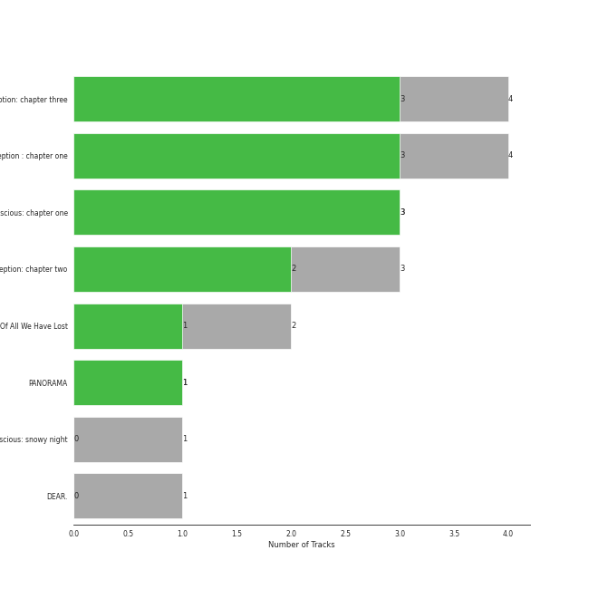

# MYSTIC STORY

14 songs

Appears as:
- MYSTIC STORY (14 tracks)

## Top Artists

See all 1 artists

| Number of Tracks | Art | Artist | 🔗 |
|---:|:---|:---|:---|
| 14 |  | [Billlie](../artists/billlie.md) | [🔗](https://open.spotify.com/artist/2GQxKDojobwBjZMPf7aoh0) |

## Top Albums

See all 4 albums

| Number of Tracks | Art | Album | Release Date | 🔗 |
|---:|:---|:---|:---|:---|
| 4 |  | the Billage of perception: chapter three | 2023-03-28 | [🔗](https://open.spotify.com/album/5bt0sTLia4il2rIlpqUo5g) |
| 4 |  | the Billage of perception : chapter one | 2021-11-10 | [🔗](https://open.spotify.com/album/1kp4txZsSpDNR4EoDFi2LD) |
| 3 |  | the collective soul and unconscious: chapter one | 2022-02-23 | [🔗](https://open.spotify.com/album/4ophrgcnwWi1I5nWYImyhw) |
| 3 |  | the Billage of perception: chapter two | 2022-08-31 | [🔗](https://open.spotify.com/album/0NuM7kwh6u6fIRjn7Zh7Ss) |

## Genres

See all 1 genres

| Number of Tracks | Genre |
|---:|:---|
| 14 | [k-pop](../genres/k_pop.md) |

## Tracks released under MYSTIC STORY

| Art | Track | Album | Artists | Label | 💚 | 🔗 |
|:---|:---|:---|:---|:---|:---|:---|
|  | RING X RING | the Billage of perception : chapter one | [Billlie](../artists/billlie.md) | [MYSTIC STORY](mystic_story.md) | 💚 | [🔗](https://open.spotify.com/track/4hfF0FOFcaiOtwY3NP5hnv) |
|  | everybody's got a $ECRET | the Billage of perception : chapter one | [Billlie](../artists/billlie.md) | [MYSTIC STORY](mystic_story.md) | 💚 | [🔗](https://open.spotify.com/track/490hT7WcJnqR69Tgb7uY2U) |
|  | flipp!ng a coin | the Billage of perception : chapter one | [Billlie](../artists/billlie.md) | [MYSTIC STORY](mystic_story.md) | | [🔗](https://open.spotify.com/track/2UQLDRnG7IwlXrdmYTA6sv) |
|  | the eleventh day | the Billage of perception : chapter one | [Billlie](../artists/billlie.md) | [MYSTIC STORY](mystic_story.md) | 💚 | [🔗](https://open.spotify.com/track/4YldhqpCghwJalBtiCRtl1) |
|  | GingaMingaYo (the strange world) | the collective soul and unconscious: chapter one | [Billlie](../artists/billlie.md) | [MYSTIC STORY](mystic_story.md) | 💚 | [🔗](https://open.spotify.com/track/3jHg6QE70y2FTdnsxSrCbv) |
|  | a sign ~ anonymous | the collective soul and unconscious: chapter one | [Billlie](../artists/billlie.md) | [MYSTIC STORY](mystic_story.md) | 💚 | [🔗](https://open.spotify.com/track/3PBgdAFxOThx0srS6VkS0F) |
|  | overlap (1/1) | the collective soul and unconscious: chapter one | [Billlie](../artists/billlie.md) | [MYSTIC STORY](mystic_story.md) | 💚 | [🔗](https://open.spotify.com/track/3VMbll8GQGlE1WuWaTPtxJ) |
|  | B’rave ~ a song for Matilda | the Billage of perception: chapter two | [Billlie](../artists/billlie.md) | [MYSTIC STORY](mystic_story.md) | | [🔗](https://open.spotify.com/track/78Kr4lzSgXyE11fq4ncILK) |
|  | Mcguffins ~ who’s the Joker? | the Billage of perception: chapter two | [Billlie](../artists/billlie.md) | [MYSTIC STORY](mystic_story.md) | 💚 | [🔗](https://open.spotify.com/track/1MtbRyRbGe4qXMSNN999iI) |
|  | RING ma Bell (what a wonderful world) | the Billage of perception: chapter two | [Billlie](../artists/billlie.md) | [MYSTIC STORY](mystic_story.md) | 💚 | [🔗](https://open.spotify.com/track/2b2Nibg3lTUTKctwwb7bEv) |
|  | EUNOIA | the Billage of perception: chapter three | [Billlie](../artists/billlie.md) | [MYSTIC STORY](mystic_story.md) | 💚 | [🔗](https://open.spotify.com/track/5ICowHre7VraSKaRw3do8N) |
|  | enchanted night ~ white night | the Billage of perception: chapter three | [Billlie](../artists/billlie.md) | [MYSTIC STORY](mystic_story.md) | 💚 | [🔗](https://open.spotify.com/track/0rTXn4ovXalJGkJMx5hsnX) |
|  | lionheart (the real me) | the Billage of perception: chapter three | [Billlie](../artists/billlie.md) | [MYSTIC STORY](mystic_story.md) | 💚 | [🔗](https://open.spotify.com/track/1ztAWoArE8k4zLunYD8IXa) |
|  | nevertheless | the Billage of perception: chapter three | [Billlie](../artists/billlie.md) | [MYSTIC STORY](mystic_story.md) | 💚 | [🔗](https://open.spotify.com/track/26fVl2CYeXXxD4yEqmhrpM) |
