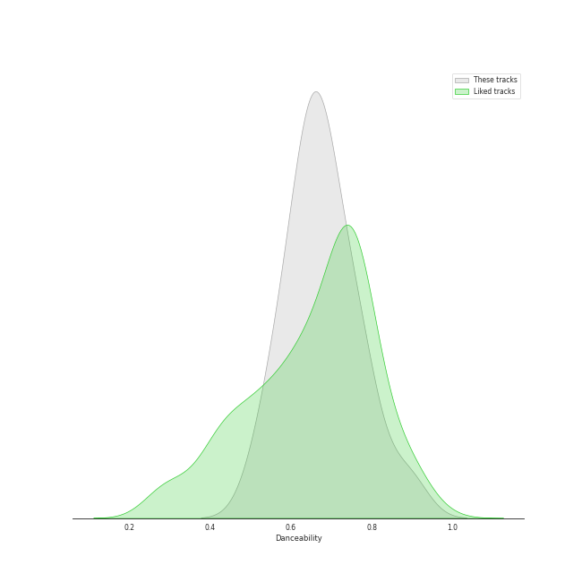
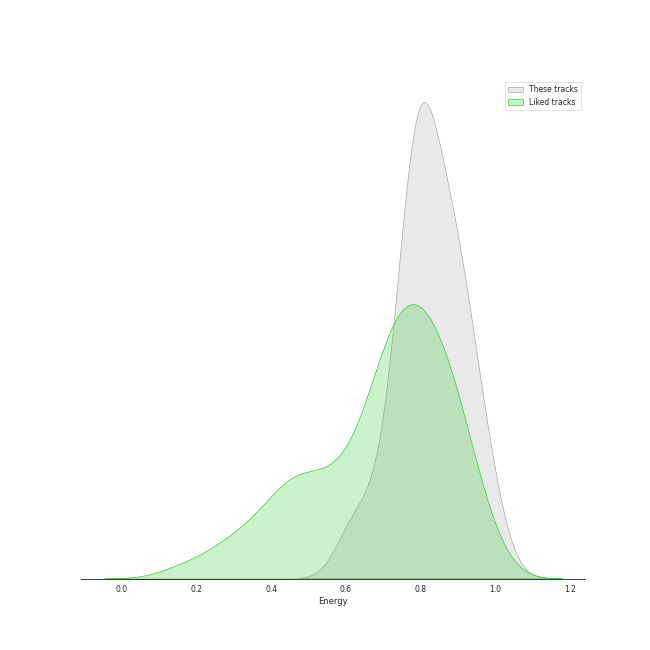
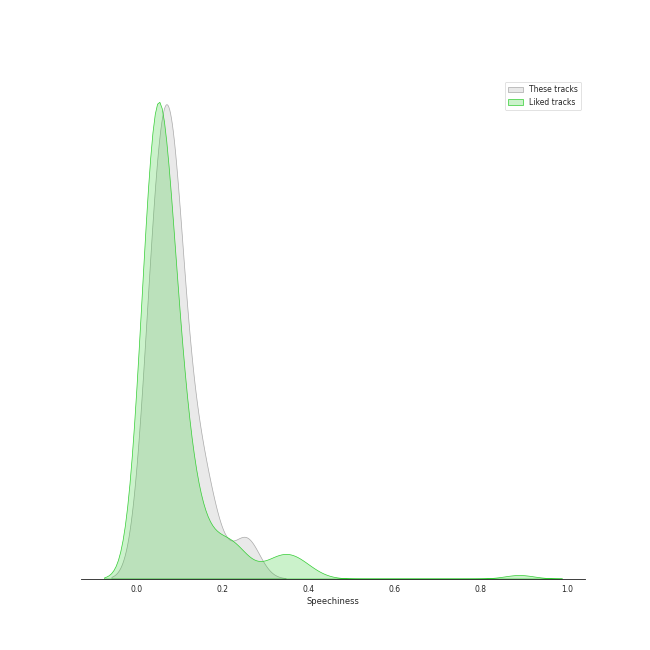
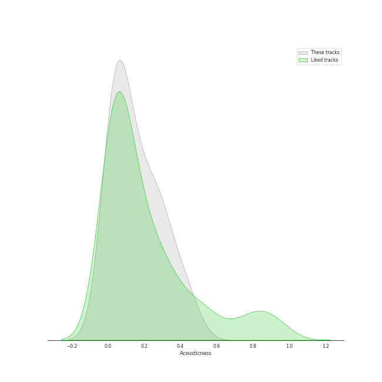
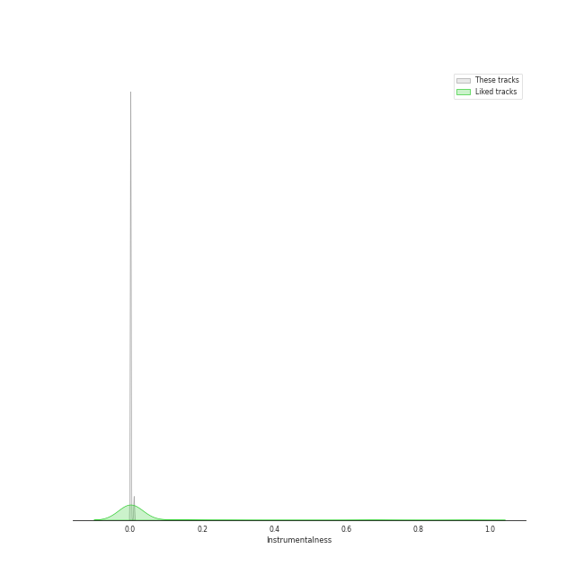
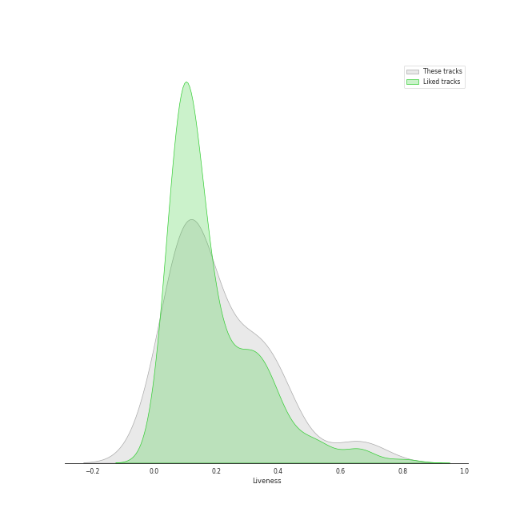
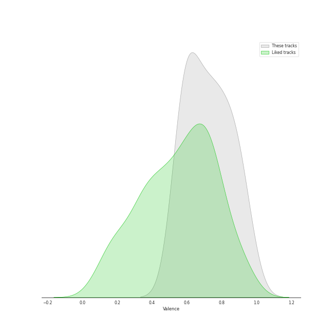
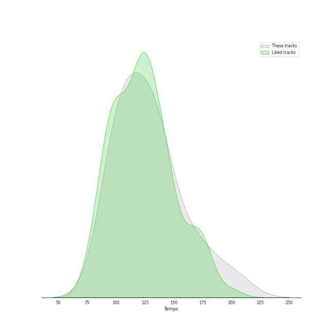

# Audio Features for MYSTIC STORY

## Danceability

| ​ | 10 most Danceable tracks | ​​ | 10 least Danceable tracks |
|:---|:---|:---|:---|
|  | GingaMingaYo (the strange world) (0.888) |  | RING X RING (0.565) |
|  | overlap (1/1) (0.796) |  | lionheart (the real me) (0.576) |
|  | EUNOIA (0.773) |  | the eleventh day (0.606) |
|  | flipp!ng a coin (0.751) |  | snowy night (0.621) |
|  | Mcguffins ~ who’s the Joker? (0.748) |  | RING ma Bell (what a wonderful world) (0.641) |
|  | enchanted night ~ white night (0.701) |  | a sign ~ anonymous (0.643) |
|  | nevertheless (0.687) |  | everybody's got a $ECRET (0.664) |
|  | B’rave ~ a song for Matilda (0.681) |  | B’rave ~ a song for Matilda (0.681) |
|  | everybody's got a $ECRET (0.664) |  | nevertheless (0.687) |
|  | a sign ~ anonymous (0.643) |  | enchanted night ~ white night (0.701) |

## Energy

| ​ | 10 most Energetic tracks | ​​ | 10 least Energetic tracks |
|:---|:---|:---|:---|
|  | RING X RING (0.987) |  | enchanted night ~ white night (0.621) |
|  | RING ma Bell (what a wonderful world) (0.947) |  | EUNOIA (0.753) |
|  | Mcguffins ~ who’s the Joker? (0.929) |  | nevertheless (0.761) |
|  | GingaMingaYo (the strange world) (0.901) |  | everybody's got a $ECRET (0.768) |
|  | flipp!ng a coin (0.887) |  | the eleventh day (0.79) |
|  | a sign ~ anonymous (0.845) |  | overlap (1/1) (0.793) |
|  | snowy night (0.812) |  | B’rave ~ a song for Matilda (0.795) |
|  | lionheart (the real me) (0.809) |  | lionheart (the real me) (0.809) |
|  | B’rave ~ a song for Matilda (0.795) |  | snowy night (0.812) |
|  | overlap (1/1) (0.793) |  | a sign ~ anonymous (0.845) |

## Speechiness

| ​ | 10 most Speechy tracks | ​​ | 10 least Speechy tracks |
|:---|:---|:---|:---|
|  | flipp!ng a coin (0.176) |  | snowy night (0.0367) |
|  | nevertheless (0.144) |  | overlap (1/1) (0.0453) |
|  | everybody's got a $ECRET (0.138) |  | a sign ~ anonymous (0.0663) |
|  | Mcguffins ~ who’s the Joker? (0.108) |  | EUNOIA (0.0666) |
|  | the eleventh day (0.0939) |  | RING X RING (0.0728) |
|  | RING ma Bell (what a wonderful world) (0.0886) |  | B’rave ~ a song for Matilda (0.0755) |
|  | lionheart (the real me) (0.088) |  | GingaMingaYo (the strange world) (0.079) |
|  | enchanted night ~ white night (0.0793) |  | enchanted night ~ white night (0.0793) |
|  | GingaMingaYo (the strange world) (0.079) |  | lionheart (the real me) (0.088) |
|  | B’rave ~ a song for Matilda (0.0755) |  | RING ma Bell (what a wonderful world) (0.0886) |

## Acousticness

| ​ | 10 most Acoustic tracks | ​​ | 10 least Acoustic tracks |
|:---|:---|:---|:---|
|  | everybody's got a $ECRET (0.298) |  | lionheart (the real me) (0.00543) |
|  | enchanted night ~ white night (0.282) |  | RING ma Bell (what a wonderful world) (0.026) |
|  | a sign ~ anonymous (0.221) |  | flipp!ng a coin (0.0297) |
|  | snowy night (0.213) |  | GingaMingaYo (the strange world) (0.0323) |
|  | overlap (1/1) (0.167) |  | EUNOIA (0.0344) |
|  | nevertheless (0.137) |  | RING X RING (0.0386) |
|  | B’rave ~ a song for Matilda (0.127) |  | the eleventh day (0.0492) |
|  | Mcguffins ~ who’s the Joker? (0.0879) |  | Mcguffins ~ who’s the Joker? (0.0879) |
|  | the eleventh day (0.0492) |  | B’rave ~ a song for Matilda (0.127) |
|  | RING X RING (0.0386) |  | nevertheless (0.137) |

## Instrumentalness

| ​ | 10 most Instrumental tracks | ​​ | 10 least Instrumental tracks |
|:---|:---|:---|:---|
|  | GingaMingaYo (the strange world) (0.00955) |  | enchanted night ~ white night (0.0) |
|  | flipp!ng a coin (0.000111) |  | lionheart (the real me) (0.0) |
|  | Mcguffins ~ who’s the Joker? (1.02e-05) |  | nevertheless (0.0) |
|  | RING ma Bell (what a wonderful world) (6.93e-06) |  | a sign ~ anonymous (0.0) |
|  | RING X RING (2.99e-06) |  | overlap (1/1) (0.0) |
|  | snowy night (0.0) |  | everybody's got a $ECRET (0.0) |
|  | B’rave ~ a song for Matilda (0.0) |  | the eleventh day (0.0) |
|  | EUNOIA (0.0) |  | EUNOIA (0.0) |
|  | the eleventh day (0.0) |  | B’rave ~ a song for Matilda (0.0) |
|  | everybody's got a $ECRET (0.0) |  | snowy night (0.0) |

## Liveness

| ​ | 10 most Live tracks | ​​ | 10 least Live tracks |
|:---|:---|:---|:---|
|  | lionheart (the real me) (0.661) |  | Mcguffins ~ who’s the Joker? (0.0354) |
|  | RING X RING (0.418) |  | EUNOIA (0.0766) |
|  | GingaMingaYo (the strange world) (0.357) |  | everybody's got a $ECRET (0.0899) |
|  | the eleventh day (0.349) |  | nevertheless (0.112) |
|  | B’rave ~ a song for Matilda (0.262) |  | enchanted night ~ white night (0.119) |
|  | snowy night (0.194) |  | flipp!ng a coin (0.122) |
|  | RING ma Bell (what a wonderful world) (0.132) |  | overlap (1/1) (0.125) |
|  | a sign ~ anonymous (0.128) |  | a sign ~ anonymous (0.128) |
|  | overlap (1/1) (0.125) |  | RING ma Bell (what a wonderful world) (0.132) |
|  | flipp!ng a coin (0.122) |  | snowy night (0.194) |

## Valence

| ​ | 10 most Happy tracks | ​​ | 10 least Happy tracks |
|:---|:---|:---|:---|
|  | overlap (1/1) (0.861) |  | lionheart (the real me) (0.545) |
|  | Mcguffins ~ who’s the Joker? (0.861) |  | everybody's got a $ECRET (0.572) |
|  | RING ma Bell (what a wonderful world) (0.801) |  | enchanted night ~ white night (0.586) |
|  | flipp!ng a coin (0.786) |  | EUNOIA (0.592) |
|  | a sign ~ anonymous (0.753) |  | the eleventh day (0.62) |
|  | snowy night (0.736) |  | RING X RING (0.647) |
|  | nevertheless (0.723) |  | GingaMingaYo (the strange world) (0.65) |
|  | B’rave ~ a song for Matilda (0.699) |  | B’rave ~ a song for Matilda (0.699) |
|  | GingaMingaYo (the strange world) (0.65) |  | nevertheless (0.723) |
|  | RING X RING (0.647) |  | snowy night (0.736) |

## Tempo

| ​ | 10 most Fast tracks | ​​ | 10 least Fast tracks |
|:---|:---|:---|:---|
|  | RING X RING (171.968) |  | a sign ~ anonymous (98.04) |
|  | the eleventh day (170.123) |  | nevertheless (99.942) |
|  | Mcguffins ~ who’s the Joker? (145.942) |  | snowy night (99.971) |
|  | everybody's got a $ECRET (139.773) |  | lionheart (the real me) (101.998) |
|  | RING ma Bell (what a wonderful world) (137.024) |  | EUNOIA (108.033) |
|  | B’rave ~ a song for Matilda (130.019) |  | enchanted night ~ white night (110.027) |
|  | flipp!ng a coin (124.96) |  | overlap (1/1) (116.042) |
|  | GingaMingaYo (the strange world) (121.997) |  | GingaMingaYo (the strange world) (121.997) |
|  | overlap (1/1) (116.042) |  | flipp!ng a coin (124.96) |
|  | enchanted night ~ white night (110.027) |  | B’rave ~ a song for Matilda (130.019) |
