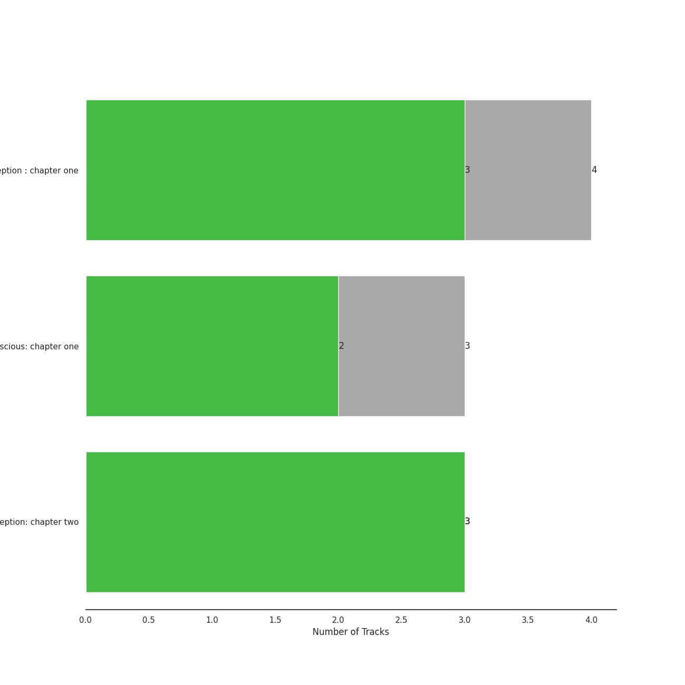
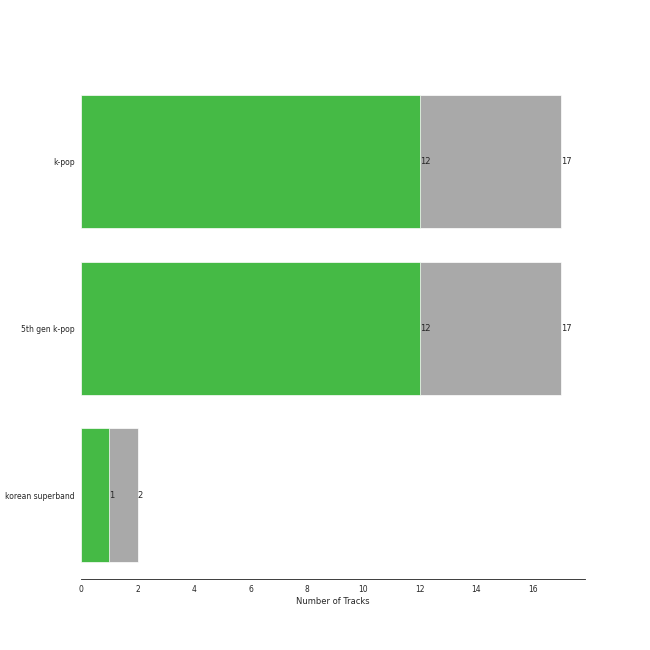
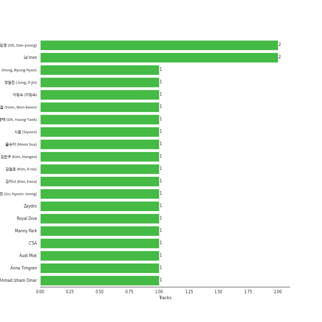

# MYSTIC STORY

17 songs

[See Track Features](audio_features.md)

[See Clusters](clusters/overview.md)

Appears as:
- MYSTIC STORY (17 tracks)

## Top Artists

| Art | Rank | Tracks | 💚 | Artist | 🔗 |
|:---|---:|---:|---:|:---|:---|
|  | 22 | 15 | 11 | [Billlie](../../artists/billlie/overview.md) | [🔗](https://open.spotify.com/artist/2GQxKDojobwBjZMPf7aoh0) |
|  | 169 | 2 | 1 | LUCY | [🔗](https://open.spotify.com/artist/4eh2JeBpQaScfHKKXZh5vO) |

## Top Albums

| Art | Rank | Tracks | 💚 | Album | Release Date | 🔗 |
|:---|---:|---:|---:|:---|:---|:---|
|  | 75 | 4 | 3 | the Billage of perception: chapter three | 2023-03-28 | [🔗](https://open.spotify.com/album/5bt0sTLia4il2rIlpqUo5g) |
|  | 71 | 4 | 3 | the Billage of perception : chapter one | 2021-11-10 | [🔗](https://open.spotify.com/album/1kp4txZsSpDNR4EoDFi2LD) |
|  | 543 | 3 | 3 | the collective soul and unconscious: chapter one | 2022-02-23 | [🔗](https://open.spotify.com/album/4ophrgcnwWi1I5nWYImyhw) |
|  | 168 | 3 | 2 | the Billage of perception: chapter two | 2022-08-31 | [🔗](https://open.spotify.com/album/0NuM7kwh6u6fIRjn7Zh7Ss) |
|  | 650 | 1 | 1 | PANORAMA | 2020-08-13 | [🔗](https://open.spotify.com/album/5KCwE9Ev3dhkvQOzPCR6Yx) |
|  | 650 | 1 | 0 | the collective soul and unconscious: snowy night | 2021-12-14 | [🔗](https://open.spotify.com/album/1wFkvpm5VhzNDNo8xqdBV1) |
|  | 650 | 1 | 0 | DEAR. | 2020-05-08 | [🔗](https://open.spotify.com/album/70J3PvQ7lVT5YWswgcSwWt) |

## Genres

| Tracks | 💚 | Genre |
|---:|---:|:---|
| 15 | 11 | [k-pop](../../genres/k-pop/overview.md) |
| 15 | 11 | [5th gen k-pop](../../genres/5th_gen_k-pop/overview.md) |
| 2 | 1 | korean superband |

## Top Producers

| Art | Producer | Tracks | Credit Types |
|:---|:---|---:|:---|
| | 오단영 (Oh, Dan-young) | 2 | Producer |
| | 문수아 (Moon Sua) | 1 | Lyricist |
| | Ahmad Izham Omar | 1 | Songwriter |
| | [김이나 (Kim, Eana)](../../producers/김이나_(kim,_eana)/overview.md) | 1 | Lyricist |
| | Anna Timgren | 1 | Songwriter |
| | Le'mon | 1 | Lyricist |
| | 시윤 (Siyoon) | 1 | Lyricist |
| | Zaydro | 1 | Songwriter |
| | [이민수 (이민수)](../../producers/이민수_(이민수)/overview.md) | 1 | Arranger, Songwriter |
| | 고현정 (Go, Hyeon-Jeong) | 1 | Producer |

View all

| Art | Producer | Tracks | Credit Types |
|:---|:---|---:|:---|
| | Audi Mok | 1 | Songwriter |
| | 김일호 (Kim, Il-Ho) | 1 | Producer |

## Tracks released under MYSTIC STORY

| Art | Track | Album | Artists | Label | Rank | 💚 | 🔗 |
|:---|:---|:---|:---|:---|---:|:---|:---|
|  | RING X RING | the Billage of perception : chapter one | [Billlie](../../artists/billlie/overview.md) | [MYSTIC STORY](.) | 76 | 💚 | [🔗](https://open.spotify.com/track/4hfF0FOFcaiOtwY3NP5hnv) |
|  | enchanted night ~ white night | the Billage of perception: chapter three | [Billlie](../../artists/billlie/overview.md) | [MYSTIC STORY](.) | 111 | 💚 | [🔗](https://open.spotify.com/track/0rTXn4ovXalJGkJMx5hsnX) |
|  | EUNOIA | the Billage of perception: chapter three | [Billlie](../../artists/billlie/overview.md) | [MYSTIC STORY](.) | 142 | 💚 | [🔗](https://open.spotify.com/track/5ICowHre7VraSKaRw3do8N) |
|  | RING ma Bell (what a wonderful world) | the Billage of perception: chapter two | [Billlie](../../artists/billlie/overview.md) | [MYSTIC STORY](.) | 228 | 💚 | [🔗](https://open.spotify.com/track/2b2Nibg3lTUTKctwwb7bEv) |
|  | nevertheless | the Billage of perception: chapter three | [Billlie](../../artists/billlie/overview.md) | [MYSTIC STORY](.) | 701 | 💚 | [🔗](https://open.spotify.com/track/26fVl2CYeXXxD4yEqmhrpM) |
|  | everybody's got a $ECRET | the Billage of perception : chapter one | [Billlie](../../artists/billlie/overview.md) | [MYSTIC STORY](.) | 714 | 💚 | [🔗](https://open.spotify.com/track/490hT7WcJnqR69Tgb7uY2U) |
|  | overlap (1/1) | the collective soul and unconscious: chapter one | [Billlie](../../artists/billlie/overview.md) | [MYSTIC STORY](.) | 812 | 💚 | [🔗](https://open.spotify.com/track/3VMbll8GQGlE1WuWaTPtxJ) |
|  | Flowering | DEAR. | LUCY | [MYSTIC STORY](.) | 984 | | [🔗](https://open.spotify.com/track/1ygmHMAn6HYtCrQ4fHqD0x) |
|  | Jogging | PANORAMA | LUCY | [MYSTIC STORY](.) | 984 | 💚 | [🔗](https://open.spotify.com/track/2U4fODlayH2blucJuyjBrU) |
|  | flipp!ng a coin | the Billage of perception : chapter one | [Billlie](../../artists/billlie/overview.md) | [MYSTIC STORY](.) | 984 | | [🔗](https://open.spotify.com/track/2UQLDRnG7IwlXrdmYTA6sv) |

See all tracks

| Art | Track | Album | Artists | Label | Rank | 💚 | 🔗 |
|:---|:---|:---|:---|:---|---:|:---|:---|
|  | the eleventh day | the Billage of perception : chapter one | [Billlie](../../artists/billlie/overview.md) | [MYSTIC STORY](.) | 984 | 💚 | [🔗](https://open.spotify.com/track/4YldhqpCghwJalBtiCRtl1) |
|  | snowy night | the collective soul and unconscious: snowy night | [Billlie](../../artists/billlie/overview.md) | [MYSTIC STORY](.) | 984 | | [🔗](https://open.spotify.com/track/7ajApbhtm75giJ9Sj6qRnO) |
|  | GingaMingaYo (the strange world) | the collective soul and unconscious: chapter one | [Billlie](../../artists/billlie/overview.md) | [MYSTIC STORY](.) | 984 | 💚 | [🔗](https://open.spotify.com/track/3jHg6QE70y2FTdnsxSrCbv) |
|  | a sign ~ anonymous | the collective soul and unconscious: chapter one | [Billlie](../../artists/billlie/overview.md) | [MYSTIC STORY](.) | 984 | 💚 | [🔗](https://open.spotify.com/track/3PBgdAFxOThx0srS6VkS0F) |
|  | B’rave ~ a song for Matilda | the Billage of perception: chapter two | [Billlie](../../artists/billlie/overview.md) | [MYSTIC STORY](.) | 984 | | [🔗](https://open.spotify.com/track/78Kr4lzSgXyE11fq4ncILK) |
|  | Mcguffins ~ who’s the Joker? | the Billage of perception: chapter two | [Billlie](../../artists/billlie/overview.md) | [MYSTIC STORY](.) | 984 | 💚 | [🔗](https://open.spotify.com/track/1MtbRyRbGe4qXMSNN999iI) |
|  | lionheart (the real me) | the Billage of perception: chapter three | [Billlie](../../artists/billlie/overview.md) | [MYSTIC STORY](.) | 984 | | [🔗](https://open.spotify.com/track/1ztAWoArE8k4zLunYD8IXa) |

