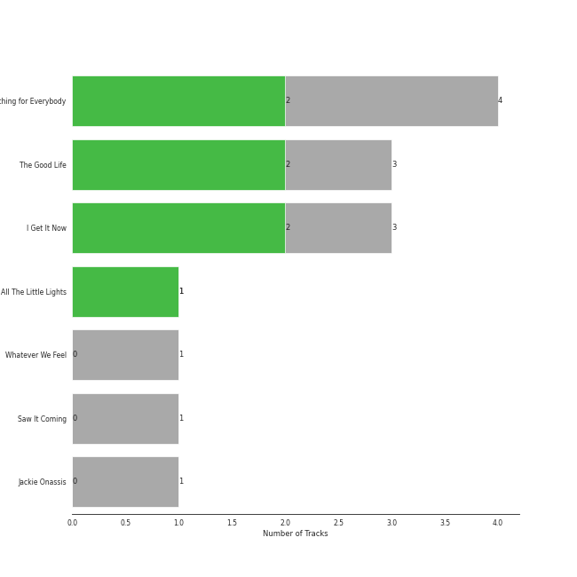
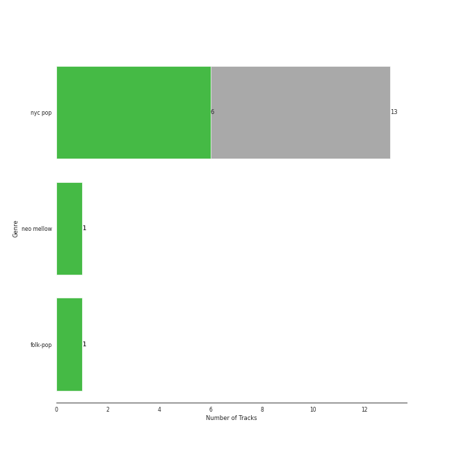

# Nettwerk Music Group

10 songs

Appears as:
- Nettwerk Music Group (10 tracks)

## Top Artists

| Art | Rank | Tracks | 💚 | Artist | 🔗 |
|:---|---:|---:|---:|:---|:---|
|  | 143 | 9 | 4 | Sammy Rae & The Friends | [🔗](https://open.spotify.com/artist/3lFDsTyYNPQc8WzJExnQWn) |
|  | 410 | 1 | 1 | Passenger | [🔗](https://open.spotify.com/artist/0gadJ2b9A4SKsB1RFkBb66) |

## Top Albums

| Art | Rank | Tracks | 💚 | Album | Release Date | 🔗 |
|:---|---:|---:|---:|:---|:---|:---|
|  | 216 | 3 | 2 | The Good Life | 2018-07-10 | [🔗](https://open.spotify.com/album/4s1igjt5YJe7s7BdCeX3DX) |
|  | 538 | 3 | 2 | I Get It Now | 2024-04-12 | [🔗](https://open.spotify.com/album/5zZHAGHasjwkR9B1xX3Xq6) |
|  | 604 | 1 | 1 | All The Little Lights | 2012-08-28 | [🔗](https://open.spotify.com/album/52ukyDfkPmF4X6EcSYVfVJ) |
|  | 604 | 1 | 0 | Whatever We Feel | 2020-04-03 | [🔗](https://open.spotify.com/album/4Qcemk272gcxq9D6ca40Xz) |
|  | 604 | 1 | 0 | Saw It Coming | 2019-05-10 | [🔗](https://open.spotify.com/album/1rMlFYPvk8FFDQYIJ8pudV) |
|  | 604 | 1 | 0 | Jackie Onassis | 2020-06-05 | [🔗](https://open.spotify.com/album/0E8rl16O1VgYyRMRzff3r6) |

## Genres

| Tracks | 💚 | Genre |
|---:|---:|:---|
| 9 | 4 | nyc pop |
| 1 | 1 | [neo mellow](../../genres/neo_mellow/overview.md) |
| 1 | 1 | folk-pop |

## Top Producers

| Art | Producer | Tracks | Credit Types |
|:---|:---|---:|:---|
|  | Passenger | 1 | Lyricist, Songwriter |

## Tracks released under Nettwerk Music Group

| Art | Track | Album | Artists | Label | Rank | 💚 | 🔗 |
|:---|:---|:---|:---|:---|---:|:---|:---|
|  | Talk It Up | The Good Life | Sammy Rae & The Friends | [Nettwerk Music Group](.) | 295 | 💚 | [🔗](https://open.spotify.com/track/7FQCZ5i5bmQ76LoGHyVcX0) |
|  | I Get It Now | I Get It Now | Sammy Rae & The Friends | [Nettwerk Music Group](.) | 808 | 💚 | [🔗](https://open.spotify.com/track/03ECDyILFfQ98k106zwcIt) |
|  | Let Her Go | All The Little Lights | Passenger | [Nettwerk Music Group](.) | 909 | 💚 | [🔗](https://open.spotify.com/track/1KxwZYyzWNyZSRyErj2ojT) |
|  | Kick It to Me | The Good Life | Sammy Rae & The Friends | [Nettwerk Music Group](.) | 909 | 💚 | [🔗](https://open.spotify.com/track/6QZbDUZEgkwaVWROtWzjQ0) |
|  | The Feeling | The Good Life | Sammy Rae & The Friends | [Nettwerk Music Group](.) | 909 | | [🔗](https://open.spotify.com/track/0dmCos7GHCr5PRKp5LNGH7) |
|  | Saw It Coming | Saw It Coming | Sammy Rae & The Friends | [Nettwerk Music Group](.) | 909 | | [🔗](https://open.spotify.com/track/0hU26xDCONlEnAtcMGw4NC) |
|  | Whatever We Feel | Whatever We Feel | Sammy Rae & The Friends | [Nettwerk Music Group](.) | 909 | | [🔗](https://open.spotify.com/track/4H9jGVkfJkjc6pWFfn2KSN) |
|  | Jackie Onassis | Jackie Onassis | Sammy Rae & The Friends | [Nettwerk Music Group](.) | 909 | | [🔗](https://open.spotify.com/track/7GPBA8xjMJyN6SjoKd4O9E) |
|  | Coming Home Song | I Get It Now | Sammy Rae & The Friends | [Nettwerk Music Group](.) | 909 | | [🔗](https://open.spotify.com/track/3RhLH5ROodko8Se1kRpjJ1) |
|  | Thieves | I Get It Now | Sammy Rae & The Friends | [Nettwerk Music Group](.) | 909 | 💚 | [🔗](https://open.spotify.com/track/5v4JBxzAfArnWg3n3MhRRl) |
