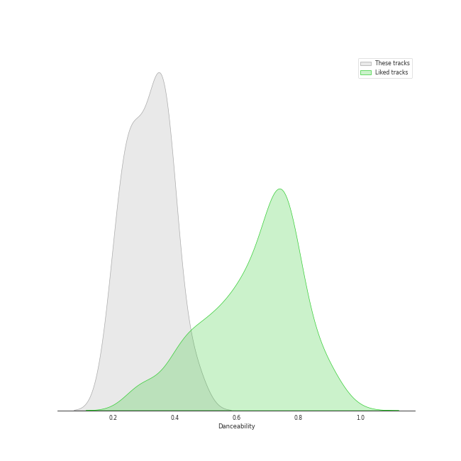
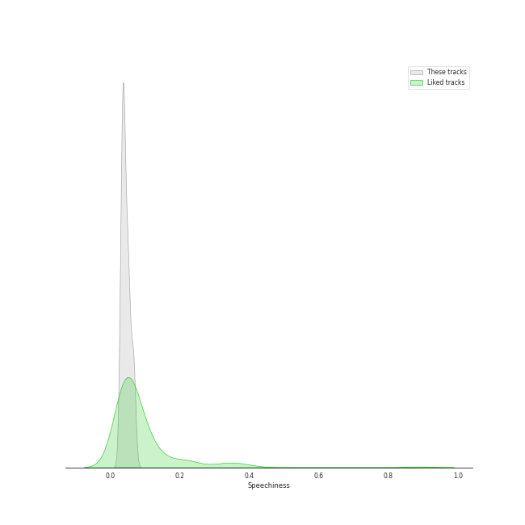

# Audio Features for Nimbus Records

## Danceability

| ​ | 10 most Danceable tracks | ​​ | 10 least Danceable tracks |
|:---|:---|:---|:---|
|  | Études, L. 136: II. Pour les Accords (0.464) |  | Children's Corner, L. 113: I. Doctor Gradus ad Parnassum (0.191) |
|  | Children's Corner, L. 113: III. Golliwogg's Cake-Walk (0.398) |  | La Plus que Lente, L. 121 (0.219) |
|  | Préludes Book 1, L. 117: IV. Minstrels (0.389) |  | Masques, L. 105 (0.224) |
|  | Préludes Book 1, L. 117: I. Des Pas sur La Neige (0.376) |  | Préludes Book 2, L. 123: III. Feux d'Artifice (0.241) |
|  | Préludes Book 2, L. 123: I. General Lavine (0.376) |  | Children's Corner, L. 113: II. The Snow is Dancing (0.25) |
|  | Préludes Book 1, L. 117: III. La Cathedrale Engloutie (0.365) |  | Estampes, L. 100: Jardins sous La Pluie (0.257) |
|  | La Fille aux Cheveux de Lin, L. 33 (0.362) |  | Images, Set 1, L. 110: Reflets dans L'eau (0.272) |
|  | Suite Bergamasque, L. 75: Passepied (0.337) |  | Études, L. 136: I. Pour les Arpeges Composes (0.281) |
|  | Clair de Lune, L. 32 (0.335) |  | Préludes Book 1, L. 117: II. Ce qu'a vu Le Vent d'Ouest (0.294) |
|  | Images, Set 2, L. 111: et la Lune descend sur le Temple qui fut (0.333) |  | Préludes Book 2, L. 123: II. Canope (0.325) |

## Energy

| ​ | 10 most Energetic tracks | ​​ | 10 least Energetic tracks |
|:---|:---|:---|:---|
|  | Préludes Book 1, L. 117: II. Ce qu'a vu Le Vent d'Ouest (0.132) |  | Préludes Book 1, L. 117: I. Des Pas sur La Neige (0.000594) |
|  | Études, L. 136: II. Pour les Accords (0.109) |  | Images, Set 2, L. 111: et la Lune descend sur le Temple qui fut (0.00104) |
|  | Children's Corner, L. 113: III. Golliwogg's Cake-Walk (0.0686) |  | Préludes Book 2, L. 123: II. Canope (0.00148) |
|  | Préludes Book 2, L. 123: III. Feux d'Artifice (0.0651) |  | La Fille aux Cheveux de Lin, L. 33 (0.00218) |
|  | Estampes, L. 100: Jardins sous La Pluie (0.0593) |  | Préludes Book 1, L. 117: III. La Cathedrale Engloutie (0.00259) |
|  | Masques, L. 105 (0.0584) |  | Clair de Lune, L. 32 (0.00532) |
|  | Children's Corner, L. 113: I. Doctor Gradus ad Parnassum (0.0529) |  | Images, Set 1, L. 110: Reflets dans L'eau (0.00658) |
|  | Suite Bergamasque, L. 75: Passepied (0.0247) |  | La Plus que Lente, L. 121 (0.00851) |
|  | Children's Corner, L. 113: II. The Snow is Dancing (0.0199) |  | Préludes Book 2, L. 123: I. General Lavine (0.0126) |
|  | Préludes Book 1, L. 117: IV. Minstrels (0.0179) |  | Études, L. 136: I. Pour les Arpeges Composes (0.0175) |

## Speechiness

| ​ | 10 most Speechy tracks | ​​ | 10 least Speechy tracks |
|:---|:---|:---|:---|
|  | Préludes Book 2, L. 123: II. Canope (0.0681) |  | Préludes Book 1, L. 117: IV. Minstrels (0.0315) |
|  | Études, L. 136: II. Pour les Accords (0.0664) |  | Suite Bergamasque, L. 75: Passepied (0.0335) |
|  | Images, Set 2, L. 111: et la Lune descend sur le Temple qui fut (0.0663) |  | Masques, L. 105 (0.0356) |
|  | La Fille aux Cheveux de Lin, L. 33 (0.0543) |  | Études, L. 136: I. Pour les Arpeges Composes (0.0358) |
|  | Préludes Book 1, L. 117: I. Des Pas sur La Neige (0.0528) |  | Préludes Book 1, L. 117: II. Ce qu'a vu Le Vent d'Ouest (0.0361) |
|  | Préludes Book 1, L. 117: III. La Cathedrale Engloutie (0.0527) |  | Children's Corner, L. 113: II. The Snow is Dancing (0.0362) |
|  | Children's Corner, L. 113: III. Golliwogg's Cake-Walk (0.051) |  | Estampes, L. 100: Jardins sous La Pluie (0.0363) |
|  | La Plus que Lente, L. 121 (0.0499) |  | Clair de Lune, L. 32 (0.0376) |
|  | Préludes Book 2, L. 123: I. General Lavine (0.0432) |  | Children's Corner, L. 113: I. Doctor Gradus ad Parnassum (0.0398) |
|  | Images, Set 1, L. 110: Reflets dans L'eau (0.0414) |  | Préludes Book 2, L. 123: III. Feux d'Artifice (0.04) |

## Acousticness

| ​ | 10 most Acoustic tracks | ​​ | 10 least Acoustic tracks |
|:---|:---|:---|:---|
|  | La Plus que Lente, L. 121 (0.995) |  | Images, Set 2, L. 111: et la Lune descend sur le Temple qui fut (0.988) |
|  | La Fille aux Cheveux de Lin, L. 33 (0.995) |  | Préludes Book 1, L. 117: I. Des Pas sur La Neige (0.988) |
|  | Études, L. 136: II. Pour les Accords (0.994) |  | Préludes Book 1, L. 117: III. La Cathedrale Engloutie (0.989) |
|  | Children's Corner, L. 113: III. Golliwogg's Cake-Walk (0.994) |  | Préludes Book 2, L. 123: II. Canope (0.99) |
|  | Clair de Lune, L. 32 (0.994) |  | Préludes Book 1, L. 117: II. Ce qu'a vu Le Vent d'Ouest (0.992) |
|  | Études, L. 136: I. Pour les Arpeges Composes (0.994) |  | Préludes Book 2, L. 123: III. Feux d'Artifice (0.992) |
|  | Préludes Book 1, L. 117: IV. Minstrels (0.994) |  | Images, Set 1, L. 110: Reflets dans L'eau (0.992) |
|  | Suite Bergamasque, L. 75: Passepied (0.994) |  | Masques, L. 105 (0.993) |
|  | Children's Corner, L. 113: I. Doctor Gradus ad Parnassum (0.994) |  | Préludes Book 2, L. 123: I. General Lavine (0.993) |
|  | Estampes, L. 100: Jardins sous La Pluie (0.993) |  | Children's Corner, L. 113: II. The Snow is Dancing (0.993) |

## Instrumentalness

| ​ | 10 most Instrumental tracks | ​​ | 10 least Instrumental tracks |
|:---|:---|:---|:---|
|  | Estampes, L. 100: Jardins sous La Pluie (0.948) |  | Préludes Book 2, L. 123: III. Feux d'Artifice (0.435) |
|  | Études, L. 136: I. Pour les Arpeges Composes (0.946) |  | Images, Set 2, L. 111: et la Lune descend sur le Temple qui fut (0.629) |
|  | Children's Corner, L. 113: I. Doctor Gradus ad Parnassum (0.946) |  | Images, Set 1, L. 110: Reflets dans L'eau (0.787) |
|  | La Fille aux Cheveux de Lin, L. 33 (0.945) |  | Études, L. 136: II. Pour les Accords (0.812) |
|  | Children's Corner, L. 113: II. The Snow is Dancing (0.942) |  | La Plus que Lente, L. 121 (0.833) |
|  | Préludes Book 2, L. 123: II. Canope (0.942) |  | Masques, L. 105 (0.882) |
|  | Préludes Book 1, L. 117: IV. Minstrels (0.926) |  | Préludes Book 2, L. 123: I. General Lavine (0.885) |
|  | Préludes Book 1, L. 117: III. La Cathedrale Engloutie (0.925) |  | Préludes Book 1, L. 117: I. Des Pas sur La Neige (0.887) |
|  | Préludes Book 1, L. 117: II. Ce qu'a vu Le Vent d'Ouest (0.921) |  | Children's Corner, L. 113: III. Golliwogg's Cake-Walk (0.895) |
|  | Clair de Lune, L. 32 (0.912) |  | Suite Bergamasque, L. 75: Passepied (0.909) |

## Liveness

| ​ | 10 most Live tracks | ​​ | 10 least Live tracks |
|:---|:---|:---|:---|
|  | Children's Corner, L. 113: III. Golliwogg's Cake-Walk (0.192) |  | Préludes Book 2, L. 123: II. Canope (0.0553) |
|  | Préludes Book 2, L. 123: I. General Lavine (0.137) |  | Préludes Book 1, L. 117: I. Des Pas sur La Neige (0.0588) |
|  | Préludes Book 1, L. 117: II. Ce qu'a vu Le Vent d'Ouest (0.135) |  | Images, Set 2, L. 111: et la Lune descend sur le Temple qui fut (0.0589) |
|  | Images, Set 1, L. 110: Reflets dans L'eau (0.123) |  | Études, L. 136: II. Pour les Accords (0.0614) |
|  | Estampes, L. 100: Jardins sous La Pluie (0.108) |  | Clair de Lune, L. 32 (0.0621) |
|  | La Plus que Lente, L. 121 (0.095) |  | Préludes Book 1, L. 117: III. La Cathedrale Engloutie (0.0627) |
|  | Children's Corner, L. 113: I. Doctor Gradus ad Parnassum (0.0905) |  | La Fille aux Cheveux de Lin, L. 33 (0.064) |
|  | Suite Bergamasque, L. 75: Passepied (0.0898) |  | Préludes Book 2, L. 123: III. Feux d'Artifice (0.0667) |
|  | Masques, L. 105 (0.0887) |  | Préludes Book 1, L. 117: IV. Minstrels (0.0675) |
|  | Children's Corner, L. 113: II. The Snow is Dancing (0.0768) |  | Études, L. 136: I. Pour les Arpeges Composes (0.071) |

## Valence

| ​ | 10 most Happy tracks | ​​ | 10 least Happy tracks |
|:---|:---|:---|:---|
|  | Children's Corner, L. 113: III. Golliwogg's Cake-Walk (0.414) |  | Préludes Book 2, L. 123: III. Feux d'Artifice (0.0327) |
|  | Préludes Book 2, L. 123: I. General Lavine (0.223) |  | Images, Set 1, L. 110: Reflets dans L'eau (0.0331) |
|  | Préludes Book 1, L. 117: IV. Minstrels (0.215) |  | Préludes Book 1, L. 117: II. Ce qu'a vu Le Vent d'Ouest (0.0333) |
|  | Suite Bergamasque, L. 75: Passepied (0.192) |  | Masques, L. 105 (0.0367) |
|  | La Fille aux Cheveux de Lin, L. 33 (0.182) |  | Études, L. 136: II. Pour les Accords (0.0382) |
|  | Children's Corner, L. 113: II. The Snow is Dancing (0.149) |  | Préludes Book 1, L. 117: III. La Cathedrale Engloutie (0.0383) |
|  | Préludes Book 1, L. 117: I. Des Pas sur La Neige (0.105) |  | Clair de Lune, L. 32 (0.0397) |
|  | La Plus que Lente, L. 121 (0.105) |  | Estampes, L. 100: Jardins sous La Pluie (0.0399) |
|  | Children's Corner, L. 113: I. Doctor Gradus ad Parnassum (0.0853) |  | Images, Set 2, L. 111: et la Lune descend sur le Temple qui fut (0.0476) |
|  | Études, L. 136: I. Pour les Arpeges Composes (0.0539) |  | Préludes Book 2, L. 123: II. Canope (0.0494) |

## Tempo

| ​ | 10 most Fast tracks | ​​ | 10 least Fast tracks |
|:---|:---|:---|:---|
|  | Études, L. 136: I. Pour les Arpeges Composes (139.878) |  | Clair de Lune, L. 32 (65.832) |
|  | La Fille aux Cheveux de Lin, L. 33 (109.601) |  | Préludes Book 1, L. 117: III. La Cathedrale Engloutie (66.573) |
|  | Préludes Book 1, L. 117: II. Ce qu'a vu Le Vent d'Ouest (106.359) |  | Images, Set 1, L. 110: Reflets dans L'eau (69.004) |
|  | Children's Corner, L. 113: II. The Snow is Dancing (105.073) |  | La Plus que Lente, L. 121 (70.119) |
|  | Estampes, L. 100: Jardins sous La Pluie (104.424) |  | Children's Corner, L. 113: III. Golliwogg's Cake-Walk (72.406) |
|  | Études, L. 136: II. Pour les Accords (100.118) |  | Préludes Book 2, L. 123: II. Canope (74.461) |
|  | Préludes Book 2, L. 123: I. General Lavine (95.819) |  | Images, Set 2, L. 111: et la Lune descend sur le Temple qui fut (80.257) |
|  | Préludes Book 1, L. 117: IV. Minstrels (94.043) |  | Préludes Book 1, L. 117: I. Des Pas sur La Neige (81.577) |
|  | Préludes Book 2, L. 123: III. Feux d'Artifice (92.939) |  | Children's Corner, L. 113: I. Doctor Gradus ad Parnassum (85.934) |
|  | Masques, L. 105 (92.243) |  | Suite Bergamasque, L. 75: Passepied (89.813) |
