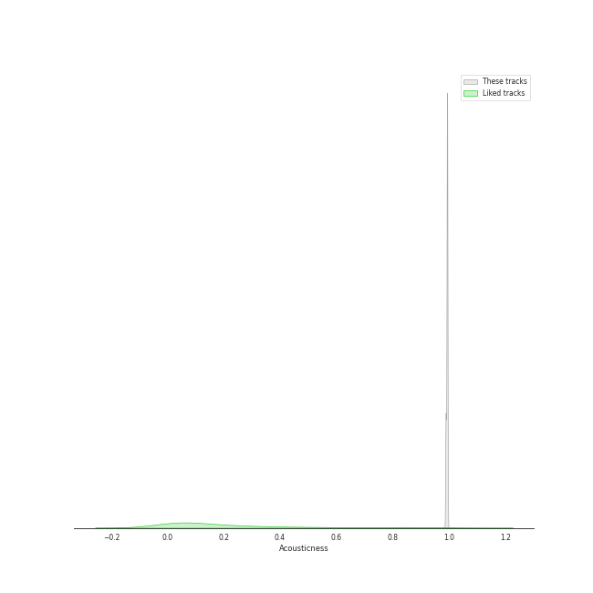
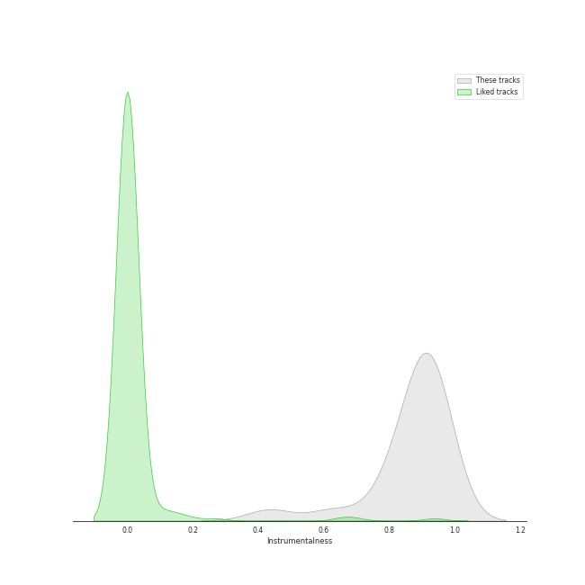
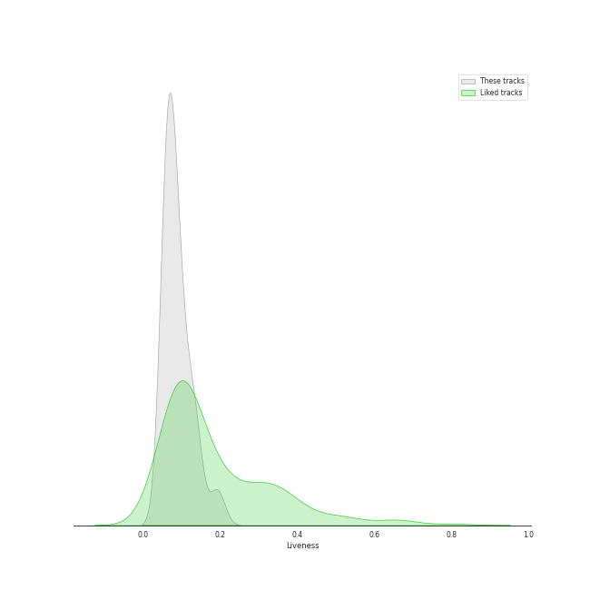
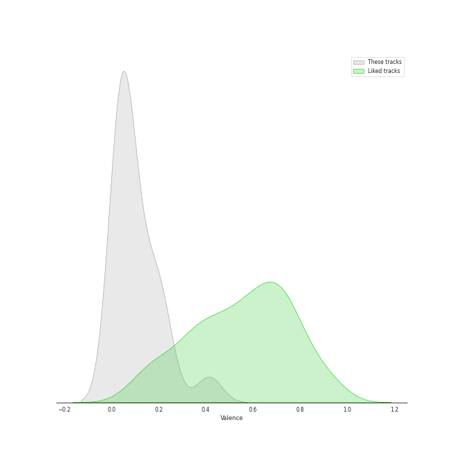
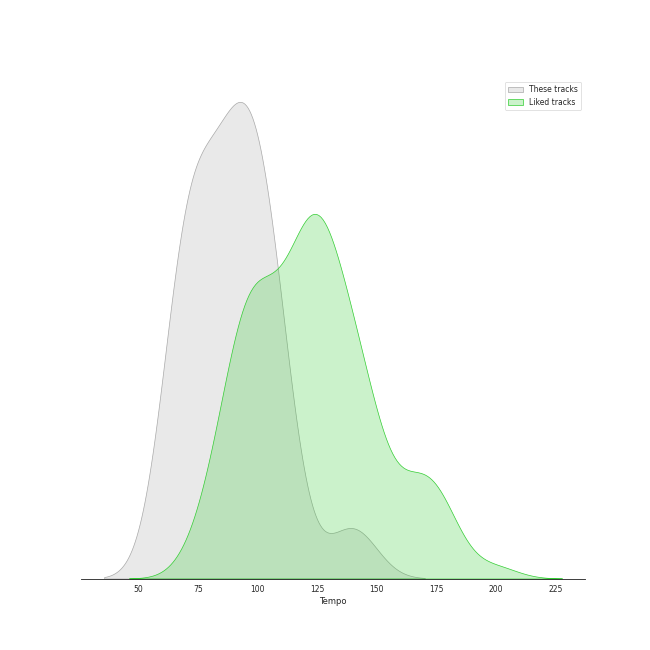

# Audio Features for Nimbus Records

## Danceability

| 10 most Danceable tracks | 10 least Danceable tracks |
|:---|:---|
| Études, L. 136: II. Pour les Accords (0.464) | Children's Corner, L. 113: I. Doctor Gradus ad Parnassum (0.191) |
| Children's Corner, L. 113: III. Golliwogg's Cake-Walk (0.398) | La Plus que Lente, L. 121 (0.219) |
| Préludes Book 1, L. 117: IV. Minstrels (0.389) | Masques, L. 105 (0.224) |
| Préludes Book 1, L. 117: I. Des Pas sur La Neige (0.376) | Préludes Book 2, L. 123: III. Feux d'Artifice (0.241) |
| Préludes Book 2, L. 123: I. General Lavine (0.376) | Children's Corner, L. 113: II. The Snow is Dancing (0.25) |
| Préludes Book 1, L. 117: III. La Cathedrale Engloutie (0.365) | Estampes, L. 100: Jardins sous La Pluie (0.257) |
| La Fille aux Cheveux de Lin, L. 33 (0.362) | Images, Set 1, L. 110: Reflets dans L'eau (0.272) |
| Suite Bergamasque, L. 75: Passepied (0.337) | Études, L. 136: I. Pour les Arpeges Composes (0.281) |
| Clair de Lune, L. 32 (0.335) | Préludes Book 1, L. 117: II. Ce qu'a vu Le Vent d'Ouest (0.294) |
| Images, Set 2, L. 111: et la Lune descend sur le Temple qui fut (0.333) | Préludes Book 2, L. 123: II. Canope (0.325) |

## Energy

| 10 most Energetic tracks | 10 least Energetic tracks |
|:---|:---|
| Préludes Book 1, L. 117: II. Ce qu'a vu Le Vent d'Ouest (0.132) | Préludes Book 1, L. 117: I. Des Pas sur La Neige (0.000594) |
| Études, L. 136: II. Pour les Accords (0.109) | Images, Set 2, L. 111: et la Lune descend sur le Temple qui fut (0.00104) |
| Children's Corner, L. 113: III. Golliwogg's Cake-Walk (0.0686) | Préludes Book 2, L. 123: II. Canope (0.00148) |
| Préludes Book 2, L. 123: III. Feux d'Artifice (0.0651) | La Fille aux Cheveux de Lin, L. 33 (0.00218) |
| Estampes, L. 100: Jardins sous La Pluie (0.0593) | Préludes Book 1, L. 117: III. La Cathedrale Engloutie (0.00259) |
| Masques, L. 105 (0.0584) | Clair de Lune, L. 32 (0.00532) |
| Children's Corner, L. 113: I. Doctor Gradus ad Parnassum (0.0529) | Images, Set 1, L. 110: Reflets dans L'eau (0.00658) |
| Suite Bergamasque, L. 75: Passepied (0.0247) | La Plus que Lente, L. 121 (0.00851) |
| Children's Corner, L. 113: II. The Snow is Dancing (0.0199) | Préludes Book 2, L. 123: I. General Lavine (0.0126) |
| Préludes Book 1, L. 117: IV. Minstrels (0.0179) | Études, L. 136: I. Pour les Arpeges Composes (0.0175) |

## Speechiness

| 10 most Speechy tracks | 10 least Speechy tracks |
|:---|:---|
| Préludes Book 2, L. 123: II. Canope (0.0681) | Préludes Book 1, L. 117: IV. Minstrels (0.0315) |
| Études, L. 136: II. Pour les Accords (0.0664) | Suite Bergamasque, L. 75: Passepied (0.0335) |
| Images, Set 2, L. 111: et la Lune descend sur le Temple qui fut (0.0663) | Masques, L. 105 (0.0356) |
| La Fille aux Cheveux de Lin, L. 33 (0.0543) | Études, L. 136: I. Pour les Arpeges Composes (0.0358) |
| Préludes Book 1, L. 117: I. Des Pas sur La Neige (0.0528) | Préludes Book 1, L. 117: II. Ce qu'a vu Le Vent d'Ouest (0.0361) |
| Préludes Book 1, L. 117: III. La Cathedrale Engloutie (0.0527) | Children's Corner, L. 113: II. The Snow is Dancing (0.0362) |
| Children's Corner, L. 113: III. Golliwogg's Cake-Walk (0.051) | Estampes, L. 100: Jardins sous La Pluie (0.0363) |
| La Plus que Lente, L. 121 (0.0499) | Clair de Lune, L. 32 (0.0376) |
| Préludes Book 2, L. 123: I. General Lavine (0.0432) | Children's Corner, L. 113: I. Doctor Gradus ad Parnassum (0.0398) |
| Images, Set 1, L. 110: Reflets dans L'eau (0.0414) | Préludes Book 2, L. 123: III. Feux d'Artifice (0.04) |

## Acousticness

| 10 most Acoustic tracks | 10 least Acoustic tracks |
|:---|:---|
| La Plus que Lente, L. 121 (0.995) | Images, Set 2, L. 111: et la Lune descend sur le Temple qui fut (0.988) |
| La Fille aux Cheveux de Lin, L. 33 (0.995) | Préludes Book 1, L. 117: I. Des Pas sur La Neige (0.988) |
| Études, L. 136: II. Pour les Accords (0.994) | Préludes Book 1, L. 117: III. La Cathedrale Engloutie (0.989) |
| Children's Corner, L. 113: III. Golliwogg's Cake-Walk (0.994) | Préludes Book 2, L. 123: II. Canope (0.99) |
| Clair de Lune, L. 32 (0.994) | Préludes Book 1, L. 117: II. Ce qu'a vu Le Vent d'Ouest (0.992) |
| Études, L. 136: I. Pour les Arpeges Composes (0.994) | Préludes Book 2, L. 123: III. Feux d'Artifice (0.992) |
| Préludes Book 1, L. 117: IV. Minstrels (0.994) | Images, Set 1, L. 110: Reflets dans L'eau (0.992) |
| Suite Bergamasque, L. 75: Passepied (0.994) | Masques, L. 105 (0.993) |
| Children's Corner, L. 113: I. Doctor Gradus ad Parnassum (0.994) | Préludes Book 2, L. 123: I. General Lavine (0.993) |
| Estampes, L. 100: Jardins sous La Pluie (0.993) | Children's Corner, L. 113: II. The Snow is Dancing (0.993) |

## Instrumentalness

| 10 most Instrumental tracks | 10 least Instrumental tracks |
|:---|:---|
| Estampes, L. 100: Jardins sous La Pluie (0.948) | Préludes Book 2, L. 123: III. Feux d'Artifice (0.435) |
| Études, L. 136: I. Pour les Arpeges Composes (0.946) | Images, Set 2, L. 111: et la Lune descend sur le Temple qui fut (0.629) |
| Children's Corner, L. 113: I. Doctor Gradus ad Parnassum (0.946) | Images, Set 1, L. 110: Reflets dans L'eau (0.787) |
| La Fille aux Cheveux de Lin, L. 33 (0.945) | Études, L. 136: II. Pour les Accords (0.812) |
| Children's Corner, L. 113: II. The Snow is Dancing (0.942) | La Plus que Lente, L. 121 (0.833) |
| Préludes Book 2, L. 123: II. Canope (0.942) | Masques, L. 105 (0.882) |
| Préludes Book 1, L. 117: IV. Minstrels (0.926) | Préludes Book 2, L. 123: I. General Lavine (0.885) |
| Préludes Book 1, L. 117: III. La Cathedrale Engloutie (0.925) | Préludes Book 1, L. 117: I. Des Pas sur La Neige (0.887) |
| Préludes Book 1, L. 117: II. Ce qu'a vu Le Vent d'Ouest (0.921) | Children's Corner, L. 113: III. Golliwogg's Cake-Walk (0.895) |
| Clair de Lune, L. 32 (0.912) | Suite Bergamasque, L. 75: Passepied (0.909) |

## Liveness

| 10 most Live tracks | 10 least Live tracks |
|:---|:---|
| Children's Corner, L. 113: III. Golliwogg's Cake-Walk (0.192) | Préludes Book 2, L. 123: II. Canope (0.0553) |
| Préludes Book 2, L. 123: I. General Lavine (0.137) | Préludes Book 1, L. 117: I. Des Pas sur La Neige (0.0588) |
| Préludes Book 1, L. 117: II. Ce qu'a vu Le Vent d'Ouest (0.135) | Images, Set 2, L. 111: et la Lune descend sur le Temple qui fut (0.0589) |
| Images, Set 1, L. 110: Reflets dans L'eau (0.123) | Études, L. 136: II. Pour les Accords (0.0614) |
| Estampes, L. 100: Jardins sous La Pluie (0.108) | Clair de Lune, L. 32 (0.0621) |
| La Plus que Lente, L. 121 (0.095) | Préludes Book 1, L. 117: III. La Cathedrale Engloutie (0.0627) |
| Children's Corner, L. 113: I. Doctor Gradus ad Parnassum (0.0905) | La Fille aux Cheveux de Lin, L. 33 (0.064) |
| Suite Bergamasque, L. 75: Passepied (0.0898) | Préludes Book 2, L. 123: III. Feux d'Artifice (0.0667) |
| Masques, L. 105 (0.0887) | Préludes Book 1, L. 117: IV. Minstrels (0.0675) |
| Children's Corner, L. 113: II. The Snow is Dancing (0.0768) | Études, L. 136: I. Pour les Arpeges Composes (0.071) |

## Valence

| 10 most Happy tracks | 10 least Happy tracks |
|:---|:---|
| Children's Corner, L. 113: III. Golliwogg's Cake-Walk (0.414) | Préludes Book 2, L. 123: III. Feux d'Artifice (0.0327) |
| Préludes Book 2, L. 123: I. General Lavine (0.223) | Images, Set 1, L. 110: Reflets dans L'eau (0.0331) |
| Préludes Book 1, L. 117: IV. Minstrels (0.215) | Préludes Book 1, L. 117: II. Ce qu'a vu Le Vent d'Ouest (0.0333) |
| Suite Bergamasque, L. 75: Passepied (0.192) | Masques, L. 105 (0.0367) |
| La Fille aux Cheveux de Lin, L. 33 (0.182) | Études, L. 136: II. Pour les Accords (0.0382) |
| Children's Corner, L. 113: II. The Snow is Dancing (0.149) | Préludes Book 1, L. 117: III. La Cathedrale Engloutie (0.0383) |
| Préludes Book 1, L. 117: I. Des Pas sur La Neige (0.105) | Clair de Lune, L. 32 (0.0397) |
| La Plus que Lente, L. 121 (0.105) | Estampes, L. 100: Jardins sous La Pluie (0.0399) |
| Children's Corner, L. 113: I. Doctor Gradus ad Parnassum (0.0853) | Images, Set 2, L. 111: et la Lune descend sur le Temple qui fut (0.0476) |
| Études, L. 136: I. Pour les Arpeges Composes (0.0539) | Préludes Book 2, L. 123: II. Canope (0.0494) |

## Tempo

| 10 most Fast tracks | 10 least Fast tracks |
|:---|:---|
| Études, L. 136: I. Pour les Arpeges Composes (139.878) | Clair de Lune, L. 32 (65.832) |
| La Fille aux Cheveux de Lin, L. 33 (109.601) | Préludes Book 1, L. 117: III. La Cathedrale Engloutie (66.573) |
| Préludes Book 1, L. 117: II. Ce qu'a vu Le Vent d'Ouest (106.359) | Images, Set 1, L. 110: Reflets dans L'eau (69.004) |
| Children's Corner, L. 113: II. The Snow is Dancing (105.073) | La Plus que Lente, L. 121 (70.119) |
| Estampes, L. 100: Jardins sous La Pluie (104.424) | Children's Corner, L. 113: III. Golliwogg's Cake-Walk (72.406) |
| Études, L. 136: II. Pour les Accords (100.118) | Préludes Book 2, L. 123: II. Canope (74.461) |
| Préludes Book 2, L. 123: I. General Lavine (95.819) | Images, Set 2, L. 111: et la Lune descend sur le Temple qui fut (80.257) |
| Préludes Book 1, L. 117: IV. Minstrels (94.043) | Préludes Book 1, L. 117: I. Des Pas sur La Neige (81.577) |
| Préludes Book 2, L. 123: III. Feux d'Artifice (92.939) | Children's Corner, L. 113: I. Doctor Gradus ad Parnassum (85.934) |
| Masques, L. 105 (92.243) | Suite Bergamasque, L. 75: Passepied (89.813) |
