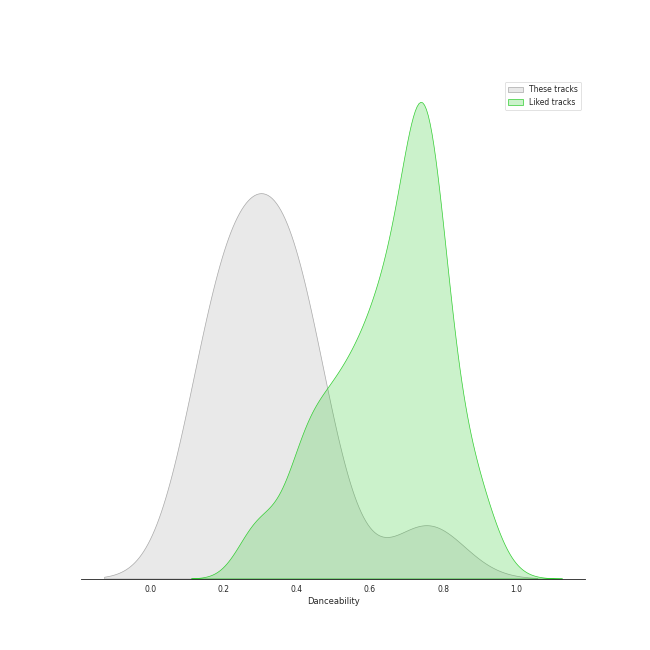
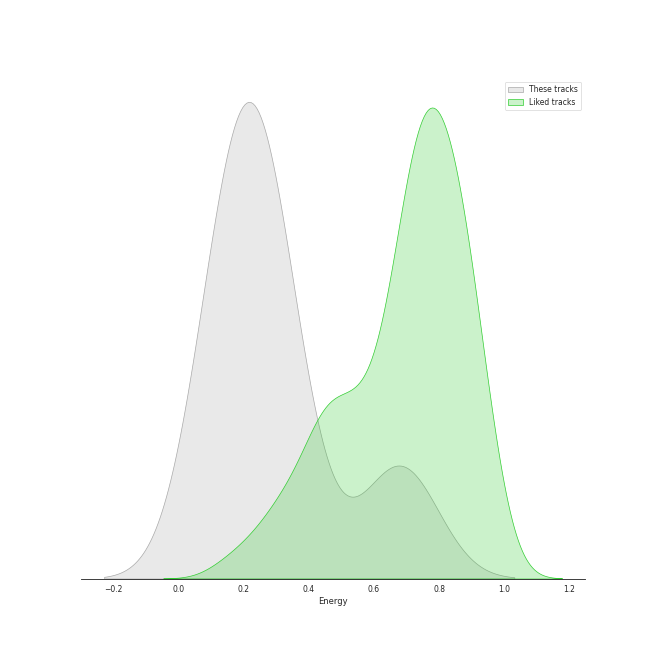
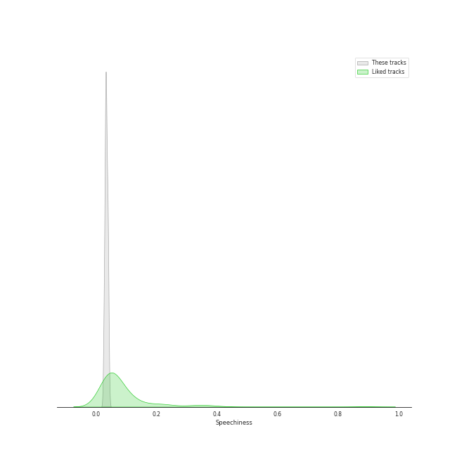
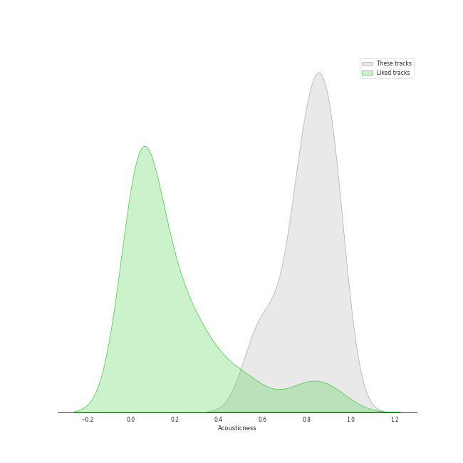
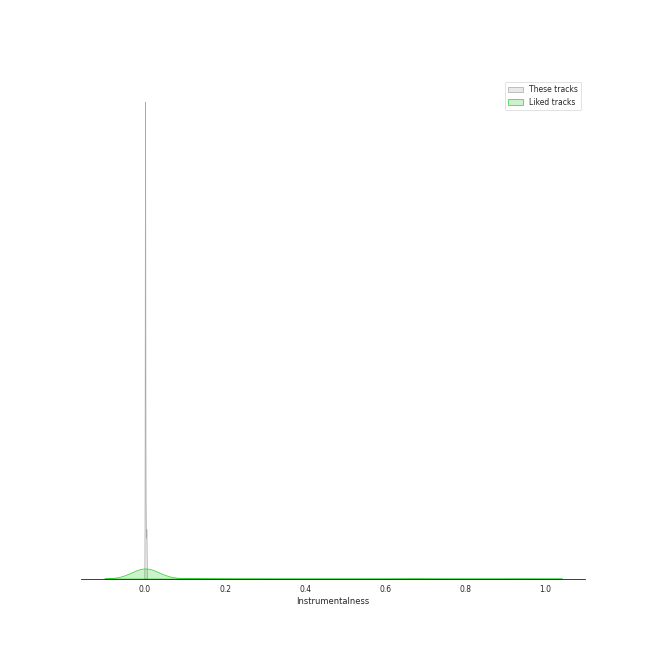
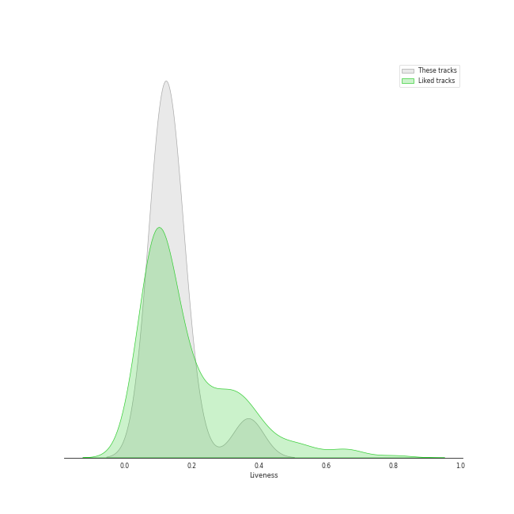
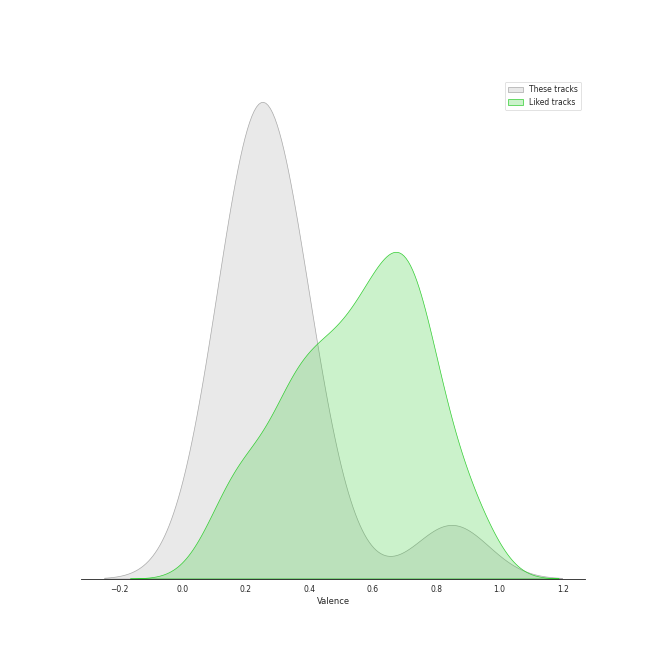
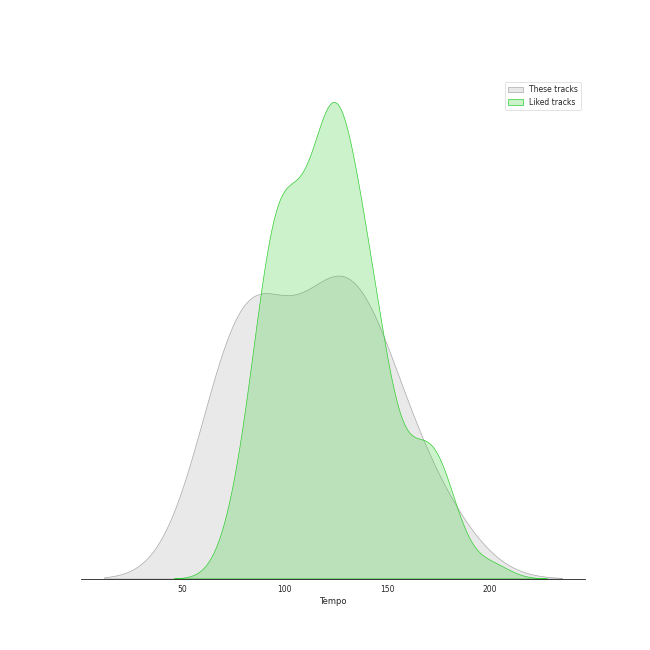

# Audio Features for One Voice Productions

## Danceability

| ​ | 10 most Danceable tracks | ​​ | 10 least Danceable tracks |
|:---|:---|:---|:---|
|  | The Fox (0.758) |  | Greensleeves (0.173) |
|  | At the Beginning (0.434) |  | The Water is Wide (0.174) |
|  | Poor Wayfaring Stranger (0.414) |  | Amazing Grace (0.187) |
|  | Shenandoah (0.398) |  | Danny Boy (0.205) |
|  | Loch Lomond (0.381) |  | Scarborough Fair (0.29) |
|  | Loch Lomond (0.314) |  | The Parting Glass (0.302) |
|  | The Parting Glass (0.302) |  | Loch Lomond (0.314) |
|  | Scarborough Fair (0.29) |  | Loch Lomond (0.381) |
|  | Danny Boy (0.205) |  | Shenandoah (0.398) |
|  | Amazing Grace (0.187) |  | Poor Wayfaring Stranger (0.414) |

## Energy

| ​ | 10 most Energetic tracks | ​​ | 10 least Energetic tracks |
|:---|:---|:---|:---|
|  | At the Beginning (0.681) |  | The Water is Wide (0.122) |
|  | The Fox (0.681) |  | Amazing Grace (0.133) |
|  | The Parting Glass (0.34) |  | Danny Boy (0.147) |
|  | Shenandoah (0.281) |  | Greensleeves (0.168) |
|  | Scarborough Fair (0.262) |  | Loch Lomond (0.224) |
|  | Loch Lomond (0.252) |  | Poor Wayfaring Stranger (0.245) |
|  | Poor Wayfaring Stranger (0.245) |  | Loch Lomond (0.252) |
|  | Loch Lomond (0.224) |  | Scarborough Fair (0.262) |
|  | Greensleeves (0.168) |  | Shenandoah (0.281) |
|  | Danny Boy (0.147) |  | The Parting Glass (0.34) |

## Speechiness

| ​ | 10 most Speechy tracks | ​​ | 10 least Speechy tracks |
|:---|:---|:---|:---|
|  | The Parting Glass (0.0419) |  | Loch Lomond (0.0274) |
|  | The Water is Wide (0.0401) |  | Shenandoah (0.029) |
|  | Scarborough Fair (0.0389) |  | Loch Lomond (0.0324) |
|  | The Fox (0.038) |  | Amazing Grace (0.0328) |
|  | Poor Wayfaring Stranger (0.0352) |  | At the Beginning (0.0328) |
|  | Danny Boy (0.0339) |  | Greensleeves (0.0335) |
|  | Greensleeves (0.0335) |  | Danny Boy (0.0339) |
|  | At the Beginning (0.0328) |  | Poor Wayfaring Stranger (0.0352) |
|  | Amazing Grace (0.0328) |  | The Fox (0.038) |
|  | Loch Lomond (0.0324) |  | Scarborough Fair (0.0389) |

## Acousticness

| ​ | 10 most Acoustic tracks | ​​ | 10 least Acoustic tracks |
|:---|:---|:---|:---|
|  | Shenandoah (0.939) |  | The Parting Glass (0.56) |
|  | Scarborough Fair (0.913) |  | At the Beginning (0.633) |
|  | Loch Lomond (0.911) |  | Amazing Grace (0.731) |
|  | Loch Lomond (0.903) |  | Poor Wayfaring Stranger (0.782) |
|  | Danny Boy (0.864) |  | The Fox (0.784) |
|  | Greensleeves (0.832) |  | The Water is Wide (0.814) |
|  | The Water is Wide (0.814) |  | Greensleeves (0.832) |
|  | The Fox (0.784) |  | Danny Boy (0.864) |
|  | Poor Wayfaring Stranger (0.782) |  | Loch Lomond (0.903) |
|  | Amazing Grace (0.731) |  | Loch Lomond (0.911) |

## Instrumentalness

| ​ | 10 most Instrumental tracks | ​​ | 10 least Instrumental tracks |
|:---|:---|:---|:---|
|  | Shenandoah (0.00336) |  | Poor Wayfaring Stranger (0.0) |
|  | At the Beginning (0.0017) |  | Greensleeves (0.0) |
|  | Danny Boy (0.0) |  | Loch Lomond (0.0) |
|  | Amazing Grace (0.0) |  | The Fox (0.0) |
|  | The Water is Wide (0.0) |  | Loch Lomond (0.0) |
|  | The Parting Glass (0.0) |  | Scarborough Fair (0.0) |
|  | Scarborough Fair (0.0) |  | The Parting Glass (0.0) |
|  | Loch Lomond (0.0) |  | The Water is Wide (0.0) |
|  | The Fox (0.0) |  | Amazing Grace (0.0) |
|  | Loch Lomond (0.0) |  | Danny Boy (0.0) |

## Liveness

| ​ | 10 most Live tracks | ​​ | 10 least Live tracks |
|:---|:---|:---|:---|
|  | The Fox (0.368) |  | Scarborough Fair (0.0819) |
|  | The Water is Wide (0.178) |  | Amazing Grace (0.101) |
|  | The Parting Glass (0.152) |  | Loch Lomond (0.103) |
|  | Danny Boy (0.141) |  | Poor Wayfaring Stranger (0.111) |
|  | Loch Lomond (0.134) |  | Greensleeves (0.117) |
|  | At the Beginning (0.128) |  | Shenandoah (0.12) |
|  | Shenandoah (0.12) |  | At the Beginning (0.128) |
|  | Greensleeves (0.117) |  | Loch Lomond (0.134) |
|  | Poor Wayfaring Stranger (0.111) |  | Danny Boy (0.141) |
|  | Loch Lomond (0.103) |  | The Parting Glass (0.152) |

## Valence

| ​ | 10 most Happy tracks | ​​ | 10 least Happy tracks |
|:---|:---|:---|:---|
|  | The Fox (0.849) |  | Loch Lomond (0.101) |
|  | The Water is Wide (0.413) |  | The Parting Glass (0.17) |
|  | Danny Boy (0.349) |  | Greensleeves (0.208) |
|  | Loch Lomond (0.319) |  | Scarborough Fair (0.208) |
|  | Amazing Grace (0.292) |  | Shenandoah (0.226) |
|  | At the Beginning (0.273) |  | Poor Wayfaring Stranger (0.244) |
|  | Poor Wayfaring Stranger (0.244) |  | At the Beginning (0.273) |
|  | Shenandoah (0.226) |  | Amazing Grace (0.292) |
|  | Scarborough Fair (0.208) |  | Loch Lomond (0.319) |
|  | Greensleeves (0.208) |  | Danny Boy (0.349) |

## Tempo

| ​ | 10 most Fast tracks | ​​ | 10 least Fast tracks |
|:---|:---|:---|:---|
|  | Danny Boy (174.825) |  | The Water is Wide (72.35) |
|  | The Parting Glass (147.917) |  | Amazing Grace (75.97) |
|  | Loch Lomond (144.108) |  | Greensleeves (77.72) |
|  | Loch Lomond (136.283) |  | Shenandoah (86.034) |
|  | Scarborough Fair (121.875) |  | At the Beginning (93.934) |
|  | Poor Wayfaring Stranger (121.586) |  | The Fox (119.763) |
|  | The Fox (119.763) |  | Poor Wayfaring Stranger (121.586) |
|  | At the Beginning (93.934) |  | Scarborough Fair (121.875) |
|  | Shenandoah (86.034) |  | Loch Lomond (136.283) |
|  | Greensleeves (77.72) |  | Loch Lomond (144.108) |
