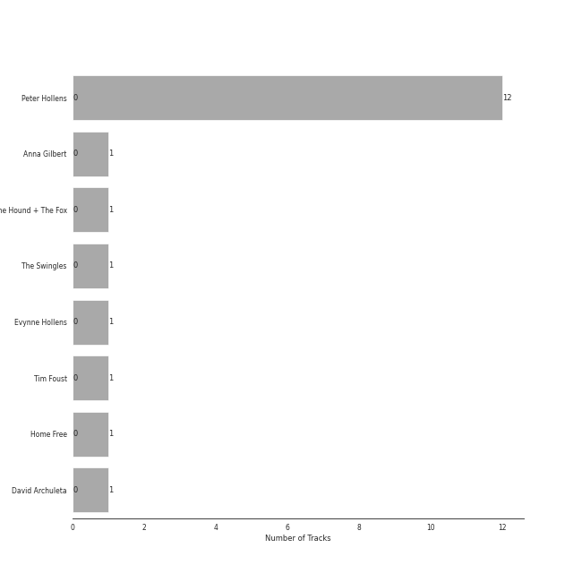

# One Voice Productions

12 songs

[See Track Features](audio_features.md)

[See Clusters](clusters/overview.md)

Appears as:
- One Voice Productions (11 tracks)
- One Voice Productions, LLC (1 tracks)

## Top Artists

| Art | Rank | Tracks | 💚 | Artist | 🔗 |
|:---|---:|---:|---:|:---|:---|
|  | 409 | 12 | 0 | Peter Hollens | [🔗](https://open.spotify.com/artist/7EIbKyiLnEJ1Y074UIUyZJ) |
|  | 409 | 1 | 0 | Anna Gilbert | [🔗](https://open.spotify.com/artist/77ajzV8In7jP3U2OYT1Yy7) |
|  | 409 | 1 | 0 | The Hound + The Fox | [🔗](https://open.spotify.com/artist/6KxrjoB8dMcRC295reb2Us) |
|  | 409 | 1 | 0 | The Swingles | [🔗](https://open.spotify.com/artist/5QvPTVBx6OlrUuPwC8W3uU) |
|  | 409 | 1 | 0 | Evynne Hollens | [🔗](https://open.spotify.com/artist/3nj3MfJCFFoKiRkAOW1R8c) |
|  | 409 | 1 | 0 | Tim Foust | [🔗](https://open.spotify.com/artist/2VtwFbDZzIoT9ZD0uR5HHD) |
|  | 409 | 1 | 0 | Home Free | [🔗](https://open.spotify.com/artist/2MSlGNpwXDScUdspOK6TS7) |
|  | 409 | 1 | 0 | David Archuleta | [🔗](https://open.spotify.com/artist/2C9n4tQgNLhHPhSCmdsQnk) |

## Top Albums

| Art | Rank | Tracks | 💚 | Album | Release Date | 🔗 |
|:---|---:|---:|---:|:---|:---|:---|
|  | 598 | 11 | 0 | Legendary Folk Songs | 2018-06-15 | [🔗](https://open.spotify.com/album/22qN0Gw54OwckjTgVGUzVG) |
|  | 598 | 1 | 0 | At the Beginning | 2017-06-05 | [🔗](https://open.spotify.com/album/3uN6J4J6VstQCzzHbKbz6j) |

## Genres

| Tracks | 💚 | Genre |
|---:|---:|:---|
| 12 | 0 | fantasy |

## Tracks released under One Voice Productions

| Art | Track | Album | Artists | Label | Rank | 💚 | 🔗 |
|:---|:---|:---|:---|:---|---:|:---|:---|
|  | At the Beginning | At the Beginning | Peter Hollens, Evynne Hollens | [One Voice Productions, LLC](.) | 892 | | [🔗](https://open.spotify.com/track/4rONfUG09RBdY299o0rvm8) |
|  | Amazing Grace | Legendary Folk Songs | Peter Hollens, Home Free | [One Voice Productions](.) | 892 | | [🔗](https://open.spotify.com/track/4Y7ccrzeEvhvCc8IFoxZKd) |
|  | Danny Boy | Legendary Folk Songs | Peter Hollens | [One Voice Productions](.) | 892 | | [🔗](https://open.spotify.com/track/5DXL9IESZqqqrW2euiWaAA) |
|  | Greensleeves | Legendary Folk Songs | Peter Hollens, Tim Foust | [One Voice Productions](.) | 892 | | [🔗](https://open.spotify.com/track/0Q7QHXmwjj8u9ajPvwNnCO) |
|  | Loch Lomond | Legendary Folk Songs | Peter Hollens | [One Voice Productions](.) | 892 | | [🔗](https://open.spotify.com/track/0eUE1gw4CpTlqBktSI9aND) |
|  | Loch Lomond | Legendary Folk Songs | Peter Hollens, David Archuleta | [One Voice Productions](.) | 892 | | [🔗](https://open.spotify.com/track/1AbjBMyhiiEt5GJiRtlDRX) |
|  | Poor Wayfaring Stranger | Legendary Folk Songs | Peter Hollens, The Swingles | [One Voice Productions](.) | 892 | | [🔗](https://open.spotify.com/track/0NmsMH3LvATRdd4bRSTdtl) |
|  | Scarborough Fair | Legendary Folk Songs | Peter Hollens | [One Voice Productions](.) | 892 | | [🔗](https://open.spotify.com/track/1fXgi7opKIjkpjX6uVNJXx) |
|  | Shenandoah | Legendary Folk Songs | Peter Hollens, Anna Gilbert | [One Voice Productions](.) | 892 | | [🔗](https://open.spotify.com/track/4F0h4ke31MIzjmb018lmml) |
|  | The Fox | Legendary Folk Songs | Peter Hollens | [One Voice Productions](.) | 892 | | [🔗](https://open.spotify.com/track/14NcPvHX03DgKjTHXXsZNn) |

See all tracks

| Art | Track | Album | Artists | Label | Rank | 💚 | 🔗 |
|:---|:---|:---|:---|:---|---:|:---|:---|
|  | The Parting Glass | Legendary Folk Songs | Peter Hollens, The Hound + The Fox | [One Voice Productions](.) | 892 | | [🔗](https://open.spotify.com/track/1l1r0PNrP1b15QLJjpgOp6) |
|  | The Water is Wide | Legendary Folk Songs | Peter Hollens | [One Voice Productions](.) | 892 | | [🔗](https://open.spotify.com/track/2E6c7d4MfJBtOI3B5Vsajk) |

