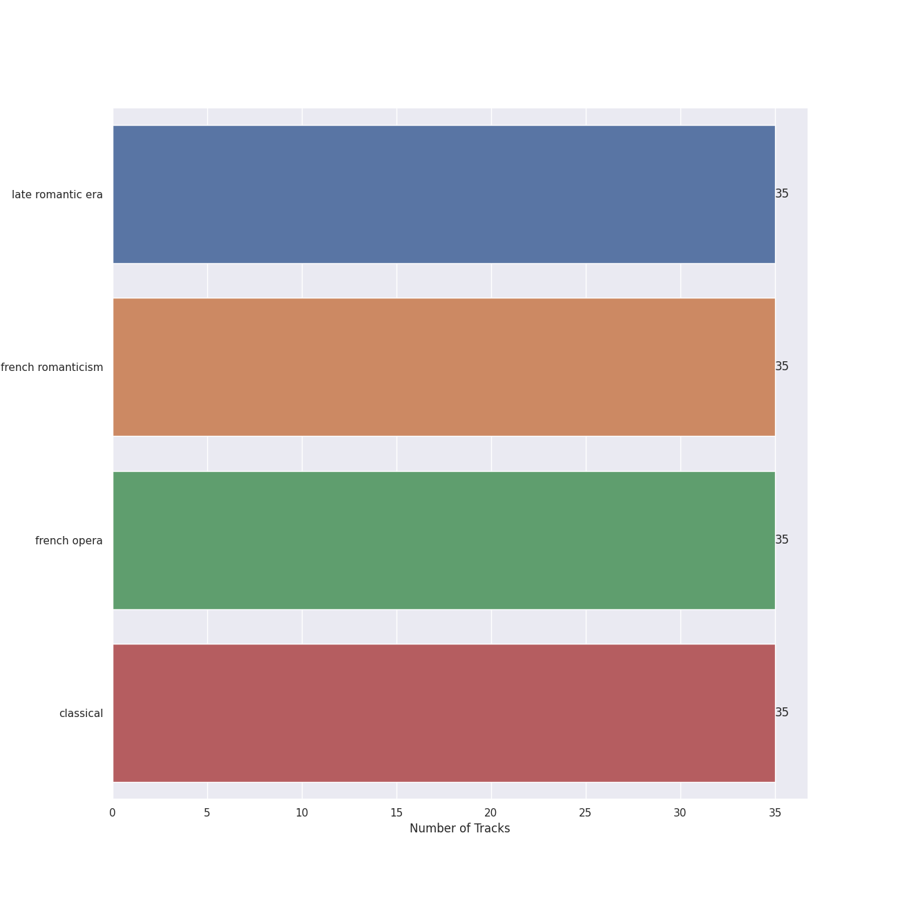

# Opera d'Oro

35 songs

Appears as:
- Opera d'Oro (35 tracks)

## Top Artists

See all 14 artists

|   Number of Tracks | Art                                                                                              | Artist                                                     | 🔗                                                           |
|-------------------:|:-------------------------------------------------------------------------------------------------|:-----------------------------------------------------------|:------------------------------------------------------------|
|                 35 |  | [Georges Bizet](../artists/georges_bizet.md)               | [🔗](https://open.spotify.com/artist/2D7RkvtKKb6E5UmbjQM1Jd) |
|                 19 |  | [Plácido Domingo](../artists/pl_cido_domingo.md)           | [🔗](https://open.spotify.com/artist/4pU3BpenOZFEBzORx2YBJW) |
|                 18 |  | [Shirley Verrett](../artists/shirley_verrett.md)           | [🔗](https://open.spotify.com/artist/0f4tBoODl0zZo4snq0guG6) |
|                 18 |                                                               | [Covent Garden Chorus](../artists/covent_garden_chorus.md) | [🔗](https://open.spotify.com/artist/0ZhXKQoJEmQv0dFzaSLasu) |
|                 10 |  | [Teresa Cahill](../artists/teresa_cahill.md)               | [🔗](https://open.spotify.com/artist/5IqlLsJGCLTJcDKOH7Ljpk) |
|                  9 |  | Richard van Allan                                          | [🔗](https://open.spotify.com/artist/7fvx6pdccpIicgEbNbBdrm) |
|                  9 |                                                               | Anne Pashley                                               | [🔗](https://open.spotify.com/artist/597vCyRss5Kk4y0MAvhqEt) |
|                  7 |  | John Dobson                                                | [🔗](https://open.spotify.com/artist/6xCAKMCPmMEb9BiuxhUCqY) |
|                  7 |  | Kiri Te Kanawa                                             | [🔗](https://open.spotify.com/artist/3fcsflK8xu26XH4OYTcm5T) |
|                  7 |  | Francis Egerton                                            | [🔗](https://open.spotify.com/artist/24DlhaYHaKiueDC3EFXMz9) |
|                  5 |  | [José van Dam](../artists/jos__van_dam.md)                 | [🔗](https://open.spotify.com/artist/5qNUHMEhszyeXNYMn4sswd) |
|                  4 |  | Orchestra of the Royal Opera House, Covent Garden          | [🔗](https://open.spotify.com/artist/2t5BHUdyeL3NBKqpOpaA4V) |
|                  2 |  | Thomas Allan                                               | [🔗](https://open.spotify.com/artist/70QpBPsHcrRpFI0eCdW8b2) |
|                  1 |                                                               | Teersa Cahill                                              | [🔗](https://open.spotify.com/artist/3lhc5T2tJmYR1vOHuq85Ce) |

## Top Albums

See all 1 albums

|   Number of Tracks | Art                                                                                              | Album   | 🔗                                                          |
|-------------------:|:-------------------------------------------------------------------------------------------------|:--------|:-----------------------------------------------------------|
|                 35 |  | Carmen  | [🔗](https://open.spotify.com/album/7v178habOq2br0SjMG1KF5) |

## Genres

See all 4 genres

|   Number of Tracks | Genre                                                 |
|-------------------:|:------------------------------------------------------|
|                 35 | [late romantic era](../genres/late_romantic_era.md)   |
|                 35 | [french romanticism](../genres/french_romanticism.md) |
|                 35 | [french opera](../genres/french_opera.md)             |
|                 35 | [classical](../genres/classical.md)                   |

## Tracks released under Opera d'Oro

| Art                                                                                              | Track                                                                         | Album   | Artists                                                                                                                                                                                                                                                                                                                   | Label                         | 💚   | 🔗                                                          |
|:-------------------------------------------------------------------------------------------------|:------------------------------------------------------------------------------|:--------|:--------------------------------------------------------------------------------------------------------------------------------------------------------------------------------------------------------------------------------------------------------------------------------------------------------------------------|:------------------------------|:----|:-----------------------------------------------------------|
|  | Bizet: Carmen: A deux cuartos! - - Act Four                                   | Carmen  | [Georges Bizet](../artists/georges_bizet.md), [Covent Garden Chorus](../artists/covent_garden_chorus.md), Richard van Allan, [Teresa Cahill](../artists/teresa_cahill.md)                                                                                                                                                 | [Opera d'Oro](opera_d_oro.md) |     | [🔗](https://open.spotify.com/track/2WPJC59DU0420drLn7alZQ) |
|  | Bizet: Carmen: Au secours! Au secours! - Act One                              | Carmen  | [Georges Bizet](../artists/georges_bizet.md), [Covent Garden Chorus](../artists/covent_garden_chorus.md), Richard van Allan, [Plácido Domingo](../artists/pl_cido_domingo.md)                                                                                                                                             | [Opera d'Oro](opera_d_oro.md) |     | [🔗](https://open.spotify.com/track/31ve9B9fWTLeJihbYINnku) |
|  | Bizet: Carmen: Avec la garde montate - Act One                                | Carmen  | [Georges Bizet](../artists/georges_bizet.md), [Covent Garden Chorus](../artists/covent_garden_chorus.md), Richard van Allan, Thomas Allan, [Plácido Domingo](../artists/pl_cido_domingo.md)                                                                                                                               | [Opera d'Oro](opera_d_oro.md) |     | [🔗](https://open.spotify.com/track/1Hs7UXHAe2rk6Ui3RZZ6D3) |
|  | Bizet: Carmen: Avez-vous quelque chose a repondre? - Act One                  | Carmen  | [Georges Bizet](../artists/georges_bizet.md), Richard van Allan, [Shirley Verrett](../artists/shirley_verrett.md), [Plácido Domingo](../artists/pl_cido_domingo.md)                                                                                                                                                       | [Opera d'Oro](opera_d_oro.md) |     | [🔗](https://open.spotify.com/track/6hsz6M8kgIvLQUp5WLPhwC) |
|  | Bizet: Carmen: C'est toi! - Act Four                                          | Carmen  | [Georges Bizet](../artists/georges_bizet.md), [Shirley Verrett](../artists/shirley_verrett.md), [Plácido Domingo](../artists/pl_cido_domingo.md), [Covent Garden Chorus](../artists/covent_garden_chorus.md)                                                                                                              | [Opera d'Oro](opera_d_oro.md) |     | [🔗](https://open.spotify.com/track/4HwlcefvFSUw2BqjYUDmZT) |
|  | Bizet: Carmen: Carmen! Sur tes pas nous nous pressons tous! - Act One         | Carmen  | [Georges Bizet](../artists/georges_bizet.md), [Covent Garden Chorus](../artists/covent_garden_chorus.md), [Plácido Domingo](../artists/pl_cido_domingo.md), Kiri Te Kanawa                                                                                                                                                | [Opera d'Oro](opera_d_oro.md) |     | [🔗](https://open.spotify.com/track/5mI0cSVqMFHS0nEqPeiuyA) |
|  | Bizet: Carmen: Ecoute, ecoute, compagnon, ecoute! - Act Three                 | Carmen  | [Georges Bizet](../artists/georges_bizet.md), [Covent Garden Chorus](../artists/covent_garden_chorus.md), [Teresa Cahill](../artists/teresa_cahill.md), Anne Pashley, [Shirley Verrett](../artists/shirley_verrett.md), [Plácido Domingo](../artists/pl_cido_domingo.md), Francis Egerton, John Dobson                    | [Opera d'Oro](opera_d_oro.md) |     | [🔗](https://open.spotify.com/track/7sXR2q4FuSKOAPYvmmBjh3) |
|  | Bizet: Carmen: Entr'acte - Act Four                                           | Carmen  | [Georges Bizet](../artists/georges_bizet.md), Orchestra of the Royal Opera House, Covent Garden                                                                                                                                                                                                                           | [Opera d'Oro](opera_d_oro.md) |     | [🔗](https://open.spotify.com/track/68IQDbZhCzIh6LVpNJZtNn) |
|  | Bizet: Carmen: Entr'acte - Act Three                                          | Carmen  | [Georges Bizet](../artists/georges_bizet.md), Orchestra of the Royal Opera House, Covent Garden                                                                                                                                                                                                                           | [Opera d'Oro](opera_d_oro.md) |     | [🔗](https://open.spotify.com/track/62oBDZ1wueAQzgkafzxoaz) |
|  | Bizet: Carmen: Entr'acte - Act Two                                            | Carmen  | [Georges Bizet](../artists/georges_bizet.md), Orchestra of the Royal Opera House, Covent Garden                                                                                                                                                                                                                           | [Opera d'Oro](opera_d_oro.md) |     | [🔗](https://open.spotify.com/track/78xTWW2zVF6spR8yn0LMsy) |
|  | Bizet: Carmen: Hola! Carmen! Hola! Hola! - Act Two                            | Carmen  | [Georges Bizet](../artists/georges_bizet.md), Richard van Allan, [Plácido Domingo](../artists/pl_cido_domingo.md), [Shirley Verrett](../artists/shirley_verrett.md), Francis Egerton, John Dobson, [Covent Garden Chorus](../artists/covent_garden_chorus.md), [Teresa Cahill](../artists/teresa_cahill.md), Anne Pashley | [Opera d'Oro](opera_d_oro.md) |     | [🔗](https://open.spotify.com/track/4v4nQkmWVvHdJCOltOET4T) |
|  | Bizet: Carmen: Hola! Hola! Jose! - Act Three                                  | Carmen  | [Georges Bizet](../artists/georges_bizet.md), [Shirley Verrett](../artists/shirley_verrett.md), [José van Dam](../artists/jos__van_dam.md), John Dobson, [Plácido Domingo](../artists/pl_cido_domingo.md), [Covent Garden Chorus](../artists/covent_garden_chorus.md), Francis Egerton                                    | [Opera d'Oro](opera_d_oro.md) |     | [🔗](https://open.spotify.com/track/5Ry7XJspWYFgLlsBlEY7vV) |
|  | Bizet: Carmen: Je dis que rien ne m'epouvante - Act Three                     | Carmen  | [Georges Bizet](../artists/georges_bizet.md), Kiri Te Kanawa, [José van Dam](../artists/jos__van_dam.md), [Plácido Domingo](../artists/pl_cido_domingo.md)                                                                                                                                                                | [Opera d'Oro](opera_d_oro.md) |     | [🔗](https://open.spotify.com/track/1BcIKofTRaclxuYdkAZY9Z) |
|  | Bizet: Carmen: Je suis Escamillo, torero de Grenade - Act Three               | Carmen  | [Georges Bizet](../artists/georges_bizet.md), [José van Dam](../artists/jos__van_dam.md), [Plácido Domingo](../artists/pl_cido_domingo.md)                                                                                                                                                                                | [Opera d'Oro](opera_d_oro.md) |     | [🔗](https://open.spotify.com/track/2uO1v0uOgQUHJ6xVjPF54j) |
|  | Bizet: Carmen: Je vais danser en votre honneur - Act Two                      | Carmen  | [Georges Bizet](../artists/georges_bizet.md), [Shirley Verrett](../artists/shirley_verrett.md), [Plácido Domingo](../artists/pl_cido_domingo.md)                                                                                                                                                                          | [Opera d'Oro](opera_d_oro.md) |     | [🔗](https://open.spotify.com/track/3thmsFTt2TS605bbBdvlQx) |
|  | Bizet: Carmen: L'amour est un oiseau rebelle: Habanera - Act One              | Carmen  | [Georges Bizet](../artists/georges_bizet.md), [Shirley Verrett](../artists/shirley_verrett.md), [Covent Garden Chorus](../artists/covent_garden_chorus.md)                                                                                                                                                                | [Opera d'Oro](opera_d_oro.md) |     | [🔗](https://open.spotify.com/track/0lgEqdn3soGF9YcgxoK0BL) |
|  | Bizet: Carmen: La cloche a sonne - Act One                                    | Carmen  | [Georges Bizet](../artists/georges_bizet.md), [Covent Garden Chorus](../artists/covent_garden_chorus.md)                                                                                                                                                                                                                  | [Opera d'Oro](opera_d_oro.md) |     | [🔗](https://open.spotify.com/track/3FTSrLixJNK0WN0WHsxYh7) |
|  | Bizet: Carmen: La fleur que tu m'avais jetee: Flower Song - Act Two           | Carmen  | [Georges Bizet](../artists/georges_bizet.md), [Plácido Domingo](../artists/pl_cido_domingo.md)                                                                                                                                                                                                                            | [Opera d'Oro](opera_d_oro.md) |     | [🔗](https://open.spotify.com/track/7w16XXQ1P1DxgFO99u4Y3S) |
|  | Bizet: Carmen: Les tringles des sistres tintaient: Danse Bohemienne - Act Two | Carmen  | [Georges Bizet](../artists/georges_bizet.md), [Shirley Verrett](../artists/shirley_verrett.md), Teersa Cahill, Anne Pashley, Richard van Allan, [Covent Garden Chorus](../artists/covent_garden_chorus.md), [José van Dam](../artists/jos__van_dam.md)                                                                    | [Opera d'Oro](opera_d_oro.md) |     | [🔗](https://open.spotify.com/track/7gMjPhMs89d43tQc6NlFzT) |
|  | Bizet: Carmen: Mais nous ne voyons pas la Carmencita! - Act One               | Carmen  | [Georges Bizet](../artists/georges_bizet.md), [Covent Garden Chorus](../artists/covent_garden_chorus.md), [Shirley Verrett](../artists/shirley_verrett.md)                                                                                                                                                                | [Opera d'Oro](opera_d_oro.md) |     | [🔗](https://open.spotify.com/track/59jfGq63Sdxq3p1KItuAxc) |
|  | Bizet: Carmen: Melons! Coupons! - Act Three                                   | Carmen  | [Georges Bizet](../artists/georges_bizet.md), [Teresa Cahill](../artists/teresa_cahill.md), Anne Pashley                                                                                                                                                                                                                  | [Opera d'Oro](opera_d_oro.md) |     | [🔗](https://open.spotify.com/track/2J58WGnkfm7jNdB7yN20Zj) |
|  | Bizet: Carmen: Non! Tu ne m'aimes pas! - Act Two                              | Carmen  | [Georges Bizet](../artists/georges_bizet.md), [Shirley Verrett](../artists/shirley_verrett.md), [Plácido Domingo](../artists/pl_cido_domingo.md)                                                                                                                                                                          | [Opera d'Oro](opera_d_oro.md) |     | [🔗](https://open.spotify.com/track/4Mb2XoVuyQK6yAbcbUKOk0) |
|  | Bizet: Carmen: Nous avons en tete une affaire! - Act Two                      | Carmen  | [Georges Bizet](../artists/georges_bizet.md), John Dobson, Anne Pashley, [Teresa Cahill](../artists/teresa_cahill.md), Francis Egerton, [Shirley Verrett](../artists/shirley_verrett.md), [Plácido Domingo](../artists/pl_cido_domingo.md)                                                                                | [Opera d'Oro](opera_d_oro.md) |     | [🔗](https://open.spotify.com/track/24t8kTMfdmwe9Qj2wqUulV) |
|  | Bizet: Carmen: Ou vas-tu? - Act Four                                          | Carmen  | [Georges Bizet](../artists/georges_bizet.md), [Plácido Domingo](../artists/pl_cido_domingo.md), [Shirley Verrett](../artists/shirley_verrett.md), [Covent Garden Chorus](../artists/covent_garden_chorus.md)                                                                                                              | [Opera d'Oro](opera_d_oro.md) |     | [🔗](https://open.spotify.com/track/3EYNsubAMVu77iazMgBHLN) |
|  | Bizet: Carmen: Parle-moi de ma mere! - Act One                                | Carmen  | [Georges Bizet](../artists/georges_bizet.md), [Plácido Domingo](../artists/pl_cido_domingo.md), Kiri Te Kanawa                                                                                                                                                                                                            | [Opera d'Oro](opera_d_oro.md) |     | [🔗](https://open.spotify.com/track/0s1BKGnEieOCDpGWSiR5Up) |
|  | Bizet: Carmen: Prelude - Act One                                              | Carmen  | [Georges Bizet](../artists/georges_bizet.md), Orchestra of the Royal Opera House, Covent Garden                                                                                                                                                                                                                           | [Opera d'Oro](opera_d_oro.md) |     | [🔗](https://open.spotify.com/track/6v26GTW8xAJyCH6sfsIkni) |
|  | Bizet: Carmen: Pres des remparts de Seville: Seguidilla - Act One             | Carmen  | [Georges Bizet](../artists/georges_bizet.md), [Shirley Verrett](../artists/shirley_verrett.md), [Plácido Domingo](../artists/pl_cido_domingo.md)                                                                                                                                                                          | [Opera d'Oro](opera_d_oro.md) |     | [🔗](https://open.spotify.com/track/2mzwgEsoyQKMOZ0VBZTpFY) |
|  | Bizet: Carmen: Qui sait de quel demon j'allais etre la proie! - Act One       | Carmen  | [Georges Bizet](../artists/georges_bizet.md), [Plácido Domingo](../artists/pl_cido_domingo.md), Kiri Te Kanawa                                                                                                                                                                                                            | [Opera d'Oro](opera_d_oro.md) |     | [🔗](https://open.spotify.com/track/73zxyvJlTbnderXFC2veDU) |
|  | Bizet: Carmen: Si tu m'aimes, Carmen - Act Four                               | Carmen  | [Georges Bizet](../artists/georges_bizet.md), [Covent Garden Chorus](../artists/covent_garden_chorus.md), Richard van Allan, [Teresa Cahill](../artists/teresa_cahill.md)                                                                                                                                                 | [Opera d'Oro](opera_d_oro.md) |     | [🔗](https://open.spotify.com/track/7mhHuuqPP8fvcAWbODyuiw) |
|  | Bizet: Carmen: Sur la place chacun passe - Act One                            | Carmen  | [Georges Bizet](../artists/georges_bizet.md), [Covent Garden Chorus](../artists/covent_garden_chorus.md), Thomas Allan, Kiri Te Kanawa                                                                                                                                                                                    | [Opera d'Oro](opera_d_oro.md) |     | [🔗](https://open.spotify.com/track/6nkDZ62N3kw0b1yuYBa5y7) |
|  | Bizet: Carmen: Une femme! - Act Three                                         | Carmen  | [Georges Bizet](../artists/georges_bizet.md), [Shirley Verrett](../artists/shirley_verrett.md), John Dobson, Kiri Te Kanawa, [Teresa Cahill](../artists/teresa_cahill.md), Anne Pashley, Francis Egerton, [Covent Garden Chorus](../artists/covent_garden_chorus.md)                                                      | [Opera d'Oro](opera_d_oro.md) |     | [🔗](https://open.spotify.com/track/5ipiLIj4QAvF898KvmIuLo) |
|  | Bizet: Carmen: Voici l'ordre; partez, et faites bonne garde - Act One         | Carmen  | [Georges Bizet](../artists/georges_bizet.md), Richard van Allan, [Shirley Verrett](../artists/shirley_verrett.md)                                                                                                                                                                                                         | [Opera d'Oro](opera_d_oro.md) |     | [🔗](https://open.spotify.com/track/7lFYjkkA3Y4hjMpr28roJI) |
|  | Bizet: Carmen: Votre toast, je peux vous le rendre: Toreador Song - Act Two   | Carmen  | [Georges Bizet](../artists/georges_bizet.md), [José van Dam](../artists/jos__van_dam.md), [Covent Garden Chorus](../artists/covent_garden_chorus.md), [Shirley Verrett](../artists/shirley_verrett.md), Richard van Allan, [Teresa Cahill](../artists/teresa_cahill.md), Anne Pashley                                     | [Opera d'Oro](opera_d_oro.md) |     | [🔗](https://open.spotify.com/track/18wc2PPJ8MaOnbTcjGKCai) |
|  | Bizet: Carmen: Voyons, que j'essaie a mon tour - Act Three                    | Carmen  | [Georges Bizet](../artists/georges_bizet.md), [Shirley Verrett](../artists/shirley_verrett.md), [Teresa Cahill](../artists/teresa_cahill.md), Anne Pashley, John Dobson, Francis Egerton, [Plácido Domingo](../artists/pl_cido_domingo.md)                                                                                | [Opera d'Oro](opera_d_oro.md) |     | [🔗](https://open.spotify.com/track/3A2D9WCbDWGTW16Qy6cPzO) |
|  | Bizet: Carmen: quant au douanier, c'est notre affaire! - Act Three            | Carmen  | [Georges Bizet](../artists/georges_bizet.md), [Teresa Cahill](../artists/teresa_cahill.md), Anne Pashley, [Shirley Verrett](../artists/shirley_verrett.md), [Covent Garden Chorus](../artists/covent_garden_chorus.md), Francis Egerton, John Dobson, Kiri Te Kanawa                                                      | [Opera d'Oro](opera_d_oro.md) |     | [🔗](https://open.spotify.com/track/3z87xDPc6Yc57Npcw2sOHM) |
