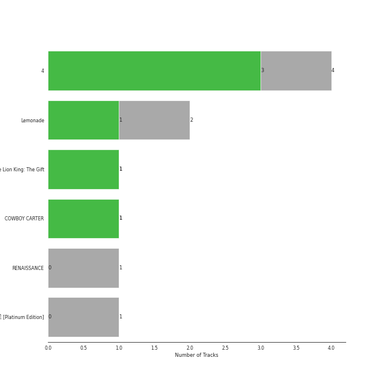

# Parkwood Entertainment

10 songs

Appears as:
- Parkwood Entertainment/Columbia (10 tracks)

## Top Artists

| Art | Rank | Tracks | 💚 | Artist | 🔗 |
|:---|---:|---:|---:|:---|:---|
|  | 131 | 9 | 5 | [Beyoncé](../../artists/beyoncé/overview.md) | [🔗](https://open.spotify.com/artist/6vWDO969PvNqNYHIOW5v0m) |
|  | 419 | 1 | 1 | Burna Boy | [🔗](https://open.spotify.com/artist/3wcj11K77LjEY1PkEazffa) |

## Top Albums

| Art | Rank | Tracks | 💚 | Album | Release Date | 🔗 |
|:---|---:|---:|---:|:---|:---|:---|
|  | 619 | 4 | 3 | 4 | 2011-06-24 | [🔗](https://open.spotify.com/album/1gIC63gC3B7o7FfpPACZQJ) |
|  | 619 | 2 | 1 | Lemonade | 2016-04-23 | [🔗](https://open.spotify.com/album/7dK54iZuOxXFarGhXwEXfF) |
|  | 619 | 1 | 1 | The Lion King: The Gift | 2019-07-19 | [🔗](https://open.spotify.com/album/552zi1M53PQAX5OH4FIdTx) |
|  | 619 | 1 | 1 | COWBOY CARTER | 2024-03-29 | [🔗](https://open.spotify.com/album/6BzxX6zkDsYKFJ04ziU5xQ) |
|  | 619 | 1 | 0 | RENAISSANCE | 2022-07-29 | [🔗](https://open.spotify.com/album/6FJxoadUE4JNVwWHghBwnb) |
|  | 619 | 1 | 0 | BEYONCÉ [Platinum Edition] | 2014-11-24 | [🔗](https://open.spotify.com/album/2UJwKSBUz6rtW4QLK74kQu) |

## Genres

| Tracks | 💚 | Genre |
|---:|---:|:---|
| 9 | 5 | [r&b](../../genres/r_b/overview.md) |
| 9 | 5 | [pop](../../genres/pop/overview.md) |
| 1 | 1 | nigerian pop |
| 1 | 1 | nigerian hip hop |
| 1 | 1 | dancehall |
| 1 | 1 | afrobeats |

## Top Producers

| Art | Producer | Tracks | Credit Types |
|:---|:---|---:|:---|
|  | [Beyoncé](../../artists/beyoncé/overview.md) | 6 | Producer, Songwriter |
| | [John Hanes](../../producers/john_hanes/overview.md) | 3 | Producer |
| | Stuart White | 3 | Producer |
| | [Serban Ghenea](../../producers/serban_ghenea/overview.md) | 3 | Producer |
| | DJ Swivel | 2 | Producer |
| | Derek Dixie | 2 | Producer |
| | Shea Taylor | 2 | Producer, Songwriter |
| | The-Dream | 2 | Songwriter |
| | Hit-Boy | 1 | Producer |
| | Diana Gordon | 1 | Songwriter |

View all

| Art | Producer | Tracks | Credit Types |
|:---|:---|---:|:---|
| | Cecil Bernardy | 1 | Producer |
| | Michael Bivins | 1 | Songwriter |
| | bülow (bülow) | 1 | Songwriter |
| | Raphael Saadiq | 1 | Producer, Songwriter |
| | Brent Kutzle | 1 | Producer |
| | Cainon Lamb | 1 | Songwriter |
| | Kevin Cossom | 1 | Songwriter |
| | Nate Ferraro | 1 | Producer, Songwriter |
| | Lowell | 1 | Songwriter |
| | Hotae Alexander Jang | 1 | Producer |
| | Kuk Harrell | 1 | Producer |
| | Richard "P2J" Isong | 1 | Producer, Songwriter |
| | Alex Nibley | 1 | Producer |
| | Andrea Roberts | 1 | Producer |
| | John Silas Cranfield | 1 | Producer |
|  | Burna Boy | 1 | Songwriter |
| | Diane Warren | 1 | Songwriter |
| | Wanya Morris | 1 | Songwriter |
| | Julie Frost | 1 | Songwriter |
| | Matheus Braz | 1 | Producer |
| | Mariel Gomerez | 1 | Producer |
| | Brian Vincent Bates | 1 | Producer, Songwriter |
| | Alex Delicata | 1 | Producer, Songwriter |
| | [Ryan Tedder](../../producers/ryan_tedder/overview.md) | 1 | Producer |
| | Ester Dean | 1 | Songwriter |
| | Nathan Morris | 1 | Songwriter |

## Tracks released under Parkwood Entertainment

| Art | Track | Album | Artists | Label | Rank | 💚 | 🔗 |
|:---|:---|:---|:---|:---|---:|:---|:---|
|  | Best Thing I Never Had | 4 | [Beyoncé](../../artists/beyoncé/overview.md) | [Columbia](../columbia), [Parkwood Entertainment](.) | 934 | | [🔗](https://open.spotify.com/track/3lBRNqXjPp2j3JMTCXDTNO) |
|  | Countdown | 4 | [Beyoncé](../../artists/beyoncé/overview.md) | [Columbia](../columbia), [Parkwood Entertainment](.) | 934 | 💚 | [🔗](https://open.spotify.com/track/3axkNosdVQLZiq1HakuGhc) |
|  | I Was Here | 4 | [Beyoncé](../../artists/beyoncé/overview.md) | [Columbia](../columbia), [Parkwood Entertainment](.) | 934 | 💚 | [🔗](https://open.spotify.com/track/64Tp4KN5U5rtqrasP5a7FH) |
|  | Love On Top | 4 | [Beyoncé](../../artists/beyoncé/overview.md) | [Columbia](../columbia), [Parkwood Entertainment](.) | 934 | 💚 | [🔗](https://open.spotify.com/track/1z6WtY7X4HQJvzxC4UgkSf) |
|  | Partition | BEYONCÉ [Platinum Edition] | [Beyoncé](../../artists/beyoncé/overview.md) | [Columbia](../columbia), [Parkwood Entertainment](.) | 934 | | [🔗](https://open.spotify.com/track/5hgnY0mVcVetszbb85qeDg) |
|  | Daddy Lessons | Lemonade | [Beyoncé](../../artists/beyoncé/overview.md) | [Columbia](../columbia), [Parkwood Entertainment](.) | 934 | 💚 | [🔗](https://open.spotify.com/track/71OvX5NNLrmz7rpq1ANTQn) |
|  | Hold Up | Lemonade | [Beyoncé](../../artists/beyoncé/overview.md) | [Columbia](../columbia), [Parkwood Entertainment](.) | 934 | | [🔗](https://open.spotify.com/track/0rzNMzZsubFcXSEh7dnem7) |
|  | JA ARA E | The Lion King: The Gift | Burna Boy | [Columbia](../columbia), [Parkwood Entertainment](.) | 934 | 💚 | [🔗](https://open.spotify.com/track/6pdip6qgVJOI5JxqgbAlu6) |
|  | CUFF IT | RENAISSANCE | [Beyoncé](../../artists/beyoncé/overview.md) | [Columbia](../columbia), [Parkwood Entertainment](.) | 934 | | [🔗](https://open.spotify.com/track/1xzi1Jcr7mEi9K2RfzLOqS) |
|  | TEXAS HOLD 'EM | COWBOY CARTER | [Beyoncé](../../artists/beyoncé/overview.md) | [Columbia](../columbia), [Parkwood Entertainment](.) | 934 | 💚 | [🔗](https://open.spotify.com/track/7wLShogStyDeZvL0a6daN5) |
