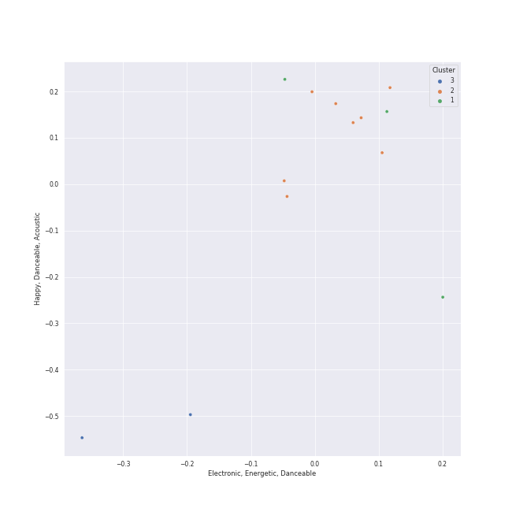

# Clusters in Parlophone UK

## Cluster #1

3 tracks

| Art | Track | Album | Artists | Label | Rank | 💚 | 🔗 |
|:---|:---|:---|:---|:---|---:|:---|:---|
|  | Feel Good Inc. | Demon Days | Gorillaz | [Parlophone UK](../..) | nan | | [🔗](https://open.spotify.com/track/0d28khcov6AiegSCpG5TuT) |
|  | Pocket Calculator / Dentaku | 3-D The Catalogue | Kraftwerk | [Parlophone UK](../..) | nan | 💚 | [🔗](https://open.spotify.com/track/2j4HbXODKGeJ33QTWRTfbS) |
|  | You Sexy Thing | Hot Chocolate | Hot Chocolate | [Parlophone UK](../..) | nan | | [🔗](https://open.spotify.com/track/714hERk9U1W8FMYkoC83CO) |
## Cluster #2

8 tracks

| Art | Track | Album | Artists | Label | Rank | 💚 | 🔗 |
|:---|:---|:---|:---|:---|---:|:---|:---|
|  | Viva La Vida | Viva La Vida or Death and All His Friends | [Coldplay](../../../../artists/coldplay/overview.md) | [Parlophone UK](../..) | nan | 💚 | [🔗](https://open.spotify.com/track/1mea3bSkSGXuIRvnydlB5b) |
|  | Yellow | Parachutes | [Coldplay](../../../../artists/coldplay/overview.md) | [Parlophone UK](../..) | nan | 💚 | [🔗](https://open.spotify.com/track/3AJwUDP919kvQ9QcozQPxg) |
|  | Princess of China | Mylo Xyloto | [Coldplay](../../../../artists/coldplay/overview.md), [Rihanna](../../../../artists/rihanna/overview.md) | [Parlophone UK](../..) | nan | | [🔗](https://open.spotify.com/track/4HXOBjwv2RnLpGG4xWOO6N) |
|  | Paradise | Mylo Xyloto | [Coldplay](../../../../artists/coldplay/overview.md) | [Parlophone UK](../..) | nan | | [🔗](https://open.spotify.com/track/6nek1Nin9q48AVZcWs9e9D) |
|  | Christmas Lights | Christmas Lights | [Coldplay](../../../../artists/coldplay/overview.md) | [Parlophone UK](../..) | nan | | [🔗](https://open.spotify.com/track/4fzyvSu73BhGvi96p2zwjL) |
|  | Hold On Tight | Hold On Tight | [aespa](../../../../artists/aespa/overview.md) | [Parlophone UK](../..) | 41 | 💚 | [🔗](https://open.spotify.com/track/1o844wI52S3TjXGBwvGcc7) |
|  | Daisy 2.0 (feat. Hatsune Miku) | Daisy 2.0 (feat. Hatsune Miku) | Ashnikko, Hatsune Miku | [Parlophone UK](../..) | 409 | 💚 | [🔗](https://open.spotify.com/track/0s8RXkQW9lwGEV6WlG8KDq) |
|  | Space Oddity - 2015 Remaster | David Bowie (aka Space Oddity) [2015 Remaster] | David Bowie | [Parlophone UK](../..) | nan | | [🔗](https://open.spotify.com/track/72Z17vmmeQKAg8bptWvpVG) |
## Cluster #3

2 tracks

| Art | Track | Album | Artists | Label | Rank | 💚 | 🔗 |
|:---|:---|:---|:---|:---|---:|:---|:---|
|  | BrokEn | Everyday Life | [Coldplay](../../../../artists/coldplay/overview.md) | [Parlophone UK](../..) | nan | | [🔗](https://open.spotify.com/track/1cXXhzPnbrXjNQYbLdUJdy) |
|  | ❤️ | Music Of The Spheres | [Coldplay](../../../../artists/coldplay/overview.md), We Are KING, [Jacob Collier](../../../../artists/jacob_collier/overview.md) | [Parlophone UK](../..) | nan | | [🔗](https://open.spotify.com/track/3oTYv0yShT4sjuPncoUXfK) |