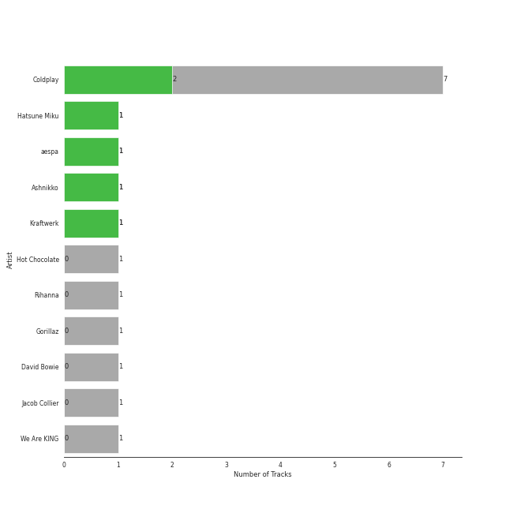
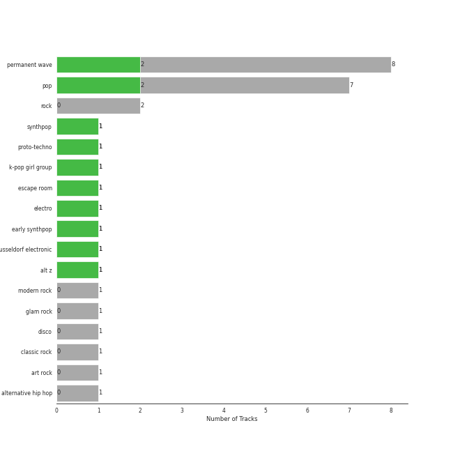
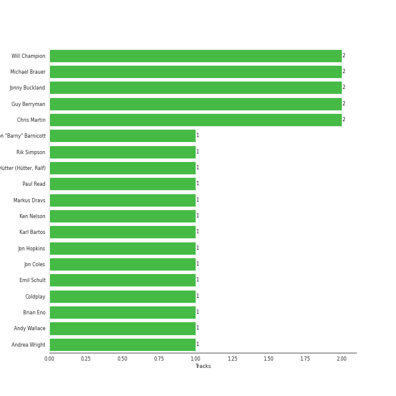

# Parlophone UK

13 songs

[See Track Features](audio_features.md)

[See Clusters](clusters/overview.md)

Appears as:
- Parlophone UK (13 tracks)

## Top Artists

| Art | Rank | Tracks | 💚 | Artist | 🔗 |
|:---|---:|---:|---:|:---|:---|
|  | 185 | 7 | 2 | [Coldplay](../../artists/coldplay/overview.md) | [🔗](https://open.spotify.com/artist/4gzpq5DPGxSnKTe4SA8HAU) |
|  | 298 | 1 | 1 | Hatsune Miku | [🔗](https://open.spotify.com/artist/6pNgnvzBa6Bthsv8SrZJYl) |
|  | 1 | 1 | 1 | [aespa](../../artists/aespa/overview.md) | [🔗](https://open.spotify.com/artist/6YVMFz59CuY7ngCxTxjpxE) |
|  | 299 | 1 | 1 | Ashnikko | [🔗](https://open.spotify.com/artist/3PyJHH2wyfQK3WZrk9rpmP) |
|  | 431 | 1 | 1 | Kraftwerk | [🔗](https://open.spotify.com/artist/0dmPX6ovclgOy8WWJaFEUU) |
|  | 431 | 1 | 0 | Hot Chocolate | [🔗](https://open.spotify.com/artist/72VzFto8DYvKHocaHYNWSi) |
|  | 129 | 1 | 0 | [Rihanna](../../artists/rihanna/overview.md) | [🔗](https://open.spotify.com/artist/5pKCCKE2ajJHZ9KAiaK11H) |
|  | 431 | 1 | 0 | Gorillaz | [🔗](https://open.spotify.com/artist/3AA28KZvwAUcZuOKwyblJQ) |
|  | 431 | 1 | 0 | David Bowie | [🔗](https://open.spotify.com/artist/0oSGxfWSnnOXhD2fKuz2Gy) |
|  | 38 | 1 | 0 | [Jacob Collier](../../artists/jacob_collier/overview.md) | [🔗](https://open.spotify.com/artist/0QWrMNukfcVOmgEU0FEDyD) |

See all 11 artists

| Art | Rank | Tracks | 💚 | Artist | 🔗 |
|:---|---:|---:|---:|:---|:---|
|  | 431 | 1 | 0 | We Are KING | [🔗](https://open.spotify.com/artist/0FPWyyf6MD4QZTj3aypD3O) |

## Top Albums

| Art | Rank | Tracks | 💚 | Album | Release Date | 🔗 |
|:---|---:|---:|---:|:---|:---|:---|
|  | 646 | 2 | 0 | Mylo Xyloto | 2011-10-24 | [🔗](https://open.spotify.com/album/2R7iJz5uaHjLEVnMkloO18) |
|  | 646 | 1 | 1 | Viva La Vida or Death and All His Friends | 2008-05-26 | [🔗](https://open.spotify.com/album/1CEODgTmTwLyabvwd7HBty) |
|  | 646 | 1 | 1 | Parachutes | 2000-07-10 | [🔗](https://open.spotify.com/album/6ZG5lRT77aJ3btmArcykra) |
|  | 39 | 1 | 1 | Hold On Tight | 2023-03-30 | [🔗](https://open.spotify.com/album/4bWGRs1SqNwFXaRDXRAANN) |
|  | 378 | 1 | 1 | Daisy 2.0 (feat. Hatsune Miku) | 2020-12-11 | [🔗](https://open.spotify.com/album/6JZYS7UElSfjyTgFgE1ApG) |
|  | 646 | 1 | 1 | 3-D The Catalogue | 2017-05-26 | [🔗](https://open.spotify.com/album/6nnO5r6I1JtSZ8eTwwIiIF) |
|  | 646 | 1 | 0 | Music Of The Spheres | 2021-10-15 | [🔗](https://open.spotify.com/album/06mXfvDsRZNfnsGZvX2zpb) |
|  | 646 | 1 | 0 | Hot Chocolate | 1975 | [🔗](https://open.spotify.com/album/10oMdAuUD0Tcc4BowCWUni) |
|  | 646 | 1 | 0 | Everyday Life | 2019-11-22 | [🔗](https://open.spotify.com/album/2FeyIYDDAQqcOJKOKhvHdr) |
|  | 646 | 1 | 0 | Demon Days | 2005-05-23 | [🔗](https://open.spotify.com/album/0bUTHlWbkSQysoM3VsWldT) |

See all 12 albums

| Art | Rank | Tracks | 💚 | Album | Release Date | 🔗 |
|:---|---:|---:|---:|:---|:---|:---|
|  | 646 | 1 | 0 | David Bowie (aka Space Oddity) [2015 Remaster] | 1969-11-04 | [🔗](https://open.spotify.com/album/1ay9Z4R5ZYI2TY7WiDhNYQ) |
|  | 646 | 1 | 0 | Christmas Lights | 2010-12-01 | [🔗](https://open.spotify.com/album/06CvxUVwS8h2aJYcCtApgy) |

## Genres

| Tracks | 💚 | Genre |
|---:|---:|:---|
| 8 | 2 | [permanent wave](../../genres/permanent_wave/overview.md) |
| 7 | 2 | [pop](../../genres/pop/overview.md) |
| 1 | 1 | synthpop |
| 1 | 1 | proto-techno |
| 1 | 1 | [k-pop girl group](../../genres/k-pop_girl_group/overview.md) |
| 1 | 1 | escape room |
| 1 | 1 | electro |
| 1 | 1 | early synthpop |
| 1 | 1 | dusseldorf electronic |
| 1 | 1 | alt z |

See all 17 genres

| Tracks | 💚 | Genre |
|---:|---:|:---|
| 2 | 0 | [rock](../../genres/rock/overview.md) |
| 1 | 0 | [modern rock](../../genres/modern_rock/overview.md) |
| 1 | 0 | glam rock |
| 1 | 0 | disco |
| 1 | 0 | [classic rock](../../genres/classic_rock/overview.md) |
| 1 | 0 | [art rock](../../genres/art_rock/overview.md) |
| 1 | 0 | alternative hip hop |

## Top Producers

| Art | Producer | Tracks | Credit Types |
|:---|:---|---:|:---|
| | Will Champion | 2 | Songwriter |
|  | Chris Martin | 2 | Songwriter |
| | Guy Berryman | 2 | Songwriter |
| | Jonny Buckland | 2 | Songwriter |
| | Michael Brauer | 2 | Producer |
| | Rik Simpson | 1 | Producer |
| | Emil Schult | 1 | Lyricist |
| | Ralf Hütter (Hütter, Ralf) | 1 | Lyricist, Songwriter |
| | Markus Dravs | 1 | Producer |
|  | [Coldplay](../../artists/coldplay/overview.md) | 1 | Producer |

View all

| Art | Producer | Tracks | Credit Types |
|:---|:---|---:|:---|
| | Andy Wallace | 1 | Producer |
| | Jon Coles | 1 | Producer |
| | Jon Hopkins | 1 | Producer |
| | Ken Nelson | 1 | Producer |
| | Paul Read | 1 | Producer |
| | Karl Bartos | 1 | Songwriter |
| | Andrea Wright | 1 | Producer |
| | Simon "Barny" Barnicott | 1 | Producer |
| | Brian Eno | 1 | Producer |

## Tracks released under Parlophone UK

| Art | Track | Album | Artists | Label | Rank | 💚 | 🔗 |
|:---|:---|:---|:---|:---|---:|:---|:---|
|  | Hold On Tight | Hold On Tight | [aespa](../../artists/aespa/overview.md) | [Parlophone UK](.) | 34 | 💚 | [🔗](https://open.spotify.com/track/1o844wI52S3TjXGBwvGcc7) |
|  | Daisy 2.0 (feat. Hatsune Miku) | Daisy 2.0 (feat. Hatsune Miku) | Ashnikko, Hatsune Miku | [Parlophone UK](.) | 555 | 💚 | [🔗](https://open.spotify.com/track/0s8RXkQW9lwGEV6WlG8KDq) |
|  | Space Oddity - 2015 Remaster | David Bowie (aka Space Oddity) [2015 Remaster] | David Bowie | [Parlophone UK](.) | 978 | | [🔗](https://open.spotify.com/track/72Z17vmmeQKAg8bptWvpVG) |
|  | You Sexy Thing | Hot Chocolate | Hot Chocolate | [Parlophone UK](.) | 978 | | [🔗](https://open.spotify.com/track/714hERk9U1W8FMYkoC83CO) |
|  | Yellow | Parachutes | [Coldplay](../../artists/coldplay/overview.md) | [Parlophone UK](.) | 978 | 💚 | [🔗](https://open.spotify.com/track/3AJwUDP919kvQ9QcozQPxg) |
|  | Feel Good Inc. | Demon Days | Gorillaz | [Parlophone UK](.) | 978 | | [🔗](https://open.spotify.com/track/0d28khcov6AiegSCpG5TuT) |
|  | Viva La Vida | Viva La Vida or Death and All His Friends | [Coldplay](../../artists/coldplay/overview.md) | [Parlophone UK](.) | 978 | 💚 | [🔗](https://open.spotify.com/track/1mea3bSkSGXuIRvnydlB5b) |
|  | Christmas Lights | Christmas Lights | [Coldplay](../../artists/coldplay/overview.md) | [Parlophone UK](.) | 978 | | [🔗](https://open.spotify.com/track/4fzyvSu73BhGvi96p2zwjL) |
|  | Paradise | Mylo Xyloto | [Coldplay](../../artists/coldplay/overview.md) | [Parlophone UK](.) | 978 | | [🔗](https://open.spotify.com/track/6nek1Nin9q48AVZcWs9e9D) |
|  | Princess of China | Mylo Xyloto | [Coldplay](../../artists/coldplay/overview.md), [Rihanna](../../artists/rihanna/overview.md) | [Parlophone UK](.) | 978 | | [🔗](https://open.spotify.com/track/4HXOBjwv2RnLpGG4xWOO6N) |

See all tracks

| Art | Track | Album | Artists | Label | Rank | 💚 | 🔗 |
|:---|:---|:---|:---|:---|---:|:---|:---|
|  | Pocket Calculator / Dentaku | 3-D The Catalogue | Kraftwerk | [Parlophone UK](.) | 978 | 💚 | [🔗](https://open.spotify.com/track/2j4HbXODKGeJ33QTWRTfbS) |
|  | BrokEn | Everyday Life | [Coldplay](../../artists/coldplay/overview.md) | [Parlophone UK](.) | 978 | | [🔗](https://open.spotify.com/track/1cXXhzPnbrXjNQYbLdUJdy) |
|  | ❤️ | Music Of The Spheres | [Coldplay](../../artists/coldplay/overview.md), We Are KING, [Jacob Collier](../../artists/jacob_collier/overview.md) | [Parlophone UK](.) | 978 | | [🔗](https://open.spotify.com/track/3oTYv0yShT4sjuPncoUXfK) |

