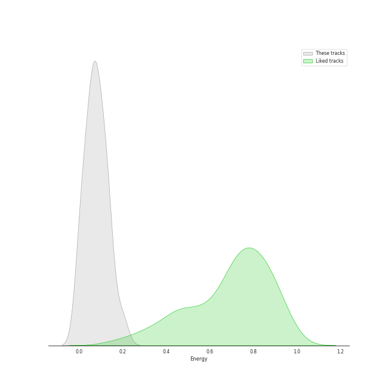
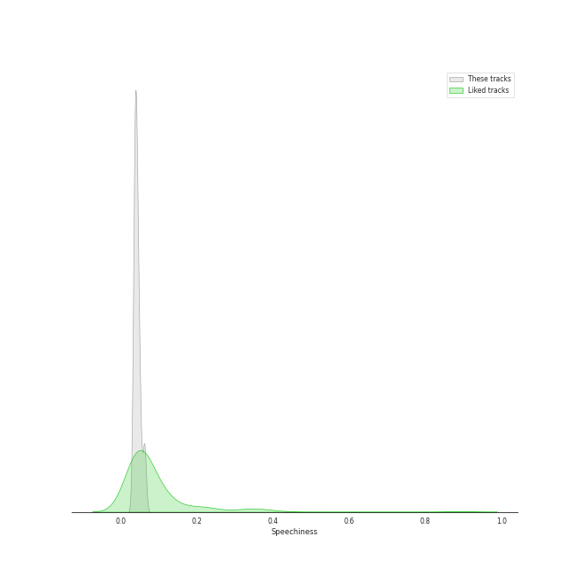
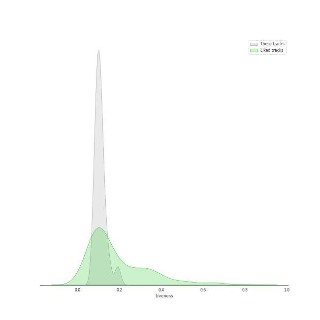
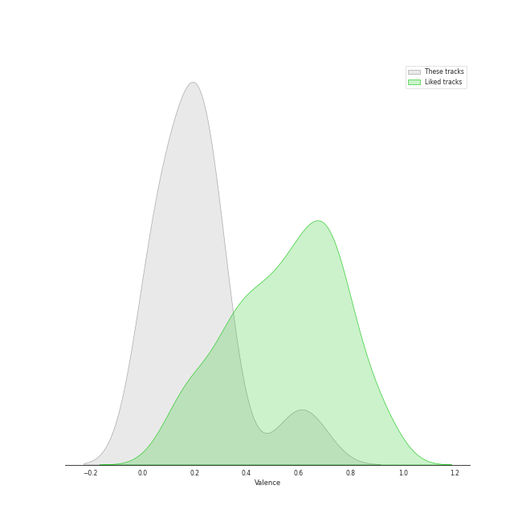

# Track Features for PENTATONE

## Danceability

| ​ | 10 most Danceable tracks | ​​ | 10 least Danceable tracks |
|:---|:---|:---|:---|
|  | Piano Sonata No. 3 in C Major, Op. 2 No. 3: III. Scherzo & Trio. Allegro (0.473) |  | Piano Sonata No. 3 in C Major, Op. 2 No. 3: II. Adagio (0.251) |
|  | Piano Sonata No. 2 in A Major, Op. 2 No. 2: III. Scherzo & Trio. Allegretto (0.468) |  | Piano Sonata No. 32 in C Minor, Op. 111: II. Arietta. Adagio molto semplice e cantabile (0.297) |
|  | Piano Sonata No. 1 in F Minor, Op. 2 No. 1: I. Allegro (0.464) |  | Piano Sonata No. 30 in E Major, Op. 109: II. Prestissimo (0.333) |
|  | Piano Sonata No. 31 in A-Flat Major, Op. 110: II. Allegro molto (0.459) |  | Piano Sonata No. 3 in C Major, Op. 2 No. 3: I. Allegro con brio (0.348) |
|  | Piano Sonata No. 32 in C Minor, Op. 111: I. Maestoso - Allegro con brio ed appassionato (0.448) |  | Piano Sonata No. 31 in A-Flat Major, Op. 110: III. Fuga. Allegro ma non troppo (0.361) |
|  | Piano Sonata No. 31 in A-Flat Major, Op. 110: III. Adagio ma non troppo (0.44) |  | Piano Sonata No. 2 in A Major, Op. 2 No. 2: IV. Rondo. Grazioso (0.362) |
|  | Piano Sonata No. 30 in E Major, Op. 109: III. Gesangvoll, mit innigster Empfindung. Andante molto cantabile ed espressivo (0.432) |  | Piano Sonata No. 3 in C Major, Op. 2 No. 3: IV. Allegro assai (0.369) |
|  | Piano Sonata No. 1 in F Minor, Op. 2 No. 1: IV. Prestissimo (0.429) |  | Piano Sonata No. 31 in A-Flat Major, Op. 110: I. Moderato cantabile molto espressivo (0.381) |
|  | Piano Sonata No. 30 in E Major, Op. 109: I. Vivace ma non troppo (0.399) |  | Piano Sonata No. 2 in A Major, Op. 2 No. 2: II. Largo appassionato (0.382) |
|  | Piano Sonata No. 2 in A Major, Op. 2 No. 2: I. Allegro vivace (0.394) |  | Piano Sonata No. 1 in F Minor, Op. 2 No. 1: II. Adagio (0.389) |

## Energy

| ​ | 10 most Energetic tracks | ​​ | 10 least Energetic tracks |
|:---|:---|:---|:---|
|  | Piano Sonata No. 32 in C Minor, Op. 111: I. Maestoso - Allegro con brio ed appassionato (0.196) |  | Piano Sonata No. 31 in A-Flat Major, Op. 110: III. Adagio ma non troppo (0.00293) |
|  | Piano Sonata No. 1 in F Minor, Op. 2 No. 1: IV. Prestissimo (0.139) |  | Piano Sonata No. 3 in C Major, Op. 2 No. 3: II. Adagio (0.00389) |
|  | Piano Sonata No. 3 in C Major, Op. 2 No. 3: IV. Allegro assai (0.138) |  | Piano Sonata No. 2 in A Major, Op. 2 No. 2: II. Largo appassionato (0.0057) |
|  | Piano Sonata No. 2 in A Major, Op. 2 No. 2: I. Allegro vivace (0.129) |  | Piano Sonata No. 1 in F Minor, Op. 2 No. 1: III. Menuetto. Allegretto (0.0243) |
|  | Piano Sonata No. 31 in A-Flat Major, Op. 110: II. Allegro molto (0.114) |  | Piano Sonata No. 1 in F Minor, Op. 2 No. 1: II. Adagio (0.0352) |
|  | Piano Sonata No. 3 in C Major, Op. 2 No. 3: I. Allegro con brio (0.109) |  | Piano Sonata No. 30 in E Major, Op. 109: III. Gesangvoll, mit innigster Empfindung. Andante molto cantabile ed espressivo (0.0512) |
|  | Piano Sonata No. 30 in E Major, Op. 109: II. Prestissimo (0.108) |  | Piano Sonata No. 31 in A-Flat Major, Op. 110: I. Moderato cantabile molto espressivo (0.0529) |
|  | Piano Sonata No. 2 in A Major, Op. 2 No. 2: IV. Rondo. Grazioso (0.0844) |  | Piano Sonata No. 1 in F Minor, Op. 2 No. 1: I. Allegro (0.0537) |
|  | Piano Sonata No. 30 in E Major, Op. 109: I. Vivace ma non troppo (0.0813) |  | Piano Sonata No. 32 in C Minor, Op. 111: II. Arietta. Adagio molto semplice e cantabile (0.0553) |
|  | Piano Sonata No. 2 in A Major, Op. 2 No. 2: III. Scherzo & Trio. Allegretto (0.0809) |  | Piano Sonata No. 3 in C Major, Op. 2 No. 3: III. Scherzo & Trio. Allegro (0.0738) |

## Speechiness

| ​ | 10 most Speechy tracks | ​​ | 10 least Speechy tracks |
|:---|:---|:---|:---|
|  | Piano Sonata No. 31 in A-Flat Major, Op. 110: III. Adagio ma non troppo (0.0634) |  | Piano Sonata No. 1 in F Minor, Op. 2 No. 1: IV. Prestissimo (0.0345) |
|  | Piano Sonata No. 31 in A-Flat Major, Op. 110: II. Allegro molto (0.0624) |  | Piano Sonata No. 2 in A Major, Op. 2 No. 2: III. Scherzo & Trio. Allegretto (0.0352) |
|  | Piano Sonata No. 32 in C Minor, Op. 111: I. Maestoso - Allegro con brio ed appassionato (0.0525) |  | Piano Sonata No. 1 in F Minor, Op. 2 No. 1: I. Allegro (0.0369) |
|  | Piano Sonata No. 3 in C Major, Op. 2 No. 3: II. Adagio (0.0497) |  | Piano Sonata No. 32 in C Minor, Op. 111: II. Arietta. Adagio molto semplice e cantabile (0.0375) |
|  | Piano Sonata No. 30 in E Major, Op. 109: III. Gesangvoll, mit innigster Empfindung. Andante molto cantabile ed espressivo (0.0482) |  | Piano Sonata No. 30 in E Major, Op. 109: II. Prestissimo (0.0378) |
|  | Piano Sonata No. 1 in F Minor, Op. 2 No. 1: II. Adagio (0.0468) |  | Piano Sonata No. 2 in A Major, Op. 2 No. 2: IV. Rondo. Grazioso (0.0378) |
|  | Piano Sonata No. 31 in A-Flat Major, Op. 110: I. Moderato cantabile molto espressivo (0.0446) |  | Piano Sonata No. 30 in E Major, Op. 109: I. Vivace ma non troppo (0.0381) |
|  | Piano Sonata No. 1 in F Minor, Op. 2 No. 1: III. Menuetto. Allegretto (0.0435) |  | Piano Sonata No. 3 in C Major, Op. 2 No. 3: III. Scherzo & Trio. Allegro (0.0391) |
|  | Piano Sonata No. 2 in A Major, Op. 2 No. 2: II. Largo appassionato (0.043) |  | Piano Sonata No. 31 in A-Flat Major, Op. 110: III. Fuga. Allegro ma non troppo (0.0399) |
|  | Piano Sonata No. 2 in A Major, Op. 2 No. 2: I. Allegro vivace (0.0418) |  | Piano Sonata No. 3 in C Major, Op. 2 No. 3: IV. Allegro assai (0.041) |

## Acousticness

| ​ | 10 most Acoustic tracks | ​​ | 10 least Acoustic tracks |
|:---|:---|:---|:---|
|  | Piano Sonata No. 31 in A-Flat Major, Op. 110: III. Adagio ma non troppo (0.995) |  | Piano Sonata No. 32 in C Minor, Op. 111: I. Maestoso - Allegro con brio ed appassionato (0.983) |
|  | Piano Sonata No. 1 in F Minor, Op. 2 No. 1: III. Menuetto. Allegretto (0.995) |  | Piano Sonata No. 32 in C Minor, Op. 111: II. Arietta. Adagio molto semplice e cantabile (0.985) |
|  | Piano Sonata No. 2 in A Major, Op. 2 No. 2: III. Scherzo & Trio. Allegretto (0.994) |  | Piano Sonata No. 30 in E Major, Op. 109: I. Vivace ma non troppo (0.986) |
|  | Piano Sonata No. 3 in C Major, Op. 2 No. 3: II. Adagio (0.994) |  | Piano Sonata No. 31 in A-Flat Major, Op. 110: I. Moderato cantabile molto espressivo (0.988) |
|  | Piano Sonata No. 2 in A Major, Op. 2 No. 2: II. Largo appassionato (0.994) |  | Piano Sonata No. 3 in C Major, Op. 2 No. 3: IV. Allegro assai (0.988) |
|  | Piano Sonata No. 1 in F Minor, Op. 2 No. 1: IV. Prestissimo (0.992) |  | Piano Sonata No. 2 in A Major, Op. 2 No. 2: I. Allegro vivace (0.988) |
|  | Piano Sonata No. 31 in A-Flat Major, Op. 110: III. Fuga. Allegro ma non troppo (0.992) |  | Piano Sonata No. 3 in C Major, Op. 2 No. 3: I. Allegro con brio (0.989) |
|  | Piano Sonata No. 2 in A Major, Op. 2 No. 2: IV. Rondo. Grazioso (0.991) |  | Piano Sonata No. 30 in E Major, Op. 109: II. Prestissimo (0.989) |
|  | Piano Sonata No. 31 in A-Flat Major, Op. 110: II. Allegro molto (0.991) |  | Piano Sonata No. 1 in F Minor, Op. 2 No. 1: I. Allegro (0.99) |
|  | Piano Sonata No. 3 in C Major, Op. 2 No. 3: III. Scherzo & Trio. Allegro (0.991) |  | Piano Sonata No. 30 in E Major, Op. 109: III. Gesangvoll, mit innigster Empfindung. Andante molto cantabile ed espressivo (0.99) |

## Instrumentalness

| ​ | 10 most Instrumental tracks | ​​ | 10 least Instrumental tracks |
|:---|:---|:---|:---|
|  | Piano Sonata No. 31 in A-Flat Major, Op. 110: II. Allegro molto (0.949) |  | Piano Sonata No. 1 in F Minor, Op. 2 No. 1: IV. Prestissimo (0.846) |
|  | Piano Sonata No. 30 in E Major, Op. 109: I. Vivace ma non troppo (0.948) |  | Piano Sonata No. 1 in F Minor, Op. 2 No. 1: III. Menuetto. Allegretto (0.867) |
|  | Piano Sonata No. 2 in A Major, Op. 2 No. 2: II. Largo appassionato (0.945) |  | Piano Sonata No. 31 in A-Flat Major, Op. 110: I. Moderato cantabile molto espressivo (0.881) |
|  | Piano Sonata No. 3 in C Major, Op. 2 No. 3: II. Adagio (0.929) |  | Piano Sonata No. 32 in C Minor, Op. 111: I. Maestoso - Allegro con brio ed appassionato (0.883) |
|  | Piano Sonata No. 31 in A-Flat Major, Op. 110: III. Adagio ma non troppo (0.927) |  | Piano Sonata No. 31 in A-Flat Major, Op. 110: III. Fuga. Allegro ma non troppo (0.883) |
|  | Piano Sonata No. 2 in A Major, Op. 2 No. 2: I. Allegro vivace (0.923) |  | Piano Sonata No. 3 in C Major, Op. 2 No. 3: III. Scherzo & Trio. Allegro (0.889) |
|  | Piano Sonata No. 32 in C Minor, Op. 111: II. Arietta. Adagio molto semplice e cantabile (0.919) |  | Piano Sonata No. 1 in F Minor, Op. 2 No. 1: II. Adagio (0.891) |
|  | Piano Sonata No. 3 in C Major, Op. 2 No. 3: I. Allegro con brio (0.918) |  | Piano Sonata No. 1 in F Minor, Op. 2 No. 1: I. Allegro (0.9) |
|  | Piano Sonata No. 30 in E Major, Op. 109: III. Gesangvoll, mit innigster Empfindung. Andante molto cantabile ed espressivo (0.916) |  | Piano Sonata No. 2 in A Major, Op. 2 No. 2: IV. Rondo. Grazioso (0.91) |
|  | Piano Sonata No. 30 in E Major, Op. 109: II. Prestissimo (0.915) |  | Piano Sonata No. 2 in A Major, Op. 2 No. 2: III. Scherzo & Trio. Allegretto (0.911) |

## Liveness

| ​ | 10 most Live tracks | ​​ | 10 least Live tracks |
|:---|:---|:---|:---|
|  | Piano Sonata No. 30 in E Major, Op. 109: II. Prestissimo (0.191) |  | Piano Sonata No. 2 in A Major, Op. 2 No. 2: II. Largo appassionato (0.0799) |
|  | Piano Sonata No. 3 in C Major, Op. 2 No. 3: IV. Allegro assai (0.148) |  | Piano Sonata No. 30 in E Major, Op. 109: III. Gesangvoll, mit innigster Empfindung. Andante molto cantabile ed espressivo (0.0802) |
|  | Piano Sonata No. 31 in A-Flat Major, Op. 110: III. Fuga. Allegro ma non troppo (0.132) |  | Piano Sonata No. 1 in F Minor, Op. 2 No. 1: II. Adagio (0.0832) |
|  | Piano Sonata No. 1 in F Minor, Op. 2 No. 1: IV. Prestissimo (0.126) |  | Piano Sonata No. 32 in C Minor, Op. 111: II. Arietta. Adagio molto semplice e cantabile (0.0861) |
|  | Piano Sonata No. 31 in A-Flat Major, Op. 110: II. Allegro molto (0.115) |  | Piano Sonata No. 3 in C Major, Op. 2 No. 3: I. Allegro con brio (0.0905) |
|  | Piano Sonata No. 3 in C Major, Op. 2 No. 3: III. Scherzo & Trio. Allegro (0.113) |  | Piano Sonata No. 32 in C Minor, Op. 111: I. Maestoso - Allegro con brio ed appassionato (0.0917) |
|  | Piano Sonata No. 1 in F Minor, Op. 2 No. 1: III. Menuetto. Allegretto (0.11) |  | Piano Sonata No. 2 in A Major, Op. 2 No. 2: I. Allegro vivace (0.0944) |
|  | Piano Sonata No. 30 in E Major, Op. 109: I. Vivace ma non troppo (0.109) |  | Piano Sonata No. 1 in F Minor, Op. 2 No. 1: I. Allegro (0.0951) |
|  | Piano Sonata No. 3 in C Major, Op. 2 No. 3: II. Adagio (0.108) |  | Piano Sonata No. 31 in A-Flat Major, Op. 110: III. Adagio ma non troppo (0.0953) |
|  | Piano Sonata No. 2 in A Major, Op. 2 No. 2: IV. Rondo. Grazioso (0.107) |  | Piano Sonata No. 2 in A Major, Op. 2 No. 2: III. Scherzo & Trio. Allegretto (0.0994) |

## Valence

| ​ | 10 most Happy tracks | ​​ | 10 least Happy tracks |
|:---|:---|:---|:---|
|  | Piano Sonata No. 31 in A-Flat Major, Op. 110: II. Allegro molto (0.652) |  | Piano Sonata No. 31 in A-Flat Major, Op. 110: III. Adagio ma non troppo (0.0355) |
|  | Piano Sonata No. 3 in C Major, Op. 2 No. 3: III. Scherzo & Trio. Allegro (0.573) |  | Piano Sonata No. 30 in E Major, Op. 109: III. Gesangvoll, mit innigster Empfindung. Andante molto cantabile ed espressivo (0.039) |
|  | Piano Sonata No. 3 in C Major, Op. 2 No. 3: IV. Allegro assai (0.293) |  | Piano Sonata No. 32 in C Minor, Op. 111: II. Arietta. Adagio molto semplice e cantabile (0.0397) |
|  | Piano Sonata No. 2 in A Major, Op. 2 No. 2: I. Allegro vivace (0.28) |  | Piano Sonata No. 31 in A-Flat Major, Op. 110: III. Fuga. Allegro ma non troppo (0.0551) |
|  | Piano Sonata No. 2 in A Major, Op. 2 No. 2: II. Largo appassionato (0.277) |  | Piano Sonata No. 30 in E Major, Op. 109: I. Vivace ma non troppo (0.0638) |
|  | Piano Sonata No. 2 in A Major, Op. 2 No. 2: III. Scherzo & Trio. Allegretto (0.25) |  | Piano Sonata No. 31 in A-Flat Major, Op. 110: I. Moderato cantabile molto espressivo (0.0705) |
|  | Piano Sonata No. 30 in E Major, Op. 109: II. Prestissimo (0.236) |  | Piano Sonata No. 3 in C Major, Op. 2 No. 3: II. Adagio (0.119) |
|  | Piano Sonata No. 1 in F Minor, Op. 2 No. 1: I. Allegro (0.229) |  | Piano Sonata No. 32 in C Minor, Op. 111: I. Maestoso - Allegro con brio ed appassionato (0.164) |
|  | Piano Sonata No. 1 in F Minor, Op. 2 No. 1: IV. Prestissimo (0.213) |  | Piano Sonata No. 2 in A Major, Op. 2 No. 2: IV. Rondo. Grazioso (0.18) |
|  | Piano Sonata No. 1 in F Minor, Op. 2 No. 1: II. Adagio (0.209) |  | Piano Sonata No. 3 in C Major, Op. 2 No. 3: I. Allegro con brio (0.191) |

## Tempo

| ​ | 10 most Fast tracks | ​​ | 10 least Fast tracks |
|:---|:---|:---|:---|
|  | Piano Sonata No. 2 in A Major, Op. 2 No. 2: I. Allegro vivace (141.013) |  | Piano Sonata No. 32 in C Minor, Op. 111: II. Arietta. Adagio molto semplice e cantabile (65.297) |
|  | Piano Sonata No. 31 in A-Flat Major, Op. 110: III. Fuga. Allegro ma non troppo (138.312) |  | Piano Sonata No. 3 in C Major, Op. 2 No. 3: II. Adagio (68.873) |
|  | Piano Sonata No. 31 in A-Flat Major, Op. 110: II. Allegro molto (131.129) |  | Piano Sonata No. 1 in F Minor, Op. 2 No. 1: III. Menuetto. Allegretto (71.211) |
|  | Piano Sonata No. 3 in C Major, Op. 2 No. 3: III. Scherzo & Trio. Allegro (127.806) |  | Piano Sonata No. 3 in C Major, Op. 2 No. 3: I. Allegro con brio (73.239) |
|  | Piano Sonata No. 1 in F Minor, Op. 2 No. 1: II. Adagio (127.789) |  | Piano Sonata No. 2 in A Major, Op. 2 No. 2: II. Largo appassionato (77.63) |
|  | Piano Sonata No. 30 in E Major, Op. 109: III. Gesangvoll, mit innigster Empfindung. Andante molto cantabile ed espressivo (127.747) |  | Piano Sonata No. 30 in E Major, Op. 109: II. Prestissimo (77.921) |
|  | Piano Sonata No. 3 in C Major, Op. 2 No. 3: IV. Allegro assai (125.263) |  | Piano Sonata No. 2 in A Major, Op. 2 No. 2: III. Scherzo & Trio. Allegretto (92.637) |
|  | Piano Sonata No. 31 in A-Flat Major, Op. 110: I. Moderato cantabile molto espressivo (124.936) |  | Piano Sonata No. 1 in F Minor, Op. 2 No. 1: IV. Prestissimo (104.535) |
|  | Piano Sonata No. 32 in C Minor, Op. 111: I. Maestoso - Allegro con brio ed appassionato (120.46) |  | Piano Sonata No. 1 in F Minor, Op. 2 No. 1: I. Allegro (109.415) |
|  | Piano Sonata No. 2 in A Major, Op. 2 No. 2: IV. Rondo. Grazioso (119.125) |  | Piano Sonata No. 31 in A-Flat Major, Op. 110: III. Adagio ma non troppo (110.825) |
