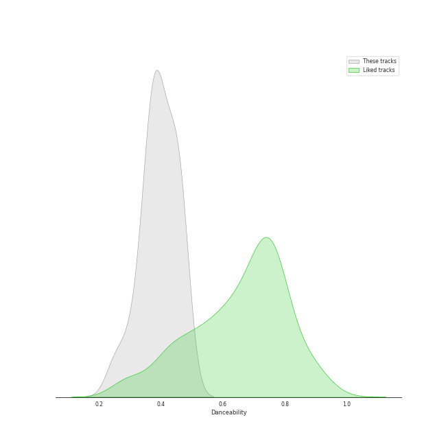
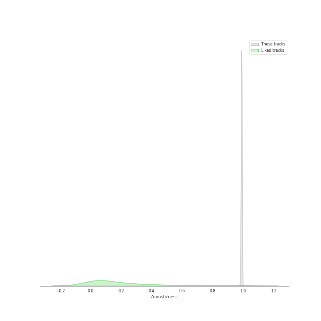
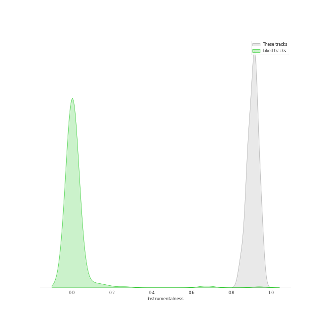
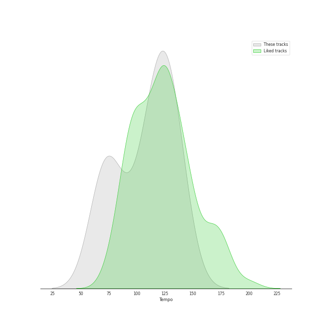

# Audio Features for PENTATONE

## Danceability

| 10 most Danceable tracks | 10 least Danceable tracks |
|:---|:---|
| Piano Sonata No. 3 in C Major, Op. 2, No. 3: III. Scherzo: Allegro - Trio (0.473) | Piano Sonata No. 3 in C Major, Op. 2, No. 3: II. Adagio (0.251) |
| Piano Sonata No. 2 in A Major, Op. 2, No. 2: III. Scherzo: Allegretto - Trio (0.468) | Piano Sonata No. 32 in C Minor, Op. 111: II. Arietta. Adagio molto semplice e cantabile (0.297) |
| Piano Sonata No. 1 in F Minor, Op. 2, No. 1: I. Allegro (0.464) | Piano Sonata No. 30 in E Major, Op. 109: II. Prestissimo (0.333) |
| Piano Sonata No. 31 in A-Flat Major, Op. 110: II. Allegro molto (0.459) | Piano Sonata No. 3 in C Major, Op. 2, No. 3: I. Allegro con brio (0.348) |
| Piano Sonata No. 32 in C Minor, Op. 111: I. Maestoso - Allegro con brio ed appassionato (0.448) | Piano Sonata No. 31 in A-Flat Major, Op. 110: III. Fuga. Allegro ma non troppo (0.361) |
| Piano Sonata No. 31 in A-Flat Major, Op. 110: III. Adagio ma non troppo - (0.44) | Piano Sonata No. 2 in A Major, Op. 2, No. 2: IV. Rondo: Grazioso (0.362) |
| Piano Sonata No. 30 in E Major, Op. 109: III. Gesangvoll, mit innigster Empfindung. Andante molto cantabile ed espressivo (0.432) | Piano Sonata No. 3 in C Major, Op. 2, No. 3: IV. Allegro assai (0.369) |
| Piano Sonata No. 1 in F Minor, Op. 2, No. 1: IV. Prestissimo (0.429) | Piano Sonata No. 31 in A-Flat Major, Op. 110: I. Moderato cantabile molto espressivo (0.381) |
| Piano Sonata No. 30 in E Major, Op. 109: I. Vivace ma non troppo (0.399) | Piano Sonata No. 2 in A Major, Op. 2, No. 2: II. Largo appassionato (0.382) |
| Piano Sonata No. 2 in A Major, Op. 2, No. 2: I. Allegro vivace (0.394) | Piano Sonata No. 1 in F Minor, Op. 2, No. 1: II. Adagio (0.389) |

## Energy

| 10 most Energetic tracks | 10 least Energetic tracks |
|:---|:---|
| Piano Sonata No. 32 in C Minor, Op. 111: I. Maestoso - Allegro con brio ed appassionato (0.196) | Piano Sonata No. 31 in A-Flat Major, Op. 110: III. Adagio ma non troppo - (0.00293) |
| Piano Sonata No. 1 in F Minor, Op. 2, No. 1: IV. Prestissimo (0.139) | Piano Sonata No. 3 in C Major, Op. 2, No. 3: II. Adagio (0.00389) |
| Piano Sonata No. 3 in C Major, Op. 2, No. 3: IV. Allegro assai (0.138) | Piano Sonata No. 2 in A Major, Op. 2, No. 2: II. Largo appassionato (0.0057) |
| Piano Sonata No. 2 in A Major, Op. 2, No. 2: I. Allegro vivace (0.129) | Piano Sonata No. 1 in F Minor, Op. 2, No. 1: III. Menuetto: Allegretto (0.0243) |
| Piano Sonata No. 31 in A-Flat Major, Op. 110: II. Allegro molto (0.114) | Piano Sonata No. 1 in F Minor, Op. 2, No. 1: II. Adagio (0.0352) |
| Piano Sonata No. 3 in C Major, Op. 2, No. 3: I. Allegro con brio (0.109) | Piano Sonata No. 30 in E Major, Op. 109: III. Gesangvoll, mit innigster Empfindung. Andante molto cantabile ed espressivo (0.0512) |
| Piano Sonata No. 30 in E Major, Op. 109: II. Prestissimo (0.108) | Piano Sonata No. 31 in A-Flat Major, Op. 110: I. Moderato cantabile molto espressivo (0.0529) |
| Piano Sonata No. 2 in A Major, Op. 2, No. 2: IV. Rondo: Grazioso (0.0844) | Piano Sonata No. 1 in F Minor, Op. 2, No. 1: I. Allegro (0.0537) |
| Piano Sonata No. 30 in E Major, Op. 109: I. Vivace ma non troppo (0.0813) | Piano Sonata No. 32 in C Minor, Op. 111: II. Arietta. Adagio molto semplice e cantabile (0.0553) |
| Piano Sonata No. 2 in A Major, Op. 2, No. 2: III. Scherzo: Allegretto - Trio (0.0809) | Piano Sonata No. 3 in C Major, Op. 2, No. 3: III. Scherzo: Allegro - Trio (0.0738) |

## Speechiness

| 10 most Speechy tracks | 10 least Speechy tracks |
|:---|:---|
| Piano Sonata No. 31 in A-Flat Major, Op. 110: III. Adagio ma non troppo - (0.0634) | Piano Sonata No. 1 in F Minor, Op. 2, No. 1: IV. Prestissimo (0.0345) |
| Piano Sonata No. 31 in A-Flat Major, Op. 110: II. Allegro molto (0.0624) | Piano Sonata No. 2 in A Major, Op. 2, No. 2: III. Scherzo: Allegretto - Trio (0.0352) |
| Piano Sonata No. 32 in C Minor, Op. 111: I. Maestoso - Allegro con brio ed appassionato (0.0525) | Piano Sonata No. 1 in F Minor, Op. 2, No. 1: I. Allegro (0.0369) |
| Piano Sonata No. 3 in C Major, Op. 2, No. 3: II. Adagio (0.0497) | Piano Sonata No. 32 in C Minor, Op. 111: II. Arietta. Adagio molto semplice e cantabile (0.0375) |
| Piano Sonata No. 30 in E Major, Op. 109: III. Gesangvoll, mit innigster Empfindung. Andante molto cantabile ed espressivo (0.0482) | Piano Sonata No. 30 in E Major, Op. 109: II. Prestissimo (0.0378) |
| Piano Sonata No. 1 in F Minor, Op. 2, No. 1: II. Adagio (0.0468) | Piano Sonata No. 2 in A Major, Op. 2, No. 2: IV. Rondo: Grazioso (0.0378) |
| Piano Sonata No. 31 in A-Flat Major, Op. 110: I. Moderato cantabile molto espressivo (0.0446) | Piano Sonata No. 30 in E Major, Op. 109: I. Vivace ma non troppo (0.0381) |
| Piano Sonata No. 1 in F Minor, Op. 2, No. 1: III. Menuetto: Allegretto (0.0435) | Piano Sonata No. 3 in C Major, Op. 2, No. 3: III. Scherzo: Allegro - Trio (0.0391) |
| Piano Sonata No. 2 in A Major, Op. 2, No. 2: II. Largo appassionato (0.043) | Piano Sonata No. 31 in A-Flat Major, Op. 110: III. Fuga. Allegro ma non troppo (0.0399) |
| Piano Sonata No. 2 in A Major, Op. 2, No. 2: I. Allegro vivace (0.0418) | Piano Sonata No. 3 in C Major, Op. 2, No. 3: IV. Allegro assai (0.041) |

## Acousticness

| 10 most Acoustic tracks | 10 least Acoustic tracks |
|:---|:---|
| Piano Sonata No. 31 in A-Flat Major, Op. 110: III. Adagio ma non troppo - (0.995) | Piano Sonata No. 32 in C Minor, Op. 111: I. Maestoso - Allegro con brio ed appassionato (0.983) |
| Piano Sonata No. 1 in F Minor, Op. 2, No. 1: III. Menuetto: Allegretto (0.995) | Piano Sonata No. 32 in C Minor, Op. 111: II. Arietta. Adagio molto semplice e cantabile (0.985) |
| Piano Sonata No. 2 in A Major, Op. 2, No. 2: III. Scherzo: Allegretto - Trio (0.994) | Piano Sonata No. 30 in E Major, Op. 109: I. Vivace ma non troppo (0.986) |
| Piano Sonata No. 3 in C Major, Op. 2, No. 3: II. Adagio (0.994) | Piano Sonata No. 31 in A-Flat Major, Op. 110: I. Moderato cantabile molto espressivo (0.988) |
| Piano Sonata No. 2 in A Major, Op. 2, No. 2: II. Largo appassionato (0.994) | Piano Sonata No. 3 in C Major, Op. 2, No. 3: IV. Allegro assai (0.988) |
| Piano Sonata No. 1 in F Minor, Op. 2, No. 1: IV. Prestissimo (0.992) | Piano Sonata No. 2 in A Major, Op. 2, No. 2: I. Allegro vivace (0.988) |
| Piano Sonata No. 31 in A-Flat Major, Op. 110: III. Fuga. Allegro ma non troppo (0.992) | Piano Sonata No. 3 in C Major, Op. 2, No. 3: I. Allegro con brio (0.989) |
| Piano Sonata No. 2 in A Major, Op. 2, No. 2: IV. Rondo: Grazioso (0.991) | Piano Sonata No. 30 in E Major, Op. 109: II. Prestissimo (0.989) |
| Piano Sonata No. 31 in A-Flat Major, Op. 110: II. Allegro molto (0.991) | Piano Sonata No. 1 in F Minor, Op. 2, No. 1: I. Allegro (0.99) |
| Piano Sonata No. 3 in C Major, Op. 2, No. 3: III. Scherzo: Allegro - Trio (0.991) | Piano Sonata No. 30 in E Major, Op. 109: III. Gesangvoll, mit innigster Empfindung. Andante molto cantabile ed espressivo (0.99) |

## Instrumentalness

| 10 most Instrumental tracks | 10 least Instrumental tracks |
|:---|:---|
| Piano Sonata No. 31 in A-Flat Major, Op. 110: II. Allegro molto (0.949) | Piano Sonata No. 1 in F Minor, Op. 2, No. 1: IV. Prestissimo (0.846) |
| Piano Sonata No. 30 in E Major, Op. 109: I. Vivace ma non troppo (0.948) | Piano Sonata No. 1 in F Minor, Op. 2, No. 1: III. Menuetto: Allegretto (0.867) |
| Piano Sonata No. 2 in A Major, Op. 2, No. 2: II. Largo appassionato (0.945) | Piano Sonata No. 31 in A-Flat Major, Op. 110: I. Moderato cantabile molto espressivo (0.881) |
| Piano Sonata No. 3 in C Major, Op. 2, No. 3: II. Adagio (0.929) | Piano Sonata No. 32 in C Minor, Op. 111: I. Maestoso - Allegro con brio ed appassionato (0.883) |
| Piano Sonata No. 31 in A-Flat Major, Op. 110: III. Adagio ma non troppo - (0.927) | Piano Sonata No. 31 in A-Flat Major, Op. 110: III. Fuga. Allegro ma non troppo (0.883) |
| Piano Sonata No. 2 in A Major, Op. 2, No. 2: I. Allegro vivace (0.923) | Piano Sonata No. 3 in C Major, Op. 2, No. 3: III. Scherzo: Allegro - Trio (0.889) |
| Piano Sonata No. 32 in C Minor, Op. 111: II. Arietta. Adagio molto semplice e cantabile (0.919) | Piano Sonata No. 1 in F Minor, Op. 2, No. 1: II. Adagio (0.891) |
| Piano Sonata No. 3 in C Major, Op. 2, No. 3: I. Allegro con brio (0.918) | Piano Sonata No. 1 in F Minor, Op. 2, No. 1: I. Allegro (0.9) |
| Piano Sonata No. 30 in E Major, Op. 109: III. Gesangvoll, mit innigster Empfindung. Andante molto cantabile ed espressivo (0.916) | Piano Sonata No. 2 in A Major, Op. 2, No. 2: IV. Rondo: Grazioso (0.91) |
| Piano Sonata No. 30 in E Major, Op. 109: II. Prestissimo (0.915) | Piano Sonata No. 2 in A Major, Op. 2, No. 2: III. Scherzo: Allegretto - Trio (0.911) |

## Liveness

| 10 most Live tracks | 10 least Live tracks |
|:---|:---|
| Piano Sonata No. 30 in E Major, Op. 109: II. Prestissimo (0.191) | Piano Sonata No. 2 in A Major, Op. 2, No. 2: II. Largo appassionato (0.0799) |
| Piano Sonata No. 3 in C Major, Op. 2, No. 3: IV. Allegro assai (0.148) | Piano Sonata No. 30 in E Major, Op. 109: III. Gesangvoll, mit innigster Empfindung. Andante molto cantabile ed espressivo (0.0802) |
| Piano Sonata No. 31 in A-Flat Major, Op. 110: III. Fuga. Allegro ma non troppo (0.132) | Piano Sonata No. 1 in F Minor, Op. 2, No. 1: II. Adagio (0.0832) |
| Piano Sonata No. 1 in F Minor, Op. 2, No. 1: IV. Prestissimo (0.126) | Piano Sonata No. 32 in C Minor, Op. 111: II. Arietta. Adagio molto semplice e cantabile (0.0861) |
| Piano Sonata No. 31 in A-Flat Major, Op. 110: II. Allegro molto (0.115) | Piano Sonata No. 3 in C Major, Op. 2, No. 3: I. Allegro con brio (0.0905) |
| Piano Sonata No. 3 in C Major, Op. 2, No. 3: III. Scherzo: Allegro - Trio (0.113) | Piano Sonata No. 32 in C Minor, Op. 111: I. Maestoso - Allegro con brio ed appassionato (0.0917) |
| Piano Sonata No. 1 in F Minor, Op. 2, No. 1: III. Menuetto: Allegretto (0.11) | Piano Sonata No. 2 in A Major, Op. 2, No. 2: I. Allegro vivace (0.0944) |
| Piano Sonata No. 30 in E Major, Op. 109: I. Vivace ma non troppo (0.109) | Piano Sonata No. 1 in F Minor, Op. 2, No. 1: I. Allegro (0.0951) |
| Piano Sonata No. 3 in C Major, Op. 2, No. 3: II. Adagio (0.108) | Piano Sonata No. 31 in A-Flat Major, Op. 110: III. Adagio ma non troppo - (0.0953) |
| Piano Sonata No. 2 in A Major, Op. 2, No. 2: IV. Rondo: Grazioso (0.107) | Piano Sonata No. 2 in A Major, Op. 2, No. 2: III. Scherzo: Allegretto - Trio (0.0994) |

## Valence

| 10 most Happy tracks | 10 least Happy tracks |
|:---|:---|
| Piano Sonata No. 31 in A-Flat Major, Op. 110: II. Allegro molto (0.652) | Piano Sonata No. 31 in A-Flat Major, Op. 110: III. Adagio ma non troppo - (0.0355) |
| Piano Sonata No. 3 in C Major, Op. 2, No. 3: III. Scherzo: Allegro - Trio (0.573) | Piano Sonata No. 30 in E Major, Op. 109: III. Gesangvoll, mit innigster Empfindung. Andante molto cantabile ed espressivo (0.039) |
| Piano Sonata No. 3 in C Major, Op. 2, No. 3: IV. Allegro assai (0.293) | Piano Sonata No. 32 in C Minor, Op. 111: II. Arietta. Adagio molto semplice e cantabile (0.0397) |
| Piano Sonata No. 2 in A Major, Op. 2, No. 2: I. Allegro vivace (0.28) | Piano Sonata No. 31 in A-Flat Major, Op. 110: III. Fuga. Allegro ma non troppo (0.0551) |
| Piano Sonata No. 2 in A Major, Op. 2, No. 2: II. Largo appassionato (0.277) | Piano Sonata No. 30 in E Major, Op. 109: I. Vivace ma non troppo (0.0638) |
| Piano Sonata No. 2 in A Major, Op. 2, No. 2: III. Scherzo: Allegretto - Trio (0.25) | Piano Sonata No. 31 in A-Flat Major, Op. 110: I. Moderato cantabile molto espressivo (0.0705) |
| Piano Sonata No. 30 in E Major, Op. 109: II. Prestissimo (0.236) | Piano Sonata No. 3 in C Major, Op. 2, No. 3: II. Adagio (0.119) |
| Piano Sonata No. 1 in F Minor, Op. 2, No. 1: I. Allegro (0.229) | Piano Sonata No. 32 in C Minor, Op. 111: I. Maestoso - Allegro con brio ed appassionato (0.164) |
| Piano Sonata No. 1 in F Minor, Op. 2, No. 1: IV. Prestissimo (0.213) | Piano Sonata No. 2 in A Major, Op. 2, No. 2: IV. Rondo: Grazioso (0.18) |
| Piano Sonata No. 1 in F Minor, Op. 2, No. 1: II. Adagio (0.209) | Piano Sonata No. 3 in C Major, Op. 2, No. 3: I. Allegro con brio (0.191) |

## Tempo

| 10 most Fast tracks | 10 least Fast tracks |
|:---|:---|
| Piano Sonata No. 2 in A Major, Op. 2, No. 2: I. Allegro vivace (141.013) | Piano Sonata No. 32 in C Minor, Op. 111: II. Arietta. Adagio molto semplice e cantabile (65.297) |
| Piano Sonata No. 31 in A-Flat Major, Op. 110: III. Fuga. Allegro ma non troppo (138.312) | Piano Sonata No. 3 in C Major, Op. 2, No. 3: II. Adagio (68.873) |
| Piano Sonata No. 31 in A-Flat Major, Op. 110: II. Allegro molto (131.129) | Piano Sonata No. 1 in F Minor, Op. 2, No. 1: III. Menuetto: Allegretto (71.211) |
| Piano Sonata No. 3 in C Major, Op. 2, No. 3: III. Scherzo: Allegro - Trio (127.806) | Piano Sonata No. 3 in C Major, Op. 2, No. 3: I. Allegro con brio (73.239) |
| Piano Sonata No. 1 in F Minor, Op. 2, No. 1: II. Adagio (127.789) | Piano Sonata No. 2 in A Major, Op. 2, No. 2: II. Largo appassionato (77.63) |
| Piano Sonata No. 30 in E Major, Op. 109: III. Gesangvoll, mit innigster Empfindung. Andante molto cantabile ed espressivo (127.747) | Piano Sonata No. 30 in E Major, Op. 109: II. Prestissimo (77.921) |
| Piano Sonata No. 3 in C Major, Op. 2, No. 3: IV. Allegro assai (125.263) | Piano Sonata No. 2 in A Major, Op. 2, No. 2: III. Scherzo: Allegretto - Trio (92.637) |
| Piano Sonata No. 31 in A-Flat Major, Op. 110: I. Moderato cantabile molto espressivo (124.936) | Piano Sonata No. 1 in F Minor, Op. 2, No. 1: IV. Prestissimo (104.535) |
| Piano Sonata No. 32 in C Minor, Op. 111: I. Maestoso - Allegro con brio ed appassionato (120.46) | Piano Sonata No. 1 in F Minor, Op. 2, No. 1: I. Allegro (109.415) |
| Piano Sonata No. 2 in A Major, Op. 2, No. 2: IV. Rondo: Grazioso (119.125) | Piano Sonata No. 31 in A-Flat Major, Op. 110: III. Adagio ma non troppo - (110.825) |
