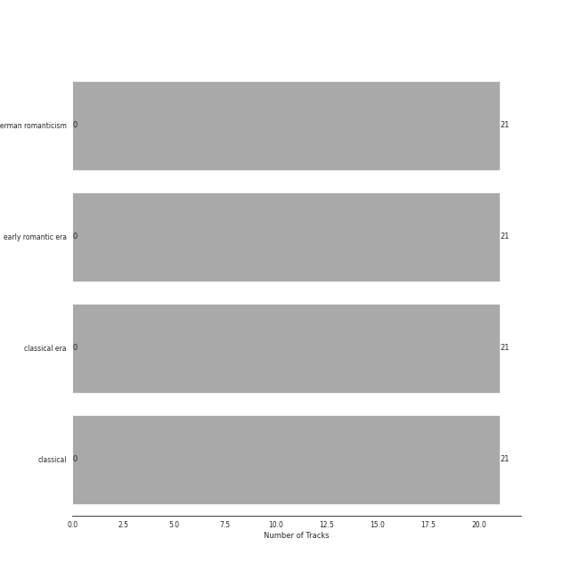

# PENTATONE

21 songs

[See Track Features](audio_features.md)

[See Clusters](clusters/overview.md)

Appears as:
- PENTATONE (21 tracks)

## Top Artists

| Art | Rank | Tracks | 💚 | Artist | 🔗 |
|:---|---:|---:|---:|:---|:---|
|  | 283 | 21 | 0 | [Ludwig van Beethoven](../../artists/ludwig_van_beethoven/overview.md) | [🔗](https://open.spotify.com/artist/2wOqMjp9TyABvtHdOSOTUS) |
|  | 414 | 21 | 0 | Mari Kodama | [🔗](https://open.spotify.com/artist/0s0wG03kPyu7MXERfcuxim) |

## Top Albums

| Art | Rank | Tracks | 💚 | Album | Release Date | 🔗 |
|:---|---:|---:|---:|:---|:---|:---|
|  | 612 | 12 | 0 | Beethoven: Piano Sonatas Nos. 1-3 | 2008-01-01 | [🔗](https://open.spotify.com/album/5CjMjZJnjdHHgwAVkqrvXq) |
|  | 612 | 9 | 0 | Beethoven: Piano Sonatas Nos. 30, 31 & 32 | 2012-03-06 | [🔗](https://open.spotify.com/album/478l1JdqbqDzcmmgrqw2zu) |

## Genres

| Tracks | 💚 | Genre |
|---:|---:|:---|
| 21 | 0 | [german romanticism](../../genres/german_romanticism/overview.md) |
| 21 | 0 | [early romantic era](../../genres/early_romantic_era/overview.md) |
| 21 | 0 | [classical era](../../genres/classical_era/overview.md) |
| 21 | 0 | [classical](../../genres/classical/overview.md) |

## Tracks released under PENTATONE

| Art | Track | Album | Artists | Label | Rank | 💚 | 🔗 |
|:---|:---|:---|:---|:---|---:|:---|:---|
|  | Piano Sonata No. 1 in F Minor, Op. 2 No. 1: I. Allegro | Beethoven: Piano Sonatas Nos. 1-3 | [Ludwig van Beethoven](../../artists/ludwig_van_beethoven/overview.md), Mari Kodama | [PENTATONE](.) | 921 | | [🔗](https://open.spotify.com/track/3L3B58di5ewulHGTfnh59h) |
|  | Piano Sonata No. 1 in F Minor, Op. 2 No. 1: II. Adagio | Beethoven: Piano Sonatas Nos. 1-3 | [Ludwig van Beethoven](../../artists/ludwig_van_beethoven/overview.md), Mari Kodama | [PENTATONE](.) | 921 | | [🔗](https://open.spotify.com/track/0Ch2tX7Twc0dIahY3DSLD5) |
|  | Piano Sonata No. 1 in F Minor, Op. 2 No. 1: III. Menuetto. Allegretto | Beethoven: Piano Sonatas Nos. 1-3 | [Ludwig van Beethoven](../../artists/ludwig_van_beethoven/overview.md), Mari Kodama | [PENTATONE](.) | 921 | | [🔗](https://open.spotify.com/track/1KPoOvPxTqWhv77OLbcE6R) |
|  | Piano Sonata No. 1 in F Minor, Op. 2 No. 1: IV. Prestissimo | Beethoven: Piano Sonatas Nos. 1-3 | [Ludwig van Beethoven](../../artists/ludwig_van_beethoven/overview.md), Mari Kodama | [PENTATONE](.) | 921 | | [🔗](https://open.spotify.com/track/6v6Mt6jYnbze4ydBQLnPAh) |
|  | Piano Sonata No. 2 in A Major, Op. 2 No. 2: I. Allegro vivace | Beethoven: Piano Sonatas Nos. 1-3 | [Ludwig van Beethoven](../../artists/ludwig_van_beethoven/overview.md), Mari Kodama | [PENTATONE](.) | 921 | | [🔗](https://open.spotify.com/track/4qcfJuhj4OyVlrbYNmBo2P) |
|  | Piano Sonata No. 2 in A Major, Op. 2 No. 2: II. Largo appassionato | Beethoven: Piano Sonatas Nos. 1-3 | [Ludwig van Beethoven](../../artists/ludwig_van_beethoven/overview.md), Mari Kodama | [PENTATONE](.) | 921 | | [🔗](https://open.spotify.com/track/1EGW5Sd0Jtp1EB6RsuiUaI) |
|  | Piano Sonata No. 2 in A Major, Op. 2 No. 2: III. Scherzo & Trio. Allegretto | Beethoven: Piano Sonatas Nos. 1-3 | [Ludwig van Beethoven](../../artists/ludwig_van_beethoven/overview.md), Mari Kodama | [PENTATONE](.) | 921 | | [🔗](https://open.spotify.com/track/7DRrwoL7liyTdEFvfvD6k9) |
|  | Piano Sonata No. 2 in A Major, Op. 2 No. 2: IV. Rondo. Grazioso | Beethoven: Piano Sonatas Nos. 1-3 | [Ludwig van Beethoven](../../artists/ludwig_van_beethoven/overview.md), Mari Kodama | [PENTATONE](.) | 921 | | [🔗](https://open.spotify.com/track/7FeVdrg9qHpIHhiJiuLcCG) |
|  | Piano Sonata No. 3 in C Major, Op. 2 No. 3: I. Allegro con brio | Beethoven: Piano Sonatas Nos. 1-3 | [Ludwig van Beethoven](../../artists/ludwig_van_beethoven/overview.md), Mari Kodama | [PENTATONE](.) | 921 | | [🔗](https://open.spotify.com/track/0bNUIIUQ9aKmG3Ud4h3XNn) |
|  | Piano Sonata No. 3 in C Major, Op. 2 No. 3: II. Adagio | Beethoven: Piano Sonatas Nos. 1-3 | [Ludwig van Beethoven](../../artists/ludwig_van_beethoven/overview.md), Mari Kodama | [PENTATONE](.) | 921 | | [🔗](https://open.spotify.com/track/4K3Noa4kwVwxaulG5IRsK5) |

See all tracks

| Art | Track | Album | Artists | Label | Rank | 💚 | 🔗 |
|:---|:---|:---|:---|:---|---:|:---|:---|
|  | Piano Sonata No. 3 in C Major, Op. 2 No. 3: III. Scherzo & Trio. Allegro | Beethoven: Piano Sonatas Nos. 1-3 | [Ludwig van Beethoven](../../artists/ludwig_van_beethoven/overview.md), Mari Kodama | [PENTATONE](.) | 921 | | [🔗](https://open.spotify.com/track/5Sm6qqdwaG8VbduSsEVyM6) |
|  | Piano Sonata No. 3 in C Major, Op. 2 No. 3: IV. Allegro assai | Beethoven: Piano Sonatas Nos. 1-3 | [Ludwig van Beethoven](../../artists/ludwig_van_beethoven/overview.md), Mari Kodama | [PENTATONE](.) | 921 | | [🔗](https://open.spotify.com/track/3pZt5RCBnQty2KDduZaBJp) |
|  | Piano Sonata No. 30 in E Major, Op. 109: I. Vivace ma non troppo | Beethoven: Piano Sonatas Nos. 30, 31 & 32 | [Ludwig van Beethoven](../../artists/ludwig_van_beethoven/overview.md), Mari Kodama | [PENTATONE](.) | 921 | | [🔗](https://open.spotify.com/track/71F3fMJkHuUf2IkiD39XEL) |
|  | Piano Sonata No. 30 in E Major, Op. 109: II. Prestissimo | Beethoven: Piano Sonatas Nos. 30, 31 & 32 | [Ludwig van Beethoven](../../artists/ludwig_van_beethoven/overview.md), Mari Kodama | [PENTATONE](.) | 921 | | [🔗](https://open.spotify.com/track/0gYZiFPpmQ8D8El2TBdYtm) |
|  | Piano Sonata No. 30 in E Major, Op. 109: III. Gesangvoll, mit innigster Empfindung. Andante molto cantabile ed espressivo | Beethoven: Piano Sonatas Nos. 30, 31 & 32 | [Ludwig van Beethoven](../../artists/ludwig_van_beethoven/overview.md), Mari Kodama | [PENTATONE](.) | 921 | | [🔗](https://open.spotify.com/track/7oMc5fAvJQ7US7l1SVhqDd) |
|  | Piano Sonata No. 31 in A-Flat Major, Op. 110: I. Moderato cantabile molto espressivo | Beethoven: Piano Sonatas Nos. 30, 31 & 32 | [Ludwig van Beethoven](../../artists/ludwig_van_beethoven/overview.md), Mari Kodama | [PENTATONE](.) | 921 | | [🔗](https://open.spotify.com/track/1rzoA7LbmuzUX7zPZfAEOm) |
|  | Piano Sonata No. 31 in A-Flat Major, Op. 110: II. Allegro molto | Beethoven: Piano Sonatas Nos. 30, 31 & 32 | [Ludwig van Beethoven](../../artists/ludwig_van_beethoven/overview.md), Mari Kodama | [PENTATONE](.) | 921 | | [🔗](https://open.spotify.com/track/6jnf2ZNoakb0h7GDa0GV18) |
|  | Piano Sonata No. 31 in A-Flat Major, Op. 110: III. Adagio ma non troppo | Beethoven: Piano Sonatas Nos. 30, 31 & 32 | [Ludwig van Beethoven](../../artists/ludwig_van_beethoven/overview.md), Mari Kodama | [PENTATONE](.) | 921 | | [🔗](https://open.spotify.com/track/3nFIGJk5SJu2no28alNNGU) |
|  | Piano Sonata No. 31 in A-Flat Major, Op. 110: III. Fuga. Allegro ma non troppo | Beethoven: Piano Sonatas Nos. 30, 31 & 32 | [Ludwig van Beethoven](../../artists/ludwig_van_beethoven/overview.md), Mari Kodama | [PENTATONE](.) | 921 | | [🔗](https://open.spotify.com/track/1YouGBZnQpMKL2W4hCloB0) |
|  | Piano Sonata No. 32 in C Minor, Op. 111: I. Maestoso - Allegro con brio ed appassionato | Beethoven: Piano Sonatas Nos. 30, 31 & 32 | [Ludwig van Beethoven](../../artists/ludwig_van_beethoven/overview.md), Mari Kodama | [PENTATONE](.) | 921 | | [🔗](https://open.spotify.com/track/0DfiTn1LUUcaLHYMDofEv7) |
|  | Piano Sonata No. 32 in C Minor, Op. 111: II. Arietta. Adagio molto semplice e cantabile | Beethoven: Piano Sonatas Nos. 30, 31 & 32 | [Ludwig van Beethoven](../../artists/ludwig_van_beethoven/overview.md), Mari Kodama | [PENTATONE](.) | 921 | | [🔗](https://open.spotify.com/track/0iPj8k5VLqsuBoysv972Bn) |

