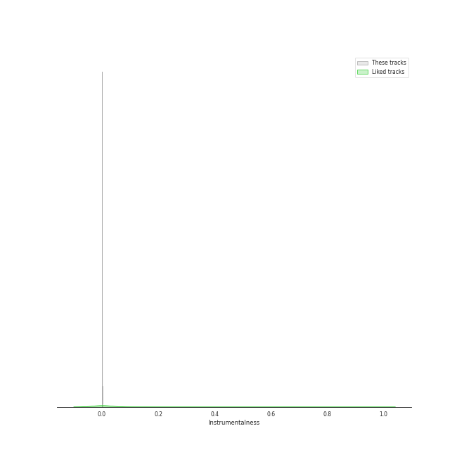
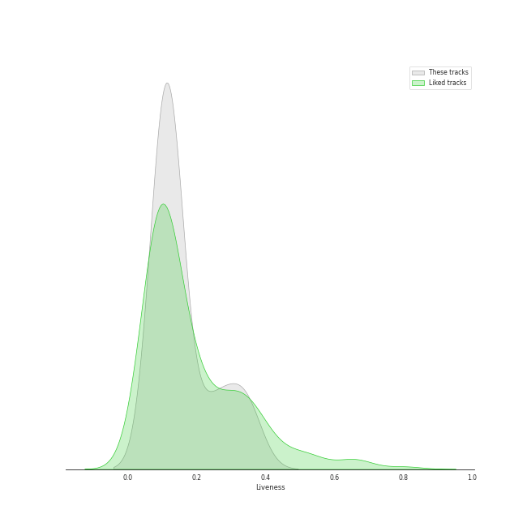

# Track Features for Peter Hollens

## Danceability

| ​ | 10 most Danceable tracks | ​​ | 10 least Danceable tracks |
|:---|:---|:---|:---|
|  | Hobbit Drinking Medley (0.559) |  | Gollum's Song (0.0835) |
|  | Song of the Lonely Mountain (0.509) |  | Arwen's Song (0.157) |
|  | I See Fire (0.43) |  | Phantom of the Opera Medley (0.207) |
|  | Over the Rainbow (0.422) |  | Misty Mountains (0.224) |
|  | Hamilton Medley (0.41) |  | The Prayer (0.227) |
|  | Imagine (0.397) |  | Les Miserables Medley (0.231) |
|  | Fields of Gold (0.387) |  | Bridge Over Troubled Water (0.25) |
|  | Into The West (0.366) |  | You Raise Me Up - A Cappella (0.273) |
|  | Mad World (0.366) |  | Edge of Night (0.3) |
|  | The Sound of Silence (0.323) |  | Lullaby (0.315) |

## Energy

| ​ | 10 most Energetic tracks | ​​ | 10 least Energetic tracks |
|:---|:---|:---|:---|
|  | Hobbit Drinking Medley (0.8) |  | Edge of Night (0.0787) |
|  | Song of the Lonely Mountain (0.556) |  | Mad World (0.184) |
|  | Hamilton Medley (0.497) |  | Les Miserables Medley (0.212) |
|  | The Prayer (0.427) |  | Gollum's Song (0.225) |
|  | I See Fire (0.365) |  | Arwen's Song (0.232) |
|  | Phantom of the Opera Medley (0.348) |  | Imagine (0.238) |
|  | Into The West (0.335) |  | Misty Mountains (0.24) |
|  | Fields of Gold (0.314) |  | The Sound of Silence (0.248) |
|  | Bridge Over Troubled Water (0.298) |  | Lullaby (0.252) |
|  | You Raise Me Up - A Cappella (0.275) |  | Over the Rainbow (0.255) |

## Speechiness

| ​ | 10 most Speechy tracks | ​​ | 10 least Speechy tracks |
|:---|:---|:---|:---|
|  | Hobbit Drinking Medley (0.378) |  | Fields of Gold (0.027) |
|  | Hamilton Medley (0.231) |  | I See Fire (0.0282) |
|  | Edge of Night (0.0458) |  | Imagine (0.0293) |
|  | Gollum's Song (0.0415) |  | Into The West (0.0294) |
|  | Bridge Over Troubled Water (0.038) |  | Misty Mountains (0.0308) |
|  | Over the Rainbow (0.0375) |  | Lullaby (0.0322) |
|  | Les Miserables Medley (0.036) |  | You Raise Me Up - A Cappella (0.0333) |
|  | Song of the Lonely Mountain (0.0359) |  | Arwen's Song (0.0344) |
|  | The Sound of Silence (0.0353) |  | The Prayer (0.0345) |
|  | Mad World (0.035) |  | Phantom of the Opera Medley (0.0345) |

## Acousticness

| ​ | 10 most Acoustic tracks | ​​ | 10 least Acoustic tracks |
|:---|:---|:---|:---|
|  | Les Miserables Medley (0.96) |  | Into The West (0.382) |
|  | Mad World (0.956) |  | Hobbit Drinking Medley (0.589) |
|  | Edge of Night (0.956) |  | Hamilton Medley (0.639) |
|  | The Sound of Silence (0.946) |  | I See Fire (0.689) |
|  | Lullaby (0.935) |  | Misty Mountains (0.763) |
|  | Arwen's Song (0.932) |  | Imagine (0.789) |
|  | Over the Rainbow (0.921) |  | Bridge Over Troubled Water (0.836) |
|  | Gollum's Song (0.898) |  | Song of the Lonely Mountain (0.837) |
|  | Phantom of the Opera Medley (0.886) |  | The Prayer (0.854) |
|  | Fields of Gold (0.872) |  | You Raise Me Up - A Cappella (0.871) |

## Instrumentalness

| ​ | 10 most Instrumental tracks | ​​ | 10 least Instrumental tracks |
|:---|:---|:---|:---|
|  | Gollum's Song (0.00108) |  | Fields of Gold (0.0) |
|  | Misty Mountains (0.000414) |  | The Sound of Silence (0.0) |
|  | Edge of Night (0.000285) |  | Bridge Over Troubled Water (0.0) |
|  | Song of the Lonely Mountain (0.000279) |  | The Prayer (0.0) |
|  | Arwen's Song (0.000129) |  | Les Miserables Medley (0.0) |
|  | Imagine (1.83e-05) |  | I See Fire (0.0) |
|  | Into The West (1.35e-06) |  | Hobbit Drinking Medley (0.0) |
|  | Mad World (1.09e-06) |  | You Raise Me Up - A Cappella (0.0) |
|  | Hamilton Medley (0.0) |  | Lullaby (0.0) |
|  | Phantom of the Opera Medley (0.0) |  | Over the Rainbow (0.0) |

## Liveness

| ​ | 10 most Live tracks | ​​ | 10 least Live tracks |
|:---|:---|:---|:---|
|  | Hobbit Drinking Medley (0.353) |  | Hamilton Medley (0.0995) |
|  | I See Fire (0.339) |  | Misty Mountains (0.102) |
|  | Phantom of the Opera Medley (0.305) |  | The Prayer (0.102) |
|  | The Sound of Silence (0.251) |  | Into The West (0.106) |
|  | Edge of Night (0.24) |  | Fields of Gold (0.107) |
|  | Over the Rainbow (0.137) |  | You Raise Me Up - A Cappella (0.11) |
|  | Bridge Over Troubled Water (0.126) |  | Song of the Lonely Mountain (0.111) |
|  | Gollum's Song (0.12) |  | Imagine (0.113) |
|  | Arwen's Song (0.117) |  | Les Miserables Medley (0.114) |
|  | Mad World (0.116) |  | Lullaby (0.115) |

## Valence

| ​ | 10 most Happy tracks | ​​ | 10 least Happy tracks |
|:---|:---|:---|:---|
|  | Hobbit Drinking Medley (0.817) |  | Gollum's Song (0.0366) |
|  | Over the Rainbow (0.437) |  | Arwen's Song (0.0448) |
|  | I See Fire (0.345) |  | Into The West (0.0758) |
|  | Hamilton Medley (0.324) |  | Les Miserables Medley (0.0892) |
|  | Fields of Gold (0.286) |  | Edge of Night (0.134) |
|  | Song of the Lonely Mountain (0.284) |  | You Raise Me Up - A Cappella (0.151) |
|  | Bridge Over Troubled Water (0.281) |  | Imagine (0.152) |
|  | Mad World (0.266) |  | Misty Mountains (0.164) |
|  | Phantom of the Opera Medley (0.223) |  | Lullaby (0.188) |
|  | The Prayer (0.193) |  | The Sound of Silence (0.19) |

## Tempo

| ​ | 10 most Fast tracks | ​​ | 10 least Fast tracks |
|:---|:---|:---|:---|
|  | You Raise Me Up - A Cappella (133.258) |  | Gollum's Song (49.588) |
|  | Edge of Night (127.667) |  | The Prayer (62.132) |
|  | Bridge Over Troubled Water (126.04) |  | Imagine (75.811) |
|  | Song of the Lonely Mountain (123.863) |  | Hamilton Medley (75.822) |
|  | Mad World (118.157) |  | Les Miserables Medley (75.97) |
|  | Over the Rainbow (114.426) |  | I See Fire (76.016) |
|  | Hobbit Drinking Medley (109.768) |  | Phantom of the Opera Medley (76.857) |
|  | Fields of Gold (102.19) |  | The Sound of Silence (80.526) |
|  | Lullaby (98.657) |  | Arwen's Song (85.131) |
|  | Misty Mountains (97.419) |  | Into The West (94.764) |
