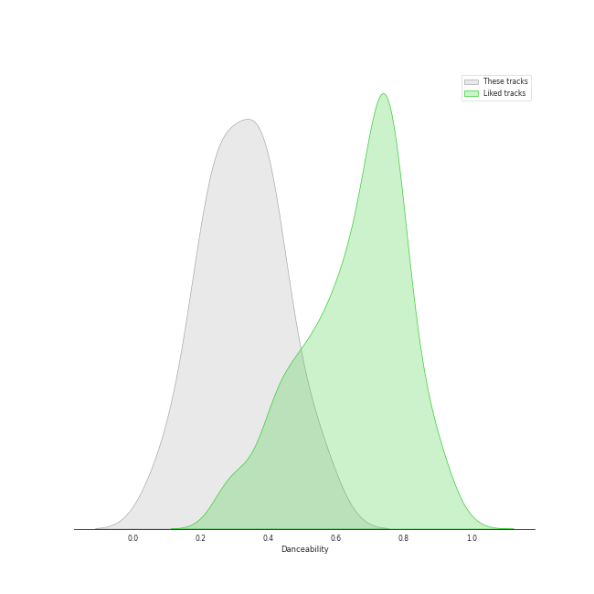
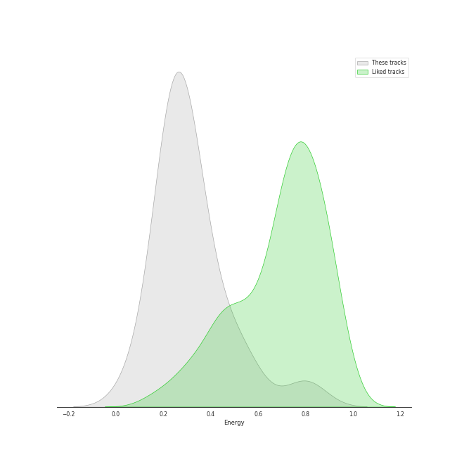
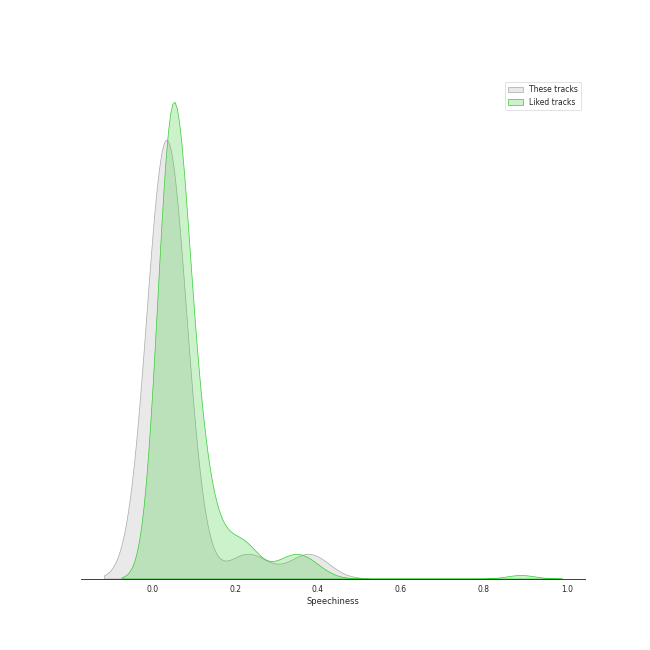
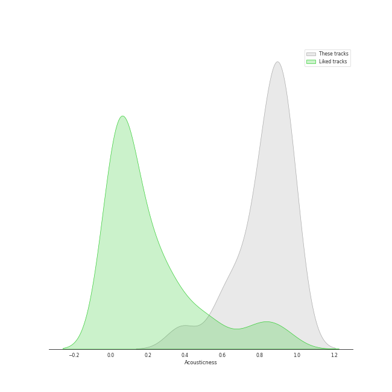
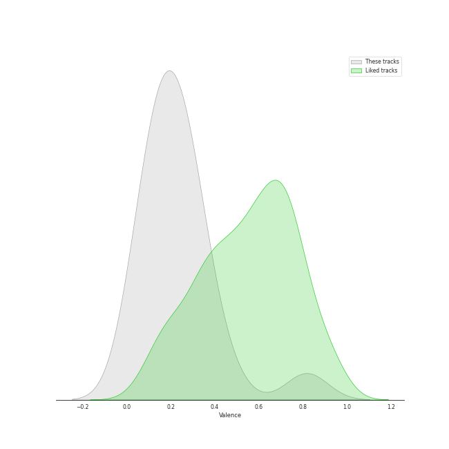
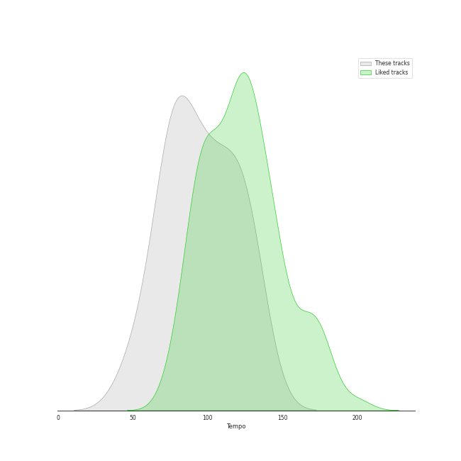

# Audio Features for Peter Hollens

## Danceability

| 10 most Danceable tracks | 10 least Danceable tracks |
|:---|:---|
| Hobbit Drinking Medley (0.559) | Gollum's Song (0.0835) |
| Song of the Lonely Mountain (0.509) | Arwen's Song (0.157) |
| I See Fire (0.43) | Phantom of the Opera Medley (0.207) |
| Over the Rainbow (0.422) | Misty Mountains (0.224) |
| Hamilton Medley (0.41) | The Prayer (0.227) |
| Imagine (0.397) | Les Miserables Medley (0.231) |
| Fields of Gold (0.387) | Bridge Over Troubled Water (0.25) |
| Into The West (0.366) | You Raise Me Up - A Cappella (0.273) |
| Mad World (0.366) | Edge of Night (0.3) |
| The Sound of Silence (0.323) | Lullaby (0.315) |

## Energy

| 10 most Energetic tracks | 10 least Energetic tracks |
|:---|:---|
| Hobbit Drinking Medley (0.8) | Edge of Night (0.0787) |
| Song of the Lonely Mountain (0.556) | Mad World (0.184) |
| Hamilton Medley (0.497) | Les Miserables Medley (0.212) |
| The Prayer (0.427) | Gollum's Song (0.225) |
| I See Fire (0.365) | Arwen's Song (0.232) |
| Phantom of the Opera Medley (0.348) | Imagine (0.238) |
| Into The West (0.335) | Misty Mountains (0.24) |
| Fields of Gold (0.314) | The Sound of Silence (0.248) |
| Bridge Over Troubled Water (0.298) | Lullaby (0.252) |
| You Raise Me Up - A Cappella (0.275) | Over the Rainbow (0.255) |

## Speechiness

| 10 most Speechy tracks | 10 least Speechy tracks |
|:---|:---|
| Hobbit Drinking Medley (0.378) | Fields of Gold (0.027) |
| Hamilton Medley (0.231) | I See Fire (0.0282) |
| Edge of Night (0.0458) | Imagine (0.0293) |
| Gollum's Song (0.0415) | Into The West (0.0294) |
| Bridge Over Troubled Water (0.038) | Misty Mountains (0.0308) |
| Over the Rainbow (0.0375) | Lullaby (0.0322) |
| Les Miserables Medley (0.036) | You Raise Me Up - A Cappella (0.0333) |
| Song of the Lonely Mountain (0.0359) | Arwen's Song (0.0344) |
| The Sound of Silence (0.0353) | The Prayer (0.0345) |
| Mad World (0.035) | Phantom of the Opera Medley (0.0345) |

## Acousticness

| 10 most Acoustic tracks | 10 least Acoustic tracks |
|:---|:---|
| Les Miserables Medley (0.96) | Into The West (0.382) |
| Mad World (0.956) | Hobbit Drinking Medley (0.589) |
| Edge of Night (0.956) | Hamilton Medley (0.639) |
| The Sound of Silence (0.946) | I See Fire (0.689) |
| Lullaby (0.935) | Misty Mountains (0.763) |
| Arwen's Song (0.932) | Imagine (0.789) |
| Over the Rainbow (0.921) | Bridge Over Troubled Water (0.836) |
| Gollum's Song (0.898) | Song of the Lonely Mountain (0.837) |
| Phantom of the Opera Medley (0.886) | The Prayer (0.854) |
| Fields of Gold (0.872) | You Raise Me Up - A Cappella (0.871) |

## Instrumentalness

| 10 most Instrumental tracks | 10 least Instrumental tracks |
|:---|:---|
| Gollum's Song (0.00108) | Fields of Gold (0.0) |
| Misty Mountains (0.000414) | The Sound of Silence (0.0) |
| Edge of Night (0.000285) | Bridge Over Troubled Water (0.0) |
| Song of the Lonely Mountain (0.000279) | The Prayer (0.0) |
| Arwen's Song (0.000129) | Les Miserables Medley (0.0) |
| Imagine (1.83e-05) | I See Fire (0.0) |
| Into The West (1.35e-06) | Hobbit Drinking Medley (0.0) |
| Mad World (1.09e-06) | You Raise Me Up - A Cappella (0.0) |
| Hamilton Medley (0.0) | Lullaby (0.0) |
| Phantom of the Opera Medley (0.0) | Over the Rainbow (0.0) |

## Liveness

| 10 most Live tracks | 10 least Live tracks |
|:---|:---|
| Hobbit Drinking Medley (0.353) | Hamilton Medley (0.0995) |
| I See Fire (0.339) | Misty Mountains (0.102) |
| Phantom of the Opera Medley (0.305) | The Prayer (0.102) |
| The Sound of Silence (0.251) | Into The West (0.106) |
| Edge of Night (0.24) | Fields of Gold (0.107) |
| Over the Rainbow (0.137) | You Raise Me Up - A Cappella (0.11) |
| Bridge Over Troubled Water (0.126) | Song of the Lonely Mountain (0.111) |
| Gollum's Song (0.12) | Imagine (0.113) |
| Arwen's Song (0.117) | Les Miserables Medley (0.114) |
| Mad World (0.116) | Lullaby (0.115) |

## Valence

| 10 most Happy tracks | 10 least Happy tracks |
|:---|:---|
| Hobbit Drinking Medley (0.817) | Gollum's Song (0.0366) |
| Over the Rainbow (0.437) | Arwen's Song (0.0448) |
| I See Fire (0.345) | Into The West (0.0758) |
| Hamilton Medley (0.324) | Les Miserables Medley (0.0892) |
| Fields of Gold (0.286) | Edge of Night (0.134) |
| Song of the Lonely Mountain (0.284) | You Raise Me Up - A Cappella (0.151) |
| Bridge Over Troubled Water (0.281) | Imagine (0.152) |
| Mad World (0.266) | Misty Mountains (0.164) |
| Phantom of the Opera Medley (0.223) | Lullaby (0.188) |
| The Prayer (0.193) | The Sound of Silence (0.19) |

## Tempo

| 10 most Fast tracks | 10 least Fast tracks |
|:---|:---|
| You Raise Me Up - A Cappella (133.258) | Gollum's Song (49.588) |
| Edge of Night (127.667) | The Prayer (62.132) |
| Bridge Over Troubled Water (126.04) | Imagine (75.811) |
| Song of the Lonely Mountain (123.863) | Hamilton Medley (75.822) |
| Mad World (118.157) | Les Miserables Medley (75.97) |
| Over the Rainbow (114.426) | I See Fire (76.016) |
| Hobbit Drinking Medley (109.768) | Phantom of the Opera Medley (76.857) |
| Fields of Gold (102.19) | The Sound of Silence (80.526) |
| Lullaby (98.657) | Arwen's Song (85.131) |
| Misty Mountains (97.419) | Into The West (94.764) |
