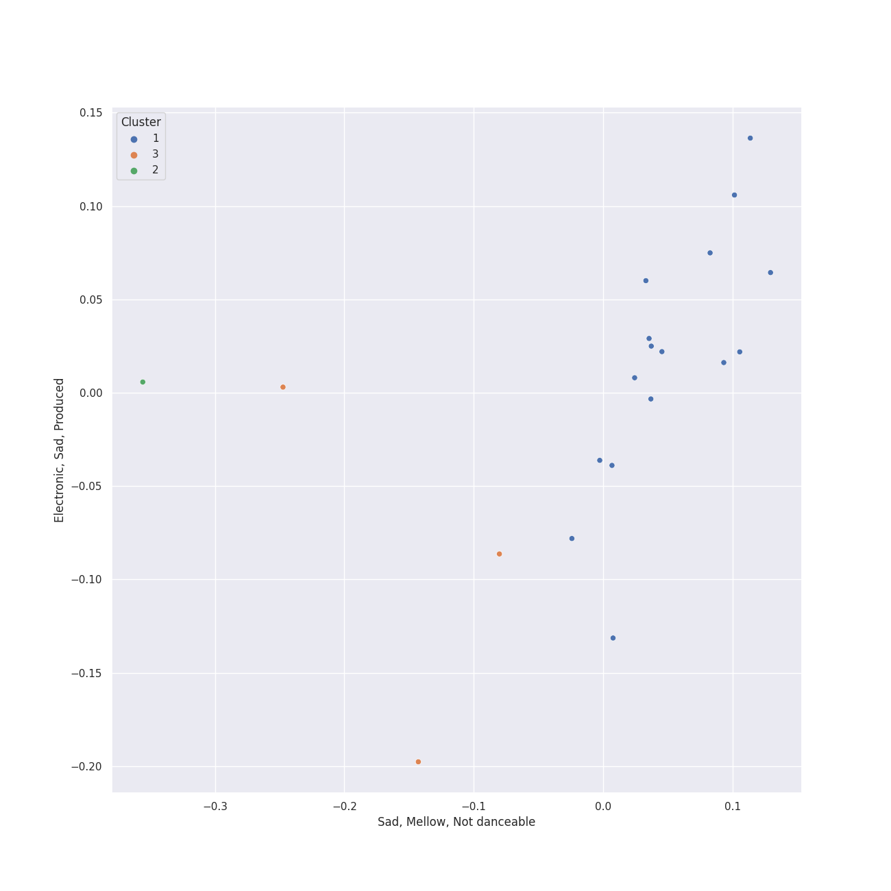

# Clusters in Peter Hollens

## Cluster #1

10 tracks

| Art | Track | Album | Artists | Label | Score | 💚 | 🔗 |
|:---|:---|:---|:---|:---|---:|:---|:---|
|  | Edge of Night | Misty Mountains: Songs Inspired by The Hobbit and Lord of the Rings | Peter Hollens | [Peter Hollens](../..) | 0 | | [🔗](https://open.spotify.com/track/0nBeUCpjIu62kLU3MFjZbL) |
|  | Misty Mountains | Misty Mountains: Songs Inspired by The Hobbit and Lord of the Rings | Peter Hollens, Tim Foust | [Peter Hollens](../..) | 0 | | [🔗](https://open.spotify.com/track/21sD95jUPmren2fGY0wxYE) |
|  | Into The West | Misty Mountains: Songs Inspired by The Hobbit and Lord of the Rings | Peter Hollens | [Peter Hollens](../..) | 0 | | [🔗](https://open.spotify.com/track/46ZN4mhFy9De1fjlHGbYze) |
|  | Arwen's Song | Misty Mountains: Songs Inspired by The Hobbit and Lord of the Rings | Peter Hollens | [Peter Hollens](../..) | 0 | | [🔗](https://open.spotify.com/track/4H3LioOCKpZcE9jmvWqNcv) |
|  | Gollum's Song | Misty Mountains: Songs Inspired by The Hobbit and Lord of the Rings | Peter Hollens | [Peter Hollens](../..) | 0 | | [🔗](https://open.spotify.com/track/61WvPK7oUmEeXJvdQx7Kd2) |
|  | The Prayer | Legendary Covers, Vol. 1 | Peter Hollens, Evynne Hollens | [Peter Hollens](../..) | 0 | | [🔗](https://open.spotify.com/track/22NQSPn3K3NUzoVe4zbQWU) |
|  | Imagine | Legendary Covers, Vol. 1 | Peter Hollens | [Peter Hollens](../..) | 0 | | [🔗](https://open.spotify.com/track/4oiGtuMHFcfOcIDQyY52wy) |
|  | You Raise Me Up - A Cappella | Legendary Covers, Vol. 1 | Peter Hollens | [Peter Hollens](../..) | 0 | | [🔗](https://open.spotify.com/track/57EvTXkeuxNPWxQYIdW5AY) |
|  | Lullaby | Legendary Covers, Vol. 1 | Peter Hollens | [Peter Hollens](../..) | 0 | | [🔗](https://open.spotify.com/track/6vqc1KcIaO0NmQLaAJApqe) |
|  | Les Miserables Medley | Peter Hollens | Peter Hollens, Evynne Hollens | [Peter Hollens](../..) | 0 | | [🔗](https://open.spotify.com/track/2qo9G9xV51aUpclzAYEU9W) |
## Cluster #2

1 tracks

| Art | Track | Album | Artists | Label | Score | 💚 | 🔗 |
|:---|:---|:---|:---|:---|---:|:---|:---|
|  | Hobbit Drinking Medley | Misty Mountains: Songs Inspired by The Hobbit and Lord of the Rings | Peter Hollens, Hank Green | [Peter Hollens](../..) | 0 | | [🔗](https://open.spotify.com/track/3lO8g6FU5zQlzdfW3zxNQ0) |
## Cluster #3

9 tracks

| Art | Track | Album | Artists | Label | Score | 💚 | 🔗 |
|:---|:---|:---|:---|:---|---:|:---|:---|
|  | Song of the Lonely Mountain | Misty Mountains: Songs Inspired by The Hobbit and Lord of the Rings | Peter Hollens | [Peter Hollens](../..) | 0 | | [🔗](https://open.spotify.com/track/1Ht9LvTpP6bZezGCL2BRHP) |
|  | I See Fire | Misty Mountains: Songs Inspired by The Hobbit and Lord of the Rings | Peter Hollens, Taylor Davis | [Peter Hollens](../..) | 0 | | [🔗](https://open.spotify.com/track/3GDHe8EwGQMxDE1QuPitvw) |
|  | Fields of Gold | Legendary Covers, Vol. 1 | Peter Hollens, Tyler Ward, [Lindsey Stirling](../../../../artists/lindsey_stirling/overview.md) | [Peter Hollens](../..) | 0 | | [🔗](https://open.spotify.com/track/0sLEBadE1MXYXDiugLoEe6) |
|  | Bridge Over Troubled Water | Legendary Covers, Vol. 1 | Peter Hollens, Tim Foust | [Peter Hollens](../..) | 0 | | [🔗](https://open.spotify.com/track/1My1VVTQAO9cAGJw7BhpTa) |
|  | Over the Rainbow | Legendary Covers, Vol. 1 | Peter Hollens | [Peter Hollens](../..) | 0 | | [🔗](https://open.spotify.com/track/76ko6F6QRmiviFILuF9g6J) |
|  | The Sound of Silence | The Sound of Silence | Peter Hollens, Tim Foust | [Peter Hollens](../..) | 0 | | [🔗](https://open.spotify.com/track/10kJzrXI48v0wzRBBPjo06) |
|  | Mad World | Covers, Vol. III | Peter Hollens | [Peter Hollens](../..) | 0 | | [🔗](https://open.spotify.com/track/3K3mORNnlUXodukHH0sDjr) |
|  | Phantom of the Opera Medley | Covers, Vol. III | Peter Hollens, Evynne Hollens | [Peter Hollens](../..) | 0 | | [🔗](https://open.spotify.com/track/7FpJ62ZQtyitL40diEH9vf) |
|  | Hamilton Medley | Covers, Vol. III | Peter Hollens | [Peter Hollens](../..) | 0 | | [🔗](https://open.spotify.com/track/7HU8e7VCXuhOSaDoQ5UBwn) |