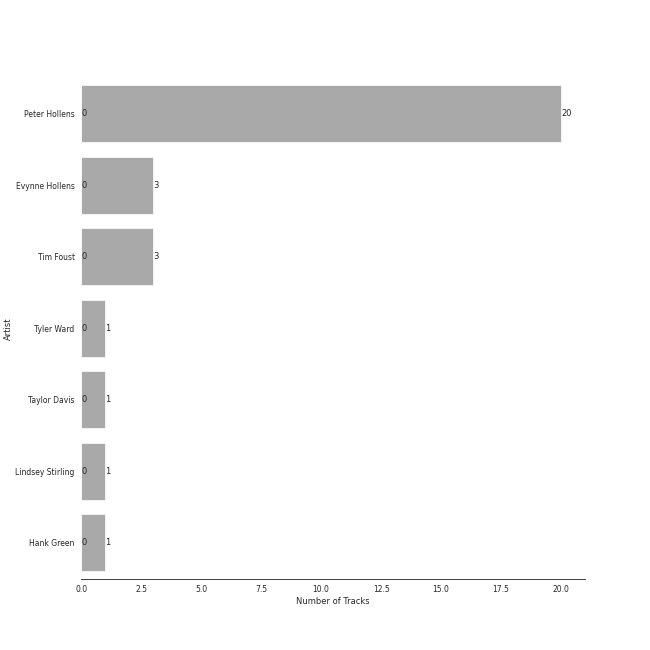

# Peter Hollens

20 songs

[See Track Features](audio_features.md)

[See Clusters](clusters/overview.md)

Appears as:
- Peter Hollens (20 tracks)

## Top Artists

| Art | Tracks | 💚 | Artist | 🔗 |
|:---|---:|---:|:---|:---|
|  | 20 | 0 | Peter Hollens | [🔗](https://open.spotify.com/artist/7EIbKyiLnEJ1Y074UIUyZJ) |
|  | 3 | 0 | Evynne Hollens | [🔗](https://open.spotify.com/artist/3nj3MfJCFFoKiRkAOW1R8c) |
|  | 3 | 0 | Tim Foust | [🔗](https://open.spotify.com/artist/2VtwFbDZzIoT9ZD0uR5HHD) |
|  | 1 | 0 | Tyler Ward | [🔗](https://open.spotify.com/artist/5Hc9oDGvStNGmnj44m8sHg) |
|  | 1 | 0 | Taylor Davis | [🔗](https://open.spotify.com/artist/480xKab3lUPhBBnCzlzqIu) |
|  | 1 | 0 | [Lindsey Stirling](../../artists/lindsey_stirling/overview.md) | [🔗](https://open.spotify.com/artist/378dH6EszOLFShpRzAQkVM) |
|  | 1 | 0 | Hank Green | [🔗](https://open.spotify.com/artist/2SQVGFEgP0UZTZC1re2ECh) |

## Top Albums

| Art | Tracks | 💚 | Album | Release Date | 🔗 |
|:---|---:|---:|:---|:---|:---|
|  | 8 | 0 | Misty Mountains: Songs Inspired by The Hobbit and Lord of the Rings | 2016-03-18 | [🔗](https://open.spotify.com/album/4GYDt4IqU8EZ6KJLHpPuOK) |
|  | 7 | 0 | Legendary Covers, Vol. 1 | 2019 | [🔗](https://open.spotify.com/album/1tFypxtPJ5A61j97TRhWnP) |
|  | 3 | 0 | Covers, Vol. III | 2017-06-16 | [🔗](https://open.spotify.com/album/69zZ6utXSbC6dr6tdBsvNz) |
|  | 1 | 0 | The Sound of Silence | 2017 | [🔗](https://open.spotify.com/album/2csjrZ6lbV7wWvVTsEi7u0) |
|  | 1 | 0 | Peter Hollens | 2014-10-27 | [🔗](https://open.spotify.com/album/5kB9QXjsPtcUwvlj4w0dZV) |

## Genres

| Tracks | 💚 | Genre |
|---:|---:|:---|
| 20 | 0 | fantasy |

## Tracks released under Peter Hollens

| Art | Track | Album | Artists | Label | Rank | 💚 | 🔗 |
|:---|:---|:---|:---|:---|---:|:---|:---|
|  | Les Miserables Medley | Peter Hollens | Peter Hollens, Evynne Hollens | [Peter Hollens](.) | 855 | | [🔗](https://open.spotify.com/track/2qo9G9xV51aUpclzAYEU9W) |
|  | Arwen's Song | Misty Mountains: Songs Inspired by The Hobbit and Lord of the Rings | Peter Hollens | [Peter Hollens](.) | 855 | | [🔗](https://open.spotify.com/track/4H3LioOCKpZcE9jmvWqNcv) |
|  | Edge of Night | Misty Mountains: Songs Inspired by The Hobbit and Lord of the Rings | Peter Hollens | [Peter Hollens](.) | 855 | | [🔗](https://open.spotify.com/track/0nBeUCpjIu62kLU3MFjZbL) |
|  | Gollum's Song | Misty Mountains: Songs Inspired by The Hobbit and Lord of the Rings | Peter Hollens | [Peter Hollens](.) | 855 | | [🔗](https://open.spotify.com/track/61WvPK7oUmEeXJvdQx7Kd2) |
|  | Hobbit Drinking Medley | Misty Mountains: Songs Inspired by The Hobbit and Lord of the Rings | Peter Hollens, Hank Green | [Peter Hollens](.) | 855 | | [🔗](https://open.spotify.com/track/3lO8g6FU5zQlzdfW3zxNQ0) |
|  | I See Fire | Misty Mountains: Songs Inspired by The Hobbit and Lord of the Rings | Peter Hollens, Taylor Davis | [Peter Hollens](.) | 855 | | [🔗](https://open.spotify.com/track/3GDHe8EwGQMxDE1QuPitvw) |
|  | Into The West | Misty Mountains: Songs Inspired by The Hobbit and Lord of the Rings | Peter Hollens | [Peter Hollens](.) | 855 | | [🔗](https://open.spotify.com/track/46ZN4mhFy9De1fjlHGbYze) |
|  | Misty Mountains | Misty Mountains: Songs Inspired by The Hobbit and Lord of the Rings | Peter Hollens, Tim Foust | [Peter Hollens](.) | 855 | | [🔗](https://open.spotify.com/track/21sD95jUPmren2fGY0wxYE) |
|  | Song of the Lonely Mountain | Misty Mountains: Songs Inspired by The Hobbit and Lord of the Rings | Peter Hollens | [Peter Hollens](.) | 855 | | [🔗](https://open.spotify.com/track/1Ht9LvTpP6bZezGCL2BRHP) |
|  | The Sound of Silence | The Sound of Silence | Peter Hollens, Tim Foust | [Peter Hollens](.) | 855 | | [🔗](https://open.spotify.com/track/10kJzrXI48v0wzRBBPjo06) |

See all tracks

| Art | Track | Album | Artists | Label | Rank | 💚 | 🔗 |
|:---|:---|:---|:---|:---|---:|:---|:---|
|  | Hamilton Medley | Covers, Vol. III | Peter Hollens | [Peter Hollens](.) | 855 | | [🔗](https://open.spotify.com/track/7HU8e7VCXuhOSaDoQ5UBwn) |
|  | Mad World | Covers, Vol. III | Peter Hollens | [Peter Hollens](.) | 855 | | [🔗](https://open.spotify.com/track/3K3mORNnlUXodukHH0sDjr) |
|  | Phantom of the Opera Medley | Covers, Vol. III | Peter Hollens, Evynne Hollens | [Peter Hollens](.) | 855 | | [🔗](https://open.spotify.com/track/7FpJ62ZQtyitL40diEH9vf) |
|  | Bridge Over Troubled Water | Legendary Covers, Vol. 1 | Peter Hollens, Tim Foust | [Peter Hollens](.) | 855 | | [🔗](https://open.spotify.com/track/1My1VVTQAO9cAGJw7BhpTa) |
|  | Fields of Gold | Legendary Covers, Vol. 1 | Peter Hollens, Tyler Ward, [Lindsey Stirling](../../artists/lindsey_stirling/overview.md) | [Peter Hollens](.) | 855 | | [🔗](https://open.spotify.com/track/0sLEBadE1MXYXDiugLoEe6) |
|  | Imagine | Legendary Covers, Vol. 1 | Peter Hollens | [Peter Hollens](.) | 855 | | [🔗](https://open.spotify.com/track/4oiGtuMHFcfOcIDQyY52wy) |
|  | Lullaby | Legendary Covers, Vol. 1 | Peter Hollens | [Peter Hollens](.) | 855 | | [🔗](https://open.spotify.com/track/6vqc1KcIaO0NmQLaAJApqe) |
|  | Over the Rainbow | Legendary Covers, Vol. 1 | Peter Hollens | [Peter Hollens](.) | 855 | | [🔗](https://open.spotify.com/track/76ko6F6QRmiviFILuF9g6J) |
|  | The Prayer | Legendary Covers, Vol. 1 | Peter Hollens, Evynne Hollens | [Peter Hollens](.) | 855 | | [🔗](https://open.spotify.com/track/22NQSPn3K3NUzoVe4zbQWU) |
|  | You Raise Me Up - A Cappella | Legendary Covers, Vol. 1 | Peter Hollens | [Peter Hollens](.) | 855 | | [🔗](https://open.spotify.com/track/57EvTXkeuxNPWxQYIdW5AY) |

