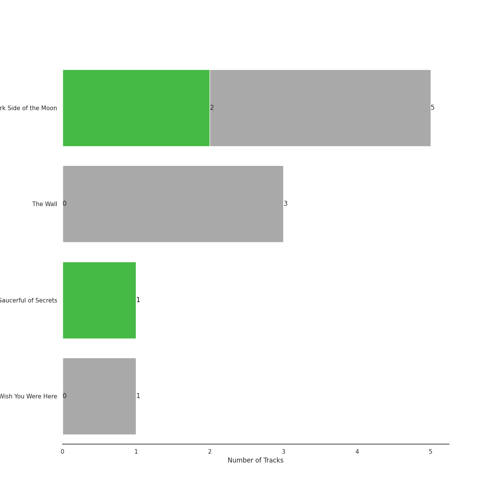
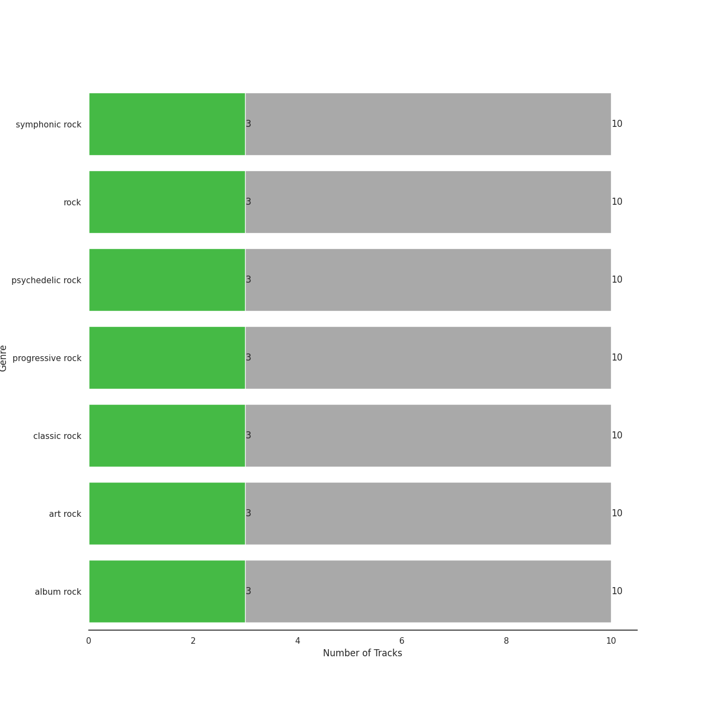

# Pink Floyd Records

10 songs

[See Audio Features](audio_features.md)

Appears as:
- Pink Floyd Records (10 tracks)

## Top Artists

| Art | Tracks | 💚 | Artist | 🔗 |
|:---|---:|---:|:---|:---|
|  | 10 | 3 | [Pink Floyd](../../artists/pink_floyd/overview.md) | [🔗](https://open.spotify.com/artist/0k17h0D3J5VfsdmQ1iZtE9) |

## Top Albums

| Art | Tracks | 💚 | Album | Release Date | 🔗 |
|:---|---:|---:|:---|:---|:---|
|  | 5 | 2 | The Dark Side of the Moon | 1973-03-01 | [🔗](https://open.spotify.com/album/4LH4d3cOWNNsVw41Gqt2kv) |
|  | 3 | 0 | The Wall | 1979-11-30 | [🔗](https://open.spotify.com/album/5Dbax7G8SWrP9xyzkOvy2F) |
|  | 1 | 1 | A Saucerful of Secrets | 1968-06-29 | [🔗](https://open.spotify.com/album/2vnJKtGjZXRUg0mYPZ3HGH) |
|  | 1 | 0 | Wish You Were Here | 1975-09-12 | [🔗](https://open.spotify.com/album/0bCAjiUamIFqKJsekOYuRw) |

## Genres

| Tracks | 💚 | Genre |
|---:|---:|:---|
| 10 | 3 | symphonic rock |
| 10 | 3 | [rock](../../genres/rock/overview.md) |
| 10 | 3 | [psychedelic rock](../../genres/psychedelic_rock/overview.md) |
| 10 | 3 | progressive rock |
| 10 | 3 | [classic rock](../../genres/classic_rock/overview.md) |
| 10 | 3 | art rock |
| 10 | 3 | [album rock](../../genres/album_rock/overview.md) |

## Tracks released under Pink Floyd Records

| Art | Track | Album | Artists | Label | 💚 | 🔗 |
|:---|:---|:---|:---|:---|:---|:---|
|  | Set the Controls for the Heart of the Sun | A Saucerful of Secrets | [Pink Floyd](../../artists/pink_floyd/overview.md) | [Pink Floyd Records](.) | 💚 | [🔗](https://open.spotify.com/track/6p9UFDNfGrzS5Byd2r9KPk) |
|  | Brain Damage | The Dark Side of the Moon | [Pink Floyd](../../artists/pink_floyd/overview.md) | [Pink Floyd Records](.) | | [🔗](https://open.spotify.com/track/05uGBKRCuePsf43Hfm0JwX) |
|  | Breathe (In the Air) | The Dark Side of the Moon | [Pink Floyd](../../artists/pink_floyd/overview.md) | [Pink Floyd Records](.) | 💚 | [🔗](https://open.spotify.com/track/2ctvdKmETyOzPb2GiJJT53) |
|  | Money | The Dark Side of the Moon | [Pink Floyd](../../artists/pink_floyd/overview.md) | [Pink Floyd Records](.) | 💚 | [🔗](https://open.spotify.com/track/0vFOzaXqZHahrZp6enQwQb) |
|  | The Great Gig in the Sky | The Dark Side of the Moon | [Pink Floyd](../../artists/pink_floyd/overview.md) | [Pink Floyd Records](.) | | [🔗](https://open.spotify.com/track/2TjdnqlpwOjhijHCwHCP2d) |
|  | Time | The Dark Side of the Moon | [Pink Floyd](../../artists/pink_floyd/overview.md) | [Pink Floyd Records](.) | | [🔗](https://open.spotify.com/track/3TO7bbrUKrOSPGRTB5MeCz) |
|  | Shine On You Crazy Diamond (Pts. 1-5) | Wish You Were Here | [Pink Floyd](../../artists/pink_floyd/overview.md) | [Pink Floyd Records](.) | | [🔗](https://open.spotify.com/track/6pnwfWyaWjQiHCKTiZLItr) |
|  | Another Brick in the Wall, Pt. 2 | The Wall | [Pink Floyd](../../artists/pink_floyd/overview.md) | [Pink Floyd Records](.) | | [🔗](https://open.spotify.com/track/4gMgiXfqyzZLMhsksGmbQV) |
|  | Comfortably Numb | The Wall | [Pink Floyd](../../artists/pink_floyd/overview.md) | [Pink Floyd Records](.) | | [🔗](https://open.spotify.com/track/5HNCy40Ni5BZJFw1TKzRsC) |
|  | Hey You | The Wall | [Pink Floyd](../../artists/pink_floyd/overview.md) | [Pink Floyd Records](.) | | [🔗](https://open.spotify.com/track/7F02x6EKYIQV3VcTaTm7oN) |
