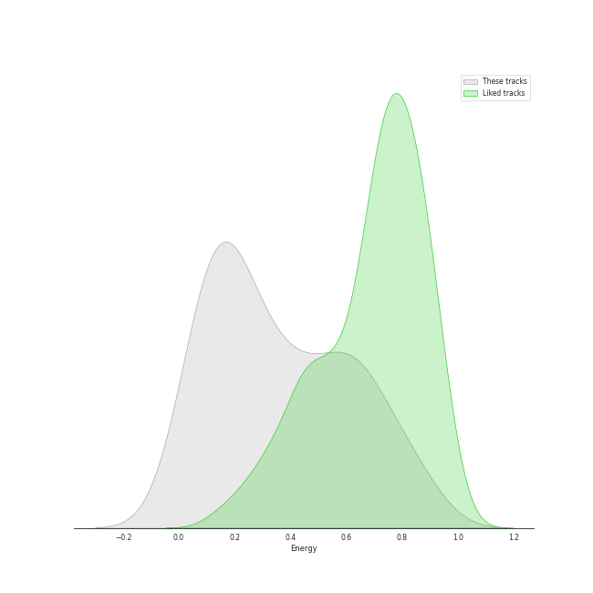
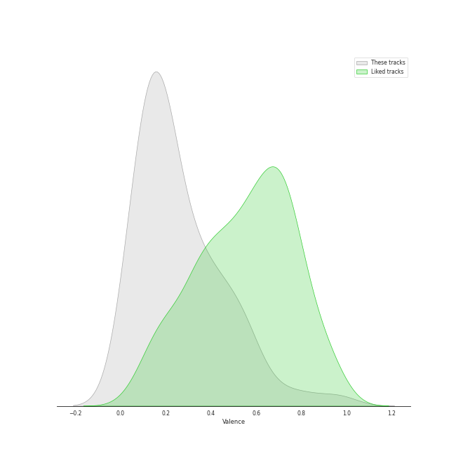
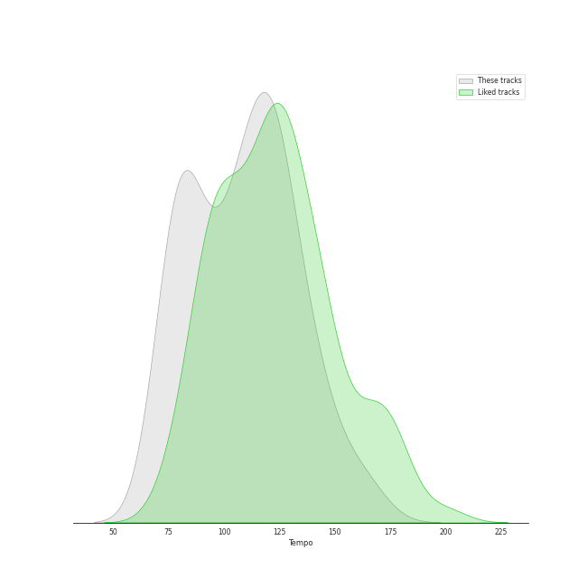

# Audio Features for Polydor Records

## Danceability

| 10 most Danceable tracks | 10 least Danceable tracks |
|:---|:---|
| You Don't Know Me (0.877) | Born To Die (0.18) |
| Mercy (0.793) | All I Ask Of You - Reprise (0.191) |
| I Will Survive - Single Version (0.777) | Norman fucking Rockwell (0.215) |
| Heat Waves (0.761) | All I Ask Of You (0.222) |
| Slow Grenade (0.758) | Overture (0.224) |
| Lights - Single Version (0.683) | Entr'Acte (0.231) |
| Don't Call Me Up (0.674) | The Music Of The Night (0.239) |
| Something In The Way You Move (0.658) | The Point Of No Return (0.251) |
| Doin' Time (0.641) | I Dreamed A Dream - From "Les Misérables" (0.256) |
| Prologue (0.626) | Shades Of Cool (0.262) |

## Energy

| 10 most Energetic tracks | 10 least Energetic tracks |
|:---|:---|
| Don't Call Me Up (0.881) | Magical Lasso (0.0314) |
| Mercy (0.859) | All I Ask Of You - Reprise (0.0679) |
| Radio (0.841) | Empty Chairs At Empty Tables (0.0688) |
| Something In The Way You Move (0.814) | I Dreamed A Dream - From "Les Misérables" (0.0739) |
| Lights - Single Version (0.789) | Angel Of Music (0.0808) |
| I Will Survive - Single Version (0.725) | I Remember / Stranger Than You Dreamt It (0.0817) |
| Baba O'Riley (0.724) | In My Life (0.091) |
| Off To The Races (0.722) | The Music Of The Night (0.0961) |
| Free (0.696) | Wishing You Were Somehow Here Again (0.102) |
| Brooklyn Baby (0.664) | Think Of Me (0.114) |

## Speechiness

| 10 most Speechy tracks | 10 least Speechy tracks |
|:---|:---|
| Prologue (0.748) | Chasing Cars (0.0274) |
| Don't Call Me Up (0.147) | Love (0.0277) |
| You Don't Know Me (0.132) | Swan Song (0.0294) |
| Poor Fool, He Makes Me Laugh (0.111) | Bel Air (0.0298) |
| In My Life (0.108) | Video Games (0.0299) |
| Heat Waves (0.0944) | Shades Of Cool (0.0302) |
| Notes / Twisted Every Way (0.0895) | Your Song (0.0311) |
| Wandering Child / Bravo, Monsieur (0.0874) | Mercy (0.0332) |
| Radio (0.0846) | Summertime Sadness (0.0334) |
| Slow Grenade (0.0771) | Behind Blue Eyes (0.0336) |

## Acousticness

| 10 most Acoustic tracks | 10 least Acoustic tracks |
|:---|:---|
| Norman fucking Rockwell (0.968) | Overture (0.00451) |
| Empty Chairs At Empty Tables (0.944) | Free (0.00777) |
| I Dreamed A Dream - From "Les Misérables" (0.937) | I Will Survive - Single Version (0.0131) |
| Your Song (0.936) | Lights - Single Version (0.0283) |
| In My Life (0.935) | Something In The Way You Move (0.0401) |
| Magical Lasso (0.934) | Summertime Sadness (0.0456) |
| Angel Of Music (0.931) | Cherry (0.048) |
| All I Ask Of You - Reprise (0.911) | The Phantom Of The Opera (0.0533) |
| Think Of Me (0.905) | Off To The Races (0.061) |
| Wishing You Were Somehow Here Again (0.898) | Slow Grenade (0.0996) |

## Instrumentalness

| 10 most Instrumental tracks | 10 least Instrumental tracks |
|:---|:---|
| Swan Song (0.421) | Do You Hear The People Sing? (0.0) |
| Entr'Acte (0.42) | Dark Paradise (0.0) |
| Overture (0.245) | Prologue (0.0) |
| Baba O'Riley (0.185) | You Don't Know Me (0.0) |
| Bel Air (0.0875) | Masquerade / Why So Silent (0.0) |
| Norman fucking Rockwell (0.0585) | In My Life (0.0) |
| Lights - Single Version (0.0492) | On My Own (0.0) |
| All I Ask Of You - Reprise (0.0315) | Summertime Sadness (0.0) |
| West Coast (0.0194) | Slow Grenade (0.0) |
| Shades Of Cool (0.0161) | Something In The Way You Move (0.0) |

## Liveness

| 10 most Live tracks | 10 least Live tracks |
|:---|:---|
| Bel Air (0.901) | All I Ask Of You - Reprise (0.0754) |
| The Point Of No Return (0.503) | Don't Call Me Up (0.0793) |
| Off To The Races (0.4) | Radio (0.0876) |
| Entr'Acte (0.386) | In My Life (0.0881) |
| Cherry (0.384) | Wishing You Were Somehow Here Again (0.0882) |
| Down Once More / Track Down This Murderer (0.341) | Video Games (0.0887) |
| I Remember / Stranger Than You Dreamt It (0.31) | Behind Blue Eyes (0.0892) |
| Baba O'Riley (0.287) | West Coast (0.0907) |
| Masquerade / Why So Silent (0.261) | I Dreamed A Dream - From "Les Misérables" (0.0907) |
| Swan Song (0.259) | Heat Waves (0.0921) |

## Valence

| 10 most Happy tracks | 10 least Happy tracks |
|:---|:---|
| Mercy (0.964) | Wishing You Were Somehow Here Again (0.0374) |
| Lights - Single Version (0.809) | Swan Song (0.0392) |
| You Don't Know Me (0.693) | Wandering Child / Bravo, Monsieur (0.0392) |
| Slow Grenade (0.581) | Little Lotte / The Mirror (Angel Of Music) (0.0465) |
| Heat Waves (0.531) | Free (0.0494) |
| I Will Survive - Single Version (0.529) | Down Once More / Track Down This Murderer (0.0529) |
| Doin' Time (0.523) | I Remember / Stranger Than You Dreamt It (0.0574) |
| Do You Hear The People Sing? (0.504) | All I Ask Of You - Reprise (0.0624) |
| West Coast (0.461) | Why Have You Brought Me Here (0.0742) |
| Your Song (0.41) | The Point Of No Return (0.0757) |

## Tempo

| 10 most Fast tracks | 10 least Fast tracks |
|:---|:---|
| Free (174.806) | On My Own (71.842) |
| Off To The Races (160.065) | Radio (75.112) |
| Doin' Time (144.982) | In My Life (75.556) |
| Slow Grenade (142.035) | Born To Die (75.632) |
| All I Ask Of You (139.404) | Magical Lasso (76.381) |
| Shades Of Cool (137.918) | Do You Hear The People Sing? (76.744) |
| Your Song (133.604) | Norman fucking Rockwell (78.287) |
| Masquerade / Why So Silent (130.502) | Why Have You Brought Me Here (78.337) |
| Fuck it I love you (129.974) | The Point Of No Return (80.215) |
| Mercy (129.911) | Heat Waves (80.87) |
