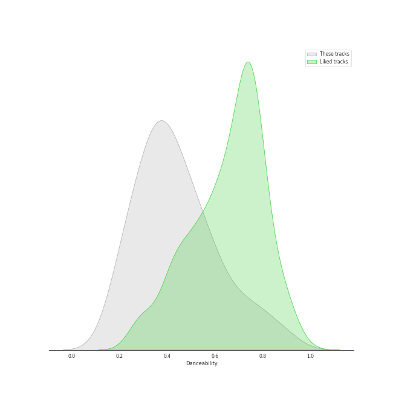
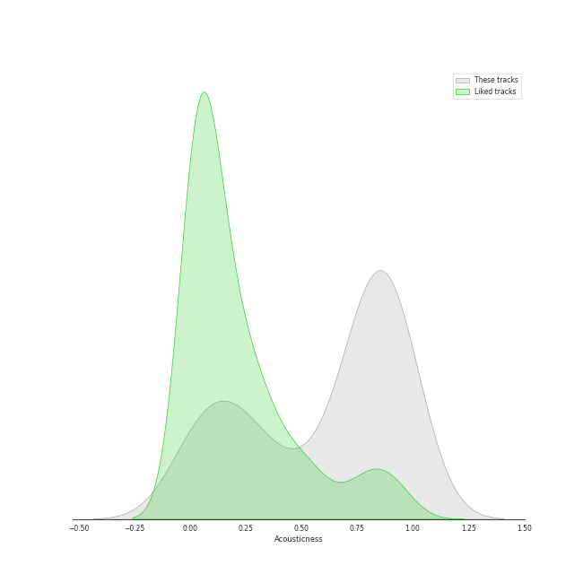
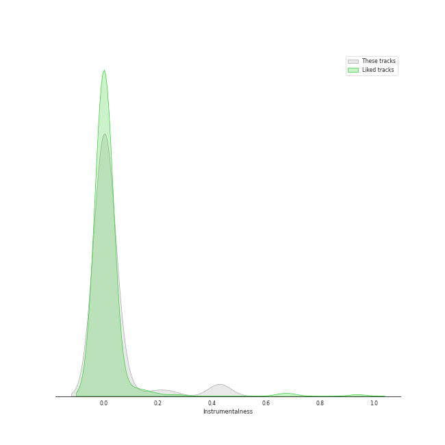
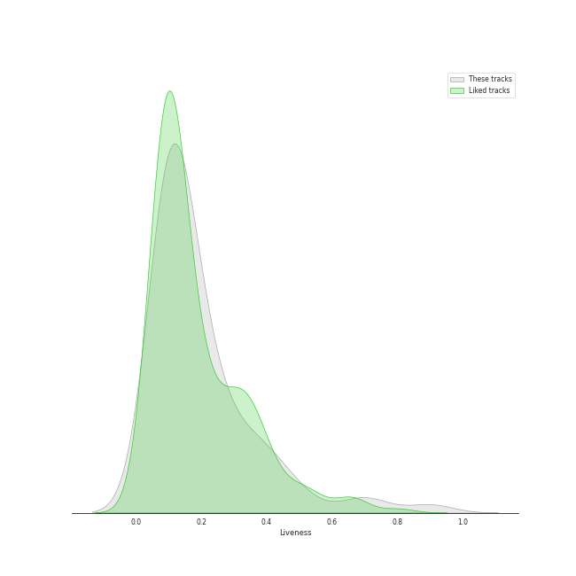

# Audio Features for Polydor Records

## Danceability

| ​ | 10 most Danceable tracks | ​​ | 10 least Danceable tracks |
|:---|:---|:---|:---|
|  | You Don't Know Me (0.877) |  | Born To Die (0.18) |
|  | Mercy (0.793) |  | All I Ask Of You - Reprise (0.191) |
|  | I Will Survive - Single Version (0.777) |  | Bring Him Home (0.199) |
|  | Heat Waves (0.761) |  | Norman fucking Rockwell (0.215) |
|  | Slow Grenade (0.758) |  | All I Ask Of You (0.222) |
|  | Lights - Single Version (0.683) |  | Overture (0.224) |
|  | Don't Call Me Up (0.674) |  | Entr'Acte (0.231) |
|  | Something In The Way You Move (0.658) |  | The Music Of The Night (0.239) |
|  | Doin' Time (0.641) |  | The Point Of No Return (0.251) |
|  | Prologue (0.626) |  | I Dreamed A Dream - From "Les Misérables" (0.256) |

## Energy

| ​ | 10 most Energetic tracks | ​​ | 10 least Energetic tracks |
|:---|:---|:---|:---|
|  | Don't Call Me Up (0.881) |  | Little Fall Of Rain (0.016) |
|  | Mercy (0.859) |  | Fantine’s Death (0.0241) |
|  | Radio (0.841) |  | Magical Lasso (0.0314) |
|  | Something In The Way You Move (0.814) |  | All I Ask Of You - Reprise (0.0679) |
|  | Lights - Single Version (0.789) |  | Empty Chairs At Empty Tables (0.0688) |
|  | I Will Survive - Single Version (0.725) |  | I Dreamed A Dream - From "Les Misérables" (0.0739) |
|  | Baba O'Riley (0.724) |  | Angel Of Music (0.0808) |
|  | Off To The Races (0.722) |  | I Remember / Stranger Than You Dreamt It (0.0817) |
|  | Free (0.696) |  | In My Life (0.091) |
|  | Brooklyn Baby (0.664) |  | The Music Of The Night (0.0961) |

## Speechiness

| ​ | 10 most Speechy tracks | ​​ | 10 least Speechy tracks |
|:---|:---|:---|:---|
|  | Prologue (0.748) |  | Chasing Cars (0.0274) |
|  | At The End Of The Day (0.389) |  | Love (0.0277) |
|  | Master Of The House (0.243) |  | Swan Song (0.0294) |
|  | The Confrontation (0.156) |  | Bel Air (0.0298) |
|  | Don't Call Me Up (0.147) |  | Video Games (0.0299) |
|  | You Don't Know Me (0.132) |  | Shades Of Cool (0.0302) |
|  | The Bishop (0.114) |  | Your Song (0.0311) |
|  | Poor Fool, He Makes Me Laugh (0.111) |  | One Day More (0.033) |
|  | In My Life (0.108) |  | Mercy (0.0332) |
|  | Heat Waves (0.0944) |  | Stars (0.0333) |

## Acousticness

| ​ | 10 most Acoustic tracks | ​​ | 10 least Acoustic tracks |
|:---|:---|:---|:---|
|  | A Heart Full Of Love (0.975) |  | Overture (0.00451) |
|  | Norman fucking Rockwell (0.968) |  | Free (0.00777) |
|  | Stars (0.949) |  | I Will Survive - Single Version (0.0131) |
|  | Empty Chairs At Empty Tables (0.944) |  | Lights - Single Version (0.0283) |
|  | Little Fall Of Rain (0.942) |  | Something In The Way You Move (0.0401) |
|  | I Dreamed A Dream - From "Les Misérables" (0.937) |  | Summertime Sadness (0.0456) |
|  | Your Song (0.936) |  | Cherry (0.048) |
|  | In My Life (0.935) |  | The Phantom Of The Opera (0.0533) |
|  | Magical Lasso (0.934) |  | Off To The Races (0.061) |
|  | Fantine’s Death (0.934) |  | Slow Grenade (0.0996) |

## Instrumentalness

| ​ | 10 most Instrumental tracks | ​​ | 10 least Instrumental tracks |
|:---|:---|:---|:---|
|  | Swan Song (0.421) |  | Who Am I? - From "Les Miserables'' (0.0) |
|  | Entr'Acte (0.42) |  | Do You Hear The People Sing? (0.0) |
|  | Overture (0.245) |  | Little Fall Of Rain (0.0) |
|  | Baba O'Riley (0.185) |  | Valjean's Soliloquy (0.0) |
|  | Bel Air (0.0875) |  | Dark Paradise (0.0) |
|  | Norman fucking Rockwell (0.0585) |  | At The End Of The Day (0.0) |
|  | Lights - Single Version (0.0492) |  | Prologue (0.0) |
|  | All I Ask Of You - Reprise (0.0315) |  | You Don't Know Me (0.0) |
|  | West Coast (0.0194) |  | Masquerade / Why So Silent (0.0) |
|  | Shades Of Cool (0.0161) |  | The Confrontation (0.0) |

## Liveness

| ​ | 10 most Live tracks | ​​ | 10 least Live tracks |
|:---|:---|:---|:---|
|  | Bel Air (0.901) |  | One Day More (0.0738) |
|  | Master Of The House (0.723) |  | All I Ask Of You - Reprise (0.0754) |
|  | At The End Of The Day (0.673) |  | Don't Call Me Up (0.0793) |
|  | The Point Of No Return (0.503) |  | Radio (0.0876) |
|  | Stars (0.474) |  | In My Life (0.0881) |
|  | The Bishop (0.441) |  | Wishing You Were Somehow Here Again (0.0882) |
|  | Off To The Races (0.4) |  | Video Games (0.0887) |
|  | Entr'Acte (0.386) |  | Behind Blue Eyes (0.0892) |
|  | Cherry (0.384) |  | West Coast (0.0907) |
|  | Bring Him Home (0.361) |  | I Dreamed A Dream - From "Les Misérables" (0.0907) |

## Valence

| ​ | 10 most Happy tracks | ​​ | 10 least Happy tracks |
|:---|:---|:---|:---|
|  | Mercy (0.964) |  | Wishing You Were Somehow Here Again (0.0374) |
|  | Lights - Single Version (0.809) |  | Swan Song (0.0392) |
|  | You Don't Know Me (0.693) |  | Wandering Child / Bravo, Monsieur (0.0392) |
|  | Slow Grenade (0.581) |  | Little Lotte / The Mirror (Angel Of Music) (0.0465) |
|  | Master Of The House (0.574) |  | Free (0.0494) |
|  | At The End Of The Day (0.565) |  | Down Once More / Track Down This Murderer (0.0529) |
|  | Heat Waves (0.531) |  | I Remember / Stranger Than You Dreamt It (0.0574) |
|  | I Will Survive - Single Version (0.529) |  | All I Ask Of You - Reprise (0.0624) |
|  | Doin' Time (0.523) |  | Why Have You Brought Me Here (0.0742) |
|  | Do You Hear The People Sing? (0.504) |  | The Point Of No Return (0.0757) |

## Tempo

| ​ | 10 most Fast tracks | ​​ | 10 least Fast tracks |
|:---|:---|:---|:---|
|  | Free (174.806) |  | On My Own (71.842) |
|  | Master Of The House (166.951) |  | Radio (75.112) |
|  | Off To The Races (160.065) |  | In My Life (75.556) |
|  | Bring Him Home (156.558) |  | Born To Die (75.632) |
|  | Doin' Time (144.982) |  | Magical Lasso (76.381) |
|  | Valjean's Soliloquy (142.907) |  | Do You Hear The People Sing? (76.744) |
|  | Slow Grenade (142.035) |  | Norman fucking Rockwell (78.287) |
|  | All I Ask Of You (139.404) |  | Why Have You Brought Me Here (78.337) |
|  | Shades Of Cool (137.918) |  | The Point Of No Return (80.215) |
|  | Your Song (133.604) |  | Little Fall Of Rain (80.391) |
