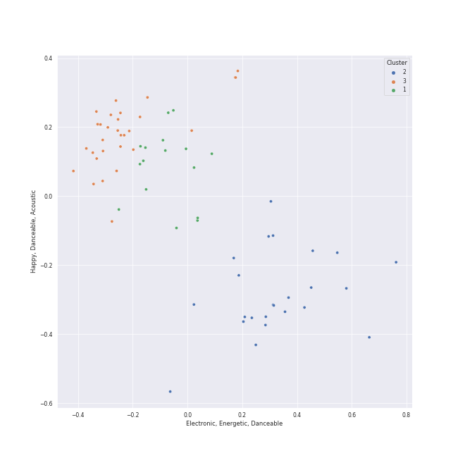

# Clusters in Polydor Records

## Cluster #1

16 tracks

| Art | Track | Album | Artists | Label | Rank | 💚 | 🔗 |
|:---|:---|:---|:---|:---|---:|:---|:---|
|  | Masquerade / Why So Silent | The Phantom Of The Opera | Andrew Lloyd Webber, Phantom Of The Opera Original London Cast, Sarah Brightman, Steve Barton, Michael Crawford | [Polydor Records](../..) | nan | | [🔗](https://open.spotify.com/track/1z2oyr9Uu9GCz31kycvPuX) |
|  | Poor Fool, He Makes Me Laugh | The Phantom Of The Opera | Andrew Lloyd Webber, Phantom Of The Opera Original London Cast, Rosemary Ashe | [Polydor Records](../..) | nan | | [🔗](https://open.spotify.com/track/50yxhOQupboMoF1xgzLza3) |
|  | Notes / Prima Donna | The Phantom Of The Opera | Andrew Lloyd Webber, Phantom Of The Opera Original London Cast, John Savident, David Firth, Steve Barton, Rosemary Ashe, Mary Millar, Janet Devenish, Michael Crawford | [Polydor Records](../..) | nan | | [🔗](https://open.spotify.com/track/7uFofIX6vcvU7vl4jlttEr) |
|  | Who Am I? - From "Les Miserables'' | Les Misérables: The Motion Picture Soundtrack Deluxe (Deluxe Edition) | Hugh Jackman | [Polydor Records](../..) | nan | | [🔗](https://open.spotify.com/track/0BeS5hJXm3yzubCswEC8TQ) |
|  | Valjean's Soliloquy | Les Misérables: The Motion Picture Soundtrack Deluxe (Deluxe Edition) | Hugh Jackman | [Polydor Records](../..) | nan | | [🔗](https://open.spotify.com/track/0kGWR2TUDw8AIHgmFwjk1V) |
|  | The Confrontation | Les Misérables: The Motion Picture Soundtrack Deluxe (Deluxe Edition) | Hugh Jackman, Russell Crowe | [Polydor Records](../..) | nan | | [🔗](https://open.spotify.com/track/31dATgmleDm4vrtFKkRhEd) |
|  | One Day More | Les Misérables: The Motion Picture Soundtrack Deluxe (Deluxe Edition) | Les Misérables Cast | [Polydor Records](../..) | nan | | [🔗](https://open.spotify.com/track/6ophEFs89SOktBpFnRM8BK) |
|  | Malibu Nights | Malibu Nights | LANY | [Polydor Records](../..) | nan | 💚 | [🔗](https://open.spotify.com/track/0Eqg0CQ7bK3RQIMPw1A7pl) |
|  | Fuck it I love you | Norman Fucking Rockwell! | [Lana Del Rey](../../../../artists/lana_del_rey/overview.md) | [Polydor Records](../..) | nan | | [🔗](https://open.spotify.com/track/7MtVPRGtZl6rPjMfLoI3Lh) |
|  | Video Games | Born To Die | [Lana Del Rey](../../../../artists/lana_del_rey/overview.md) | [Polydor Records](../..) | nan | 💚 | [🔗](https://open.spotify.com/track/5by7gtiDrxe4n2qQQunL8S) |
## Cluster #2

24 tracks

| Art | Track | Album | Artists | Label | Rank | 💚 | 🔗 |
|:---|:---|:---|:---|:---|---:|:---|:---|
|  | The Phantom Of The Opera | The Phantom Of The Opera | Andrew Lloyd Webber, Phantom Of The Opera Original London Cast, Michael Crawford, Sarah Brightman | [Polydor Records](../..) | nan | | [🔗](https://open.spotify.com/track/5qlABWwod6dgDCmRAAF5J5) |
|  | Close To Me - Red Velvet Remix | Close To Me (Red Velvet Remix) | Ellie Goulding, Diplo, [Red Velvet](../../../../artists/red_velvet/overview.md) | [Polydor Records](../..) | nan | | [🔗](https://open.spotify.com/track/696Y3Jx3k4Rjsw8gm2q4l4) |
|  | Something In The Way You Move | Delirium | Ellie Goulding | [Polydor Records](../..) | nan | | [🔗](https://open.spotify.com/track/7is4okCIwDa9vc7pUjda1H) |
|  | Dark Paradise | Born To Die | [Lana Del Rey](../../../../artists/lana_del_rey/overview.md) | [Polydor Records](../..) | nan | 💚 | [🔗](https://open.spotify.com/track/0rbuGVyW18IpX0bhA3P4Oh) |
|  | Summertime Sadness | Born To Die | [Lana Del Rey](../../../../artists/lana_del_rey/overview.md) | [Polydor Records](../..) | 399 | 💚 | [🔗](https://open.spotify.com/track/4cKtn8Shw999egpwBmWQmp) |
|  | West Coast | Ultraviolence (Deluxe) | [Lana Del Rey](../../../../artists/lana_del_rey/overview.md) | [Polydor Records](../..) | nan | | [🔗](https://open.spotify.com/track/5Y6nVaayzitvsD5F7nr3DV) |
|  | Cherry | Lust For Life | [Lana Del Rey](../../../../artists/lana_del_rey/overview.md) | [Polydor Records](../..) | nan | 💚 | [🔗](https://open.spotify.com/track/1Ym6aMuT5bliaZMC67AmPp) |
|  | Behind Blue Eyes | Who's Next (Deluxe Edition) | [The Who](../../../../artists/the_who/overview.md) | [Polydor Records](../..) | nan | 💚 | [🔗](https://open.spotify.com/track/0cKk8BKEi7zXbdrYdyqBP5) |
|  | Don't Call Me Up | Ivy To Roses (Mixtape) | Mabel | [Polydor Records](../..) | nan | 💚 | [🔗](https://open.spotify.com/track/5WHTFyqSii0lmT9R21abT8) |
|  | Chasing Cars | Eyes Open | Snow Patrol | [Polydor Records](../..) | nan | | [🔗](https://open.spotify.com/track/5hnyJvgoWiQUYZttV4wXy6) |
## Cluster #3

30 tracks

| Art | Track | Album | Artists | Label | Rank | 💚 | 🔗 |
|:---|:---|:---|:---|:---|---:|:---|:---|
|  | Down Once More / Track Down This Murderer | The Phantom Of The Opera | Andrew Lloyd Webber, Phantom Of The Opera Original London Cast, Michael Crawford, Sarah Brightman, Steve Barton | [Polydor Records](../..) | nan | | [🔗](https://open.spotify.com/track/08w39owyASWYcB9lO30DRC) |
|  | I Remember / Stranger Than You Dreamt It | The Phantom Of The Opera | Andrew Lloyd Webber, Phantom Of The Opera Original London Cast, Sarah Brightman, Michael Crawford | [Polydor Records](../..) | nan | | [🔗](https://open.spotify.com/track/0FwP3tsHCfmMJDe0vEkRUG) |
|  | Think Of Me | The Phantom Of The Opera | Andrew Lloyd Webber, Phantom Of The Opera Original London Cast, Rosemary Ashe, Sarah Brightman, Steve Barton | [Polydor Records](../..) | nan | | [🔗](https://open.spotify.com/track/31Irb8d3UBRfEcaHDzQxsK) |
|  | Angel Of Music | The Phantom Of The Opera | Andrew Lloyd Webber, Phantom Of The Opera Original London Cast, Janet Devenish, Sarah Brightman | [Polydor Records](../..) | nan | | [🔗](https://open.spotify.com/track/48eRbUfNOF4xnNHwSSYubb) |
|  | Why Have You Brought Me Here | The Phantom Of The Opera | Andrew Lloyd Webber, Phantom Of The Opera Original London Cast, Steve Barton, Sarah Brightman | [Polydor Records](../..) | nan | | [🔗](https://open.spotify.com/track/6DGALltLYPxUv3zmWLGT4x) |
|  | Magical Lasso | The Phantom Of The Opera | Andrew Lloyd Webber, Charles Hart, Richard Stilgoe, Phantom Of The Opera Original London Cast, Janos Kurucz, Janet Devenish, Mary Millar | [Polydor Records](../..) | nan | | [🔗](https://open.spotify.com/track/7egD3vWokabEvOB2TD7iCl) |
|  | Notes / Twisted Every Way | The Phantom Of The Opera | Andrew Lloyd Webber, Charles Hart, Phantom Of The Opera Original London Cast, John Savident, David Firth, Rosemary Ashe, John Aron, Sarah Brightman, Steve Barton, Mary Millar, Michael Crawford | [Polydor Records](../..) | nan | | [🔗](https://open.spotify.com/track/7n36JwlTBuGU7TfrRwjjSr) |
|  | Empty Chairs At Empty Tables | Les Misérables: The Motion Picture Soundtrack Deluxe (Deluxe Edition) | Eddie Redmayne | [Polydor Records](../..) | nan | | [🔗](https://open.spotify.com/track/29bONW7GKEq7ZDBqiQC2PV) |
|  | On My Own | Les Misérables: The Motion Picture Soundtrack Deluxe (Deluxe Edition) | Samantha Barks | [Polydor Records](../..) | nan | | [🔗](https://open.spotify.com/track/3Mr6ofzF6ZuYiqHh8qNud3) |
|  | Fantine’s Death | Les Misérables: The Motion Picture Soundtrack Deluxe (Deluxe Edition) | Anne Hathaway, Hugh Jackman | [Polydor Records](../..) | nan | | [🔗](https://open.spotify.com/track/47JhUpExCronIR7puEZJLh) |