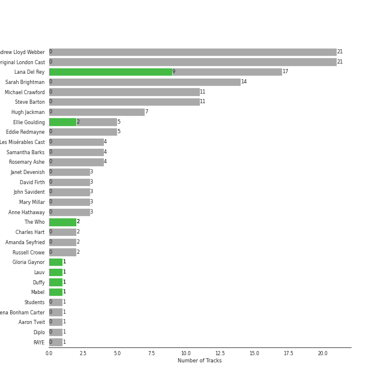
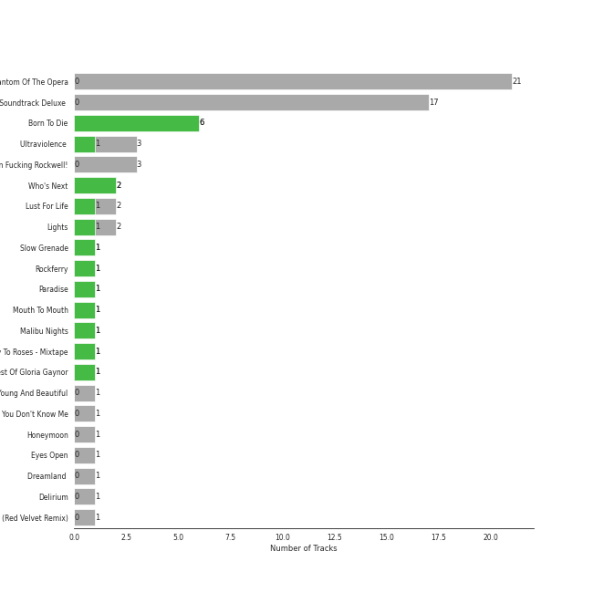
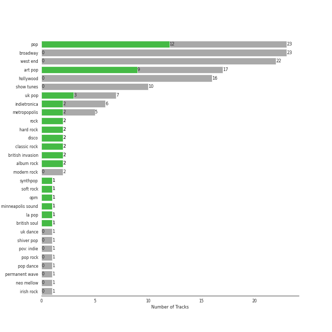

# Polydor Records

70 songs

[See Track Features](audio_features.md)

[See Clusters](clusters/overview.md)

Appears as:
- Polydor Records (68 tracks)
- Polydor (2 tracks)

## Top Artists

| Art | Tracks | 💚 | Artist | 🔗 |
|:---|---:|---:|:---|:---|
|  | 17 | 9 | [Lana Del Rey](../../artists/lana_del_rey/overview.md) | [🔗](https://open.spotify.com/artist/00FQb4jTyendYWaN8pK0wa) |
|  | 5 | 2 | Ellie Goulding | [🔗](https://open.spotify.com/artist/0X2BH1fck6amBIoJhDVmmJ) |
|  | 2 | 2 | [The Who](../../artists/the_who/overview.md) | [🔗](https://open.spotify.com/artist/67ea9eGLXYMsO2eYQRui3w) |
|  | 1 | 1 | Gloria Gaynor | [🔗](https://open.spotify.com/artist/6V6WCgi7waF55bJmylC4H5) |
|  | 1 | 1 | Lauv | [🔗](https://open.spotify.com/artist/5JZ7CnR6gTvEMKX4g70Amv) |
|  | 1 | 1 | LANY | [🔗](https://open.spotify.com/artist/49tQo2QULno7gxHutgccqF) |
|  | 1 | 1 | Duffy | [🔗](https://open.spotify.com/artist/37NqXwtb6nIEqRt4EJSoIO) |
|  | 1 | 1 | Mabel | [🔗](https://open.spotify.com/artist/1MIVXf74SZHmTIp4V4paH4) |
|  | 1 | 1 | Lipps Inc. | [🔗](https://open.spotify.com/artist/0lwRI7lvmlRY5DiA5Xa6wQ) |
|  | 21 | 0 | Andrew Lloyd Webber | [🔗](https://open.spotify.com/artist/4aP1lp10BRYZO658B2NwkG) |

See all 42 artists

| Art | Tracks | 💚 | Artist | 🔗 |
|:---|---:|---:|:---|:---|
|  | 21 | 0 | Phantom Of The Opera Original London Cast | [🔗](https://open.spotify.com/artist/3LfD2yRlfHAtTryX8rFp25) |
|  | 14 | 0 | Sarah Brightman | [🔗](https://open.spotify.com/artist/7Ead768rc4ShGxnqtqccU5) |
|  | 11 | 0 | Michael Crawford | [🔗](https://open.spotify.com/artist/5fRiVl9fyhUEZhcpMyIxUG) |
|  | 11 | 0 | Steve Barton | [🔗](https://open.spotify.com/artist/1gEOIEK9jgpYvvG57BP0US) |
|  | 7 | 0 | Hugh Jackman | [🔗](https://open.spotify.com/artist/5F1aoppMtU3OMiltO8ymJ2) |
|  | 5 | 0 | Eddie Redmayne | [🔗](https://open.spotify.com/artist/4EJP6Qhk6l18LumCcpEfLw) |
|  | 4 | 0 | Les Misérables Cast | [🔗](https://open.spotify.com/artist/71wy5iisVKXLZgoPxdFi8A) |
|  | 4 | 0 | Samantha Barks | [🔗](https://open.spotify.com/artist/4gOl5m9dY7IGAipqpul7GZ) |
|  | 4 | 0 | Rosemary Ashe | [🔗](https://open.spotify.com/artist/3Oju6zkuJzum4svKeVhKiK) |
| | 3 | 0 | Janet Devenish | [🔗](https://open.spotify.com/artist/7Ev9dg2zamUgQsRUp9DdRl) |
|  | 3 | 0 | David Firth | [🔗](https://open.spotify.com/artist/4kjJU6zIfQi87yTWJMxJNw) |
| | 3 | 0 | John Savident | [🔗](https://open.spotify.com/artist/2V0W4YzPCESOh86ss7D2QE) |
| | 3 | 0 | Mary Millar | [🔗](https://open.spotify.com/artist/1SBvpcra5uod7N0rxJxa3J) |
|  | 3 | 0 | Anne Hathaway | [🔗](https://open.spotify.com/artist/0nIyPY7J7G68WgQEOLHn0x) |
|  | 2 | 0 | Charles Hart | [🔗](https://open.spotify.com/artist/6IFUhDPbZkH4ytZZDiu0x4) |
|  | 2 | 0 | Amanda Seyfried | [🔗](https://open.spotify.com/artist/5RZjpmuD14JKXvB8Ry1G1u) |
|  | 2 | 0 | Russell Crowe | [🔗](https://open.spotify.com/artist/3YBIrJozn8fop4UYIt7wcV) |
|  | 1 | 0 | Students | [🔗](https://open.spotify.com/artist/7oaoEBdRqHXfoiGYa55Atp) |
| | 1 | 0 | Helena Bonham Carter | [🔗](https://open.spotify.com/artist/7gX22Ua3mEH2KXTCpIfoOP) |
|  | 1 | 0 | Aaron Tveit | [🔗](https://open.spotify.com/artist/68h2f0WXn4zEctSgNYozXx) |
|  | 1 | 0 | Diplo | [🔗](https://open.spotify.com/artist/5fMUXHkw8R8eOP2RNVYEZX) |
|  | 1 | 0 | RAYE | [🔗](https://open.spotify.com/artist/5KKpBU5eC2tJDzf0wmlRp2) |
| | 1 | 0 | John Aron | [🔗](https://open.spotify.com/artist/5Hco9oOhEcTrU0hzzIkoF7) |
|  | 1 | 0 | Glass Animals | [🔗](https://open.spotify.com/artist/4yvcSjfu4PC0CYQyLy4wSq) |
|  | 1 | 0 | Colm Wilkinson | [🔗](https://open.spotify.com/artist/4hKV8PcRBaHZqBJjSn8OJE) |
|  | 1 | 0 | Jax Jones | [🔗](https://open.spotify.com/artist/4Q6nIcaBED8qUel8bBx6Cr) |
|  | 1 | 0 | Snow Patrol | [🔗](https://open.spotify.com/artist/3rIZMv9rysU7JkLzEaC5Jp) |
| | 1 | 0 | The Factory Girls | [🔗](https://open.spotify.com/artist/3h4B6ffpCQVSn3QSaTLBna) |
| | 1 | 0 | Janos Kurucz | [🔗](https://open.spotify.com/artist/3MiTXPOmIgoJioulWki8dz) |
|  | 1 | 0 | [Red Velvet](../../artists/red_velvet/overview.md) | [🔗](https://open.spotify.com/artist/1z4g3DjTBBZKhvAroFlhOM) |
| | 1 | 0 | Sacha Baron Cohen | [🔗](https://open.spotify.com/artist/1JY6Dve5sex0urYQnbshM9) |
|  | 1 | 0 | Richard Stilgoe | [🔗](https://open.spotify.com/artist/17peneSLV6CavfRbQEACCu) |

## Top Albums

| Art | Tracks | 💚 | Album | Release Date | 🔗 |
|:---|---:|---:|:---|:---|:---|
|  | 21 | 0 | The Phantom Of The Opera | 1987-01-01 | [🔗](https://open.spotify.com/album/36bEg6FTBaZGLg9ngJZIU6) |
|  | 17 | 0 | Les Misérables: The Motion Picture Soundtrack Deluxe (Deluxe Edition) | 2013-01-01 | [🔗](https://open.spotify.com/album/0I6Bl1dVB1hQsSoQF6KuTg) |
|  | 6 | 6 | Born To Die | 2012-01-30 | [🔗](https://open.spotify.com/album/4X8hAqIWpQyQks2yRhyqs4) |
|  | 3 | 1 | Ultraviolence (Deluxe) | 2014-01-01 | [🔗](https://open.spotify.com/album/1ORxRsK3MrSLvh7VQTF01F) |
|  | 3 | 0 | Norman Fucking Rockwell! | 2019-08-30 | [🔗](https://open.spotify.com/album/5XpEKORZ4y6OrCZSKsi46A) |
|  | 2 | 2 | Who's Next (Deluxe Edition) | 1971-08-14 | [🔗](https://open.spotify.com/album/5MqyhhHbT13zsloD3uHhlQ) |
|  | 2 | 1 | Lust For Life | 2017-07-21 | [🔗](https://open.spotify.com/album/7xYiTrbTL57QO0bb4hXIKo) |
|  | 2 | 1 | Lights | 2011-01-01 | [🔗](https://open.spotify.com/album/3duZhvcaoqdNveQYXf9dMV) |
|  | 1 | 1 | Slow Grenade | 2020-06-30 | [🔗](https://open.spotify.com/album/15Zgvxqql6EPHE3NJlUt0R) |
|  | 1 | 1 | Rockferry | 2008-01-01 | [🔗](https://open.spotify.com/album/6freV6eqxuFjSr3E93Oqtz) |

See all 22 albums

| Art | Tracks | 💚 | Album | Release Date | 🔗 |
|:---|---:|---:|:---|:---|:---|
|  | 1 | 1 | Paradise | 2012-11-09 | [🔗](https://open.spotify.com/album/1JnjcAIKQ9TSJFVFierTB8) |
|  | 1 | 1 | Mouth To Mouth | 1979-11-01 | [🔗](https://open.spotify.com/album/1SMBOCE8CFqxr2EB92Asqh) |
|  | 1 | 1 | Malibu Nights | 2018-10-05 | [🔗](https://open.spotify.com/album/6SWmGozzQDUaczHXMuE8Za) |
|  | 1 | 1 | Ivy To Roses (Mixtape) | 2019-01-18 | [🔗](https://open.spotify.com/album/0syM7OUAhV7S6XmOa4nLUZ) |
|  | 1 | 1 | 20th Century Masters: The Millennium Collection: Best Of Gloria Gaynor | 2000-01-01 | [🔗](https://open.spotify.com/album/2BU2SNYoIPtZvGEJckdIhx) |
|  | 1 | 0 | Young And Beautiful | 2013-01-01 | [🔗](https://open.spotify.com/album/1D92WOHWUI2AGQCCdplcXL) |
|  | 1 | 0 | You Don't Know Me | 2016-12-09 | [🔗](https://open.spotify.com/album/3gdmWRWWJmkp5uMBXf755B) |
|  | 1 | 0 | Honeymoon | 2015-09-18 | [🔗](https://open.spotify.com/album/2DpEBrjCur1ythIZ10gJWw) |
|  | 1 | 0 | Eyes Open | 2006-01-01 | [🔗](https://open.spotify.com/album/3k7bXPw2u0C0SBKPMsgMS3) |
|  | 1 | 0 | Dreamland (+ Bonus Levels) | 2020-08-06 | [🔗](https://open.spotify.com/album/0KTj6k94XZh0c6IEMfxeWV) |
|  | 1 | 0 | Delirium | 2015-11-13 | [🔗](https://open.spotify.com/album/4A43DyDoAVa1Fb8pq6Yejl) |
|  | 1 | 0 | Close To Me (Red Velvet Remix) | 2019-04-05 | [🔗](https://open.spotify.com/album/7dg5iqyFYqRQH7vtAG9VNf) |

## Genres

| Tracks | 💚 | Genre |
|---:|---:|:---|
| 23 | 12 | [pop](../../genres/pop/overview.md) |
| 17 | 9 | [art pop](../../genres/art_pop/overview.md) |
| 7 | 3 | [uk pop](../../genres/uk_pop/overview.md) |
| 6 | 2 | indietronica |
| 5 | 2 | metropopolis |
| 2 | 2 | [rock](../../genres/rock/overview.md) |
| 2 | 2 | [hard rock](../../genres/hard_rock/overview.md) |
| 2 | 2 | disco |
| 2 | 2 | [classic rock](../../genres/classic_rock/overview.md) |
| 2 | 2 | [british invasion](../../genres/british_invasion/overview.md) |

See all 34 genres

| Tracks | 💚 | Genre |
|---:|---:|:---|
| 2 | 2 | [album rock](../../genres/album_rock/overview.md) |
| 1 | 1 | synthpop |
| 1 | 1 | [soft rock](../../genres/soft_rock/overview.md) |
| 1 | 1 | opm |
| 1 | 1 | minneapolis sound |
| 1 | 1 | la pop |
| 1 | 1 | british soul |
| 23 | 0 | [broadway](../../genres/broadway/overview.md) |
| 22 | 0 | west end |
| 16 | 0 | hollywood |
| 10 | 0 | [show tunes](../../genres/show_tunes/overview.md) |
| 2 | 0 | [modern rock](../../genres/modern_rock/overview.md) |
| 1 | 0 | uk dance |
| 1 | 0 | shiver pop |
| 1 | 0 | pov: indie |
| 1 | 0 | [pop rock](../../genres/pop_rock/overview.md) |
| 1 | 0 | pop dance |
| 1 | 0 | [permanent wave](../../genres/permanent_wave/overview.md) |
| 1 | 0 | [neo mellow](../../genres/neo_mellow/overview.md) |
| 1 | 0 | irish rock |
| 1 | 0 | house |
| 1 | 0 | gauze pop |
| 1 | 0 | edm |
| 1 | 0 | [dance pop](../../genres/dance_pop/overview.md) |

## Top Producers

| Art | Producer | Tracks | Credit Types |
|:---|:---|---:|:---|
|  | [Lana Del Rey](../../artists/lana_del_rey/overview.md) | 9 | Songwriter, Lyricist, Producer |
| | Emile Haynie | 5 | Producer |
| | Rick Nowels | 4 | Producer, Songwriter, Lyricist |
| | Larry Gold | 4 | Arranger |
| | Dan Grech-Marguerat | 4 | Producer |
| | Justin Parker | 3 | Producer, Songwriter |
| | Pete Townshend | 2 | Lyricist, Songwriter |
|  | [The Who](../../artists/the_who/overview.md) | 2 | Producer |
| | Tim Larcombe | 2 | Songwriter, Producer |
| | Glyn Johns | 2 | Producer |

View all

| Art | Producer | Tracks | Credit Types |
|:---|:---|---:|:---|
|  | Ellie Goulding | 2 | Songwriter |
| | Keith Moon | 1 | Producer |
| | Oscar Görres (Görres, Oscar) | 1 | Producer, Songwriter |
| | Brent Kolatalo | 1 | Producer |
| | Richard "Biff" Stannard | 1 | Producer, Songwriter |
| | Steven Greenberg | 1 | Lyricist, Songwriter |
| | KAMILLE | 1 | Songwriter |
|  | Lauv | 1 | Songwriter |
| | Ash Howes | 1 | Producer, Songwriter |
| | Freddie Perren | 1 | Songwriter |
| | [Serban Ghenea](../../producers/serban_ghenea/overview.md) | 1 | Producer |
| | Dan Auerbach | 1 | Producer |
| | Robopop | 1 | Producer |
| | Jason Elliott | 1 | Producer |
| | Carl Bagge | 1 | Arranger |
| | Collin Dupuis | 1 | Producer |
| | Joe Kearns | 1 | Producer, Songwriter |
| | Trevor Yasuda | 1 | Producer |
| | [Mark "Spike" Stent](../../producers/mark__spike__stent/overview.md) | 1 | Producer |
| | Daniel Pursey | 1 | Producer |
| | Chris Garcia | 1 | Producer |
|  | Duffy | 1 | Songwriter |
| | Chris Laws | 1 | Producer |
| | Dino Fekaris | 1 | Songwriter |
| | Kieron Menzies | 1 | Producer |
|  | Mabel | 1 | Songwriter |
| | Leland | 1 | Songwriter |
| | Steven Malcolmson | 1 | Producer |
| | Daniel Law Heath | 1 | Songwriter |
| | [Manny Marroquin](../../producers/manny_marroquin/overview.md) | 1 | Producer |
| | Robert Orton | 1 | Producer |
| | Steve Booker | 1 | Producer, Songwriter |
| | Dean Reid | 1 | Producer |
| | Steve Mac | 1 | Producer, Songwriter |
| | [John Hanes](../../producers/john_hanes/overview.md) | 1 | Producer |
| | Patrik Berger | 1 | Producer |

## Tracks released under Polydor Records

| Art | Track | Album | Artists | Label | Rank | 💚 | 🔗 |
|:---|:---|:---|:---|:---|---:|:---|:---|
|  | Shades Of Cool | Ultraviolence (Deluxe) | [Lana Del Rey](../../artists/lana_del_rey/overview.md) | [Polydor Records](.) | 409 | 💚 | [🔗](https://open.spotify.com/track/4VSg5K1hnbmIg4PwRdY6wV) |
|  | Off To The Races | Born To Die | [Lana Del Rey](../../artists/lana_del_rey/overview.md) | [Polydor Records](.) | 448 | 💚 | [🔗](https://open.spotify.com/track/7grzMnF1FHponm2aJBWj8E) |
|  | Summertime Sadness | Born To Die | [Lana Del Rey](../../artists/lana_del_rey/overview.md) | [Polydor Records](.) | 480 | 💚 | [🔗](https://open.spotify.com/track/4cKtn8Shw999egpwBmWQmp) |
|  | Baba O'Riley | Who's Next (Deluxe Edition) | [The Who](../../artists/the_who/overview.md) | [Polydor Records](.) | 864 | 💚 | [🔗](https://open.spotify.com/track/3qiyyUfYe7CRYLucrPmulD) |
|  | Behind Blue Eyes | Who's Next (Deluxe Edition) | [The Who](../../artists/the_who/overview.md) | [Polydor Records](.) | 864 | 💚 | [🔗](https://open.spotify.com/track/0cKk8BKEi7zXbdrYdyqBP5) |
|  | Funkytown | Mouth To Mouth | Lipps Inc. | [Polydor](.) | 864 | 💚 | [🔗](https://open.spotify.com/track/2XVQdI3m0giGxNrwUhV3yP) |
|  | All I Ask Of You | The Phantom Of The Opera | Andrew Lloyd Webber, Phantom Of The Opera Original London Cast, Steve Barton, Sarah Brightman | [Polydor Records](.) | 864 | | [🔗](https://open.spotify.com/track/52KiYg6Kn2NB9riY2IwUgi) |
|  | All I Ask Of You - Reprise | The Phantom Of The Opera | Andrew Lloyd Webber, Phantom Of The Opera Original London Cast, Michael Crawford, Steve Barton, Sarah Brightman | [Polydor Records](.) | 864 | | [🔗](https://open.spotify.com/track/0F8VLTQGhNjBi1ltbVerdE) |
|  | Angel Of Music | The Phantom Of The Opera | Andrew Lloyd Webber, Phantom Of The Opera Original London Cast, Janet Devenish, Sarah Brightman | [Polydor Records](.) | 864 | | [🔗](https://open.spotify.com/track/48eRbUfNOF4xnNHwSSYubb) |
|  | Down Once More / Track Down This Murderer | The Phantom Of The Opera | Andrew Lloyd Webber, Phantom Of The Opera Original London Cast, Michael Crawford, Sarah Brightman, Steve Barton | [Polydor Records](.) | 864 | | [🔗](https://open.spotify.com/track/08w39owyASWYcB9lO30DRC) |

See all tracks

| Art | Track | Album | Artists | Label | Rank | 💚 | 🔗 |
|:---|:---|:---|:---|:---|---:|:---|:---|
|  | Entr'Acte | The Phantom Of The Opera | Andrew Lloyd Webber, Phantom Of The Opera Original London Cast, John Savident, David Firth | [Polydor Records](.) | 864 | | [🔗](https://open.spotify.com/track/0cLoao2k6VaLjbvtxtYCtO) |
|  | I Remember / Stranger Than You Dreamt It | The Phantom Of The Opera | Andrew Lloyd Webber, Phantom Of The Opera Original London Cast, Sarah Brightman, Michael Crawford | [Polydor Records](.) | 864 | | [🔗](https://open.spotify.com/track/0FwP3tsHCfmMJDe0vEkRUG) |
|  | Little Lotte / The Mirror (Angel Of Music) | The Phantom Of The Opera | Andrew Lloyd Webber, Phantom Of The Opera Original London Cast, Steve Barton, Sarah Brightman, Michael Crawford | [Polydor Records](.) | 864 | | [🔗](https://open.spotify.com/track/6DUe3XqMPk2OMsT3QQfcVE) |
|  | Magical Lasso | The Phantom Of The Opera | Andrew Lloyd Webber, Charles Hart, Richard Stilgoe, Phantom Of The Opera Original London Cast, Janos Kurucz, Janet Devenish, Mary Millar | [Polydor Records](.) | 864 | | [🔗](https://open.spotify.com/track/7egD3vWokabEvOB2TD7iCl) |
|  | Masquerade / Why So Silent | The Phantom Of The Opera | Andrew Lloyd Webber, Phantom Of The Opera Original London Cast, Sarah Brightman, Steve Barton, Michael Crawford | [Polydor Records](.) | 864 | | [🔗](https://open.spotify.com/track/1z2oyr9Uu9GCz31kycvPuX) |
|  | Notes / Prima Donna | The Phantom Of The Opera | Andrew Lloyd Webber, Phantom Of The Opera Original London Cast, John Savident, David Firth, Steve Barton, Rosemary Ashe, Mary Millar, Janet Devenish, Michael Crawford | [Polydor Records](.) | 864 | | [🔗](https://open.spotify.com/track/7uFofIX6vcvU7vl4jlttEr) |
|  | Notes / Twisted Every Way | The Phantom Of The Opera | Andrew Lloyd Webber, Charles Hart, Phantom Of The Opera Original London Cast, John Savident, David Firth, Rosemary Ashe, John Aron, Sarah Brightman, Steve Barton, Mary Millar, Michael Crawford | [Polydor Records](.) | 864 | | [🔗](https://open.spotify.com/track/7n36JwlTBuGU7TfrRwjjSr) |
|  | Overture | The Phantom Of The Opera | Andrew Lloyd Webber, Phantom Of The Opera Original London Cast | [Polydor Records](.) | 864 | | [🔗](https://open.spotify.com/track/37u4N8Nje0UIJINbW7QULX) |
|  | Poor Fool, He Makes Me Laugh | The Phantom Of The Opera | Andrew Lloyd Webber, Phantom Of The Opera Original London Cast, Rosemary Ashe | [Polydor Records](.) | 864 | | [🔗](https://open.spotify.com/track/50yxhOQupboMoF1xgzLza3) |
|  | Prologue | The Phantom Of The Opera | Andrew Lloyd Webber, Phantom Of The Opera Original London Cast, Steve Barton | [Polydor Records](.) | 864 | | [🔗](https://open.spotify.com/track/1bdfgBPqPzUrSDQf46KMVz) |
|  | The Music Of The Night | The Phantom Of The Opera | Andrew Lloyd Webber, Phantom Of The Opera Original London Cast, Michael Crawford | [Polydor Records](.) | 864 | | [🔗](https://open.spotify.com/track/2jF3AQzvTj9L1Ax9Di5BYu) |
|  | The Phantom Of The Opera | The Phantom Of The Opera | Andrew Lloyd Webber, Phantom Of The Opera Original London Cast, Michael Crawford, Sarah Brightman | [Polydor Records](.) | 864 | | [🔗](https://open.spotify.com/track/5qlABWwod6dgDCmRAAF5J5) |
|  | The Point Of No Return | The Phantom Of The Opera | Andrew Lloyd Webber, Phantom Of The Opera Original London Cast, Michael Crawford, Sarah Brightman | [Polydor Records](.) | 864 | | [🔗](https://open.spotify.com/track/18y1ZP9WCMunAe6QgByGif) |
|  | Think Of Me | The Phantom Of The Opera | Andrew Lloyd Webber, Phantom Of The Opera Original London Cast, Rosemary Ashe, Sarah Brightman, Steve Barton | [Polydor Records](.) | 864 | | [🔗](https://open.spotify.com/track/31Irb8d3UBRfEcaHDzQxsK) |
|  | Wandering Child / Bravo, Monsieur | The Phantom Of The Opera | Andrew Lloyd Webber, Phantom Of The Opera Original London Cast, Michael Crawford, Sarah Brightman, Steve Barton | [Polydor Records](.) | 864 | | [🔗](https://open.spotify.com/track/6hrnZnUl70iElye8lbjoI5) |
|  | Why Have You Brought Me Here | The Phantom Of The Opera | Andrew Lloyd Webber, Phantom Of The Opera Original London Cast, Steve Barton, Sarah Brightman | [Polydor Records](.) | 864 | | [🔗](https://open.spotify.com/track/6DGALltLYPxUv3zmWLGT4x) |
|  | Wishing You Were Somehow Here Again | The Phantom Of The Opera | Andrew Lloyd Webber, Phantom Of The Opera Original London Cast, Sarah Brightman | [Polydor Records](.) | 864 | | [🔗](https://open.spotify.com/track/1bjDpl9BW6AWAjH4ZKtxHX) |
|  | I Will Survive - Single Version | 20th Century Masters: The Millennium Collection: Best Of Gloria Gaynor | Gloria Gaynor | [Polydor](.) | 864 | 💚 | [🔗](https://open.spotify.com/track/7cv28LXcjAC3GsXbUvXKbX) |
|  | Chasing Cars | Eyes Open | Snow Patrol | [Polydor Records](.) | 864 | | [🔗](https://open.spotify.com/track/5hnyJvgoWiQUYZttV4wXy6) |
|  | Mercy | Rockferry | Duffy | [Polydor Records](.) | 864 | 💚 | [🔗](https://open.spotify.com/track/78twQ5XCFJMTE37ZSU0gsj) |
|  | Lights - Single Version | Lights | Ellie Goulding | [Polydor Records](.) | 864 | 💚 | [🔗](https://open.spotify.com/track/5qftsSFD6Qgndcx13SSqQj) |
|  | Your Song | Lights | Ellie Goulding | [Polydor Records](.) | 864 | | [🔗](https://open.spotify.com/track/562NFiDgGSylJpitA7dUhE) |
|  | Born To Die | Born To Die | [Lana Del Rey](../../artists/lana_del_rey/overview.md) | [Polydor Records](.) | 864 | 💚 | [🔗](https://open.spotify.com/track/3eRZZ4d2RJSqFKzP7tSdFE) |
|  | Dark Paradise | Born To Die | [Lana Del Rey](../../artists/lana_del_rey/overview.md) | [Polydor Records](.) | 864 | 💚 | [🔗](https://open.spotify.com/track/0rbuGVyW18IpX0bhA3P4Oh) |
|  | Radio | Born To Die | [Lana Del Rey](../../artists/lana_del_rey/overview.md) | [Polydor Records](.) | 864 | 💚 | [🔗](https://open.spotify.com/track/45dAw6GXEsogcDF3NUgj3O) |
|  | Video Games | Born To Die | [Lana Del Rey](../../artists/lana_del_rey/overview.md) | [Polydor Records](.) | 864 | 💚 | [🔗](https://open.spotify.com/track/5by7gtiDrxe4n2qQQunL8S) |
|  | Bel Air | Paradise | [Lana Del Rey](../../artists/lana_del_rey/overview.md) | [Polydor Records](.) | 864 | 💚 | [🔗](https://open.spotify.com/track/1OI3ZMcABE1U7hnhf9BENL) |
|  | A Heart Full Of Love | Les Misérables: The Motion Picture Soundtrack Deluxe (Deluxe Edition) | Eddie Redmayne, Amanda Seyfried, Samantha Barks | [Polydor Records](.) | 864 | | [🔗](https://open.spotify.com/track/2AuGrWzTXX61Mq8rfT98jQ) |
|  | At The End Of The Day | Les Misérables: The Motion Picture Soundtrack Deluxe (Deluxe Edition) | Hugh Jackman, Anne Hathaway, The Factory Girls, Les Misérables Cast | [Polydor Records](.) | 864 | | [🔗](https://open.spotify.com/track/1VUChQjlhCIDGF724QpKb9) |
|  | Bring Him Home | Les Misérables: The Motion Picture Soundtrack Deluxe (Deluxe Edition) | Hugh Jackman | [Polydor Records](.) | 864 | | [🔗](https://open.spotify.com/track/5hzjEYR3PxrxhG7ZXVoM6U) |
|  | Do You Hear The People Sing? | Les Misérables: The Motion Picture Soundtrack Deluxe (Deluxe Edition) | Aaron Tveit, Eddie Redmayne, Students, Les Misérables Cast | [Polydor Records](.) | 864 | | [🔗](https://open.spotify.com/track/0g8H61FNXHHhMVHB0jwdzH) |
|  | Empty Chairs At Empty Tables | Les Misérables: The Motion Picture Soundtrack Deluxe (Deluxe Edition) | Eddie Redmayne | [Polydor Records](.) | 864 | | [🔗](https://open.spotify.com/track/29bONW7GKEq7ZDBqiQC2PV) |
|  | Fantine’s Death | Les Misérables: The Motion Picture Soundtrack Deluxe (Deluxe Edition) | Anne Hathaway, Hugh Jackman | [Polydor Records](.) | 864 | | [🔗](https://open.spotify.com/track/47JhUpExCronIR7puEZJLh) |
|  | I Dreamed A Dream - From "Les Misérables" | Les Misérables: The Motion Picture Soundtrack Deluxe (Deluxe Edition) | Anne Hathaway | [Polydor Records](.) | 864 | | [🔗](https://open.spotify.com/track/7CNVenAoty0IomwFPaMaaH) |
|  | In My Life | Les Misérables: The Motion Picture Soundtrack Deluxe (Deluxe Edition) | Amanda Seyfried, Eddie Redmayne, Samantha Barks, Hugh Jackman | [Polydor Records](.) | 864 | | [🔗](https://open.spotify.com/track/36vPj8etuV0nTqjpvpp2CA) |
|  | Little Fall Of Rain | Les Misérables: The Motion Picture Soundtrack Deluxe (Deluxe Edition) | Eddie Redmayne, Samantha Barks | [Polydor Records](.) | 864 | | [🔗](https://open.spotify.com/track/0hIy3U1BoNA28NRBzU6ECp) |
|  | Master Of The House | Les Misérables: The Motion Picture Soundtrack Deluxe (Deluxe Edition) | Sacha Baron Cohen, Helena Bonham Carter, Les Misérables Cast | [Polydor Records](.) | 864 | | [🔗](https://open.spotify.com/track/3WoatVXvmr0qK7xVcVIyPi) |
|  | On My Own | Les Misérables: The Motion Picture Soundtrack Deluxe (Deluxe Edition) | Samantha Barks | [Polydor Records](.) | 864 | | [🔗](https://open.spotify.com/track/3Mr6ofzF6ZuYiqHh8qNud3) |
|  | One Day More | Les Misérables: The Motion Picture Soundtrack Deluxe (Deluxe Edition) | Les Misérables Cast | [Polydor Records](.) | 864 | | [🔗](https://open.spotify.com/track/6ophEFs89SOktBpFnRM8BK) |
|  | Stars | Les Misérables: The Motion Picture Soundtrack Deluxe (Deluxe Edition) | Russell Crowe | [Polydor Records](.) | 864 | | [🔗](https://open.spotify.com/track/4cLsM2rpxuniX1GkXdQjeC) |
|  | The Bishop | Les Misérables: The Motion Picture Soundtrack Deluxe (Deluxe Edition) | Colm Wilkinson | [Polydor Records](.) | 864 | | [🔗](https://open.spotify.com/track/4o4MIPR7Ognceg3e6DsjGD) |
|  | The Confrontation | Les Misérables: The Motion Picture Soundtrack Deluxe (Deluxe Edition) | Hugh Jackman, Russell Crowe | [Polydor Records](.) | 864 | | [🔗](https://open.spotify.com/track/31dATgmleDm4vrtFKkRhEd) |
|  | Valjean's Soliloquy | Les Misérables: The Motion Picture Soundtrack Deluxe (Deluxe Edition) | Hugh Jackman | [Polydor Records](.) | 864 | | [🔗](https://open.spotify.com/track/0kGWR2TUDw8AIHgmFwjk1V) |
|  | Who Am I? - From "Les Miserables'' | Les Misérables: The Motion Picture Soundtrack Deluxe (Deluxe Edition) | Hugh Jackman | [Polydor Records](.) | 864 | | [🔗](https://open.spotify.com/track/0BeS5hJXm3yzubCswEC8TQ) |
|  | Young And Beautiful | Young And Beautiful | [Lana Del Rey](../../artists/lana_del_rey/overview.md) | [Polydor Records](.) | 864 | | [🔗](https://open.spotify.com/track/2nMeu6UenVvwUktBCpLMK9) |
|  | Brooklyn Baby | Ultraviolence (Deluxe) | [Lana Del Rey](../../artists/lana_del_rey/overview.md) | [Polydor Records](.) | 864 | | [🔗](https://open.spotify.com/track/1NZs6n6hl8UuMaX0UC0YTz) |
|  | West Coast | Ultraviolence (Deluxe) | [Lana Del Rey](../../artists/lana_del_rey/overview.md) | [Polydor Records](.) | 864 | | [🔗](https://open.spotify.com/track/5Y6nVaayzitvsD5F7nr3DV) |
|  | Swan Song | Honeymoon | [Lana Del Rey](../../artists/lana_del_rey/overview.md) | [Polydor Records](.) | 864 | | [🔗](https://open.spotify.com/track/1DYRRZ5rSlc1PopnB7azLZ) |
|  | Something In The Way You Move | Delirium | Ellie Goulding | [Polydor Records](.) | 864 | | [🔗](https://open.spotify.com/track/7is4okCIwDa9vc7pUjda1H) |
|  | You Don't Know Me | You Don't Know Me | Jax Jones, RAYE | [Polydor Records](.) | 864 | | [🔗](https://open.spotify.com/track/1rFMYAZxBoAKSzXI54brMu) |
|  | Cherry | Lust For Life | [Lana Del Rey](../../artists/lana_del_rey/overview.md) | [Polydor Records](.) | 864 | 💚 | [🔗](https://open.spotify.com/track/1Ym6aMuT5bliaZMC67AmPp) |
|  | Love | Lust For Life | [Lana Del Rey](../../artists/lana_del_rey/overview.md) | [Polydor Records](.) | 864 | | [🔗](https://open.spotify.com/track/2Kerz9H9IejzeIpjhDJoYG) |
|  | Malibu Nights | Malibu Nights | LANY | [Polydor Records](.) | 864 | 💚 | [🔗](https://open.spotify.com/track/0Eqg0CQ7bK3RQIMPw1A7pl) |
|  | Don't Call Me Up | Ivy To Roses (Mixtape) | Mabel | [Polydor Records](.) | 864 | 💚 | [🔗](https://open.spotify.com/track/5WHTFyqSii0lmT9R21abT8) |
|  | Close To Me - Red Velvet Remix | Close To Me (Red Velvet Remix) | Ellie Goulding, Diplo, [Red Velvet](../../artists/red_velvet/overview.md) | [Polydor Records](.) | 864 | | [🔗](https://open.spotify.com/track/696Y3Jx3k4Rjsw8gm2q4l4) |
|  | Doin' Time | Norman Fucking Rockwell! | [Lana Del Rey](../../artists/lana_del_rey/overview.md) | [Polydor Records](.) | 864 | | [🔗](https://open.spotify.com/track/0Oqc0kKFsQ6MhFOLBNZIGX) |
|  | Fuck it I love you | Norman Fucking Rockwell! | [Lana Del Rey](../../artists/lana_del_rey/overview.md) | [Polydor Records](.) | 864 | | [🔗](https://open.spotify.com/track/7MtVPRGtZl6rPjMfLoI3Lh) |
|  | Norman fucking Rockwell | Norman Fucking Rockwell! | [Lana Del Rey](../../artists/lana_del_rey/overview.md) | [Polydor Records](.) | 864 | | [🔗](https://open.spotify.com/track/3RIgHHpnFKj5Rni1shokDj) |
|  | Slow Grenade | Slow Grenade | Ellie Goulding, Lauv | [Polydor Records](.) | 864 | 💚 | [🔗](https://open.spotify.com/track/5z8uLrYMcUVvzTV28twt44) |
|  | Heat Waves | Dreamland (+ Bonus Levels) | Glass Animals | [Polydor Records](.) | 864 | | [🔗](https://open.spotify.com/track/02MWAaffLxlfxAUY7c5dvx) |

