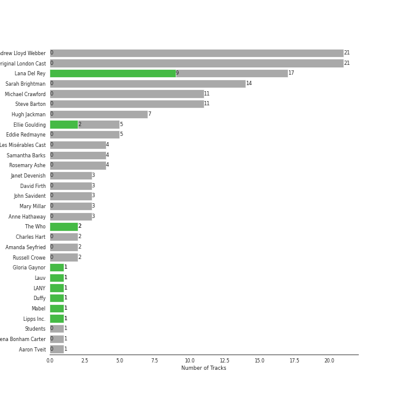

# Polydor Records

56 songs

Appears as:
- Polydor Records (55 tracks)
- Polydor (1 tracks)

## Top Artists

| Art | Tracks | 💚 | Artist | 🔗 |
|:---|---:|---:|:---|:---|
|  | 17 | 9 | [Lana Del Rey](../../artists/lana_del_rey/overview.md) | [🔗](https://open.spotify.com/artist/00FQb4jTyendYWaN8pK0wa) |
|  | 4 | 2 | Ellie Goulding | [🔗](https://open.spotify.com/artist/0X2BH1fck6amBIoJhDVmmJ) |
|  | 2 | 2 | The Who | [🔗](https://open.spotify.com/artist/67ea9eGLXYMsO2eYQRui3w) |
|  | 1 | 1 | Gloria Gaynor | [🔗](https://open.spotify.com/artist/6V6WCgi7waF55bJmylC4H5) |
|  | 1 | 1 | Lauv | [🔗](https://open.spotify.com/artist/5JZ7CnR6gTvEMKX4g70Amv) |
|  | 1 | 1 | Duffy | [🔗](https://open.spotify.com/artist/37NqXwtb6nIEqRt4EJSoIO) |
|  | 1 | 1 | [Florence + The Machine](../../artists/florence___the_machine/overview.md) | [🔗](https://open.spotify.com/artist/1moxjboGR7GNWYIMWsRjgG) |
|  | 1 | 1 | Mabel | [🔗](https://open.spotify.com/artist/1MIVXf74SZHmTIp4V4paH4) |
|  | 21 | 0 | Andrew Lloyd Webber | [🔗](https://open.spotify.com/artist/4aP1lp10BRYZO658B2NwkG) |
|  | 21 | 0 | Phantom Of The Opera Original London Cast | [🔗](https://open.spotify.com/artist/3LfD2yRlfHAtTryX8rFp25) |

See all 32 artists

| Art | Tracks | 💚 | Artist | 🔗 |
|:---|---:|---:|:---|:---|
|  | 14 | 0 | Sarah Brightman | [🔗](https://open.spotify.com/artist/7Ead768rc4ShGxnqtqccU5) |
|  | 11 | 0 | Michael Crawford | [🔗](https://open.spotify.com/artist/5fRiVl9fyhUEZhcpMyIxUG) |
|  | 11 | 0 | Steve Barton | [🔗](https://open.spotify.com/artist/1gEOIEK9jgpYvvG57BP0US) |
|  | 4 | 0 | Rosemary Ashe | [🔗](https://open.spotify.com/artist/3Oju6zkuJzum4svKeVhKiK) |
|  | 3 | 0 | Janet Devenish | [🔗](https://open.spotify.com/artist/7Ev9dg2zamUgQsRUp9DdRl) |
|  | 3 | 0 | David Firth | [🔗](https://open.spotify.com/artist/4kjJU6zIfQi87yTWJMxJNw) |
|  | 3 | 0 | Eddie Redmayne | [🔗](https://open.spotify.com/artist/4EJP6Qhk6l18LumCcpEfLw) |
|  | 3 | 0 | John Savident | [🔗](https://open.spotify.com/artist/2V0W4YzPCESOh86ss7D2QE) |
|  | 3 | 0 | Mary Millar | [🔗](https://open.spotify.com/artist/1SBvpcra5uod7N0rxJxa3J) |
|  | 2 | 0 | Samantha Barks | [🔗](https://open.spotify.com/artist/4gOl5m9dY7IGAipqpul7GZ) |
|  | 1 | 0 | Students | [🔗](https://open.spotify.com/artist/7oaoEBdRqHXfoiGYa55Atp) |
|  | 1 | 0 | Les Misérables Cast | [🔗](https://open.spotify.com/artist/71wy5iisVKXLZgoPxdFi8A) |
|  | 1 | 0 | Aaron Tveit | [🔗](https://open.spotify.com/artist/68h2f0WXn4zEctSgNYozXx) |
|  | 1 | 0 | Amanda Seyfried | [🔗](https://open.spotify.com/artist/5RZjpmuD14JKXvB8Ry1G1u) |
|  | 1 | 0 | RAYE | [🔗](https://open.spotify.com/artist/5KKpBU5eC2tJDzf0wmlRp2) |
|  | 1 | 0 | John Aron | [🔗](https://open.spotify.com/artist/5Hco9oOhEcTrU0hzzIkoF7) |
|  | 1 | 0 | Hugh Jackman | [🔗](https://open.spotify.com/artist/5F1aoppMtU3OMiltO8ymJ2) |
|  | 1 | 0 | Glass Animals | [🔗](https://open.spotify.com/artist/4yvcSjfu4PC0CYQyLy4wSq) |
|  | 1 | 0 | Jax Jones | [🔗](https://open.spotify.com/artist/4Q6nIcaBED8qUel8bBx6Cr) |
|  | 1 | 0 | Snow Patrol | [🔗](https://open.spotify.com/artist/3rIZMv9rysU7JkLzEaC5Jp) |
|  | 1 | 0 | Janos Kurucz | [🔗](https://open.spotify.com/artist/3MiTXPOmIgoJioulWki8dz) |
|  | 1 | 0 | Anne Hathaway | [🔗](https://open.spotify.com/artist/0nIyPY7J7G68WgQEOLHn0x) |

## Top Albums

| Art | Tracks | 💚 | Album | Release Date | 🔗 |
|:---|---:|---:|:---|:---|:---|
|  | 21 | 0 | The Phantom Of The Opera | 1987-01-01 | [🔗](https://open.spotify.com/album/36bEg6FTBaZGLg9ngJZIU6) |
|  | 6 | 6 | Born To Die | 2012-01-30 | [🔗](https://open.spotify.com/album/4X8hAqIWpQyQks2yRhyqs4) |
|  | 5 | 0 | Les Misérables: The Motion Picture Soundtrack Deluxe (Deluxe Edition) | 2013-01-01 | [🔗](https://open.spotify.com/album/0I6Bl1dVB1hQsSoQF6KuTg) |
|  | 3 | 1 | Ultraviolence (Deluxe) | 2014-01-01 | [🔗](https://open.spotify.com/album/1ORxRsK3MrSLvh7VQTF01F) |
|  | 3 | 0 | Norman Fucking Rockwell! | 2019-08-30 | [🔗](https://open.spotify.com/album/5XpEKORZ4y6OrCZSKsi46A) |
|  | 2 | 2 | Who's Next (Deluxe Edition) | 1971-08-14 | [🔗](https://open.spotify.com/album/5MqyhhHbT13zsloD3uHhlQ) |
|  | 2 | 1 | Lust For Life | 2017-07-21 | [🔗](https://open.spotify.com/album/7xYiTrbTL57QO0bb4hXIKo) |
|  | 2 | 1 | Lights | 2011-01-01 | [🔗](https://open.spotify.com/album/3duZhvcaoqdNveQYXf9dMV) |
|  | 1 | 1 | Slow Grenade | 2020-06-30 | [🔗](https://open.spotify.com/album/15Zgvxqql6EPHE3NJlUt0R) |
|  | 1 | 1 | Rockferry | 2008-01-01 | [🔗](https://open.spotify.com/album/6freV6eqxuFjSr3E93Oqtz) |

See all 20 albums

| Art | Tracks | 💚 | Album | Release Date | 🔗 |
|:---|---:|---:|:---|:---|:---|
|  | 1 | 1 | Paradise | 2012-11-09 | [🔗](https://open.spotify.com/album/1JnjcAIKQ9TSJFVFierTB8) |
|  | 1 | 1 | Ivy To Roses (Mixtape) | 2019-01-18 | [🔗](https://open.spotify.com/album/0syM7OUAhV7S6XmOa4nLUZ) |
|  | 1 | 1 | Dance Fever | 2022-05-13 | [🔗](https://open.spotify.com/album/4ohh1zQ4yybSK9FS7LLyDE) |
|  | 1 | 1 | 20th Century Masters: The Millennium Collection: Best Of Gloria Gaynor | 2000-01-01 | [🔗](https://open.spotify.com/album/2BU2SNYoIPtZvGEJckdIhx) |
|  | 1 | 0 | Young And Beautiful | 2013-01-01 | [🔗](https://open.spotify.com/album/1D92WOHWUI2AGQCCdplcXL) |
|  | 1 | 0 | You Don't Know Me | 2016-12-09 | [🔗](https://open.spotify.com/album/3gdmWRWWJmkp5uMBXf755B) |
|  | 1 | 0 | Honeymoon | 2015-09-18 | [🔗](https://open.spotify.com/album/2DpEBrjCur1ythIZ10gJWw) |
|  | 1 | 0 | Eyes Open | 2006-01-01 | [🔗](https://open.spotify.com/album/3k7bXPw2u0C0SBKPMsgMS3) |
|  | 1 | 0 | Dreamland (+ Bonus Levels) | 2020-08-06 | [🔗](https://open.spotify.com/album/0KTj6k94XZh0c6IEMfxeWV) |
|  | 1 | 0 | Delirium | 2015-11-13 | [🔗](https://open.spotify.com/album/4A43DyDoAVa1Fb8pq6Yejl) |

## Genres

| Tracks | 💚 | Genre |
|---:|---:|:---|
| 22 | 12 | [pop](../../genres/pop/overview.md) |
| 17 | 9 | [art pop](../../genres/art_pop/overview.md) |
| 6 | 3 | uk pop |
| 6 | 3 | [dance pop](../../genres/dance_pop/overview.md) |
| 5 | 2 | indietronica |
| 4 | 2 | metropopolis |
| 2 | 2 | [rock](../../genres/rock/overview.md) |
| 2 | 2 | hard rock |
| 2 | 2 | [classic rock](../../genres/classic_rock/overview.md) |
| 2 | 2 | british invasion |

See all 32 genres

| Tracks | 💚 | Genre |
|---:|---:|:---|
| 2 | 2 | [album rock](../../genres/album_rock/overview.md) |
| 3 | 1 | [modern rock](../../genres/modern_rock/overview.md) |
| 1 | 1 | uk alternative pop |
| 1 | 1 | [soft rock](../../genres/soft_rock/overview.md) |
| 1 | 1 | disco |
| 1 | 1 | british soul |
| 1 | 1 | baroque pop |
| 23 | 0 | [broadway](../../genres/broadway/overview.md) |
| 21 | 0 | west end |
| 5 | 0 | hollywood |
| 3 | 0 | [show tunes](../../genres/show_tunes/overview.md) |
| 1 | 0 | uk dance |
| 1 | 0 | tropical house |
| 1 | 0 | shiver pop |
| 1 | 0 | [pop rock](../../genres/pop_rock/overview.md) |
| 1 | 0 | pop dance |
| 1 | 0 | [permanent wave](../../genres/permanent_wave/overview.md) |
| 1 | 0 | [neo mellow](../../genres/neo_mellow/overview.md) |
| 1 | 0 | irish rock |
| 1 | 0 | house |
| 1 | 0 | gauze pop |
| 1 | 0 | edm |

## Tracks released under Polydor Records

| Art | Track | Album | Artists | Label | 💚 | 🔗 |
|:---|:---|:---|:---|:---|:---|:---|
|  | Do You Hear The People Sing? | Les Misérables: The Motion Picture Soundtrack Deluxe (Deluxe Edition) | Aaron Tveit, Eddie Redmayne, Students, Les Misérables Cast | [Polydor Records](.) | | [🔗](https://open.spotify.com/track/0g8H61FNXHHhMVHB0jwdzH) |
|  | In My Life | Les Misérables: The Motion Picture Soundtrack Deluxe (Deluxe Edition) | Amanda Seyfried, Eddie Redmayne, Samantha Barks, Hugh Jackman | [Polydor Records](.) | | [🔗](https://open.spotify.com/track/36vPj8etuV0nTqjpvpp2CA) |
|  | All I Ask Of You | The Phantom Of The Opera | Andrew Lloyd Webber, Phantom Of The Opera Original London Cast, Steve Barton, Sarah Brightman | [Polydor Records](.) | | [🔗](https://open.spotify.com/track/52KiYg6Kn2NB9riY2IwUgi) |
|  | All I Ask Of You - Reprise | The Phantom Of The Opera | Andrew Lloyd Webber, Phantom Of The Opera Original London Cast, Michael Crawford, Steve Barton, Sarah Brightman | [Polydor Records](.) | | [🔗](https://open.spotify.com/track/0F8VLTQGhNjBi1ltbVerdE) |
|  | Angel Of Music | The Phantom Of The Opera | Andrew Lloyd Webber, Phantom Of The Opera Original London Cast, Janet Devenish, Sarah Brightman | [Polydor Records](.) | | [🔗](https://open.spotify.com/track/48eRbUfNOF4xnNHwSSYubb) |
|  | Down Once More / Track Down This Murderer | The Phantom Of The Opera | Andrew Lloyd Webber, Phantom Of The Opera Original London Cast, Michael Crawford, Sarah Brightman, Steve Barton | [Polydor Records](.) | | [🔗](https://open.spotify.com/track/08w39owyASWYcB9lO30DRC) |
|  | Entr'Acte | The Phantom Of The Opera | Andrew Lloyd Webber, Phantom Of The Opera Original London Cast, John Savident, David Firth | [Polydor Records](.) | | [🔗](https://open.spotify.com/track/0cLoao2k6VaLjbvtxtYCtO) |
|  | I Remember / Stranger Than You Dreamt It | The Phantom Of The Opera | Andrew Lloyd Webber, Phantom Of The Opera Original London Cast, Sarah Brightman, Michael Crawford | [Polydor Records](.) | | [🔗](https://open.spotify.com/track/0FwP3tsHCfmMJDe0vEkRUG) |
|  | Little Lotte / The Mirror (Angel Of Music) | The Phantom Of The Opera | Andrew Lloyd Webber, Phantom Of The Opera Original London Cast, Steve Barton, Sarah Brightman, Michael Crawford | [Polydor Records](.) | | [🔗](https://open.spotify.com/track/6DUe3XqMPk2OMsT3QQfcVE) |
|  | Magical Lasso | The Phantom Of The Opera | Andrew Lloyd Webber, Phantom Of The Opera Original London Cast, Janos Kurucz, Janet Devenish, Mary Millar | [Polydor Records](.) | | [🔗](https://open.spotify.com/track/7egD3vWokabEvOB2TD7iCl) |

See all tracks

| Art | Track | Album | Artists | Label | 💚 | 🔗 |
|:---|:---|:---|:---|:---|:---|:---|
|  | Masquerade / Why So Silent | The Phantom Of The Opera | Andrew Lloyd Webber, Phantom Of The Opera Original London Cast, Sarah Brightman, Steve Barton, Michael Crawford | [Polydor Records](.) | | [🔗](https://open.spotify.com/track/1z2oyr9Uu9GCz31kycvPuX) |
|  | Notes / Prima Donna | The Phantom Of The Opera | Andrew Lloyd Webber, Phantom Of The Opera Original London Cast, John Savident, David Firth, Steve Barton, Rosemary Ashe, Mary Millar, Janet Devenish, Michael Crawford | [Polydor Records](.) | | [🔗](https://open.spotify.com/track/7uFofIX6vcvU7vl4jlttEr) |
|  | Notes / Twisted Every Way | The Phantom Of The Opera | Andrew Lloyd Webber, Phantom Of The Opera Original London Cast, John Savident, David Firth, Rosemary Ashe, John Aron, Sarah Brightman, Steve Barton, Mary Millar, Michael Crawford | [Polydor Records](.) | | [🔗](https://open.spotify.com/track/7n36JwlTBuGU7TfrRwjjSr) |
|  | Overture | The Phantom Of The Opera | Andrew Lloyd Webber, Phantom Of The Opera Original London Cast | [Polydor Records](.) | | [🔗](https://open.spotify.com/track/37u4N8Nje0UIJINbW7QULX) |
|  | Poor Fool, He Makes Me Laugh | The Phantom Of The Opera | Andrew Lloyd Webber, Phantom Of The Opera Original London Cast, Rosemary Ashe | [Polydor Records](.) | | [🔗](https://open.spotify.com/track/50yxhOQupboMoF1xgzLza3) |
|  | Prologue | The Phantom Of The Opera | Andrew Lloyd Webber, Phantom Of The Opera Original London Cast, Steve Barton | [Polydor Records](.) | | [🔗](https://open.spotify.com/track/1bdfgBPqPzUrSDQf46KMVz) |
|  | The Music Of The Night | The Phantom Of The Opera | Andrew Lloyd Webber, Phantom Of The Opera Original London Cast, Michael Crawford | [Polydor Records](.) | | [🔗](https://open.spotify.com/track/2jF3AQzvTj9L1Ax9Di5BYu) |
|  | The Phantom Of The Opera | The Phantom Of The Opera | Andrew Lloyd Webber, Phantom Of The Opera Original London Cast, Michael Crawford, Sarah Brightman | [Polydor Records](.) | | [🔗](https://open.spotify.com/track/5qlABWwod6dgDCmRAAF5J5) |
|  | The Point Of No Return | The Phantom Of The Opera | Andrew Lloyd Webber, Phantom Of The Opera Original London Cast, Michael Crawford, Sarah Brightman | [Polydor Records](.) | | [🔗](https://open.spotify.com/track/18y1ZP9WCMunAe6QgByGif) |
|  | Think Of Me | The Phantom Of The Opera | Andrew Lloyd Webber, Phantom Of The Opera Original London Cast, Rosemary Ashe, Sarah Brightman, Steve Barton | [Polydor Records](.) | | [🔗](https://open.spotify.com/track/31Irb8d3UBRfEcaHDzQxsK) |
|  | Wandering Child / Bravo, Monsieur | The Phantom Of The Opera | Andrew Lloyd Webber, Phantom Of The Opera Original London Cast, Michael Crawford, Sarah Brightman, Steve Barton | [Polydor Records](.) | | [🔗](https://open.spotify.com/track/6hrnZnUl70iElye8lbjoI5) |
|  | Why Have You Brought Me Here | The Phantom Of The Opera | Andrew Lloyd Webber, Phantom Of The Opera Original London Cast, Steve Barton, Sarah Brightman | [Polydor Records](.) | | [🔗](https://open.spotify.com/track/6DGALltLYPxUv3zmWLGT4x) |
|  | Wishing You Were Somehow Here Again | The Phantom Of The Opera | Andrew Lloyd Webber, Phantom Of The Opera Original London Cast, Sarah Brightman | [Polydor Records](.) | | [🔗](https://open.spotify.com/track/1bjDpl9BW6AWAjH4ZKtxHX) |
|  | I Dreamed A Dream - From "Les Misérables" | Les Misérables: The Motion Picture Soundtrack Deluxe (Deluxe Edition) | Anne Hathaway | [Polydor Records](.) | | [🔗](https://open.spotify.com/track/7CNVenAoty0IomwFPaMaaH) |
|  | Mercy | Rockferry | Duffy | [Polydor Records](.) | 💚 | [🔗](https://open.spotify.com/track/78twQ5XCFJMTE37ZSU0gsj) |
|  | Empty Chairs At Empty Tables | Les Misérables: The Motion Picture Soundtrack Deluxe (Deluxe Edition) | Eddie Redmayne | [Polydor Records](.) | | [🔗](https://open.spotify.com/track/29bONW7GKEq7ZDBqiQC2PV) |
|  | Lights - Single Version | Lights | Ellie Goulding | [Polydor Records](.) | 💚 | [🔗](https://open.spotify.com/track/5qftsSFD6Qgndcx13SSqQj) |
|  | Your Song | Lights | Ellie Goulding | [Polydor Records](.) | | [🔗](https://open.spotify.com/track/562NFiDgGSylJpitA7dUhE) |
|  | Something In The Way You Move | Delirium | Ellie Goulding | [Polydor Records](.) | | [🔗](https://open.spotify.com/track/7is4okCIwDa9vc7pUjda1H) |
|  | Slow Grenade | Slow Grenade | Ellie Goulding, Lauv | [Polydor Records](.) | 💚 | [🔗](https://open.spotify.com/track/5z8uLrYMcUVvzTV28twt44) |
|  | Free | Dance Fever | [Florence + The Machine](../../artists/florence___the_machine/overview.md) | [Polydor Records](.) | 💚 | [🔗](https://open.spotify.com/track/7H7SHw3YWXhb4zYqyoPNa1) |
|  | Heat Waves | Dreamland (+ Bonus Levels) | Glass Animals | [Polydor Records](.) | | [🔗](https://open.spotify.com/track/02MWAaffLxlfxAUY7c5dvx) |
|  | I Will Survive - Single Version | 20th Century Masters: The Millennium Collection: Best Of Gloria Gaynor | Gloria Gaynor | [Polydor](.) | 💚 | [🔗](https://open.spotify.com/track/7cv28LXcjAC3GsXbUvXKbX) |
|  | You Don't Know Me | You Don't Know Me | Jax Jones, RAYE | [Polydor Records](.) | | [🔗](https://open.spotify.com/track/1rFMYAZxBoAKSzXI54brMu) |
|  | Born To Die | Born To Die | [Lana Del Rey](../../artists/lana_del_rey/overview.md) | [Polydor Records](.) | 💚 | [🔗](https://open.spotify.com/track/3eRZZ4d2RJSqFKzP7tSdFE) |
|  | Dark Paradise | Born To Die | [Lana Del Rey](../../artists/lana_del_rey/overview.md) | [Polydor Records](.) | 💚 | [🔗](https://open.spotify.com/track/0rbuGVyW18IpX0bhA3P4Oh) |
|  | Off To The Races | Born To Die | [Lana Del Rey](../../artists/lana_del_rey/overview.md) | [Polydor Records](.) | 💚 | [🔗](https://open.spotify.com/track/7grzMnF1FHponm2aJBWj8E) |
|  | Radio | Born To Die | [Lana Del Rey](../../artists/lana_del_rey/overview.md) | [Polydor Records](.) | 💚 | [🔗](https://open.spotify.com/track/45dAw6GXEsogcDF3NUgj3O) |
|  | Summertime Sadness | Born To Die | [Lana Del Rey](../../artists/lana_del_rey/overview.md) | [Polydor Records](.) | 💚 | [🔗](https://open.spotify.com/track/4cKtn8Shw999egpwBmWQmp) |
|  | Video Games | Born To Die | [Lana Del Rey](../../artists/lana_del_rey/overview.md) | [Polydor Records](.) | 💚 | [🔗](https://open.spotify.com/track/5by7gtiDrxe4n2qQQunL8S) |
|  | Bel Air | Paradise | [Lana Del Rey](../../artists/lana_del_rey/overview.md) | [Polydor Records](.) | 💚 | [🔗](https://open.spotify.com/track/1OI3ZMcABE1U7hnhf9BENL) |
|  | Young And Beautiful | Young And Beautiful | [Lana Del Rey](../../artists/lana_del_rey/overview.md) | [Polydor Records](.) | | [🔗](https://open.spotify.com/track/2nMeu6UenVvwUktBCpLMK9) |
|  | Brooklyn Baby | Ultraviolence (Deluxe) | [Lana Del Rey](../../artists/lana_del_rey/overview.md) | [Polydor Records](.) | | [🔗](https://open.spotify.com/track/1NZs6n6hl8UuMaX0UC0YTz) |
|  | Shades Of Cool | Ultraviolence (Deluxe) | [Lana Del Rey](../../artists/lana_del_rey/overview.md) | [Polydor Records](.) | 💚 | [🔗](https://open.spotify.com/track/4VSg5K1hnbmIg4PwRdY6wV) |
|  | West Coast | Ultraviolence (Deluxe) | [Lana Del Rey](../../artists/lana_del_rey/overview.md) | [Polydor Records](.) | | [🔗](https://open.spotify.com/track/5Y6nVaayzitvsD5F7nr3DV) |
|  | Swan Song | Honeymoon | [Lana Del Rey](../../artists/lana_del_rey/overview.md) | [Polydor Records](.) | | [🔗](https://open.spotify.com/track/1DYRRZ5rSlc1PopnB7azLZ) |
|  | Cherry | Lust For Life | [Lana Del Rey](../../artists/lana_del_rey/overview.md) | [Polydor Records](.) | 💚 | [🔗](https://open.spotify.com/track/1Ym6aMuT5bliaZMC67AmPp) |
|  | Love | Lust For Life | [Lana Del Rey](../../artists/lana_del_rey/overview.md) | [Polydor Records](.) | | [🔗](https://open.spotify.com/track/2Kerz9H9IejzeIpjhDJoYG) |
|  | Doin' Time | Norman Fucking Rockwell! | [Lana Del Rey](../../artists/lana_del_rey/overview.md) | [Polydor Records](.) | | [🔗](https://open.spotify.com/track/0Oqc0kKFsQ6MhFOLBNZIGX) |
|  | Fuck it I love you | Norman Fucking Rockwell! | [Lana Del Rey](../../artists/lana_del_rey/overview.md) | [Polydor Records](.) | | [🔗](https://open.spotify.com/track/7MtVPRGtZl6rPjMfLoI3Lh) |
|  | Norman fucking Rockwell | Norman Fucking Rockwell! | [Lana Del Rey](../../artists/lana_del_rey/overview.md) | [Polydor Records](.) | | [🔗](https://open.spotify.com/track/3RIgHHpnFKj5Rni1shokDj) |
|  | Don't Call Me Up | Ivy To Roses (Mixtape) | Mabel | [Polydor Records](.) | 💚 | [🔗](https://open.spotify.com/track/5WHTFyqSii0lmT9R21abT8) |
|  | On My Own | Les Misérables: The Motion Picture Soundtrack Deluxe (Deluxe Edition) | Samantha Barks | [Polydor Records](.) | | [🔗](https://open.spotify.com/track/3Mr6ofzF6ZuYiqHh8qNud3) |
|  | Chasing Cars | Eyes Open | Snow Patrol | [Polydor Records](.) | | [🔗](https://open.spotify.com/track/5hnyJvgoWiQUYZttV4wXy6) |
|  | Baba O'Riley | Who's Next (Deluxe Edition) | The Who | [Polydor Records](.) | 💚 | [🔗](https://open.spotify.com/track/3qiyyUfYe7CRYLucrPmulD) |
|  | Behind Blue Eyes | Who's Next (Deluxe Edition) | The Who | [Polydor Records](.) | 💚 | [🔗](https://open.spotify.com/track/0cKk8BKEi7zXbdrYdyqBP5) |

