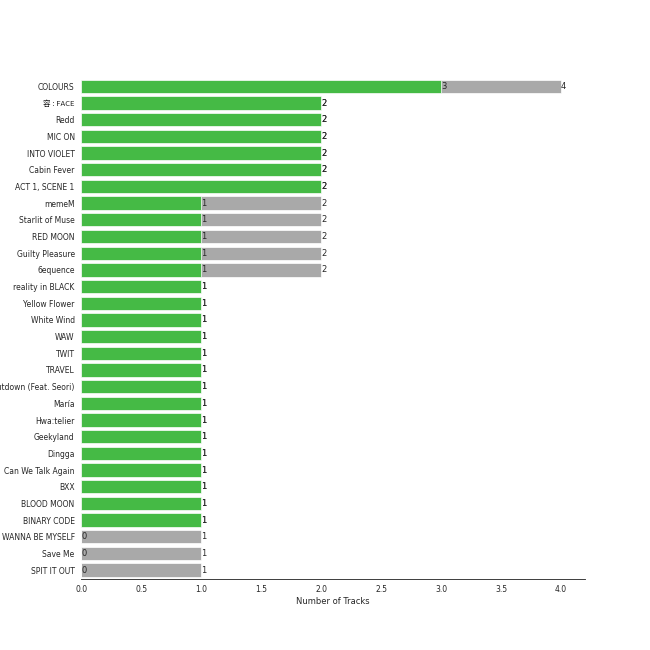
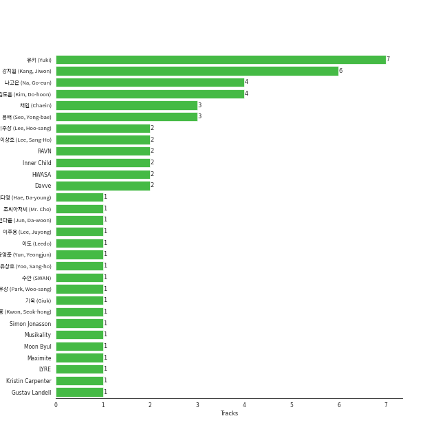

# RBW Inc.

36 songs

[See Track Features](audio_features.md)

[See Clusters](clusters/overview.md)

Appears as:
- RBW Inc. (23 tracks)
- RBW, Inc (9 tracks)
- RBW, Inc. (3 tracks)
- RBW, INC. (1 tracks)

## Top Artists

| Art | Tracks | 💚 | Artist | 🔗 |
|:---|---:|---:|:---|:---|
|  | 12 | 10 | [MAMAMOO](../../artists/mamamoo/overview.md) | [🔗](https://open.spotify.com/artist/0XATRDCYuuGhk0oE7C0o5G) |
|  | 5 | 4 | [HWASA](../../artists/hwasa/overview.md) | [🔗](https://open.spotify.com/artist/7bmYpVgQub656uNTu6qGNQ) |
|  | 5 | 3 | PURPLE KISS | [🔗](https://open.spotify.com/artist/62T5PGHWJ9sxP2SJq20IHq) |
|  | 3 | 3 | MAMAMOO+ | [🔗](https://open.spotify.com/artist/2uGx10VkBrI3GBvnQl81du) |
|  | 4 | 2 | Moon Byul | [🔗](https://open.spotify.com/artist/1eTft3tXynrKdo6XD7QHLL) |
|  | 3 | 2 | Solar | [🔗](https://open.spotify.com/artist/5cYcI546S8Lf97m4mNdYLD) |
|  | 2 | 2 | ONEUS | [🔗](https://open.spotify.com/artist/3CVYSpM7nfHFG5qCTW7Ht9) |
|  | 2 | 2 | Whee In | [🔗](https://open.spotify.com/artist/0BqRGrwqndrtNkojXiqIzL) |
|  | 1 | 1 | WOOGIE | [🔗](https://open.spotify.com/artist/7C0lSOS41UnTbnF7bMSEWN) |
|  | 1 | 1 | Seori | [🔗](https://open.spotify.com/artist/2bWTIIQP9zaVc55RaMGu7e) |

See all 11 artists

| Art | Tracks | 💚 | Artist | 🔗 |
|:---|---:|---:|:---|:---|
|  | 1 | 0 | [SEULGI](../../artists/seulgi/overview.md) | [🔗](https://open.spotify.com/artist/2QM5S4yO6xHgnNvF0nbZZq) |

## Top Albums

| Art | Tracks | 💚 | Album | Release Date | 🔗 |
|:---|---:|---:|:---|:---|:---|
|  | 2 | 2 | 容 : FACE | 2022-03-16 | [🔗](https://open.spotify.com/album/6eSFX12WIqUtmGsD8UO3FT) |
|  | 2 | 2 | Redd | 2021-04-13 | [🔗](https://open.spotify.com/album/32pXXle0zoKIFG03iefH2c) |
|  | 2 | 2 | RED MOON | 2018-07-16 | [🔗](https://open.spotify.com/album/6GhELYbXRo1LOqRPOCsQrF) |
|  | 2 | 2 | MIC ON | 2022-10-11 | [🔗](https://open.spotify.com/album/6TOnqVuglIk6Db2TdUwTcZ) |
|  | 2 | 2 | ACT 1, SCENE 1 | 2023-03-29 | [🔗](https://open.spotify.com/album/3DZzeqdwhn9Q5ScxdaJbkH) |
|  | 2 | 1 | memeM | 2022-03-29 | [🔗](https://open.spotify.com/album/4nhtnBY8owIQnOsnGQGqW9) |
|  | 2 | 1 | Guilty Pleasure | 2021-11-24 | [🔗](https://open.spotify.com/album/7jke1vYOze3jdyTiWhtFnz) |
|  | 2 | 1 | 6equence | 2022-01-19 | [🔗](https://open.spotify.com/album/0SXzCRUFSNGBG1S1lqvzb1) |
|  | 1 | 1 | reality in BLACK | 2019-11-14 | [🔗](https://open.spotify.com/album/7CucpzwxAZ6kHmctI9eo4X) |
|  | 1 | 1 | Yellow Flower | 2018-03-07 | [🔗](https://open.spotify.com/album/4G9qMxS9c4W5PPNdPrTaLn) |

See all 28 albums

| Art | Tracks | 💚 | Album | Release Date | 🔗 |
|:---|---:|---:|:---|:---|:---|
|  | 1 | 1 | White Wind | 2019-03-14 | [🔗](https://open.spotify.com/album/60m09rutmwj5ewOJoFIAVY) |
|  | 1 | 1 | WAW | 2021-06-02 | [🔗](https://open.spotify.com/album/0gt7dy4ONFo6uc8D5w2WNi) |
|  | 1 | 1 | TWIT | 2019-02-13 | [🔗](https://open.spotify.com/album/6KL4s0Y6Ijcj0QP1Nm1EVF) |
|  | 1 | 1 | TRAVEL | 2020-11-03 | [🔗](https://open.spotify.com/album/3xje7wSW2xwQx2GNJ5cfNu) |
|  | 1 | 1 | Shutdown (Feat. Seori) | 2021-12-30 | [🔗](https://open.spotify.com/album/3qGgRGX3KHbwph4AzWVko1) |
|  | 1 | 1 | Save Me | 2023-07-18 | [🔗](https://open.spotify.com/album/2bXXaGKeEvYUghrCaNWCTF) |
|  | 1 | 1 | María | 2020-06-29 | [🔗](https://open.spotify.com/album/5YYY7QCkq3pSw4Hoc1m0D3) |
|  | 1 | 1 | Hwa:telier | 2019-10-11 | [🔗](https://open.spotify.com/album/20xEJwUlmfoSLoK5AhEucL) |
|  | 1 | 1 | Geekyland | 2022-07-25 | [🔗](https://open.spotify.com/album/7EDCoH5wfSGYdZ7wXCmTF4) |
|  | 1 | 1 | Dingga | 2020-10-20 | [🔗](https://open.spotify.com/album/4xzsBcZaK04c8IE5iVyMNK) |
|  | 1 | 1 | Cabin Fever | 2023-02-15 | [🔗](https://open.spotify.com/album/4uIqXyViDoMKFuuw12kYMO) |
|  | 1 | 1 | BLOOD MOON | 2021-11-09 | [🔗](https://open.spotify.com/album/13dNmnWQVodErqAhuOzYTD) |
|  | 1 | 1 | BINARY CODE | 2021-05-11 | [🔗](https://open.spotify.com/album/3MSvgJYx3omhNpSaQUqnu5) |
|  | 1 | 0 | WANNA BE MYSELF | 2020-09-10 | [🔗](https://open.spotify.com/album/0n62copUsWrST9M6AsYfZI) |
|  | 1 | 0 | SPIT IT OUT | 2020-04-23 | [🔗](https://open.spotify.com/album/1pLSlOXtHKPoSoB6ovnIAK) |
|  | 1 | 0 | SELFISH | 2018-05-23 | [🔗](https://open.spotify.com/album/0HtGtnnnFeWmtvgNFg0dr1) |
|  | 1 | 0 | HIDE & SEEK | 2021-09-08 | [🔗](https://open.spotify.com/album/1Oh6STLhW6dxRAkvOUBHl8) |
|  | 1 | 0 | BLUE;S | 2018-11-29 | [🔗](https://open.spotify.com/album/59QELOU685J1AMB2paryAx) |

## Genres

| Tracks | 💚 | Genre |
|---:|---:|:---|
| 33 | 25 | [k-pop](../../genres/k_pop/overview.md) |
| 15 | 13 | [k-pop girl group](../../genres/k_pop_girl_group/overview.md) |
| 5 | 4 | korean talent show |
| 2 | 2 | korean ost |
| 2 | 2 | [k-pop boy group](../../genres/k_pop_boy_group/overview.md) |

## Top Producers

| Art | Producer | Tracks | Credit Types |
|:---|:---|---:|:---|
| | 유키 (Yuki) | 3 | Lyricist |
| | 강지원 (Kang, Jiwon) | 3 | Producer, Lyricist, Songwriter, Arranger |
| | 나고은 (Na, Go-eun) | 2 | Lyricist |
| | 김도훈 (Kim, Do-hoon) | 2 | Lyricist, Songwriter |
|  | [HWASA](../../artists/hwasa/overview.md) | 2 | Lyricist, Songwriter |
| | 박우상 (Park, Woo-sang) | 1 | Arranger, Lyricist, Producer |
| | Gustav Landell | 1 | Arranger, Lyricist, Songwriter |
| | LYRE | 1 | Arranger |
| | 전다운 (Jun, Da-woon) | 1 | Arranger, Songwriter |
| | Annalise Morelli | 1 | Songwriter |

View all

| Art | Producer | Tracks | Credit Types |
|:---|:---|---:|:---|
| | 기욱 (Giuk) | 1 | Lyricist, Songwriter |
|  | Moon Byul | 1 | Lyricist, Songwriter |
| | 해다영 (Hae, Da-young) | 1 | Lyricist |
| | 용배 (Seo, Yong-bae) | 1 | Lyricist, Songwriter |
| | Alina Smith | 1 | Arranger, Producer, Songwriter |
| | 이후상 (Lee, Hoo-sang) | 1 | Arranger, Lyricist, Songwriter |
| | Musikality | 1 | Arranger, Lyricist, Songwriter |
| | Simon Jonasson | 1 | Arranger, Lyricist, Songwriter |
| | Dr.JO | 1 | Lyricist |
| | Kristin Carpenter | 1 | Arranger, Lyricist, Songwriter |
| | 조씨아저씨 (Mr. Cho) | 1 | Producer |

## Tracks released under RBW Inc.

| Art | Track | Album | Artists | Label | 💚 | 🔗 |
|:---|:---|:---|:---|:---|:---|:---|
|  | TWIT | TWIT | [HWASA](../../artists/hwasa/overview.md) | [RBW, Inc](.) | 💚 | [🔗](https://open.spotify.com/track/6qyz1KOlGJsKYJ4ZsRmRSD) |
|  | In The Fall | Hwa:telier | [HWASA](../../artists/hwasa/overview.md), WOOGIE | [RBW, Inc](.) | 💚 | [🔗](https://open.spotify.com/track/2esmbUCwduwG8SyN4RAwmM) |
|  | Maria | María | [HWASA](../../artists/hwasa/overview.md) | [RBW, Inc](.) | 💚 | [🔗](https://open.spotify.com/track/0ZeGfEAL5Rl4pd5LZBGuEK) |
|  | FOMO | Guilty Pleasure | [HWASA](../../artists/hwasa/overview.md) | [RBW Inc.](.) | | [🔗](https://open.spotify.com/track/3f2I2bydLQ38Xr0jvUcNJn) |
|  | I`m a B | Guilty Pleasure | [HWASA](../../artists/hwasa/overview.md) | [RBW Inc.](.) | 💚 | [🔗](https://open.spotify.com/track/1AToLLvWghQgiBFef1iGuR) |
|  | Starry Night | Yellow Flower | [MAMAMOO](../../artists/mamamoo/overview.md) | [RBW, Inc.](.) | 💚 | [🔗](https://open.spotify.com/track/5MaDeMdqsPsZTxNWdEZPVH) |
|  | Egotistic | RED MOON | [MAMAMOO](../../artists/mamamoo/overview.md) | [RBW, Inc.](.) | 💚 | [🔗](https://open.spotify.com/track/5Z4aqpT39KpY8gbHoJWdou) |
|  | Rainy Season | RED MOON | [MAMAMOO](../../artists/mamamoo/overview.md) | [RBW, Inc.](.) | 💚 | [🔗](https://open.spotify.com/track/7u0ErMhA3PliMLkph2jlCM) |
|  | Wind flower | BLUE;S | [MAMAMOO](../../artists/mamamoo/overview.md) | [RBW, Inc](.) | | [🔗](https://open.spotify.com/track/2qwyjoSsSr3M7HTt611Q5O) |
|  | gogobebe | White Wind | [MAMAMOO](../../artists/mamamoo/overview.md) | [RBW, Inc](.) | 💚 | [🔗](https://open.spotify.com/track/6E7jAJN2e3znSHyPCdQqx8) |

See all tracks

| Art | Track | Album | Artists | Label | 💚 | 🔗 |
|:---|:---|:---|:---|:---|:---|:---|
|  | HIP | reality in BLACK | [MAMAMOO](../../artists/mamamoo/overview.md) | [RBW, Inc](.) | 💚 | [🔗](https://open.spotify.com/track/24nK8tW7Pt3Inh2utttuoG) |
|  | WANNA BE MYSELF | WANNA BE MYSELF | [MAMAMOO](../../artists/mamamoo/overview.md) | [RBW, Inc](.) | | [🔗](https://open.spotify.com/track/0VPBuXtEG16NtN5ZGYJ7lV) |
|  | Dingga | Dingga | [MAMAMOO](../../artists/mamamoo/overview.md) | [RBW, Inc](.) | 💚 | [🔗](https://open.spotify.com/track/0bDYceyQd1jnJO4sK47YxU) |
|  | AYA | TRAVEL | [MAMAMOO](../../artists/mamamoo/overview.md) | [RBW Inc.](.) | 💚 | [🔗](https://open.spotify.com/track/4BZXVFYCb76Q0Klojq4piV) |
|  | Where Are We Now | WAW | [MAMAMOO](../../artists/mamamoo/overview.md) | [RBW Inc.](.) | 💚 | [🔗](https://open.spotify.com/track/0cLXk75Pan3mhRlWqHiynh) |
|  | 1,2,3 Eoi! | MIC ON | [MAMAMOO](../../artists/mamamoo/overview.md) | [RBW Inc.](.) | 💚 | [🔗](https://open.spotify.com/track/1uYgNXNnBTQnboOwlYBLd1) |
|  | ILLELLA | MIC ON | [MAMAMOO](../../artists/mamamoo/overview.md) | [RBW Inc.](.) | 💚 | [🔗](https://open.spotify.com/track/0oeVHAgY8Q7Mdce5Quj2G4) |
|  | Chico malo | ACT 1, SCENE 1 | MAMAMOO+ | [RBW Inc.](.) | 💚 | [🔗](https://open.spotify.com/track/4e5OwyRhNsoLqGQYzfuV5B) |
|  | GGBB | ACT 1, SCENE 1 | MAMAMOO+ | [RBW Inc.](.) | 💚 | [🔗](https://open.spotify.com/track/04qiPs2ScJrI7hgQ8mz4im) |
|  | Save Me | Save Me | MAMAMOO+ | [RBW Inc.](.) | 💚 | [🔗](https://open.spotify.com/track/253vMOP9LPVdYNgOqwAhAi) |
|  | SELFISH (Feat. SEULGI Of Red Velvet) | SELFISH | Moon Byul, [SEULGI](../../artists/seulgi/overview.md) | [RBW, Inc](.) | | [🔗](https://open.spotify.com/track/4Lgd631IfDKMLPu6t7L0Tj) |
|  | Shutdown (Feat.Seori) | Shutdown (Feat. Seori) | Moon Byul, Seori | [RBW Inc.](.) | 💚 | [🔗](https://open.spotify.com/track/69790X4RDQIKwcxltIMHvU) |
|  | LUNATIC | 6equence | Moon Byul | [RBW Inc.](.) | 💚 | [🔗](https://open.spotify.com/track/3hicr5nSY0RrKGEy3nYZwU) |
|  | LUNATIC (English Ver.) | 6equence | Moon Byul | [RBW Inc.](.) | | [🔗](https://open.spotify.com/track/6iQQ9sg5NSauLU4TzKFOsY) |
|  | BLACK MIRROR | BINARY CODE | ONEUS | [RBW Inc.](.) | 💚 | [🔗](https://open.spotify.com/track/0KERuWnGiBnoFiMyJCLTcj) |
|  | LUNA | BLOOD MOON | ONEUS | [RBW Inc.](.) | 💚 | [🔗](https://open.spotify.com/track/5L2uuQUMiub01LRhTKRCFj) |
|  | Zombie | HIDE & SEEK | PURPLE KISS | [RBW Inc.](.) | | [🔗](https://open.spotify.com/track/5zTp64MsWOTdAWWXK7zEPK) |
|  | Pretty Psycho | memeM | PURPLE KISS | [RBW Inc.](.) | | [🔗](https://open.spotify.com/track/26YMXkyHGrOQQUl2E4upkv) |
|  | memeM | memeM | PURPLE KISS | [RBW Inc.](.) | 💚 | [🔗](https://open.spotify.com/track/0qr3qIT7OrhzT33sW1syLI) |
|  | Nerdy | Geekyland | PURPLE KISS | [RBW Inc.](.) | 💚 | [🔗](https://open.spotify.com/track/6KExHY2Eo0DphK63s2dfYi) |
|  | Sweet Juice | Cabin Fever | PURPLE KISS | [RBW Inc.](.) | 💚 | [🔗](https://open.spotify.com/track/2th6UWbfVz3hsSDzQAKqy2) |
|  | Spit it out | SPIT IT OUT | Solar | [RBW, INC.](.) | | [🔗](https://open.spotify.com/track/5F6RrFgt1yvRhNCdAEumM6) |
|  | Big Booty | 容 : FACE | Solar | [RBW Inc.](.) | 💚 | [🔗](https://open.spotify.com/track/5bwzsMhJZHSHM6M6qslOgd) |
|  | HONEY | 容 : FACE | Solar | [RBW Inc.](.) | 💚 | [🔗](https://open.spotify.com/track/7JDiC68AKimlvMCmZQuA9n) |
|  | OHOO | Redd | Whee In | [RBW Inc.](.) | 💚 | [🔗](https://open.spotify.com/track/7JpfkNqua1LtjGM8B8rNE9) |
|  | water color | Redd | Whee In | [RBW Inc.](.) | 💚 | [🔗](https://open.spotify.com/track/2pNJ0TsgiRc4mGdYHazD5w) |

