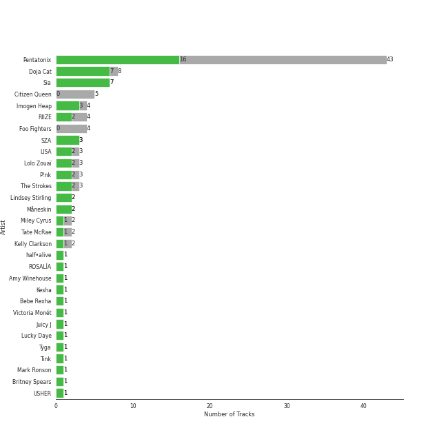

# RCA Records Label

77 songs

Appears as:
- RCA Records Label (56 tracks)
- Monkey Puzzle Records/RCA Records (8 tracks)
- Citizen Queen/RCA Records (5 tracks)
- Kemosabe Records/RCA Records (4 tracks)
- BPG/RVG/RCA Records (1 tracks)
- Chris Brown Entertainment/300 Entertainment/RCA Records (1 tracks)
- RCA/Legacy (1 tracks)
- half·alive/RCA Records (1 tracks)

## Top Artists

See all 31 artists

|   Number of Tracks | Art                                                                                              | Artist                                 | 🔗                                                           |
|-------------------:|:-------------------------------------------------------------------------------------------------|:---------------------------------------|:------------------------------------------------------------|
|                 36 |  | [Pentatonix](../artists/pentatonix.md) | [🔗](https://open.spotify.com/artist/26AHtbjWKiwYzsoGoUZq53) |
|                  8 |  | Sia                                    | [🔗](https://open.spotify.com/artist/5WUlDfRSoLAfcVSX1WnrxN) |
|                  5 |  | Citizen Queen                          | [🔗](https://open.spotify.com/artist/2z7BqfKvVlkr8KVAOTBKcz) |
|                  4 |  | Imogen Heap                            | [🔗](https://open.spotify.com/artist/6Xb4ezwoAQC4516kI89nWz) |
|                  4 |  | Doja Cat                               | [🔗](https://open.spotify.com/artist/5cj0lLjcoR7YOSnhnX0Po5) |
|                  3 |  | P!nk                                   | [🔗](https://open.spotify.com/artist/1KCSPY1glIKqW2TotWuXOR) |
|                  2 |  | Miley Cyrus                            | [🔗](https://open.spotify.com/artist/5YGY8feqx7naU7z4HrwZM6) |
|                  2 |  | Kelly Clarkson                         | [🔗](https://open.spotify.com/artist/3BmGtnKgCSGYIUhmivXKWX) |
|                  2 |  | Lindsey Stirling                       | [🔗](https://open.spotify.com/artist/378dH6EszOLFShpRzAQkVM) |
|                  1 |  | SZA                                    | [🔗](https://open.spotify.com/artist/7tYKF4w9nC0nq9CsPZTHyP) |
|                  1 |  | half•alive                             | [🔗](https://open.spotify.com/artist/7sOR7gk6XUlGnxj3p9F54k) |
|                  1 |  | Chris Brown                            | [🔗](https://open.spotify.com/artist/7bXgB6jMjp9ATFy66eO08Z) |
|                  1 |  | Amy Winehouse                          | [🔗](https://open.spotify.com/artist/6Q192DXotxtaysaqNPy5yR) |
|                  1 |  | Kesha                                  | [🔗](https://open.spotify.com/artist/6LqNN22kT3074XbTVUrhzX) |
|                  1 |  | Bebe Rexha                             | [🔗](https://open.spotify.com/artist/64M6ah0SkkRsnPGtGiRAbb) |
|                  1 |  | Backstreet Boys                        | [🔗](https://open.spotify.com/artist/5rSXSAkZ67PYJSvpUpkOr7) |
|                  1 |  | Juicy J                                | [🔗](https://open.spotify.com/artist/5gCRApTajqwbnHHPbr2Fpi) |
|                  1 |  | Young Thug                             | [🔗](https://open.spotify.com/artist/50co4Is1HCEo8bhOyUWKpn) |
|                  1 |  | Tink                                   | [🔗](https://open.spotify.com/artist/4v6XOdonnfpdTKTRJArG7v) |
|                  1 |  | Elvis Presley                          | [🔗](https://open.spotify.com/artist/43ZHCT0cAZBISjO8DG9PnE) |
|                  1 |  | Mark Ronson                            | [🔗](https://open.spotify.com/artist/3hv9jJF3adDNsBSIQDqcjp) |
|                  1 |  | Sean Paul                              | [🔗](https://open.spotify.com/artist/3Isy6kedDrgPYoTS1dazA9) |
|                  1 |  | Tove Styrke                            | [🔗](https://open.spotify.com/artist/2QSPrJfYeRXaltEEiriXN9) |
|                  1 |  | Britney Spears                         | [🔗](https://open.spotify.com/artist/26dSoYclwsYLMAKD3tpOr4) |
|                  1 |  | Usher                                  | [🔗](https://open.spotify.com/artist/23zg3TcAtWQy7J6upgbUnj) |
|                  1 |  | Nate Ruess                             | [🔗](https://open.spotify.com/artist/1qUjOF5fzrpoNycD36b2jZ) |
|                  1 |  | Christina Aguilera                     | [🔗](https://open.spotify.com/artist/1l7ZsJRRS8wlW3WfJfPfNS) |
|                  1 |  | The Tokens                             | [🔗](https://open.spotify.com/artist/1GAJzApRTMmYZ9EjQ91VOy) |
|                  1 |  | Måneskin                               | [🔗](https://open.spotify.com/artist/0lAWpj5szCSwM4rUMHYmrr) |
|                  1 |  | Jason Derulo                           | [🔗](https://open.spotify.com/artist/07YZf4WDAMNwqr4jfgOZ8y) |
|                  1 |  | G-Eazy                                 | [🔗](https://open.spotify.com/artist/02kJSzxNuaWGqwubyUba0Z) |

## Top Albums

See all 42 albums

|   Number of Tracks | Art                                                                                              | Album                                               | 🔗                                                          |
|-------------------:|:-------------------------------------------------------------------------------------------------|:----------------------------------------------------|:-----------------------------------------------------------|
|                  7 |  | PTX, Vol. 2                                         | [🔗](https://open.spotify.com/album/12dPqNFIdjiVFSHvtsDmzJ) |
|                  6 |  | PTX, Vol. III                                       | [🔗](https://open.spotify.com/album/32y54TelUHSUDWVOx4h1B4) |
|                  6 |  | PTX, Vol. 1                                         | [🔗](https://open.spotify.com/album/5wGlP6EqF7akh6N3UGfKVZ) |
|                  4 |  | This Is Acting (Deluxe Version)                     | [🔗](https://open.spotify.com/album/2eV6DIPDnGl1idcjww6xyX) |
|                  4 |  | Pentatonix (Deluxe Version)                         | [🔗](https://open.spotify.com/album/6qf9tE8pNRW0kX1Cucrixr) |
|                  4 |  | Ellipse                                             | [🔗](https://open.spotify.com/album/5AYKGPzPBJNHeKehCxMaq0) |
|                  4 |  | 1000 Forms Of Fear (Deluxe Version)                 | [🔗](https://open.spotify.com/album/6FdNvoO5sF4EKwCX9je1MH) |
|                  3 |  | PTX Vol. IV - Classics                              | [🔗](https://open.spotify.com/album/00JpoY0ZaQRXTNJUruibfX) |
|                  3 |  | PTX Presents: Top Pop, Vol. I                       | [🔗](https://open.spotify.com/album/2viOlnLfhPLDgx7hvBqLwW) |
|                  2 |  | That's Christmas To Me (Deluxe Edition)             | [🔗](https://open.spotify.com/album/082VlX7cBth0o8xqDGclNn) |
|                  2 |  | Planet Her                                          | [🔗](https://open.spotify.com/album/1nAQbHeOWTfQzbOoFrvndW) |
|                  2 |  | PTX                                                 | [🔗](https://open.spotify.com/album/77RBn8pRsfXlZdfTQh221D) |
|                  1 |  | bad guy                                             | [🔗](https://open.spotify.com/album/1phloQZ7zGTlsfQVUBiTbK) |
|                  1 |  | Wimoweh!!! - The Best Of The Tokens                 | [🔗](https://open.spotify.com/album/6NBox81OQox7U4I0hZB9t0) |
|                  1 |  | When It's Dark Out                                  | [🔗](https://open.spotify.com/album/09Q3WwGYsQe5ognkvVkmCu) |
|                  1 |  | Version                                             | [🔗](https://open.spotify.com/album/74ooEOK4jY2ZCWjMK6pYmk) |
|                  1 |  | This Is The End: Original Motion Picture Soundtrack | [🔗](https://open.spotify.com/album/1SFKmqhTTEkE3PmSBEMpa3) |
|                  1 |  | The Truth About Love                                | [🔗](https://open.spotify.com/album/0pqKb2y8h2BWS46HMfmEgD) |
|                  1 |  | The Sound of Silence                                | [🔗](https://open.spotify.com/album/2d5CHsmyOYGqfjDaPrdEzc) |
|                  1 |  | Sway                                                | [🔗](https://open.spotify.com/album/3fSRbKgYW6kcR1ZFMaaNV4) |
|                  1 |  | Slime & B                                           | [🔗](https://open.spotify.com/album/7fZKtzZAsfH0kzeTivu5TG) |
|                  1 |  | Slide Away                                          | [🔗](https://open.spotify.com/album/0SHGFAL8WZUvpWb5iLPp6E) |
|                  1 |  | Señorita                                            | [🔗](https://open.spotify.com/album/40wlfdkpATRjUMtrlt6BFb) |
|                  1 |  | Now, Not Yet                                        | [🔗](https://open.spotify.com/album/2KSWrd22LGc0Hmqs2Z5i7z) |
|                  1 |  | No Tears Left to Cry                                | [🔗](https://open.spotify.com/album/2f47uqbseyM4AGSCiIQaw2) |
|                  1 |  | Never Enough                                        | [🔗](https://open.spotify.com/album/0c9cgQqbVL9QVvwbA6faAB) |
|                  1 |  | Lost in Japan                                       | [🔗](https://open.spotify.com/album/1Zs8K8co0WkLKaQ4NxduR5) |
|                  1 |  | Kiss Me More (feat. SZA)                            | [🔗](https://open.spotify.com/album/1OnzqJTL9bwe4kvaLxRYxt) |
|                  1 |  | I Don't Mind (feat. Juicy J)                        | [🔗](https://open.spotify.com/album/5BAqg5IJQ7XFKfdoCiOlJw) |
|                  1 |  | Hurts 2B Human                                      | [🔗](https://open.spotify.com/album/6JKkXVEljQJ1wKbRG5MywC) |
|                  1 |  | Hot Pink                                            | [🔗](https://open.spotify.com/album/1MmVkhiwTH0BkNOU3nw5d3) |
|                  1 |  | Christmas Is Here!                                  | [🔗](https://open.spotify.com/album/6thZNGX8hUVSjUrqJgPB9b) |
|                  1 |  | Chosen                                              | [🔗](https://open.spotify.com/album/2qJw6w5XwQO0PQlSWPu7Tw) |
|                  1 |  | Britney Jean (Deluxe Version)                       | [🔗](https://open.spotify.com/album/5rlB2HPoNHg2m1wmmh0TRv) |
|                  1 |  | Breakaway                                           | [🔗](https://open.spotify.com/album/5gDAEao3VxFdbm8vS0koQq) |
|                  1 |  | Blue Hawaii                                         | [🔗](https://open.spotify.com/album/7xe8VI48TxUpU1IIo0RfGi) |
|                  1 |  | Beautiful Trauma                                    | [🔗](https://open.spotify.com/album/7hwhuEQT4Fp5bzwLlYZtiz) |
|                  1 |  | Bangerz (Deluxe Version)                            | [🔗](https://open.spotify.com/album/3RDqXDc1bAETps54MSSOW0) |
|                  1 |  | Back To Basics                                      | [🔗](https://open.spotify.com/album/0zRJsgzHZUUdk8Rjk6Segd) |
|                  1 |  | Animal (Expanded Edition)                           | [🔗](https://open.spotify.com/album/6fpLLJsDSSAlToEDW2jv4F) |
|                  1 |  | All I Ever Wanted                                   | [🔗](https://open.spotify.com/album/4h8seeFAi6iYhslcWIxTSG) |
|                  1 |  | A Pentatonix Christmas Deluxe                       | [🔗](https://open.spotify.com/album/3sId8sOH47yqOWopzbEtJn) |

## Genres

See all 34 genres

|   Number of Tracks | Genre                                       |
|-------------------:|:--------------------------------------------|
|                 36 | [a cappella](../genres/a_cappella.md)       |
|                 27 | [dance pop](../genres/dance_pop.md)         |
|                 26 | [pop](../genres/pop.md)                     |
|                 12 | [post-teen pop](../genres/post_teen_pop.md) |
|                  8 | australian pop                              |
|                  8 | australian dance                            |
|                  4 | metropopolis                                |
|                  4 | etherpop                                    |
|                  2 | talent show                                 |
|                  2 | [r&b](../genres/r_b.md)                     |
|                  1 | urban contemporary                          |
|                  1 | swedish synthpop                            |
|                  1 | swedish pop                                 |
|                  1 | swedish electropop                          |
|                  1 | sunshine pop                                |
|                  1 | south carolina hip hop                      |
|                  1 | rockabilly                                  |
|                  1 | rock-and-roll                               |
|                  1 | rap                                         |
|                  1 | pop rap                                     |
|                  1 | oakland hip hop                             |
|                  1 | modern rock                                 |
|                  1 | modern alternative rock                     |
|                  1 | italian pop                                 |
|                  1 | indie rock italiano                         |
|                  1 | indie pop rap                               |
|                  1 | indie pop                                   |
|                  1 | hip hop                                     |
|                  1 | [electropop](../genres/electropop.md)       |
|                  1 | doo-wop                                     |
|                  1 | contemporary r&b                            |
|                  1 | boy band                                    |
|                  1 | atl hip hop                                 |
|                  1 | alt z                                       |

## Tracks released under RCA Records Label

| Art                                                                                              | Track                                                 | Album                                               | Artists                                                  | Label                                                                           | 💚   | 🔗                                                          |
|:-------------------------------------------------------------------------------------------------|:------------------------------------------------------|:----------------------------------------------------|:---------------------------------------------------------|:--------------------------------------------------------------------------------|:----|:-----------------------------------------------------------|
|  | Everybody (Backstreet's Back) - Radio Edit            | This Is The End: Original Motion Picture Soundtrack | Backstreet Boys                                          | [RCA Records Label](rca_records_label.md)                                       |     | [🔗](https://open.spotify.com/track/4rTeOSYqwXNz5qPR2DUTFZ) |
|  | Work Bitch                                            | Britney Jean (Deluxe Version)                       | Britney Spears                                           | [RCA Records Label](rca_records_label.md)                                       |     | [🔗](https://open.spotify.com/track/3KliPMvk1EvFZu9cvkj8p1) |
|  | City Girls                                            | Slime & B                                           | Chris Brown, Young Thug                                  | [Chris Brown Entertainment/300 Entertainment/RCA Records](300_entertainment.md) |     | [🔗](https://open.spotify.com/track/1rJUbH0v2E8t1GY4OAUTeC) |
|  | Candyman                                              | Back To Basics                                      | Christina Aguilera                                       | [RCA Records Label](rca_records_label.md)                                       | 💚   | [🔗](https://open.spotify.com/track/5lUTzPuiloBHm1qEaJcJfF) |
|  | No Tears Left to Cry                                  | No Tears Left to Cry                                | Citizen Queen                                            | [Citizen Queen/RCA Records](citizen_queen.md)                                   |     | [🔗](https://open.spotify.com/track/6SgkZROgo3xuatvg1zU8AZ) |
|  | Lost in Japan                                         | Lost in Japan                                       | Citizen Queen                                            | [Citizen Queen/RCA Records](citizen_queen.md)                                   |     | [🔗](https://open.spotify.com/track/14ruMnm89Giao1vbFs7Bux) |
|  | Never Enough                                          | Never Enough                                        | Citizen Queen                                            | [Citizen Queen/RCA Records](citizen_queen.md)                                   |     | [🔗](https://open.spotify.com/track/3NzxjhxtUmmicwbWquPoXt) |
|  | Señorita                                              | Señorita                                            | Citizen Queen                                            | [Citizen Queen/RCA Records](citizen_queen.md)                                   |     | [🔗](https://open.spotify.com/track/3QglLwEow7OT5BUaZUNS4W) |
|  | bad guy                                               | bad guy                                             | Citizen Queen                                            | [Citizen Queen/RCA Records](citizen_queen.md)                                   |     | [🔗](https://open.spotify.com/track/2trPKQthDkOiLFCNy5fkIO) |
|  | Say So                                                | Hot Pink                                            | Doja Cat                                                 | [Kemosabe Records/RCA Records](rca_records_label.md)                            | 💚   | [🔗](https://open.spotify.com/track/3Dv1eDb0MEgF93GpLXlucZ) |
|  | Kiss Me More (feat. SZA)                              | Kiss Me More (feat. SZA)                            | Doja Cat, SZA                                            | [Kemosabe Records/RCA Records](rca_records_label.md)                            | 💚   | [🔗](https://open.spotify.com/track/748mdHapucXQri7IAO8yFK) |
|  | Need to Know                                          | Planet Her                                          | Doja Cat                                                 | [Kemosabe Records/RCA Records](rca_records_label.md)                            | 💚   | [🔗](https://open.spotify.com/track/3Vi5XqYrmQgOYBajMWSvCi) |
|  | Woman                                                 | Planet Her                                          | Doja Cat                                                 | [Kemosabe Records/RCA Records](rca_records_label.md)                            |     | [🔗](https://open.spotify.com/track/6Uj1ctrBOjOas8xZXGqKk4) |
|  | Can't Help Falling in Love                            | Blue Hawaii                                         | Elvis Presley                                            | [RCA Records Label](rca_records_label.md), [Legacy](legacy.md)                  |     | [🔗](https://open.spotify.com/track/44AyOl4qVkzS48vBsbNXaC) |
|  | Me, Myself & I                                        | When It's Dark Out                                  | G-Eazy, Bebe Rexha                                       | [BPG/RVG/RCA Records](rvg.md)                                                   |     | [🔗](https://open.spotify.com/track/40YcuQysJ0KlGQTeGUosTC) |
|  | still feel.                                           | Now, Not Yet                                        | half•alive                                               | [half·alive/RCA Records](rca_records_label.md)                                  | 💚   | [🔗](https://open.spotify.com/track/48XkVAagIoQHCsOlJtXUd5) |
|  | Aha!                                                  | Ellipse                                             | Imogen Heap                                              | [RCA Records Label](rca_records_label.md)                                       | 💚   | [🔗](https://open.spotify.com/track/42itRd5WoYb42RSYOloJvD) |
|  | Earth                                                 | Ellipse                                             | Imogen Heap                                              | [RCA Records Label](rca_records_label.md)                                       | 💚   | [🔗](https://open.spotify.com/track/4zXgNwVhtfDrPLjKs52msC) |
|  | First Train Home                                      | Ellipse                                             | Imogen Heap                                              | [RCA Records Label](rca_records_label.md)                                       |     | [🔗](https://open.spotify.com/track/504gJcwsW5n0s3Zj5uAedr) |
|  | Wait It Out                                           | Ellipse                                             | Imogen Heap                                              | [RCA Records Label](rca_records_label.md)                                       | 💚   | [🔗](https://open.spotify.com/track/4xszw2YraekWIpj0SZ6Lp6) |
|  | Because of You                                        | Breakaway                                           | Kelly Clarkson                                           | [RCA Records Label](rca_records_label.md)                                       | 💚   | [🔗](https://open.spotify.com/track/3f3omU8n47Mqyab5nCaGyT) |
|  | Already Gone                                          | All I Ever Wanted                                   | Kelly Clarkson                                           | [RCA Records Label](rca_records_label.md)                                       |     | [🔗](https://open.spotify.com/track/4fq2YUONcgrCJ2SPndSeKC) |
|  | TiK ToK                                               | Animal (Expanded Edition)                           | Kesha                                                    | [RCA Records Label](rca_records_label.md)                                       | 💚   | [🔗](https://open.spotify.com/track/0HPD5WQqrq7wPWR7P7Dw1i) |
|  | Valerie (feat. Amy Winehouse) - Version Revisited     | Version                                             | Mark Ronson, Amy Winehouse                               | [RCA Records Label](rca_records_label.md)                                       | 💚   | [🔗](https://open.spotify.com/track/631U6DaszJisq3TiaQ0vTM) |
|  | Wrecking Ball                                         | Bangerz (Deluxe Version)                            | Miley Cyrus                                              | [RCA Records Label](rca_records_label.md)                                       | 💚   | [🔗](https://open.spotify.com/track/2vwlzO0Qp8kfEtzTsCXfyE) |
|  | Slide Away                                            | Slide Away                                          | Miley Cyrus                                              | [RCA Records Label](rca_records_label.md)                                       |     | [🔗](https://open.spotify.com/track/44ADyYoY5liaRa3EOAl4uf) |
|  | Beggin'                                               | Chosen                                              | Måneskin                                                 | [RCA Records Label](rca_records_label.md)                                       | 💚   | [🔗](https://open.spotify.com/track/3Wrjm47oTz2sjIgck11l5e) |
|  | Just Give Me a Reason (feat. Nate Ruess)              | The Truth About Love                                | P!nk, Nate Ruess                                         | [RCA Records Label](rca_records_label.md)                                       | 💚   | [🔗](https://open.spotify.com/track/4VC5nFbYO4avKksJ9jN4pY) |
|  | What About Us                                         | Beautiful Trauma                                    | P!nk                                                     | [RCA Records Label](rca_records_label.md)                                       |     | [🔗](https://open.spotify.com/track/0Qh38w01QRXK6KHIv0e3hb) |
|  | Hustle                                                | Hurts 2B Human                                      | P!nk                                                     | [RCA Records Label](rca_records_label.md)                                       | 💚   | [🔗](https://open.spotify.com/track/6BVmygBQhe4pTZQgKkzstD) |
|  | Aha!                                                  | PTX, Vol. 1                                         | [Pentatonix](../artists/pentatonix.md)                   | [RCA Records Label](rca_records_label.md)                                       | 💚   | [🔗](https://open.spotify.com/track/5AspukpHyZuTciR17YPSrS) |
|  | Show You How to Love                                  | PTX, Vol. 1                                         | [Pentatonix](../artists/pentatonix.md)                   | [RCA Records Label](rca_records_label.md)                                       |     | [🔗](https://open.spotify.com/track/0jExzGwfnZ1vTuCVB7w3vM) |
|  | Somebody That I Used to Know                          | PTX, Vol. 1                                         | [Pentatonix](../artists/pentatonix.md)                   | [RCA Records Label](rca_records_label.md)                                       |     | [🔗](https://open.spotify.com/track/5XPSElbh3y0S1Jl0ggpwQr) |
|  | Starships                                             | PTX, Vol. 1                                         | [Pentatonix](../artists/pentatonix.md)                   | [RCA Records Label](rca_records_label.md)                                       |     | [🔗](https://open.spotify.com/track/28KAxjOTAnnGjGpC2Qx8gn) |
|  | The Baddest Girl                                      | PTX, Vol. 1                                         | [Pentatonix](../artists/pentatonix.md)                   | [RCA Records Label](rca_records_label.md)                                       | 💚   | [🔗](https://open.spotify.com/track/3tKAuyZm1eLdmkZekqezic) |
|  | We Are Young                                          | PTX, Vol. 1                                         | [Pentatonix](../artists/pentatonix.md)                   | [RCA Records Label](rca_records_label.md)                                       | 💚   | [🔗](https://open.spotify.com/track/5mMoySkxdUWlTw6X2l4egi) |
|  | Daft Punk                                             | PTX, Vol. 2                                         | [Pentatonix](../artists/pentatonix.md)                   | [RCA Records Label](rca_records_label.md)                                       | 💚   | [🔗](https://open.spotify.com/track/6ukvsBzq4d1vBsAUmz7ZVt) |
|  | Hey Momma / Hit the Road Jack                         | PTX, Vol. 2                                         | [Pentatonix](../artists/pentatonix.md)                   | [RCA Records Label](rca_records_label.md)                                       |     | [🔗](https://open.spotify.com/track/2wUZek0zWyw5mGKoT8mRcG) |
|  | I Need Your Love                                      | PTX, Vol. 2                                         | [Pentatonix](../artists/pentatonix.md)                   | [RCA Records Label](rca_records_label.md)                                       |     | [🔗](https://open.spotify.com/track/11tQS3cthRT6guY7WkTypx) |
|  | Love Again                                            | PTX, Vol. 2                                         | [Pentatonix](../artists/pentatonix.md)                   | [RCA Records Label](rca_records_label.md)                                       |     | [🔗](https://open.spotify.com/track/0vcyzDe6aoYTg6jM0U0T9r) |
|  | Natural Disaster                                      | PTX, Vol. 2                                         | [Pentatonix](../artists/pentatonix.md)                   | [RCA Records Label](rca_records_label.md)                                       |     | [🔗](https://open.spotify.com/track/04nemEju86ULMJ1iy6EAsF) |
|  | Run to You                                            | PTX, Vol. 2                                         | [Pentatonix](../artists/pentatonix.md)                   | [RCA Records Label](rca_records_label.md)                                       | 💚   | [🔗](https://open.spotify.com/track/1bukNCD9JEwNp235Ov0iZH) |
|  | Valentine                                             | PTX, Vol. 2                                         | [Pentatonix](../artists/pentatonix.md)                   | [RCA Records Label](rca_records_label.md)                                       | 💚   | [🔗](https://open.spotify.com/track/5djjmpqAOlne6d5RSHQmvu) |
|  | Radioactive                                           | PTX                                                 | [Pentatonix](../artists/pentatonix.md), Lindsey Stirling | [RCA Records Label](rca_records_label.md)                                       | 💚   | [🔗](https://open.spotify.com/track/7dJGehjbhJvs3K4fWwYTW1) |
|  | Say Something                                         | PTX                                                 | [Pentatonix](../artists/pentatonix.md)                   | [RCA Records Label](rca_records_label.md)                                       |     | [🔗](https://open.spotify.com/track/2SrJ0Iw6GobiRGyh2XKZhV) |
|  | La La Latch (Sam Smith/Disclosure/Naughty Boy Mashup) | PTX, Vol. III                                       | [Pentatonix](../artists/pentatonix.md)                   | [RCA Records Label](rca_records_label.md)                                       | 💚   | [🔗](https://open.spotify.com/track/6fOqEAXCwboCO4BdzbZG1K) |
|  | Papaoutai (Stromae Cover) (feat. Lindsey Stirling)    | PTX, Vol. III                                       | [Pentatonix](../artists/pentatonix.md), Lindsey Stirling | [RCA Records Label](rca_records_label.md)                                       | 💚   | [🔗](https://open.spotify.com/track/4LeTorR5FyWgxM3zZI7Qii) |
|  | Problem (Ariana Grande Cover)                         | PTX, Vol. III                                       | [Pentatonix](../artists/pentatonix.md)                   | [RCA Records Label](rca_records_label.md)                                       | 💚   | [🔗](https://open.spotify.com/track/45h4cCw7ccsRXb0Orle2an) |
|  | Rather Be (Clean Bandit Cover)                        | PTX, Vol. III                                       | [Pentatonix](../artists/pentatonix.md)                   | [RCA Records Label](rca_records_label.md)                                       | 💚   | [🔗](https://open.spotify.com/track/4hxemf0pE0mSzubgsfRLWu) |
|  | See Through                                           | PTX, Vol. III                                       | [Pentatonix](../artists/pentatonix.md)                   | [RCA Records Label](rca_records_label.md)                                       |     | [🔗](https://open.spotify.com/track/6UNqsxeupIqwNds2oSDYnY) |
|  | Standing By                                           | PTX, Vol. III                                       | [Pentatonix](../artists/pentatonix.md)                   | [RCA Records Label](rca_records_label.md)                                       |     | [🔗](https://open.spotify.com/track/2ZtMNYog671T0UFfp0hhWq) |
|  | Can't Sleep Love                                      | Pentatonix (Deluxe Version)                         | [Pentatonix](../artists/pentatonix.md)                   | [RCA Records Label](rca_records_label.md)                                       |     | [🔗](https://open.spotify.com/track/1klGbW5a9qTBFUjFfddbmU) |
|  | Can't Sleep Love (feat. Tink)                         | Pentatonix (Deluxe Version)                         | [Pentatonix](../artists/pentatonix.md), Tink             | [RCA Records Label](rca_records_label.md)                                       | 💚   | [🔗](https://open.spotify.com/track/1GXFYdKM6MNrogE2PacpKe) |
|  | If I Ever Fall In Love (feat. Jason Derulo)           | Pentatonix (Deluxe Version)                         | [Pentatonix](../artists/pentatonix.md), Jason Derulo     | [RCA Records Label](rca_records_label.md)                                       | 💚   | [🔗](https://open.spotify.com/track/3vaWsG3oKZt0bSra2p5c5R) |
|  | Na Na Na                                              | Pentatonix (Deluxe Version)                         | [Pentatonix](../artists/pentatonix.md)                   | [RCA Records Label](rca_records_label.md)                                       |     | [🔗](https://open.spotify.com/track/6v08G3CGcoyiODIWZoOxR4) |
|  | Dance of the Sugar Plum Fairy                         | That's Christmas To Me (Deluxe Edition)             | [Pentatonix](../artists/pentatonix.md)                   | [RCA Records Label](rca_records_label.md)                                       |     | [🔗](https://open.spotify.com/track/0u0TlASkQWH2bGIZRu0HLh) |
|  | Let It Go                                             | That's Christmas To Me (Deluxe Edition)             | [Pentatonix](../artists/pentatonix.md)                   | [RCA Records Label](rca_records_label.md)                                       |     | [🔗](https://open.spotify.com/track/2G7K3Op9y3HhqrF2TdHP95) |
|  | Can't Help Falling In Love                            | PTX Vol. IV - Classics                              | [Pentatonix](../artists/pentatonix.md)                   | [RCA Records Label](rca_records_label.md)                                       | 💚   | [🔗](https://open.spotify.com/track/1xKScU3i8ho0OIhNoC5YW9) |
|  | Imagine                                               | PTX Vol. IV - Classics                              | [Pentatonix](../artists/pentatonix.md)                   | [RCA Records Label](rca_records_label.md)                                       | 💚   | [🔗](https://open.spotify.com/track/1UaTmLT3nB1sNBfv1hkqU1) |
|  | Over The Rainbow                                      | PTX Vol. IV - Classics                              | [Pentatonix](../artists/pentatonix.md)                   | [RCA Records Label](rca_records_label.md)                                       | 💚   | [🔗](https://open.spotify.com/track/7MefjVBQqdV6XRXBlWejTQ) |
|  | Hallelujah                                            | A Pentatonix Christmas Deluxe                       | [Pentatonix](../artists/pentatonix.md)                   | [RCA Records Label](rca_records_label.md)                                       |     | [🔗](https://open.spotify.com/track/0HZk0QsXPhMNAWNDR3rYE8) |
|  | Attention                                             | PTX Presents: Top Pop, Vol. I                       | [Pentatonix](../artists/pentatonix.md)                   | [RCA Records Label](rca_records_label.md)                                       |     | [🔗](https://open.spotify.com/track/5P40YyCrdZRsoj2vTbSyVI) |
|  | Finesse                                               | PTX Presents: Top Pop, Vol. I                       | [Pentatonix](../artists/pentatonix.md)                   | [RCA Records Label](rca_records_label.md)                                       |     | [🔗](https://open.spotify.com/track/4GfCvy3t1u4lMAFldhB7EF) |
|  | Havana                                                | PTX Presents: Top Pop, Vol. I                       | [Pentatonix](../artists/pentatonix.md)                   | [RCA Records Label](rca_records_label.md)                                       | 💚   | [🔗](https://open.spotify.com/track/0wkiCJqCtI8keITfZ642jg) |
|  | Sweater Weather                                       | Christmas Is Here!                                  | [Pentatonix](../artists/pentatonix.md)                   | [RCA Records Label](rca_records_label.md)                                       |     | [🔗](https://open.spotify.com/track/50YYe94G19kWVyhzdEXxki) |
|  | The Sound of Silence                                  | The Sound of Silence                                | [Pentatonix](../artists/pentatonix.md)                   | [RCA Records Label](rca_records_label.md)                                       |     | [🔗](https://open.spotify.com/track/0ZFeVCKCMCXUQ1TKVd2azW) |
|  | Big Girls Cry                                         | 1000 Forms Of Fear (Deluxe Version)                 | Sia                                                      | [Monkey Puzzle Records/RCA Records](rca_records_label.md)                       | 💚   | [🔗](https://open.spotify.com/track/7zE6pyXLjUCOy8PG0UL5SZ) |
|  | Chandelier                                            | 1000 Forms Of Fear (Deluxe Version)                 | Sia                                                      | [Monkey Puzzle Records/RCA Records](rca_records_label.md)                       | 💚   | [🔗](https://open.spotify.com/track/2s1sdSqGcKxpPr5lCl7jAV) |
|  | Elastic Heart                                         | 1000 Forms Of Fear (Deluxe Version)                 | Sia                                                      | [Monkey Puzzle Records/RCA Records](rca_records_label.md)                       | 💚   | [🔗](https://open.spotify.com/track/5S9lfZu1YF8xKkgSsqL2Bd) |
|  | Eye of the Needle                                     | 1000 Forms Of Fear (Deluxe Version)                 | Sia                                                      | [Monkey Puzzle Records/RCA Records](rca_records_label.md)                       | 💚   | [🔗](https://open.spotify.com/track/6H8UxS43KArEIu2vGZI9Dj) |
|  | Alive                                                 | This Is Acting (Deluxe Version)                     | Sia                                                      | [Monkey Puzzle Records/RCA Records](rca_records_label.md)                       | 💚   | [🔗](https://open.spotify.com/track/25R5Tdr4K7ENb6umHzdCXn) |
|  | Bird Set Free                                         | This Is Acting (Deluxe Version)                     | Sia                                                      | [Monkey Puzzle Records/RCA Records](rca_records_label.md)                       | 💚   | [🔗](https://open.spotify.com/track/6MowG7MRVgPfGlCMsXKMJ2) |
|  | Cheap Thrills                                         | This Is Acting (Deluxe Version)                     | Sia                                                      | [Monkey Puzzle Records/RCA Records](rca_records_label.md)                       | 💚   | [🔗](https://open.spotify.com/track/3S4px9f4lceWdKf0gWciFu) |
|  | Cheap Thrills (feat. Sean Paul)                       | This Is Acting (Deluxe Version)                     | Sia, Sean Paul                                           | [Monkey Puzzle Records/RCA Records](rca_records_label.md)                       | 💚   | [🔗](https://open.spotify.com/track/2ONIJ40u0Attbm3miIIpNO) |
|  | The Lion Sleeps Tonight (Wimoweh)                     | Wimoweh!!! - The Best Of The Tokens                 | The Tokens                                               | [RCA Records Label](rca_records_label.md)                                       |     | [🔗](https://open.spotify.com/track/2F4FNcz68howQWD4zaGJSi) |
|  | Say My Name                                           | Sway                                                | Tove Styrke                                              | [RCA Records Label](rca_records_label.md)                                       | 💚   | [🔗](https://open.spotify.com/track/2XDJzMW1MUWeAIQoMOJeUj) |
|  | I Don't Mind (feat. Juicy J)                          | I Don't Mind (feat. Juicy J)                        | Usher, Juicy J                                           | [RCA Records Label](rca_records_label.md)                                       | 💚   | [🔗](https://open.spotify.com/track/7aXuop4Qambx5Oi3ynsKQr) |
