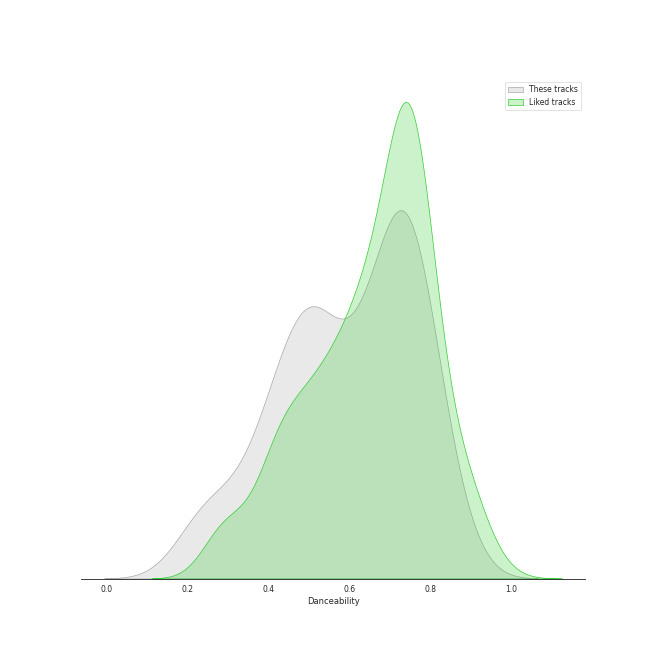
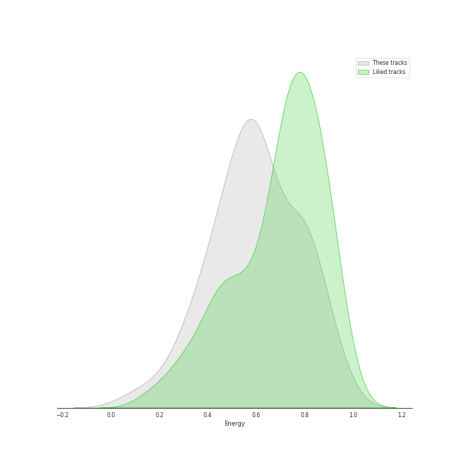
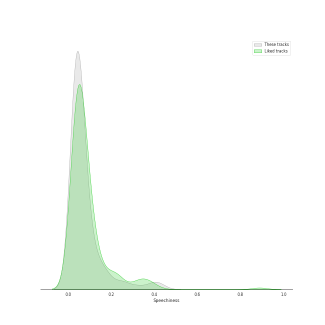
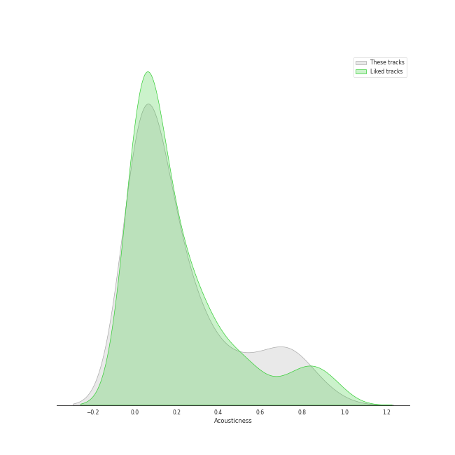
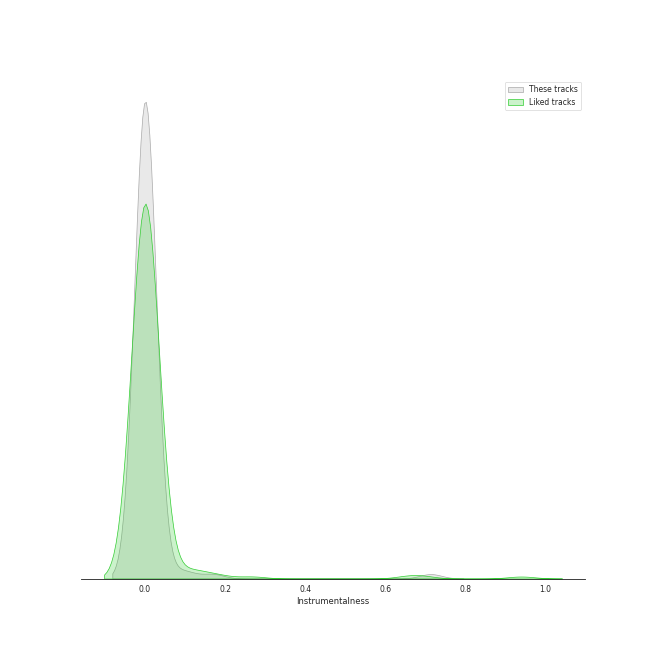
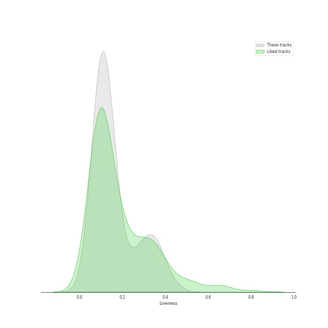
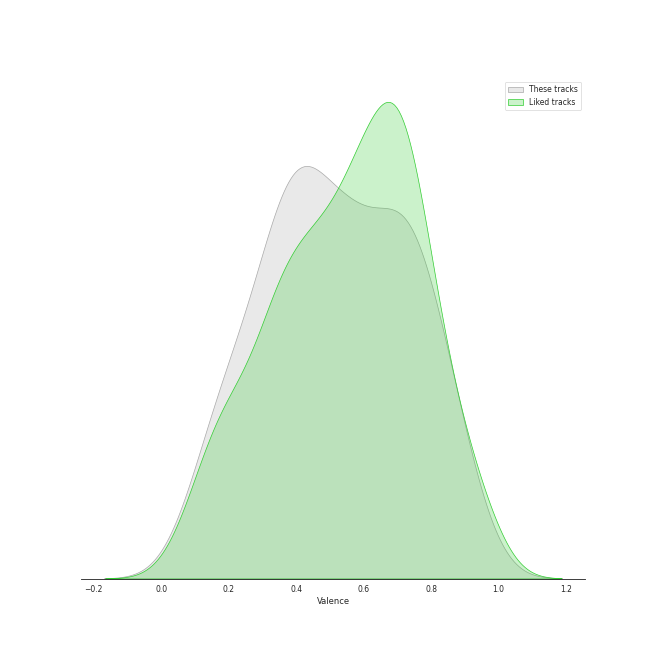
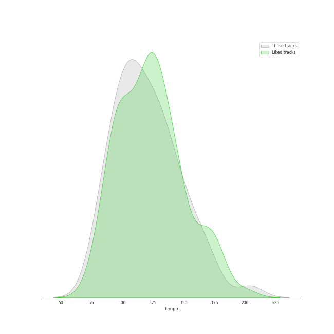

# Track Features for RCA Records Label

## Danceability

| ​ | 10 most Danceable tracks | ​​ | 10 least Danceable tracks |
|:---|:---|:---|:---|
|  | I Don't Mind (feat. Juicy J) (0.87) |  | Never Enough (0.189) |
|  | Paint The Town Red (0.868) |  | Already Gone (0.209) |
|  | You Right (0.828) |  | Run to You (0.24) |
|  | Woman (0.824) |  | Imagine (0.243) |
|  | Rather Be (Clean Bandit Cover) (0.803) |  | Say Something (0.249) |
|  | Smoke (feat. Lucky Daye) (0.803) |  | Over The Rainbow (0.266) |
|  | Vegas (0.789) |  | Can't Help Falling In Love (0.272) |
|  | Say So (0.787) |  | The Christmas Song (Chestnuts Roasting on an Open Fire) (0.317) |
|  | still feel. (0.779) |  | The Lion Sleeps Tonight (Wimoweh) (0.321) |
|  | Just Give Me a Reason (feat. Nate Ruess) (0.778) |  | Hallelujah (0.364) |

## Energy

| ​ | 10 most Energetic tracks | ​​ | 10 least Energetic tracks |
|:---|:---|:---|:---|
|  | The Pretender (0.959) |  | Run to You (0.0622) |
|  | Best of You (0.94) |  | Over The Rainbow (0.155) |
|  | Learn to Fly (0.919) |  | Can't Help Falling In Love (0.16) |
|  | No Tears Left to Cry (0.885) |  | Standing By (0.246) |
|  | Everlong (0.881) |  | Say Something (0.248) |
|  | Everybody (Backstreet's Back) - Radio Edit (0.873) |  | Imagine (0.287) |
|  | Already Gone (0.872) |  | Can't Help Falling in Love (0.293) |
|  | Valerie (feat. Amy Winehouse) - Version Revisited (0.844) |  | Mary, Did You Know? (0.312) |
|  | TiK ToK (0.837) |  | bad guy (0.315) |
|  | Finesse (0.836) |  | O Come, O Come Emmanuel (0.329) |

## Speechiness

| ​ | 10 most Speechy tracks | ​​ | 10 least Speechy tracks |
|:---|:---|:---|:---|
|  | Hey Momma / Hit the Road Jack (0.433) |  | It's the Most Wonderful Time of the Year (0.0256) |
|  | Go DJ (0.404) |  | October Sky (0.0261) |
|  | bad guy (0.384) |  | Mary, Did You Know? (0.0269) |
|  | Hustle (0.326) |  | The Sound of Silence (0.0273) |
|  | Vegas (0.25) |  | Can't Help Falling in Love (0.0275) |
|  | Candyman (0.23) |  | Kiss Me More (feat. SZA) (0.0286) |
|  | Cheap Thrills (feat. Sean Paul) (0.201) |  | Havana (0.0287) |
|  | I Don't Mind (feat. Juicy J) (0.178) |  | Sleigh Ride (0.029) |
|  | Paint The Town Red (0.174) |  | Over The Rainbow (0.0292) |
|  | Work Bitch (0.159) |  | The Christmas Song (Chestnuts Roasting on an Open Fire) (0.0294) |

## Acousticness

| ​ | 10 most Acoustic tracks | ​​ | 10 least Acoustic tracks |
|:---|:---|:---|:---|
|  | Can't Help Falling in Love (0.941) |  | Learn to Fly (1.83e-05) |
|  | Run to You (0.858) |  | Everlong (5.99e-05) |
|  | Earth (0.856) |  | Reptilia (0.000603) |
|  | Valentine (0.806) |  | Best of You (0.000769) |
|  | Wait It Out (0.77) |  | The Pretender (0.000917) |
|  | The Christmas Song (Chestnuts Roasting on an Open Fire) (0.755) |  | Valerie (feat. Amy Winehouse) - Version Revisited (0.00253) |
|  | The Lion Sleeps Tonight (Wimoweh) (0.743) |  | I Need Your Love (0.00319) |
|  | Aha! (0.731) |  | Daft Punk (0.00403) |
|  | Can't Help Falling In Love (0.729) |  | Someday (0.00425) |
|  | O Come, O Come Emmanuel (0.725) |  | The Baddest Girl (0.00637) |

## Instrumentalness

| ​ | 10 most Instrumental tracks | ​​ | 10 least Instrumental tracks |
|:---|:---|:---|:---|
|  | Reptilia (0.713) |  | Natural Disaster (0.0) |
|  | Kill Bill (0.169) |  | Sleigh Ride (0.0) |
|  | Kill Bill (0.144) |  | TiK ToK (0.0) |
|  | The Adults Are Talking (0.106) |  | Hallelujah (0.0) |
|  | Dance of the Sugar Plum Fairy (0.079) |  | The Sound of Silence (0.0) |
|  | Candyman (0.0147) |  | Show You How to Love (0.0) |
|  | Woman (0.00294) |  | Love Again (0.0) |
|  | You Right (0.00233) |  | Lost in Japan (0.0) |
|  | First Train Home (0.00213) |  | Can't Sleep Love (feat. Tink) (0.0) |
|  | Cheap Thrills (0.00143) |  | Imagine (0.0) |

## Liveness

| ​ | 10 most Live tracks | ​​ | 10 least Live tracks |
|:---|:---|:---|:---|
|  | Starships (0.447) |  | The Pretender (0.028) |
|  | Havana (0.385) |  | still feel. (0.0492) |
|  | Let It Go (0.384) |  | Finesse (0.0503) |
|  | See Through (0.37) |  | Lost in Japan (0.0508) |
|  | The Sound of Silence (0.368) |  | Papaoutai (Stromae Cover) (feat. Lindsey Stirling) (0.0551) |
|  | Someday (0.367) |  | City Girls (0.0554) |
|  | Beggin' (0.359) |  | Say My Name (0.0596) |
|  | October Sky (0.349) |  | Work Bitch (0.0651) |
|  | Hallelujah (0.339) |  | Chandelier (0.0685) |
|  | Señorita (0.338) |  | I Need Your Love (0.0741) |

## Valence

| ​ | 10 most Happy tracks | ​​ | 10 least Happy tracks |
|:---|:---|:---|:---|
|  | Earth (0.938) |  | Say Something (0.0812) |
|  | Finesse (0.903) |  | Big Girls Cry (0.0938) |
|  | Valerie (feat. Amy Winehouse) - Version Revisited (0.896) |  | Because of You (0.136) |
|  | Woman (0.881) |  | Can't Help Falling In Love (0.142) |
|  | Sleigh Ride (0.87) |  | Standing By (0.159) |
|  | Na Na Na (0.862) |  | Imagine (0.161) |
|  | Work Bitch (0.852) |  | Run to You (0.176) |
|  | Natural Disaster (0.819) |  | Mary, Did You Know? (0.177) |
|  | City Girls (0.815) |  | What About Us (0.193) |
|  | Rockin' Around the Christmas Tree (0.809) |  | Need to Know (0.194) |

## Tempo

| ​ | 10 most Fast tracks | ​​ | 10 least Fast tracks |
|:---|:---|:---|:---|
|  | Attention (204.19) |  | Rockin' Around the Christmas Tree (75.523) |
|  | Hey Momma / Hit the Road Jack (203.068) |  | The Baddest Girl (77.861) |
|  | Unstoppable (173.799) |  | Already Gone (78.139) |
|  | The Pretender (172.984) |  | Never Enough (78.702) |
|  | Candyman (172.976) |  | The Christmas Song (Chestnuts Roasting on an Open Fire) (78.918) |
|  | Aha! (172.015) |  | October Sky (81.891) |
|  | Carol of the Bells (171.857) |  | Over The Rainbow (83.736) |
|  | The Adults Are Talking (164.959) |  | Run to You (85.495) |
|  | Say My Name (164.035) |  | Natural Disaster (88.033) |
|  | Big Girls Cry (161.996) |  | Aha! (88.492) |
