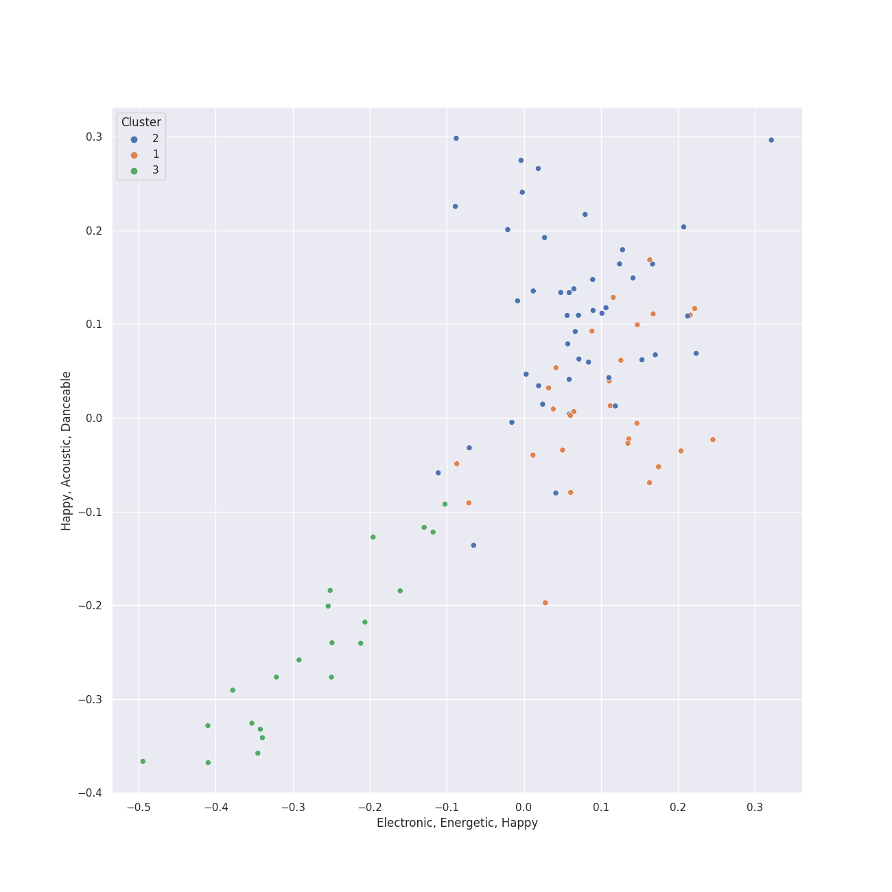

# Clusters in RCA Records Label

## Cluster #1

31 tracks

| Art | Track | Album | Artists | Label | Rank | 💚 | 🔗 |
|:---|:---|:---|:---|:---|---:|:---|:---|
|  | I Need Your Love | PTX, Vol. 2 | [Pentatonix](../../../../artists/pentatonix/overview.md) | [RCA Records Label](../..) | nan | | [🔗](https://open.spotify.com/track/11tQS3cthRT6guY7WkTypx) |
|  | Show You How to Love | PTX, Vol. 1 | [Pentatonix](../../../../artists/pentatonix/overview.md) | [RCA Records Label](../..) | nan | | [🔗](https://open.spotify.com/track/0jExzGwfnZ1vTuCVB7w3vM) |
|  | We Are Young | PTX, Vol. 1 | [Pentatonix](../../../../artists/pentatonix/overview.md) | [RCA Records Label](../..) | nan | 💚 | [🔗](https://open.spotify.com/track/5mMoySkxdUWlTw6X2l4egi) |
|  | Papaoutai (Stromae Cover) (feat. Lindsey Stirling) | PTX, Vol. III | [Pentatonix](../../../../artists/pentatonix/overview.md), [Lindsey Stirling](../../../../artists/lindsey_stirling/overview.md) | [RCA Records Label](../..) | nan | 💚 | [🔗](https://open.spotify.com/track/4LeTorR5FyWgxM3zZI7Qii) |
|  | What About Us | Beautiful Trauma | P!nk | [RCA Records Label](../..) | nan | | [🔗](https://open.spotify.com/track/0Qh38w01QRXK6KHIv0e3hb) |
|  | Alive | This Is Acting (Deluxe Version) | [Sia](../../../../artists/sia/overview.md) | [Monkey Puzzle](../../../monkey_puzzle), [RCA Records Label](../..) | nan | 💚 | [🔗](https://open.spotify.com/track/25R5Tdr4K7ENb6umHzdCXn) |
|  | Eye of the Needle | 1000 Forms Of Fear (Deluxe Version) | [Sia](../../../../artists/sia/overview.md) | [Monkey Puzzle](../../../monkey_puzzle), [RCA Records Label](../..) | nan | 💚 | [🔗](https://open.spotify.com/track/6H8UxS43KArEIu2vGZI9Dj) |
|  | Slide Away | Slide Away | Miley Cyrus | [RCA Records Label](../..) | nan | | [🔗](https://open.spotify.com/track/44ADyYoY5liaRa3EOAl4uf) |
|  | Kill Bill | SOS | SZA | [Top Dawg Entertainment/RCA Records](../..) | 251 | 💚 | [🔗](https://open.spotify.com/track/3OHfY25tqY28d16oZczHc8) |
|  | Snooze | SOS | SZA | [Top Dawg Entertainment/RCA Records](../..) | nan | 💚 | [🔗](https://open.spotify.com/track/4iZ4pt7kvcaH6Yo8UoZ4s2) |
## Cluster #2

42 tracks

| Art | Track | Album | Artists | Label | Rank | 💚 | 🔗 |
|:---|:---|:---|:---|:---|---:|:---|:---|
|  | Love Again | PTX, Vol. 2 | [Pentatonix](../../../../artists/pentatonix/overview.md) | [RCA Records Label](../..) | nan | | [🔗](https://open.spotify.com/track/0vcyzDe6aoYTg6jM0U0T9r) |
|  | Daft Punk | PTX, Vol. 2 | [Pentatonix](../../../../artists/pentatonix/overview.md) | [RCA Records Label](../..) | nan | 💚 | [🔗](https://open.spotify.com/track/6ukvsBzq4d1vBsAUmz7ZVt) |
|  | It's the Most Wonderful Time of the Year | That's Christmas To Me (Deluxe Edition) | [Pentatonix](../../../../artists/pentatonix/overview.md) | [RCA Records Label](../..) | nan | | [🔗](https://open.spotify.com/track/4DXJt41B9ZPh3UmxiPkBT0) |
|  | Attention | PTX Presents: Top Pop, Vol. I | [Pentatonix](../../../../artists/pentatonix/overview.md) | [RCA Records Label](../..) | nan | | [🔗](https://open.spotify.com/track/5P40YyCrdZRsoj2vTbSyVI) |
|  | Can't Sleep Love (feat. Tink) | Pentatonix (Deluxe Version) | [Pentatonix](../../../../artists/pentatonix/overview.md), Tink | [RCA Records Label](../..) | nan | 💚 | [🔗](https://open.spotify.com/track/1GXFYdKM6MNrogE2PacpKe) |
|  | Problem (Ariana Grande Cover) | PTX, Vol. III | [Pentatonix](../../../../artists/pentatonix/overview.md) | [RCA Records Label](../..) | 433 | 💚 | [🔗](https://open.spotify.com/track/45h4cCw7ccsRXb0Orle2an) |
|  | TiK ToK | Animal (Expanded Edition) | Kesha | [RCA Records Label](../..) | nan | 💚 | [🔗](https://open.spotify.com/track/0HPD5WQqrq7wPWR7P7Dw1i) |
|  | Say So | Hot Pink | [Doja Cat](../../../../artists/doja_cat/overview.md) | [Kemosabe Records/RCA Records](../..) | 720 | 💚 | [🔗](https://open.spotify.com/track/3Dv1eDb0MEgF93GpLXlucZ) |
|  | Kiss Me More (feat. SZA) | Kiss Me More (feat. SZA) | [Doja Cat](../../../../artists/doja_cat/overview.md), SZA | [Kemosabe Records/RCA Records](../..) | nan | 💚 | [🔗](https://open.spotify.com/track/748mdHapucXQri7IAO8yFK) |
|  | Cheap Thrills | This Is Acting (Deluxe Version) | [Sia](../../../../artists/sia/overview.md) | [Monkey Puzzle](../../../monkey_puzzle), [RCA Records Label](../..) | nan | 💚 | [🔗](https://open.spotify.com/track/3S4px9f4lceWdKf0gWciFu) |
## Cluster #3

22 tracks

| Art | Track | Album | Artists | Label | Rank | 💚 | 🔗 |
|:---|:---|:---|:---|:---|---:|:---|:---|
|  | Valentine | PTX, Vol. 2 | [Pentatonix](../../../../artists/pentatonix/overview.md) | [RCA Records Label](../..) | nan | 💚 | [🔗](https://open.spotify.com/track/5djjmpqAOlne6d5RSHQmvu) |
|  | Hallelujah | A Pentatonix Christmas Deluxe | [Pentatonix](../../../../artists/pentatonix/overview.md) | [RCA Records Label](../..) | nan | | [🔗](https://open.spotify.com/track/0HZk0QsXPhMNAWNDR3rYE8) |
|  | If I Ever Fall In Love (feat. Jason Derulo) | Pentatonix (Deluxe Version) | [Pentatonix](../../../../artists/pentatonix/overview.md), [Jason Derulo](../../../../artists/jason_derulo/overview.md) | [RCA Records Label](../..) | nan | 💚 | [🔗](https://open.spotify.com/track/3vaWsG3oKZt0bSra2p5c5R) |
|  | Over The Rainbow | PTX Vol. IV - Classics | [Pentatonix](../../../../artists/pentatonix/overview.md) | [RCA Records Label](../..) | nan | | [🔗](https://open.spotify.com/track/7MefjVBQqdV6XRXBlWejTQ) |
|  | The Christmas Song (Chestnuts Roasting on an Open Fire) | PTXmas (Deluxe Edition) | [Pentatonix](../../../../artists/pentatonix/overview.md) | [RCA Records Label](../..) | nan | | [🔗](https://open.spotify.com/track/3M2xVmqG5GgthkaRJBntBk) |
|  | O Come, O Come Emmanuel | PTXmas (Deluxe Edition) | [Pentatonix](../../../../artists/pentatonix/overview.md) | [RCA Records Label](../..) | nan | | [🔗](https://open.spotify.com/track/4eKD9QhFqvwA4ilUAkQAbI) |
|  | Aha! | Ellipse | [Imogen Heap](../../../../artists/imogen_heap/overview.md) | [RCA Records Label](../..) | nan | 💚 | [🔗](https://open.spotify.com/track/42itRd5WoYb42RSYOloJvD) |
|  | Wait It Out | Ellipse | [Imogen Heap](../../../../artists/imogen_heap/overview.md) | [RCA Records Label](../..) | nan | 💚 | [🔗](https://open.spotify.com/track/4xszw2YraekWIpj0SZ6Lp6) |
|  | October Sky | October Sky | Yebba | [RCA Records Label](../..) | nan | 💚 | [🔗](https://open.spotify.com/track/4dGuN04mLIr6EgFkrBe5Vl) |
|  | Reptilia | Room On Fire | The Strokes | [RCA Records Label](../..) | nan | 💚 | [🔗](https://open.spotify.com/track/57Xjny5yNzAcsxnusKmAfA) |