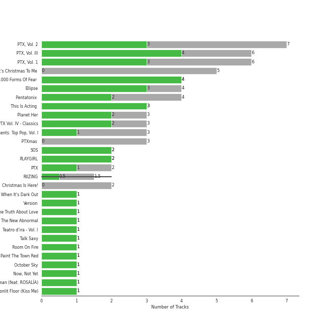
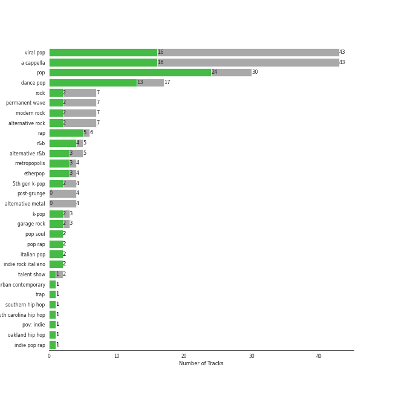

# RCA Records Label

103 songs

[See Track Features](audio_features.md)

[See Clusters](clusters/overview.md)

Appears as:
- RCA Records Label (71 tracks)
- Monkey Puzzle Records/RCA Records (7 tracks)
- Kemosabe Records/RCA Records (6 tracks)
- Citizen Queen/RCA Records (5 tracks)
- Top Dawg Entertainment/RCA Records (3 tracks)
- SM Entertainment/RCA Records (2 tracks)
- BPG/RVG/RCA Records (1 tracks)
- Chris Brown Entertainment/300 Entertainment/RCA Records (1 tracks)
- Cult Records/RCA Records (1 tracks)
- House of Iona/RCA Records (1 tracks)
- KAYTRANADA/RCA Records (1 tracks)
- Kemosabe / RCA Records / Last Kings Music / EMPIRE (1 tracks)
- Lovett Music/RCA Records (1 tracks)
- RCA/Legacy (1 tracks)
- half·alive/RCA Records (1 tracks)

## Top Artists

| Art | Tracks | 💚 | Artist | 🔗 |
|:---|---:|---:|:---|:---|
|  | 43 | 16 | [Pentatonix](../../artists/pentatonix/overview.md) | [🔗](https://open.spotify.com/artist/26AHtbjWKiwYzsoGoUZq53) |
|  | 8 | 7 | [Doja Cat](../../artists/doja_cat/overview.md) | [🔗](https://open.spotify.com/artist/5cj0lLjcoR7YOSnhnX0Po5) |
|  | 7 | 7 | [Sia](../../artists/sia/overview.md) | [🔗](https://open.spotify.com/artist/5WUlDfRSoLAfcVSX1WnrxN) |
|  | 4 | 3 | SZA | [🔗](https://open.spotify.com/artist/7tYKF4w9nC0nq9CsPZTHyP) |
|  | 4 | 3 | [Imogen Heap](../../artists/imogen_heap/overview.md) | [🔗](https://open.spotify.com/artist/6Xb4ezwoAQC4516kI89nWz) |
|  | 3 | 2 | P!nk | [🔗](https://open.spotify.com/artist/1KCSPY1glIKqW2TotWuXOR) |
|  | 3 | 2 | The Strokes | [🔗](https://open.spotify.com/artist/0epOFNiUfyON9EYx7Tpr6V) |
|  | 2 | 2 | [Lindsey Stirling](../../artists/lindsey_stirling/overview.md) | [🔗](https://open.spotify.com/artist/378dH6EszOLFShpRzAQkVM) |
|  | 2 | 2 | RIIZE | [🔗](https://open.spotify.com/artist/2jOm3cYujQx6o1dxuiuqaX) |
|  | 2 | 2 | Måneskin | [🔗](https://open.spotify.com/artist/0lAWpj5szCSwM4rUMHYmrr) |

See all 40 artists

| Art | Tracks | 💚 | Artist | 🔗 |
|:---|---:|---:|:---|:---|
|  | 2 | 1 | Miley Cyrus | [🔗](https://open.spotify.com/artist/5YGY8feqx7naU7z4HrwZM6) |
|  | 2 | 1 | Kelly Clarkson | [🔗](https://open.spotify.com/artist/3BmGtnKgCSGYIUhmivXKWX) |
|  | 1 | 1 | half•alive | [🔗](https://open.spotify.com/artist/7sOR7gk6XUlGnxj3p9F54k) |
|  | 1 | 1 | Amy Winehouse | [🔗](https://open.spotify.com/artist/6Q192DXotxtaysaqNPy5yR) |
|  | 1 | 1 | Kesha | [🔗](https://open.spotify.com/artist/6LqNN22kT3074XbTVUrhzX) |
|  | 1 | 1 | Bebe Rexha | [🔗](https://open.spotify.com/artist/64M6ah0SkkRsnPGtGiRAbb) |
|  | 1 | 1 | Victoria Monét | [🔗](https://open.spotify.com/artist/63XBtGSEZINSyXylZxEUbv) |
|  | 1 | 1 | Juicy J | [🔗](https://open.spotify.com/artist/5gCRApTajqwbnHHPbr2Fpi) |
|  | 1 | 1 | Lucky Daye | [🔗](https://open.spotify.com/artist/5Vuvs6Py2JRU7WiFDVsI7J) |
|  | 1 | 1 | Tyga | [🔗](https://open.spotify.com/artist/5LHRHt1k9lMyONurDHEdrp) |
|  | 1 | 1 | Tink | [🔗](https://open.spotify.com/artist/4v6XOdonnfpdTKTRJArG7v) |
|  | 1 | 1 | Mark Ronson | [🔗](https://open.spotify.com/artist/3hv9jJF3adDNsBSIQDqcjp) |
|  | 1 | 1 | USHER | [🔗](https://open.spotify.com/artist/23zg3TcAtWQy7J6upgbUnj) |
|  | 1 | 1 | Nate Ruess | [🔗](https://open.spotify.com/artist/1qUjOF5fzrpoNycD36b2jZ) |
|  | 1 | 1 | Yebba | [🔗](https://open.spotify.com/artist/1ooV8YZC1KbpEcrmI8WH0F) |
|  | 1 | 1 | Christina Aguilera | [🔗](https://open.spotify.com/artist/1l7ZsJRRS8wlW3WfJfPfNS) |
|  | 1 | 1 | The Weeknd | [🔗](https://open.spotify.com/artist/1Xyo4u8uXC1ZmMpatF05PJ) |
|  | 1 | 1 | [Jason Derulo](../../artists/jason_derulo/overview.md) | [🔗](https://open.spotify.com/artist/07YZf4WDAMNwqr4jfgOZ8y) |
|  | 1 | 1 | G-Eazy | [🔗](https://open.spotify.com/artist/02kJSzxNuaWGqwubyUba0Z) |
|  | 5 | 0 | Citizen Queen | [🔗](https://open.spotify.com/artist/2z7BqfKvVlkr8KVAOTBKcz) |
|  | 4 | 0 | Foo Fighters | [🔗](https://open.spotify.com/artist/7jy3rLJdDQY21OgRLCZ9sD) |
|  | 1 | 0 | Chris Brown | [🔗](https://open.spotify.com/artist/7bXgB6jMjp9ATFy66eO08Z) |
|  | 1 | 0 | KAYTRANADA | [🔗](https://open.spotify.com/artist/6qgnBH6iDM91ipVXv28OMu) |
|  | 1 | 0 | Backstreet Boys | [🔗](https://open.spotify.com/artist/5rSXSAkZ67PYJSvpUpkOr7) |
|  | 1 | 0 | Young Thug | [🔗](https://open.spotify.com/artist/50co4Is1HCEo8bhOyUWKpn) |
|  | 1 | 0 | Elvis Presley | [🔗](https://open.spotify.com/artist/43ZHCT0cAZBISjO8DG9PnE) |
|  | 1 | 0 | SiR | [🔗](https://open.spotify.com/artist/3QTDHixorJelOLxoxcjqGx) |
|  | 1 | 0 | Tove Styrke | [🔗](https://open.spotify.com/artist/2QSPrJfYeRXaltEEiriXN9) |
|  | 1 | 0 | Britney Spears | [🔗](https://open.spotify.com/artist/26dSoYclwsYLMAKD3tpOr4) |
|  | 1 | 0 | The Tokens | [🔗](https://open.spotify.com/artist/1GAJzApRTMmYZ9EjQ91VOy) |

## Top Albums

| Art | Tracks | 💚 | Album | Release Date | 🔗 |
|:---|---:|---:|:---|:---|:---|
|  | 7 | 3 | PTX, Vol. 2 | 2013-11-05 | [🔗](https://open.spotify.com/album/12dPqNFIdjiVFSHvtsDmzJ) |
|  | 6 | 4 | PTX, Vol. III | 2014-09-23 | [🔗](https://open.spotify.com/album/32y54TelUHSUDWVOx4h1B4) |
|  | 6 | 3 | PTX, Vol. 1 | 2012-06-26 | [🔗](https://open.spotify.com/album/5wGlP6EqF7akh6N3UGfKVZ) |
|  | 5 | 0 | That's Christmas To Me (Deluxe Edition) | 2015-10-30 | [🔗](https://open.spotify.com/album/082VlX7cBth0o8xqDGclNn) |
|  | 4 | 4 | 1000 Forms Of Fear (Deluxe Version) | 2015-05-04 | [🔗](https://open.spotify.com/album/6FdNvoO5sF4EKwCX9je1MH) |
|  | 4 | 3 | Ellipse | 2009-08-25 | [🔗](https://open.spotify.com/album/5AYKGPzPBJNHeKehCxMaq0) |
|  | 4 | 2 | Pentatonix (Deluxe Version) | 2015-10-16 | [🔗](https://open.spotify.com/album/6qf9tE8pNRW0kX1Cucrixr) |
|  | 3 | 3 | This Is Acting (Deluxe Version) | 2016-10-21 | [🔗](https://open.spotify.com/album/2eV6DIPDnGl1idcjww6xyX) |
|  | 3 | 2 | Planet Her | 2021-06-25 | [🔗](https://open.spotify.com/album/1nAQbHeOWTfQzbOoFrvndW) |
|  | 3 | 2 | PTX Vol. IV - Classics | 2017-04-07 | [🔗](https://open.spotify.com/album/00JpoY0ZaQRXTNJUruibfX) |

See all 61 albums

| Art | Tracks | 💚 | Album | Release Date | 🔗 |
|:---|---:|---:|:---|:---|:---|
|  | 3 | 1 | PTX Presents: Top Pop, Vol. I | 2018-04-13 | [🔗](https://open.spotify.com/album/2viOlnLfhPLDgx7hvBqLwW) |
|  | 3 | 0 | PTXmas (Deluxe Edition) | 2012-11-12 | [🔗](https://open.spotify.com/album/5ZwH7KH8Zw0m76hYwANMos) |
|  | 2 | 1 | SOS | 2022-12-09 | [🔗](https://open.spotify.com/album/07w0rG5TETcyihsEIZR3qG) |
|  | 2 | 1 | PTX | 2014-09-19 | [🔗](https://open.spotify.com/album/77RBn8pRsfXlZdfTQh221D) |
|  | 2 | 0 | Christmas Is Here! | 2018-10-19 | [🔗](https://open.spotify.com/album/6thZNGX8hUVSjUrqJgPB9b) |
|  | 1 | 1 | When It's Dark Out | 2015-12-04 | [🔗](https://open.spotify.com/album/09Q3WwGYsQe5ognkvVkmCu) |
|  | 1 | 1 | Version | 2007-07-10 | [🔗](https://open.spotify.com/album/74ooEOK4jY2ZCWjMK6pYmk) |
|  | 1 | 1 | The Truth About Love | 2012-09-14 | [🔗](https://open.spotify.com/album/0pqKb2y8h2BWS46HMfmEgD) |
|  | 1 | 1 | The New Abnormal | 2020-04-10 | [🔗](https://open.spotify.com/album/2xkZV2Hl1Omi8rk2D7t5lN) |
|  | 1 | 1 | Teatro d'ira - Vol. I | 2021-03-19 | [🔗](https://open.spotify.com/album/7KF1Ain9mYYlg5M46g0i4A) |
|  | 1 | 1 | Talk Saxy | 2023-10-27 | [🔗](https://open.spotify.com/album/0XDt5xgg2nI1Gqmf6isfm0) |
|  | 1 | 1 | SOS | 2022-12-08 | [🔗](https://open.spotify.com/album/1nrVofqDRs7cpWXJ49qTnP) |
|  | 1 | 1 | Room On Fire | 2003-10-28 | [🔗](https://open.spotify.com/album/3HFbH1loOUbqCyPsLuHLLh) |
|  | 1 | 1 | Paint The Town Red | 2023-08-04 | [🔗](https://open.spotify.com/album/54dZypaXHAIDzBe9ujAZ63) |
|  | 1 | 1 | October Sky | 2021-06-11 | [🔗](https://open.spotify.com/album/6w7gENsq0E5THRxQZkA1D0) |
|  | 1 | 1 | Now, Not Yet | 2019-08-09 | [🔗](https://open.spotify.com/album/2KSWrd22LGc0Hmqs2Z5i7z) |
|  | 1 | 1 | Kiss Me More (feat. SZA) | 2021-04-09 | [🔗](https://open.spotify.com/album/1OnzqJTL9bwe4kvaLxRYxt) |
|  | 1 | 1 | JAGUAR II | 2023-08-25 | [🔗](https://open.spotify.com/album/6WlGOgNNtpwFt2gfRFfqgZ) |
|  | 1 | 1 | I Don't Mind (feat. Juicy J) | 2014-11-21 | [🔗](https://open.spotify.com/album/5BAqg5IJQ7XFKfdoCiOlJw) |
|  | 1 | 1 | Hurts 2B Human | 2019-04-26 | [🔗](https://open.spotify.com/album/6JKkXVEljQJ1wKbRG5MywC) |
|  | 1 | 1 | Hot Pink | 2019-11-07 | [🔗](https://open.spotify.com/album/1MmVkhiwTH0BkNOU3nw5d3) |
|  | 1 | 1 | Get A Guitar | 2023-09-04 | [🔗](https://open.spotify.com/album/4QzCT76QtPCyLinchwVt8l) |
|  | 1 | 1 | Freaky Deaky | 2022-02-25 | [🔗](https://open.spotify.com/album/05oVghsqITa33yHnbW7uPz) |
|  | 1 | 1 | ELVIS (Original Motion Picture Soundtrack) | 2022-06-24 | [🔗](https://open.spotify.com/album/74g0V2gxEA5MCSaivAwZyb) |
|  | 1 | 1 | Chosen | 2017-12-08 | [🔗](https://open.spotify.com/album/2qJw6w5XwQO0PQlSWPu7Tw) |
|  | 1 | 1 | Breakaway | 2004-01-17 | [🔗](https://open.spotify.com/album/5gDAEao3VxFdbm8vS0koQq) |
|  | 1 | 1 | Bangerz (Deluxe Version) | 2013-10-04 | [🔗](https://open.spotify.com/album/3RDqXDc1bAETps54MSSOW0) |
|  | 1 | 1 | Back To Basics | 2006-08-14 | [🔗](https://open.spotify.com/album/0zRJsgzHZUUdk8Rjk6Segd) |
|  | 1 | 1 | Animal (Expanded Edition) | 2010-01-01 | [🔗](https://open.spotify.com/album/6fpLLJsDSSAlToEDW2jv4F) |
|  | 1 | 0 | bad guy | 2019-12-13 | [🔗](https://open.spotify.com/album/1phloQZ7zGTlsfQVUBiTbK) |
|  | 1 | 0 | Wimoweh!!! - The Best Of The Tokens | 1994-08-29 | [🔗](https://open.spotify.com/album/6NBox81OQox7U4I0hZB9t0) |
|  | 1 | 0 | This Is The End: Original Motion Picture Soundtrack | 2013-06-10 | [🔗](https://open.spotify.com/album/1SFKmqhTTEkE3PmSBEMpa3) |
|  | 1 | 0 | There Is Nothing Left To Lose | 1999-11-02 | [🔗](https://open.spotify.com/album/28q2N44ocJECgf8sbHEDfY) |
|  | 1 | 0 | The Sound of Silence | 2019-02-15 | [🔗](https://open.spotify.com/album/2d5CHsmyOYGqfjDaPrdEzc) |
|  | 1 | 0 | The Colour And The Shape | 1997-05-20 | [🔗](https://open.spotify.com/album/30ly6F6Xl0TKmyBCU50Khv) |
|  | 1 | 0 | Sway | 2018-05-04 | [🔗](https://open.spotify.com/album/3fSRbKgYW6kcR1ZFMaaNV4) |
|  | 1 | 0 | Slime & B | 2020-05-08 | [🔗](https://open.spotify.com/album/7fZKtzZAsfH0kzeTivu5TG) |
|  | 1 | 0 | Slide Away | 2019-08-16 | [🔗](https://open.spotify.com/album/0SHGFAL8WZUvpWb5iLPp6E) |
|  | 1 | 0 | Señorita | 2019-12-02 | [🔗](https://open.spotify.com/album/40wlfdkpATRjUMtrlt6BFb) |
|  | 1 | 0 | No Tears Left to Cry | 2018-12-11 | [🔗](https://open.spotify.com/album/2f47uqbseyM4AGSCiIQaw2) |
|  | 1 | 0 | Never Enough | 2019-02-08 | [🔗](https://open.spotify.com/album/0c9cgQqbVL9QVvwbA6faAB) |
|  | 1 | 0 | Lost in Japan | 2018-12-28 | [🔗](https://open.spotify.com/album/1Zs8K8co0WkLKaQ4NxduR5) |
|  | 1 | 0 | Is This It | 2001-07-30 | [🔗](https://open.spotify.com/album/2k8KgmDp9oHrmu0MIj4XDE) |
|  | 1 | 0 | In Your Honor | 2005-06-14 | [🔗](https://open.spotify.com/album/2eprpJCYbCbPZRKVGIEJxZ) |
|  | 1 | 0 | Echoes, Silence, Patience & Grace | 2007-09-25 | [🔗](https://open.spotify.com/album/3ilXDEG0xiajK8AbqboeJz) |
|  | 1 | 0 | Britney Jean (Deluxe Version) | 2013-11-30 | [🔗](https://open.spotify.com/album/5rlB2HPoNHg2m1wmmh0TRv) |
|  | 1 | 0 | Blue Hawaii | 1961-10-20 | [🔗](https://open.spotify.com/album/7xe8VI48TxUpU1IIo0RfGi) |
|  | 1 | 0 | Beautiful Trauma | 2017-10-13 | [🔗](https://open.spotify.com/album/7hwhuEQT4Fp5bzwLlYZtiz) |
|  | 1 | 0 | BUBBA | 2019-12-13 | [🔗](https://open.spotify.com/album/5FQ4sOGqRWUA5wO20AwPcO) |
|  | 1 | 0 | All I Ever Wanted | 2009-03-06 | [🔗](https://open.spotify.com/album/4h8seeFAi6iYhslcWIxTSG) |
|  | 1 | 0 | A Pentatonix Christmas Deluxe | 2017-12-06 | [🔗](https://open.spotify.com/album/3sId8sOH47yqOWopzbEtJn) |

## Genres

| Tracks | 💚 | Genre |
|---:|---:|:---|
| 29 | 22 | [pop](../../genres/pop/overview.md) |
| 43 | 16 | [viral pop](../../genres/viral_pop/overview.md) |
| 43 | 16 | [a cappella](../../genres/a_cappella/overview.md) |
| 17 | 12 | [dance pop](../../genres/dance_pop/overview.md) |
| 7 | 7 | australian pop |
| 7 | 7 | australian dance |
| 7 | 5 | [rap](../../genres/rap/overview.md) |
| 6 | 4 | [r&b](../../genres/r_b/overview.md) |
| 4 | 3 | metropopolis |
| 4 | 3 | etherpop |

See all 45 genres

| Tracks | 💚 | Genre |
|---:|---:|:---|
| 7 | 2 | [rock](../../genres/rock/overview.md) |
| 7 | 2 | [permanent wave](../../genres/permanent_wave/overview.md) |
| 7 | 2 | [modern rock](../../genres/modern_rock/overview.md) |
| 7 | 2 | [alternative rock](../../genres/alternative_rock/overview.md) |
| 3 | 2 | garage rock |
| 2 | 2 | pop soul |
| 2 | 2 | pop rap |
| 2 | 2 | italian pop |
| 2 | 2 | indie rock italiano |
| 2 | 1 | talent show |
| 2 | 1 | alternative r&b |
| 1 | 1 | [urban contemporary](../../genres/urban_contemporary/overview.md) |
| 1 | 1 | trap |
| 1 | 1 | south carolina hip hop |
| 1 | 1 | pov: indie |
| 1 | 1 | oakland hip hop |
| 1 | 1 | indie pop rap |
| 1 | 1 | hip hop |
| 1 | 1 | contemporary r&b |
| 1 | 1 | atl hip hop |
| 1 | 1 | alt z |
| 4 | 0 | post-grunge |
| 4 | 0 | alternative metal |
| 1 | 0 | swedish synthpop |
| 1 | 0 | swedish pop |
| 1 | 0 | swedish electropop |
| 1 | 0 | sunshine pop |
| 1 | 0 | rockabilly |
| 1 | 0 | rock-and-roll |
| 1 | 0 | lgbtq+ hip hop |
| 1 | 0 | indie soul |
| 1 | 0 | escape room |
| 1 | 0 | [electropop](../../genres/electropop/overview.md) |
| 1 | 0 | doo-wop |
| 1 | 0 | boy band |

## Top Producers

| Art | Producer | Tracks | Credit Types |
|:---|:---|---:|:---|
| | Serban Ghenea | 8 | Producer |
| | Łukasz Gottwald (Gottwald, Łukasz) | 7 | Songwriter |
|  | [Sia](../../artists/sia/overview.md) | 7 | Producer, Songwriter |
| | John Hanes | 6 | Producer |
|  | [Doja Cat](../../artists/doja_cat/overview.md) | 6 | Songwriter |
| | Manny Marroquin | 6 | Producer |
| | Greg Kurstin | 6 | Producer, Songwriter |
| | Alex Pasco | 5 | Producer |
| | Dr. Luke | 4 | Producer |
| | Julian Burg | 4 | Producer |

View all

| Art | Producer | Tracks | Credit Types |
|:---|:---|---:|:---|
|  | [Imogen Heap](../../artists/imogen_heap/overview.md) | 4 | Lyricist, Producer, Songwriter |
| | Jesse Shatkin | 4 | Producer, Songwriter |
| | Ben Bram | 4 | Songwriter, Arranger |
| | Kirstin | 3 | Songwriter |
| | Kevin Olusola | 3 | Songwriter |
| | Yeti Beats | 3 | Producer, Songwriter |
| | Mitch Grassi | 3 | Songwriter |
| | Avi Kaplan | 3 | Songwriter |
| | Scott Hoying | 3 | Songwriter |
| | Jeff Bhasker | 2 | Producer, Songwriter |
|  | Nate Ruess | 2 | Songwriter |
|  | SZA | 2 | Songwriter |
|  | [Pentatonix](../../artists/pentatonix/overview.md) | 2 | Arranger |
| | Jimmy Napes | 2 | Songwriter |
| | Rogét Chahayed (Chahayed, Rogét) | 2 | Producer, Songwriter |
| | Bryce Bordone | 2 | Producer |
|  | P!nk | 2 | Songwriter |
| | Rian Lewis | 2 | Producer |
| | Cirkut | 2 | Songwriter, Producer |
|  | Julian Casablancas | 2 | Lyricist, Songwriter |
| | Dan Reynolds | 2 | Producer, Songwriter |
| | Chris Braide | 2 | Producer, Songwriter |
| | Carter Lang | 2 | Producer, Songwriter |
| | Ben Baptie | 1 | Producer |
|  | Christina Aguilera | 1 | Songwriter |
|  | Stromae | 1 | Songwriter |
| | Joe Visciano | 1 | Producer |
| | Kiyanu Kim | 1 | Songwriter |
| | Yoko Ono | 1 | Lyricist |
| | Rob Bisel | 1 | Songwriter |
| | 방혜현 (Bang, Hye Hyun) | 1 | Lyricist |
| | John X. Volaitis | 1 | Producer |
| | Nikolai Fraiture | 1 | Songwriter |
| | Emiko Bankson | 1 | Songwriter |
| | Stephan Moccio | 1 | Songwriter |
|  | [Ariana Grande](../../artists/ariana_grande/overview.md) | 1 | Songwriter |
| | Boyan Chowdhury | 1 | Songwriter |
| | Derek Pacuk | 1 | Producer |
|  | Kesha | 1 | Songwriter |
|  | Lucky Daye | 1 | Songwriter |
| | Tom Elmhirst | 1 | Producer |
|  | Diplo | 1 | Producer |
| | Tyler Johnson | 1 | Producer |
| | Maurice White | 1 | Songwriter |
| | Fred Falke | 1 | Producer |
| | Marc Jameson | 1 | Producer |
| | Sergio Chavez | 1 | Producer |
| | Albert Hammond, Jr. | 1 | Songwriter |
| | Kaan Gunesberk | 1 | Songwriter |
| | Isaac Earl Bynum | 1 | Songwriter |
| | Ben Samama | 1 | Songwriter |
| | Dom Morley | 1 | Producer |
| | Thomas Pentz | 1 | Songwriter |
| | Starrah | 1 | Songwriter |
| | James Krausse | 1 | Producer, Songwriter |
| | Daniel Davidsen | 1 | Songwriter |
|  | Bebe Rexha | 1 | Producer, Songwriter |
| | Savan Kotecha | 1 | Songwriter |
|  | Kelly Clarkson | 1 | Songwriter |
| | Terry Shaddick | 1 | Songwriter |
|  | The Strokes | 1 | Arranger |
| | Lydia Asrat | 1 | Songwriter |
| | Christoph Andersson | 1 | Producer, Songwriter |
| | Gabe Burch | 1 | Producer |
| | Tim Roberts | 1 | Producer |
| | 신나리 (Shin, Na Ri) | 1 | Lyricist |
| | Gordon Raphael | 1 | Producer |
|  | Adele | 1 | Songwriter |
| | Abi Harding | 1 | Songwriter |
| | Tim Suby | 1 | Songwriter |
| | Jason Lader | 1 | Producer |
|  | The Weeknd | 1 | Songwriter |
| | Jean-Baptiste Kouame | 1 | Songwriter |
| | Jacob Kasher | 1 | Songwriter |
| | Luigi Creatore | 1 | Songwriter |
| | David Campbell | 1 | Arranger |
| | Ben McKee | 1 | Songwriter |
| | Sam Holland | 1 | Producer |
|  | Juicy J | 1 | Songwriter |
| | Elof Loelv | 1 | Songwriter |
| | J. Tyler Johnson | 1 | Songwriter |
| | Louis Bell | 1 | Songwriter |
| | Peter Wallevik | 1 | Songwriter |
| | Yogesh Tulsiani | 1 | Songwriter |
| | Tyson Trax | 1 | Producer |
| | Andrew Swanson | 1 | Producer, Songwriter |
| | Josh Taylor | 1 | Songwriter |
| | Fabrizio Moretti | 1 | Songwriter |
|  | Mark Ronson | 1 | Producer |
| | Andrew Watt | 1 | Songwriter |

## Tracks released under RCA Records Label

| Art | Track | Album | Artists | Label | Score | 💚 | 🔗 |
|:---|:---|:---|:---|:---|---:|:---|:---|
|  | Kill Bill | SOS | SZA | [Top Dawg Entertainment/RCA Records](.) | 415 | 💚 | [🔗](https://open.spotify.com/track/3OHfY25tqY28d16oZczHc8) |
|  | Problem (Ariana Grande Cover) | PTX, Vol. III | [Pentatonix](../../artists/pentatonix/overview.md) | [RCA Records Label](.) | 150 | 💚 | [🔗](https://open.spotify.com/track/45h4cCw7ccsRXb0Orle2an) |
|  | Get A Guitar | Get A Guitar | RIIZE | [RCA Records Label](.), [SM Entertainment](../sm_entertainment) | 107 | 💚 | [🔗](https://open.spotify.com/track/3Dah48XTdzVtbIl4dUn6l4) |
|  | Beggin' | Chosen | Måneskin | [RCA Records Label](.) | 97 | 💚 | [🔗](https://open.spotify.com/track/3Wrjm47oTz2sjIgck11l5e) |
|  | Vegas | ELVIS (Original Motion Picture Soundtrack) | [Doja Cat](../../artists/doja_cat/overview.md) | [House of Iona/RCA Records](.) | 40 | 💚 | [🔗](https://open.spotify.com/track/3FWwi61OP7vXEikwqhZCPZ) |
|  | Wrecking Ball | Bangerz (Deluxe Version) | Miley Cyrus | [RCA Records Label](.) | 19 | 💚 | [🔗](https://open.spotify.com/track/2vwlzO0Qp8kfEtzTsCXfyE) |
|  | Sleigh Ride | That's Christmas To Me (Deluxe Edition) | [Pentatonix](../../artists/pentatonix/overview.md) | [RCA Records Label](.) | 18 | | [🔗](https://open.spotify.com/track/0ErjxyZ4qHQVs5umCBIClk) |
|  | Let It Go | That's Christmas To Me (Deluxe Edition) | [Pentatonix](../../artists/pentatonix/overview.md) | [RCA Records Label](.) | 17 | | [🔗](https://open.spotify.com/track/2G7K3Op9y3HhqrF2TdHP95) |
|  | Mary, Did You Know? | That's Christmas To Me (Deluxe Edition) | [Pentatonix](../../artists/pentatonix/overview.md) | [RCA Records Label](.) | 12 | | [🔗](https://open.spotify.com/track/4z8sz6E4YyFuEkv5o7IJni) |
|  | Hustle | Hurts 2B Human | P!nk | [RCA Records Label](.) | 9 | 💚 | [🔗](https://open.spotify.com/track/6BVmygBQhe4pTZQgKkzstD) |

See all tracks

| Art | Track | Album | Artists | Label | Score | 💚 | 🔗 |
|:---|:---|:---|:---|:---|---:|:---|:---|
|  | Say So | Hot Pink | [Doja Cat](../../artists/doja_cat/overview.md) | [Kemosabe Records/RCA Records](.) | 7 | 💚 | [🔗](https://open.spotify.com/track/3Dv1eDb0MEgF93GpLXlucZ) |
|  | Imagine | PTX Vol. IV - Classics | [Pentatonix](../../artists/pentatonix/overview.md) | [RCA Records Label](.) | 5 | 💚 | [🔗](https://open.spotify.com/track/1UaTmLT3nB1sNBfv1hkqU1) |
|  | Dance of the Sugar Plum Fairy | That's Christmas To Me (Deluxe Edition) | [Pentatonix](../../artists/pentatonix/overview.md) | [RCA Records Label](.) | 3 | | [🔗](https://open.spotify.com/track/0u0TlASkQWH2bGIZRu0HLh) |
|  | Go DJ | BUBBA | KAYTRANADA, SiR | [KAYTRANADA/RCA Records](.) | 3 | | [🔗](https://open.spotify.com/track/5goFCtUGQHU4kQuwIupc5D) |
|  | Can't Help Falling in Love | Blue Hawaii | Elvis Presley | [Legacy](../legacy), [RCA Records Label](.) | 0 | | [🔗](https://open.spotify.com/track/44AyOl4qVkzS48vBsbNXaC) |
|  | The Lion Sleeps Tonight (Wimoweh) | Wimoweh!!! - The Best Of The Tokens | The Tokens | [RCA Records Label](.) | 0 | | [🔗](https://open.spotify.com/track/2F4FNcz68howQWD4zaGJSi) |
|  | Everlong | The Colour And The Shape | Foo Fighters | [RCA Records Label](.) | 0 | | [🔗](https://open.spotify.com/track/5UWwZ5lm5PKu6eKsHAGxOk) |
|  | Learn to Fly | There Is Nothing Left To Lose | Foo Fighters | [RCA Records Label](.) | 0 | | [🔗](https://open.spotify.com/track/5OQsiBsky2k2kDKy2bX2eT) |
|  | Someday | Is This It | The Strokes | [RCA Records Label](.) | 0 | | [🔗](https://open.spotify.com/track/7hm4HTk9encxT0LYC0J6oI) |
|  | Reptilia | Room On Fire | The Strokes | [RCA Records Label](.) | 0 | 💚 | [🔗](https://open.spotify.com/track/57Xjny5yNzAcsxnusKmAfA) |
|  | Because of You | Breakaway | Kelly Clarkson | [RCA Records Label](.) | 0 | 💚 | [🔗](https://open.spotify.com/track/3f3omU8n47Mqyab5nCaGyT) |
|  | Best of You | In Your Honor | Foo Fighters | [RCA Records Label](.) | 0 | | [🔗](https://open.spotify.com/track/5FZxsHWIvUsmSK1IAvm2pp) |
|  | Candyman | Back To Basics | Christina Aguilera | [RCA Records Label](.) | 0 | 💚 | [🔗](https://open.spotify.com/track/5lUTzPuiloBHm1qEaJcJfF) |
|  | Valerie (feat. Amy Winehouse) - Version Revisited | Version | Mark Ronson, Amy Winehouse | [RCA Records Label](.) | 0 | 💚 | [🔗](https://open.spotify.com/track/631U6DaszJisq3TiaQ0vTM) |
|  | The Pretender | Echoes, Silence, Patience & Grace | Foo Fighters | [RCA Records Label](.) | 0 | | [🔗](https://open.spotify.com/track/7x8dCjCr0x6x2lXKujYD34) |
|  | Already Gone | All I Ever Wanted | Kelly Clarkson | [RCA Records Label](.) | 0 | | [🔗](https://open.spotify.com/track/4fq2YUONcgrCJ2SPndSeKC) |
|  | Aha! | Ellipse | [Imogen Heap](../../artists/imogen_heap/overview.md) | [RCA Records Label](.) | 0 | 💚 | [🔗](https://open.spotify.com/track/42itRd5WoYb42RSYOloJvD) |
|  | Earth | Ellipse | [Imogen Heap](../../artists/imogen_heap/overview.md) | [RCA Records Label](.) | 0 | 💚 | [🔗](https://open.spotify.com/track/4zXgNwVhtfDrPLjKs52msC) |
|  | First Train Home | Ellipse | [Imogen Heap](../../artists/imogen_heap/overview.md) | [RCA Records Label](.) | 0 | | [🔗](https://open.spotify.com/track/504gJcwsW5n0s3Zj5uAedr) |
|  | Wait It Out | Ellipse | [Imogen Heap](../../artists/imogen_heap/overview.md) | [RCA Records Label](.) | 0 | 💚 | [🔗](https://open.spotify.com/track/4xszw2YraekWIpj0SZ6Lp6) |
|  | TiK ToK | Animal (Expanded Edition) | Kesha | [RCA Records Label](.) | 0 | 💚 | [🔗](https://open.spotify.com/track/0HPD5WQqrq7wPWR7P7Dw1i) |
|  | Aha! | PTX, Vol. 1 | [Pentatonix](../../artists/pentatonix/overview.md) | [RCA Records Label](.) | 0 | 💚 | [🔗](https://open.spotify.com/track/5AspukpHyZuTciR17YPSrS) |
|  | Show You How to Love | PTX, Vol. 1 | [Pentatonix](../../artists/pentatonix/overview.md) | [RCA Records Label](.) | 0 | | [🔗](https://open.spotify.com/track/0jExzGwfnZ1vTuCVB7w3vM) |
|  | Somebody That I Used to Know | PTX, Vol. 1 | [Pentatonix](../../artists/pentatonix/overview.md) | [RCA Records Label](.) | 0 | | [🔗](https://open.spotify.com/track/5XPSElbh3y0S1Jl0ggpwQr) |
|  | Starships | PTX, Vol. 1 | [Pentatonix](../../artists/pentatonix/overview.md) | [RCA Records Label](.) | 0 | | [🔗](https://open.spotify.com/track/28KAxjOTAnnGjGpC2Qx8gn) |
|  | The Baddest Girl | PTX, Vol. 1 | [Pentatonix](../../artists/pentatonix/overview.md) | [RCA Records Label](.) | 0 | 💚 | [🔗](https://open.spotify.com/track/3tKAuyZm1eLdmkZekqezic) |
|  | We Are Young | PTX, Vol. 1 | [Pentatonix](../../artists/pentatonix/overview.md) | [RCA Records Label](.) | 0 | 💚 | [🔗](https://open.spotify.com/track/5mMoySkxdUWlTw6X2l4egi) |
|  | Just Give Me a Reason (feat. Nate Ruess) | The Truth About Love | P!nk, Nate Ruess | [RCA Records Label](.) | 0 | 💚 | [🔗](https://open.spotify.com/track/4VC5nFbYO4avKksJ9jN4pY) |
|  | Carol of the Bells | PTXmas (Deluxe Edition) | [Pentatonix](../../artists/pentatonix/overview.md) | [RCA Records Label](.) | 0 | | [🔗](https://open.spotify.com/track/4cJhiux4xzrdgSHUeAjP48) |
|  | O Come, O Come Emmanuel | PTXmas (Deluxe Edition) | [Pentatonix](../../artists/pentatonix/overview.md) | [RCA Records Label](.) | 0 | | [🔗](https://open.spotify.com/track/4eKD9QhFqvwA4ilUAkQAbI) |
|  | The Christmas Song (Chestnuts Roasting on an Open Fire) | PTXmas (Deluxe Edition) | [Pentatonix](../../artists/pentatonix/overview.md) | [RCA Records Label](.) | 0 | | [🔗](https://open.spotify.com/track/3M2xVmqG5GgthkaRJBntBk) |
|  | Everybody (Backstreet's Back) - Radio Edit | This Is The End: Original Motion Picture Soundtrack | Backstreet Boys | [RCA Records Label](.) | 0 | | [🔗](https://open.spotify.com/track/4rTeOSYqwXNz5qPR2DUTFZ) |
|  | Daft Punk | PTX, Vol. 2 | [Pentatonix](../../artists/pentatonix/overview.md) | [RCA Records Label](.) | 0 | 💚 | [🔗](https://open.spotify.com/track/6ukvsBzq4d1vBsAUmz7ZVt) |
|  | Hey Momma / Hit the Road Jack | PTX, Vol. 2 | [Pentatonix](../../artists/pentatonix/overview.md) | [RCA Records Label](.) | 0 | | [🔗](https://open.spotify.com/track/2wUZek0zWyw5mGKoT8mRcG) |
|  | I Need Your Love | PTX, Vol. 2 | [Pentatonix](../../artists/pentatonix/overview.md) | [RCA Records Label](.) | 0 | | [🔗](https://open.spotify.com/track/11tQS3cthRT6guY7WkTypx) |
|  | Love Again | PTX, Vol. 2 | [Pentatonix](../../artists/pentatonix/overview.md) | [RCA Records Label](.) | 0 | | [🔗](https://open.spotify.com/track/0vcyzDe6aoYTg6jM0U0T9r) |
|  | Natural Disaster | PTX, Vol. 2 | [Pentatonix](../../artists/pentatonix/overview.md) | [RCA Records Label](.) | 0 | | [🔗](https://open.spotify.com/track/04nemEju86ULMJ1iy6EAsF) |
|  | Run to You | PTX, Vol. 2 | [Pentatonix](../../artists/pentatonix/overview.md) | [RCA Records Label](.) | 0 | 💚 | [🔗](https://open.spotify.com/track/1bukNCD9JEwNp235Ov0iZH) |
|  | Valentine | PTX, Vol. 2 | [Pentatonix](../../artists/pentatonix/overview.md) | [RCA Records Label](.) | 0 | 💚 | [🔗](https://open.spotify.com/track/5djjmpqAOlne6d5RSHQmvu) |
|  | Work Bitch | Britney Jean (Deluxe Version) | Britney Spears | [RCA Records Label](.) | 0 | | [🔗](https://open.spotify.com/track/3KliPMvk1EvFZu9cvkj8p1) |
|  | Radioactive | PTX | [Pentatonix](../../artists/pentatonix/overview.md), [Lindsey Stirling](../../artists/lindsey_stirling/overview.md) | [RCA Records Label](.) | 0 | 💚 | [🔗](https://open.spotify.com/track/7dJGehjbhJvs3K4fWwYTW1) |
|  | Say Something | PTX | [Pentatonix](../../artists/pentatonix/overview.md) | [RCA Records Label](.) | 0 | | [🔗](https://open.spotify.com/track/2SrJ0Iw6GobiRGyh2XKZhV) |
|  | La La Latch (Sam Smith/Disclosure/Naughty Boy Mashup) | PTX, Vol. III | [Pentatonix](../../artists/pentatonix/overview.md) | [RCA Records Label](.) | 0 | 💚 | [🔗](https://open.spotify.com/track/6fOqEAXCwboCO4BdzbZG1K) |
|  | Papaoutai (Stromae Cover) (feat. Lindsey Stirling) | PTX, Vol. III | [Pentatonix](../../artists/pentatonix/overview.md), [Lindsey Stirling](../../artists/lindsey_stirling/overview.md) | [RCA Records Label](.) | 0 | 💚 | [🔗](https://open.spotify.com/track/4LeTorR5FyWgxM3zZI7Qii) |
|  | Rather Be (Clean Bandit Cover) | PTX, Vol. III | [Pentatonix](../../artists/pentatonix/overview.md) | [RCA Records Label](.) | 0 | 💚 | [🔗](https://open.spotify.com/track/4hxemf0pE0mSzubgsfRLWu) |
|  | See Through | PTX, Vol. III | [Pentatonix](../../artists/pentatonix/overview.md) | [RCA Records Label](.) | 0 | | [🔗](https://open.spotify.com/track/6UNqsxeupIqwNds2oSDYnY) |
|  | Standing By | PTX, Vol. III | [Pentatonix](../../artists/pentatonix/overview.md) | [RCA Records Label](.) | 0 | | [🔗](https://open.spotify.com/track/2ZtMNYog671T0UFfp0hhWq) |
|  | I Don't Mind (feat. Juicy J) | I Don't Mind (feat. Juicy J) | USHER, Juicy J | [RCA Records Label](.) | 0 | 💚 | [🔗](https://open.spotify.com/track/7aXuop4Qambx5Oi3ynsKQr) |
|  | Big Girls Cry | 1000 Forms Of Fear (Deluxe Version) | [Sia](../../artists/sia/overview.md) | [Monkey Puzzle Records/RCA Records](.) | 0 | 💚 | [🔗](https://open.spotify.com/track/7zE6pyXLjUCOy8PG0UL5SZ) |
|  | Chandelier | 1000 Forms Of Fear (Deluxe Version) | [Sia](../../artists/sia/overview.md) | [Monkey Puzzle Records/RCA Records](.) | 0 | 💚 | [🔗](https://open.spotify.com/track/2s1sdSqGcKxpPr5lCl7jAV) |
|  | Elastic Heart | 1000 Forms Of Fear (Deluxe Version) | [Sia](../../artists/sia/overview.md) | [Monkey Puzzle Records/RCA Records](.) | 0 | 💚 | [🔗](https://open.spotify.com/track/5S9lfZu1YF8xKkgSsqL2Bd) |
|  | Eye of the Needle | 1000 Forms Of Fear (Deluxe Version) | [Sia](../../artists/sia/overview.md) | [Monkey Puzzle Records/RCA Records](.) | 0 | 💚 | [🔗](https://open.spotify.com/track/6H8UxS43KArEIu2vGZI9Dj) |
|  | Can't Sleep Love | Pentatonix (Deluxe Version) | [Pentatonix](../../artists/pentatonix/overview.md) | [RCA Records Label](.) | 0 | | [🔗](https://open.spotify.com/track/1klGbW5a9qTBFUjFfddbmU) |
|  | Can't Sleep Love (feat. Tink) | Pentatonix (Deluxe Version) | [Pentatonix](../../artists/pentatonix/overview.md), Tink | [RCA Records Label](.) | 0 | 💚 | [🔗](https://open.spotify.com/track/1GXFYdKM6MNrogE2PacpKe) |
|  | If I Ever Fall In Love (feat. Jason Derulo) | Pentatonix (Deluxe Version) | [Pentatonix](../../artists/pentatonix/overview.md), [Jason Derulo](../../artists/jason_derulo/overview.md) | [RCA Records Label](.) | 0 | 💚 | [🔗](https://open.spotify.com/track/3vaWsG3oKZt0bSra2p5c5R) |
|  | Na Na Na | Pentatonix (Deluxe Version) | [Pentatonix](../../artists/pentatonix/overview.md) | [RCA Records Label](.) | 0 | | [🔗](https://open.spotify.com/track/6v08G3CGcoyiODIWZoOxR4) |
|  | It's the Most Wonderful Time of the Year | That's Christmas To Me (Deluxe Edition) | [Pentatonix](../../artists/pentatonix/overview.md) | [RCA Records Label](.) | 0 | | [🔗](https://open.spotify.com/track/4DXJt41B9ZPh3UmxiPkBT0) |
|  | Me, Myself & I | When It's Dark Out | G-Eazy, Bebe Rexha | [BPG/RVG/RCA Records](.) | 0 | 💚 | [🔗](https://open.spotify.com/track/40YcuQysJ0KlGQTeGUosTC) |
|  | Alive | This Is Acting (Deluxe Version) | [Sia](../../artists/sia/overview.md) | [Monkey Puzzle Records/RCA Records](.) | 0 | 💚 | [🔗](https://open.spotify.com/track/25R5Tdr4K7ENb6umHzdCXn) |
|  | Bird Set Free | This Is Acting (Deluxe Version) | [Sia](../../artists/sia/overview.md) | [Monkey Puzzle Records/RCA Records](.) | 0 | 💚 | [🔗](https://open.spotify.com/track/6MowG7MRVgPfGlCMsXKMJ2) |
|  | Cheap Thrills | This Is Acting (Deluxe Version) | [Sia](../../artists/sia/overview.md) | [Monkey Puzzle Records/RCA Records](.) | 0 | 💚 | [🔗](https://open.spotify.com/track/3S4px9f4lceWdKf0gWciFu) |
|  | Can't Help Falling In Love | PTX Vol. IV - Classics | [Pentatonix](../../artists/pentatonix/overview.md) | [RCA Records Label](.) | 0 | 💚 | [🔗](https://open.spotify.com/track/1xKScU3i8ho0OIhNoC5YW9) |
|  | Over The Rainbow | PTX Vol. IV - Classics | [Pentatonix](../../artists/pentatonix/overview.md) | [RCA Records Label](.) | 0 | | [🔗](https://open.spotify.com/track/7MefjVBQqdV6XRXBlWejTQ) |
|  | What About Us | Beautiful Trauma | P!nk | [RCA Records Label](.) | 0 | | [🔗](https://open.spotify.com/track/0Qh38w01QRXK6KHIv0e3hb) |
|  | Hallelujah | A Pentatonix Christmas Deluxe | [Pentatonix](../../artists/pentatonix/overview.md) | [RCA Records Label](.) | 0 | | [🔗](https://open.spotify.com/track/0HZk0QsXPhMNAWNDR3rYE8) |
|  | Attention | PTX Presents: Top Pop, Vol. I | [Pentatonix](../../artists/pentatonix/overview.md) | [RCA Records Label](.) | 0 | | [🔗](https://open.spotify.com/track/5P40YyCrdZRsoj2vTbSyVI) |
|  | Finesse | PTX Presents: Top Pop, Vol. I | [Pentatonix](../../artists/pentatonix/overview.md) | [RCA Records Label](.) | 0 | | [🔗](https://open.spotify.com/track/4GfCvy3t1u4lMAFldhB7EF) |
|  | Havana | PTX Presents: Top Pop, Vol. I | [Pentatonix](../../artists/pentatonix/overview.md) | [RCA Records Label](.) | 0 | 💚 | [🔗](https://open.spotify.com/track/0wkiCJqCtI8keITfZ642jg) |
|  | Say My Name | Sway | Tove Styrke | [RCA Records Label](.) | 0 | | [🔗](https://open.spotify.com/track/2XDJzMW1MUWeAIQoMOJeUj) |
|  | Rockin' Around the Christmas Tree | Christmas Is Here! | [Pentatonix](../../artists/pentatonix/overview.md) | [RCA Records Label](.) | 0 | | [🔗](https://open.spotify.com/track/3Fu6XvAT5yjzO8GMcvuM1s) |
|  | Sweater Weather | Christmas Is Here! | [Pentatonix](../../artists/pentatonix/overview.md) | [RCA Records Label](.) | 0 | | [🔗](https://open.spotify.com/track/50YYe94G19kWVyhzdEXxki) |
|  | No Tears Left to Cry | No Tears Left to Cry | Citizen Queen | [Citizen Queen/RCA Records](.) | 0 | | [🔗](https://open.spotify.com/track/6SgkZROgo3xuatvg1zU8AZ) |
|  | Lost in Japan | Lost in Japan | Citizen Queen | [Citizen Queen/RCA Records](.) | 0 | | [🔗](https://open.spotify.com/track/14ruMnm89Giao1vbFs7Bux) |
|  | Never Enough | Never Enough | Citizen Queen | [Citizen Queen/RCA Records](.) | 0 | | [🔗](https://open.spotify.com/track/3NzxjhxtUmmicwbWquPoXt) |
|  | The Sound of Silence | The Sound of Silence | [Pentatonix](../../artists/pentatonix/overview.md) | [RCA Records Label](.) | 0 | | [🔗](https://open.spotify.com/track/0ZFeVCKCMCXUQ1TKVd2azW) |
|  | still feel. | Now, Not Yet | half•alive | [half·alive/RCA Records](.) | 0 | 💚 | [🔗](https://open.spotify.com/track/48XkVAagIoQHCsOlJtXUd5) |
|  | Slide Away | Slide Away | Miley Cyrus | [RCA Records Label](.) | 0 | | [🔗](https://open.spotify.com/track/44ADyYoY5liaRa3EOAl4uf) |
|  | Señorita | Señorita | Citizen Queen | [Citizen Queen/RCA Records](.) | 0 | | [🔗](https://open.spotify.com/track/3QglLwEow7OT5BUaZUNS4W) |
|  | bad guy | bad guy | Citizen Queen | [Citizen Queen/RCA Records](.) | 0 | | [🔗](https://open.spotify.com/track/2trPKQthDkOiLFCNy5fkIO) |
|  | The Adults Are Talking | The New Abnormal | The Strokes | [Cult Records/RCA Records](.) | 0 | 💚 | [🔗](https://open.spotify.com/track/5ruzrDWcT0vuJIOMW7gMnW) |
|  | City Girls | Slime & B | Chris Brown, Young Thug | [Chris Brown Entertainment/300 Entertainment/RCA Records](.) | 0 | | [🔗](https://open.spotify.com/track/1rJUbH0v2E8t1GY4OAUTeC) |
|  | ZITTI E BUONI | Teatro d'ira - Vol. I | Måneskin | [RCA Records Label](.) | 0 | 💚 | [🔗](https://open.spotify.com/track/776AftMmFFAWUIEAb3lHhw) |
|  | Kiss Me More (feat. SZA) | Kiss Me More (feat. SZA) | [Doja Cat](../../artists/doja_cat/overview.md), SZA | [Kemosabe Records/RCA Records](.) | 0 | 💚 | [🔗](https://open.spotify.com/track/748mdHapucXQri7IAO8yFK) |
|  | October Sky | October Sky | Yebba | [RCA Records Label](.) | 0 | 💚 | [🔗](https://open.spotify.com/track/4dGuN04mLIr6EgFkrBe5Vl) |
|  | Need to Know | Planet Her | [Doja Cat](../../artists/doja_cat/overview.md) | [Kemosabe Records/RCA Records](.) | 0 | 💚 | [🔗](https://open.spotify.com/track/3Vi5XqYrmQgOYBajMWSvCi) |
|  | Woman | Planet Her | [Doja Cat](../../artists/doja_cat/overview.md) | [Kemosabe Records/RCA Records](.) | 0 | | [🔗](https://open.spotify.com/track/6Uj1ctrBOjOas8xZXGqKk4) |
|  | You Right | Planet Her | [Doja Cat](../../artists/doja_cat/overview.md), The Weeknd | [Kemosabe Records/RCA Records](.) | 0 | 💚 | [🔗](https://open.spotify.com/track/0k4d5YPDr1r7FX77VdqWez) |
|  | Freaky Deaky | Freaky Deaky | Tyga, [Doja Cat](../../artists/doja_cat/overview.md) | [Kemosabe / RCA Records / Last Kings Music / EMPIRE](.) | 0 | 💚 | [🔗](https://open.spotify.com/track/3vySEUpD0tc801F2WZDLYw) |
|  | Kill Bill | SOS | SZA | [Top Dawg Entertainment/RCA Records](.) | 0 | 💚 | [🔗](https://open.spotify.com/track/1Qrg8KqiBpW07V7PNxwwwL) |
|  | Snooze | SOS | SZA | [Top Dawg Entertainment/RCA Records](.) | 0 | | [🔗](https://open.spotify.com/track/4iZ4pt7kvcaH6Yo8UoZ4s2) |
|  | Paint The Town Red | Paint The Town Red | [Doja Cat](../../artists/doja_cat/overview.md) | [Kemosabe Records/RCA Records](.) | 0 | 💚 | [🔗](https://open.spotify.com/track/2IGMVunIBsBLtEQyoI1Mu7) |
|  | Smoke (feat. Lucky Daye) | JAGUAR II | Victoria Monét, Lucky Daye | [Lovett Music/RCA Records](.) | 0 | 💚 | [🔗](https://open.spotify.com/track/1Zej3ztnuVElDfYGYBBhJP) |
|  | Talk Saxy | Talk Saxy | RIIZE | [RCA Records Label](.), [SM Entertainment](../sm_entertainment) | 0 | 💚 | [🔗](https://open.spotify.com/track/2cEwQnP4284g37N6D7ETND) |

