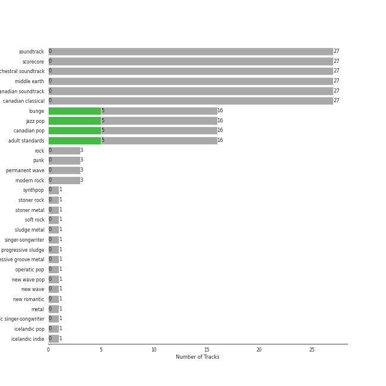

# Reprise

13 songs

Appears as:
- 143/Reprise (10 tracks)
- Reprise (3 tracks)

## Top Artists

See all 4 artists

| Number of Tracks | Art | Artist | 🔗 |
|---:|:---|:---|:---|
| 12 |  | [Michael Bublé](../artists/michael_bubl_.md) | [🔗](https://open.spotify.com/artist/1GxkXlMwML1oSg5eLPiAz3) |
| 1 |  | Cécile McLorin Salvant | [🔗](https://open.spotify.com/artist/6PkSULcbxFKkxdgrmPGAvn) |
| 1 |  | Meghan Trainor | [🔗](https://open.spotify.com/artist/6JL8zeS1NmiOftqZTRgdTz) |
| 1 |  | Mastodon | [🔗](https://open.spotify.com/artist/1Dvfqq39HxvCJ3GvfeIFuT) |

## Top Albums

See all 8 albums

| Number of Tracks | Art | Album | Release Date | 🔗 |
|---:|:---|:---|:---|:---|
| 3 |  | Call Me Irresponsible | 2007-04-30 | [🔗](https://open.spotify.com/album/3h4pyWRJIB9ZyRKXChbX22) |
| 2 |  | Michael Bublé | 2003 | [🔗](https://open.spotify.com/album/3rpSksJSFdNFqk5vne8at2) |
| 2 |  | It's Time | 2005-02-08 | [🔗](https://open.spotify.com/album/457fktVFXVwjQTl9wOLlfg) |
| 2 |  | Crazy Love | 2009-10-06 | [🔗](https://open.spotify.com/album/3MXDonOIzrIrCh0HvlACyj) |
| 1 |  | love (Deluxe Edition) | 2018-11-16 | [🔗](https://open.spotify.com/album/68xKnVblFsSQ48CtgZT0oY) |
| 1 |  | Once More 'Round the Sun | 2014-06-20 | [🔗](https://open.spotify.com/album/7mEkBi9a2p2f1WQbnH8Qk5) |
| 1 |  | Nobody but Me | 2016-10-21 | [🔗](https://open.spotify.com/album/5wN1OizIFEHDUkRwzIK3wL) |
| 1 |  | Come Fly with Me | 2004-03-30 | [🔗](https://open.spotify.com/album/0UhvDeKmtgegXeELEVgGRh) |

## Genres

See all 12 genres

| Number of Tracks | Genre |
|---:|:---|
| 12 | lounge |
| 12 | jazz pop |
| 12 | canadian pop |
| 12 | [adult standards](../genres/adult_standards.md) |
| 1 | stoner metal |
| 1 | sludge metal |
| 1 | progressive sludge |
| 1 | progressive groove metal |
| 1 | nu metal |
| 1 | metal |
| 1 | atlanta metal |
| 1 | alternative metal |

## Tracks released under Reprise

| Art | Track | Album | Artists | Label | 💚 | 🔗 |
|:---|:---|:---|:---|:---|:---|:---|
|  | The Motherload | Once More 'Round the Sun | Mastodon | [Reprise](reprise.md) | | [🔗](https://open.spotify.com/track/6EF0xhfKtQNqUPz2mnE5BD) |
|  | Moondance | Michael Bublé | [Michael Bublé](../artists/michael_bubl_.md) | [143](143.md), [Reprise](reprise.md) | 💚 | [🔗](https://open.spotify.com/track/25Yzff59UGjz7wNWmjM39h) |
|  | The Way You Look Tonight | Michael Bublé | [Michael Bublé](../artists/michael_bubl_.md) | [143](143.md), [Reprise](reprise.md) | | [🔗](https://open.spotify.com/track/4YGlRLe6TeBRiXFByBqldf) |
|  | Can't Help Falling in Love | Come Fly with Me | [Michael Bublé](../artists/michael_bubl_.md) | [143](143.md), [Reprise](reprise.md) | | [🔗](https://open.spotify.com/track/7igk58Vs9uM2B0aaTUwv6F) |
|  | Feeling Good | It's Time | [Michael Bublé](../artists/michael_bubl_.md) | [143](143.md), [Reprise](reprise.md) | 💚 | [🔗](https://open.spotify.com/track/72PwtNhRrZXNnYeRg5xQ46) |
|  | Home | It's Time | [Michael Bublé](../artists/michael_bubl_.md) | [143](143.md), [Reprise](reprise.md) | 💚 | [🔗](https://open.spotify.com/track/3ISaSNZCxIzTGwQuBq6Xrr) |
|  | Call Me Irresponsible | Call Me Irresponsible | [Michael Bublé](../artists/michael_bubl_.md) | [143](143.md), [Reprise](reprise.md) | | [🔗](https://open.spotify.com/track/25RxZw46RfYpVWMIrIeZDS) |
|  | Everything | Call Me Irresponsible | [Michael Bublé](../artists/michael_bubl_.md) | [143](143.md), [Reprise](reprise.md) | 💚 | [🔗](https://open.spotify.com/track/4T6HLdP6OcAtqC6tGnQelG) |
|  | The Best Is yet to Come | Call Me Irresponsible | [Michael Bublé](../artists/michael_bubl_.md) | [143](143.md), [Reprise](reprise.md) | | [🔗](https://open.spotify.com/track/56t3m0lqE6zU1EfgFOPqst) |
|  | Cry Me a River | Crazy Love | [Michael Bublé](../artists/michael_bubl_.md) | [143](143.md), [Reprise](reprise.md) | | [🔗](https://open.spotify.com/track/5i04Jy87RLxoZszJqY3QAN) |
|  | Haven't Met You Yet | Crazy Love | [Michael Bublé](../artists/michael_bubl_.md) | [143](143.md), [Reprise](reprise.md) | 💚 | [🔗](https://open.spotify.com/track/4fIWvT19w9PR0VVBuPYpWA) |
|  | Someday (feat. Meghan Trainor) | Nobody but Me | [Michael Bublé](../artists/michael_bubl_.md), Meghan Trainor | [Reprise](reprise.md) | | [🔗](https://open.spotify.com/track/0nsF6B4avArxVgAwgMg4ag) |
|  | La vie en rose (feat. Cécile McLorin Salvant) | love (Deluxe Edition) | [Michael Bublé](../artists/michael_bubl_.md), Cécile McLorin Salvant | [Reprise](reprise.md) | | [🔗](https://open.spotify.com/track/1QELw50Dl95LusF6uOkDqk) |
