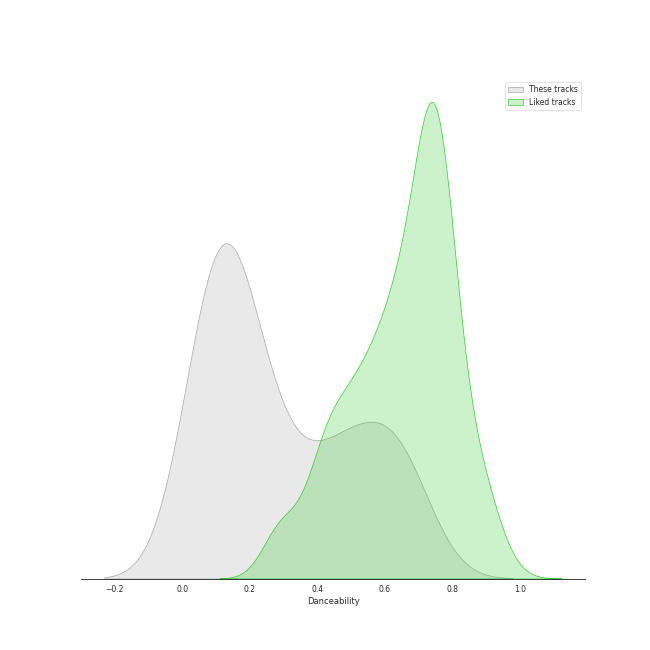
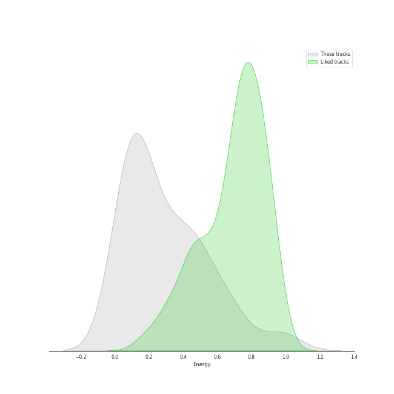
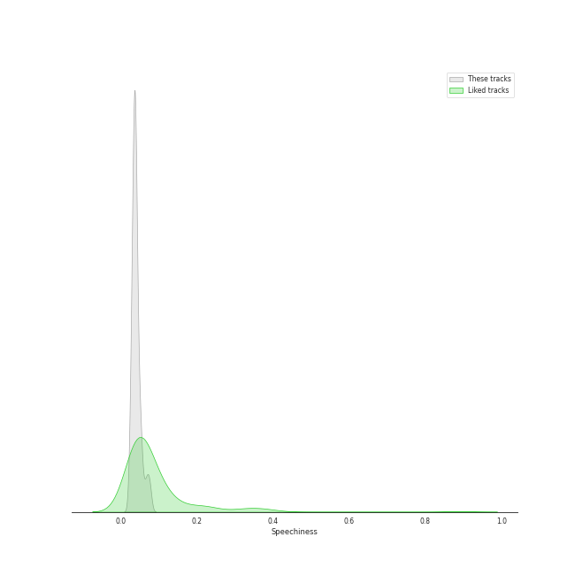
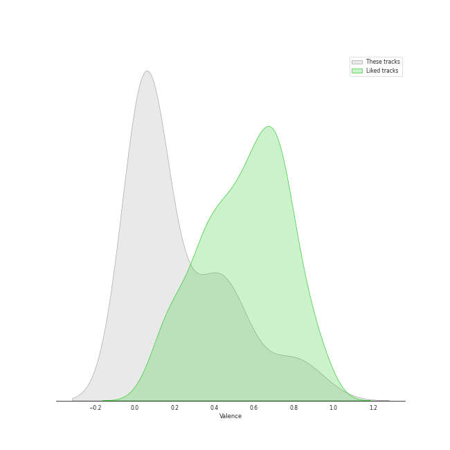
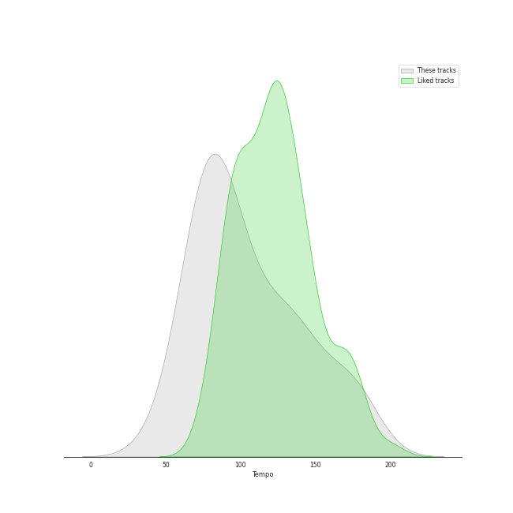

# Audio Features for Reprise

## Danceability

| 10 most Danceable tracks | 10 least Danceable tracks |
|:---|:---|
| Everything (0.686) | The Christmas Song (0.226) |
| Someday (feat. Meghan Trainor) (0.671) | Can't Help Falling in Love (0.234) |
| The Best Is yet to Come (0.647) | It's Beginning to Look a Lot like Christmas (0.339) |
| The Way You Look Tonight (0.642) | The Motherload (0.363) |
| Santa Baby (0.641) | American Idiot (0.38) |
| Call Me Irresponsible (0.639) | Cry Me a River (0.458) |
| Haven't Met You Yet (0.615) | La vie en rose (feat. Cécile McLorin Salvant) (0.459) |
| Home (0.608) | Good Riddance (Time of Your Life) (0.475) |
| Moondance (0.583) | Frosty the Snowman (feat. The Puppini Sisters) (0.49) |
| Feeling Good (0.535) | Boulevard of Broken Dreams (0.496) |

## Energy

| 10 most Energetic tracks | 10 least Energetic tracks |
|:---|:---|
| American Idiot (0.988) | Santa Baby (0.0964) |
| The Motherload (0.971) | The Christmas Song (0.17) |
| Haven't Met You Yet (0.733) | It's Beginning to Look a Lot like Christmas (0.214) |
| Everything (0.688) | La vie en rose (feat. Cécile McLorin Salvant) (0.267) |
| Boulevard of Broken Dreams (0.682) | Can't Help Falling in Love (0.316) |
| Moondance (0.614) | The Best Is yet to Come (0.347) |
| Frosty the Snowman (feat. The Puppini Sisters) (0.591) | Home (0.403) |
| Feeling Good (0.548) | Call Me Irresponsible (0.43) |
| Someday (feat. Meghan Trainor) (0.539) | Good Riddance (Time of Your Life) (0.432) |
| Cry Me a River (0.483) | The Way You Look Tonight (0.483) |

## Speechiness

| 10 most Speechy tracks | 10 least Speechy tracks |
|:---|:---|
| The Motherload (0.0776) | Everything (0.0254) |
| Moondance (0.0737) | The Way You Look Tonight (0.028) |
| The Best Is yet to Come (0.0691) | Call Me Irresponsible (0.0292) |
| American Idiot (0.0639) | Can't Help Falling in Love (0.0293) |
| Frosty the Snowman (feat. The Puppini Sisters) (0.0515) | La vie en rose (feat. Cécile McLorin Salvant) (0.0294) |
| Santa Baby (0.0399) | Boulevard of Broken Dreams (0.0294) |
| Someday (feat. Meghan Trainor) (0.0392) | Home (0.0301) |
| It's Beginning to Look a Lot like Christmas (0.0375) | Good Riddance (Time of Your Life) (0.0302) |
| Feeling Good (0.037) | Haven't Met You Yet (0.0335) |
| Cry Me a River (0.0366) | The Christmas Song (0.0336) |

## Acousticness

| 10 most Acoustic tracks | 10 least Acoustic tracks |
|:---|:---|
| It's Beginning to Look a Lot like Christmas (0.908) | The Motherload (7.1e-06) |
| The Christmas Song (0.872) | American Idiot (2.64e-05) |
| Home (0.853) | Boulevard of Broken Dreams (0.00552) |
| Santa Baby (0.835) | Haven't Met You Yet (0.152) |
| La vie en rose (feat. Cécile McLorin Salvant) (0.807) | Someday (feat. Meghan Trainor) (0.18) |
| Can't Help Falling in Love (0.74) | Good Riddance (Time of Your Life) (0.183) |
| Frosty the Snowman (feat. The Puppini Sisters) (0.661) | The Best Is yet to Come (0.355) |
| Moondance (0.627) | Everything (0.39) |
| Cry Me a River (0.624) | Feeling Good (0.533) |
| Call Me Irresponsible (0.585) | The Way You Look Tonight (0.549) |

## Instrumentalness

| 10 most Instrumental tracks | 10 least Instrumental tracks |
|:---|:---|
| Can't Help Falling in Love (0.0111) | Someday (feat. Meghan Trainor) (0.0) |
| The Motherload (0.00358) | La vie en rose (feat. Cécile McLorin Salvant) (0.0) |
| The Way You Look Tonight (0.000282) | Moondance (0.0) |
| The Christmas Song (0.000119) | Frosty the Snowman (feat. The Puppini Sisters) (0.0) |
| Call Me Irresponsible (8.68e-05) | Haven't Met You Yet (0.0) |
| American Idiot (7.86e-05) | The Best Is yet to Come (0.0) |
| Santa Baby (2.95e-05) | Good Riddance (Time of Your Life) (0.0) |
| Boulevard of Broken Dreams (2.94e-05) | Everything (1.03e-06) |
| Home (1.04e-05) | Feeling Good (1.48e-06) |
| It's Beginning to Look a Lot like Christmas (7.47e-06) | Cry Me a River (5.62e-06) |

## Liveness

| 10 most Live tracks | 10 least Live tracks |
|:---|:---|
| Moondance (0.401) | Boulevard of Broken Dreams (0.0589) |
| American Idiot (0.368) | Someday (feat. Meghan Trainor) (0.0748) |
| It's Beginning to Look a Lot like Christmas (0.341) | Cry Me a River (0.0754) |
| The Best Is yet to Come (0.296) | The Motherload (0.0797) |
| The Way You Look Tonight (0.251) | Can't Help Falling in Love (0.0922) |
| Frosty the Snowman (feat. The Puppini Sisters) (0.249) | Everything (0.0924) |
| Good Riddance (Time of Your Life) (0.161) | The Christmas Song (0.102) |
| Feeling Good (0.123) | Call Me Irresponsible (0.109) |
| La vie en rose (feat. Cécile McLorin Salvant) (0.119) | Haven't Met You Yet (0.109) |
| Home (0.114) | Santa Baby (0.11) |

## Valence

| 10 most Happy tracks | 10 least Happy tracks |
|:---|:---|
| Someday (feat. Meghan Trainor) (0.934) | Can't Help Falling in Love (0.0969) |
| Frosty the Snowman (feat. The Puppini Sisters) (0.829) | The Christmas Song (0.162) |
| Haven't Met You Yet (0.796) | Home (0.34) |
| American Idiot (0.769) | La vie en rose (feat. Cécile McLorin Salvant) (0.342) |
| Good Riddance (Time of Your Life) (0.648) | The Motherload (0.347) |
| Cry Me a River (0.513) | Santa Baby (0.357) |
| Everything (0.493) | It's Beginning to Look a Lot like Christmas (0.363) |
| The Best Is yet to Come (0.484) | Call Me Irresponsible (0.39) |
| Moondance (0.482) | The Way You Look Tonight (0.452) |
| Feeling Good (0.477) | Boulevard of Broken Dreams (0.474) |

## Tempo

| 10 most Fast tracks | 10 least Fast tracks |
|:---|:---|
| American Idiot (186.113) | La vie en rose (feat. Cécile McLorin Salvant) (63.378) |
| Can't Help Falling in Love (174.036) | Santa Baby (76.273) |
| Boulevard of Broken Dreams (167.06) | Good Riddance (Time of Your Life) (94.605) |
| The Christmas Song (163.863) | It's Beginning to Look a Lot like Christmas (94.775) |
| Frosty the Snowman (feat. The Puppini Sisters) (147.381) | Someday (feat. Meghan Trainor) (94.98) |
| The Motherload (146.018) | Cry Me a River (104.823) |
| Moondance (140.736) | Call Me Irresponsible (107.996) |
| Home (127.593) | The Way You Look Tonight (109.995) |
| Everything (123.125) | Feeling Good (115.144) |
| Haven't Met You Yet (122.58) | The Best Is yet to Come (121.026) |
