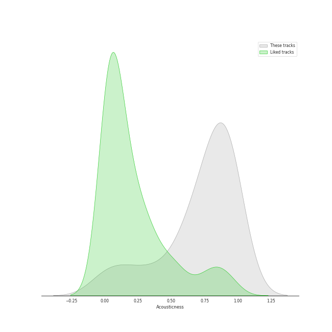
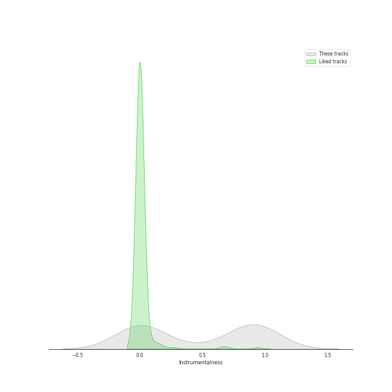
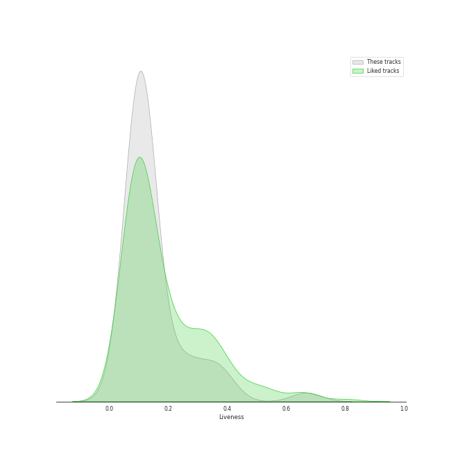

# Track Features for Reprise

## Danceability

| ​ | 10 most Danceable tracks | ​​ | 10 least Danceable tracks |
|:---|:---|:---|:---|
|  | Everything (0.686) |  | Anduril (0.0607) |
|  | Someday (feat. Meghan Trainor) (0.671) |  | Many Meetings (0.0623) |
|  | The Best Is yet to Come (0.647) |  | The Grey Havens (feat. Sir James Galway) (0.0633) |
|  | The Way You Look Tonight (0.642) |  | Samwise the Brave (0.0646) |
|  | Santa Baby (0.641) |  | Twilight and Shadow (feat. Renee Fleming) (0.0693) |
|  | Call Me Irresponsible (0.639) |  | The White Tree (0.0699) |
|  | Haven't Met You Yet (0.615) |  | The Prophecy (0.0735) |
|  | Home (0.608) |  | The Return of the King (feat. Sir James Galway, Viggo Mortensen and Renee Fleming) (0.0754) |
|  | Moondance (0.583) |  | Foundations of Stone (0.0844) |
|  | Feeling Good (0.535) |  | Helm's Deep (0.103) |

## Energy

| ​ | 10 most Energetic tracks | ​​ | 10 least Energetic tracks |
|:---|:---|:---|:---|
|  | American Idiot (0.988) |  | Into the West (0.031) |
|  | The Motherload (0.971) |  | Evenstar (0.0407) |
|  | Haven't Met You Yet (0.733) |  | The Grey Havens (feat. Sir James Galway) (0.0427) |
|  | Everything (0.688) |  | Breath of Life (0.044) |
|  | Boulevard of Broken Dreams (0.682) |  | Hope and Memory (0.0586) |
|  | Moondance (0.614) |  | Concerning Hobbits (0.0629) |
|  | Frosty the Snowman (feat. The Puppini Sisters) (0.591) |  | The Prophecy (0.0657) |
|  | Feeling Good (0.548) |  | Twilight and Shadow (feat. Renee Fleming) (0.0663) |
|  | Someday (feat. Meghan Trainor) (0.539) |  | The Return of the King (feat. Sir James Galway, Viggo Mortensen and Renee Fleming) (0.0693) |
|  | The Bridge of Khazad Dum (0.492) |  | The King of the Golden Hall (0.074) |

## Speechiness

| ​ | 10 most Speechy tracks | ​​ | 10 least Speechy tracks |
|:---|:---|:---|:---|
|  | The Motherload (0.0776) |  | Everything (0.0254) |
|  | Moondance (0.0737) |  | The Way You Look Tonight (0.028) |
|  | The Best Is yet to Come (0.0691) |  | Call Me Irresponsible (0.0292) |
|  | American Idiot (0.0639) |  | Can't Help Falling in Love (0.0293) |
|  | Foundations of Stone (0.0548) |  | La vie en rose (feat. Cécile McLorin Salvant) (0.0294) |
|  | The Bridge of Khazad Dum (0.0544) |  | Boulevard of Broken Dreams (0.0294) |
|  | The Council of Elrond (feat. "Aniron") [Theme for Aragorn and Arwen] (0.0517) |  | Home (0.0301) |
|  | Frosty the Snowman (feat. The Puppini Sisters) (0.0515) |  | Good Riddance (Time of Your Life) (0.0302) |
|  | Helm's Deep (0.0505) |  | Haven't Met You Yet (0.0335) |
|  | Many Meetings (0.0459) |  | The Christmas Song (0.0336) |

## Acousticness

| ​ | 10 most Acoustic tracks | ​​ | 10 least Acoustic tracks |
|:---|:---|:---|:---|
|  | Many Meetings (0.982) |  | The Motherload (7.1e-06) |
|  | The Council of Elrond (feat. "Aniron") [Theme for Aragorn and Arwen] (0.979) |  | American Idiot (2.64e-05) |
|  | May It Be (0.974) |  | Boulevard of Broken Dreams (0.00552) |
|  | Twilight and Shadow (feat. Renee Fleming) (0.97) |  | Haven't Met You Yet (0.152) |
|  | Evenstar (0.96) |  | Someday (feat. Meghan Trainor) (0.18) |
|  | The Grey Havens (feat. Sir James Galway) (0.955) |  | Good Riddance (Time of Your Life) (0.183) |
|  | The Prophecy (0.947) |  | The Best Is yet to Come (0.355) |
|  | The Steward of Gondor (feat. Billy Boyd) (0.945) |  | The Bridge of Khazad Dum (0.36) |
|  | Breath of Life (0.928) |  | Everything (0.39) |
|  | Anduril (0.922) |  | Feeling Good (0.533) |

## Instrumentalness

| ​ | 10 most Instrumental tracks | ​​ | 10 least Instrumental tracks |
|:---|:---|:---|:---|
|  | The Grey Havens (feat. Sir James Galway) (0.976) |  | Someday (feat. Meghan Trainor) (0.0) |
|  | Forth Eorlingas (0.962) |  | La vie en rose (feat. Cécile McLorin Salvant) (0.0) |
|  | Hope and Memory (0.962) |  | Moondance (0.0) |
|  | The Prophecy (0.958) |  | Frosty the Snowman (feat. The Puppini Sisters) (0.0) |
|  | The White Rider (0.955) |  | Haven't Met You Yet (0.0) |
|  | Helm's Deep (0.953) |  | The Best Is yet to Come (0.0) |
|  | Twilight and Shadow (feat. Renee Fleming) (0.948) |  | Good Riddance (Time of Your Life) (0.0) |
|  | Anduril (0.941) |  | Everything (1.03e-06) |
|  | Many Meetings (0.934) |  | Feeling Good (1.48e-06) |
|  | Lothlorien (feat. "Lament for Gandalf") (0.928) |  | Cry Me a River (5.62e-06) |

## Liveness

| ​ | 10 most Live tracks | ​​ | 10 least Live tracks |
|:---|:---|:---|:---|
|  | Anduril (0.669) |  | Foundations of Stone (0.0507) |
|  | Moondance (0.401) |  | Boulevard of Broken Dreams (0.0589) |
|  | American Idiot (0.368) |  | The White Tree (0.064) |
|  | The Return of the King (feat. Sir James Galway, Viggo Mortensen and Renee Fleming) (0.363) |  | Someday (feat. Meghan Trainor) (0.0748) |
|  | It's Beginning to Look a Lot like Christmas (0.341) |  | Cry Me a River (0.0754) |
|  | The Best Is yet to Come (0.296) |  | The Motherload (0.0797) |
|  | The Prophecy (0.258) |  | The Ride of the Rohirrim (0.0891) |
|  | The Way You Look Tonight (0.251) |  | Gollum's Song (0.0903) |
|  | Frosty the Snowman (feat. The Puppini Sisters) (0.249) |  | May It Be (0.0907) |
|  | The Bridge of Khazad Dum (0.202) |  | Can't Help Falling in Love (0.0922) |

## Valence

| ​ | 10 most Happy tracks | ​​ | 10 least Happy tracks |
|:---|:---|:---|:---|
|  | Someday (feat. Meghan Trainor) (0.934) |  | Anduril (0.0315) |
|  | Frosty the Snowman (feat. The Puppini Sisters) (0.829) |  | The Prophecy (0.0317) |
|  | Haven't Met You Yet (0.796) |  | Lothlorien (feat. "Lament for Gandalf") (0.0328) |
|  | American Idiot (0.769) |  | Evenstar (0.0342) |
|  | Good Riddance (Time of Your Life) (0.648) |  | The Grey Havens (feat. Sir James Galway) (0.0345) |
|  | Cry Me a River (0.513) |  | The King of the Golden Hall (0.0346) |
|  | Everything (0.493) |  | The Shadow of the Past (0.0353) |
|  | The Best Is yet to Come (0.484) |  | Many Meetings (0.0359) |
|  | Moondance (0.482) |  | The Return of the King (feat. Sir James Galway, Viggo Mortensen and Renee Fleming) (0.0363) |
|  | Feeling Good (0.477) |  | Breath of Life (0.0364) |

## Tempo

| ​ | 10 most Fast tracks | ​​ | 10 least Fast tracks |
|:---|:---|:---|:---|
|  | American Idiot (186.113) |  | Anduril (43.741) |
|  | The Prophecy (177.549) |  | The Grey Havens (feat. Sir James Galway) (57.72) |
|  | Helm's Deep (174.453) |  | La vie en rose (feat. Cécile McLorin Salvant) (63.378) |
|  | Can't Help Falling in Love (174.036) |  | Many Meetings (64.791) |
|  | Boulevard of Broken Dreams (167.06) |  | Samwise the Brave (65.689) |
|  | The Christmas Song (163.863) |  | Hope and Memory (69.165) |
|  | Frosty the Snowman (feat. The Puppini Sisters) (147.381) |  | A Storm Is Coming (72.277) |
|  | The Motherload (146.018) |  | The White Tree (72.355) |
|  | The Shadow of the Past (144.708) |  | Breath of Life (73.724) |
|  | Moondance (140.736) |  | Twilight and Shadow (feat. Renee Fleming) (74.251) |
