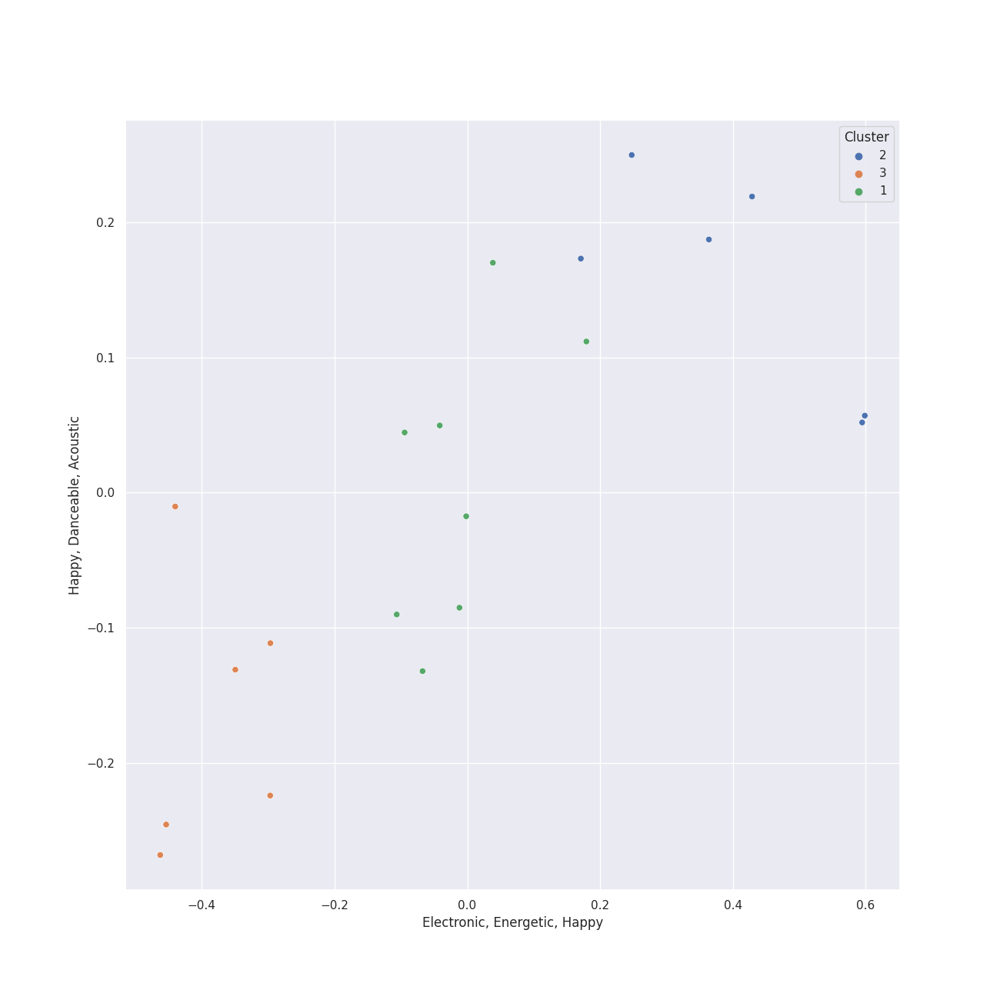

# Clusters in Reprise

## Cluster #1

14 tracks

| Art | Track | Album | Artists | Label | Rank | 💚 | 🔗 |
|:---|:---|:---|:---|:---|---:|:---|:---|
|  | Everything | Call Me Irresponsible | [Michael Bublé](../../../../artists/michael_bublé/overview.md) | [143](../../../143), [Reprise](../..) | nan | 💚 | [🔗](https://open.spotify.com/track/4T6HLdP6OcAtqC6tGnQelG) |
|  | The Best Is yet to Come | Call Me Irresponsible | [Michael Bublé](../../../../artists/michael_bublé/overview.md) | [143](../../../143), [Reprise](../..) | nan | | [🔗](https://open.spotify.com/track/56t3m0lqE6zU1EfgFOPqst) |
|  | Moondance | Michael Bublé | [Michael Bublé](../../../../artists/michael_bublé/overview.md) | [143](../../../143), [Reprise](../..) | 742 | 💚 | [🔗](https://open.spotify.com/track/25Yzff59UGjz7wNWmjM39h) |
|  | The Way You Look Tonight | Michael Bublé | [Michael Bublé](../../../../artists/michael_bublé/overview.md) | [143](../../../143), [Reprise](../..) | nan | | [🔗](https://open.spotify.com/track/4YGlRLe6TeBRiXFByBqldf) |
|  | Frosty the Snowman (feat. The Puppini Sisters) | Christmas (Deluxe Special Edition) | [Michael Bublé](../../../../artists/michael_bublé/overview.md), The Puppini Sisters | [143](../../../143), [Reprise](../..) | 580 | | [🔗](https://open.spotify.com/track/27TJMHguLnuW3y2UPqXeC2) |
|  | Feeling Good | It's Time | [Michael Bublé](../../../../artists/michael_bublé/overview.md) | [143](../../../143), [Reprise](../..) | 632 | 💚 | [🔗](https://open.spotify.com/track/72PwtNhRrZXNnYeRg5xQ46) |
|  | Haven't Met You Yet | Crazy Love | [Michael Bublé](../../../../artists/michael_bublé/overview.md) | [143](../../../143), [Reprise](../..) | nan | 💚 | [🔗](https://open.spotify.com/track/4fIWvT19w9PR0VVBuPYpWA) |
|  | Cry Me a River | Crazy Love | [Michael Bublé](../../../../artists/michael_bublé/overview.md) | [143](../../../143), [Reprise](../..) | nan | | [🔗](https://open.spotify.com/track/5i04Jy87RLxoZszJqY3QAN) |
|  | Boulevard of Broken Dreams | Greatest Hits: God's Favorite Band | Green Day | [Reprise](../..) | nan | | [🔗](https://open.spotify.com/track/5GorCbAP4aL0EJ16frG2hd) |
|  | Good Riddance (Time of Your Life) | Nimrod | Green Day | [Reprise](../..) | nan | | [🔗](https://open.spotify.com/track/6ORqU0bHbVCRjXm9AjyHyZ) |
## Cluster #2

25 tracks

| Art | Track | Album | Artists | Label | Rank | 💚 | 🔗 |
|:---|:---|:---|:---|:---|---:|:---|:---|
|  | A Storm Is Coming | The Lord of the Rings: The Return of the King (Original Motion Picture Soundtrack) | Howard Shore | [Reprise](../..) | nan | | [🔗](https://open.spotify.com/track/0wicJTv0Jv3xLp37FLb8Eh) |
|  | Samwise the Brave | The Lord of the Rings: The Two Towers (Original Motion Picture Soundtrack) | Howard Shore | [Reprise](../..) | nan | | [🔗](https://open.spotify.com/track/0TpzAepHab0NofzyqV6As8) |
|  | Treebeard | The Lord of the Rings: The Two Towers (Original Motion Picture Soundtrack) | Howard Shore | [Reprise](../..) | nan | | [🔗](https://open.spotify.com/track/1ssKMFrOyRUa0hn2nFvRnR) |
|  | The White Rider | The Lord of the Rings: The Two Towers (Original Motion Picture Soundtrack) | Howard Shore | [Reprise](../..) | nan | | [🔗](https://open.spotify.com/track/4cnKkXvh0WiFvk0tibAgRW) |
|  | Many Meetings | The Lord of the Rings: The Fellowship of the Ring (Original Motion Picture Soundtrack) | Howard Shore | [Reprise](../..) | nan | | [🔗](https://open.spotify.com/track/0VfcYOujgf9JDAgwlgu1qm) |
|  | The Shadow of the Past | The Lord of the Rings: The Fellowship of the Ring (Original Motion Picture Soundtrack) | Howard Shore | [Reprise](../..) | nan | | [🔗](https://open.spotify.com/track/2TZOJDEX0TajN8wsUVvz3W) |
|  | The Council of Elrond (feat. "Aniron") [Theme for Aragorn and Arwen] | The Lord of the Rings: The Fellowship of the Ring (Original Motion Picture Soundtrack) | Howard Shore, Enya | [Reprise](../..) | nan | | [🔗](https://open.spotify.com/track/3Knohqfb9jeYzL6wMZiWLM) |
|  | Lothlorien (feat. "Lament for Gandalf") | The Lord of the Rings: The Fellowship of the Ring (Original Motion Picture Soundtrack) | Howard Shore, Elizabeth Fraser | [Reprise](../..) | nan | | [🔗](https://open.spotify.com/track/63CXPpiEiW7JnXvZ1cUXcp) |
|  | The Prophecy | The Lord of the Rings: The Fellowship of the Ring (Original Motion Picture Soundtrack) | Howard Shore | [Reprise](../..) | nan | | [🔗](https://open.spotify.com/track/6ANHfvTsKVUMQD1xD2VAMr) |
|  | The Ring Goes South | The Lord of the Rings: The Fellowship of the Ring (Original Motion Picture Soundtrack) | Howard Shore | [Reprise](../..) | nan | | [🔗](https://open.spotify.com/track/6IQY3GEMC2B3mchMvi4NZj) |
## Cluster #3

11 tracks

| Art | Track | Album | Artists | Label | Rank | 💚 | 🔗 |
|:---|:---|:---|:---|:---|---:|:---|:---|
|  | The Steward of Gondor (feat. Billy Boyd) | The Lord of the Rings: The Return of the King (Original Motion Picture Soundtrack) | Howard Shore, Billy Boyd | [Reprise](../..) | 688 | | [🔗](https://open.spotify.com/track/227hmntzKpN4CsYt3RVKcC) |
|  | Into the West | The Lord of the Rings: The Return of the King (Original Motion Picture Soundtrack) | Annie Lennox | [Reprise](../..) | nan | | [🔗](https://open.spotify.com/track/0gSEyG7pOFuHM05433EibX) |
|  | Gollum's Song | The Lord of the Rings: The Two Towers (Original Motion Picture Soundtrack) | Emilíana Torrini | [Reprise](../..) | nan | | [🔗](https://open.spotify.com/track/0mQ1btcyqFDvTpaCFs04cR) |
|  | May It Be | The Lord of the Rings: The Fellowship of the Ring (Original Motion Picture Soundtrack) | Enya | [Reprise](../..) | nan | | [🔗](https://open.spotify.com/track/7LAJWSKK8JMIZAcblgUMS6) |
|  | La vie en rose (feat. Cécile McLorin Salvant) | love (Deluxe Edition) | [Michael Bublé](../../../../artists/michael_bublé/overview.md), Cécile McLorin Salvant | [Reprise](../..) | nan | | [🔗](https://open.spotify.com/track/1QELw50Dl95LusF6uOkDqk) |
|  | Santa Baby | Christmas (Deluxe Special Edition) | [Michael Bublé](../../../../artists/michael_bublé/overview.md) | [143](../../../143), [Reprise](../..) | nan | | [🔗](https://open.spotify.com/track/3m2gfwcxl77ojJTWH3wZkb) |
|  | The Christmas Song | Christmas (Deluxe Special Edition) | [Michael Bublé](../../../../artists/michael_bublé/overview.md) | [143](../../../143), [Reprise](../..) | nan | | [🔗](https://open.spotify.com/track/4SWAozNLRfZXF25ghKqm2q) |
|  | It's Beginning to Look a Lot like Christmas | Christmas (Deluxe Special Edition) | [Michael Bublé](../../../../artists/michael_bublé/overview.md) | [143](../../../143), [Reprise](../..) | 715 | | [🔗](https://open.spotify.com/track/5a1iz510sv2W9Dt1MvFd5R) |
|  | Home | It's Time | [Michael Bublé](../../../../artists/michael_bublé/overview.md) | [143](../../../143), [Reprise](../..) | nan | 💚 | [🔗](https://open.spotify.com/track/3ISaSNZCxIzTGwQuBq6Xrr) |
|  | Can't Help Falling in Love | Come Fly with Me | [Michael Bublé](../../../../artists/michael_bublé/overview.md) | [143](../../../143), [Reprise](../..) | nan | | [🔗](https://open.spotify.com/track/7igk58Vs9uM2B0aaTUwv6F) |