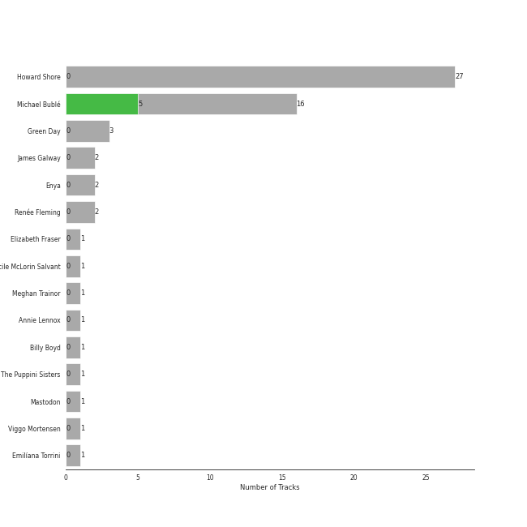
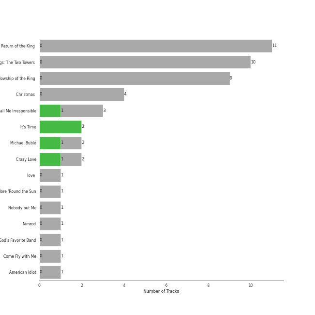
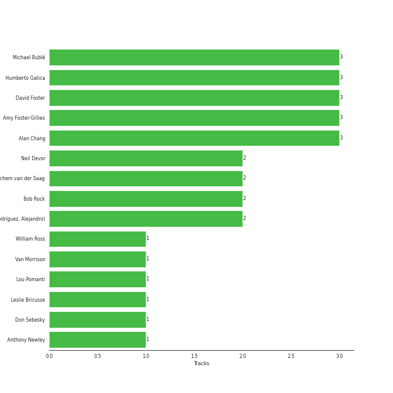

# Reprise

50 songs

[See Track Features](audio_features.md)

[See Clusters](clusters/overview.md)

Appears as:
- Reprise (36 tracks)
- 143/Reprise (14 tracks)

## Top Artists

| Art | Rank | Tracks | 💚 | Artist | 🔗 |
|:---|---:|---:|---:|:---|:---|
|  | 94 | 16 | 5 | [Michael Bublé](../../artists/michael_bublé/overview.md) | [🔗](https://open.spotify.com/artist/1GxkXlMwML1oSg5eLPiAz3) |
|  | 45 | 27 | 0 | Howard Shore | [🔗](https://open.spotify.com/artist/0OcclcP5o8VKH2TRqSY2A7) |
|  | 156 | 3 | 0 | Green Day | [🔗](https://open.spotify.com/artist/7oPftvlwr6VrsViSDV7fJY) |
|  | 427 | 2 | 0 | James Galway | [🔗](https://open.spotify.com/artist/774mHr909NkDVeyyXQBQfZ) |
|  | 427 | 2 | 0 | Enya | [🔗](https://open.spotify.com/artist/6uothxMWeLWIhsGeF7cyo4) |
|  | 427 | 2 | 0 | Renée Fleming | [🔗](https://open.spotify.com/artist/3SK3gLBgy1jRuA4VnLlcs8) |
|  | 427 | 1 | 0 | Elizabeth Fraser | [🔗](https://open.spotify.com/artist/791Z3924aa619hZ3xsOJEx) |
|  | 427 | 1 | 0 | Cécile McLorin Salvant | [🔗](https://open.spotify.com/artist/6PkSULcbxFKkxdgrmPGAvn) |
|  | 427 | 1 | 0 | Meghan Trainor | [🔗](https://open.spotify.com/artist/6JL8zeS1NmiOftqZTRgdTz) |
|  | 427 | 1 | 0 | Annie Lennox | [🔗](https://open.spotify.com/artist/5MspMQqdVbdwP6ax3GXqum) |

See all 15 artists

| Art | Rank | Tracks | 💚 | Artist | 🔗 |
|:---|---:|---:|---:|:---|:---|
|  | 404 | 1 | 0 | Billy Boyd | [🔗](https://open.spotify.com/artist/1wTKlkGklPb1JMTVUIwAoj) |
|  | 358 | 1 | 0 | The Puppini Sisters | [🔗](https://open.spotify.com/artist/1svaANJTE5KrG16fTGDqOs) |
|  | 427 | 1 | 0 | Mastodon | [🔗](https://open.spotify.com/artist/1Dvfqq39HxvCJ3GvfeIFuT) |
|  | 427 | 1 | 0 | Viggo Mortensen | [🔗](https://open.spotify.com/artist/11habIRpXVkScDFp3rJrgu) |
|  | 427 | 1 | 0 | Emilíana Torrini | [🔗](https://open.spotify.com/artist/08j69Ndyx1P7RLO3Janb5P) |

## Top Albums

| Art | Rank | Tracks | 💚 | Album | Release Date | 🔗 |
|:---|---:|---:|---:|:---|:---|:---|
|  | 306 | 11 | 0 | The Lord of the Rings: The Return of the King (Original Motion Picture Soundtrack) | 2003-11-24 | [🔗](https://open.spotify.com/album/38x0H9PdY1fHh8EdfPUXqa) |
|  | 630 | 10 | 0 | The Lord of the Rings: The Two Towers (Original Motion Picture Soundtrack) | 2002-12-02 | [🔗](https://open.spotify.com/album/1zIoYLpYOq8d4HFzHJ7vc8) |
|  | 630 | 9 | 0 | The Lord of the Rings: The Fellowship of the Ring (Original Motion Picture Soundtrack) | 2001-11-19 | [🔗](https://open.spotify.com/album/04rz93AqGy9JduzV3K81Dh) |
|  | 489 | 4 | 0 | Christmas (Deluxe Special Edition) | 2012-11-09 | [🔗](https://open.spotify.com/album/7uVimUILdzSZG4KKKWToq0) |
|  | 630 | 3 | 1 | Call Me Irresponsible | 2007-04-27 | [🔗](https://open.spotify.com/album/3h4pyWRJIB9ZyRKXChbX22) |
|  | 537 | 2 | 2 | It's Time | 2005-02-08 | [🔗](https://open.spotify.com/album/457fktVFXVwjQTl9wOLlfg) |
|  | 619 | 2 | 1 | Michael Bublé | 2003 | [🔗](https://open.spotify.com/album/3rpSksJSFdNFqk5vne8at2) |
|  | 630 | 2 | 1 | Crazy Love | 2009-10-06 | [🔗](https://open.spotify.com/album/3MXDonOIzrIrCh0HvlACyj) |
|  | 630 | 1 | 0 | love (Deluxe Edition) | 2018-11-16 | [🔗](https://open.spotify.com/album/68xKnVblFsSQ48CtgZT0oY) |
|  | 630 | 1 | 0 | Once More 'Round the Sun | 2014-06-20 | [🔗](https://open.spotify.com/album/7mEkBi9a2p2f1WQbnH8Qk5) |

See all 15 albums

| Art | Rank | Tracks | 💚 | Album | Release Date | 🔗 |
|:---|---:|---:|---:|:---|:---|:---|
|  | 630 | 1 | 0 | Nobody but Me | 2016-10-21 | [🔗](https://open.spotify.com/album/5wN1OizIFEHDUkRwzIK3wL) |
|  | 630 | 1 | 0 | Nimrod | 1997-10-14 | [🔗](https://open.spotify.com/album/3x2uer6Xh0d5rF8toWpRDA) |
|  | 630 | 1 | 0 | Greatest Hits: God's Favorite Band | 2017-11-17 | [🔗](https://open.spotify.com/album/3id4t9IqRoB1f1smOERtrY) |
|  | 630 | 1 | 0 | Come Fly with Me | 2004-03-30 | [🔗](https://open.spotify.com/album/0UhvDeKmtgegXeELEVgGRh) |
|  | 630 | 1 | 0 | American Idiot | 2004-09-21 | [🔗](https://open.spotify.com/album/5dN7F9DV0Qg1XRdIgW8rke) |

## Genres

| Tracks | 💚 | Genre |
|---:|---:|:---|
| 16 | 5 | [lounge](../../genres/lounge/overview.md) |
| 16 | 5 | jazz pop |
| 16 | 5 | [canadian pop](../../genres/canadian_pop/overview.md) |
| 16 | 5 | [adult standards](../../genres/adult_standards/overview.md) |
| 27 | 0 | [soundtrack](../../genres/soundtrack/overview.md) |
| 27 | 0 | scorecore |
| 27 | 0 | orchestral soundtrack |
| 27 | 0 | middle earth |
| 27 | 0 | canadian soundtrack |
| 27 | 0 | canadian classical |

See all 34 genres

| Tracks | 💚 | Genre |
|---:|---:|:---|
| 3 | 0 | [rock](../../genres/rock/overview.md) |
| 3 | 0 | punk |
| 3 | 0 | [permanent wave](../../genres/permanent_wave/overview.md) |
| 3 | 0 | [modern rock](../../genres/modern_rock/overview.md) |
| 1 | 0 | synthpop |
| 1 | 0 | stoner rock |
| 1 | 0 | stoner metal |
| 1 | 0 | [soft rock](../../genres/soft_rock/overview.md) |
| 1 | 0 | sludge metal |
| 1 | 0 | [singer-songwriter](../../genres/singer-songwriter/overview.md) |
| 1 | 0 | progressive sludge |
| 1 | 0 | progressive groove metal |
| 1 | 0 | operatic pop |
| 1 | 0 | new wave pop |
| 1 | 0 | new wave |
| 1 | 0 | new romantic |
| 1 | 0 | metal |
| 1 | 0 | icelandic singer-songwriter |
| 1 | 0 | icelandic pop |
| 1 | 0 | icelandic indie |
| 1 | 0 | gregorian dance |
| 1 | 0 | celtic |
| 1 | 0 | atlanta metal |
| 1 | 0 | alternative metal |

## Top Producers

| Art | Producer | Tracks | Credit Types |
|:---|:---|---:|:---|
| | David Foster | 3 | Producer, Arranger |
| | Amy Foster-Gillies | 3 | Songwriter |
|  | [Michael Bublé](../../artists/michael_bublé/overview.md) | 3 | Songwriter, Arranger |
| | Humberto Gatica | 3 | Producer |
| | Alan Chang | 3 | Songwriter, Arranger |
| | Bob Rock | 2 | Producer, Arranger |
| | Alejandro Rodríguez (Rodríguez, Alejandro) | 2 | Producer |
| | Jochem van der Saag | 2 | Producer |
| | Neil Devor | 2 | Producer |
| | Leslie Bricusse | 1 | Songwriter |

View all

| Art | Producer | Tracks | Credit Types |
|:---|:---|---:|:---|
| | Don Sebesky | 1 | Arranger |
| | William Ross | 1 | Arranger |
| | Lou Pomanti | 1 | Arranger |
| | Anthony Newley | 1 | Songwriter |
|  | Van Morrison | 1 | Lyricist, Songwriter |

## Tracks released under Reprise

| Art | Track | Album | Artists | Label | Rank | 💚 | 🔗 |
|:---|:---|:---|:---|:---|---:|:---|:---|
|  | Anduril | The Lord of the Rings: The Return of the King (Original Motion Picture Soundtrack) | Howard Shore | [Reprise](.) | 441 | | [🔗](https://open.spotify.com/track/6GO5qVDkPvw2vr07pQChmZ) |
|  | Frosty the Snowman (feat. The Puppini Sisters) | Christmas (Deluxe Special Edition) | [Michael Bublé](../../artists/michael_bublé/overview.md), The Puppini Sisters | [143](../143), [Reprise](.) | 742 | | [🔗](https://open.spotify.com/track/27TJMHguLnuW3y2UPqXeC2) |
|  | Feeling Good | It's Time | [Michael Bublé](../../artists/michael_bublé/overview.md) | [143](../143), [Reprise](.) | 806 | 💚 | [🔗](https://open.spotify.com/track/72PwtNhRrZXNnYeRg5xQ46) |
|  | The Steward of Gondor (feat. Billy Boyd) | The Lord of the Rings: The Return of the King (Original Motion Picture Soundtrack) | Howard Shore, Billy Boyd | [Reprise](.) | 878 | | [🔗](https://open.spotify.com/track/227hmntzKpN4CsYt3RVKcC) |
|  | It's Beginning to Look a Lot like Christmas | Christmas (Deluxe Special Edition) | [Michael Bublé](../../artists/michael_bublé/overview.md) | [143](../143), [Reprise](.) | 912 | | [🔗](https://open.spotify.com/track/5a1iz510sv2W9Dt1MvFd5R) |
|  | Moondance | Michael Bublé | [Michael Bublé](../../artists/michael_bublé/overview.md) | [143](../143), [Reprise](.) | 947 | 💚 | [🔗](https://open.spotify.com/track/25Yzff59UGjz7wNWmjM39h) |
|  | Good Riddance (Time of Your Life) | Nimrod | Green Day | [Reprise](.) | 955 | | [🔗](https://open.spotify.com/track/6ORqU0bHbVCRjXm9AjyHyZ) |
|  | Concerning Hobbits | The Lord of the Rings: The Fellowship of the Ring (Original Motion Picture Soundtrack) | Howard Shore | [Reprise](.) | 955 | | [🔗](https://open.spotify.com/track/644es5aYPJghtZLjM1rmSP) |
|  | Lothlorien (feat. "Lament for Gandalf") | The Lord of the Rings: The Fellowship of the Ring (Original Motion Picture Soundtrack) | Howard Shore, Elizabeth Fraser | [Reprise](.) | 955 | | [🔗](https://open.spotify.com/track/63CXPpiEiW7JnXvZ1cUXcp) |
|  | Many Meetings | The Lord of the Rings: The Fellowship of the Ring (Original Motion Picture Soundtrack) | Howard Shore | [Reprise](.) | 955 | | [🔗](https://open.spotify.com/track/0VfcYOujgf9JDAgwlgu1qm) |

See all tracks

| Art | Track | Album | Artists | Label | Rank | 💚 | 🔗 |
|:---|:---|:---|:---|:---|---:|:---|:---|
|  | May It Be | The Lord of the Rings: The Fellowship of the Ring (Original Motion Picture Soundtrack) | Enya | [Reprise](.) | 955 | | [🔗](https://open.spotify.com/track/7LAJWSKK8JMIZAcblgUMS6) |
|  | The Bridge of Khazad Dum | The Lord of the Rings: The Fellowship of the Ring (Original Motion Picture Soundtrack) | Howard Shore | [Reprise](.) | 955 | | [🔗](https://open.spotify.com/track/6HYCOHzY2xR4W2dOokH3ed) |
|  | The Council of Elrond (feat. "Aniron") [Theme for Aragorn and Arwen] | The Lord of the Rings: The Fellowship of the Ring (Original Motion Picture Soundtrack) | Howard Shore, Enya | [Reprise](.) | 955 | | [🔗](https://open.spotify.com/track/3Knohqfb9jeYzL6wMZiWLM) |
|  | The Prophecy | The Lord of the Rings: The Fellowship of the Ring (Original Motion Picture Soundtrack) | Howard Shore | [Reprise](.) | 955 | | [🔗](https://open.spotify.com/track/6ANHfvTsKVUMQD1xD2VAMr) |
|  | The Ring Goes South | The Lord of the Rings: The Fellowship of the Ring (Original Motion Picture Soundtrack) | Howard Shore | [Reprise](.) | 955 | | [🔗](https://open.spotify.com/track/6IQY3GEMC2B3mchMvi4NZj) |
|  | The Shadow of the Past | The Lord of the Rings: The Fellowship of the Ring (Original Motion Picture Soundtrack) | Howard Shore | [Reprise](.) | 955 | | [🔗](https://open.spotify.com/track/2TZOJDEX0TajN8wsUVvz3W) |
|  | Breath of Life | The Lord of the Rings: The Two Towers (Original Motion Picture Soundtrack) | Howard Shore | [Reprise](.) | 955 | | [🔗](https://open.spotify.com/track/6yyL0sXRaDi60eVEVJFyZo) |
|  | Evenstar | The Lord of the Rings: The Two Towers (Original Motion Picture Soundtrack) | Howard Shore | [Reprise](.) | 955 | | [🔗](https://open.spotify.com/track/1TQKEwq4y9SkNciJuisE1m) |
|  | Forth Eorlingas | The Lord of the Rings: The Two Towers (Original Motion Picture Soundtrack) | Howard Shore | [Reprise](.) | 955 | | [🔗](https://open.spotify.com/track/5MlY3mwE2eQlmaYHONLTaO) |
|  | Foundations of Stone | The Lord of the Rings: The Two Towers (Original Motion Picture Soundtrack) | Howard Shore | [Reprise](.) | 955 | | [🔗](https://open.spotify.com/track/4BryltvSec6pZp0cEhjM9E) |
|  | Gollum's Song | The Lord of the Rings: The Two Towers (Original Motion Picture Soundtrack) | Emilíana Torrini | [Reprise](.) | 955 | | [🔗](https://open.spotify.com/track/0mQ1btcyqFDvTpaCFs04cR) |
|  | Helm's Deep | The Lord of the Rings: The Two Towers (Original Motion Picture Soundtrack) | Howard Shore | [Reprise](.) | 955 | | [🔗](https://open.spotify.com/track/7wXJbYOY984zsuQFgOV0OK) |
|  | Samwise the Brave | The Lord of the Rings: The Two Towers (Original Motion Picture Soundtrack) | Howard Shore | [Reprise](.) | 955 | | [🔗](https://open.spotify.com/track/0TpzAepHab0NofzyqV6As8) |
|  | The King of the Golden Hall | The Lord of the Rings: The Two Towers (Original Motion Picture Soundtrack) | Howard Shore | [Reprise](.) | 955 | | [🔗](https://open.spotify.com/track/2O8AQadTJzQ3wdhSNRHdYg) |
|  | The White Rider | The Lord of the Rings: The Two Towers (Original Motion Picture Soundtrack) | Howard Shore | [Reprise](.) | 955 | | [🔗](https://open.spotify.com/track/4cnKkXvh0WiFvk0tibAgRW) |
|  | Treebeard | The Lord of the Rings: The Two Towers (Original Motion Picture Soundtrack) | Howard Shore | [Reprise](.) | 955 | | [🔗](https://open.spotify.com/track/1ssKMFrOyRUa0hn2nFvRnR) |
|  | The Way You Look Tonight | Michael Bublé | [Michael Bublé](../../artists/michael_bublé/overview.md) | [143](../143), [Reprise](.) | 955 | | [🔗](https://open.spotify.com/track/4YGlRLe6TeBRiXFByBqldf) |
|  | A Storm Is Coming | The Lord of the Rings: The Return of the King (Original Motion Picture Soundtrack) | Howard Shore | [Reprise](.) | 955 | | [🔗](https://open.spotify.com/track/0wicJTv0Jv3xLp37FLb8Eh) |
|  | Hope and Memory | The Lord of the Rings: The Return of the King (Original Motion Picture Soundtrack) | Howard Shore | [Reprise](.) | 955 | | [🔗](https://open.spotify.com/track/3qaPwSJau5W7KiObZmeJCb) |
|  | Into the West | The Lord of the Rings: The Return of the King (Original Motion Picture Soundtrack) | Annie Lennox | [Reprise](.) | 955 | | [🔗](https://open.spotify.com/track/0gSEyG7pOFuHM05433EibX) |
|  | Shelob's Lair | The Lord of the Rings: The Return of the King (Original Motion Picture Soundtrack) | Howard Shore | [Reprise](.) | 955 | | [🔗](https://open.spotify.com/track/2JzuB2RsCTditjUfWfECI0) |
|  | The Grey Havens (feat. Sir James Galway) | The Lord of the Rings: The Return of the King (Original Motion Picture Soundtrack) | Howard Shore, James Galway | [Reprise](.) | 955 | | [🔗](https://open.spotify.com/track/0gt7ei2Fube4V9jnJ5VCKM) |
|  | The Return of the King (feat. Sir James Galway, Viggo Mortensen and Renee Fleming) | The Lord of the Rings: The Return of the King (Original Motion Picture Soundtrack) | Howard Shore, Renée Fleming, James Galway, Viggo Mortensen | [Reprise](.) | 955 | | [🔗](https://open.spotify.com/track/0FQLQfuCKSlcVSOPscqCJ6) |
|  | The Ride of the Rohirrim | The Lord of the Rings: The Return of the King (Original Motion Picture Soundtrack) | Howard Shore | [Reprise](.) | 955 | | [🔗](https://open.spotify.com/track/2l0xjJ6Fj72Bw4ReAJBrAo) |
|  | The White Tree | The Lord of the Rings: The Return of the King (Original Motion Picture Soundtrack) | Howard Shore | [Reprise](.) | 955 | | [🔗](https://open.spotify.com/track/5qgHL3PBLbTBPPSM8dBE62) |
|  | Twilight and Shadow (feat. Renee Fleming) | The Lord of the Rings: The Return of the King (Original Motion Picture Soundtrack) | Howard Shore, Renée Fleming | [Reprise](.) | 955 | | [🔗](https://open.spotify.com/track/1eWsXHpKj3BhE9Uw9Q5XKI) |
|  | Can't Help Falling in Love | Come Fly with Me | [Michael Bublé](../../artists/michael_bublé/overview.md) | [143](../143), [Reprise](.) | 955 | | [🔗](https://open.spotify.com/track/7igk58Vs9uM2B0aaTUwv6F) |
|  | American Idiot | American Idiot | Green Day | [Reprise](.) | 955 | | [🔗](https://open.spotify.com/track/6nTiIhLmQ3FWhvrGafw2zj) |
|  | Home | It's Time | [Michael Bublé](../../artists/michael_bublé/overview.md) | [143](../143), [Reprise](.) | 955 | 💚 | [🔗](https://open.spotify.com/track/3ISaSNZCxIzTGwQuBq6Xrr) |
|  | Call Me Irresponsible | Call Me Irresponsible | [Michael Bublé](../../artists/michael_bublé/overview.md) | [143](../143), [Reprise](.) | 955 | | [🔗](https://open.spotify.com/track/25RxZw46RfYpVWMIrIeZDS) |
|  | Everything | Call Me Irresponsible | [Michael Bublé](../../artists/michael_bublé/overview.md) | [143](../143), [Reprise](.) | 955 | 💚 | [🔗](https://open.spotify.com/track/4T6HLdP6OcAtqC6tGnQelG) |
|  | The Best Is yet to Come | Call Me Irresponsible | [Michael Bublé](../../artists/michael_bublé/overview.md) | [143](../143), [Reprise](.) | 955 | | [🔗](https://open.spotify.com/track/56t3m0lqE6zU1EfgFOPqst) |
|  | Cry Me a River | Crazy Love | [Michael Bublé](../../artists/michael_bublé/overview.md) | [143](../143), [Reprise](.) | 955 | | [🔗](https://open.spotify.com/track/5i04Jy87RLxoZszJqY3QAN) |
|  | Haven't Met You Yet | Crazy Love | [Michael Bublé](../../artists/michael_bublé/overview.md) | [143](../143), [Reprise](.) | 955 | 💚 | [🔗](https://open.spotify.com/track/4fIWvT19w9PR0VVBuPYpWA) |
|  | Santa Baby | Christmas (Deluxe Special Edition) | [Michael Bublé](../../artists/michael_bublé/overview.md) | [143](../143), [Reprise](.) | 955 | | [🔗](https://open.spotify.com/track/3m2gfwcxl77ojJTWH3wZkb) |
|  | The Christmas Song | Christmas (Deluxe Special Edition) | [Michael Bublé](../../artists/michael_bublé/overview.md) | [143](../143), [Reprise](.) | 955 | | [🔗](https://open.spotify.com/track/4SWAozNLRfZXF25ghKqm2q) |
|  | The Motherload | Once More 'Round the Sun | Mastodon | [Reprise](.) | 955 | | [🔗](https://open.spotify.com/track/6EF0xhfKtQNqUPz2mnE5BD) |
|  | Someday (feat. Meghan Trainor) | Nobody but Me | [Michael Bublé](../../artists/michael_bublé/overview.md), Meghan Trainor | [Reprise](.) | 955 | | [🔗](https://open.spotify.com/track/0nsF6B4avArxVgAwgMg4ag) |
|  | Boulevard of Broken Dreams | Greatest Hits: God's Favorite Band | Green Day | [Reprise](.) | 955 | | [🔗](https://open.spotify.com/track/5GorCbAP4aL0EJ16frG2hd) |
|  | La vie en rose (feat. Cécile McLorin Salvant) | love (Deluxe Edition) | [Michael Bublé](../../artists/michael_bublé/overview.md), Cécile McLorin Salvant | [Reprise](.) | 955 | | [🔗](https://open.spotify.com/track/1QELw50Dl95LusF6uOkDqk) |

