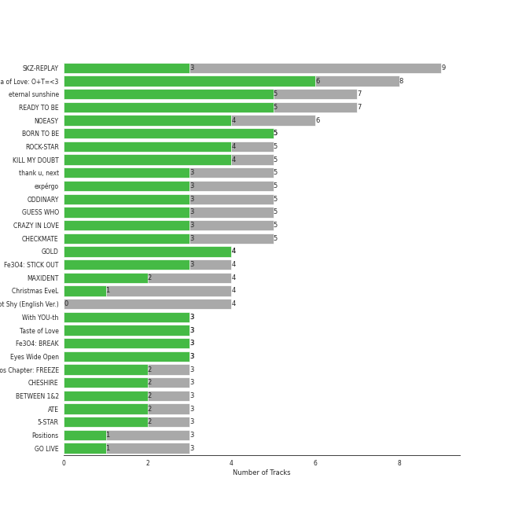
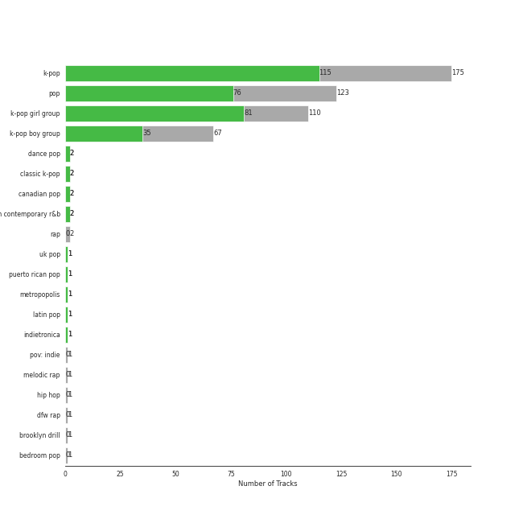

# Republic Records

129 songs

Appears as:
- Republic Records - Stray Kids (43 tracks)
- Republic Records - TWICE (32 tracks)
- Republic Records - ITZY (31 tracks)
- Republic Records (12 tracks)
- Republic Records - TXT (7 tracks)
- Lava Music/Republic Records (2 tracks)
- Republic/UMLE (1 tracks)
- Republic/Universal/FSF (1 tracks)

## Top Artists

See all 17 artists

|   Number of Tracks | Art                                                                                              | Artist                                       | 🔗                                                           |
|-------------------:|:-------------------------------------------------------------------------------------------------|:---------------------------------------------|:------------------------------------------------------------|
|                 43 |  | [Stray Kids](../artists/stray_kids.md)       | [🔗](https://open.spotify.com/artist/2dIgFjalVxs4ThymZ67YCE) |
|                 32 |  | [TWICE](../artists/twice.md)                 | [🔗](https://open.spotify.com/artist/7n2Ycct7Beij7Dj7meI4X0) |
|                 31 |  | [ITZY](../artists/itzy.md)                   | [🔗](https://open.spotify.com/artist/2KC9Qb60EaY0kW4eH68vr3) |
|                 10 |  | [Ariana Grande](../artists/ariana_grande.md) | [🔗](https://open.spotify.com/artist/66CXWjxzNUsdJxJ2JdwvnR) |
|                  7 |  | TOMORROW X TOGETHER                          | [🔗](https://open.spotify.com/artist/0ghlgldX5Dd6720Q3qFyQB) |
|                  2 |  | Jessie J                                     | [🔗](https://open.spotify.com/artist/2gsggkzM5R49q6jpPvazou) |
|                  1 |  | B.o.B                                        | [🔗](https://open.spotify.com/artist/5ndkK3dpZLKtBklKjxNQwT) |
|                  1 |  | Doja Cat                                     | [🔗](https://open.spotify.com/artist/5cj0lLjcoR7YOSnhnX0Po5) |
|                  1 |  | Social House                                 | [🔗](https://open.spotify.com/artist/5UjifI1TYefXWn9GdqDOHl) |
|                  1 |                                                               | Changbin                                     | [🔗](https://open.spotify.com/artist/5OTVNUu0UHn6ddPyEAi419) |
|                  1 |                                                               | Bang Chan                                    | [🔗](https://open.spotify.com/artist/4qy7HANJDOZRObts4Z0KSV) |
|                  1 |  | Daddy Yankee                                 | [🔗](https://open.spotify.com/artist/4VMYDCV2IEDYJArk749S6m) |
|                  1 |  | Luis Fonsi                                   | [🔗](https://open.spotify.com/artist/4V8Sr092TqfHkfAA5fXXqG) |
|                  1 |  | Conan Gray                                   | [🔗](https://open.spotify.com/artist/4Uc8Dsxct0oMqx0P6i60ea) |
|                  1 |  | Justin Bieber                                | [🔗](https://open.spotify.com/artist/1uNFoZAHBGtllmzznpCI3s) |
|                  1 |  | The Weeknd                                   | [🔗](https://open.spotify.com/artist/1Xyo4u8uXC1ZmMpatF05PJ) |
|                  1 |  | Ellie Goulding                               | [🔗](https://open.spotify.com/artist/0X2BH1fck6amBIoJhDVmmJ) |

## Top Albums

See all 57 albums

|   Number of Tracks | Art                                                                                              | Album                                                   | 🔗                                                          |
|-------------------:|:-------------------------------------------------------------------------------------------------|:--------------------------------------------------------|:-----------------------------------------------------------|
|                 13 |  | SKZ-REPLAY                                              | [🔗](https://open.spotify.com/album/3UXrliH0JUQvcaLnBD8Txz) |
|                  7 |  | Formula of Love: O+T=<3                                 | [🔗](https://open.spotify.com/album/5052Ip89wdW8EGdpjEpNeq) |
|                  6 |  | NOEASY                                                  | [🔗](https://open.spotify.com/album/558tpdCejjVQNFAumRAeQj) |
|                  6 |  | CRAZY IN LOVE                                           | [🔗](https://open.spotify.com/album/4U7rGOkJgtxs27H9L93Xli) |
|                  6 |  | CHECKMATE                                               | [🔗](https://open.spotify.com/album/64EGnoCD5NuC41OqQ3E7UK) |
|                  5 |  | GUESS WHO                                               | [🔗](https://open.spotify.com/album/4lS8nhX8cplsYPzKjvhw6G) |
|                  4 |  | thank u, next                                           | [🔗](https://open.spotify.com/album/2fYhqwDWXjbpjaIJPEfKFw) |
|                  4 |  | ODDINARY                                                | [🔗](https://open.spotify.com/album/0Gmf4pfe0POEQq2FgGAj2q) |
|                  4 |  | Not Shy (English Ver.)                                  | [🔗](https://open.spotify.com/album/0hoNwSKuuOeT9eAxopgMdm) |
|                  4 |  | Not Shy                                                 | [🔗](https://open.spotify.com/album/5NN55LKbjzX16a7Uf8u7Os) |
|                  4 |  | MAXIDENT                                                | [🔗](https://open.spotify.com/album/0T6hYH0UyDjNraWZk2mZWi) |
|                  3 |  | The Chaos Chapter: FREEZE                               | [🔗](https://open.spotify.com/album/5Zdr9vactwnJH4Vpe9Mid9) |
|                  3 |  | Taste of Love                                           | [🔗](https://open.spotify.com/album/00vb6sViDbJLmLLchfbRh4) |
|                  3 |  | Positions                                               | [🔗](https://open.spotify.com/album/3euz4vS7ezKGnNSwgyvKcd) |
|                  3 |  | GO LIVE                                                 | [🔗](https://open.spotify.com/album/6DWLIzvmiLPAuDWYZqrLQo) |
|                  3 |  | Eyes Wide Open                                          | [🔗](https://open.spotify.com/album/33jypnU7WULxPaVrjj4RXH) |
|                  3 |  | CHESHIRE                                                | [🔗](https://open.spotify.com/album/2a1ezg7hE6Dyuymv1aCnkm) |
|                  3 |  | BETWEEN 1&2                                             | [🔗](https://open.spotify.com/album/3NZ94nQbqimcu2i71qhc4f) |
|                  2 |  | Who You Are (Platinum Edition)                          | [🔗](https://open.spotify.com/album/3ga4adzUpLaS2LDcoqfs2r) |
|                  2 |  | Sweetener                                               | [🔗](https://open.spotify.com/album/3tx8gQqWbGwqIGZHqDNrGe) |
|                  2 |  | SKZ2020                                                 | [🔗](https://open.spotify.com/album/6QIWJVJPPgAA5c4aIb1zCA) |
|                  2 |  | IN LIFE                                                 | [🔗](https://open.spotify.com/album/0aERWcI2KYSCM4biUihB9X) |
|                  2 |  | Feel Special                                            | [🔗](https://open.spotify.com/album/3NQBPabmRm3LzVcmtkTLfo) |
|                  2 |  | Christmas EveL                                          | [🔗](https://open.spotify.com/album/1qVuQI0WRn2Mczbdxx54Ih) |
|                  1 |  | minisode1 : Blue Hour                                   | [🔗](https://open.spotify.com/album/2DDNDdePEx9R0bBwRqahdr) |
|                  1 |  | minisode 2: Thursday's Child                            | [🔗](https://open.spotify.com/album/1o8jYrnyZueTPIdhlHuTc8) |
|                  1 |  | boyfriend                                               | [🔗](https://open.spotify.com/album/3zVB99XMdbP9HTVNg0GJwV) |
|                  1 |  | YES or YES                                              | [🔗](https://open.spotify.com/album/25VunQEW0x2W6ALND2Mh4g) |
|                  1 |  | What Is Love                                            | [🔗](https://open.spotify.com/album/5o5cJ6yZmcyy4y4hK0J6de) |
|                  1 |  | Twicetagram                                             | [🔗](https://open.spotify.com/album/3hJXmK5gWN9P6jtZL0Lr2y) |
|                  1 |  | Twicecoaster: Lane 1                                    | [🔗](https://open.spotify.com/album/5zQhaDNbiXHRqd8Y51I4vy) |
|                  1 |  | The Story Begins                                        | [🔗](https://open.spotify.com/album/72WWZVAx6GtSbEeGESwDLo) |
|                  1 |  | The Feels                                               | [🔗](https://open.spotify.com/album/6bk3KlQjiXsRmGrzrNcS53) |
|                  1 |  | The Chaos Chapter: FIGHT OR ESCAPE                      | [🔗](https://open.spotify.com/album/2CjIfWoFITACUOlWGB7os5) |
|                  1 |  | Summer Nights                                           | [🔗](https://open.spotify.com/album/2GKTroaa4ysyhEdvzpvUoM) |
|                  1 |  | Step Out of Clé (English Ver.)                          | [🔗](https://open.spotify.com/album/2BBeNPEEevRiYISKYEnGvc) |
|                  1 |  | SIGNAL                                                  | [🔗](https://open.spotify.com/album/28PwDunFAR71toOCTYRvkf) |
|                  1 |  | Page Two                                                | [🔗](https://open.spotify.com/album/6q2oUEqL9uzVXHCeKoA8JV) |
|                  1 |  | Mixtape : Time Out                                      | [🔗](https://open.spotify.com/album/6Sr3My17NKn1g1zIFclPoS) |
|                  1 |  | Mixtape                                                 | [🔗](https://open.spotify.com/album/1kTzTL0iOIE2IAGw83yY4O) |
|                  1 |  | Merry & Happy                                           | [🔗](https://open.spotify.com/album/0R7pj4tnmcoUulrZGPo6nw) |
|                  1 |  | MORE & MORE (English Version)                           | [🔗](https://open.spotify.com/album/4AXNnQf2SkyY8d4FQaBKo5) |
|                  1 |  | MORE & MORE                                             | [🔗](https://open.spotify.com/album/5KsduuDNWzt65TaHzmtciv) |
|                  1 |  | Kid Krow                                                | [🔗](https://open.spotify.com/album/2CMlkzFI2oDAy5MbyV7OV5) |
|                  1 |  | In the morning (English Ver.)                           | [🔗](https://open.spotify.com/album/1VbG3CJlf1cSVDibgiM3GM) |
|                  1 |  | IT'z ME                                                 | [🔗](https://open.spotify.com/album/7ynKAohxfwPUZzvU8f1p1U) |
|                  1 |  | I am WHO                                                | [🔗](https://open.spotify.com/album/2SACeVKmkXeAXHqLDdTU9N) |
|                  1 |  | I am NOT                                                | [🔗](https://open.spotify.com/album/6xP5hGAHaLArPqF07UYVJL) |
|                  1 |  | I CAN'T STOP ME (English Version)                       | [🔗](https://open.spotify.com/album/2KGNQmq4gpzmdaIcAgJdVe) |
|                  1 |  | Fifty Shades Freed (Original Motion Picture Soundtrack) | [🔗](https://open.spotify.com/album/4w0N1CaZwQ5RPIuawqlYyy) |
|                  1 |  | Despacito Feat. Justin Bieber (Remix)                   | [🔗](https://open.spotify.com/album/3Gq2Dme9nesdgoqNNlcN8O) |
|                  1 |  | Clé 2 : Yellow Wood                                     | [🔗](https://open.spotify.com/album/7a3luOh8mK0q8YsRkNUjrU) |
|                  1 |  | Clé 1 : MIROH                                           | [🔗](https://open.spotify.com/album/3s6RbqkTprnGwKpoUSYL00) |
|                  1 |  | Cat & Dog (English Version)                             | [🔗](https://open.spotify.com/album/4uJ120PsfiWOC7aV5FqGkU) |
|                  1 |  | CRY FOR ME                                              | [🔗](https://open.spotify.com/album/2aRAPmBCEdo9pWimsI5l87) |
|                  1 |  | Boys Like You                                           | [🔗](https://open.spotify.com/album/1KYgerdWcEqB7KbppYtdXU) |
|                  1 |  | After Hours                                             | [🔗](https://open.spotify.com/album/4yP0hdKOZPNshxUOjY0cZj) |

## Genres

See all 17 genres

|   Number of Tracks | Genre                                             |
|-------------------:|:--------------------------------------------------|
|                 82 | [k-pop](../genres/k_pop.md)                       |
|                 63 | [k-pop girl group](../genres/k_pop_girl_group.md) |
|                 50 | [k-pop boy group](../genres/k_pop_boy_group.md)   |
|                 15 | [pop](../genres/pop.md)                           |
|                 13 | [dance pop](../genres/dance_pop.md)               |
|                  2 | [post-teen pop](../genres/post_teen_pop.md)       |
|                  2 | pop rap                                           |
|                  1 | uk pop                                            |
|                  1 | puerto rican pop                                  |
|                  1 | metropopolis                                      |
|                  1 | latin pop                                         |
|                  1 | indietronica                                      |
|                  1 | [electropop](../genres/electropop.md)             |
|                  1 | edm                                               |
|                  1 | canadian pop                                      |
|                  1 | canadian contemporary r&b                         |
|                  1 | bedroom pop                                       |

## Tracks released under Republic Records

| Art                                                                                              | Track                                               | Album                                                   | Artists                                                     | Label                                                                                       | 💚   | 🔗                                                          |
|:-------------------------------------------------------------------------------------------------|:----------------------------------------------------|:--------------------------------------------------------|:------------------------------------------------------------|:--------------------------------------------------------------------------------------------|:----|:-----------------------------------------------------------|
|  | breathin                                            | Sweetener                                               | [Ariana Grande](../artists/ariana_grande.md)                | [Republic Records](republic_records.md)                                                     | 💚   | [🔗](https://open.spotify.com/track/4OafepJy2teCjYJbvFE60J) |
|  | no tears left to cry                                | Sweetener                                               | [Ariana Grande](../artists/ariana_grande.md)                | [Republic Records](republic_records.md)                                                     | 💚   | [🔗](https://open.spotify.com/track/2qT1uLXPVPzGgFOx4jtEuo) |
|  | 7 rings                                             | thank u, next                                           | [Ariana Grande](../artists/ariana_grande.md)                | [Republic Records](republic_records.md)                                                     | 💚   | [🔗](https://open.spotify.com/track/6ocbgoVGwYJhOv1GgI9NsF) |
|  | break up with your girlfriend, i'm bored            | thank u, next                                           | [Ariana Grande](../artists/ariana_grande.md)                | [Republic Records](republic_records.md)                                                     |     | [🔗](https://open.spotify.com/track/4kV4N9D1iKVxx1KLvtTpjS) |
|  | imagine                                             | thank u, next                                           | [Ariana Grande](../artists/ariana_grande.md)                | [Republic Records](republic_records.md)                                                     | 💚   | [🔗](https://open.spotify.com/track/39LmTF9RgyakzSYX8txrow) |
|  | thank u, next                                       | thank u, next                                           | [Ariana Grande](../artists/ariana_grande.md)                | [Republic Records](republic_records.md)                                                     |     | [🔗](https://open.spotify.com/track/3e9HZxeyfWwjeyPAMmWSSQ) |
|  | boyfriend (with Social House)                       | boyfriend                                               | [Ariana Grande](../artists/ariana_grande.md), Social House  | [Republic Records](republic_records.md)                                                     |     | [🔗](https://open.spotify.com/track/0Ryd8975WihbObpp5cPW1t) |
|  | motive (with Doja Cat)                              | Positions                                               | [Ariana Grande](../artists/ariana_grande.md), Doja Cat      | [Republic Records](republic_records.md)                                                     |     | [🔗](https://open.spotify.com/track/5GkQIP5mWPi4KZLLXeuFTT) |
|  | positions                                           | Positions                                               | [Ariana Grande](../artists/ariana_grande.md)                | [Republic Records](republic_records.md)                                                     | 💚   | [🔗](https://open.spotify.com/track/35mvY5S1H3J2QZyna3TFe0) |
|  | pov                                                 | Positions                                               | [Ariana Grande](../artists/ariana_grande.md)                | [Republic Records](republic_records.md)                                                     |     | [🔗](https://open.spotify.com/track/3UoULw70kMsiVXxW0L3A33) |
|  | Maniac                                              | Kid Krow                                                | Conan Gray                                                  | [Republic Records](republic_records.md)                                                     | 💚   | [🔗](https://open.spotify.com/track/6KfoDhO4XUWSbnyKjNp9c4) |
|  | Love Me Like You Do                                 | Fifty Shades Freed (Original Motion Picture Soundtrack) | Ellie Goulding                                              | [Republic Records](republic_records.md), [Universal Music LLC](universal_music_llc.md), FSF | 💚   | [🔗](https://open.spotify.com/track/0Cy7wt6IlRfBPHXXjmZbcP) |
|  | WANNABE                                             | IT'z ME                                                 | [ITZY](../artists/itzy.md)                                  | [Republic Records](republic_records.md)                                                     | 💚   | [🔗](https://open.spotify.com/track/4pspYVQGFHLPEFgQPD1J7e) |
|  | Be In Love                                          | Not Shy                                                 | [ITZY](../artists/itzy.md)                                  | [Republic Records](republic_records.md)                                                     | 💚   | [🔗](https://open.spotify.com/track/0FGeJSm4Iix7OdvjvENrwx) |
|  | Louder                                              | Not Shy                                                 | [ITZY](../artists/itzy.md)                                  | [Republic Records](republic_records.md)                                                     |     | [🔗](https://open.spotify.com/track/39pv61XfYr9MUwsYkx30aQ) |
|  | Not Shy                                             | Not Shy                                                 | [ITZY](../artists/itzy.md)                                  | [Republic Records](republic_records.md)                                                     | 💚   | [🔗](https://open.spotify.com/track/1ehags7lQMM1qX94VJkoaf) |
|  | SURF                                                | Not Shy                                                 | [ITZY](../artists/itzy.md)                                  | [Republic Records](republic_records.md)                                                     | 💚   | [🔗](https://open.spotify.com/track/5rAjh9qDtJalKfwgxNk2vt) |
|  | DALLA DALLA - English Ver.                          | Not Shy (English Ver.)                                  | [ITZY](../artists/itzy.md)                                  | [Republic Records](republic_records.md)                                                     |     | [🔗](https://open.spotify.com/track/1tQMEpkJ6ayK5w9mtW3Tqv) |
|  | ICY - English Ver.                                  | Not Shy (English Ver.)                                  | [ITZY](../artists/itzy.md)                                  | [Republic Records](republic_records.md)                                                     |     | [🔗](https://open.spotify.com/track/0H76idYK173LwctmFntEdz) |
|  | Not Shy - English Ver.                              | Not Shy (English Ver.)                                  | [ITZY](../artists/itzy.md)                                  | [Republic Records](republic_records.md)                                                     |     | [🔗](https://open.spotify.com/track/2p0WmvGmzE3mKr3lc6ZB9g) |
|  | WANNABE - English Ver.                              | Not Shy (English Ver.)                                  | [ITZY](../artists/itzy.md)                                  | [Republic Records](republic_records.md)                                                     |     | [🔗](https://open.spotify.com/track/2cnhL9Xb7jlTuUs4taxJSB) |
|  | In the morning                                      | GUESS WHO                                               | [ITZY](../artists/itzy.md)                                  | [Republic Records](republic_records.md)                                                     | 💚   | [🔗](https://open.spotify.com/track/1Wcr8zrKqbUX0zwN8Dbr16) |
|  | KIDDING ME                                          | GUESS WHO                                               | [ITZY](../artists/itzy.md)                                  | [Republic Records](republic_records.md)                                                     | 💚   | [🔗](https://open.spotify.com/track/74WtkDIkOXTtEVO4TatDMX) |
|  | SHOOT!                                              | GUESS WHO                                               | [ITZY](../artists/itzy.md)                                  | [Republic Records](republic_records.md)                                                     | 💚   | [🔗](https://open.spotify.com/track/2xeaHUnzzT5Kc974OQt1kA) |
|  | Sorry Not Sorry                                     | GUESS WHO                                               | [ITZY](../artists/itzy.md)                                  | [Republic Records](republic_records.md)                                                     |     | [🔗](https://open.spotify.com/track/4BV9bZOeH869aewS9lwTtM) |
|  | TENNIS (0:0)                                        | GUESS WHO                                               | [ITZY](../artists/itzy.md)                                  | [Republic Records](republic_records.md)                                                     | 💚   | [🔗](https://open.spotify.com/track/6wSBcV4mjwiVKGJzNrgwha) |
|  | In the morning - English Ver.                       | In the morning (English Ver.)                           | [ITZY](../artists/itzy.md)                                  | [Republic Records](republic_records.md)                                                     |     | [🔗](https://open.spotify.com/track/0rXBxNaEX9pJSV8U7xYUXr) |
|  | #Twenty                                             | CRAZY IN LOVE                                           | [ITZY](../artists/itzy.md)                                  | [Republic Records](republic_records.md)                                                     | 💚   | [🔗](https://open.spotify.com/track/0deWmYkaZHaElUm15oVXkE) |
|  | Gas Me Up                                           | CRAZY IN LOVE                                           | [ITZY](../artists/itzy.md)                                  | [Republic Records](republic_records.md)                                                     | 💚   | [🔗](https://open.spotify.com/track/3RCMSJIlIZkvJP4LFGtOtu) |
|  | LOCO                                                | CRAZY IN LOVE                                           | [ITZY](../artists/itzy.md)                                  | [Republic Records](republic_records.md)                                                     | 💚   | [🔗](https://open.spotify.com/track/56Yxkm62GtEpnPyG7TvwLY) |
|  | LOCO - English Ver.                                 | CRAZY IN LOVE                                           | [ITZY](../artists/itzy.md)                                  | [Republic Records](republic_records.md)                                                     |     | [🔗](https://open.spotify.com/track/0QPYsEvaoEJzZLSF5Cq390) |
|  | SWIPE                                               | CRAZY IN LOVE                                           | [ITZY](../artists/itzy.md)                                  | [Republic Records](republic_records.md)                                                     | 💚   | [🔗](https://open.spotify.com/track/5o0urLKhjQLIFMoJH5SSrY) |
|  | Sooo LUCKY                                          | CRAZY IN LOVE                                           | [ITZY](../artists/itzy.md)                                  | [Republic Records](republic_records.md)                                                     |     | [🔗](https://open.spotify.com/track/6zqZfHvp3f9r4AF6G7Nhgl) |
|  | DOMINO                                              | CHECKMATE                                               | [ITZY](../artists/itzy.md)                                  | [Republic Records](republic_records.md)                                                     | 💚   | [🔗](https://open.spotify.com/track/2Yi1F6c06h8HY5ZIvNRogo) |
|  | Free Fall                                           | CHECKMATE                                               | [ITZY](../artists/itzy.md)                                  | [Republic Records](republic_records.md)                                                     | 💚   | [🔗](https://open.spotify.com/track/3bW8vRr2qQwtmz46OEPZKk) |
|  | RACER                                               | CHECKMATE                                               | [ITZY](../artists/itzy.md)                                  | [Republic Records](republic_records.md)                                                     | 💚   | [🔗](https://open.spotify.com/track/5v15IF9D4nKZbto4US7Ar1) |
|  | SNEAKERS                                            | CHECKMATE                                               | [ITZY](../artists/itzy.md)                                  | [Republic Records](republic_records.md)                                                     | 💚   | [🔗](https://open.spotify.com/track/2WoluqyWzsgRmFCeHeGlnm) |
|  | SNEAKERS (English Ver.)                             | CHECKMATE                                               | [ITZY](../artists/itzy.md)                                  | [Republic Records](republic_records.md)                                                     |     | [🔗](https://open.spotify.com/track/4DM60RC0fVoHbVRtl4Fjdp) |
|  | WHAT I WANT                                         | CHECKMATE                                               | [ITZY](../artists/itzy.md)                                  | [Republic Records](republic_records.md)                                                     | 💚   | [🔗](https://open.spotify.com/track/28E5sYRuv2gpZPEdNAwMkE) |
|  | Boys Like You                                       | Boys Like You                                           | [ITZY](../artists/itzy.md)                                  | [Republic Records](republic_records.md)                                                     |     | [🔗](https://open.spotify.com/track/34y2pV3RGFiCHSP12bNHVk) |
|  | Cheshire                                            | CHESHIRE                                                | [ITZY](../artists/itzy.md)                                  | [Republic Records](republic_records.md)                                                     | 💚   | [🔗](https://open.spotify.com/track/7ixVW7RobslvMrvlzHYLha) |
|  | Freaky                                              | CHESHIRE                                                | [ITZY](../artists/itzy.md)                                  | [Republic Records](republic_records.md)                                                     |     | [🔗](https://open.spotify.com/track/6VgVT2ZxtssMdzrbfW1R0d) |
|  | Snowy                                               | CHESHIRE                                                | [ITZY](../artists/itzy.md)                                  | [Republic Records](republic_records.md)                                                     | 💚   | [🔗](https://open.spotify.com/track/1i0NAz5emJMbRWSkADMsL7) |
|  | Price Tag                                           | Who You Are (Platinum Edition)                          | Jessie J, B.o.B                                             | [Lava Music/Republic Records](lava_music.md)                                                | 💚   | [🔗](https://open.spotify.com/track/5mvKuE9Lf9ARVXVXA32kK9) |
|  | Who You Are                                         | Who You Are (Platinum Edition)                          | Jessie J                                                    | [Lava Music/Republic Records](lava_music.md)                                                | 💚   | [🔗](https://open.spotify.com/track/65lIGCfW59BxcEJnnIOCq3) |
|  | Despacito - Remix                                   | Despacito Feat. Justin Bieber (Remix)                   | Luis Fonsi, Daddy Yankee, Justin Bieber                     | [Republic/UMLE](republic_records.md)                                                        | 💚   | [🔗](https://open.spotify.com/track/6rPO02ozF3bM7NnOV4h6s2) |
|  | Hellevator                                          | Mixtape                                                 | [Stray Kids](../artists/stray_kids.md)                      | [Republic Records](republic_records.md)                                                     |     | [🔗](https://open.spotify.com/track/7mKXEaBVWuV0dMqN0gaCBm) |
|  | District 9                                          | I am NOT                                                | [Stray Kids](../artists/stray_kids.md)                      | [Republic Records](republic_records.md)                                                     |     | [🔗](https://open.spotify.com/track/4A0ZTqmb6131trEdQl2dBW) |
|  | Awkward Silence                                     | I am WHO                                                | [Stray Kids](../artists/stray_kids.md)                      | [Republic Records](republic_records.md)                                                     | 💚   | [🔗](https://open.spotify.com/track/6qOPM7GV2Yv10hAgFEn6oN) |
|  | MIROH                                               | Clé 1 : MIROH                                           | [Stray Kids](../artists/stray_kids.md)                      | [Republic Records](republic_records.md)                                                     | 💚   | [🔗](https://open.spotify.com/track/2sFWzfV3kqAwXEWM9BjzwH) |
|  | Side Effects                                        | Clé 2 : Yellow Wood                                     | [Stray Kids](../artists/stray_kids.md)                      | [Republic Records](republic_records.md)                                                     | 💚   | [🔗](https://open.spotify.com/track/1Y2HN48G6Bkm4V3csQncJP) |
|  | Levanter - English Ver.                             | Step Out of Clé (English Ver.)                          | [Stray Kids](../artists/stray_kids.md)                      | [Republic Records](republic_records.md)                                                     |     | [🔗](https://open.spotify.com/track/5sPdWGv1MlA0qHzjN9hPPv) |
|  | Chronosaurus                                        | SKZ2020                                                 | [Stray Kids](../artists/stray_kids.md)                      | [Republic Records](republic_records.md)                                                     | 💚   | [🔗](https://open.spotify.com/track/58epKNTOOt4RDWObkR9e43) |
|  | Voices                                              | SKZ2020                                                 | [Stray Kids](../artists/stray_kids.md)                      | [Republic Records](republic_records.md)                                                     | 💚   | [🔗](https://open.spotify.com/track/3zutAkkwy9Ucd9l4H4EReH) |
|  | Blueprint                                           | GO LIVE                                                 | [Stray Kids](../artists/stray_kids.md)                      | [Republic Records](republic_records.md)                                                     |     | [🔗](https://open.spotify.com/track/2JzOF5Ex1BfufuZ6DgvOPe) |
|  | Easy                                                | GO LIVE                                                 | [Stray Kids](../artists/stray_kids.md)                      | [Republic Records](republic_records.md)                                                     |     | [🔗](https://open.spotify.com/track/4s9diT9GXpI7QiysMkoANG) |
|  | God’s Menu                                          | GO LIVE                                                 | [Stray Kids](../artists/stray_kids.md)                      | [Republic Records](republic_records.md)                                                     | 💚   | [🔗](https://open.spotify.com/track/4XPXrcpyNr30Km6aPiflJy) |
|  | Any                                                 | IN LIFE                                                 | [Stray Kids](../artists/stray_kids.md)                      | [Republic Records](republic_records.md)                                                     | 💚   | [🔗](https://open.spotify.com/track/5S7kMbtEikXwCAHMu3R3jw) |
|  | Back Door                                           | IN LIFE                                                 | [Stray Kids](../artists/stray_kids.md)                      | [Republic Records](republic_records.md)                                                     | 💚   | [🔗](https://open.spotify.com/track/0XuepwFJUcKN8T5zTqoP0F) |
|  | CHEESE                                              | NOEASY                                                  | [Stray Kids](../artists/stray_kids.md)                      | [Republic Records](republic_records.md)                                                     | 💚   | [🔗](https://open.spotify.com/track/7qpSatdWQcRHA3hpedL2u4) |
|  | DOMINO                                              | NOEASY                                                  | [Stray Kids](../artists/stray_kids.md)                      | [Republic Records](republic_records.md)                                                     |     | [🔗](https://open.spotify.com/track/6Ib6RkvLBMD85bov85apSL) |
|  | Red Lights (Bang Chan, Hyunjin)                     | NOEASY                                                  | [Stray Kids](../artists/stray_kids.md)                      | [Republic Records](republic_records.md)                                                     | 💚   | [🔗](https://open.spotify.com/track/0LatE4S9UtCDwIdGQsFFKL) |
|  | Silent Cry                                          | NOEASY                                                  | [Stray Kids](../artists/stray_kids.md)                      | [Republic Records](republic_records.md)                                                     |     | [🔗](https://open.spotify.com/track/5kBJH5gU89axZDauhfddpy) |
|  | Surfin’ (Lee Know, Changbin, Felix)                 | NOEASY                                                  | [Stray Kids](../artists/stray_kids.md)                      | [Republic Records](republic_records.md)                                                     |     | [🔗](https://open.spotify.com/track/1FdnsU6An1Ye3uBJe8j23c) |
|  | Thunderous                                          | NOEASY                                                  | [Stray Kids](../artists/stray_kids.md)                      | [Republic Records](republic_records.md)                                                     | 💚   | [🔗](https://open.spotify.com/track/0nwTMzpatarzvLvtwwzdCt) |
|  | Christmas EveL                                      | Christmas EveL                                          | [Stray Kids](../artists/stray_kids.md)                      | [Republic Records](republic_records.md)                                                     | 💚   | [🔗](https://open.spotify.com/track/5npCUsfrlhdyjxyCa32maW) |
|  | DOMINO - English Ver.                               | Christmas EveL                                          | [Stray Kids](../artists/stray_kids.md)                      | [Republic Records](republic_records.md)                                                     |     | [🔗](https://open.spotify.com/track/0b9YBfAcbnhVDUFmsfpDFj) |
|  | Charmer                                             | ODDINARY                                                | [Stray Kids](../artists/stray_kids.md)                      | [Republic Records](republic_records.md)                                                     | 💚   | [🔗](https://open.spotify.com/track/4QDpsNBlllaLGj8zbF2EE0) |
|  | FREEZE                                              | ODDINARY                                                | [Stray Kids](../artists/stray_kids.md)                      | [Republic Records](republic_records.md)                                                     |     | [🔗](https://open.spotify.com/track/2L7hSYdvF0CtaM6JisfKEG) |
|  | MANIAC                                              | ODDINARY                                                | [Stray Kids](../artists/stray_kids.md)                      | [Republic Records](republic_records.md)                                                     | 💚   | [🔗](https://open.spotify.com/track/63irPUP3xB74fHdw1Aw9zR) |
|  | Muddy Water (Changbin, Hyunjin, HAN, Felix)         | ODDINARY                                                | [Stray Kids](../artists/stray_kids.md)                      | [Republic Records](republic_records.md)                                                     | 💚   | [🔗](https://open.spotify.com/track/0oHn3CGVerdfLqIrN6CT42) |
|  | Mixtape : Time Out                                  | Mixtape : Time Out                                      | [Stray Kids](../artists/stray_kids.md)                      | [Republic Records](republic_records.md)                                                     |     | [🔗](https://open.spotify.com/track/0OCDOcvQvozjsivREMojzx) |
|  | 3RACHA (Bang Chan, Changbin, HAN)                   | MAXIDENT                                                | [Stray Kids](../artists/stray_kids.md)                      | [Republic Records](republic_records.md)                                                     | 💚   | [🔗](https://open.spotify.com/track/6T4o4xEh61CpgM9v4jG5DJ) |
|  | CASE 143                                            | MAXIDENT                                                | [Stray Kids](../artists/stray_kids.md)                      | [Republic Records](republic_records.md)                                                     | 💚   | [🔗](https://open.spotify.com/track/3O8G8eVrhfXTGttyQ1xVuq) |
|  | Give Me Your TMI                                    | MAXIDENT                                                | [Stray Kids](../artists/stray_kids.md)                      | [Republic Records](republic_records.md)                                                     | 💚   | [🔗](https://open.spotify.com/track/7CQhZA3qNDZBoTKWqjD7gR) |
|  | SUPER BOARD                                         | MAXIDENT                                                | [Stray Kids](../artists/stray_kids.md)                      | [Republic Records](republic_records.md)                                                     | 💚   | [🔗](https://open.spotify.com/track/078fJxqEUz0LvbHSM6AoXJ) |
|  | Because (Changbin, Felix)                           | SKZ-REPLAY                                              | [Stray Kids](../artists/stray_kids.md)                      | [Republic Records](republic_records.md)                                                     | 💚   | [🔗](https://open.spotify.com/track/1Iu7bqGwYVB6OGq4uLt2ak) |
|  | Connected (Bang Chan)                               | SKZ-REPLAY                                              | [Stray Kids](../artists/stray_kids.md)                      | [Republic Records](republic_records.md)                                                     |     | [🔗](https://open.spotify.com/track/3vGSv4l4czTve9jZoYeIWk) |
|  | Deep end (Felix)                                    | SKZ-REPLAY                                              | [Stray Kids](../artists/stray_kids.md)                      | [Republic Records](republic_records.md)                                                     | 💚   | [🔗](https://open.spotify.com/track/3VMeAc0SlgLaS9RzA8TSxH) |
|  | Drive (Bang Chan, Lee Know)                         | SKZ-REPLAY                                              | [Stray Kids](../artists/stray_kids.md)                      | [Republic Records](republic_records.md)                                                     |     | [🔗](https://open.spotify.com/track/0hLvtmoexLKl14LrzxOYRt) |
|  | Hug Me (I.N)                                        | SKZ-REPLAY                                              | [Stray Kids](../artists/stray_kids.md)                      | [Republic Records](republic_records.md)                                                     | 💚   | [🔗](https://open.spotify.com/track/5gXUFmE5AKFiInKyHVVEnL) |
|  | I GOT IT (HAN)                                      | SKZ-REPLAY                                              | [Stray Kids](../artists/stray_kids.md)                      | [Republic Records](republic_records.md)                                                     | 💚   | [🔗](https://open.spotify.com/track/4atsZkGtoHHPugKK5wzAE1) |
|  | Limbo (Lee Know)                                    | SKZ-REPLAY                                              | [Stray Kids](../artists/stray_kids.md)                      | [Republic Records](republic_records.md)                                                     |     | [🔗](https://open.spotify.com/track/0nuXhivBOFDiriWCpdyU93) |
|  | Maknae On Top (I.N)                                 | SKZ-REPLAY                                              | [Stray Kids](../artists/stray_kids.md), Bang Chan, Changbin | [Republic Records](republic_records.md)                                                     | 💚   | [🔗](https://open.spotify.com/track/1J0qupz0gVGSB5jcRY35tL) |
|  | RUN (HAN)                                           | SKZ-REPLAY                                              | [Stray Kids](../artists/stray_kids.md)                      | [Republic Records](republic_records.md)                                                     | 💚   | [🔗](https://open.spotify.com/track/4jjaOnFqtAyiYmP7PdTJbO) |
|  | Stars and Raindrops (Seungmin)                      | SKZ-REPLAY                                              | [Stray Kids](../artists/stray_kids.md)                      | [Republic Records](republic_records.md)                                                     | 💚   | [🔗](https://open.spotify.com/track/5kFGqKqHzVVMMI7V7uoID1) |
|  | Up All Night (Bang Chan, Changbin, Felix, Seungmin) | SKZ-REPLAY                                              | [Stray Kids](../artists/stray_kids.md)                      | [Republic Records](republic_records.md)                                                     | 💚   | [🔗](https://open.spotify.com/track/0bxB5Jie9fGKTIibfYVfei) |
|  | i hate to admit (Bang Chan)                         | SKZ-REPLAY                                              | [Stray Kids](../artists/stray_kids.md)                      | [Republic Records](republic_records.md)                                                     | 💚   | [🔗](https://open.spotify.com/track/0XABJLloqjHsF4mY4tGIOH) |
|  | miss you (Hyunjin)                                  | SKZ-REPLAY                                              | [Stray Kids](../artists/stray_kids.md)                      | [Republic Records](republic_records.md)                                                     | 💚   | [🔗](https://open.spotify.com/track/1BwFLLe233S6HR1ravS3yi) |
|  | Blinding Lights                                     | After Hours                                             | The Weeknd                                                  | [Republic Records](republic_records.md)                                                     | 💚   | [🔗](https://open.spotify.com/track/0VjIjW4GlUZAMYd2vXMi3b) |
|  | Cat & Dog (English Version)                         | Cat & Dog (English Version)                             | TOMORROW X TOGETHER                                         | [Republic Records](republic_records.md)                                                     |     | [🔗](https://open.spotify.com/track/0wzlQwQ17rpVVqgdaFNA7Q) |
|  | Blue Hour                                           | minisode1 : Blue Hour                                   | TOMORROW X TOGETHER                                         | [Republic Records](republic_records.md)                                                     |     | [🔗](https://open.spotify.com/track/3ObPkJQAgjAhTwYvDhPrAW) |
|  | 0X1=LOVESONG (I Know I Love You) feat. Seori        | The Chaos Chapter: FREEZE                               | TOMORROW X TOGETHER                                         | [Republic Records](republic_records.md)                                                     | 💚   | [🔗](https://open.spotify.com/track/1Z8TPHiKeCUyClxV6WTTIf) |
|  | Anti-Romantic                                       | The Chaos Chapter: FREEZE                               | TOMORROW X TOGETHER                                         | [Republic Records](republic_records.md)                                                     | 💚   | [🔗](https://open.spotify.com/track/44tTqUi3xi7E28QLzHVdUA) |
|  | Frost                                               | The Chaos Chapter: FREEZE                               | TOMORROW X TOGETHER                                         | [Republic Records](republic_records.md)                                                     |     | [🔗](https://open.spotify.com/track/3Yp61j6axuQe4nxYWvbOXy) |
|  | LO$ER=LO♡ER                                         | The Chaos Chapter: FIGHT OR ESCAPE                      | TOMORROW X TOGETHER                                         | [Republic Records](republic_records.md)                                                     | 💚   | [🔗](https://open.spotify.com/track/21aOLk12MksET8AsbU0SI6) |
|  | Opening Sequence                                    | minisode 2: Thursday's Child                            | TOMORROW X TOGETHER                                         | [Republic Records](republic_records.md)                                                     |     | [🔗](https://open.spotify.com/track/1exxGxUMlJWD1h9YcE9YZH) |
|  | Like Ooh-Ahh                                        | The Story Begins                                        | [TWICE](../artists/twice.md)                                | [Republic Records](republic_records.md)                                                     | 💚   | [🔗](https://open.spotify.com/track/3c0CJ0DBgsGZ7I79lyx02Z) |
|  | CHEER UP                                            | Page Two                                                | [TWICE](../artists/twice.md)                                | [Republic Records](republic_records.md)                                                     | 💚   | [🔗](https://open.spotify.com/track/7lB4rxNVc7vm33ZSZXVRAQ) |
|  | TT                                                  | Twicecoaster: Lane 1                                    | [TWICE](../artists/twice.md)                                | [Republic Records](republic_records.md)                                                     | 💚   | [🔗](https://open.spotify.com/track/60jFaQV7Z4boGC4ob5B5c6) |
|  | Signal                                              | SIGNAL                                                  | [TWICE](../artists/twice.md)                                | [Republic Records](republic_records.md)                                                     | 💚   | [🔗](https://open.spotify.com/track/15rX80MpEJ2OqW3dPunQvI) |
|  | Likey                                               | Twicetagram                                             | [TWICE](../artists/twice.md)                                | [Republic Records](republic_records.md)                                                     | 💚   | [🔗](https://open.spotify.com/track/0IEVKWduAaMcZepZQVr80T) |
|  | Heart Shaker                                        | Merry & Happy                                           | [TWICE](../artists/twice.md)                                | [Republic Records](republic_records.md)                                                     | 💚   | [🔗](https://open.spotify.com/track/52FCAZn0YEkZfF0BtiAUMW) |
|  | What is Love                                        | What Is Love                                            | [TWICE](../artists/twice.md)                                | [Republic Records](republic_records.md)                                                     | 💚   | [🔗](https://open.spotify.com/track/54mnwt3kO0uYsy0ceg14JP) |
|  | Dance The Night Away                                | Summer Nights                                           | [TWICE](../artists/twice.md)                                | [Republic Records](republic_records.md)                                                     |     | [🔗](https://open.spotify.com/track/4DYIDSMIB5y2UmZFv9fxeX) |
|  | YES or YES                                          | YES or YES                                              | [TWICE](../artists/twice.md)                                | [Republic Records](republic_records.md)                                                     | 💚   | [🔗](https://open.spotify.com/track/26OVhEqFDQH0Ij77QtmGP9) |
|  | Feel Special                                        | Feel Special                                            | [TWICE](../artists/twice.md)                                | [Republic Records](republic_records.md)                                                     | 💚   | [🔗](https://open.spotify.com/track/3Hz3tTQwOdM6XkA0ALB2G9) |
|  | LOVE FOOLISH                                        | Feel Special                                            | [TWICE](../artists/twice.md)                                | [Republic Records](republic_records.md)                                                     | 💚   | [🔗](https://open.spotify.com/track/1MdEg2lk4EakgWnCvFUGEZ) |
|  | MORE & MORE                                         | MORE & MORE                                             | [TWICE](../artists/twice.md)                                | [Republic Records](republic_records.md)                                                     | 💚   | [🔗](https://open.spotify.com/track/3omvXShuRPM3zbDpWYqf5g) |
|  | MORE & MORE (English Version)                       | MORE & MORE (English Version)                           | [TWICE](../artists/twice.md)                                | [Republic Records](republic_records.md)                                                     |     | [🔗](https://open.spotify.com/track/03wvlNaxFKB9sge4U6vyPE) |
|  | HELL IN HEAVEN                                      | Eyes Wide Open                                          | [TWICE](../artists/twice.md)                                | [Republic Records](republic_records.md)                                                     | 💚   | [🔗](https://open.spotify.com/track/3KCreWc88InXH3XuL54C5a) |
|  | I CAN'T STOP ME                                     | Eyes Wide Open                                          | [TWICE](../artists/twice.md)                                | [Republic Records](republic_records.md)                                                     | 💚   | [🔗](https://open.spotify.com/track/37ZtpRBkHcaq6hHy0X98zn) |
|  | SAY SOMETHING                                       | Eyes Wide Open                                          | [TWICE](../artists/twice.md)                                | [Republic Records](republic_records.md)                                                     |     | [🔗](https://open.spotify.com/track/2gagYYY4R8QimbnFqd96ST) |
|  | I CAN'T STOP ME (English Version)                   | I CAN'T STOP ME (English Version)                       | [TWICE](../artists/twice.md)                                | [Republic Records](republic_records.md)                                                     |     | [🔗](https://open.spotify.com/track/4viLaKGdHwhW8LkZB3mRFC) |
|  | CRY FOR ME                                          | CRY FOR ME                                              | [TWICE](../artists/twice.md)                                | [Republic Records](republic_records.md)                                                     | 💚   | [🔗](https://open.spotify.com/track/2xtP8RNbo2BEMzLX7tK7aq) |
|  | Alcohol-Free                                        | Taste of Love                                           | [TWICE](../artists/twice.md)                                | [Republic Records](republic_records.md)                                                     | 💚   | [🔗](https://open.spotify.com/track/0BTaaKT4RMbs5M73tOHX5Y) |
|  | First Time                                          | Taste of Love                                           | [TWICE](../artists/twice.md)                                | [Republic Records](republic_records.md)                                                     | 💚   | [🔗](https://open.spotify.com/track/3YdqewCLgGsFhruA3EhILy) |
|  | Scandal                                             | Taste of Love                                           | [TWICE](../artists/twice.md)                                | [Republic Records](republic_records.md)                                                     | 💚   | [🔗](https://open.spotify.com/track/2fluM1mE0tKQ6rvM77Vr11) |
|  | The Feels                                           | The Feels                                               | [TWICE](../artists/twice.md)                                | [Republic Records](republic_records.md)                                                     | 💚   | [🔗](https://open.spotify.com/track/1XyzcGhmO7iUamSS94XfqY) |
|  | 1, 3, 2 (JEONGYEON, MINA, TZUYU)                    | Formula of Love: O+T=<3                                 | [TWICE](../artists/twice.md)                                | [Republic Records](republic_records.md)                                                     | 💚   | [🔗](https://open.spotify.com/track/6bS9w12VuyaqkbNKnw5zZE) |
|  | CRUEL                                               | Formula of Love: O+T=<3                                 | [TWICE](../artists/twice.md)                                | [Republic Records](republic_records.md)                                                     | 💚   | [🔗](https://open.spotify.com/track/139JUU8fJkQoeHl9nABk9C) |
|  | F.I.L.A (Fall In Love Again)                        | Formula of Love: O+T=<3                                 | [TWICE](../artists/twice.md)                                | [Republic Records](republic_records.md)                                                     | 💚   | [🔗](https://open.spotify.com/track/4O1WbQwMV0W6Y2dUCvwoBx) |
|  | ICON                                                | Formula of Love: O+T=<3                                 | [TWICE](../artists/twice.md)                                | [Republic Records](republic_records.md)                                                     | 💚   | [🔗](https://open.spotify.com/track/2VdU1ksBKcETBr8BYRHUvB) |
|  | LAST WALTZ                                          | Formula of Love: O+T=<3                                 | [TWICE](../artists/twice.md)                                | [Republic Records](republic_records.md)                                                     | 💚   | [🔗](https://open.spotify.com/track/39kH6C2twlYjyssIW02sbr) |
|  | PUSH & PULL (JIHYO, SANA, DAHYUN)                   | Formula of Love: O+T=<3                                 | [TWICE](../artists/twice.md)                                | [Republic Records](republic_records.md)                                                     |     | [🔗](https://open.spotify.com/track/7kbOwsTp2Uqm1scjRPiVt4) |
|  | SCIENTIST                                           | Formula of Love: O+T=<3                                 | [TWICE](../artists/twice.md)                                | [Republic Records](republic_records.md)                                                     | 💚   | [🔗](https://open.spotify.com/track/0BJMgVrnWIvgYsjq8KaPeh) |
|  | Basics                                              | BETWEEN 1&2                                             | [TWICE](../artists/twice.md)                                | [Republic Records](republic_records.md)                                                     | 💚   | [🔗](https://open.spotify.com/track/63mL1DdcSFfxVJ9XGnSRQz) |
|  | Brave                                               | BETWEEN 1&2                                             | [TWICE](../artists/twice.md)                                | [Republic Records](republic_records.md)                                                     | 💚   | [🔗](https://open.spotify.com/track/2peoFPokM6eYAIwLm9IQ8E) |
|  | Talk that Talk                                      | BETWEEN 1&2                                             | [TWICE](../artists/twice.md)                                | [Republic Records](republic_records.md)                                                     | 💚   | [🔗](https://open.spotify.com/track/0RDqNCRBGrSegk16Avfzuq) |
