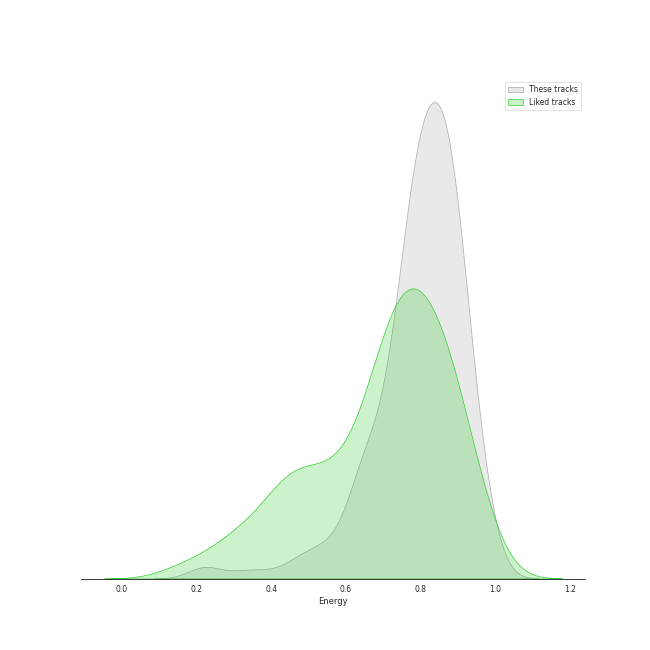
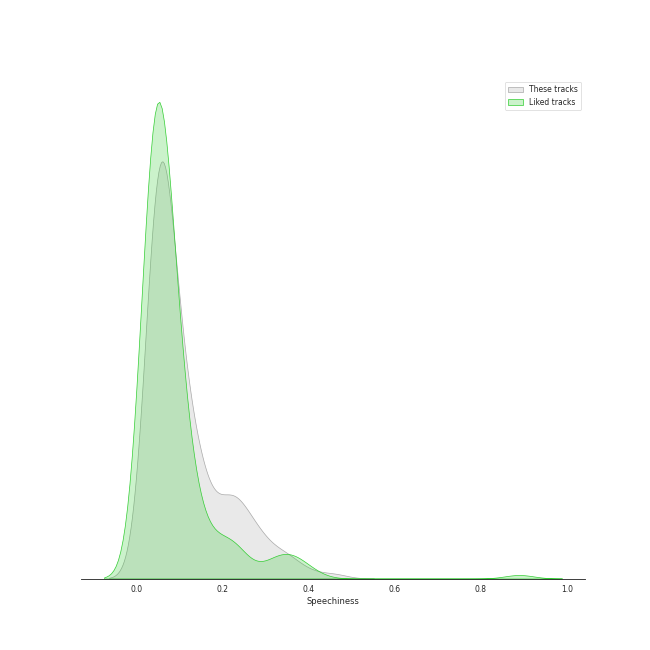

# Audio Features for Republic Records

## Danceability

| 10 most Danceable tracks | 10 least Danceable tracks |
|:---|:---|
| #Twenty (0.956) | CHEESE (0.376) |
| SNEAKERS (0.935) | boyfriend (with Social House) (0.4) |
| RUN (HAN) (0.929) | Side Effects (0.444) |
| SNEAKERS (English Ver.) (0.92) | BLAME IT ON ME (0.483) |
| Scandal (0.898) | Deep end (Felix) (0.485) |
| Louder (0.886) | pov (0.487) |
| Any (0.879) | Love Me Like You Do (0.489) |
| Christmas EveL (0.878) | Blinding Lights (0.514) |
| WHAT I WANT (0.865) | Hellevator (0.515) |
| SHOOT! (0.852) | i hate to admit (Bang Chan) (0.523) |

## Energy

| 10 most Energetic tracks | 10 least Energetic tracks |
|:---|:---|
| MIROH (0.979) | i hate to admit (Bang Chan) (0.217) |
| Side Effects (0.977) | Deep end (Felix) (0.223) |
| Feel Special (0.959) | miss you (Hyunjin) (0.226) |
| District 9 (0.956) | 7 rings (0.317) |
| Free Fall (0.95) | 24 to 25 (0.455) |
| CHEESE (0.946) | imagine (0.475) |
| Mixtape : Time Out (0.945) | Anti-Romantic (0.489) |
| Heart Shaker (0.944) | pov (0.534) |
| Louder (0.936) | break up with your girlfriend, i'm bored (0.554) |
| WHAT I WANT (0.926) | Love Me Like You Do (0.597) |

## Speechiness

| 10 most Speechy tracks | 10 least Speechy tracks |
|:---|:---|
| boyfriend (with Social House) (0.461) | 24 to 25 (0.0288) |
| MANIAC (0.411) | Love Me Like You Do (0.0292) |
| Free Fall (0.376) | Drive (Bang Chan, Lee Know) (0.0314) |
| I GOT IT (HAN) (0.365) | CRAZY STUPID LOVE (0.0316) |
| Dior (0.351) | Stars and Raindrops (Seungmin) (0.0329) |
| VENOM (0.339) | Likey (0.033) |
| 7 rings (0.334) | Who You Are (0.0336) |
| Signal (0.334) | imagine (0.0364) |
| 3RACHA (Bang Chan, Changbin, HAN) (0.301) | KIDDING ME (0.0367) |
| Gas Me Up (0.286) | YES or YES (0.0374) |

## Acousticness

| 10 most Acoustic tracks | 10 least Acoustic tracks |
|:---|:---|
| Deep end (Felix) (0.879) | Easy (0.000219) |
| miss you (Hyunjin) (0.826) | LO$ER=LO♡ER (0.001) |
| i hate to admit (Bang Chan) (0.794) | DALLA DALLA - English Ver. (0.00102) |
| RUN (HAN) (0.703) | DALLA DALLA (0.00116) |
| 7 rings (0.592) | Blinding Lights (0.00146) |
| Turtle (0.553) | SWIPE (0.00151) |
| 24 to 25 (0.533) | Maniac (0.00162) |
| positions (0.468) | WANNABE - English Ver. (0.00392) |
| Likey (0.413) | Frost (0.00551) |
| Merry & Happy (0.403) | SUPER BOARD (0.00653) |

## Instrumentalness

| 10 most Instrumental tracks | 10 least Instrumental tracks |
|:---|:---|
| Fairy of Shampoo (0.00673) | SUPER BOARD (0.0) |
| Feel Special (0.00188) | SCIENTIST (0.0) |
| Louder (0.00146) | Winter Falls (0.0) |
| In the morning (0.00094) | Love Me Like You Do (0.0) |
| Scandal (0.00043) | Red Lights (Bang Chan, Hyunjin) (0.0) |
| Dior (0.000389) | Mixtape : Time Out (0.0) |
| Likey (0.000377) | Talk that Talk (0.0) |
| WANNABE (0.000179) | boyfriend (with Social House) (0.0) |
| TT (0.00016) | i hate to admit (Bang Chan) (0.0) |
| Like Ooh-Ahh (0.000105) | Back Door (0.0) |

## Liveness

| 10 most Live tracks | 10 least Live tracks |
|:---|:---|
| FANCY (0.627) | CASE 143 (0.0222) |
| Red Lights (Bang Chan, Hyunjin) (0.612) | SNEAKERS (0.0223) |
| Levanter - English Ver. (0.544) | SNEAKERS (English Ver.) (0.0242) |
| God’s Menu (0.521) | Maknae On Top (I.N) (0.0374) |
| Easy (0.471) | First Time (0.0495) |
| I CAN'T STOP ME (0.463) | SET ME FREE (0.0499) |
| I CAN'T STOP ME (English Version) (0.427) | Up All Night (Bang Chan, Changbin, Felix, Seungmin) (0.0536) |
| Fairy of Shampoo (0.42) | Side Effects (0.0545) |
| Dior (0.408) | SURF (0.0575) |
| Christmas EveL (0.401) | LOVE FOOLISH (0.0576) |

## Valence

| 10 most Happy tracks | 10 least Happy tracks |
|:---|:---|
| The Feels (0.922) | Side Effects (0.118) |
| Up All Night (Bang Chan, Changbin, Felix, Seungmin) (0.916) | pov (0.173) |
| SHOOT! (0.907) | Anti-Romantic (0.206) |
| Muddy Water (Changbin, Hyunjin, HAN, Felix) (0.888) | Who You Are (0.215) |
| Maknae On Top (I.N) (0.883) | Deep end (Felix) (0.257) |
| Christmas EveL (0.878) | Motley Crew (0.288) |
| Boys Like You (0.874) | Hellevator (0.288) |
| Heart Shaker (0.857) | Voices (0.299) |
| Louder (0.853) | miss you (Hyunjin) (0.306) |
| Give Me Your TMI (0.824) | Love Me Like You Do (0.324) |

## Tempo

| 10 most Fast tracks | 10 least Fast tracks |
|:---|:---|
| Signal (207.819) | imagine (62.52) |
| Awkward Silence (199.981) | miss you (Hyunjin) (72.96) |
| boyfriend (with Social House) (190.097) | I GOT IT (HAN) (75.698) |
| District 9 (179.987) | Hellevator (78.17) |
| Despacito - Remix (178.085) | 1, 3, 2 (JEONGYEON, MINA, TZUYU) (88.938) |
| BLAME IT ON ME (177.713) | CHEESE (89.657) |
| Gas Me Up (177.17) | Muddy Water (Changbin, Hyunjin, HAN, Felix) (89.989) |
| Free Fall (177.092) | Drive (Bang Chan, Lee Know) (89.998) |
| Price Tag (175.038) | i hate to admit (Bang Chan) (90.013) |
| CHEER UP (172.95) | Charmer (90.963) |
