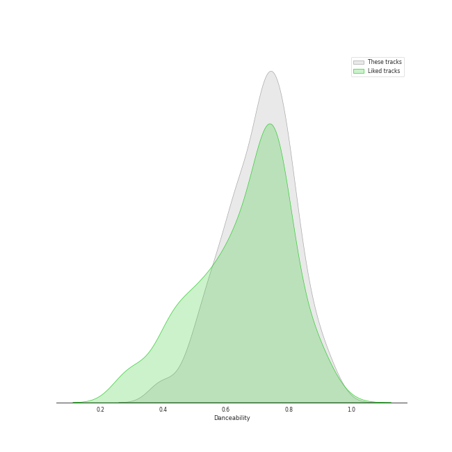
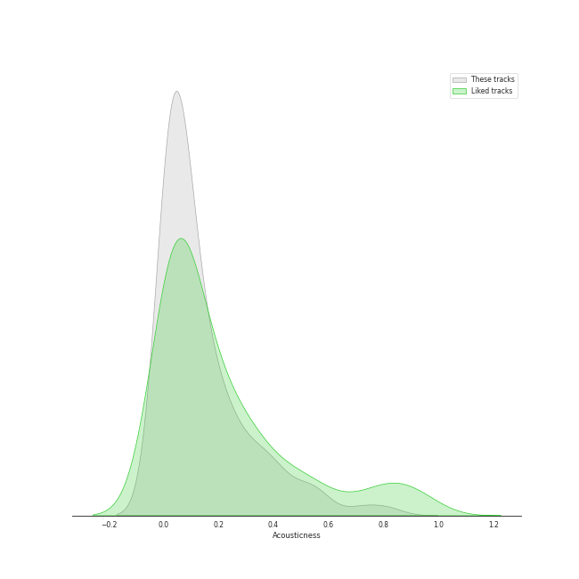
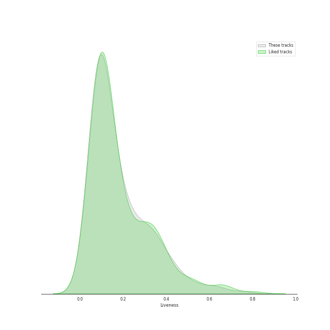

# Track Features for Republic Records

## Danceability

| ​ | 10 most Danceable tracks | ​​ | 10 least Danceable tracks |
|:---|:---|:---|:---|
|  | #Twenty (0.956) |  | CHEESE (0.376) |
|  | SNEAKERS (0.935) |  | O.O (0.389) |
|  | RUN (HAN) (0.929) |  | boyfriend (with Social House) (0.4) |
|  | SNEAKERS (English Ver.) (0.92) |  | Side Effects (0.444) |
|  | BET ON ME (0.917) |  | Strawberry Cake (0.476) |
|  | Scandal (0.898) |  | BLAME IT ON ME (0.483) |
|  | S-Class (0.886) |  | pov (0.487) |
|  | Nobody (0.882) |  | Love Me Like You Do (0.489) |
|  | So Hot (0.88) |  | Blinding Lights (0.513) |
|  | Any (0.879) |  | don't wanna break up again (0.513) |

## Energy

| ​ | 10 most Energetic tracks | ​​ | 10 least Energetic tracks |
|:---|:---|:---|:---|
|  | LALALALA (Rock Ver.) (0.985) |  | i hate to admit (Bang Chan) (0.217) |
|  | MIROH (0.979) |  | miss you (Hyunjin) (0.226) |
|  | Side Effects (0.977) |  | 7 rings (0.317) |
|  | Feel Special (0.959) |  | imperfect for you (0.38) |
|  | District 9 (0.956) |  | 24 to 25 (0.455) |
|  | Break the Brake (0.954) |  | imagine (0.476) |
|  | Groove Back (0.95) |  | Anti-Romantic (0.489) |
|  | Free Fall (0.95) |  | true story (0.53) |
|  | Little Things (0.948) |  | pov (0.534) |
|  | CHEESE (0.946) |  | ordinary things (feat. Nonna) (0.552) |

## Speechiness

| ​ | 10 most Speechy tracks | ​​ | 10 least Speechy tracks |
|:---|:---|:---|:---|
|  | boyfriend (with Social House) (0.461) |  | 24 to 25 (0.0288) |
|  | MANIAC (0.411) |  | Love Me Like You Do (0.0292) |
|  | Free Fall (0.376) |  | imperfect for you (0.0301) |
|  | I GOT IT (HAN) (0.365) |  | Save Your Tears (0.0309) |
|  | Dior (0.351) |  | Drive (Bang Chan, Lee Know) (0.0314) |
|  | VENOM (0.339) |  | CRAZY STUPID LOVE (0.0316) |
|  | Signal (0.334) |  | Tell Me (0.0327) |
|  | S-Class (0.333) |  | Rewind (0.0327) |
|  | 7 rings (0.308) |  | Stars and Raindrops (Seungmin) (0.0329) |
|  | 3RACHA (Bang Chan, Changbin, HAN) (0.301) |  | Likey (0.033) |

## Acousticness

| ​ | 10 most Acoustic tracks | ​​ | 10 least Acoustic tracks |
|:---|:---|:---|:---|
|  | miss you (Hyunjin) (0.826) |  | Easy (0.000219) |
|  | i hate to admit (Bang Chan) (0.794) |  | LO$ER=LO♡ER (0.001) |
|  | ordinary things (feat. Nonna) (0.729) |  | DALLA DALLA - English Ver. (0.00102) |
|  | RUN (HAN) (0.703) |  | DALLA DALLA (0.00116) |
|  | 7 rings (0.591) |  | Little Things (0.00126) |
|  | Rewind (0.574) |  | Blinding Lights (0.00143) |
|  | COOL (Your rainbow) (0.56) |  | SWIPE (0.00151) |
|  | Turtle (0.553) |  | Maniac (0.00162) |
|  | None of My Business (0.539) |  | WANNABE - English Ver. (0.00392) |
|  | 24 to 25 (0.533) |  | 24 Hours (0.00549) |

## Instrumentalness

| ​ | 10 most Instrumental tracks | ​​ | 10 least Instrumental tracks |
|:---|:---|:---|:---|
|  | So Hot (0.00972) |  | SUPER BOARD (0.0) |
|  | Fairy of Shampoo (0.00673) |  | SCIENTIST (0.0) |
|  | Feel Special (0.00188) |  | Winter Falls (0.0) |
|  | Nobody (0.00142) |  | Love Me Like You Do (0.0) |
|  | In the morning (0.00094) |  | Red Lights (Bang Chan, Hyunjin) (0.0) |
|  | TANK (0.000492) |  | the boy is mine (0.0) |
|  | Scandal (0.00043) |  | Mixtape : Time Out (0.0) |
|  | Dior (0.000405) |  | Talk that Talk (0.0) |
|  | Likey (0.000377) |  | boyfriend (with Social House) (0.0) |
|  | Little Things (0.000348) |  | i hate to admit (Bang Chan) (0.0) |

## Liveness

| ​ | 10 most Live tracks | ​​ | 10 least Live tracks |
|:---|:---|:---|:---|
|  | ONE SPARK (0.753) |  | CASE 143 (0.0222) |
|  | LALALALA (0.653) |  | SNEAKERS (0.0223) |
|  | FANCY (0.627) |  | SNEAKERS (English Ver.) (0.0242) |
|  | Red Lights (Bang Chan, Hyunjin) (0.612) |  | BORN TO BE (0.037) |
|  | Levanter (English Ver.) (0.544) |  | Maknae On Top (I.N) (0.0374) |
|  | Save Your Tears (0.543) |  | CAKE (0.0431) |
|  | God’s Menu (0.521) |  | First Time (0.0495) |
|  | Mr. Vampire (0.479) |  | SET ME FREE (0.0499) |
|  | Easy (0.471) |  | So Hot (0.0515) |
|  | I CAN'T STOP ME (0.463) |  | Up All Night (Bang Chan, Changbin, Felix, Seungmin) (0.0536) |

## Valence

| ​ | 10 most Happy tracks | ​​ | 10 least Happy tracks |
|:---|:---|:---|:---|
|  | Tell Me (0.968) |  | Side Effects (0.118) |
|  | So Hot (0.963) |  | pov (0.173) |
|  | Nobody (0.95) |  | Anti-Romantic (0.206) |
|  | Groove Back (0.948) |  | Who You Are (0.216) |
|  | The Feels (0.922) |  | imperfect for you (0.251) |
|  | Up All Night (Bang Chan, Changbin, Felix, Seungmin) (0.916) |  | LALALALA (Rock Ver.) (0.281) |
|  | SHOOT! (0.907) |  | Motley Crew (0.288) |
|  | Muddy Water (Changbin, Hyunjin, HAN, Felix) (0.888) |  | Hellevator (0.288) |
|  | Maknae On Top (I.N) (0.883) |  | O.O (0.295) |
|  | Christmas EveL (0.878) |  | we can't be friends (wait for your love) (0.295) |

## Tempo

| ​ | 10 most Fast tracks | ​​ | 10 least Fast tracks |
|:---|:---|:---|:---|
|  | Signal (207.819) |  | imagine (62.519) |
|  | PAXXWORD (200.646) |  | miss you (Hyunjin) (72.96) |
|  | O.O (200.263) |  | I GOT IT (HAN) (75.698) |
|  | Awkward Silence (199.981) |  | Hellevator (78.17) |
|  | Strawberry Cake (199.943) |  | 1, 3, 2 (JEONGYEON, MINA, TZUYU) (88.938) |
|  | boyfriend (with Social House) (190.097) |  | CHEESE (89.657) |
|  | Young, Dumb, Stupid (188.035) |  | Muddy Water (Changbin, Hyunjin, HAN, Felix) (89.989) |
|  | District 9 (179.987) |  | Drive (Bang Chan, Lee Know) (89.998) |
|  | DASH (179.977) |  | i hate to admit (Bang Chan) (90.013) |
|  | TANK (179.928) |  | TOPLINE (Feat. Tiger JK) (90.018) |
