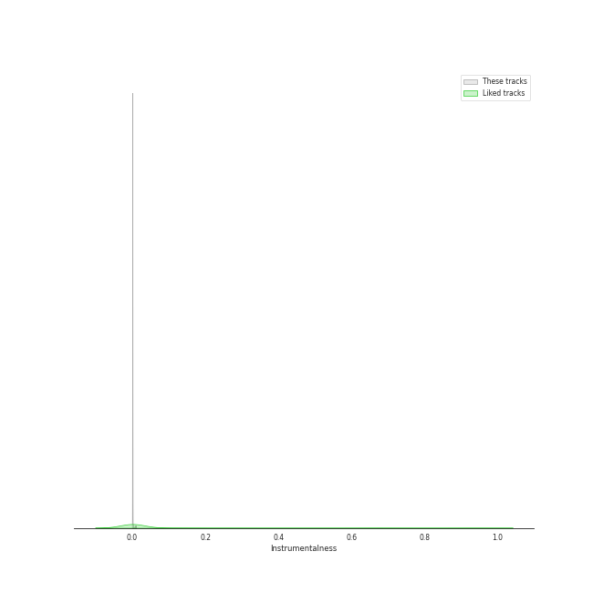
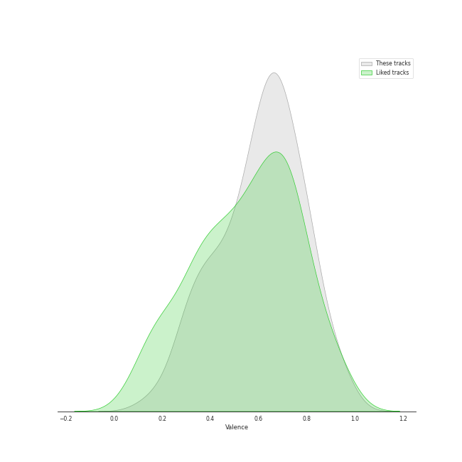

# Audio Features for Republic Records

## Danceability

| ​ | 10 most Danceable tracks | ​​ | 10 least Danceable tracks |
|:---|:---|:---|:---|
|  | #Twenty (0.956) |  | CHEESE (0.376) |
|  | SNEAKERS (0.935) |  | boyfriend (with Social House) (0.4) |
|  | RUN (HAN) (0.929) |  | Side Effects (0.444) |
|  | SNEAKERS (English Ver.) (0.92) |  | BLAME IT ON ME (0.483) |
|  | Scandal (0.898) |  | Deep end (Felix) (0.485) |
|  | Louder (0.886) |  | pov (0.487) |
|  | Any (0.879) |  | Love Me Like You Do (0.489) |
|  | Christmas EveL (0.878) |  | Blinding Lights (0.514) |
|  | WHAT I WANT (0.865) |  | Hellevator (0.515) |
|  | SHOOT! (0.852) |  | i hate to admit (Bang Chan) (0.523) |

## Energy

| ​ | 10 most Energetic tracks | ​​ | 10 least Energetic tracks |
|:---|:---|:---|:---|
|  | MIROH (0.979) |  | i hate to admit (Bang Chan) (0.217) |
|  | Side Effects (0.977) |  | Deep end (Felix) (0.223) |
|  | Feel Special (0.959) |  | miss you (Hyunjin) (0.226) |
|  | District 9 (0.956) |  | 7 rings (0.317) |
|  | Free Fall (0.95) |  | 24 to 25 (0.455) |
|  | CHEESE (0.946) |  | imagine (0.475) |
|  | Mixtape : Time Out (0.945) |  | Anti-Romantic (0.489) |
|  | Heart Shaker (0.944) |  | Die For You (with Ariana Grande) - Remix (0.5) |
|  | Louder (0.936) |  | Die For You - Remix (0.525) |
|  | WHAT I WANT (0.926) |  | pov (0.534) |

## Speechiness

| ​ | 10 most Speechy tracks | ​​ | 10 least Speechy tracks |
|:---|:---|:---|:---|
|  | boyfriend (with Social House) (0.461) |  | 24 to 25 (0.0288) |
|  | MANIAC (0.411) |  | Love Me Like You Do (0.0292) |
|  | Free Fall (0.376) |  | Drive (Bang Chan, Lee Know) (0.0314) |
|  | I GOT IT (HAN) (0.365) |  | CRAZY STUPID LOVE (0.0316) |
|  | Dior (0.351) |  | Stars and Raindrops (Seungmin) (0.0329) |
|  | VENOM (0.339) |  | Likey (0.033) |
|  | 7 rings (0.334) |  | Who You Are (0.0336) |
|  | Signal (0.334) |  | imagine (0.0364) |
|  | 3RACHA (Bang Chan, Changbin, HAN) (0.301) |  | KIDDING ME (0.0367) |
|  | Gas Me Up (0.286) |  | YES or YES (0.0374) |

## Acousticness

| ​ | 10 most Acoustic tracks | ​​ | 10 least Acoustic tracks |
|:---|:---|:---|:---|
|  | Deep end (Felix) (0.879) |  | Easy (0.000219) |
|  | miss you (Hyunjin) (0.826) |  | LO$ER=LO♡ER (0.001) |
|  | i hate to admit (Bang Chan) (0.794) |  | DALLA DALLA - English Ver. (0.00102) |
|  | RUN (HAN) (0.703) |  | DALLA DALLA (0.00116) |
|  | 7 rings (0.592) |  | Blinding Lights (0.00146) |
|  | Turtle (0.553) |  | SWIPE (0.00151) |
|  | 24 to 25 (0.533) |  | Maniac (0.00162) |
|  | positions (0.468) |  | WANNABE - English Ver. (0.00392) |
|  | Likey (0.413) |  | Frost (0.00551) |
|  | Merry & Happy (0.403) |  | SUPER BOARD (0.00653) |

## Instrumentalness

| ​ | 10 most Instrumental tracks | ​​ | 10 least Instrumental tracks |
|:---|:---|:---|:---|
|  | Fairy of Shampoo (0.00673) |  | SUPER BOARD (0.0) |
|  | Feel Special (0.00188) |  | SCIENTIST (0.0) |
|  | Louder (0.00146) |  | Winter Falls (0.0) |
|  | In the morning (0.00094) |  | Love Me Like You Do (0.0) |
|  | Scandal (0.00043) |  | Red Lights (Bang Chan, Hyunjin) (0.0) |
|  | Dior (0.000389) |  | Mixtape : Time Out (0.0) |
|  | Likey (0.000377) |  | Talk that Talk (0.0) |
|  | WANNABE (0.000179) |  | boyfriend (with Social House) (0.0) |
|  | TT (0.00016) |  | i hate to admit (Bang Chan) (0.0) |
|  | Like Ooh-Ahh (0.000105) |  | Back Door (0.0) |

## Liveness

| ​ | 10 most Live tracks | ​​ | 10 least Live tracks |
|:---|:---|:---|:---|
|  | FANCY (0.627) |  | CASE 143 (0.0222) |
|  | Red Lights (Bang Chan, Hyunjin) (0.612) |  | SNEAKERS (0.0223) |
|  | Levanter - English Ver. (0.544) |  | SNEAKERS (English Ver.) (0.0242) |
|  | God’s Menu (0.521) |  | Maknae On Top (I.N) (0.0374) |
|  | Easy (0.471) |  | First Time (0.0495) |
|  | I CAN'T STOP ME (0.463) |  | SET ME FREE (0.0499) |
|  | Die For You - Remix (0.441) |  | Up All Night (Bang Chan, Changbin, Felix, Seungmin) (0.0536) |
|  | I CAN'T STOP ME (English Version) (0.427) |  | Side Effects (0.0545) |
|  | Fairy of Shampoo (0.42) |  | SURF (0.0575) |
|  | Dior (0.408) |  | LOVE FOOLISH (0.0576) |

## Valence

| ​ | 10 most Happy tracks | ​​ | 10 least Happy tracks |
|:---|:---|:---|:---|
|  | The Feels (0.922) |  | Side Effects (0.118) |
|  | Up All Night (Bang Chan, Changbin, Felix, Seungmin) (0.916) |  | pov (0.173) |
|  | SHOOT! (0.907) |  | Anti-Romantic (0.206) |
|  | Muddy Water (Changbin, Hyunjin, HAN, Felix) (0.888) |  | Who You Are (0.215) |
|  | Maknae On Top (I.N) (0.883) |  | Deep end (Felix) (0.257) |
|  | Christmas EveL (0.878) |  | Motley Crew (0.288) |
|  | Boys Like You (0.874) |  | Hellevator (0.288) |
|  | Heart Shaker (0.857) |  | Voices (0.299) |
|  | Louder (0.853) |  | miss you (Hyunjin) (0.306) |
|  | Give Me Your TMI (0.824) |  | Love Me Like You Do (0.324) |

## Tempo

| ​ | 10 most Fast tracks | ​​ | 10 least Fast tracks |
|:---|:---|:---|:---|
|  | Signal (207.819) |  | imagine (62.52) |
|  | Awkward Silence (199.981) |  | Die For You - Remix (66.9) |
|  | boyfriend (with Social House) (190.097) |  | Die For You (with Ariana Grande) - Remix (67.033) |
|  | District 9 (179.987) |  | miss you (Hyunjin) (72.96) |
|  | Despacito - Remix (178.085) |  | I GOT IT (HAN) (75.698) |
|  | BLAME IT ON ME (177.713) |  | Hellevator (78.17) |
|  | Gas Me Up (177.17) |  | 1, 3, 2 (JEONGYEON, MINA, TZUYU) (88.938) |
|  | Free Fall (177.092) |  | CHEESE (89.657) |
|  | Price Tag (175.038) |  | Muddy Water (Changbin, Hyunjin, HAN, Felix) (89.989) |
|  | CHEER UP (172.95) |  | Drive (Bang Chan, Lee Know) (89.998) |
