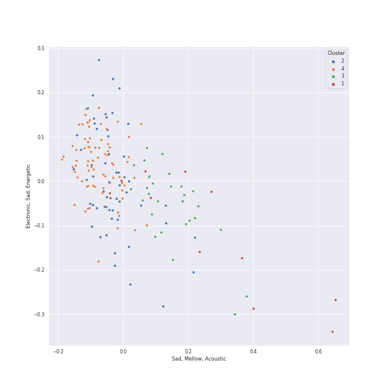

# Clusters in Republic Records

## Cluster #1

12 tracks

| Art | Track | Album | Artists | Label | 💚 | 🔗 |
|:---|:---|:---|:---|:---|:---|:---|
|  | 7 rings | thank u, next | [Ariana Grande](../../../../artists/ariana_grande/overview.md) | [Republic Records](../..) | 💚 | [🔗](https://open.spotify.com/track/6ocbgoVGwYJhOv1GgI9NsF) |
|  | break up with your girlfriend, i'm bored | thank u, next | [Ariana Grande](../../../../artists/ariana_grande/overview.md) | [Republic Records](../..) | | [🔗](https://open.spotify.com/track/4kV4N9D1iKVxx1KLvtTpjS) |
|  | imagine | thank u, next | [Ariana Grande](../../../../artists/ariana_grande/overview.md) | [Republic Records](../..) | 💚 | [🔗](https://open.spotify.com/track/39LmTF9RgyakzSYX8txrow) |
|  | thank u, next | thank u, next | [Ariana Grande](../../../../artists/ariana_grande/overview.md) | [Republic Records](../..) | | [🔗](https://open.spotify.com/track/3e9HZxeyfWwjeyPAMmWSSQ) |
|  | pov | Positions | [Ariana Grande](../../../../artists/ariana_grande/overview.md) | [Republic Records](../..) | | [🔗](https://open.spotify.com/track/3UoULw70kMsiVXxW0L3A33) |
|  | Love Me Like You Do | Fifty Shades Freed (Original Motion Picture Soundtrack) | Ellie Goulding | FSF, [Republic Records](../..), [Universal Music LLC](../../../universal_music_llc) | 💚 | [🔗](https://open.spotify.com/track/0Cy7wt6IlRfBPHXXjmZbcP) |
|  | Motley Crew | Motley Crew | Post Malone | [Republic Records](../..) | | [🔗](https://open.spotify.com/track/40uMIn2zJLAQhNXghRjBed) |
|  | 24 to 25 | Christmas EveL | [Stray Kids](../../../../artists/stray_kids/overview.md) | [Republic Records](../..) | | [🔗](https://open.spotify.com/track/6WM7pRXIeXuZ3Wowi9v1Wr) |
|  | Anti-Romantic | The Chaos Chapter: FREEZE | [TOMORROW X TOGETHER](../../../../artists/tomorrow_x_together/overview.md) | [Republic Records](../..) | 💚 | [🔗](https://open.spotify.com/track/44tTqUi3xi7E28QLzHVdUA) |
|  | Opening Sequence | minisode 2: Thursday's Child | [TOMORROW X TOGETHER](../../../../artists/tomorrow_x_together/overview.md) | [Republic Records](../..) | 💚 | [🔗](https://open.spotify.com/track/1exxGxUMlJWD1h9YcE9YZH) |
## Cluster #2

56 tracks

| Art | Track | Album | Artists | Label | 💚 | 🔗 |
|:---|:---|:---|:---|:---|:---|:---|
|  | Not Shy | Not Shy | [ITZY](../../../../artists/itzy/overview.md) | [Republic Records](../..) | 💚 | [🔗](https://open.spotify.com/track/1ehags7lQMM1qX94VJkoaf) |
|  | LOCO | CRAZY IN LOVE | [ITZY](../../../../artists/itzy/overview.md) | [Republic Records](../..) | 💚 | [🔗](https://open.spotify.com/track/56Yxkm62GtEpnPyG7TvwLY) |
|  | LOCO - English Ver. | CRAZY IN LOVE | [ITZY](../../../../artists/itzy/overview.md) | [Republic Records](../..) | | [🔗](https://open.spotify.com/track/0QPYsEvaoEJzZLSF5Cq390) |
|  | Silent Cry | NOEASY | [Stray Kids](../../../../artists/stray_kids/overview.md) | [Republic Records](../..) | | [🔗](https://open.spotify.com/track/5kBJH5gU89axZDauhfddpy) |
|  | Surfin’ (Lee Know, Changbin, Felix) | NOEASY | [Stray Kids](../../../../artists/stray_kids/overview.md) | [Republic Records](../..) | | [🔗](https://open.spotify.com/track/1FdnsU6An1Ye3uBJe8j23c) |
|  | VENOM | ODDINARY | [Stray Kids](../../../../artists/stray_kids/overview.md) | [Republic Records](../..) | 💚 | [🔗](https://open.spotify.com/track/4b3rGL8LDSkbARUUA20136) |
|  | Stars and Raindrops (Seungmin) | SKZ-REPLAY | [Stray Kids](../../../../artists/stray_kids/overview.md) | [Republic Records](../..) | | [🔗](https://open.spotify.com/track/5kFGqKqHzVVMMI7V7uoID1) |
|  | MEGAVERSE | ROCK-STAR | [Stray Kids](../../../../artists/stray_kids/overview.md) | [Republic Records](../..) | 💚 | [🔗](https://open.spotify.com/track/5Q1tv4GTxP3IJeGMOKdrFO) |
|  | TT | Twicecoaster: Lane 1 | [TWICE](../../../../artists/twice/overview.md) | [Republic Records](../..) | 💚 | [🔗](https://open.spotify.com/track/60jFaQV7Z4boGC4ob5B5c6) |
|  | What is Love | Summer Nights | [TWICE](../../../../artists/twice/overview.md) | [Republic Records](../..) | 💚 | [🔗](https://open.spotify.com/track/3zhbXKFjUDw40pTYyCgt1Y) |
## Cluster #3

30 tracks

| Art | Track | Album | Artists | Label | 💚 | 🔗 |
|:---|:---|:---|:---|:---|:---|:---|
|  | positions | Positions | [Ariana Grande](../../../../artists/ariana_grande/overview.md) | [Republic Records](../..) | 💚 | [🔗](https://open.spotify.com/track/35mvY5S1H3J2QZyna3TFe0) |
|  | Not Shy - English Ver. | Not Shy (English Ver.) | [ITZY](../../../../artists/itzy/overview.md) | [Republic Records](../..) | | [🔗](https://open.spotify.com/track/2p0WmvGmzE3mKr3lc6ZB9g) |
|  | Run For Roses | Fe3O4: BREAK | [NMIXX](../../../../artists/nmixx/overview.md) | [Republic Records](../..) | | [🔗](https://open.spotify.com/track/4byr9TsXs4qtm8rG2FfwRW) |
|  | Drive (Bang Chan, Lee Know) | SKZ-REPLAY | [Stray Kids](../../../../artists/stray_kids/overview.md) | [Republic Records](../..) | | [🔗](https://open.spotify.com/track/0hLvtmoexLKl14LrzxOYRt) |
|  | TOPLINE (Feat. Tiger JK) | 5-STAR | [Stray Kids](../../../../artists/stray_kids/overview.md), Tiger JK | [Republic Records](../..) | | [🔗](https://open.spotify.com/track/0jvZ9caE53ubCQXMki6W23) |
|  | BLAME IT ON ME | READY TO BE | [TWICE](../../../../artists/twice/overview.md) | [Republic Records](../..) | 💚 | [🔗](https://open.spotify.com/track/2hQdmjAhYEuMuqNWZCsz1J) |
|  | CRAZY STUPID LOVE | READY TO BE | [TWICE](../../../../artists/twice/overview.md) | [Republic Records](../..) | 💚 | [🔗](https://open.spotify.com/track/0jn8sYeWOdYHjdF2cBmF75) |
|  | MOONLIGHT SUNRISE | READY TO BE | [TWICE](../../../../artists/twice/overview.md) | [Republic Records](../..) | 💚 | [🔗](https://open.spotify.com/track/5IN9W6eUfk3014My9awagX) |
|  | WALLFLOWER | READY TO BE | [TWICE](../../../../artists/twice/overview.md) | [Republic Records](../..) | 💚 | [🔗](https://open.spotify.com/track/6EGkbPJrb88STcdfMu1j1y) |
|  | BLOOM | With YOU-th | [TWICE](../../../../artists/twice/overview.md) | [Republic Records](../..) | 💚 | [🔗](https://open.spotify.com/track/4bheT1Drc2vyQgN5VTwr8W) |
## Cluster #4

77 tracks

| Art | Track | Album | Artists | Label | 💚 | 🔗 |
|:---|:---|:---|:---|:---|:---|:---|
|  | In the morning | GUESS WHO | [ITZY](../../../../artists/itzy/overview.md) | [Republic Records](../..) | 💚 | [🔗](https://open.spotify.com/track/1Wcr8zrKqbUX0zwN8Dbr16) |
|  | In the morning - English Ver. | In the morning (English Ver.) | [ITZY](../../../../artists/itzy/overview.md) | [Republic Records](../..) | | [🔗](https://open.spotify.com/track/0rXBxNaEX9pJSV8U7xYUXr) |
|  | Young, Dumb, Stupid | expérgo | [NMIXX](../../../../artists/nmixx/overview.md) | [Republic Records](../..) | | [🔗](https://open.spotify.com/track/5eD83TX5ERuyJ7chfed3MQ) |
|  | Blue Hour | minisode1 : Blue Hour | [TOMORROW X TOGETHER](../../../../artists/tomorrow_x_together/overview.md) | [Republic Records](../..) | | [🔗](https://open.spotify.com/track/3ObPkJQAgjAhTwYvDhPrAW) |
|  | Dance The Night Away | Summer Nights | [TWICE](../../../../artists/twice/overview.md) | [Republic Records](../..) | 💚 | [🔗](https://open.spotify.com/track/4DYIDSMIB5y2UmZFv9fxeX) |
|  | YES or YES | YES or YES | [TWICE](../../../../artists/twice/overview.md) | [Republic Records](../..) | 💚 | [🔗](https://open.spotify.com/track/26OVhEqFDQH0Ij77QtmGP9) |
|  | SAY SOMETHING | Eyes Wide Open | [TWICE](../../../../artists/twice/overview.md) | [Republic Records](../..) | | [🔗](https://open.spotify.com/track/2gagYYY4R8QimbnFqd96ST) |
|  | SCIENTIST | Formula of Love: O+T=<3 | [TWICE](../../../../artists/twice/overview.md) | [Republic Records](../..) | 💚 | [🔗](https://open.spotify.com/track/0BJMgVrnWIvgYsjq8KaPeh) |
|  | SET ME FREE | READY TO BE | [TWICE](../../../../artists/twice/overview.md) | [Republic Records](../..) | 💚 | [🔗](https://open.spotify.com/track/4OtVQ2ZxS7yigIjGz5yKg1) |
|  | SET ME FREE (ENG) | READY TO BE | [TWICE](../../../../artists/twice/overview.md) | [Republic Records](../..) | | [🔗](https://open.spotify.com/track/6bkTxw6m6vl8Oc3xtKBXN0) |