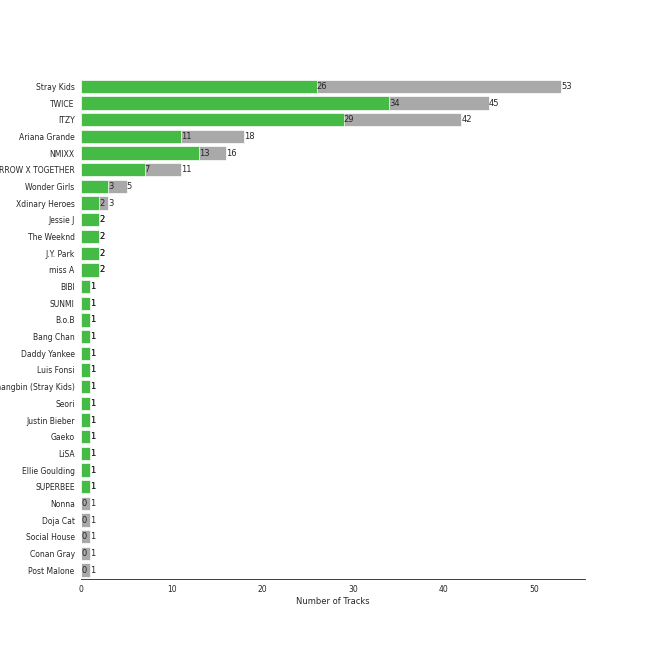
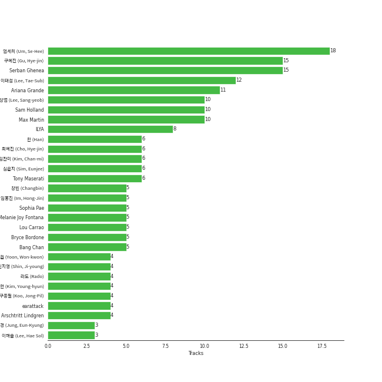

# Republic Records

207 songs

[See Track Features](audio_features.md)

[See Clusters](clusters/overview.md)

Appears as:
- Republic Records - Stray Kids (53 tracks)
- Republic Records - TWICE (45 tracks)
- Republic Records - ITZY (42 tracks)
- Republic Records (22 tracks)
- Republic Records - NMIXX (16 tracks)
- Republic Records - TXT (11 tracks)
- Republic Records - JYP Entertainment (8 tracks)
- Republic Records - Xdinary Heroes (3 tracks)
- Lava Music/Republic Records (2 tracks)
- Republic Records - J.Y. Park (2 tracks)
- Republic/UMLE (1 tracks)
- Republic/Universal/FSF (1 tracks)
- Victor Victor Worldwide/Republic Records (1 tracks)

## Top Artists

| Art | Rank | Tracks | 💚 | Artist | 🔗 |
|:---|---:|---:|---:|:---|:---|
|  | 9 | 45 | 34 | [TWICE](../../artists/twice/overview.md) | [🔗](https://open.spotify.com/artist/7n2Ycct7Beij7Dj7meI4X0) |
|  | 5 | 42 | 28 | [ITZY](../../artists/itzy/overview.md) | [🔗](https://open.spotify.com/artist/2KC9Qb60EaY0kW4eH68vr3) |
|  | 10 | 53 | 26 | [Stray Kids](../../artists/stray_kids/overview.md) | [🔗](https://open.spotify.com/artist/2dIgFjalVxs4ThymZ67YCE) |
|  | 18 | 16 | 13 | [NMIXX](../../artists/nmixx/overview.md) | [🔗](https://open.spotify.com/artist/28ot3wh4oNmoFOdVajibBl) |
|  | 33 | 18 | 11 | [Ariana Grande](../../artists/ariana_grande/overview.md) | [🔗](https://open.spotify.com/artist/66CXWjxzNUsdJxJ2JdwvnR) |
|  | 161 | 11 | 7 | [TOMORROW X TOGETHER](../../artists/tomorrow_x_together/overview.md) | [🔗](https://open.spotify.com/artist/0ghlgldX5Dd6720Q3qFyQB) |
|  | 86 | 5 | 3 | Wonder Girls | [🔗](https://open.spotify.com/artist/3Cv2vi3WTl8VZOTdrBkKdM) |
|  | 250 | 3 | 2 | Xdinary Heroes | [🔗](https://open.spotify.com/artist/1khChLj7REGqjM043PlYyn) |
|  | 434 | 2 | 2 | Jessie J | [🔗](https://open.spotify.com/artist/2gsggkzM5R49q6jpPvazou) |
|  | 353 | 2 | 2 | The Weeknd | [🔗](https://open.spotify.com/artist/1Xyo4u8uXC1ZmMpatF05PJ) |

See all 32 artists

| Art | Rank | Tracks | 💚 | Artist | 🔗 |
|:---|---:|---:|---:|:---|:---|
|  | 434 | 2 | 2 | J.Y. Park | [🔗](https://open.spotify.com/artist/1TTx0YcbKUtJIZY1HEnh9B) |
|  | 372 | 2 | 2 | miss A | [🔗](https://open.spotify.com/artist/1BEohdSWSBggmO979tzRwW) |
|  | 72 | 1 | 1 | [BIBI](../../artists/bibi/overview.md) | [🔗](https://open.spotify.com/artist/6UbmqUEgjLA6jAcXwbM1Z9) |
|  | 43 | 1 | 1 | [SUNMI](../../artists/sunmi/overview.md) | [🔗](https://open.spotify.com/artist/6MoXcK2GyGg7FIyxPU5yW6) |
|  | 434 | 1 | 1 | B.o.B | [🔗](https://open.spotify.com/artist/5ndkK3dpZLKtBklKjxNQwT) |
| | 398 | 1 | 1 | Bang Chan | [🔗](https://open.spotify.com/artist/4qy7HANJDOZRObts4Z0KSV) |
|  | 434 | 1 | 1 | Daddy Yankee | [🔗](https://open.spotify.com/artist/4VMYDCV2IEDYJArk749S6m) |
|  | 434 | 1 | 1 | Luis Fonsi | [🔗](https://open.spotify.com/artist/4V8Sr092TqfHkfAA5fXXqG) |
|  | 396 | 1 | 1 | Changbin (Stray Kids) | [🔗](https://open.spotify.com/artist/3XSid6KaiKoMAVZs2ug3yw) |
|  | 419 | 1 | 1 | Seori | [🔗](https://open.spotify.com/artist/2bWTIIQP9zaVc55RaMGu7e) |
|  | 212 | 1 | 1 | [Justin Bieber](../../artists/justin_bieber/overview.md) | [🔗](https://open.spotify.com/artist/1uNFoZAHBGtllmzznpCI3s) |
|  | 367 | 1 | 1 | Gaeko | [🔗](https://open.spotify.com/artist/0tkHE1pQ5ZCgQb8WZ0ba79) |
|  | 137 | 1 | 1 | LiSA | [🔗](https://open.spotify.com/artist/0blbVefuxOGltDBa00dspv) |
|  | 434 | 1 | 1 | Ellie Goulding | [🔗](https://open.spotify.com/artist/0X2BH1fck6amBIoJhDVmmJ) |
|  | 434 | 1 | 1 | SUPERBEE | [🔗](https://open.spotify.com/artist/0Q5XzDpn7DCI5jlubok4xb) |
|  | 434 | 1 | 0 | Nonna | [🔗](https://open.spotify.com/artist/6maPmKkdwM4eyhz5O4lbkP) |
|  | 203 | 1 | 0 | [Doja Cat](../../artists/doja_cat/overview.md) | [🔗](https://open.spotify.com/artist/5cj0lLjcoR7YOSnhnX0Po5) |
|  | 434 | 1 | 0 | Social House | [🔗](https://open.spotify.com/artist/5UjifI1TYefXWn9GdqDOHl) |
|  | 434 | 1 | 0 | Conan Gray | [🔗](https://open.spotify.com/artist/4Uc8Dsxct0oMqx0P6i60ea) |
|  | 434 | 1 | 0 | Post Malone | [🔗](https://open.spotify.com/artist/246dkjvS1zLTtiykXe5h60) |
|  | 279 | 1 | 0 | Tiger JK | [🔗](https://open.spotify.com/artist/11S00dFcvNvJahis8MTGMD) |
|  | 434 | 1 | 0 | Pop Smoke | [🔗](https://open.spotify.com/artist/0eDvMgVFoNV3TpwtrVCoTj) |

## Top Albums

| Art | Rank | Tracks | 💚 | Album | Release Date | 🔗 |
|:---|---:|---:|---:|:---|:---|:---|
|  | 177 | 9 | 3 | SKZ-REPLAY | 2022-12-21 | [🔗](https://open.spotify.com/album/3UXrliH0JUQvcaLnBD8Txz) |
|  | 101 | 8 | 6 | Formula of Love: O+T=<3 | 2021-11-12 | [🔗](https://open.spotify.com/album/5052Ip89wdW8EGdpjEpNeq) |
|  | 485 | 7 | 5 | eternal sunshine | 2024-03-08 | [🔗](https://open.spotify.com/album/5EYKrEDnKhhcNxGedaRQeK) |
|  | 73 | 7 | 5 | READY TO BE | 2023-03-10 | [🔗](https://open.spotify.com/album/7hzP5i7StxYG4StECA0rrJ) |
|  | 35 | 6 | 4 | NOEASY | 2021-08-23 | [🔗](https://open.spotify.com/album/558tpdCejjVQNFAumRAeQj) |
|  | 7 | 5 | 5 | BORN TO BE | 2024-01-08 | [🔗](https://open.spotify.com/album/3cm3EkNQLpKu58btSJT7fz) |
|  | 60 | 5 | 4 | ROCK-STAR | 2023-11-10 | [🔗](https://open.spotify.com/album/0aJnGEZWIc1VCYlZOXv05a) |
|  | 76 | 5 | 4 | KILL MY DOUBT | 2023-07-31 | [🔗](https://open.spotify.com/album/6P01cKb7sdwfnNpuMLNEik) |
|  | 510 | 5 | 3 | thank u, next | 2019-02-08 | [🔗](https://open.spotify.com/album/2fYhqwDWXjbpjaIJPEfKFw) |
|  | 116 | 5 | 3 | expérgo | 2023-03-20 | [🔗](https://open.spotify.com/album/6GbCvETnCVvkpvK6qCqTYS) |

See all 89 albums

| Art | Rank | Tracks | 💚 | Album | Release Date | 🔗 |
|:---|---:|---:|---:|:---|:---|:---|
|  | 381 | 5 | 3 | ODDINARY | 2022-03-18 | [🔗](https://open.spotify.com/album/0Gmf4pfe0POEQq2FgGAj2q) |
|  | 198 | 5 | 3 | GUESS WHO | 2021-04-30 | [🔗](https://open.spotify.com/album/4lS8nhX8cplsYPzKjvhw6G) |
|  | 11 | 5 | 3 | CRAZY IN LOVE | 2021-09-24 | [🔗](https://open.spotify.com/album/4U7rGOkJgtxs27H9L93Xli) |
|  | 629 | 5 | 3 | CHECKMATE | 2022-07-15 | [🔗](https://open.spotify.com/album/64EGnoCD5NuC41OqQ3E7UK) |
|  | 258 | 4 | 3 | GOLD | 2024-10-15 | [🔗](https://open.spotify.com/album/4CRfobFgSG0GOzplgTI79s) |
|  | 110 | 4 | 3 | Fe3O4: STICK OUT | 2024-08-19 | [🔗](https://open.spotify.com/album/2pb2RscdByJ8pc7dPT1SY2) |
|  | 357 | 4 | 2 | MAXIDENT | 2022-10-07 | [🔗](https://open.spotify.com/album/0T6hYH0UyDjNraWZk2mZWi) |
|  | 202 | 4 | 1 | Christmas EveL | 2021-11-29 | [🔗](https://open.spotify.com/album/1qVuQI0WRn2Mczbdxx54Ih) |
|  | 665 | 4 | 0 | Not Shy (English Ver.) | 2021-01-22 | [🔗](https://open.spotify.com/album/0hoNwSKuuOeT9eAxopgMdm) |
|  | 115 | 3 | 3 | With YOU-th | 2024-02-23 | [🔗](https://open.spotify.com/album/575TQDOQqc0MAheeEeKWUR) |
|  | 331 | 3 | 3 | Taste of Love | 2021-06-11 | [🔗](https://open.spotify.com/album/00vb6sViDbJLmLLchfbRh4) |
|  | 21 | 3 | 3 | Fe3O4: BREAK | 2024-01-15 | [🔗](https://open.spotify.com/album/5CCxLQgcI7cVwmgFDlicbP) |
|  | 38 | 3 | 3 | Eyes Wide Open | 2020-10-26 | [🔗](https://open.spotify.com/album/33jypnU7WULxPaVrjj4RXH) |
|  | 665 | 3 | 2 | The Chaos Chapter: FREEZE | 2021-05-31 | [🔗](https://open.spotify.com/album/5Zdr9vactwnJH4Vpe9Mid9) |
|  | 56 | 3 | 2 | CHESHIRE | 2022-11-30 | [🔗](https://open.spotify.com/album/2a1ezg7hE6Dyuymv1aCnkm) |
|  | 665 | 3 | 2 | BETWEEN 1&2 | 2022-08-26 | [🔗](https://open.spotify.com/album/3NZ94nQbqimcu2i71qhc4f) |
|  | 178 | 3 | 2 | ATE | 2024-07-19 | [🔗](https://open.spotify.com/album/3WdsoMKRqtw5Sgg67YrpnY) |
|  | 213 | 3 | 2 | 5-STAR | 2023-06-02 | [🔗](https://open.spotify.com/album/3Pel3gWsPxVpZVrciU0Fm6) |
|  | 665 | 3 | 1 | Positions | 2020-10-30 | [🔗](https://open.spotify.com/album/3euz4vS7ezKGnNSwgyvKcd) |
|  | 665 | 3 | 1 | GO LIVE | 2020-06-17 | [🔗](https://open.spotify.com/album/6DWLIzvmiLPAuDWYZqrLQo) |
|  | 665 | 2 | 2 | Who You Are (Platinum Edition) | 2011-01-01 | [🔗](https://open.spotify.com/album/3ga4adzUpLaS2LDcoqfs2r) |
|  | 384 | 2 | 2 | The Name Chapter: TEMPTATION | 2023-01-27 | [🔗](https://open.spotify.com/album/7gkb4MxKe9rnoR3wxbJXJg) |
|  | 665 | 2 | 2 | Sweetener | 2018-08-17 | [🔗](https://open.spotify.com/album/3tx8gQqWbGwqIGZHqDNrGe) |
|  | 142 | 2 | 2 | Summer Nights | 2018-07-09 | [🔗](https://open.spotify.com/album/2GKTroaa4ysyhEdvzpvUoM) |
|  | 255 | 2 | 2 | Not Shy | 2020-08-17 | [🔗](https://open.spotify.com/album/5NN55LKbjzX16a7Uf8u7Os) |
|  | 145 | 2 | 2 | IN LIFE | 2020-09-14 | [🔗](https://open.spotify.com/album/0aERWcI2KYSCM4biUihB9X) |
|  | 665 | 2 | 2 | ENTWURF | 2022-09-19 | [🔗](https://open.spotify.com/album/3wMlxC4t3dN70e1OF8wUfz) |
|  | 491 | 2 | 2 | After Hours | 2020-03-20 | [🔗](https://open.spotify.com/album/4yP0hdKOZPNshxUOjY0cZj) |
|  | 241 | 2 | 2 | AD MARE | 2022-02-22 | [🔗](https://open.spotify.com/album/2QbA97qjlAs81t6kVS6zBk) |
|  | 649 | 2 | 1 | Twicetagram | 2017-10-30 | [🔗](https://open.spotify.com/album/3hJXmK5gWN9P6jtZL0Lr2y) |
|  | 156 | 2 | 1 | Merry & Happy | 2017-12-11 | [🔗](https://open.spotify.com/album/0R7pj4tnmcoUulrZGPo6nw) |
|  | 319 | 2 | 1 | Feel Special | 2019-09-23 | [🔗](https://open.spotify.com/album/3NQBPabmRm3LzVcmtkTLfo) |
|  | 665 | 2 | 0 | SKZ2020 | 2020-03-18 | [🔗](https://open.spotify.com/album/6QIWJVJPPgAA5c4aIb1zCA) |
|  | 665 | 1 | 1 | minisode 2: Thursday's Child | 2022-05-09 | [🔗](https://open.spotify.com/album/1o8jYrnyZueTPIdhlHuTc8) |
|  | 665 | 1 | 1 | YES or YES | 2018-11-05 | [🔗](https://open.spotify.com/album/25VunQEW0x2W6ALND2Mh4g) |
|  | 515 | 1 | 1 | Why So Lonely | 2016-07-05 | [🔗](https://open.spotify.com/album/2TzaSJlsVyKcZ0NOf2TI9U) |
|  | 665 | 1 | 1 | Twicecoaster: Lane 1 | 2016-10-24 | [🔗](https://open.spotify.com/album/5zQhaDNbiXHRqd8Y51I4vy) |
|  | 602 | 1 | 1 | Troubleshooting | 2024-04-30 | [🔗](https://open.spotify.com/album/26ogXm7X0kUSidtoaQVBei) |
|  | 665 | 1 | 1 | The Wonder Years | 2007-09-12 | [🔗](https://open.spotify.com/album/3svp0TRDC5MMUAPNMimAi1) |
|  | 451 | 1 | 1 | The Story Begins | 2015-10-20 | [🔗](https://open.spotify.com/album/72WWZVAx6GtSbEeGESwDLo) |
|  | 665 | 1 | 1 | The Dream Chapter: MAGIC | 2019-10-21 | [🔗](https://open.spotify.com/album/7yDyRk7Wvvw7JM1kqV4tJf) |
|  | 665 | 1 | 1 | The Chaos Chapter: FIGHT OR ESCAPE | 2021-08-17 | [🔗](https://open.spotify.com/album/2CjIfWoFITACUOlWGB7os5) |
|  | 665 | 1 | 1 | So Hot | 2008-06-03 | [🔗](https://open.spotify.com/album/7uLVRq4SzLmamXRIBONIBv) |
|  | 665 | 1 | 1 | SIGNAL | 2017-05-15 | [🔗](https://open.spotify.com/album/28PwDunFAR71toOCTYRvkf) |
|  | 665 | 1 | 1 | PAGE TWO | 2016-04-25 | [🔗](https://open.spotify.com/album/6q2oUEqL9uzVXHCeKoA8JV) |
|  | 582 | 1 | 1 | IT'z ME | 2020-03-09 | [🔗](https://open.spotify.com/album/7ynKAohxfwPUZzvU8f1p1U) |
|  | 509 | 1 | 1 | IT'z ICY | 2019-07-29 | [🔗](https://open.spotify.com/album/5Xb03XAF2LoaMqbM38H9eB) |
|  | 501 | 1 | 1 | IT'z Different | 2019-02-12 | [🔗](https://open.spotify.com/album/7Mxbav9clZ3AVDKThwwgXS) |
|  | 540 | 1 | 1 | Hush | 2013-11-06 | [🔗](https://open.spotify.com/album/01zi2Tsa9ojYgPY5Q08aUb) |
|  | 323 | 1 | 1 | Hello, world! | 2022-07-20 | [🔗](https://open.spotify.com/album/5zjnlpEemkmaN6iv16vmDm) |
|  | 665 | 1 | 1 | Groove Missing | 2022-11-21 | [🔗](https://open.spotify.com/album/2QjX22VyNZxSaKpv691QM1) |
|  | 665 | 1 | 1 | Fifty Shades Freed (Original Motion Picture Soundtrack) | 2018-02-09 | [🔗](https://open.spotify.com/album/4w0N1CaZwQ5RPIuawqlYyy) |
|  | 665 | 1 | 1 | FEVER | 2019-12-01 | [🔗](https://open.spotify.com/album/1AF9DPA6J8zveFttZ247O0) |
|  | 225 | 1 | 1 | FANCY YOU | 2019-04-22 | [🔗](https://open.spotify.com/album/3aLpWFejbsdyafODLXRqwF) |
|  | 665 | 1 | 1 | Despacito Feat. Justin Bieber (Remix) | 2017-04-17 | [🔗](https://open.spotify.com/album/3Gq2Dme9nesdgoqNNlcN8O) |
|  | 665 | 1 | 1 | Clé 2 : Yellow Wood | 2019-06-19 | [🔗](https://open.spotify.com/album/7a3luOh8mK0q8YsRkNUjrU) |
|  | 665 | 1 | 1 | Clé 1 : MIROH | 2019-03-25 | [🔗](https://open.spotify.com/album/3s6RbqkTprnGwKpoUSYL00) |
|  | 229 | 1 | 1 | CRY FOR ME | 2020-12-18 | [🔗](https://open.spotify.com/album/2aRAPmBCEdo9pWimsI5l87) |
|  | 665 | 1 | 1 | A Class | 2011-07-18 | [🔗](https://open.spotify.com/album/5Nq0GIIfrsCnUPx4Ayej1c) |
|  | 665 | 1 | 1 | 24 Hours | 2013-08-26 | [🔗](https://open.spotify.com/album/4ag4tJmAksjMdxICMV83Aw) |
|  | 665 | 1 | 0 | minisode1 : Blue Hour | 2020-10-26 | [🔗](https://open.spotify.com/album/2DDNDdePEx9R0bBwRqahdr) |
|  | 665 | 1 | 0 | boyfriend | 2019-08-02 | [🔗](https://open.spotify.com/album/3zVB99XMdbP9HTVNg0GJwV) |
|  | 665 | 1 | 0 | The Wonder Years - Trilogy | 2008-09-22 | [🔗](https://open.spotify.com/album/5apL7r2YXvPSkB8CxaZ7Pv) |
|  | 665 | 1 | 0 | The Dream Chapter: ETERNITY | 2020-05-18 | [🔗](https://open.spotify.com/album/4jTVGyo4fSSFniFPbfr0bW) |
|  | 665 | 1 | 0 | Step Out of Clé (English Ver.) | 2020-01-24 | [🔗](https://open.spotify.com/album/2BBeNPEEevRiYISKYEnGvc) |
|  | 665 | 1 | 0 | REBOOT | 2015-08-03 | [🔗](https://open.spotify.com/album/3in3RzViPTp3fZo51rmJoB) |
|  | 665 | 1 | 0 | Motley Crew | 2021-07-09 | [🔗](https://open.spotify.com/album/4tokbQaFXRrq8keVGBD9vb) |
|  | 665 | 1 | 0 | Mixtape : Time Out | 2022-08-01 | [🔗](https://open.spotify.com/album/6Sr3My17NKn1g1zIFclPoS) |
|  | 665 | 1 | 0 | Mixtape | 2018-01-08 | [🔗](https://open.spotify.com/album/1kTzTL0iOIE2IAGw83yY4O) |
|  | 665 | 1 | 0 | Meet The Woo | 2019-07-26 | [🔗](https://open.spotify.com/album/6d1vGZsr6Uy3h9IigBpPAf) |
|  | 665 | 1 | 0 | MORE & MORE (English Version) | 2020-08-21 | [🔗](https://open.spotify.com/album/4AXNnQf2SkyY8d4FQaBKo5) |
|  | 665 | 1 | 0 | MORE & MORE | 2020-06-01 | [🔗](https://open.spotify.com/album/5KsduuDNWzt65TaHzmtciv) |
|  | 665 | 1 | 0 | Livelock | 2023-10-11 | [🔗](https://open.spotify.com/album/6wRy2dydFytIzBlEqVa5sh) |
|  | 665 | 1 | 0 | Kid Krow | 2020-03-20 | [🔗](https://open.spotify.com/album/2CMlkzFI2oDAy5MbyV7OV5) |
|  | 665 | 1 | 0 | In the morning (English Ver.) | 2021-05-14 | [🔗](https://open.spotify.com/album/1VbG3CJlf1cSVDibgiM3GM) |
|  | 665 | 1 | 0 | I am WHO | 2018-08-06 | [🔗](https://open.spotify.com/album/2SACeVKmkXeAXHqLDdTU9N) |
|  | 665 | 1 | 0 | I am NOT | 2018-03-26 | [🔗](https://open.spotify.com/album/6xP5hGAHaLArPqF07UYVJL) |
|  | 665 | 1 | 0 | I CAN'T STOP ME (English Version) | 2020-11-30 | [🔗](https://open.spotify.com/album/2KGNQmq4gpzmdaIcAgJdVe) |
|  | 665 | 1 | 0 | Cat & Dog (English Version) | 2019-05-03 | [🔗](https://open.spotify.com/album/4uJ120PsfiWOC7aV5FqGkU) |

## Genres

| Tracks | 💚 | Genre |
|---:|---:|:---|
| 175 | 114 | [k-pop](../../genres/k-pop/overview.md) |
| 110 | 80 | [k-pop girl group](../../genres/k-pop_girl_group/overview.md) |
| 123 | 76 | [pop](../../genres/pop/overview.md) |
| 67 | 35 | [k-pop boy group](../../genres/k-pop_boy_group/overview.md) |
| 2 | 2 | [dance pop](../../genres/dance_pop/overview.md) |
| 2 | 2 | classic k-pop |
| 2 | 2 | [canadian pop](../../genres/canadian_pop/overview.md) |
| 2 | 2 | canadian contemporary r&b |
| 1 | 1 | [uk pop](../../genres/uk_pop/overview.md) |
| 1 | 1 | puerto rican pop |

See all 20 genres

| Tracks | 💚 | Genre |
|---:|---:|:---|
| 1 | 1 | [metropopolis](../../genres/metropopolis/overview.md) |
| 1 | 1 | latin pop |
| 1 | 1 | indietronica |
| 2 | 0 | [rap](../../genres/rap/overview.md) |
| 1 | 0 | pov: indie |
| 1 | 0 | melodic rap |
| 1 | 0 | [hip hop](../../genres/hip_hop/overview.md) |
| 1 | 0 | dfw rap |
| 1 | 0 | brooklyn drill |
| 1 | 0 | bedroom pop |

## Top Producers

| Art | Producer | Tracks | Credit Types |
|:---|:---|---:|:---|
| | [엄세희 (Um, Se-Hee)](../../producers/엄세희_(um,_se-hee)/overview.md) | 18 | Producer |
| | [Serban Ghenea](../../producers/serban_ghenea/overview.md) | 15 | Producer |
| | [구혜진 (Gu, Hye-jin)](../../producers/구혜진_(gu,_hye-jin)/overview.md) | 15 | Producer |
| | [이태섭 (Lee, Tae-Sub)](../../producers/이태섭_(lee,_tae-sub)/overview.md) | 12 | Producer |
|  | [Ariana Grande](../../artists/ariana_grande/overview.md) | 11 | Lyricist, Producer, Songwriter, Arranger |
| | [이상엽 (Lee, Sang-yeob)](../../producers/이상엽_(lee,_sang-yeob)/overview.md) | 10 | Producer |
| | [Max Martin](../../producers/max_martin/overview.md) | 10 | Producer, Songwriter, Arranger, Lyricist |
| | [Sam Holland](../../producers/sam_holland/overview.md) | 10 | Producer |
| | [ILYA](../../producers/ilya/overview.md) | 8 | Arranger, Producer, Songwriter |
| | [심은지 (Sim, Eunjee)](../../producers/심은지_(sim,_eunjee)/overview.md) | 6 | Arranger, Lyricist, Producer, Songwriter |

View all

| Art | Producer | Tracks | Credit Types |
|:---|:---|---:|:---|
| | 임찬미 (Kim, Chan-mi) | 6 | Producer |
| | [Tony Maserati](../../producers/tony_maserati/overview.md) | 6 | Producer |
| | 최혜진 (Cho, Hye-jin) | 6 | Producer |
| | [한 (Han)](../../producers/한_(han)/overview.md) | 6 | Songwriter, Lyricist |
| | Lou Carrao | 5 | Producer |
| | 창빈 (Changbin) | 5 | Songwriter, Lyricist |
| | Bang Chan | 5 | Arranger, Songwriter, Lyricist, Producer |
| | 임홍진 (Im, Hong-Jin) | 5 | Producer |
| | [Bryce Bordone](../../producers/bryce_bordone/overview.md) | 5 | Producer |
| | Melanie Joy Fontana | 5 | Lyricist, Songwriter |
| | Sophia Pae | 5 | Arranger |
| | [라도 (Rado)](../../producers/라도_(rado)/overview.md) | 4 | Lyricist, Songwriter, Arranger, Producer |
| | 신지영 (Shin, Ji-young) | 4 | Producer |
| | 김영현 (Kim, Young-hyun) | 4 | Producer |
| | [구종필 (Koo, Jong-Pil)](../../producers/구종필_(koo,_jong-pil)/overview.md) | 4 | Producer |
| | [earattack](../../producers/earattack/overview.md) | 4 | Arranger, Producer, Songwriter, Lyricist |
| | [윤원권 (Yoon, Won-kwon)](../../producers/윤원권_(yoon,_won-kwon)/overview.md) | 4 | Producer |
| | [Arschtritt Lindgren](../../producers/arschtritt_lindgren/overview.md) | 4 | Arranger, Songwriter, Producer |
| | Dr.JO | 3 | Lyricist, Arranger |
| | KayOne | 3 | Producer |
| | 오현선 (Oh, Hyun-sun) | 3 | Lyricist |
| | [블랙아이드필승 (Black Eyed Pilseung)](../../producers/블랙아이드필승_(black_eyed_pilseung)/overview.md) | 3 | Songwriter, Lyricist |
| | Brian U | 3 | Songwriter, Arranger |
| | TBHits | 3 | Arranger, Songwriter, Producer |
| | [Savan Kotecha](../../producers/savan_kotecha/overview.md) | 3 | Songwriter |
| | Sam Lewis | 3 | Lyricist, Songwriter |
| | [정은경 (Jung, Eun-Kyung)](../../producers/정은경_(jung,_eun-kyung)/overview.md) | 3 | Producer |
| | 박은정 (박은정) | 3 | Producer |
| | 이우현 (Lee, Woo-hyun) | 3 | Arranger, Songwriter, Lyricist, Producer |
| | 이해솔 (Lee, Hae Sol) | 3 | Arranger, Songwriter, Producer, Lyricist |
| | 이경원 (Lee, Kyung-won) | 3 | Producer |
|  | J.Y. Park | 3 | Lyricist, Arranger, Songwriter |
| | Frankie Day | 3 | Songwriter, Lyricist |
| | Ayushy | 3 | Songwriter, Arranger |
| | 서은일 (Seo, Eun-il) | 3 | Producer |
| | 백새임 (Baek, Sae-im) | 2 | Lyricist |
| | 채강해 (Chae, Kanghae) | 2 | Songwriter, Arranger, Producer |
| | Greg Bonnick | 2 | Songwriter |
| | EJAE | 2 | Songwriter |
| | 이우민 (Yiwoomin) | 2 | Arranger, Lyricist, Producer, Songwriter |
| | Brendan Morawski | 2 | Producer |
| | [John Hanes](../../producers/john_hanes/overview.md) | 2 | Producer |
| | Shin Kamiyama | 2 | Producer |
| | RESTART | 2 | Songwriter, Arranger, Producer |
|  | The Weeknd | 2 | Producer, Songwriter |
| | Hayden Chapman | 2 | Songwriter |
| | Mr. Franks | 2 | Arranger, Songwriter, Producer |
| | [danke](../../producers/danke/overview.md) | 2 | Lyricist |
| | Kobee | 2 | Arranger, Producer, Songwriter |
| | Charlotte Wilson | 2 | Songwriter, Arranger |
| | Belly | 2 | Songwriter |
| | 아르마딜로 (Armadillo) | 2 | Arranger, Songwriter |
| | Oscar Holter | 2 | Producer, Songwriter |
| | Lauren Dyson | 2 | Songwriter, Arranger |
| | 김용운 (Gim, Yong-un) | 2 | Producer |
| | GG Ramirez | 2 | Lyricist, Songwriter |
| | Billy Hickey | 2 | Producer |
| | 이스란 (Lee, Seran) | 2 | Lyricist |
| | DaHeala | 2 | Songwriter |
|  | Jessie J | 2 | Songwriter |
| | 홍장미 (Hong, Jangmi) | 2 | Producer |
| | Noday | 2 | Arranger, Lyricist, Songwriter |
| | [LDN Noise](../../producers/ldn_noise/overview.md) | 2 | Arranger, Producer |
| | Noah Passovoy | 1 | Producer |
| | HOJI | 1 | Songwriter |
| | Jameel Roberts | 1 | Songwriter |
| | Erika Ender | 1 | Songwriter |
| | Zarah Christenson | 1 | Songwriter |
| | Hannah Robinson | 1 | Lyricist, Songwriter |
| | Poo Bear | 1 | Songwriter |
| | Daniel Mikael Caesar | 1 | Songwriter |
| | Cameron Neilson | 1 | Songwriter |
| | Zaya | 1 | Lyricist |
| | Boy Matthews | 1 | Lyricist |
| | 방혜현 (Bang, Hye Hyun) | 1 | Lyricist |
| | Lexxi Saal | 1 | Lyricist, Songwriter |
| | 김다현 (Kim, Da-hyun) | 1 | Lyricist |
| | IRIS Yerin Lee | 1 | Lyricist, Songwriter |
| | Gusten Dahlqvist | 1 | Arranger, Producer, Songwriter |
|  | B.o.B | 1 | Songwriter |
| | Call Me Loop | 1 | Lyricist, Songwriter |
| | Joseph K | 1 | Arranger, Songwriter |
| | Oscar Hammerstein II | 1 | Lyricist |
| | Chanti | 1 | Songwriter |
| | Andrew Watt | 1 | Songwriter |
| | 이기 (IGGY) | 1 | Arranger, Lyricist, Producer, Songwriter |
| | 정호현 (정호현) | 1 | Arranger, Lyricist, Songwriter |
|  | [Justin Bieber](../../artists/justin_bieber/overview.md) | 1 | Songwriter |
| | Alma Goodman | 1 | Songwriter |
| | Cazzi Opeia | 1 | Songwriter |

## Tracks released under Republic Records

| Art | Track | Album | Artists | Label | Rank | 💚 | 🔗 |
|:---|:---|:---|:---|:---|---:|:---|:---|
|  | LOCO | CRAZY IN LOVE | [ITZY](../../artists/itzy/overview.md) | [Republic Records](.) | 5 | 💚 | [🔗](https://open.spotify.com/track/56Yxkm62GtEpnPyG7TvwLY) |
|  | Mr. Vampire | BORN TO BE | [ITZY](../../artists/itzy/overview.md) | [Republic Records](.) | 8 | 💚 | [🔗](https://open.spotify.com/track/3uI6jqO0fFBoFryc8SJOXw) |
|  | Thunderous | NOEASY | [Stray Kids](../../artists/stray_kids/overview.md) | [Republic Records](.) | 28 | 💚 | [🔗](https://open.spotify.com/track/0nwTMzpatarzvLvtwwzdCt) |
|  | I CAN'T STOP ME | Eyes Wide Open | [TWICE](../../artists/twice/overview.md) | [Republic Records](.) | 32 | 💚 | [🔗](https://open.spotify.com/track/37ZtpRBkHcaq6hHy0X98zn) |
|  | BORN TO BE | BORN TO BE | [ITZY](../../artists/itzy/overview.md) | [Republic Records](.) | 41 | 💚 | [🔗](https://open.spotify.com/track/45lXSvtDt6uKiGZIXB4LLF) |
|  | DASH | Fe3O4: BREAK | [NMIXX](../../artists/nmixx/overview.md) | [Republic Records](.) | 54 | 💚 | [🔗](https://open.spotify.com/track/2RoYgkPzUY0vY7lhUuyus1) |
|  | Cheshire | CHESHIRE | [ITZY](../../artists/itzy/overview.md) | [Republic Records](.) | 64 | 💚 | [🔗](https://open.spotify.com/track/7ixVW7RobslvMrvlzHYLha) |
|  | MEGAVERSE | ROCK-STAR | [Stray Kids](../../artists/stray_kids/overview.md) | [Republic Records](.) | 67 | 💚 | [🔗](https://open.spotify.com/track/5Q1tv4GTxP3IJeGMOKdrFO) |
|  | Soñar (Breaker) | Fe3O4: BREAK | [NMIXX](../../artists/nmixx/overview.md) | [Republic Records](.) | 79 | 💚 | [🔗](https://open.spotify.com/track/6UwrPxRaR5HPNLDDl7RcT9) |
|  | SET ME FREE | READY TO BE | [TWICE](../../artists/twice/overview.md) | [Republic Records](.) | 105 | 💚 | [🔗](https://open.spotify.com/track/4OtVQ2ZxS7yigIjGz5yKg1) |

See all tracks

| Art | Track | Album | Artists | Label | Rank | 💚 | 🔗 |
|:---|:---|:---|:---|:---|---:|:---|:---|
|  | CAKE | KILL MY DOUBT | [ITZY](../../artists/itzy/overview.md) | [Republic Records](.) | 111 | 💚 | [🔗](https://open.spotify.com/track/3syxwxJqX5jpgjNYmvzdW6) |
|  | The Feels | Formula of Love: O+T=<3 | [TWICE](../../artists/twice/overview.md) | [Republic Records](.) | 122 | 💚 | [🔗](https://open.spotify.com/track/308Ir17KlNdlrbVLHWhlLe) |
|  | Love Me Like This | expérgo | [NMIXX](../../artists/nmixx/overview.md) | [Republic Records](.) | 150 | 💚 | [🔗](https://open.spotify.com/track/6P3CtlzTKLxcNYGOS3es8m) |
|  | UNTOUCHABLE | BORN TO BE | [ITZY](../../artists/itzy/overview.md) | [Republic Records](.) | 152 | 💚 | [🔗](https://open.spotify.com/track/2HQALWSN6IF4BYrSADMJ0w) |
|  | What is Love? | Summer Nights | [TWICE](../../artists/twice/overview.md) | [Republic Records](.) | 178 | 💚 | [🔗](https://open.spotify.com/track/3zhbXKFjUDw40pTYyCgt1Y) |
|  | BLOOM | With YOU-th | [TWICE](../../artists/twice/overview.md) | [Republic Records](.) | 181 | 💚 | [🔗](https://open.spotify.com/track/4bheT1Drc2vyQgN5VTwr8W) |
|  | Love Is Lonely | Fe3O4: STICK OUT | [NMIXX](../../artists/nmixx/overview.md) | [Republic Records](.) | 182 | 💚 | [🔗](https://open.spotify.com/track/4IAjCbrxOPyfMqbVasSjwc) |
|  | Back Door | IN LIFE | [Stray Kids](../../artists/stray_kids/overview.md) | [Republic Records](.) | 183 | 💚 | [🔗](https://open.spotify.com/track/0XuepwFJUcKN8T5zTqoP0F) |
|  | Kill Shot | KILL MY DOUBT | [ITZY](../../artists/itzy/overview.md) | [Republic Records](.) | 184 | 💚 | [🔗](https://open.spotify.com/track/3i7Z0CI7QIwnU4MVL0XJB9) |
|  | Snowy | CHESHIRE | [ITZY](../../artists/itzy/overview.md) | [Republic Records](.) | 186 | 💚 | [🔗](https://open.spotify.com/track/1i0NAz5emJMbRWSkADMsL7) |
|  | Run Away (RYUJIN) | BORN TO BE | [ITZY](../../artists/itzy/overview.md) | [Republic Records](.) | 193 | 💚 | [🔗](https://open.spotify.com/track/4e94KIas5maH8RixY26LiN) |
|  | WALLFLOWER | READY TO BE | [TWICE](../../artists/twice/overview.md) | [Republic Records](.) | 201 | 💚 | [🔗](https://open.spotify.com/track/6EGkbPJrb88STcdfMu1j1y) |
|  | Heart Shaker | Merry & Happy | [TWICE](../../artists/twice/overview.md) | [Republic Records](.) | 217 | 💚 | [🔗](https://open.spotify.com/track/52FCAZn0YEkZfF0BtiAUMW) |
|  | I GOT YOU | With YOU-th | [TWICE](../../artists/twice/overview.md) | [Republic Records](.) | 219 | 💚 | [🔗](https://open.spotify.com/track/0mgveJEIGjcN51w4JIQtI6) |
|  | Crown On My Head (YEJI) | BORN TO BE | [ITZY](../../artists/itzy/overview.md) | [Republic Records](.) | 224 | 💚 | [🔗](https://open.spotify.com/track/7us3VPvRjtjuMEexfyRsMC) |
|  | BLAME IT ON ME | READY TO BE | [TWICE](../../artists/twice/overview.md) | [Republic Records](.) | 226 | 💚 | [🔗](https://open.spotify.com/track/2hQdmjAhYEuMuqNWZCsz1J) |
|  | Social Path (Feat. LiSA) (Korean Ver.) | ROCK-STAR | [Stray Kids](../../artists/stray_kids/overview.md), LiSA | [Republic Records](.) | 228 | 💚 | [🔗](https://open.spotify.com/track/5w6HF09YaD6wWlC90NaeVP) |
|  | See that? | Fe3O4: STICK OUT | [NMIXX](../../artists/nmixx/overview.md) | [Republic Records](.) | 229 | 💚 | [🔗](https://open.spotify.com/track/3Zice5cXhiPVLwrdBJlyHc) |
|  | BET ON ME | KILL MY DOUBT | [ITZY](../../artists/itzy/overview.md) | [Republic Records](.) | 249 | 💚 | [🔗](https://open.spotify.com/track/5BCPIye83pj24VjCzQuL5F) |
|  | BEAT BEAT | Fe3O4: STICK OUT | [NMIXX](../../artists/nmixx/overview.md) | [Republic Records](.) | 250 | 💚 | [🔗](https://open.spotify.com/track/3P8l7sbL5dxKlS4gcJ1qJI) |
|  | miss you (Hyunjin) | SKZ-REPLAY | [Stray Kids](../../artists/stray_kids/overview.md) | [Republic Records](.) | 253 | | [🔗](https://open.spotify.com/track/1BwFLLe233S6HR1ravS3yi) |
|  | Run For Roses | Fe3O4: BREAK | [NMIXX](../../artists/nmixx/overview.md) | [Republic Records](.) | 268 | 💚 | [🔗](https://open.spotify.com/track/4byr9TsXs4qtm8rG2FfwRW) |
|  | In the morning | GUESS WHO | [ITZY](../../artists/itzy/overview.md) | [Republic Records](.) | 275 | 💚 | [🔗](https://open.spotify.com/track/1Wcr8zrKqbUX0zwN8Dbr16) |
|  | twilight | ATE | [Stray Kids](../../artists/stray_kids/overview.md) | [Republic Records](.) | 291 | 💚 | [🔗](https://open.spotify.com/track/1T0hdoMSjzoKUPbKRmrDg3) |
|  | FANCY | FANCY YOU | [TWICE](../../artists/twice/overview.md) | [Republic Records](.) | 310 | 💚 | [🔗](https://open.spotify.com/track/2qQpFbqqkLOGySgNK8wBXt) |
|  | Chk Chk Boom | ATE | [Stray Kids](../../artists/stray_kids/overview.md) | [Republic Records](.) | 311 | 💚 | [🔗](https://open.spotify.com/track/09keT5ocFhEd5W5HidiUNq) |
|  | CRY FOR ME | CRY FOR ME | [TWICE](../../artists/twice/overview.md) | [Republic Records](.) | 319 | 💚 | [🔗](https://open.spotify.com/track/2xtP8RNbo2BEMzLX7tK7aq) |
|  | TANK | AD MARE | [NMIXX](../../artists/nmixx/overview.md) | [Republic Records](.) | 338 | 💚 | [🔗](https://open.spotify.com/track/4ZbXs9DzvdWlsQfA9ZUkCV) |
|  | LALALALA | ROCK-STAR | [Stray Kids](../../artists/stray_kids/overview.md) | [Republic Records](.) | 344 | 💚 | [🔗](https://open.spotify.com/track/1OG1NoKpZZLrMqMYCk9m84) |
|  | Christmas EveL | Christmas EveL | [Stray Kids](../../artists/stray_kids/overview.md) | [Republic Records](.) | 348 | 💚 | [🔗](https://open.spotify.com/track/5npCUsfrlhdyjxyCa32maW) |
|  | None of My Business | KILL MY DOUBT | [ITZY](../../artists/itzy/overview.md) | [Republic Records](.) | 353 | 💚 | [🔗](https://open.spotify.com/track/6iYfUvWNdKulAgX2TOhk5u) |
|  | S-Class | 5-STAR | [Stray Kids](../../artists/stray_kids/overview.md) | [Republic Records](.) | 354 | 💚 | [🔗](https://open.spotify.com/track/3gTQwwDNJ42CCLo3Sf4JDd) |
|  | Merry & Happy | Merry & Happy | [TWICE](../../artists/twice/overview.md) | [Republic Records](.) | 360 | | [🔗](https://open.spotify.com/track/59TGiILFEI1NYSFcxyFiUZ) |
|  | ONE SPARK | With YOU-th | [TWICE](../../artists/twice/overview.md) | [Republic Records](.) | 367 | 💚 | [🔗](https://open.spotify.com/track/7cIn67LEvk16v6komC8znS) |
|  | Winter Falls | Christmas EveL | [Stray Kids](../../artists/stray_kids/overview.md) | [Republic Records](.) | 383 | | [🔗](https://open.spotify.com/track/0BeqHPNJSLzfH8TZ7Adpb3) |
|  | Be In Love | Not Shy | [ITZY](../../artists/itzy/overview.md) | [Republic Records](.) | 393 | 💚 | [🔗](https://open.spotify.com/track/0FGeJSm4Iix7OdvjvENrwx) |
|  | HOME | expérgo | [NMIXX](../../artists/nmixx/overview.md) | [Republic Records](.) | 412 | 💚 | [🔗](https://open.spotify.com/track/0nYtg6MqCDmolLI5vsSAy1) |
|  | Feel Special | Feel Special | [TWICE](../../artists/twice/overview.md) | [Republic Records](.) | 452 | 💚 | [🔗](https://open.spotify.com/track/3Hz3tTQwOdM6XkA0ALB2G9) |
|  | Strawberry Cake | Hello, world! | Xdinary Heroes | [Republic Records](.) | 458 | 💚 | [🔗](https://open.spotify.com/track/4Bl1Hlu6CHjYocr6TqyW5d) |
|  | First Time | Taste of Love | [TWICE](../../artists/twice/overview.md) | [Republic Records](.) | 469 | 💚 | [🔗](https://open.spotify.com/track/3YdqewCLgGsFhruA3EhILy) |
|  | Give Me Your TMI | MAXIDENT | [Stray Kids](../../artists/stray_kids/overview.md) | [Republic Records](.) | 514 | 💚 | [🔗](https://open.spotify.com/track/7CQhZA3qNDZBoTKWqjD7gR) |
|  | TOPLINE (Feat. Tiger JK) | 5-STAR | [Stray Kids](../../artists/stray_kids/overview.md), Tiger JK | [Republic Records](.) | 515 | | [🔗](https://open.spotify.com/track/0jvZ9caE53ubCQXMki6W23) |
|  | #Twenty | CRAZY IN LOVE | [ITZY](../../artists/itzy/overview.md) | [Republic Records](.) | 530 | | [🔗](https://open.spotify.com/track/0deWmYkaZHaElUm15oVXkE) |
|  | Devil by the Window | The Name Chapter: TEMPTATION | [TOMORROW X TOGETHER](../../artists/tomorrow_x_together/overview.md) | [Republic Records](.) | 558 | 💚 | [🔗](https://open.spotify.com/track/53H3sGmqiXWO4MwuZAJfyn) |
|  | Supernatural | GOLD | [ITZY](../../artists/itzy/overview.md) | [Republic Records](.) | 612 | 💚 | [🔗](https://open.spotify.com/track/0Mm4N4N3LWt3bYbKgZRtkL) |
|  | Hug Me (I.N) | SKZ-REPLAY | [Stray Kids](../../artists/stray_kids/overview.md) | [Republic Records](.) | 615 | | [🔗](https://open.spotify.com/track/5gXUFmE5AKFiInKyHVVEnL) |
|  | VENOM | ODDINARY | [Stray Kids](../../artists/stray_kids/overview.md) | [Republic Records](.) | 663 | 💚 | [🔗](https://open.spotify.com/track/4b3rGL8LDSkbARUUA20136) |
|  | Like Ooh-Ahh | The Story Begins | [TWICE](../../artists/twice/overview.md) | [Republic Records](.) | 675 | 💚 | [🔗](https://open.spotify.com/track/3c0CJ0DBgsGZ7I79lyx02Z) |
|  | MANIAC | ODDINARY | [Stray Kids](../../artists/stray_kids/overview.md) | [Republic Records](.) | 707 | 💚 | [🔗](https://open.spotify.com/track/63irPUP3xB74fHdw1Aw9zR) |
|  | Red light sign, but we go | Fe3O4: STICK OUT | [NMIXX](../../artists/nmixx/overview.md) | [Republic Records](.) | 715 | | [🔗](https://open.spotify.com/track/7h6zQBXlsrUb9990J8x0vr) |
|  | GOLD | GOLD | [ITZY](../../artists/itzy/overview.md) | [Republic Records](.) | 723 | 💚 | [🔗](https://open.spotify.com/track/1dqN2j0jL4qB72CNgCdQ09) |
|  | imperfect for you | eternal sunshine | [Ariana Grande](../../artists/ariana_grande/overview.md) | [Republic Records](.) | 729 | 💚 | [🔗](https://open.spotify.com/track/6XXKB32Om6WuXg3uEWwTob) |
|  | Blinding Lights | After Hours | The Weeknd | [Republic Records](.) | 738 | 💚 | [🔗](https://open.spotify.com/track/0VjIjW4GlUZAMYd2vXMi3b) |
|  | DALLA DALLA | IT'z Different | [ITZY](../../artists/itzy/overview.md) | [Republic Records](.) | 757 | 💚 | [🔗](https://open.spotify.com/track/38rUIlTX93Aoif3WcY1wv6) |
|  | Leave | ROCK-STAR | [Stray Kids](../../artists/stray_kids/overview.md) | [Republic Records](.) | 763 | 💚 | [🔗](https://open.spotify.com/track/2zPqhdPGNCwzXnvSvj7WgD) |
|  | ICY | IT'z ICY | [ITZY](../../artists/itzy/overview.md) | [Republic Records](.) | 766 | 💚 | [🔗](https://open.spotify.com/track/2vdkN2NSQ5mxqNGg7sJUxs) |
|  | imagine | thank u, next | [Ariana Grande](../../artists/ariana_grande/overview.md) | [Republic Records](.) | 769 | 💚 | [🔗](https://open.spotify.com/track/39LmTF9RgyakzSYX8txrow) |
|  | Why So Lonely | Why So Lonely | Wonder Girls | [Republic Records](.) | 779 | 💚 | [🔗](https://open.spotify.com/track/2FBNkgK3GbF2tVWxKNFRjX) |
|  | I GOT IT (HAN) | SKZ-REPLAY | [Stray Kids](../../artists/stray_kids/overview.md) | [Republic Records](.) | 783 | 💚 | [🔗](https://open.spotify.com/track/4atsZkGtoHHPugKK5wzAE1) |
|  | Not Shy | Not Shy | [ITZY](../../artists/itzy/overview.md) | [Republic Records](.) | 785 | 💚 | [🔗](https://open.spotify.com/track/1ehags7lQMM1qX94VJkoaf) |
|  | Red Lights (Bang Chan, Hyunjin) | NOEASY | [Stray Kids](../../artists/stray_kids/overview.md) | [Republic Records](.) | 789 | 💚 | [🔗](https://open.spotify.com/track/0LatE4S9UtCDwIdGQsFFKL) |
|  | Hush | Hush | miss A | [Republic Records](.) | 810 | 💚 | [🔗](https://open.spotify.com/track/3jb7gznZVfqyMQGJo4hzG2) |
|  | Hall of Fame | 5-STAR | [Stray Kids](../../artists/stray_kids/overview.md) | [Republic Records](.) | 825 | 💚 | [🔗](https://open.spotify.com/track/5podb1asONjqwKk1iMVOeG) |
|  | Dance The Night Away | Summer Nights | [TWICE](../../artists/twice/overview.md) | [Republic Records](.) | 826 | 💚 | [🔗](https://open.spotify.com/track/4DYIDSMIB5y2UmZFv9fxeX) |
|  | Bratty | KILL MY DOUBT | [ITZY](../../artists/itzy/overview.md) | [Republic Records](.) | 833 | | [🔗](https://open.spotify.com/track/5Z0gyPr6idyscwLribVpFH) |
|  | CRAZY STUPID LOVE | READY TO BE | [TWICE](../../artists/twice/overview.md) | [Republic Records](.) | 849 | 💚 | [🔗](https://open.spotify.com/track/0jn8sYeWOdYHjdF2cBmF75) |
|  | WANNABE | IT'z ME | [ITZY](../../artists/itzy/overview.md) | [Republic Records](.) | 880 | 💚 | [🔗](https://open.spotify.com/track/4pspYVQGFHLPEFgQPD1J7e) |
|  | Maknae On Top (I.N) | SKZ-REPLAY | [Stray Kids](../../artists/stray_kids/overview.md), Bang Chan, Changbin (Stray Kids) | [Republic Records](.) | 902 | 💚 | [🔗](https://open.spotify.com/track/1J0qupz0gVGSB5jcRY35tL) |
|  | Little Things | Troubleshooting | Xdinary Heroes | [Republic Records](.) | 915 | 💚 | [🔗](https://open.spotify.com/track/5t8TV1U5vmKL5UIQo5pNtN) |
|  | MOONLIGHT SUNRISE | READY TO BE | [TWICE](../../artists/twice/overview.md) | [Republic Records](.) | 920 | 💚 | [🔗](https://open.spotify.com/track/5IN9W6eUfk3014My9awagX) |
|  | SCIENTIST | Formula of Love: O+T=<3 | [TWICE](../../artists/twice/overview.md) | [Republic Records](.) | 950 | 💚 | [🔗](https://open.spotify.com/track/0BJMgVrnWIvgYsjq8KaPeh) |
|  | Free Fall | CHECKMATE | [ITZY](../../artists/itzy/overview.md) | [Republic Records](.) | 966 | 💚 | [🔗](https://open.spotify.com/track/3bW8vRr2qQwtmz46OEPZKk) |
|  | CASE 143 | MAXIDENT | [Stray Kids](../../artists/stray_kids/overview.md) | [Republic Records](.) | 977 | 💚 | [🔗](https://open.spotify.com/track/3O8G8eVrhfXTGttyQ1xVuq) |
|  | Likey | Twicetagram | [TWICE](../../artists/twice/overview.md) | [Republic Records](.) | 989 | 💚 | [🔗](https://open.spotify.com/track/0IEVKWduAaMcZepZQVr80T) |
|  | WHAT I WANT | CHECKMATE | [ITZY](../../artists/itzy/overview.md) | [Republic Records](.) | 1009 | 💚 | [🔗](https://open.spotify.com/track/28E5sYRuv2gpZPEdNAwMkE) |
|  | Tell Me | The Wonder Years | Wonder Girls | [Republic Records](.) | 1015 | 💚 | [🔗](https://open.spotify.com/track/2UuKZDzjZ7cVMOvpmuAMYj) |
|  | So Hot | So Hot | Wonder Girls | [Republic Records](.) | 1015 | 💚 | [🔗](https://open.spotify.com/track/34ur063WdATV4hGzCeEAsx) |
|  | Nobody | The Wonder Years - Trilogy | Wonder Girls | [Republic Records](.) | 1015 | | [🔗](https://open.spotify.com/track/6DEN0NHItNNdepd9IhlC3H) |
|  | Price Tag | Who You Are (Platinum Edition) | Jessie J, B.o.B | [Lava Music/Republic Records](.) | 1015 | 💚 | [🔗](https://open.spotify.com/track/5mvKuE9Lf9ARVXVXA32kK9) |
|  | Who You Are | Who You Are (Platinum Edition) | Jessie J | [Lava Music/Republic Records](.) | 1015 | 💚 | [🔗](https://open.spotify.com/track/65lIGCfW59BxcEJnnIOCq3) |
|  | Bad Girl Good Girl | A Class | miss A | [Republic Records](.) | 1015 | 💚 | [🔗](https://open.spotify.com/track/1EkLacfCJIJcHkJvxlkJKE) |
|  | 24 Hours | 24 Hours | [SUNMI](../../artists/sunmi/overview.md) | [Republic Records](.) | 1015 | 💚 | [🔗](https://open.spotify.com/track/4ayWErdGIvSo4o6a3lMVLt) |
|  | Rewind | REBOOT | Wonder Girls | [Republic Records](.) | 1015 | | [🔗](https://open.spotify.com/track/2YZa0dsV3xXGZ61XFYiRt8) |
|  | CHEER UP | PAGE TWO | [TWICE](../../artists/twice/overview.md) | [Republic Records](.) | 1015 | 💚 | [🔗](https://open.spotify.com/track/7lB4rxNVc7vm33ZSZXVRAQ) |
|  | TT | Twicecoaster: Lane 1 | [TWICE](../../artists/twice/overview.md) | [Republic Records](.) | 1015 | 💚 | [🔗](https://open.spotify.com/track/60jFaQV7Z4boGC4ob5B5c6) |
|  | Despacito - Remix | Despacito Feat. Justin Bieber (Remix) | Luis Fonsi, Daddy Yankee, [Justin Bieber](../../artists/justin_bieber/overview.md) | [Republic/UMLE](.) | 1015 | 💚 | [🔗](https://open.spotify.com/track/6rPO02ozF3bM7NnOV4h6s2) |
|  | SIGNAL | SIGNAL | [TWICE](../../artists/twice/overview.md) | [Republic Records](.) | 1015 | 💚 | [🔗](https://open.spotify.com/track/15rX80MpEJ2OqW3dPunQvI) |
|  | Turtle | Twicetagram | [TWICE](../../artists/twice/overview.md) | [Republic Records](.) | 1015 | | [🔗](https://open.spotify.com/track/1LQtxz9fIrZskoqDSbhKd3) |
|  | Hellevator | Mixtape | [Stray Kids](../../artists/stray_kids/overview.md) | [Republic Records](.) | 1015 | | [🔗](https://open.spotify.com/track/7mKXEaBVWuV0dMqN0gaCBm) |
|  | Love Me Like You Do | Fifty Shades Freed (Original Motion Picture Soundtrack) | Ellie Goulding | FSF, [Republic Records](.), [Universal Music LLC](../universal_music_llc) | 1015 | 💚 | [🔗](https://open.spotify.com/track/0Cy7wt6IlRfBPHXXjmZbcP) |
|  | District 9 | I am NOT | [Stray Kids](../../artists/stray_kids/overview.md) | [Republic Records](.) | 1015 | | [🔗](https://open.spotify.com/track/4A0ZTqmb6131trEdQl2dBW) |
|  | Awkward Silence | I am WHO | [Stray Kids](../../artists/stray_kids/overview.md) | [Republic Records](.) | 1015 | | [🔗](https://open.spotify.com/track/6qOPM7GV2Yv10hAgFEn6oN) |
|  | breathin | Sweetener | [Ariana Grande](../../artists/ariana_grande/overview.md) | [Republic Records](.) | 1015 | 💚 | [🔗](https://open.spotify.com/track/4OafepJy2teCjYJbvFE60J) |
|  | no tears left to cry | Sweetener | [Ariana Grande](../../artists/ariana_grande/overview.md) | [Republic Records](.) | 1015 | 💚 | [🔗](https://open.spotify.com/track/2qT1uLXPVPzGgFOx4jtEuo) |
|  | YES or YES | YES or YES | [TWICE](../../artists/twice/overview.md) | [Republic Records](.) | 1015 | 💚 | [🔗](https://open.spotify.com/track/26OVhEqFDQH0Ij77QtmGP9) |
|  | 7 rings | thank u, next | [Ariana Grande](../../artists/ariana_grande/overview.md) | [Republic Records](.) | 1015 | 💚 | [🔗](https://open.spotify.com/track/6ocbgoVGwYJhOv1GgI9NsF) |
|  | bloodline | thank u, next | [Ariana Grande](../../artists/ariana_grande/overview.md) | [Republic Records](.) | 1015 | 💚 | [🔗](https://open.spotify.com/track/2hloaUoRonYssMuqLCBLTX) |
|  | break up with your girlfriend, i'm bored | thank u, next | [Ariana Grande](../../artists/ariana_grande/overview.md) | [Republic Records](.) | 1015 | | [🔗](https://open.spotify.com/track/4kV4N9D1iKVxx1KLvtTpjS) |
|  | thank u, next | thank u, next | [Ariana Grande](../../artists/ariana_grande/overview.md) | [Republic Records](.) | 1015 | | [🔗](https://open.spotify.com/track/3e9HZxeyfWwjeyPAMmWSSQ) |
|  | MIROH | Clé 1 : MIROH | [Stray Kids](../../artists/stray_kids/overview.md) | [Republic Records](.) | 1015 | 💚 | [🔗](https://open.spotify.com/track/2sFWzfV3kqAwXEWM9BjzwH) |
|  | Cat & Dog (English Version) | Cat & Dog (English Version) | [TOMORROW X TOGETHER](../../artists/tomorrow_x_together/overview.md) | [Republic Records](.) | 1015 | | [🔗](https://open.spotify.com/track/0wzlQwQ17rpVVqgdaFNA7Q) |
|  | Side Effects | Clé 2 : Yellow Wood | [Stray Kids](../../artists/stray_kids/overview.md) | [Republic Records](.) | 1015 | 💚 | [🔗](https://open.spotify.com/track/1Y2HN48G6Bkm4V3csQncJP) |
|  | Dior | Meet The Woo | Pop Smoke | [Victor Victor Worldwide/Republic Records](.) | 1015 | | [🔗](https://open.spotify.com/track/79s5XnCN4TJKTVMSmOx8Ep) |
|  | boyfriend (with Social House) | boyfriend | [Ariana Grande](../../artists/ariana_grande/overview.md), Social House | [Republic Records](.) | 1015 | | [🔗](https://open.spotify.com/track/0Ryd8975WihbObpp5cPW1t) |
|  | LOVE FOOLISH | Feel Special | [TWICE](../../artists/twice/overview.md) | [Republic Records](.) | 1015 | | [🔗](https://open.spotify.com/track/1MdEg2lk4EakgWnCvFUGEZ) |
|  | 9 and Three Quarters (Run Away) | The Dream Chapter: MAGIC | [TOMORROW X TOGETHER](../../artists/tomorrow_x_together/overview.md) | [Republic Records](.) | 1015 | 💚 | [🔗](https://open.spotify.com/track/1rqb2FCXVn2HNL1afJEnTr) |
|  | FEVER | FEVER | J.Y. Park, SUPERBEE, [BIBI](../../artists/bibi/overview.md) | [Republic Records](.) | 1015 | 💚 | [🔗](https://open.spotify.com/track/3XXLPdFK8PzlmRwwIsdxpe) |
|  | Levanter (English Ver.) | Step Out of Clé (English Ver.) | [Stray Kids](../../artists/stray_kids/overview.md) | [Republic Records](.) | 1015 | | [🔗](https://open.spotify.com/track/5sPdWGv1MlA0qHzjN9hPPv) |
|  | Chronosaurus | SKZ2020 | [Stray Kids](../../artists/stray_kids/overview.md) | [Republic Records](.) | 1015 | | [🔗](https://open.spotify.com/track/58epKNTOOt4RDWObkR9e43) |
|  | Voices | SKZ2020 | [Stray Kids](../../artists/stray_kids/overview.md) | [Republic Records](.) | 1015 | | [🔗](https://open.spotify.com/track/3zutAkkwy9Ucd9l4H4EReH) |
|  | Save Your Tears | After Hours | The Weeknd | [Republic Records](.) | 1015 | 💚 | [🔗](https://open.spotify.com/track/5QO79kh1waicV47BqGRL3g) |
|  | Maniac | Kid Krow | Conan Gray | [Republic Records](.) | 1015 | | [🔗](https://open.spotify.com/track/6KfoDhO4XUWSbnyKjNp9c4) |
|  | Fairy of Shampoo | The Dream Chapter: ETERNITY | [TOMORROW X TOGETHER](../../artists/tomorrow_x_together/overview.md) | [Republic Records](.) | 1015 | | [🔗](https://open.spotify.com/track/5JXpZcc3CeQaC6vAF1iaV5) |
|  | MORE & MORE | MORE & MORE | [TWICE](../../artists/twice/overview.md) | [Republic Records](.) | 1015 | | [🔗](https://open.spotify.com/track/3omvXShuRPM3zbDpWYqf5g) |
|  | Blueprint | GO LIVE | [Stray Kids](../../artists/stray_kids/overview.md) | [Republic Records](.) | 1015 | | [🔗](https://open.spotify.com/track/2JzOF5Ex1BfufuZ6DgvOPe) |
|  | Easy | GO LIVE | [Stray Kids](../../artists/stray_kids/overview.md) | [Republic Records](.) | 1015 | | [🔗](https://open.spotify.com/track/4s9diT9GXpI7QiysMkoANG) |
|  | God’s Menu | GO LIVE | [Stray Kids](../../artists/stray_kids/overview.md) | [Republic Records](.) | 1015 | 💚 | [🔗](https://open.spotify.com/track/4XPXrcpyNr30Km6aPiflJy) |
|  | MORE & MORE (English Version) | MORE & MORE (English Version) | [TWICE](../../artists/twice/overview.md) | [Republic Records](.) | 1015 | | [🔗](https://open.spotify.com/track/03wvlNaxFKB9sge4U6vyPE) |
|  | Any | IN LIFE | [Stray Kids](../../artists/stray_kids/overview.md) | [Republic Records](.) | 1015 | 💚 | [🔗](https://open.spotify.com/track/5S7kMbtEikXwCAHMu3R3jw) |
|  | HELL IN HEAVEN | Eyes Wide Open | [TWICE](../../artists/twice/overview.md) | [Republic Records](.) | 1015 | 💚 | [🔗](https://open.spotify.com/track/3KCreWc88InXH3XuL54C5a) |
|  | SAY SOMETHING | Eyes Wide Open | [TWICE](../../artists/twice/overview.md) | [Republic Records](.) | 1015 | 💚 | [🔗](https://open.spotify.com/track/2gagYYY4R8QimbnFqd96ST) |
|  | Blue Hour | minisode1 : Blue Hour | [TOMORROW X TOGETHER](../../artists/tomorrow_x_together/overview.md) | [Republic Records](.) | 1015 | | [🔗](https://open.spotify.com/track/3ObPkJQAgjAhTwYvDhPrAW) |
|  | motive (with Doja Cat) | Positions | [Ariana Grande](../../artists/ariana_grande/overview.md), [Doja Cat](../../artists/doja_cat/overview.md) | [Republic Records](.) | 1015 | | [🔗](https://open.spotify.com/track/5GkQIP5mWPi4KZLLXeuFTT) |
|  | positions | Positions | [Ariana Grande](../../artists/ariana_grande/overview.md) | [Republic Records](.) | 1015 | 💚 | [🔗](https://open.spotify.com/track/35mvY5S1H3J2QZyna3TFe0) |
|  | pov | Positions | [Ariana Grande](../../artists/ariana_grande/overview.md) | [Republic Records](.) | 1015 | | [🔗](https://open.spotify.com/track/3UoULw70kMsiVXxW0L3A33) |
|  | I CAN'T STOP ME (English Version) | I CAN'T STOP ME (English Version) | [TWICE](../../artists/twice/overview.md) | [Republic Records](.) | 1015 | | [🔗](https://open.spotify.com/track/4viLaKGdHwhW8LkZB3mRFC) |
|  | DALLA DALLA - English Ver. | Not Shy (English Ver.) | [ITZY](../../artists/itzy/overview.md) | [Republic Records](.) | 1015 | | [🔗](https://open.spotify.com/track/1tQMEpkJ6ayK5w9mtW3Tqv) |
|  | ICY - English Ver. | Not Shy (English Ver.) | [ITZY](../../artists/itzy/overview.md) | [Republic Records](.) | 1015 | | [🔗](https://open.spotify.com/track/0H76idYK173LwctmFntEdz) |
|  | Not Shy - English Ver. | Not Shy (English Ver.) | [ITZY](../../artists/itzy/overview.md) | [Republic Records](.) | 1015 | | [🔗](https://open.spotify.com/track/2p0WmvGmzE3mKr3lc6ZB9g) |
|  | WANNABE - English Ver. | Not Shy (English Ver.) | [ITZY](../../artists/itzy/overview.md) | [Republic Records](.) | 1015 | | [🔗](https://open.spotify.com/track/2cnhL9Xb7jlTuUs4taxJSB) |
|  | KIDDING ME | GUESS WHO | [ITZY](../../artists/itzy/overview.md) | [Republic Records](.) | 1015 | 💚 | [🔗](https://open.spotify.com/track/74WtkDIkOXTtEVO4TatDMX) |
|  | SHOOT! | GUESS WHO | [ITZY](../../artists/itzy/overview.md) | [Republic Records](.) | 1015 | 💚 | [🔗](https://open.spotify.com/track/2xeaHUnzzT5Kc974OQt1kA) |
|  | Sorry Not Sorry | GUESS WHO | [ITZY](../../artists/itzy/overview.md) | [Republic Records](.) | 1015 | | [🔗](https://open.spotify.com/track/4BV9bZOeH869aewS9lwTtM) |
|  | TENNIS (0:0) | GUESS WHO | [ITZY](../../artists/itzy/overview.md) | [Republic Records](.) | 1015 | | [🔗](https://open.spotify.com/track/6wSBcV4mjwiVKGJzNrgwha) |
|  | In the morning - English Ver. | In the morning (English Ver.) | [ITZY](../../artists/itzy/overview.md) | [Republic Records](.) | 1015 | | [🔗](https://open.spotify.com/track/0rXBxNaEX9pJSV8U7xYUXr) |
|  | 0X1=LOVESONG (I Know I Love You) feat. Seori | The Chaos Chapter: FREEZE | [TOMORROW X TOGETHER](../../artists/tomorrow_x_together/overview.md), Seori | [Republic Records](.) | 1015 | 💚 | [🔗](https://open.spotify.com/track/1Z8TPHiKeCUyClxV6WTTIf) |
|  | Anti-Romantic | The Chaos Chapter: FREEZE | [TOMORROW X TOGETHER](../../artists/tomorrow_x_together/overview.md) | [Republic Records](.) | 1015 | 💚 | [🔗](https://open.spotify.com/track/44tTqUi3xi7E28QLzHVdUA) |
|  | Frost | The Chaos Chapter: FREEZE | [TOMORROW X TOGETHER](../../artists/tomorrow_x_together/overview.md) | [Republic Records](.) | 1015 | | [🔗](https://open.spotify.com/track/3Yp61j6axuQe4nxYWvbOXy) |
|  | Alcohol-Free | Taste of Love | [TWICE](../../artists/twice/overview.md) | [Republic Records](.) | 1015 | 💚 | [🔗](https://open.spotify.com/track/0BTaaKT4RMbs5M73tOHX5Y) |
|  | Scandal | Taste of Love | [TWICE](../../artists/twice/overview.md) | [Republic Records](.) | 1015 | 💚 | [🔗](https://open.spotify.com/track/2fluM1mE0tKQ6rvM77Vr11) |
|  | Motley Crew | Motley Crew | Post Malone | [Republic Records](.) | 1015 | | [🔗](https://open.spotify.com/track/40uMIn2zJLAQhNXghRjBed) |
|  | LO$ER=LO♡ER | The Chaos Chapter: FIGHT OR ESCAPE | [TOMORROW X TOGETHER](../../artists/tomorrow_x_together/overview.md) | [Republic Records](.) | 1015 | 💚 | [🔗](https://open.spotify.com/track/21aOLk12MksET8AsbU0SI6) |
|  | CHEESE | NOEASY | [Stray Kids](../../artists/stray_kids/overview.md) | [Republic Records](.) | 1015 | 💚 | [🔗](https://open.spotify.com/track/7qpSatdWQcRHA3hpedL2u4) |
|  | DOMINO | NOEASY | [Stray Kids](../../artists/stray_kids/overview.md) | [Republic Records](.) | 1015 | 💚 | [🔗](https://open.spotify.com/track/6Ib6RkvLBMD85bov85apSL) |
|  | Silent Cry | NOEASY | [Stray Kids](../../artists/stray_kids/overview.md) | [Republic Records](.) | 1015 | | [🔗](https://open.spotify.com/track/5kBJH5gU89axZDauhfddpy) |
|  | Surfin’ (Lee Know, Changbin, Felix) | NOEASY | [Stray Kids](../../artists/stray_kids/overview.md) | [Republic Records](.) | 1015 | | [🔗](https://open.spotify.com/track/1FdnsU6An1Ye3uBJe8j23c) |
|  | Gas Me Up | CRAZY IN LOVE | [ITZY](../../artists/itzy/overview.md) | [Republic Records](.) | 1015 | 💚 | [🔗](https://open.spotify.com/track/3RCMSJIlIZkvJP4LFGtOtu) |
|  | LOCO - English Ver. | CRAZY IN LOVE | [ITZY](../../artists/itzy/overview.md) | [Republic Records](.) | 1015 | | [🔗](https://open.spotify.com/track/0QPYsEvaoEJzZLSF5Cq390) |
|  | SWIPE | CRAZY IN LOVE | [ITZY](../../artists/itzy/overview.md) | [Republic Records](.) | 1015 | 💚 | [🔗](https://open.spotify.com/track/5o0urLKhjQLIFMoJH5SSrY) |
|  | 1, 3, 2 (JEONGYEON, MINA, TZUYU) | Formula of Love: O+T=<3 | [TWICE](../../artists/twice/overview.md) | [Republic Records](.) | 1015 | 💚 | [🔗](https://open.spotify.com/track/6bS9w12VuyaqkbNKnw5zZE) |
|  | CRUEL | Formula of Love: O+T=<3 | [TWICE](../../artists/twice/overview.md) | [Republic Records](.) | 1015 | 💚 | [🔗](https://open.spotify.com/track/139JUU8fJkQoeHl9nABk9C) |
|  | F.I.L.A (Fall In Love Again) | Formula of Love: O+T=<3 | [TWICE](../../artists/twice/overview.md) | [Republic Records](.) | 1015 | | [🔗](https://open.spotify.com/track/4O1WbQwMV0W6Y2dUCvwoBx) |
|  | ICON | Formula of Love: O+T=<3 | [TWICE](../../artists/twice/overview.md) | [Republic Records](.) | 1015 | 💚 | [🔗](https://open.spotify.com/track/2VdU1ksBKcETBr8BYRHUvB) |
|  | LAST WALTZ | Formula of Love: O+T=<3 | [TWICE](../../artists/twice/overview.md) | [Republic Records](.) | 1015 | 💚 | [🔗](https://open.spotify.com/track/39kH6C2twlYjyssIW02sbr) |
|  | PUSH & PULL (JIHYO, SANA, DAHYUN) | Formula of Love: O+T=<3 | [TWICE](../../artists/twice/overview.md) | [Republic Records](.) | 1015 | | [🔗](https://open.spotify.com/track/7kbOwsTp2Uqm1scjRPiVt4) |
|  | 24 to 25 | Christmas EveL | [Stray Kids](../../artists/stray_kids/overview.md) | [Republic Records](.) | 1015 | | [🔗](https://open.spotify.com/track/6WM7pRXIeXuZ3Wowi9v1Wr) |
|  | DOMINO (English Ver.) | Christmas EveL | [Stray Kids](../../artists/stray_kids/overview.md) | [Republic Records](.) | 1015 | | [🔗](https://open.spotify.com/track/0b9YBfAcbnhVDUFmsfpDFj) |
|  | O.O | AD MARE | [NMIXX](../../artists/nmixx/overview.md) | [Republic Records](.) | 1015 | 💚 | [🔗](https://open.spotify.com/track/44zfpg3ndtGESsgpTbWeyE) |
|  | Charmer | ODDINARY | [Stray Kids](../../artists/stray_kids/overview.md) | [Republic Records](.) | 1015 | | [🔗](https://open.spotify.com/track/4QDpsNBlllaLGj8zbF2EE0) |
|  | FREEZE | ODDINARY | [Stray Kids](../../artists/stray_kids/overview.md) | [Republic Records](.) | 1015 | | [🔗](https://open.spotify.com/track/2L7hSYdvF0CtaM6JisfKEG) |
|  | Muddy Water (Changbin, Hyunjin, HAN, Felix) | ODDINARY | [Stray Kids](../../artists/stray_kids/overview.md) | [Republic Records](.) | 1015 | 💚 | [🔗](https://open.spotify.com/track/0oHn3CGVerdfLqIrN6CT42) |
|  | Opening Sequence | minisode 2: Thursday's Child | [TOMORROW X TOGETHER](../../artists/tomorrow_x_together/overview.md) | [Republic Records](.) | 1015 | 💚 | [🔗](https://open.spotify.com/track/1exxGxUMlJWD1h9YcE9YZH) |
|  | RACER | CHECKMATE | [ITZY](../../artists/itzy/overview.md) | [Republic Records](.) | 1015 | 💚 | [🔗](https://open.spotify.com/track/5v15IF9D4nKZbto4US7Ar1) |
|  | SNEAKERS | CHECKMATE | [ITZY](../../artists/itzy/overview.md) | [Republic Records](.) | 1015 | | [🔗](https://open.spotify.com/track/2WoluqyWzsgRmFCeHeGlnm) |
|  | SNEAKERS (English Ver.) | CHECKMATE | [ITZY](../../artists/itzy/overview.md) | [Republic Records](.) | 1015 | | [🔗](https://open.spotify.com/track/4DM60RC0fVoHbVRtl4Fjdp) |
|  | Mixtape : Time Out | Mixtape : Time Out | [Stray Kids](../../artists/stray_kids/overview.md) | [Republic Records](.) | 1015 | | [🔗](https://open.spotify.com/track/0OCDOcvQvozjsivREMojzx) |
|  | Basics | BETWEEN 1&2 | [TWICE](../../artists/twice/overview.md) | [Republic Records](.) | 1015 | 💚 | [🔗](https://open.spotify.com/track/63mL1DdcSFfxVJ9XGnSRQz) |
|  | Brave | BETWEEN 1&2 | [TWICE](../../artists/twice/overview.md) | [Republic Records](.) | 1015 | | [🔗](https://open.spotify.com/track/2peoFPokM6eYAIwLm9IQ8E) |
|  | Talk that Talk | BETWEEN 1&2 | [TWICE](../../artists/twice/overview.md) | [Republic Records](.) | 1015 | 💚 | [🔗](https://open.spotify.com/track/0RDqNCRBGrSegk16Avfzuq) |
|  | COOL (Your rainbow) | ENTWURF | [NMIXX](../../artists/nmixx/overview.md) | [Republic Records](.) | 1015 | 💚 | [🔗](https://open.spotify.com/track/3D5t7S7W8BABJvA1SAIAHb) |
|  | DICE | ENTWURF | [NMIXX](../../artists/nmixx/overview.md) | [Republic Records](.) | 1015 | 💚 | [🔗](https://open.spotify.com/track/5aaE27JUylnG7aPtGJPrrC) |
|  | 3RACHA (Bang Chan, Changbin, HAN) | MAXIDENT | [Stray Kids](../../artists/stray_kids/overview.md) | [Republic Records](.) | 1015 | | [🔗](https://open.spotify.com/track/6T4o4xEh61CpgM9v4jG5DJ) |
|  | SUPER BOARD | MAXIDENT | [Stray Kids](../../artists/stray_kids/overview.md) | [Republic Records](.) | 1015 | | [🔗](https://open.spotify.com/track/078fJxqEUz0LvbHSM6AoXJ) |
|  | Groove Back | Groove Missing | J.Y. Park, Gaeko | [Republic Records](.) | 1015 | 💚 | [🔗](https://open.spotify.com/track/7dELSsVFXTj3aIe0OIKGw8) |
|  | Boys Like You | CHESHIRE | [ITZY](../../artists/itzy/overview.md) | [Republic Records](.) | 1015 | | [🔗](https://open.spotify.com/track/1V3EKDf81bitSEQTYjOJzZ) |
|  | Drive (Bang Chan, Lee Know) | SKZ-REPLAY | [Stray Kids](../../artists/stray_kids/overview.md) | [Republic Records](.) | 1015 | | [🔗](https://open.spotify.com/track/0hLvtmoexLKl14LrzxOYRt) |
|  | RUN (HAN) | SKZ-REPLAY | [Stray Kids](../../artists/stray_kids/overview.md) | [Republic Records](.) | 1015 | | [🔗](https://open.spotify.com/track/4jjaOnFqtAyiYmP7PdTJbO) |
|  | Stars and Raindrops (Seungmin) | SKZ-REPLAY | [Stray Kids](../../artists/stray_kids/overview.md) | [Republic Records](.) | 1015 | | [🔗](https://open.spotify.com/track/5kFGqKqHzVVMMI7V7uoID1) |
|  | Up All Night (Bang Chan, Changbin, Felix, Seungmin) | SKZ-REPLAY | [Stray Kids](../../artists/stray_kids/overview.md) | [Republic Records](.) | 1015 | 💚 | [🔗](https://open.spotify.com/track/0bxB5Jie9fGKTIibfYVfei) |
|  | i hate to admit (Bang Chan) | SKZ-REPLAY | [Stray Kids](../../artists/stray_kids/overview.md) | [Republic Records](.) | 1015 | | [🔗](https://open.spotify.com/track/0XABJLloqjHsF4mY4tGIOH) |
|  | Sugar Rush Ride | The Name Chapter: TEMPTATION | [TOMORROW X TOGETHER](../../artists/tomorrow_x_together/overview.md) | [Republic Records](.) | 1015 | 💚 | [🔗](https://open.spotify.com/track/0rhI6gvOeCKA502RdJAbfs) |
|  | GOT THE THRILLS | READY TO BE | [TWICE](../../artists/twice/overview.md) | [Republic Records](.) | 1015 | | [🔗](https://open.spotify.com/track/1RVsbqAP1WFFXPiBXQYIah) |
|  | SET ME FREE (ENG) | READY TO BE | [TWICE](../../artists/twice/overview.md) | [Republic Records](.) | 1015 | | [🔗](https://open.spotify.com/track/6bkTxw6m6vl8Oc3xtKBXN0) |
|  | Just Did It | expérgo | [NMIXX](../../artists/nmixx/overview.md) | [Republic Records](.) | 1015 | 💚 | [🔗](https://open.spotify.com/track/5AgwBbICmOVLhl95tBiOg0) |
|  | PAXXWORD | expérgo | [NMIXX](../../artists/nmixx/overview.md) | [Republic Records](.) | 1015 | | [🔗](https://open.spotify.com/track/57IfwDNINXVRAWbmmaBcP9) |
|  | Young, Dumb, Stupid | expérgo | [NMIXX](../../artists/nmixx/overview.md) | [Republic Records](.) | 1015 | | [🔗](https://open.spotify.com/track/5eD83TX5ERuyJ7chfed3MQ) |
|  | Break the Brake | Livelock | Xdinary Heroes | [Republic Records](.) | 1015 | | [🔗](https://open.spotify.com/track/35tFDNRthpr63bVGF7G8GB) |
|  | LALALALA (Rock Ver.) | ROCK-STAR | [Stray Kids](../../artists/stray_kids/overview.md) | [Republic Records](.) | 1015 | | [🔗](https://open.spotify.com/track/20FfCMC46eOIIrxCUdSNZT) |
|  | don't wanna break up again | eternal sunshine | [Ariana Grande](../../artists/ariana_grande/overview.md) | [Republic Records](.) | 1015 | 💚 | [🔗](https://open.spotify.com/track/0o3ua5ufFK7nfRzbDUNoGA) |
|  | ordinary things (feat. Nonna) | eternal sunshine | [Ariana Grande](../../artists/ariana_grande/overview.md), Nonna | [Republic Records](.) | 1015 | | [🔗](https://open.spotify.com/track/4mHM5d2fK3n8xgymjf92w2) |
|  | the boy is mine | eternal sunshine | [Ariana Grande](../../artists/ariana_grande/overview.md) | [Republic Records](.) | 1015 | 💚 | [🔗](https://open.spotify.com/track/0Lmbke3KNVFXtoH2mMSHCw) |
|  | true story | eternal sunshine | [Ariana Grande](../../artists/ariana_grande/overview.md) | [Republic Records](.) | 1015 | | [🔗](https://open.spotify.com/track/14kyXBpg91RVq8bNRDS1q2) |
|  | we can't be friends (wait for your love) | eternal sunshine | [Ariana Grande](../../artists/ariana_grande/overview.md) | [Republic Records](.) | 1015 | 💚 | [🔗](https://open.spotify.com/track/51ZQ1vr10ffzbwIjDCwqm4) |
|  | yes, and? | eternal sunshine | [Ariana Grande](../../artists/ariana_grande/overview.md) | [Republic Records](.) | 1015 | 💚 | [🔗](https://open.spotify.com/track/5D34wRmbFS29AjtTOP2QJe) |
|  | JJAM | ATE | [Stray Kids](../../artists/stray_kids/overview.md) | [Republic Records](.) | 1015 | | [🔗](https://open.spotify.com/track/6ojfWEW5oBSyXQqO9G72iM) |
|  | Bad Girls R Us | GOLD | [ITZY](../../artists/itzy/overview.md) | [Republic Records](.) | 1015 | 💚 | [🔗](https://open.spotify.com/track/0mfE7vrtspTMJHCpnrF6UC) |
|  | Imaginary Friend | GOLD | [ITZY](../../artists/itzy/overview.md) | [Republic Records](.) | 1015 | | [🔗](https://open.spotify.com/track/06BeeZaS4YArThfTMu80QS) |

