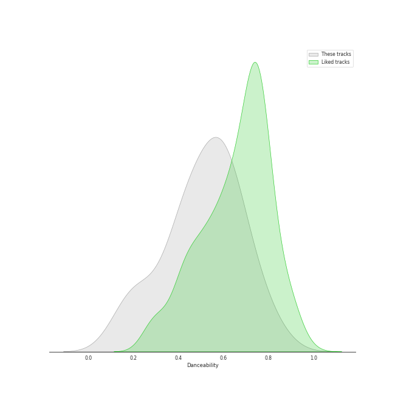
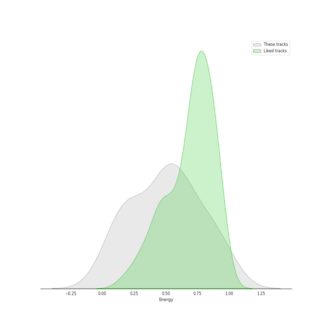
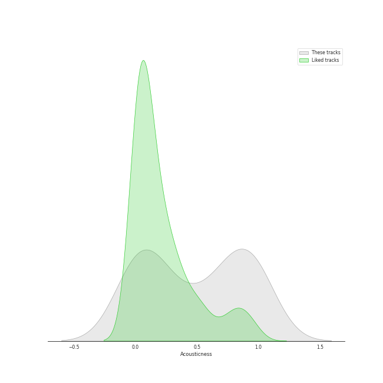
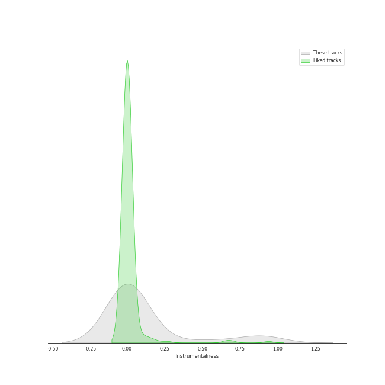
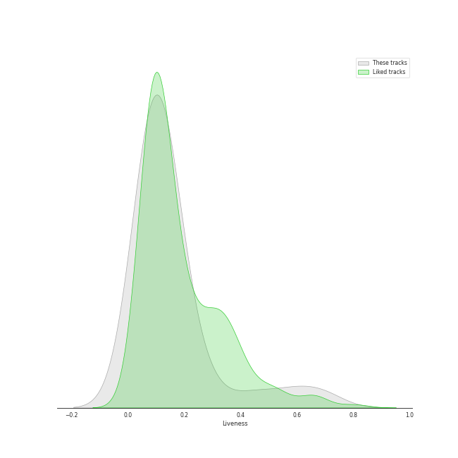

# Track Features for Rhino

## Danceability

| ​ | 10 most Danceable tracks | ​​ | 10 least Danceable tracks |
|:---|:---|:---|:---|
|  | Dreams - 2004 Remaster (0.828) |  | Love Theme from Superman (0.145) |
|  | Sara - 2015 Remaster (0.743) |  | The Flying Sequence (0.187) |
|  | When Doves Cry (0.729) |  | The Passing of the Elves (0.224) |
|  | A Case of You (0.693) |  | Desperado - 2013 Remaster (0.228) |
|  | Orinoco Flow (0.685) |  | Iron Man (0.332) |
|  | Smoke on the Water (0.632) |  | Purple Rain (0.367) |
|  | Carey (0.626) |  | Tell Me a Bedtime Story (0.398) |
|  | 25 or 6 to 4 (0.612) |  | Paranoid - 2012 - Remaster (0.412) |
|  | Big Yellow Taxi (0.611) |  | The Pirate of Penance (0.429) |
|  | Free Man in Paris (0.59) |  | I Had a King (0.439) |

## Energy

| ​ | 10 most Energetic tracks | ​​ | 10 least Energetic tracks |
|:---|:---|:---|:---|
|  | When Doves Cry (0.989) |  | The Passing of the Elves (0.0146) |
|  | Go Your Own Way - 2004 Remaster (0.941) |  | Blue (0.102) |
|  | Take on Me (0.902) |  | The Dawntreader (0.103) |
|  | 25 or 6 to 4 (0.869) |  | I Had a King (0.151) |
|  | I'm a Believer - 2006 Remaster (0.775) |  | The Pirate of Penance (0.185) |
|  | Iron Man (0.769) |  | A Case of You (0.201) |
|  | Can't Take My Eyes off You (0.764) |  | Desperado - 2013 Remaster (0.224) |
|  | The Chain - 2004 Remaster (0.67) |  | The Flying Sequence (0.234) |
|  | Paranoid - 2012 - Remaster (0.658) |  | Love Theme from Superman (0.295) |
|  | Free Man in Paris (0.62) |  | Orinoco Flow (0.307) |

## Speechiness

| ​ | 10 most Speechy tracks | ​​ | 10 least Speechy tracks |
|:---|:---|:---|:---|
|  | Iron Man (0.0765) |  | Hotel California - 2013 Remaster (0.027) |
|  | Can't Take My Eyes off You (0.0746) |  | Dreams - 2004 Remaster (0.0276) |
|  | Paranoid - 2012 - Remaster (0.0708) |  | Smoke on the Water (0.0284) |
|  | Take on Me (0.054) |  | A Case of You (0.0288) |
|  | 25 or 6 to 4 (0.0515) |  | Tell Me a Bedtime Story (0.0297) |
|  | The Chain - 2004 Remaster (0.0496) |  | Sara - 2015 Remaster (0.0303) |
|  | When Doves Cry (0.049) |  | Daydream Believer (0.0304) |
|  | Blue (0.0436) |  | Orinoco Flow (0.0305) |
|  | Cat's in the Cradle (0.0418) |  | Purple Rain (0.0307) |
|  | The Pirate of Penance (0.0392) |  | Desperado - 2013 Remaster (0.0311) |

## Acousticness

| ​ | 10 most Acoustic tracks | ​​ | 10 least Acoustic tracks |
|:---|:---|:---|:---|
|  | Blue (0.989) |  | Paranoid - 2012 - Remaster (4.52e-05) |
|  | The Pirate of Penance (0.973) |  | Iron Man (0.00367) |
|  | I Had a King (0.968) |  | Hotel California - 2013 Remaster (0.00574) |
|  | The Dawntreader (0.957) |  | The Chain - 2004 Remaster (0.009) |
|  | Desperado - 2013 Remaster (0.946) |  | When Doves Cry (0.0102) |
|  | Love Theme from Superman (0.934) |  | Go Your Own Way - 2004 Remaster (0.0167) |
|  | The Flying Sequence (0.933) |  | Take on Me (0.018) |
|  | A Case of You (0.9) |  | Purple Rain (0.0353) |
|  | The Passing of the Elves (0.898) |  | Dreams - 2004 Remaster (0.0644) |
|  | Carey (0.818) |  | Smoke on the Water (0.0983) |

## Instrumentalness

| ​ | 10 most Instrumental tracks | ​​ | 10 least Instrumental tracks |
|:---|:---|:---|:---|
|  | Tell Me a Bedtime Story (0.934) |  | Carey (0.0) |
|  | The Flying Sequence (0.872) |  | Free Man in Paris (0.0) |
|  | Love Theme from Superman (0.862) |  | Cat's in the Cradle (0.0) |
|  | Smoke on the Water (0.581) |  | Big Yellow Taxi (0.0) |
|  | Orinoco Flow (0.28) |  | A Case of You (0.0) |
|  | 25 or 6 to 4 (0.0367) |  | Daydream Believer (0.0) |
|  | Sara - 2015 Remaster (0.0208) |  | The Passing of the Elves (7.77e-06) |
|  | I Had a King (0.0108) |  | The Pirate of Penance (9.45e-06) |
|  | Dreams - 2004 Remaster (0.00428) |  | Can't Take My Eyes off You (1.07e-05) |
|  | Iron Man (0.00413) |  | I'm a Believer - 2006 Remaster (2.05e-05) |

## Liveness

| ​ | 10 most Live tracks | ​​ | 10 least Live tracks |
|:---|:---|:---|:---|
|  | Purple Rain (0.689) |  | Iron Man (0.0372) |
|  | Big Yellow Taxi (0.581) |  | The Chain - 2004 Remaster (0.0451) |
|  | When Doves Cry (0.443) |  | Smoke on the Water (0.0535) |
|  | Desperado - 2013 Remaster (0.273) |  | Hotel California - 2013 Remaster (0.0575) |
|  | I'm a Believer - 2006 Remaster (0.217) |  | Go Your Own Way - 2004 Remaster (0.068) |
|  | Paranoid - 2012 - Remaster (0.176) |  | Free Man in Paris (0.0691) |
|  | The Passing of the Elves (0.174) |  | Can't Take My Eyes off You (0.0692) |
|  | Sara - 2015 Remaster (0.158) |  | 25 or 6 to 4 (0.0858) |
|  | Dreams - 2004 Remaster (0.128) |  | Love Theme from Superman (0.0913) |
|  | Cat's in the Cradle (0.123) |  | Take on Me (0.0928) |

## Valence

| ​ | 10 most Happy tracks | ​​ | 10 least Happy tracks |
|:---|:---|:---|:---|
|  | Big Yellow Taxi (0.97) |  | The Passing of the Elves (0.0384) |
|  | I'm a Believer - 2006 Remaster (0.962) |  | The Flying Sequence (0.0624) |
|  | Smoke on the Water (0.89) |  | Love Theme from Superman (0.118) |
|  | Take on Me (0.876) |  | I Had a King (0.136) |
|  | When Doves Cry (0.84) |  | The Pirate of Penance (0.162) |
|  | Go Your Own Way - 2004 Remaster (0.831) |  | Desperado - 2013 Remaster (0.18) |
|  | Dreams - 2004 Remaster (0.789) |  | Purple Rain (0.189) |
|  | 25 or 6 to 4 (0.771) |  | The Dawntreader (0.235) |
|  | Carey (0.769) |  | Tell Me a Bedtime Story (0.353) |
|  | A Case of You (0.679) |  | Paranoid - 2012 - Remaster (0.454) |

## Tempo

| ​ | 10 most Fast tracks | ​​ | 10 least Fast tracks |
|:---|:---|:---|:---|
|  | Paranoid - 2012 - Remaster (163.071) |  | Desperado - 2013 Remaster (60.3) |
|  | Iron Man (157.378) |  | Carey (75.368) |
|  | The Chain - 2004 Remaster (151.553) |  | Love Theme from Superman (77.541) |
|  | 25 or 6 to 4 (147.502) |  | Cat's in the Cradle (78.111) |
|  | Hotel California - 2013 Remaster (147.125) |  | I'm a Believer - 2006 Remaster (80.106) |
|  | Go Your Own Way - 2004 Remaster (135.448) |  | Free Man in Paris (81.429) |
|  | Blue (133.946) |  | The Flying Sequence (81.938) |
|  | Sara - 2015 Remaster (126.873) |  | Take on Me (84.412) |
|  | When Doves Cry (126.47) |  | Big Yellow Taxi (85.527) |
|  | Daydream Believer (125.683) |  | The Passing of the Elves (90.886) |
