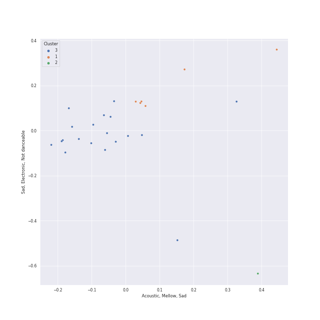

# Clusters in Rhino

## Cluster #1

18 tracks

| Art | Track | Album | Artists | Label | Rank | 💚 | 🔗 |
|:---|:---|:---|:---|:---|---:|:---|:---|
|  | The Chain - 2004 Remaster | Rumours (Super Deluxe) | Fleetwood Mac | [Rhino](../..), [Warner Records](../../../warner_records) | nan | | [🔗](https://open.spotify.com/track/5e9TFTbltYBg2xThimr0rU) |
|  | Sara - 2015 Remaster | Tusk (2015 Remaster) | Fleetwood Mac | [Rhino](../..), [Warner Records](../../../warner_records) | nan | | [🔗](https://open.spotify.com/track/59rSjZAHfFktNxjtx7oM4H) |
|  | Carey | Blue | [Joni Mitchell](../../../../artists/joni_mitchell/overview.md) | [Rhino](../..) | nan | 💚 | [🔗](https://open.spotify.com/track/11dUk8E2z8Oj1JURwl7GJd) |
|  | Free Man in Paris | Court and Spark | [Joni Mitchell](../../../../artists/joni_mitchell/overview.md) | [Rhino](../..) | nan | 💚 | [🔗](https://open.spotify.com/track/2by5mqpQ1ZP2G5FOIccMnu) |
|  | Paranoid - 2012 - Remaster | Paranoid (Remaster) | Black Sabbath | [Rhino](../..), [Warner Records](../../../warner_records) | nan | | [🔗](https://open.spotify.com/track/1Y373MqadDRtclJNdnUXVc) |
|  | Hotel California - 2013 Remaster | Hotel California (2013 Remaster) | Eagles | [Rhino/Elektra](../..) | nan | | [🔗](https://open.spotify.com/track/40riOy7x9W7GXjyGp4pjAv) |
|  | Cat's in the Cradle | Verities & Balderdash | Harry Chapin | [Rhino/Elektra](../..) | nan | 💚 | [🔗](https://open.spotify.com/track/2obblQ6tcePeOEVJV6nEGD) |
|  | Daydream Believer | The Birds, The Bees, & The Monkees | The Monkees | [Rhino](../..) | nan | | [🔗](https://open.spotify.com/track/7uEcCGtM1FBBGIhPozhJjv) |
|  | 25 or 6 to 4 | Chicago IX: Chicago's Greatest Hits | Chicago | [Rhino](../..) | 691 | 💚 | [🔗](https://open.spotify.com/track/65eRcjlStTnk8opG5eIQ8Z) |
|  | Can't Take My Eyes off You | The Very Best of Frankie Valli & The 4 Seasons | Frankie Valli | [Rhino](../..) | nan | 💚 | [🔗](https://open.spotify.com/track/6ft9PAgNOjmZ2kFVP7LGqb) |
## Cluster #2

9 tracks

| Art | Track | Album | Artists | Label | Rank | 💚 | 🔗 |
|:---|:---|:---|:---|:---|---:|:---|:---|
|  | The Passing of the Elves | The Lord of the Rings: The Fellowship of the Ring - the Complete Recordings | Howard Shore | [Rhino](../..), [Warner Records](../../../warner_records) | nan | | [🔗](https://open.spotify.com/track/05q7lfYerRkqqNDua3vJOL) |
|  | The Dawntreader | Song to a Seagull | [Joni Mitchell](../../../../artists/joni_mitchell/overview.md) | [Rhino](../..) | nan | 💚 | [🔗](https://open.spotify.com/track/0KE9YElZqPumrpm9ovtXlN) |
|  | The Pirate of Penance | Song to a Seagull | [Joni Mitchell](../../../../artists/joni_mitchell/overview.md) | [Rhino](../..) | nan | | [🔗](https://open.spotify.com/track/53QbBfo0PTUKfOBM0YoPU7) |
|  | I Had a King | Song to a Seagull | [Joni Mitchell](../../../../artists/joni_mitchell/overview.md) | [Rhino](../..) | nan | 💚 | [🔗](https://open.spotify.com/track/6rj2z2taVIxPRnzx5LJkGm) |
|  | Blue | Blue | [Joni Mitchell](../../../../artists/joni_mitchell/overview.md) | [Rhino](../..) | nan | | [🔗](https://open.spotify.com/track/1yWIsH3TC51gmzvQxZNCQC) |
|  | A Case of You | Blue | [Joni Mitchell](../../../../artists/joni_mitchell/overview.md) | [Rhino](../..) | nan | 💚 | [🔗](https://open.spotify.com/track/7shVwhUdVbHpykOfbzvDc1) |
|  | Orinoco Flow | Watermark | Enya | [Rhino](../..), [Warner Records](../../../warner_records) | nan | | [🔗](https://open.spotify.com/track/14EUcXXpqrC03Dzzdj8bGr) |
|  | Desperado - 2013 Remaster | Desperado (2013 Remaster) | Eagles | [Rhino/Elektra](../..) | 683 | 💚 | [🔗](https://open.spotify.com/track/2TjnCxxQRYn56Ye8gkUKiW) |
|  | Purple Rain | Purple Rain | Prince | [Rhino](../..), [Warner Records](../../../warner_records) | nan | 💚 | [🔗](https://open.spotify.com/track/54X78diSLoUDI3joC2bjMz) |
## Cluster #3

3 tracks

| Art | Track | Album | Artists | Label | Rank | 💚 | 🔗 |
|:---|:---|:---|:---|:---|---:|:---|:---|
|  | Love Theme from Superman | Superman: The Movie (Original Motion Picture Soundtrack) | John Williams | [Rhino](../..), [Warner Records](../../../warner_records) | nan | | [🔗](https://open.spotify.com/track/0qH5i6q2FsRIlDu9nwpe4H) |
|  | The Flying Sequence | Superman: The Movie (Original Motion Picture Soundtrack) | John Williams | [Rhino](../..), [Warner Records](../../../warner_records) | nan | | [🔗](https://open.spotify.com/track/5dPcPWdK2V25QKIV7deqfL) |
|  | Tell Me a Bedtime Story | Fat Albert Rotunda | Herbie Hancock | [Rhino](../..), [Warner Records](../../../warner_records) | nan | 💚 | [🔗](https://open.spotify.com/track/6eimz6jvlZaPwtflDWCTa0) |