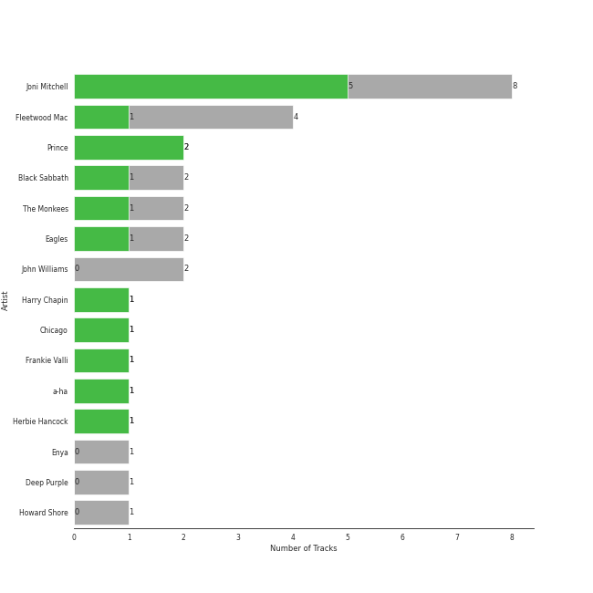
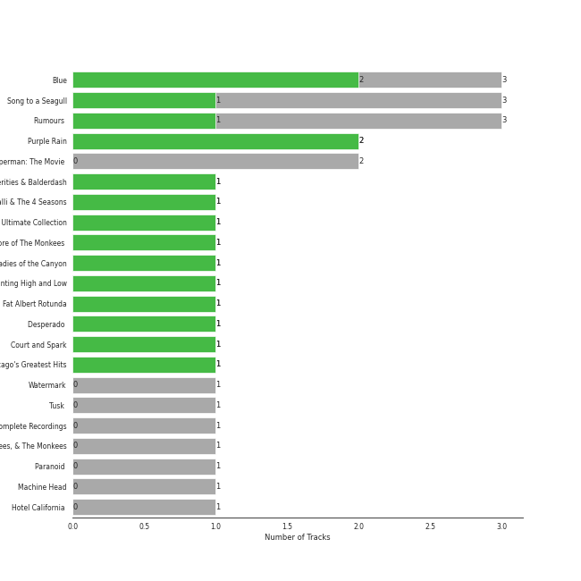
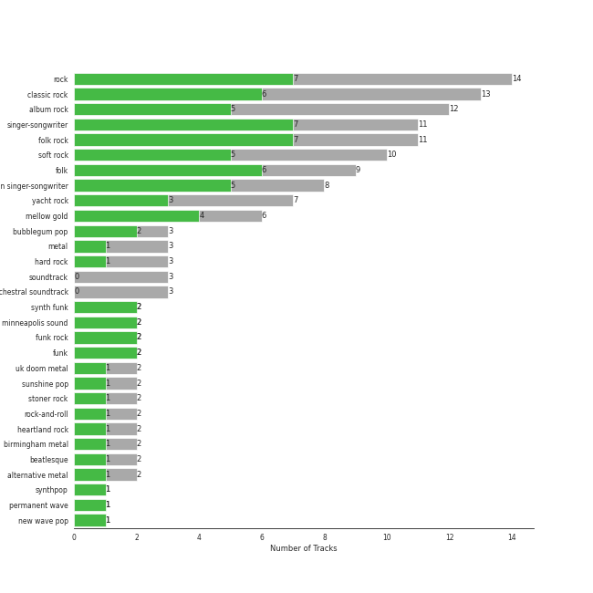

# Rhino

25 songs

[See Track Features](audio_features.md)

[See Clusters](clusters/overview.md)

Appears as:
- Rhino (13 tracks)
- Rhino/Warner Records (9 tracks)
- Rhino/Elektra (3 tracks)

## Top Artists

| Art | Tracks | 💚 | Artist | 🔗 |
|:---|---:|---:|:---|:---|
|  | 8 | 6 | Joni Mitchell | [🔗](https://open.spotify.com/artist/5hW4L92KnC6dX9t7tYM4Ve) |
|  | 2 | 1 | Prince | [🔗](https://open.spotify.com/artist/5a2EaR3hamoenG9rDuVn8j) |
|  | 2 | 1 | Black Sabbath | [🔗](https://open.spotify.com/artist/5M52tdBnJaKSvOpJGz8mfZ) |
|  | 2 | 1 | The Monkees | [🔗](https://open.spotify.com/artist/320EPCSEezHt1rtbfwH6Ck) |
|  | 2 | 1 | Eagles | [🔗](https://open.spotify.com/artist/0ECwFtbIWEVNwjlrfc6xoL) |
|  | 1 | 1 | Harry Chapin | [🔗](https://open.spotify.com/artist/42q4Ivs7tAiCZ5C7eG5q4c) |
|  | 1 | 1 | Chicago | [🔗](https://open.spotify.com/artist/3iDD7bnsjL9J4fO298r0L0) |
|  | 1 | 1 | Frankie Valli | [🔗](https://open.spotify.com/artist/3CDKmzJu6uwEGnPLLZffpD) |
|  | 1 | 1 | a-ha | [🔗](https://open.spotify.com/artist/2jzc5TC5TVFLXQlBNiIUzE) |
|  | 4 | 0 | Fleetwood Mac | [🔗](https://open.spotify.com/artist/08GQAI4eElDnROBrJRGE0X) |

See all 11 artists

| Art | Tracks | 💚 | Artist | 🔗 |
|:---|---:|---:|:---|:---|
|  | 1 | 0 | Deep Purple | [🔗](https://open.spotify.com/artist/568ZhdwyaiCyOGJRtNYhWf) |

## Top Albums

| Art | Tracks | 💚 | Album | Release Date | 🔗 |
|:---|---:|---:|:---|:---|:---|
|  | 3 | 2 | Song to a Seagull | 1968-03-01 | [🔗](https://open.spotify.com/album/6rg3WTvmv68Vd6tgR0yS0E) |
|  | 3 | 2 | Blue | 1971-06-22 | [🔗](https://open.spotify.com/album/1vz94WpXDVYIEGja8cjFNa) |
|  | 3 | 0 | Rumours (Super Deluxe) | 1977-02-04 | [🔗](https://open.spotify.com/album/0BwWUstDMUbgq2NYONRqlu) |
|  | 2 | 1 | Purple Rain | 1984-06-25 | [🔗](https://open.spotify.com/album/7nXJ5k4XgRj5OLg9m8V3zc) |
|  | 1 | 1 | Verities & Balderdash | 1974 | [🔗](https://open.spotify.com/album/3nta4nhqWoWjc6LmHIB0kT) |
|  | 1 | 1 | The Very Best of Frankie Valli & The 4 Seasons | 2003-01-14 | [🔗](https://open.spotify.com/album/0NUEQILaBzavnzcMEs4buZ) |
|  | 1 | 1 | The Ultimate Collection | 2017-02-03 | [🔗](https://open.spotify.com/album/6TcPqftScGmR0aEgIb43Vv) |
|  | 1 | 1 | More of The Monkees (Deluxe Edition) | 1967-01-09 | [🔗](https://open.spotify.com/album/50zHjIiTOZM232gnWvOydX) |
|  | 1 | 1 | Ladies of the Canyon | 1970-03-01 | [🔗](https://open.spotify.com/album/7JOdtLDLyXJIppDRB7kxr9) |
|  | 1 | 1 | Hunting High and Low | 1985-06-01 | [🔗](https://open.spotify.com/album/1ER3B6zev5JEAaqhnyyfbf) |

See all 18 albums

| Art | Tracks | 💚 | Album | Release Date | 🔗 |
|:---|---:|---:|:---|:---|:---|
|  | 1 | 1 | Desperado (2013 Remaster) | 1973 | [🔗](https://open.spotify.com/album/09WBxbis5Sixt01FVMs8UM) |
|  | 1 | 1 | Court and Spark | 1974-01-17 | [🔗](https://open.spotify.com/album/2akjxkzFolkeV72Yyv5KrM) |
|  | 1 | 1 | Chicago IX: Chicago's Greatest Hits | 1975-11-10 | [🔗](https://open.spotify.com/album/5qWGV0fd7hpdptJYI4G9Dd) |
|  | 1 | 0 | Tusk (2015 Remaster) | 1979-10-12 | [🔗](https://open.spotify.com/album/5FIN8pyPVx8ggNs5jQ86Re) |
|  | 1 | 0 | The Birds, The Bees, & The Monkees | 1968-04-22 | [🔗](https://open.spotify.com/album/2Ov6zb7NfgDh3EXSIIWrb2) |
|  | 1 | 0 | Paranoid (Remaster) | 1970-09-18 | [🔗](https://open.spotify.com/album/6r7LZXAVueS5DqdrvXJJK7) |
|  | 1 | 0 | Machine Head | 1972-03-25 | [🔗](https://open.spotify.com/album/1EK3a0Yctg4d3nGQzE4Uty) |
|  | 1 | 0 | Hotel California (2013 Remaster) | 1976-12-08 | [🔗](https://open.spotify.com/album/2widuo17g5CEC66IbzveRu) |

## Genres

| Tracks | 💚 | Genre |
|---:|---:|:---|
| 11 | 8 | [singer-songwriter](../../genres/singer_songwriter/overview.md) |
| 11 | 8 | folk rock |
| 9 | 7 | folk |
| 8 | 6 | canadian singer-songwriter |
| 13 | 5 | [classic rock](../../genres/classic_rock/overview.md) |
| 11 | 5 | [soft rock](../../genres/soft_rock/overview.md) |
| 12 | 4 | [rock](../../genres/rock/overview.md) |
| 12 | 4 | [album rock](../../genres/album_rock/overview.md) |
| 6 | 4 | [mellow gold](../../genres/mellow_gold/overview.md) |
| 5 | 3 | [heartland rock](../../genres/heartland_rock/overview.md) |

See all 34 genres

| Tracks | 💚 | Genre |
|---:|---:|:---|
| 7 | 2 | yacht rock |
| 3 | 2 | rock-and-roll |
| 3 | 2 | bubblegum pop |
| 3 | 1 | metal |
| 3 | 1 | hard rock |
| 2 | 1 | uk doom metal |
| 2 | 1 | synth funk |
| 2 | 1 | sunshine pop |
| 2 | 1 | stoner rock |
| 2 | 1 | [psychedelic rock](../../genres/psychedelic_rock/overview.md) |
| 2 | 1 | minneapolis sound |
| 2 | 1 | funk rock |
| 2 | 1 | funk |
| 2 | 1 | birmingham metal |
| 2 | 1 | beatlesque |
| 2 | 1 | alternative metal |
| 1 | 1 | synthpop |
| 1 | 1 | [permanent wave](../../genres/permanent_wave/overview.md) |
| 1 | 1 | new wave pop |
| 1 | 1 | new wave |
| 1 | 1 | new romantic |
| 1 | 1 | lounge |
| 1 | 1 | country rock |
| 1 | 1 | [adult standards](../../genres/adult_standards/overview.md) |

## Tracks released under Rhino

| Art | Track | Album | Artists | Label | 💚 | 🔗 |
|:---|:---|:---|:---|:---|:---|:---|
|  | Paranoid - 2012 - Remaster | Paranoid (Remaster) | Black Sabbath | [Rhino](.), [Warner Records](../warner_records) | | [🔗](https://open.spotify.com/track/1Y373MqadDRtclJNdnUXVc) |
|  | Iron Man | The Ultimate Collection | Black Sabbath | [Rhino](.), [Warner Records](../warner_records) | 💚 | [🔗](https://open.spotify.com/track/4svkPL62HbvyFgf0nHFXAF) |
|  | 25 or 6 to 4 | Chicago IX: Chicago's Greatest Hits | Chicago | [Rhino](.) | 💚 | [🔗](https://open.spotify.com/track/65eRcjlStTnk8opG5eIQ8Z) |
|  | Smoke on the Water | Machine Head | Deep Purple | [Rhino](.), [Warner Records](../warner_records) | | [🔗](https://open.spotify.com/track/5SAUIWdZ04OxYfJFDchC7S) |
|  | Desperado - 2013 Remaster | Desperado (2013 Remaster) | Eagles | [Rhino/Elektra](.) | 💚 | [🔗](https://open.spotify.com/track/2TjnCxxQRYn56Ye8gkUKiW) |
|  | Hotel California - 2013 Remaster | Hotel California (2013 Remaster) | Eagles | [Rhino/Elektra](.) | | [🔗](https://open.spotify.com/track/40riOy7x9W7GXjyGp4pjAv) |
|  | Dreams - 2004 Remaster | Rumours (Super Deluxe) | Fleetwood Mac | [Rhino](.), [Warner Records](../warner_records) | | [🔗](https://open.spotify.com/track/0ofHAoxe9vBkTCp2UQIavz) |
|  | Go Your Own Way - 2004 Remaster | Rumours (Super Deluxe) | Fleetwood Mac | [Rhino](.), [Warner Records](../warner_records) | | [🔗](https://open.spotify.com/track/4xh7W7tlNMIczFhupCPniY) |
|  | The Chain - 2004 Remaster | Rumours (Super Deluxe) | Fleetwood Mac | [Rhino](.), [Warner Records](../warner_records) | | [🔗](https://open.spotify.com/track/5e9TFTbltYBg2xThimr0rU) |
|  | Sara - 2015 Remaster | Tusk (2015 Remaster) | Fleetwood Mac | [Rhino](.), [Warner Records](../warner_records) | | [🔗](https://open.spotify.com/track/59rSjZAHfFktNxjtx7oM4H) |

See all tracks

| Art | Track | Album | Artists | Label | 💚 | 🔗 |
|:---|:---|:---|:---|:---|:---|:---|
|  | Can't Take My Eyes off You | The Very Best of Frankie Valli & The 4 Seasons | Frankie Valli | [Rhino](.) | 💚 | [🔗](https://open.spotify.com/track/6ft9PAgNOjmZ2kFVP7LGqb) |
|  | Cat's in the Cradle | Verities & Balderdash | Harry Chapin | [Rhino/Elektra](.) | 💚 | [🔗](https://open.spotify.com/track/2obblQ6tcePeOEVJV6nEGD) |
|  | I Had a King | Song to a Seagull | Joni Mitchell | [Rhino](.) | 💚 | [🔗](https://open.spotify.com/track/6rj2z2taVIxPRnzx5LJkGm) |
|  | The Dawntreader | Song to a Seagull | Joni Mitchell | [Rhino](.) | 💚 | [🔗](https://open.spotify.com/track/0KE9YElZqPumrpm9ovtXlN) |
|  | The Pirate of Penance | Song to a Seagull | Joni Mitchell | [Rhino](.) | | [🔗](https://open.spotify.com/track/53QbBfo0PTUKfOBM0YoPU7) |
|  | Big Yellow Taxi | Ladies of the Canyon | Joni Mitchell | [Rhino](.) | 💚 | [🔗](https://open.spotify.com/track/6UkMcAA19lTdjs22jtB7o2) |
|  | A Case of You | Blue | Joni Mitchell | [Rhino](.) | 💚 | [🔗](https://open.spotify.com/track/7shVwhUdVbHpykOfbzvDc1) |
|  | Blue | Blue | Joni Mitchell | [Rhino](.) | | [🔗](https://open.spotify.com/track/1yWIsH3TC51gmzvQxZNCQC) |
|  | Carey | Blue | Joni Mitchell | [Rhino](.) | 💚 | [🔗](https://open.spotify.com/track/11dUk8E2z8Oj1JURwl7GJd) |
|  | Free Man in Paris | Court and Spark | Joni Mitchell | [Rhino](.) | 💚 | [🔗](https://open.spotify.com/track/2by5mqpQ1ZP2G5FOIccMnu) |
|  | Purple Rain | Purple Rain | Prince | [Rhino](.), [Warner Records](../warner_records) | | [🔗](https://open.spotify.com/track/54X78diSLoUDI3joC2bjMz) |
|  | When Doves Cry | Purple Rain | Prince | [Rhino](.), [Warner Records](../warner_records) | 💚 | [🔗](https://open.spotify.com/track/51H2y6YrNNXcy3dfc3qSbA) |
|  | I'm a Believer - 2006 Remaster | More of The Monkees (Deluxe Edition) | The Monkees | [Rhino](.) | 💚 | [🔗](https://open.spotify.com/track/3G7tRC24Uh09Hmp1KZ7LQ2) |
|  | Daydream Believer | The Birds, The Bees, & The Monkees | The Monkees | [Rhino](.) | | [🔗](https://open.spotify.com/track/7uEcCGtM1FBBGIhPozhJjv) |
|  | Take on Me | Hunting High and Low | a-ha | [Rhino](.) | 💚 | [🔗](https://open.spotify.com/track/2WfaOiMkCvy7F5fcp2zZ8L) |

