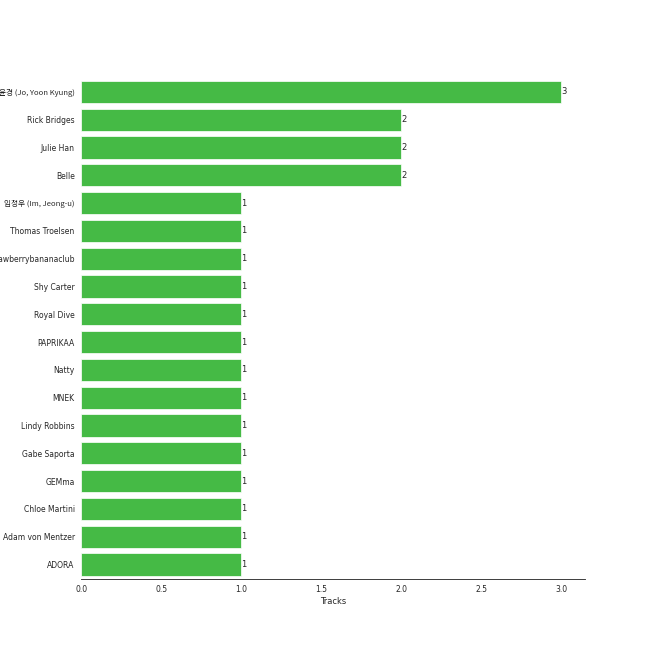

# S2 ENTERTAINMENT INC.

10 songs

Appears as:
- S2 ENTERTAINMENT INC. (9 tracks)
- S2 ENTERTAINMENT INC., AURA Corp. (1 tracks)

## Top Artists

| Art | Tracks | 💚 | Artist | 🔗 |
|:---|---:|---:|:---|:---|
|  | 9 | 7 | [KISS OF LIFE](../../artists/kiss_of_life/overview.md) | [🔗](https://open.spotify.com/artist/4TEK9tIkcoxib4GxT3O4ky) |
|  | 1 | 0 | ADORA | [🔗](https://open.spotify.com/artist/3M1kgHOpPruu1uBymBHF3r) |

## Top Albums

| Art | Tracks | 💚 | Album | Release Date | 🔗 |
|:---|---:|---:|:---|:---|:---|
|  | 5 | 4 | Born to be XX | 2023-11-08 | [🔗](https://open.spotify.com/album/6yDtQxvq1XRC7Y5qtS03Xx) |
|  | 4 | 3 | KISS OF LIFE | 2023-07-05 | [🔗](https://open.spotify.com/album/5k34rAvlw3WV7Kh6dAZnxG) |
|  | 1 | 0 | Trouble? TRAVEL! | 2022-06-01 | [🔗](https://open.spotify.com/album/07FQYMZJFk9t3jpZ8fDQAA) |

## Genres

| Tracks | 💚 | Genre |
|---:|---:|:---|
| 9 | 7 | [k-pop girl group](../../genres/k-pop_girl_group/overview.md) |

## Top Producers

| Art | Producer | Tracks | Credit Types |
|:---|:---|---:|:---|
| | Rick Bridges | 3 | Lyricist, Songwriter |
| | Belle | 3 | Lyricist, Songwriter |
| | [조윤경 (Jo, Yoon Kyung)](../../producers/조윤경_(jo,_yoon_kyung)/overview.md) | 3 | Lyricist |
| | Julie Han | 2 | Lyricist |
| | Eunsol(1008) | 1 | Songwriter |
| | Clovd | 1 | Arranger, Songwriter |
| | PAPRIKAA | 1 | Arranger, Songwriter |
| | Royal Dive | 1 | Arranger, Songwriter |
| | Adam von Mentzer | 1 | Songwriter |
| | Thomas Troelsen | 1 | Arranger, Songwriter |

View all

| Art | Producer | Tracks | Credit Types |
|:---|:---|---:|:---|
| | Gabe Saporta | 1 | Songwriter |
| | Natty | 1 | Songwriter |
| | 권덕근 (Kwon, Duk-geun) | 1 | Arranger, Songwriter |
|  | ADORA | 1 | Songwriter |
| | GEMma | 1 | Lyricist |
| | 임정우 (Im, Jeong-u) | 1 | Songwriter |
| | Shy Carter | 1 | Songwriter |
| | Young Chance | 1 | Songwriter |
| | Lindy Robbins | 1 | Songwriter |
| | MNEK | 1 | Songwriter |
| | Chloe Martini | 1 | Arranger, Songwriter |
| | Strawberrybananaclub | 1 | Arranger, Lyricist, Songwriter |

## Tracks released under S2 ENTERTAINMENT INC.

| Art | Track | Album | Artists | Label | Score | 💚 | 🔗 |
|:---|:---|:---|:---|:---|---:|:---|:---|
|  | Nobody Knows | Born to be XX | [KISS OF LIFE](../../artists/kiss_of_life/overview.md) | [S2 ENTERTAINMENT INC.](.) | 1694 | 💚 | [🔗](https://open.spotify.com/track/70efTlnBNM8BvfhfPiqOBN) |
|  | Bad News | Born to be XX | [KISS OF LIFE](../../artists/kiss_of_life/overview.md) | [S2 ENTERTAINMENT INC.](.) | 285 | 💚 | [🔗](https://open.spotify.com/track/7AGq5qaaF9awHDaKuCvVjj) |
|  | Trouble? TRAVEL! | Trouble? TRAVEL! | ADORA | [S2 ENTERTAINMENT INC., AURA Corp.](.) | 0 | | [🔗](https://open.spotify.com/track/6A3J47xL9B4EFAjQ79YX52) |
|  | Countdown (BELLE Solo) | KISS OF LIFE | [KISS OF LIFE](../../artists/kiss_of_life/overview.md) | [S2 ENTERTAINMENT INC.](.) | 0 | 💚 | [🔗](https://open.spotify.com/track/3pJbio7BQLvqNne62Xe73I) |
|  | Kitty Cat (JULIE Solo) | KISS OF LIFE | [KISS OF LIFE](../../artists/kiss_of_life/overview.md) | [S2 ENTERTAINMENT INC.](.) | 0 | | [🔗](https://open.spotify.com/track/6MiodzZmp1bKamgF3qhmre) |
|  | Shhh | KISS OF LIFE | [KISS OF LIFE](../../artists/kiss_of_life/overview.md) | [S2 ENTERTAINMENT INC.](.) | 0 | 💚 | [🔗](https://open.spotify.com/track/76qqDJijAjFph7sjUxNVG8) |
|  | Sugarcoat (NATTY Solo) | KISS OF LIFE | [KISS OF LIFE](../../artists/kiss_of_life/overview.md) | [S2 ENTERTAINMENT INC.](.) | 0 | 💚 | [🔗](https://open.spotify.com/track/0NoeYUnwpb9R26mpylHcR9) |
|  | Gentleman | Born to be XX | [KISS OF LIFE](../../artists/kiss_of_life/overview.md) | [S2 ENTERTAINMENT INC.](.) | 0 | 💚 | [🔗](https://open.spotify.com/track/5JjVCxjqX1zwZc5MRa39ly) |
|  | My 808 | Born to be XX | [KISS OF LIFE](../../artists/kiss_of_life/overview.md) | [S2 ENTERTAINMENT INC.](.) | 0 | | [🔗](https://open.spotify.com/track/4eYHnUeE6mVXKg6S7kOatk) |
|  | Says It | Born to be XX | [KISS OF LIFE](../../artists/kiss_of_life/overview.md) | [S2 ENTERTAINMENT INC.](.) | 0 | 💚 | [🔗](https://open.spotify.com/track/76QiMQU5Nu61OWrxbp6RI8) |
