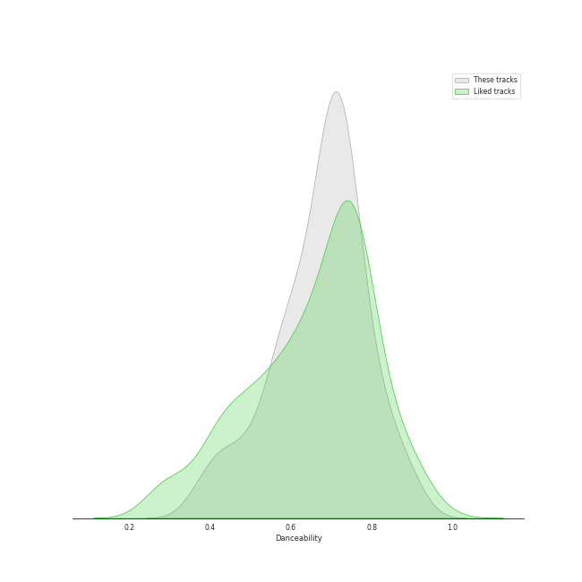
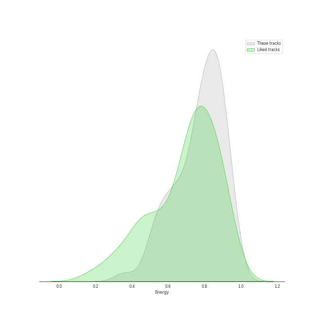
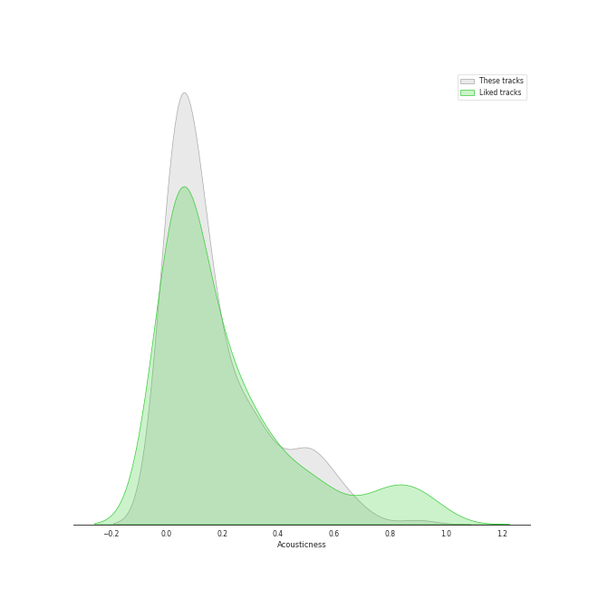

# Audio Features for SM Entertainment

## Danceability

| 10 most Danceable tracks | 10 least Danceable tracks |
|:---|:---|
| BOOM (0.914) | Miracle (0.302) |
| Mr. Simple (0.913) | Fine (0.36) |
| Time Slip (0.897) | Like Water (0.365) |
| The Boys (0.885) | Clockwork (0.37) |
| Love Theory (0.878) | Hello (0.392) |
| Rose (0.868) | Have Yourself A Merry Little Christmas (0.408) |
| Beatbox (0.857) | Sweet Love (0.41) |
| Saturday Drip (0.848) | Floral Sense (0.411) |
| Pose (0.841) | Feel My Rhythm (0.412) |
| Peek-A-Boo (0.839) | This Christmas (0.413) |

## Energy

| 10 most Energetic tracks | 10 least Energetic tracks |
|:---|:---|
| Hit That Drum (0.984) | Have Yourself A Merry Little Christmas (0.292) |
| Misfit (0.984) | The Magic of Christmas Time (0.33) |
| 소방차 Fire Truck (0.976) | Rose (0.352) |
| 쏘리 쏘리 Sorry, Sorry (0.972) | Miracle (0.385) |
| Oh! (0.966) | 봄인가 봐 Spring Love (0.391) |
| Mr.Mr. (0.964) | Clockwork (0.448) |
| Candy (0.964) | This Christmas (0.464) |
| Killer (0.947) | Dream (0.476) |
| Feel My Rhythm (0.94) | Moonlight Melody (0.482) |
| Stress (0.94) | Grey Suit (0.482) |

## Speechiness

| 10 most Speechy tracks | 10 least Speechy tracks |
|:---|:---|
| Freedom (0.388) | Moonlight Melody (0.0269) |
| You Better Run (0.326) | 세가지 소원 Wish Tree (0.0273) |
| Be Natural (0.316) | Gee (0.0274) |
| Rookie (0.288) | The Magic of Christmas Time (0.0274) |
| Cherry Bomb (0.287) | Spark (0.0283) |
| Wow Thing (0.281) | In My Dreams (0.0283) |
| Sticker (0.28) | Merry Christmas (0.0292) |
| Drip Drop (0.278) | Snow Dream 2021 (0.0293) |
| I GOT A BOY (0.272) | Je T'aime (0.0295) |
| Tiger Inside (0.266) | This Christmas (0.0297) |

## Acousticness

| 10 most Acoustic tracks | 10 least Acoustic tracks |
|:---|:---|
| The Magic of Christmas Time (0.898) | Mr. Simple (0.000219) |
| Amusement Park (0.85) | Red Light (0.000457) |
| Miracle (0.846) | Cherry Bomb (0.000759) |
| When This Rain Stops (0.805) | Favorite (Vampire) (0.000831) |
| Have Yourself A Merry Little Christmas (0.786) | Badster (0.000924) |
| 봄인가 봐 Spring Love (0.723) | Killer (0.00106) |
| Gold Dust (0.704) | Highway to Heaven - English Version (0.00257) |
| ZOOM (0.696) | LOVE ME RIGHT (0.00266) |
| 11:11 (0.677) | Up & Down (0.00279) |
| Moonlight Melody (0.654) | Zimzalabim (0.0028) |

## Instrumentalness

| 10 most Instrumental tracks | 10 least Instrumental tracks |
|:---|:---|
| Next Level - Habstrakt Remix (0.201) | Miracle (0.0) |
| Badster (0.0444) | To the moon (0.0) |
| YEPPI YEPPI (0.0391) | Clockwork (0.0) |
| Power Up (0.00745) | Beatbox (0.0) |
| In My Dreams (0.0066) | Why Can't You Love Me? (0.0) |
| Lion Heart (0.00274) | Ridin' (0.0) |
| Peek-A-Boo (0.00257) | BOSS (0.0) |
| Mr. Simple (0.00208) | Best Friend (with SEULGI) (0.0) |
| Parade (0.00131) | Gold Dust (0.0) |
| Black Mamba (0.000946) | Paradise (0.0) |

## Liveness

| 10 most Live tracks | 10 least Live tracks |
|:---|:---|
| You Better Run (0.803) | YEPPI YEPPI (0.029) |
| Sticker (0.742) | Beatbox (0.0334) |
| 행복 (Happiness) (0.725) | Vitamin (0.0359) |
| LP (0.714) | Rose (0.0363) |
| Genie (0.714) | Saturday Drip (0.0379) |
| Peaches (0.612) | Stress (0.0389) |
| Step Back (0.596) | Universe (Let's Play Ball) (0.0402) |
| Parade (0.579) | Red Light (0.0414) |
| Growl (0.556) | View (0.0415) |
| I GOT A BOY (0.538) | Baby Don’t Stop (0.043) |

## Valence

| 10 most Happy tracks | 10 least Happy tracks |
|:---|:---|
| Devil (0.968) | The Road (0.073) |
| Twinkle (0.962) | Grey Suit (0.0955) |
| 쏘리 쏘리 Sorry, Sorry (0.962) | 7월 7일 One Of These Nights (0.11) |
| Lion Heart (0.961) | Time After Time (0.123) |
| 러시안 룰렛 Russian Roulette (0.958) | Gravity (0.142) |
| Stress (0.933) | Lucid Dream (0.146) |
| 운명 The Chance of Love (0.915) | Body Talk (0.158) |
| I Just (0.906) | Criminal (0.161) |
| Power Up (0.898) | Favorite (Vampire) (0.178) |
| Love Theory (0.888) | In My Dreams (0.179) |

## Tempo

| 10 most Fast tracks | 10 least Fast tracks |
|:---|:---|
| Freedom (203.833) | Dream (48.973) |
| 11:11 (203.155) | Bambi (61.45) |
| Merry Christmas (197.918) | Run Devil Run (64.927) |
| About Love (191.908) | Clockwork (68.045) |
| Birthday (191.769) | Hello, Sunset (71.999) |
| Time After Time (188.781) | Wine (72.022) |
| Rover (186.022) | Rose (74.703) |
| Body Talk (185.946) | Sweet Love (74.751) |
| Hello (185.869) | Devil (74.898) |
| Universe (Let's Play Ball) (179.975) | Rain (76.024) |
