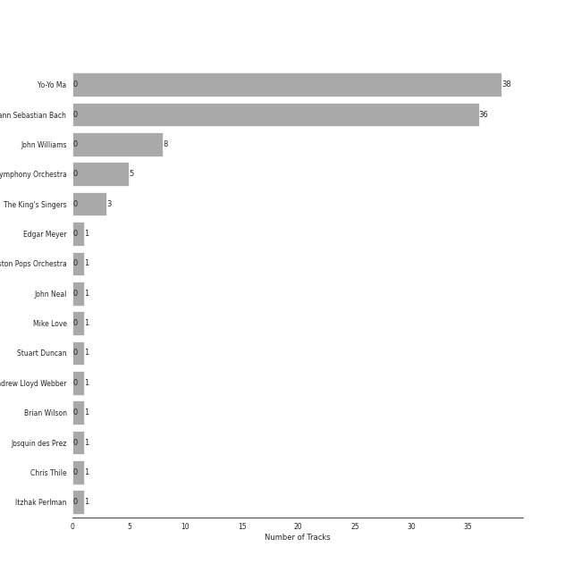
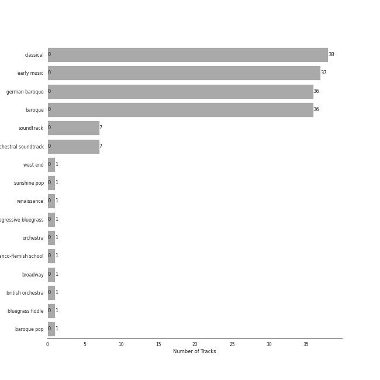

# Sony Classical

39 songs

Appears as:
- Sony Classical (36 tracks)
- Sony Classical/Sony Music (3 tracks)

## Top Artists

See all 7 artists

| Number of Tracks | Art | Artist | 🔗 |
|---:|:---|:---|:---|
| 36 |  | [Johann Sebastian Bach](../artists/johann_sebastian_bach.md) | [🔗](https://open.spotify.com/artist/5aIqB5nVVvmFsvSdExz408) |
| 36 |  | [Yo-Yo Ma](../artists/yo_yo_ma.md) | [🔗](https://open.spotify.com/artist/5Dl3HXZjG6ZOWT5cV375lk) |
| 3 |  | [The King's Singers](../artists/the_king_s_singers.md) | [🔗](https://open.spotify.com/artist/5lR7yDVN4z9kahOiUSlMhe) |
| 1 |  | Mike Love | [🔗](https://open.spotify.com/artist/5gr5OoQ4aQdJ3CqOr9v7Bt) |
| 1 |  | [Andrew Lloyd Webber](../artists/andrew_lloyd_webber.md) | [🔗](https://open.spotify.com/artist/4aP1lp10BRYZO658B2NwkG) |
| 1 |  | Brian Wilson | [🔗](https://open.spotify.com/artist/4Q82S0VzF8qlCb4PnSDurj) |
| 1 |  | Josquin des Prez | [🔗](https://open.spotify.com/artist/31f23hmZawdqgp0sECAzE8) |

## Top Albums

See all 2 albums

| Number of Tracks | Art | Album | Release Date | 🔗 |
|---:|:---|:---|---:|:---|
| 36 |  | Bach: Unaccompanied Cello Suites (Remastered) | 1983 | [🔗](https://open.spotify.com/album/2OpnKgmVYPEN2GldgBponI) |
| 3 |  | Cappella | 2013 | [🔗](https://open.spotify.com/album/3n6JxpdWnHkazMCQxKK5qI) |

## Genres

See all 11 genres

| Number of Tracks | Genre |
|---:|:---|
| 37 | [early music](../genres/early_music.md) |
| 37 | [classical](../genres/classical.md) |
| 36 | [german baroque](../genres/german_baroque.md) |
| 36 | [baroque](../genres/baroque.md) |
| 1 | west end |
| 1 | sunshine pop |
| 1 | [show tunes](../genres/show_tunes.md) |
| 1 | renaissance |
| 1 | franco-flemish school |
| 1 | [broadway](../genres/broadway.md) |
| 1 | baroque pop |

## Tracks released under Sony Classical

| Art | Track | Album | Artists | Label | 💚 | 🔗 |
|:---|:---|:---|:---|:---|:---|:---|
|  | All I Ask of You | Cappella | [Andrew Lloyd Webber](../artists/andrew_lloyd_webber.md), [The King's Singers](../artists/the_king_s_singers.md) | [Sony Classical](sony_classical.md), [Sony Music Labels Inc.](sony_music_labels_inc_.md) | | [🔗](https://open.spotify.com/track/5JTRLqApDZKaIwcopt1d9p) |
|  | Good Vibrations | Cappella | Brian Wilson, Mike Love, [The King's Singers](../artists/the_king_s_singers.md) | [Sony Classical](sony_classical.md), [Sony Music Labels Inc.](sony_music_labels_inc_.md) | | [🔗](https://open.spotify.com/track/14LgsPIZ7xKsfkM50VjxuA) |
|  | Cello Suite No. 1 in G Major, BWV 1007: I. Prélude | Bach: Unaccompanied Cello Suites (Remastered) | [Johann Sebastian Bach](../artists/johann_sebastian_bach.md), [Yo-Yo Ma](../artists/yo_yo_ma.md) | [Sony Classical](sony_classical.md) | | [🔗](https://open.spotify.com/track/61dYvvfIRtIDFuqZypPAta) |
|  | Cello Suite No. 1 in G Major, BWV 1007: II. Allemande | Bach: Unaccompanied Cello Suites (Remastered) | [Johann Sebastian Bach](../artists/johann_sebastian_bach.md), [Yo-Yo Ma](../artists/yo_yo_ma.md) | [Sony Classical](sony_classical.md) | | [🔗](https://open.spotify.com/track/1gs4pls8VN4StOUYSVG0nU) |
|  | Cello Suite No. 1 in G Major, BWV 1007: III. Courante | Bach: Unaccompanied Cello Suites (Remastered) | [Johann Sebastian Bach](../artists/johann_sebastian_bach.md), [Yo-Yo Ma](../artists/yo_yo_ma.md) | [Sony Classical](sony_classical.md) | | [🔗](https://open.spotify.com/track/70rlzUf9y1skkI3agyvbjg) |
|  | Cello Suite No. 1 in G Major, BWV 1007: IV. Sarabande | Bach: Unaccompanied Cello Suites (Remastered) | [Johann Sebastian Bach](../artists/johann_sebastian_bach.md), [Yo-Yo Ma](../artists/yo_yo_ma.md) | [Sony Classical](sony_classical.md) | | [🔗](https://open.spotify.com/track/7jOJwH4kze92qMREpVI4cr) |
|  | Cello Suite No. 1 in G Major, BWV 1007: V. Menuets I & II | Bach: Unaccompanied Cello Suites (Remastered) | [Johann Sebastian Bach](../artists/johann_sebastian_bach.md), [Yo-Yo Ma](../artists/yo_yo_ma.md) | [Sony Classical](sony_classical.md) | | [🔗](https://open.spotify.com/track/4JXQV1LS3lw09MwCFFASso) |
|  | Cello Suite No. 1 in G Major, BWV 1007: VI. Gigue | Bach: Unaccompanied Cello Suites (Remastered) | [Johann Sebastian Bach](../artists/johann_sebastian_bach.md), [Yo-Yo Ma](../artists/yo_yo_ma.md) | [Sony Classical](sony_classical.md) | | [🔗](https://open.spotify.com/track/7BWwT75IPTKbHbxn4P6Bwm) |
|  | Cello Suite No. 2 in D Minor, BWV 1008: I. Prélude | Bach: Unaccompanied Cello Suites (Remastered) | [Johann Sebastian Bach](../artists/johann_sebastian_bach.md), [Yo-Yo Ma](../artists/yo_yo_ma.md) | [Sony Classical](sony_classical.md) | | [🔗](https://open.spotify.com/track/5BSTDnS8drJLOwpL4Co4K2) |
|  | Cello Suite No. 2 in D Minor, BWV 1008: II. Allemande | Bach: Unaccompanied Cello Suites (Remastered) | [Johann Sebastian Bach](../artists/johann_sebastian_bach.md), [Yo-Yo Ma](../artists/yo_yo_ma.md) | [Sony Classical](sony_classical.md) | | [🔗](https://open.spotify.com/track/5zlzCvtuUTEDWOTdqWlizb) |
|  | Cello Suite No. 2 in D Minor, BWV 1008: III. Courante | Bach: Unaccompanied Cello Suites (Remastered) | [Johann Sebastian Bach](../artists/johann_sebastian_bach.md), [Yo-Yo Ma](../artists/yo_yo_ma.md) | [Sony Classical](sony_classical.md) | | [🔗](https://open.spotify.com/track/3foD7uASyvlyCwIq2y9zxB) |
|  | Cello Suite No. 2 in D Minor, BWV 1008: IV. Sarabande | Bach: Unaccompanied Cello Suites (Remastered) | [Johann Sebastian Bach](../artists/johann_sebastian_bach.md), [Yo-Yo Ma](../artists/yo_yo_ma.md) | [Sony Classical](sony_classical.md) | | [🔗](https://open.spotify.com/track/1hzmdkWXise3bM612puWKi) |
|  | Cello Suite No. 2 in D Minor, BWV 1008: V. Menuets I & II | Bach: Unaccompanied Cello Suites (Remastered) | [Johann Sebastian Bach](../artists/johann_sebastian_bach.md), [Yo-Yo Ma](../artists/yo_yo_ma.md) | [Sony Classical](sony_classical.md) | | [🔗](https://open.spotify.com/track/5jpgQbRi4tmOckoeF3v1ye) |
|  | Cello Suite No. 2 in D Minor, BWV 1008: VI. Gigue | Bach: Unaccompanied Cello Suites (Remastered) | [Johann Sebastian Bach](../artists/johann_sebastian_bach.md), [Yo-Yo Ma](../artists/yo_yo_ma.md) | [Sony Classical](sony_classical.md) | | [🔗](https://open.spotify.com/track/5A00HKycJpzTqjo8f9RzkR) |
|  | Cello Suite No. 3 in C Major, BWV 1009: I. Prélude | Bach: Unaccompanied Cello Suites (Remastered) | [Johann Sebastian Bach](../artists/johann_sebastian_bach.md), [Yo-Yo Ma](../artists/yo_yo_ma.md) | [Sony Classical](sony_classical.md) | | [🔗](https://open.spotify.com/track/5LhmKtk4jyC1J7eOmJTNBO) |
|  | Cello Suite No. 3 in C Major, BWV 1009: II. Allemande | Bach: Unaccompanied Cello Suites (Remastered) | [Johann Sebastian Bach](../artists/johann_sebastian_bach.md), [Yo-Yo Ma](../artists/yo_yo_ma.md) | [Sony Classical](sony_classical.md) | | [🔗](https://open.spotify.com/track/3iTDxBDvLKwQCKd7OIbNPK) |
|  | Cello Suite No. 3 in C Major, BWV 1009: III. Courante | Bach: Unaccompanied Cello Suites (Remastered) | [Johann Sebastian Bach](../artists/johann_sebastian_bach.md), [Yo-Yo Ma](../artists/yo_yo_ma.md) | [Sony Classical](sony_classical.md) | | [🔗](https://open.spotify.com/track/2gKIaMUAXrVgjJBpxbPrSM) |
|  | Cello Suite No. 3 in C Major, BWV 1009: IV. Sarabande | Bach: Unaccompanied Cello Suites (Remastered) | [Johann Sebastian Bach](../artists/johann_sebastian_bach.md), [Yo-Yo Ma](../artists/yo_yo_ma.md) | [Sony Classical](sony_classical.md) | | [🔗](https://open.spotify.com/track/5MvmCcMhBScIqli00VTblQ) |
|  | Cello Suite No. 3 in C Major, BWV 1009: V. Bourrées I & II | Bach: Unaccompanied Cello Suites (Remastered) | [Johann Sebastian Bach](../artists/johann_sebastian_bach.md), [Yo-Yo Ma](../artists/yo_yo_ma.md) | [Sony Classical](sony_classical.md) | | [🔗](https://open.spotify.com/track/2smEq3BRk5JHBkBWFLupUr) |
|  | Cello Suite No. 3 in C Major, BWV 1009: VI. Gigue | Bach: Unaccompanied Cello Suites (Remastered) | [Johann Sebastian Bach](../artists/johann_sebastian_bach.md), [Yo-Yo Ma](../artists/yo_yo_ma.md) | [Sony Classical](sony_classical.md) | | [🔗](https://open.spotify.com/track/1M5hs1k7GLZU237dOqLdkH) |
|  | Cello Suite No. 4 in E-Flat Major, BWV 1010: I. Prélude | Bach: Unaccompanied Cello Suites (Remastered) | [Johann Sebastian Bach](../artists/johann_sebastian_bach.md), [Yo-Yo Ma](../artists/yo_yo_ma.md) | [Sony Classical](sony_classical.md) | | [🔗](https://open.spotify.com/track/0dDcSr2vBxvILNB8oTpI01) |
|  | Cello Suite No. 4 in E-Flat Major, BWV 1010: II. Allemande | Bach: Unaccompanied Cello Suites (Remastered) | [Johann Sebastian Bach](../artists/johann_sebastian_bach.md), [Yo-Yo Ma](../artists/yo_yo_ma.md) | [Sony Classical](sony_classical.md) | | [🔗](https://open.spotify.com/track/3oPPgAxqczl1Hx0rBhtTDH) |
|  | Cello Suite No. 4 in E-Flat Major, BWV 1010: III. Courante | Bach: Unaccompanied Cello Suites (Remastered) | [Johann Sebastian Bach](../artists/johann_sebastian_bach.md), [Yo-Yo Ma](../artists/yo_yo_ma.md) | [Sony Classical](sony_classical.md) | | [🔗](https://open.spotify.com/track/2oSSC6Si36uySfMMhqN3Ck) |
|  | Cello Suite No. 4 in E-Flat Major, BWV 1010: IV. Sarabande | Bach: Unaccompanied Cello Suites (Remastered) | [Johann Sebastian Bach](../artists/johann_sebastian_bach.md), [Yo-Yo Ma](../artists/yo_yo_ma.md) | [Sony Classical](sony_classical.md) | | [🔗](https://open.spotify.com/track/2Ayg18tDjY3l4ZDNN5vq6O) |
|  | Cello Suite No. 4 in E-Flat Major, BWV 1010: V. Bourrées I & II | Bach: Unaccompanied Cello Suites (Remastered) | [Johann Sebastian Bach](../artists/johann_sebastian_bach.md), [Yo-Yo Ma](../artists/yo_yo_ma.md) | [Sony Classical](sony_classical.md) | | [🔗](https://open.spotify.com/track/7pEmROhQAmH6xGjhlaMTEm) |
|  | Cello Suite No. 4 in E-Flat Major, BWV 1010: VI. Gigue | Bach: Unaccompanied Cello Suites (Remastered) | [Johann Sebastian Bach](../artists/johann_sebastian_bach.md), [Yo-Yo Ma](../artists/yo_yo_ma.md) | [Sony Classical](sony_classical.md) | | [🔗](https://open.spotify.com/track/2Y9HshitG2sK0LZjNHsVJC) |
|  | Cello Suite No. 5 in C Minor, BWV 1011: I. Prélude | Bach: Unaccompanied Cello Suites (Remastered) | [Johann Sebastian Bach](../artists/johann_sebastian_bach.md), [Yo-Yo Ma](../artists/yo_yo_ma.md) | [Sony Classical](sony_classical.md) | | [🔗](https://open.spotify.com/track/7ekIYM7PEFS47LwMes5Y5g) |
|  | Cello Suite No. 5 in C Minor, BWV 1011: II. Allemande | Bach: Unaccompanied Cello Suites (Remastered) | [Johann Sebastian Bach](../artists/johann_sebastian_bach.md), [Yo-Yo Ma](../artists/yo_yo_ma.md) | [Sony Classical](sony_classical.md) | | [🔗](https://open.spotify.com/track/4hB1M0RTIlrbC1DwA6XJ9Q) |
|  | Cello Suite No. 5 in C Minor, BWV 1011: III. Courante | Bach: Unaccompanied Cello Suites (Remastered) | [Johann Sebastian Bach](../artists/johann_sebastian_bach.md), [Yo-Yo Ma](../artists/yo_yo_ma.md) | [Sony Classical](sony_classical.md) | | [🔗](https://open.spotify.com/track/7HMiAI8QmUWgm5gCWFNH9O) |
|  | Cello Suite No. 5 in C Minor, BWV 1011: IV. Sarabande | Bach: Unaccompanied Cello Suites (Remastered) | [Johann Sebastian Bach](../artists/johann_sebastian_bach.md), [Yo-Yo Ma](../artists/yo_yo_ma.md) | [Sony Classical](sony_classical.md) | | [🔗](https://open.spotify.com/track/3TILjRV9ZYEEfJcF6Re3H4) |
|  | Cello Suite No. 5 in C Minor, BWV 1011: V. Gavottes I & II | Bach: Unaccompanied Cello Suites (Remastered) | [Johann Sebastian Bach](../artists/johann_sebastian_bach.md), [Yo-Yo Ma](../artists/yo_yo_ma.md) | [Sony Classical](sony_classical.md) | | [🔗](https://open.spotify.com/track/45wXZS6elH1pyW5jMkYPrp) |
|  | Cello Suite No. 5 in C Minor, BWV 1011: VI. Gigue | Bach: Unaccompanied Cello Suites (Remastered) | [Johann Sebastian Bach](../artists/johann_sebastian_bach.md), [Yo-Yo Ma](../artists/yo_yo_ma.md) | [Sony Classical](sony_classical.md) | | [🔗](https://open.spotify.com/track/1QnlHWGQfBbX9q7smtCtSq) |
|  | Cello Suite No. 6 in D Major, BWV 1012: I. Prélude | Bach: Unaccompanied Cello Suites (Remastered) | [Johann Sebastian Bach](../artists/johann_sebastian_bach.md), [Yo-Yo Ma](../artists/yo_yo_ma.md) | [Sony Classical](sony_classical.md) | | [🔗](https://open.spotify.com/track/7j8Zvc4SWkmjohXxuraria) |
|  | Cello Suite No. 6 in D Major, BWV 1012: II. Allemande | Bach: Unaccompanied Cello Suites (Remastered) | [Johann Sebastian Bach](../artists/johann_sebastian_bach.md), [Yo-Yo Ma](../artists/yo_yo_ma.md) | [Sony Classical](sony_classical.md) | | [🔗](https://open.spotify.com/track/3kCQjHGEzgy9JOqr6fgxDv) |
|  | Cello Suite No. 6 in D Major, BWV 1012: III. Courante | Bach: Unaccompanied Cello Suites (Remastered) | [Johann Sebastian Bach](../artists/johann_sebastian_bach.md), [Yo-Yo Ma](../artists/yo_yo_ma.md) | [Sony Classical](sony_classical.md) | | [🔗](https://open.spotify.com/track/1QSNIfsTBWNmQ2pplTD3xF) |
|  | Cello Suite No. 6 in D Major, BWV 1012: IV. Sarabande | Bach: Unaccompanied Cello Suites (Remastered) | [Johann Sebastian Bach](../artists/johann_sebastian_bach.md), [Yo-Yo Ma](../artists/yo_yo_ma.md) | [Sony Classical](sony_classical.md) | | [🔗](https://open.spotify.com/track/1X0ZNb4aZVPZhBrgWwJBJE) |
|  | Cello Suite No. 6 in D Major, BWV 1012: V. Gavottes I & II | Bach: Unaccompanied Cello Suites (Remastered) | [Johann Sebastian Bach](../artists/johann_sebastian_bach.md), [Yo-Yo Ma](../artists/yo_yo_ma.md) | [Sony Classical](sony_classical.md) | | [🔗](https://open.spotify.com/track/4R4FvSsQcwvAha9z0rhkSC) |
|  | Cello Suite No. 6 in D Major, BWV 1012: VI. Gigue | Bach: Unaccompanied Cello Suites (Remastered) | [Johann Sebastian Bach](../artists/johann_sebastian_bach.md), [Yo-Yo Ma](../artists/yo_yo_ma.md) | [Sony Classical](sony_classical.md) | | [🔗](https://open.spotify.com/track/0w9xYEvm1nd4S9v04zftup) |
|  | Ave Maria | Cappella | Josquin des Prez, [The King's Singers](../artists/the_king_s_singers.md) | [Sony Classical](sony_classical.md), [Sony Music Labels Inc.](sony_music_labels_inc_.md) | | [🔗](https://open.spotify.com/track/6xBGuah2AMT6y5S0HlztUU) |
