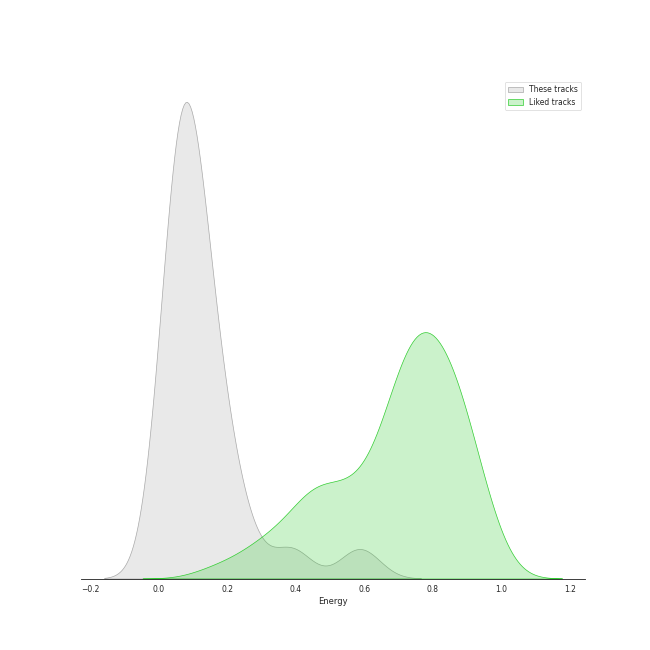

# Track Features for Sony Classical

## Danceability

| ​ | 10 most Danceable tracks | ​​ | 10 least Danceable tracks |
|:---|:---|:---|:---|
|  | Cantina Band (0.688) |  | Cello Suite No. 2 in D Minor, BWV 1008: IV. Sarabande (0.106) |
|  | The Imperial March (Darth Vader's Theme) (0.566) |  | Cello Suite No. 4 in E-Flat Major, BWV 1010: IV. Sarabande (0.108) |
|  | Attaboy (0.465) |  | Princess Leia's Theme (0.132) |
|  | Good Vibrations (0.415) |  | Cello Suite No. 6 in D Major, BWV 1012: II. Allemande (0.147) |
|  | Cello Suite No. 1 in G Major, BWV 1007: III. Courante (0.39) |  | Sayuri's Theme (0.149) |
|  | Cello Suite No. 2 in D Minor, BWV 1008: III. Courante (0.386) |  | Ave Maria (0.15) |
|  | Cello Suite No. 5 in C Minor, BWV 1011: V. Gavottes I & II (0.385) |  | Cello Suite No. 3 in C Major, BWV 1009: IV. Sarabande (0.16) |
|  | Cello Suite No. 3 in C Major, BWV 1009: III. Courante (0.384) |  | Cello Suite No. 1 in G Major, BWV 1007: IV. Sarabande (0.165) |
|  | Cello Suite No. 4 in E-Flat Major, BWV 1010: V. Bourrées I & II (0.379) |  | Cello Suite No. 1 in G Major, BWV 1007: II. Allemande (0.175) |
|  | Cello Suite No. 6 in D Major, BWV 1012: III. Courante (0.368) |  | Cello Suite No. 5 in C Minor, BWV 1011: II. Allemande (0.177) |

## Energy

| ​ | 10 most Energetic tracks | ​​ | 10 least Energetic tracks |
|:---|:---|:---|:---|
|  | Main Title/Rebel Blockade Runner - Medley (0.593) |  | Cello Suite No. 5 in C Minor, BWV 1011: IV. Sarabande (0.0141) |
|  | Cantina Band (0.582) |  | Cello Suite No. 1 in G Major, BWV 1007: IV. Sarabande (0.026) |
|  | The Imperial March (Darth Vader's Theme) (0.389) |  | Cello Suite No. 3 in C Major, BWV 1009: IV. Sarabande (0.031) |
|  | Attaboy (0.384) |  | Cello Suite No. 4 in E-Flat Major, BWV 1010: V. Bourrées I & II (0.0368) |
|  | Good Vibrations (0.248) |  | Cello Suite No. 5 in C Minor, BWV 1011: II. Allemande (0.039) |
|  | Cello Suite No. 2 in D Minor, BWV 1008: III. Courante (0.236) |  | Cello Suite No. 6 in D Major, BWV 1012: II. Allemande (0.0417) |
|  | Cello Suite No. 2 in D Minor, BWV 1008: VI. Gigue (0.224) |  | Cello Suite No. 2 in D Minor, BWV 1008: I. Prélude (0.0445) |
|  | Flying Theme (From "E.T. the Extra-Terrestrial") (0.19) |  | Cello Suite No. 4 in E-Flat Major, BWV 1010: II. Allemande (0.048) |
|  | Cello Suite No. 3 in C Major, BWV 1009: VI. Gigue (0.179) |  | Cello Suite No. 6 in D Major, BWV 1012: IV. Sarabande (0.0524) |
|  | Main Theme (From "Jaws") (0.173) |  | Cello Suite No. 1 in G Major, BWV 1007: V. Menuets I & II (0.0579) |

## Speechiness

| ​ | 10 most Speechy tracks | ​​ | 10 least Speechy tracks |
|:---|:---|:---|:---|
|  | Cantina Band (0.149) |  | The Imperial March (Darth Vader's Theme) (0.0301) |
|  | Cello Suite No. 1 in G Major, BWV 1007: I. Prélude (0.0688) |  | Good Vibrations (0.0339) |
|  | Jaws: Title Theme (0.0605) |  | Flying Theme (From "E.T. the Extra-Terrestrial") (0.0355) |
|  | Main Theme (From "Jaws") (0.0581) |  | All I Ask of You (0.0377) |
|  | Cello Suite No. 2 in D Minor, BWV 1008: II. Allemande (0.0578) |  | Attaboy (0.0379) |
|  | Cello Suite No. 6 in D Major, BWV 1012: I. Prélude (0.0577) |  | Cello Suite No. 1 in G Major, BWV 1007: IV. Sarabande (0.04) |
|  | Cello Suite No. 5 in C Minor, BWV 1011: VI. Gigue (0.0572) |  | Princess Leia's Theme (0.0405) |
|  | Cello Suite No. 6 in D Major, BWV 1012: V. Gavottes I & II (0.0555) |  | Ave Maria (0.0411) |
|  | Cello Suite No. 1 in G Major, BWV 1007: II. Allemande (0.0527) |  | Cello Suite No. 5 in C Minor, BWV 1011: III. Courante (0.0413) |
|  | Cello Suite No. 1 in G Major, BWV 1007: VI. Gigue (0.0525) |  | Cello Suite No. 3 in C Major, BWV 1009: VI. Gigue (0.0419) |

## Acousticness

| ​ | 10 most Acoustic tracks | ​​ | 10 least Acoustic tracks |
|:---|:---|:---|:---|
|  | Ave Maria (0.991) |  | Cantina Band (0.161) |
|  | All I Ask of You (0.98) |  | Main Title/Rebel Blockade Runner - Medley (0.361) |
|  | Cello Suite No. 6 in D Major, BWV 1012: II. Allemande (0.979) |  | Main Theme (From "Jaws") (0.742) |
|  | Cello Suite No. 6 in D Major, BWV 1012: I. Prélude (0.977) |  | Flying Theme (From "E.T. the Extra-Terrestrial") (0.772) |
|  | Cello Suite No. 2 in D Minor, BWV 1008: V. Menuets I & II (0.977) |  | The Imperial March (Darth Vader's Theme) (0.772) |
|  | Cello Suite No. 4 in E-Flat Major, BWV 1010: III. Courante (0.974) |  | Attaboy (0.823) |
|  | Cello Suite No. 5 in C Minor, BWV 1011: VI. Gigue (0.972) |  | Jaws: Title Theme (0.851) |
|  | Cello Suite No. 2 in D Minor, BWV 1008: VI. Gigue (0.971) |  | Good Vibrations (0.893) |
|  | Cello Suite No. 6 in D Major, BWV 1012: IV. Sarabande (0.969) |  | Cello Suite No. 3 in C Major, BWV 1009: IV. Sarabande (0.895) |
|  | Cello Suite No. 6 in D Major, BWV 1012: V. Gavottes I & II (0.968) |  | Cello Suite No. 1 in G Major, BWV 1007: I. Prélude (0.895) |

## Instrumentalness

| ​ | 10 most Instrumental tracks | ​​ | 10 least Instrumental tracks |
|:---|:---|:---|:---|
|  | Main Theme (From "Jaws") (0.959) |  | Cantina Band (0.00147) |
|  | Cello Suite No. 2 in D Minor, BWV 1008: I. Prélude (0.934) |  | All I Ask of You (0.00164) |
|  | Cello Suite No. 4 in E-Flat Major, BWV 1010: II. Allemande (0.93) |  | Good Vibrations (0.00336) |
|  | Cello Suite No. 2 in D Minor, BWV 1008: III. Courante (0.927) |  | Ave Maria (0.00671) |
|  | Cello Suite No. 4 in E-Flat Major, BWV 1010: I. Prélude (0.92) |  | The Imperial March (Darth Vader's Theme) (0.44) |
|  | Sayuri's Theme (0.919) |  | Cello Suite No. 6 in D Major, BWV 1012: II. Allemande (0.46) |
|  | Cello Suite No. 3 in C Major, BWV 1009: II. Allemande (0.914) |  | Main Title/Rebel Blockade Runner - Medley (0.595) |
|  | Jaws: Title Theme (0.91) |  | Cello Suite No. 6 in D Major, BWV 1012: I. Prélude (0.598) |
|  | Cello Suite No. 3 in C Major, BWV 1009: V. Bourrées I & II (0.907) |  | Cello Suite No. 6 in D Major, BWV 1012: V. Gavottes I & II (0.647) |
|  | Cello Suite No. 2 in D Minor, BWV 1008: II. Allemande (0.905) |  | Cello Suite No. 2 in D Minor, BWV 1008: V. Menuets I & II (0.661) |

## Liveness

| ​ | 10 most Live tracks | ​​ | 10 least Live tracks |
|:---|:---|:---|:---|
|  | Main Theme (From "Jaws") (0.5) |  | Cantina Band (0.0532) |
|  | Cello Suite No. 6 in D Major, BWV 1012: V. Gavottes I & II (0.399) |  | All I Ask of You (0.085) |
|  | Cello Suite No. 1 in G Major, BWV 1007: V. Menuets I & II (0.366) |  | Cello Suite No. 3 in C Major, BWV 1009: IV. Sarabande (0.097) |
|  | Cello Suite No. 3 in C Major, BWV 1009: VI. Gigue (0.342) |  | Main Title/Rebel Blockade Runner - Medley (0.0988) |
|  | Cello Suite No. 3 in C Major, BWV 1009: II. Allemande (0.341) |  | Cello Suite No. 5 in C Minor, BWV 1011: II. Allemande (0.0997) |
|  | Cello Suite No. 3 in C Major, BWV 1009: I. Prélude (0.333) |  | Princess Leia's Theme (0.102) |
|  | Cello Suite No. 2 in D Minor, BWV 1008: III. Courante (0.333) |  | Cello Suite No. 5 in C Minor, BWV 1011: IV. Sarabande (0.102) |
|  | Jaws: Title Theme (0.327) |  | Cello Suite No. 1 in G Major, BWV 1007: III. Courante (0.102) |
|  | Cello Suite No. 4 in E-Flat Major, BWV 1010: II. Allemande (0.237) |  | Cello Suite No. 5 in C Minor, BWV 1011: VI. Gigue (0.103) |
|  | Good Vibrations (0.23) |  | Cello Suite No. 4 in E-Flat Major, BWV 1010: IV. Sarabande (0.105) |

## Valence

| ​ | 10 most Happy tracks | ​​ | 10 least Happy tracks |
|:---|:---|:---|:---|
|  | Cello Suite No. 4 in E-Flat Major, BWV 1010: VI. Gigue (0.889) |  | Princess Leia's Theme (0.031) |
|  | Cello Suite No. 3 in C Major, BWV 1009: III. Courante (0.882) |  | Jaws: Title Theme (0.0386) |
|  | Cello Suite No. 2 in D Minor, BWV 1008: III. Courante (0.835) |  | Cello Suite No. 2 in D Minor, BWV 1008: IV. Sarabande (0.0414) |
|  | Cello Suite No. 6 in D Major, BWV 1012: V. Gavottes I & II (0.832) |  | Cello Suite No. 5 in C Minor, BWV 1011: IV. Sarabande (0.0553) |
|  | Cello Suite No. 1 in G Major, BWV 1007: VI. Gigue (0.806) |  | Ave Maria (0.0558) |
|  | Cello Suite No. 6 in D Major, BWV 1012: III. Courante (0.789) |  | Flying Theme (From "E.T. the Extra-Terrestrial") (0.0695) |
|  | Cello Suite No. 6 in D Major, BWV 1012: I. Prélude (0.77) |  | Cello Suite No. 4 in E-Flat Major, BWV 1010: IV. Sarabande (0.0741) |
|  | Cantina Band (0.754) |  | Main Theme (From "Jaws") (0.0857) |
|  | Cello Suite No. 2 in D Minor, BWV 1008: VI. Gigue (0.733) |  | Sayuri's Theme (0.0882) |
|  | Cello Suite No. 5 in C Minor, BWV 1011: III. Courante (0.713) |  | All I Ask of You (0.106) |

## Tempo

| ​ | 10 most Fast tracks | ​​ | 10 least Fast tracks |
|:---|:---|:---|:---|
|  | Cello Suite No. 6 in D Major, BWV 1012: V. Gavottes I & II (158.235) |  | Cello Suite No. 2 in D Minor, BWV 1008: V. Menuets I & II (65.461) |
|  | Cello Suite No. 4 in E-Flat Major, BWV 1010: V. Bourrées I & II (136.481) |  | Cello Suite No. 6 in D Major, BWV 1012: VI. Gigue (69.973) |
|  | Cello Suite No. 4 in E-Flat Major, BWV 1010: VI. Gigue (136.118) |  | Good Vibrations (74.177) |
|  | Cantina Band (131.501) |  | Cello Suite No. 5 in C Minor, BWV 1011: V. Gavottes I & II (75.333) |
|  | Cello Suite No. 1 in G Major, BWV 1007: V. Menuets I & II (130.735) |  | Cello Suite No. 1 in G Major, BWV 1007: I. Prélude (77.423) |
|  | Cello Suite No. 2 in D Minor, BWV 1008: II. Allemande (129.88) |  | Flying Theme (From "E.T. the Extra-Terrestrial") (78.962) |
|  | Attaboy (126.319) |  | Cello Suite No. 5 in C Minor, BWV 1011: IV. Sarabande (79.802) |
|  | Cello Suite No. 1 in G Major, BWV 1007: VI. Gigue (126.127) |  | Cello Suite No. 4 in E-Flat Major, BWV 1010: IV. Sarabande (80.739) |
|  | Cello Suite No. 5 in C Minor, BWV 1011: VI. Gigue (122.904) |  | Main Title/Rebel Blockade Runner - Medley (80.792) |
|  | Jaws: Title Theme (118.95) |  | Cello Suite No. 2 in D Minor, BWV 1008: VI. Gigue (81.72) |
