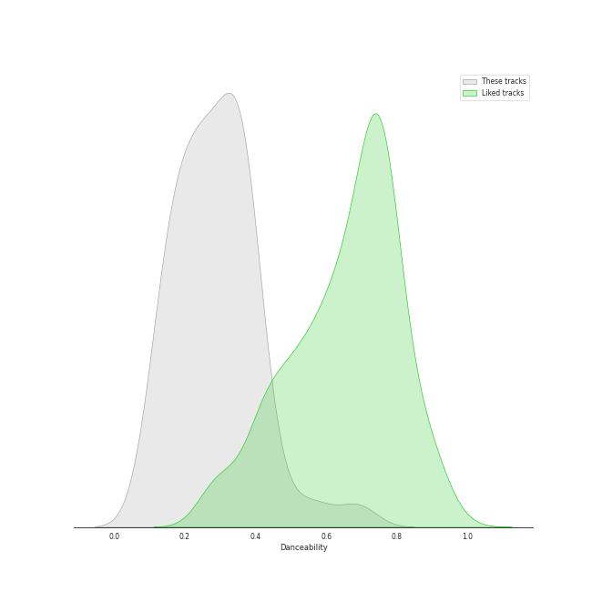
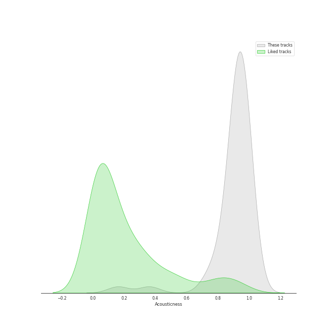
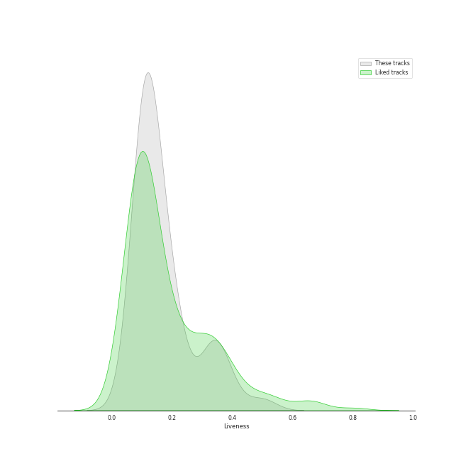

# Audio Features for Sony Classical

## Danceability

| 10 most Danceable tracks | 10 least Danceable tracks |
|:---|:---|
| Cello Suite No. 6 in D Major, BWV 1012: V. Gavottes I & II (0.434) | Cello Suite No. 5 in C Minor, BWV 1011: IV. Sarabande (0.0874) |
| Cello Suite No. 1 in G Major, BWV 1007: III. Courante (0.433) | Cello Suite No. 2 in D Minor, BWV 1008: IV. Sarabande (0.098) |
| Cello Suite No. 6 in D Major, BWV 1012: VI. Gigue (0.423) | Cello Suite No. 5 in C Minor, BWV 1011: II. Allemande (0.103) |
| Good Vibrations (0.415) | Cello Suite No. 1 in G Major, BWV 1007: IV. Sarabande (0.113) |
| Cello Suite No. 5 in C Minor, BWV 1011: V. Gavottes I & II (0.386) | Cello Suite No. 3 in C Major, BWV 1009: IV. Sarabande (0.12) |
| Cello Suite No. 3 in C Major, BWV 1009: III. Courante (0.38) | Cello Suite No. 4 in E-Flat Major, BWV 1010: IV. Sarabande (0.125) |
| Cello Suite No. 6 in D Major, BWV 1012: III. Courante (0.377) | Cello Suite No. 6 in D Major, BWV 1012: II. Allemande (0.141) |
| Cello Suite No. 4 in E-Flat Major, BWV 1010: V. Bourrées I & II (0.374) | Cello Suite No. 6 in D Major, BWV 1012: IV. Sarabande (0.142) |
| Cello Suite No. 2 in D Minor, BWV 1008: III. Courante (0.367) | Ave Maria (0.15) |
| Cello Suite No. 3 in C Major, BWV 1009: V. Bourrées I & II (0.363) | Cello Suite No. 1 in G Major, BWV 1007: II. Allemande (0.168) |

## Energy

| 10 most Energetic tracks | 10 least Energetic tracks |
|:---|:---|
| Good Vibrations (0.248) | Cello Suite No. 5 in C Minor, BWV 1011: IV. Sarabande (0.0169) |
| Cello Suite No. 2 in D Minor, BWV 1008: III. Courante (0.243) | Cello Suite No. 1 in G Major, BWV 1007: IV. Sarabande (0.0283) |
| Cello Suite No. 2 in D Minor, BWV 1008: VI. Gigue (0.213) | Cello Suite No. 3 in C Major, BWV 1009: IV. Sarabande (0.0336) |
| Cello Suite No. 3 in C Major, BWV 1009: VI. Gigue (0.18) | Cello Suite No. 4 in E-Flat Major, BWV 1010: V. Bourrées I & II (0.0428) |
| Cello Suite No. 6 in D Major, BWV 1012: I. Prélude (0.177) | Cello Suite No. 5 in C Minor, BWV 1011: II. Allemande (0.0447) |
| Cello Suite No. 3 in C Major, BWV 1009: III. Courante (0.157) | Cello Suite No. 2 in D Minor, BWV 1008: I. Prélude (0.0452) |
| Cello Suite No. 4 in E-Flat Major, BWV 1010: VI. Gigue (0.154) | Cello Suite No. 6 in D Major, BWV 1012: II. Allemande (0.0516) |
| Cello Suite No. 1 in G Major, BWV 1007: III. Courante (0.148) | Cello Suite No. 4 in E-Flat Major, BWV 1010: II. Allemande (0.0528) |
| Cello Suite No. 1 in G Major, BWV 1007: VI. Gigue (0.141) | Cello Suite No. 3 in C Major, BWV 1009: V. Bourrées I & II (0.0565) |
| Cello Suite No. 3 in C Major, BWV 1009: I. Prélude (0.139) | Cello Suite No. 6 in D Major, BWV 1012: IV. Sarabande (0.0603) |

## Speechiness

| 10 most Speechy tracks | 10 least Speechy tracks |
|:---|:---|
| Cello Suite No. 1 in G Major, BWV 1007: II. Allemande (0.0672) | Good Vibrations (0.0339) |
| Cello Suite No. 6 in D Major, BWV 1012: I. Prélude (0.0604) | All I Ask of You (0.0377) |
| Cello Suite No. 1 in G Major, BWV 1007: I. Prélude (0.0597) | Cello Suite No. 1 in G Major, BWV 1007: III. Courante (0.0381) |
| Cello Suite No. 1 in G Major, BWV 1007: VI. Gigue (0.0555) | Cello Suite No. 4 in E-Flat Major, BWV 1010: II. Allemande (0.0407) |
| Cello Suite No. 2 in D Minor, BWV 1008: II. Allemande (0.0538) | Ave Maria (0.0411) |
| Cello Suite No. 2 in D Minor, BWV 1008: V. Menuets I & II (0.0528) | Cello Suite No. 3 in C Major, BWV 1009: II. Allemande (0.0414) |
| Cello Suite No. 6 in D Major, BWV 1012: V. Gavottes I & II (0.0527) | Cello Suite No. 5 in C Minor, BWV 1011: III. Courante (0.0415) |
| Cello Suite No. 1 in G Major, BWV 1007: V. Menuets I & II (0.0511) | Cello Suite No. 3 in C Major, BWV 1009: I. Prélude (0.0416) |
| Cello Suite No. 5 in C Minor, BWV 1011: VI. Gigue (0.051) | Cello Suite No. 3 in C Major, BWV 1009: VI. Gigue (0.0417) |
| Cello Suite No. 2 in D Minor, BWV 1008: VI. Gigue (0.0507) | Cello Suite No. 5 in C Minor, BWV 1011: I. Prélude (0.0421) |

## Acousticness

| 10 most Acoustic tracks | 10 least Acoustic tracks |
|:---|:---|
| Ave Maria (0.991) | Good Vibrations (0.893) |
| Cello Suite No. 6 in D Major, BWV 1012: I. Prélude (0.982) | Cello Suite No. 1 in G Major, BWV 1007: I. Prélude (0.9) |
| Cello Suite No. 6 in D Major, BWV 1012: II. Allemande (0.981) | Cello Suite No. 1 in G Major, BWV 1007: II. Allemande (0.914) |
| Cello Suite No. 2 in D Minor, BWV 1008: V. Menuets I & II (0.98) | Cello Suite No. 3 in C Major, BWV 1009: IV. Sarabande (0.916) |
| All I Ask of You (0.98) | Cello Suite No. 2 in D Minor, BWV 1008: IV. Sarabande (0.923) |
| Cello Suite No. 6 in D Major, BWV 1012: V. Gavottes I & II (0.978) | Cello Suite No. 3 in C Major, BWV 1009: I. Prélude (0.925) |
| Cello Suite No. 2 in D Minor, BWV 1008: VI. Gigue (0.977) | Cello Suite No. 1 in G Major, BWV 1007: IV. Sarabande (0.926) |
| Cello Suite No. 4 in E-Flat Major, BWV 1010: III. Courante (0.974) | Cello Suite No. 3 in C Major, BWV 1009: II. Allemande (0.931) |
| Cello Suite No. 6 in D Major, BWV 1012: VI. Gigue (0.973) | Cello Suite No. 1 in G Major, BWV 1007: VI. Gigue (0.934) |
| Cello Suite No. 4 in E-Flat Major, BWV 1010: II. Allemande (0.971) | Cello Suite No. 3 in C Major, BWV 1009: III. Courante (0.935) |

## Instrumentalness

| 10 most Instrumental tracks | 10 least Instrumental tracks |
|:---|:---|
| Cello Suite No. 2 in D Minor, BWV 1008: I. Prélude (0.934) | All I Ask of You (0.00164) |
| Cello Suite No. 2 in D Minor, BWV 1008: III. Courante (0.933) | Good Vibrations (0.00336) |
| Cello Suite No. 2 in D Minor, BWV 1008: II. Allemande (0.928) | Ave Maria (0.00671) |
| Cello Suite No. 5 in C Minor, BWV 1011: II. Allemande (0.918) | Cello Suite No. 6 in D Major, BWV 1012: II. Allemande (0.605) |
| Cello Suite No. 4 in E-Flat Major, BWV 1010: III. Courante (0.917) | Cello Suite No. 6 in D Major, BWV 1012: I. Prélude (0.628) |
| Cello Suite No. 3 in C Major, BWV 1009: V. Bourrées I & II (0.91) | Cello Suite No. 2 in D Minor, BWV 1008: V. Menuets I & II (0.748) |
| Cello Suite No. 2 in D Minor, BWV 1008: VI. Gigue (0.908) | Cello Suite No. 5 in C Minor, BWV 1011: III. Courante (0.772) |
| Cello Suite No. 5 in C Minor, BWV 1011: VI. Gigue (0.906) | Cello Suite No. 5 in C Minor, BWV 1011: IV. Sarabande (0.773) |
| Cello Suite No. 6 in D Major, BWV 1012: III. Courante (0.903) | Cello Suite No. 3 in C Major, BWV 1009: III. Courante (0.802) |
| Cello Suite No. 1 in G Major, BWV 1007: II. Allemande (0.901) | Cello Suite No. 6 in D Major, BWV 1012: IV. Sarabande (0.82) |

## Liveness

| 10 most Live tracks | 10 least Live tracks |
|:---|:---|
| Cello Suite No. 6 in D Major, BWV 1012: V. Gavottes I & II (0.407) | Cello Suite No. 1 in G Major, BWV 1007: I. Prélude (0.0762) |
| Cello Suite No. 4 in E-Flat Major, BWV 1010: II. Allemande (0.26) | All I Ask of You (0.085) |
| Cello Suite No. 3 in C Major, BWV 1009: I. Prélude (0.255) | Cello Suite No. 5 in C Minor, BWV 1011: II. Allemande (0.0959) |
| Cello Suite No. 1 in G Major, BWV 1007: V. Menuets I & II (0.24) | Cello Suite No. 5 in C Minor, BWV 1011: VI. Gigue (0.103) |
| Good Vibrations (0.23) | Cello Suite No. 1 in G Major, BWV 1007: II. Allemande (0.103) |
| Cello Suite No. 3 in C Major, BWV 1009: VI. Gigue (0.218) | Cello Suite No. 1 in G Major, BWV 1007: IV. Sarabande (0.103) |
| Ave Maria (0.208) | Cello Suite No. 3 in C Major, BWV 1009: IV. Sarabande (0.106) |
| Cello Suite No. 2 in D Minor, BWV 1008: III. Courante (0.196) | Cello Suite No. 6 in D Major, BWV 1012: IV. Sarabande (0.107) |
| Cello Suite No. 6 in D Major, BWV 1012: VI. Gigue (0.187) | Cello Suite No. 4 in E-Flat Major, BWV 1010: IV. Sarabande (0.107) |
| Cello Suite No. 3 in C Major, BWV 1009: II. Allemande (0.174) | Cello Suite No. 5 in C Minor, BWV 1011: I. Prélude (0.107) |

## Valence

| 10 most Happy tracks | 10 least Happy tracks |
|:---|:---|
| Cello Suite No. 3 in C Major, BWV 1009: III. Courante (0.871) | Cello Suite No. 2 in D Minor, BWV 1008: IV. Sarabande (0.0495) |
| Cello Suite No. 4 in E-Flat Major, BWV 1010: VI. Gigue (0.869) | Cello Suite No. 5 in C Minor, BWV 1011: IV. Sarabande (0.05) |
| Cello Suite No. 2 in D Minor, BWV 1008: III. Courante (0.852) | Ave Maria (0.0558) |
| Cello Suite No. 6 in D Major, BWV 1012: V. Gavottes I & II (0.82) | Cello Suite No. 4 in E-Flat Major, BWV 1010: IV. Sarabande (0.0836) |
| Cello Suite No. 6 in D Major, BWV 1012: III. Courante (0.76) | All I Ask of You (0.106) |
| Cello Suite No. 2 in D Minor, BWV 1008: VI. Gigue (0.759) | Cello Suite No. 6 in D Major, BWV 1012: IV. Sarabande (0.107) |
| Cello Suite No. 1 in G Major, BWV 1007: VI. Gigue (0.742) | Cello Suite No. 3 in C Major, BWV 1009: IV. Sarabande (0.135) |
| Cello Suite No. 6 in D Major, BWV 1012: I. Prélude (0.733) | Cello Suite No. 1 in G Major, BWV 1007: IV. Sarabande (0.187) |
| Cello Suite No. 5 in C Minor, BWV 1011: III. Courante (0.728) | Cello Suite No. 5 in C Minor, BWV 1011: II. Allemande (0.205) |
| Cello Suite No. 4 in E-Flat Major, BWV 1010: II. Allemande (0.705) | Cello Suite No. 2 in D Minor, BWV 1008: I. Prélude (0.226) |

## Tempo

| 10 most Fast tracks | 10 least Fast tracks |
|:---|:---|
| Cello Suite No. 5 in C Minor, BWV 1011: II. Allemande (171.555) | Cello Suite No. 3 in C Major, BWV 1009: II. Allemande (56.213) |
| Cello Suite No. 1 in G Major, BWV 1007: II. Allemande (168.37) | Cello Suite No. 2 in D Minor, BWV 1008: V. Menuets I & II (66.628) |
| Cello Suite No. 1 in G Major, BWV 1007: IV. Sarabande (163.78) | Cello Suite No. 6 in D Major, BWV 1012: VI. Gigue (70.596) |
| Cello Suite No. 4 in E-Flat Major, BWV 1010: V. Bourrées I & II (138.02) | Good Vibrations (74.177) |
| Cello Suite No. 1 in G Major, BWV 1007: V. Menuets I & II (127.781) | Cello Suite No. 5 in C Minor, BWV 1011: V. Gavottes I & II (74.812) |
| Cello Suite No. 1 in G Major, BWV 1007: VI. Gigue (126.815) | Cello Suite No. 1 in G Major, BWV 1007: I. Prélude (75.02) |
| Cello Suite No. 2 in D Minor, BWV 1008: I. Prélude (123.673) | Cello Suite No. 2 in D Minor, BWV 1008: VI. Gigue (76.557) |
| Cello Suite No. 6 in D Major, BWV 1012: III. Courante (118.529) | Cello Suite No. 6 in D Major, BWV 1012: V. Gavottes I & II (79.847) |
| Cello Suite No. 5 in C Minor, BWV 1011: VI. Gigue (117.846) | Cello Suite No. 2 in D Minor, BWV 1008: II. Allemande (80.493) |
| Cello Suite No. 2 in D Minor, BWV 1008: III. Courante (114.963) | Cello Suite No. 5 in C Minor, BWV 1011: III. Courante (80.848) |
