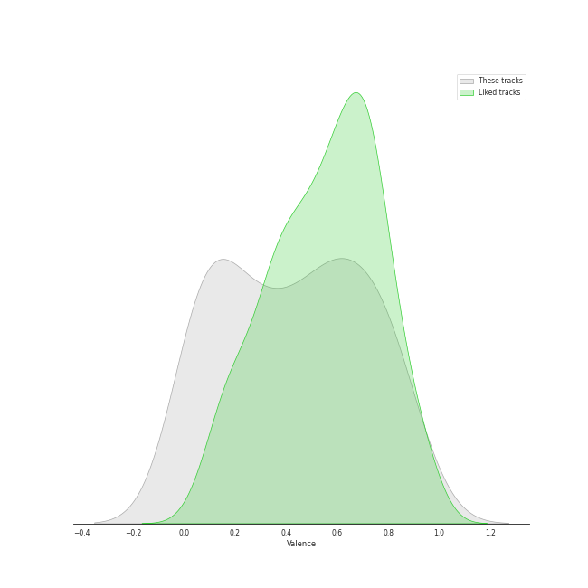
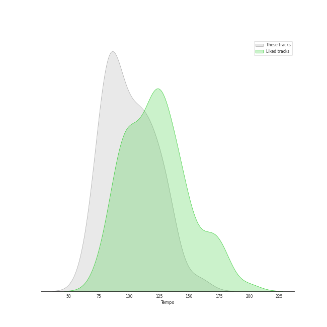

# Audio Features for Sony Classical

## Danceability

| ​ | 10 most Danceable tracks | ​​ | 10 least Danceable tracks |
|:---|:---|:---|:---|
|  | Cello Suite No. 6 in D Major, BWV 1012: V. Gavottes I & II (0.434) |  | Cello Suite No. 5 in C Minor, BWV 1011: IV. Sarabande (0.0874) |
|  | Cello Suite No. 1 in G Major, BWV 1007: III. Courante (0.433) |  | Cello Suite No. 2 in D Minor, BWV 1008: IV. Sarabande (0.098) |
|  | Cello Suite No. 6 in D Major, BWV 1012: VI. Gigue (0.423) |  | Cello Suite No. 5 in C Minor, BWV 1011: II. Allemande (0.103) |
|  | Good Vibrations (0.415) |  | Cello Suite No. 1 in G Major, BWV 1007: IV. Sarabande (0.113) |
|  | Cello Suite No. 5 in C Minor, BWV 1011: V. Gavottes I & II (0.386) |  | Cello Suite No. 3 in C Major, BWV 1009: IV. Sarabande (0.12) |
|  | Cello Suite No. 3 in C Major, BWV 1009: III. Courante (0.38) |  | Cello Suite No. 4 in E-Flat Major, BWV 1010: IV. Sarabande (0.125) |
|  | Cello Suite No. 6 in D Major, BWV 1012: III. Courante (0.377) |  | Cello Suite No. 6 in D Major, BWV 1012: II. Allemande (0.141) |
|  | Cello Suite No. 4 in E-Flat Major, BWV 1010: V. Bourrées I & II (0.374) |  | Cello Suite No. 6 in D Major, BWV 1012: IV. Sarabande (0.142) |
|  | Cello Suite No. 2 in D Minor, BWV 1008: III. Courante (0.367) |  | Ave Maria (0.15) |
|  | Cello Suite No. 3 in C Major, BWV 1009: V. Bourrées I & II (0.363) |  | Cello Suite No. 1 in G Major, BWV 1007: II. Allemande (0.168) |

## Energy

| ​ | 10 most Energetic tracks | ​​ | 10 least Energetic tracks |
|:---|:---|:---|:---|
|  | Good Vibrations (0.248) |  | Cello Suite No. 5 in C Minor, BWV 1011: IV. Sarabande (0.0169) |
|  | Cello Suite No. 2 in D Minor, BWV 1008: III. Courante (0.243) |  | Cello Suite No. 1 in G Major, BWV 1007: IV. Sarabande (0.0283) |
|  | Cello Suite No. 2 in D Minor, BWV 1008: VI. Gigue (0.213) |  | Cello Suite No. 3 in C Major, BWV 1009: IV. Sarabande (0.0336) |
|  | Cello Suite No. 3 in C Major, BWV 1009: VI. Gigue (0.18) |  | Cello Suite No. 4 in E-Flat Major, BWV 1010: V. Bourrées I & II (0.0428) |
|  | Cello Suite No. 6 in D Major, BWV 1012: I. Prélude (0.177) |  | Cello Suite No. 5 in C Minor, BWV 1011: II. Allemande (0.0447) |
|  | Cello Suite No. 3 in C Major, BWV 1009: III. Courante (0.157) |  | Cello Suite No. 2 in D Minor, BWV 1008: I. Prélude (0.0452) |
|  | Cello Suite No. 4 in E-Flat Major, BWV 1010: VI. Gigue (0.154) |  | Cello Suite No. 6 in D Major, BWV 1012: II. Allemande (0.0516) |
|  | Cello Suite No. 1 in G Major, BWV 1007: III. Courante (0.148) |  | Cello Suite No. 4 in E-Flat Major, BWV 1010: II. Allemande (0.0528) |
|  | Cello Suite No. 1 in G Major, BWV 1007: VI. Gigue (0.141) |  | Cello Suite No. 3 in C Major, BWV 1009: V. Bourrées I & II (0.0565) |
|  | Cello Suite No. 3 in C Major, BWV 1009: I. Prélude (0.139) |  | Cello Suite No. 6 in D Major, BWV 1012: IV. Sarabande (0.0603) |

## Speechiness

| ​ | 10 most Speechy tracks | ​​ | 10 least Speechy tracks |
|:---|:---|:---|:---|
|  | Cello Suite No. 1 in G Major, BWV 1007: II. Allemande (0.0672) |  | Good Vibrations (0.0339) |
|  | Cello Suite No. 6 in D Major, BWV 1012: I. Prélude (0.0604) |  | All I Ask of You (0.0377) |
|  | Cello Suite No. 1 in G Major, BWV 1007: I. Prélude (0.0597) |  | Cello Suite No. 1 in G Major, BWV 1007: III. Courante (0.0381) |
|  | Cello Suite No. 1 in G Major, BWV 1007: VI. Gigue (0.0555) |  | Cello Suite No. 4 in E-Flat Major, BWV 1010: II. Allemande (0.0407) |
|  | Cello Suite No. 2 in D Minor, BWV 1008: II. Allemande (0.0538) |  | Ave Maria (0.0411) |
|  | Cello Suite No. 2 in D Minor, BWV 1008: V. Menuets I & II (0.0528) |  | Cello Suite No. 3 in C Major, BWV 1009: II. Allemande (0.0414) |
|  | Cello Suite No. 6 in D Major, BWV 1012: V. Gavottes I & II (0.0527) |  | Cello Suite No. 5 in C Minor, BWV 1011: III. Courante (0.0415) |
|  | Cello Suite No. 1 in G Major, BWV 1007: V. Menuets I & II (0.0511) |  | Cello Suite No. 3 in C Major, BWV 1009: I. Prélude (0.0416) |
|  | Cello Suite No. 5 in C Minor, BWV 1011: VI. Gigue (0.051) |  | Cello Suite No. 3 in C Major, BWV 1009: VI. Gigue (0.0417) |
|  | Cello Suite No. 2 in D Minor, BWV 1008: VI. Gigue (0.0507) |  | Cello Suite No. 5 in C Minor, BWV 1011: I. Prélude (0.0421) |

## Acousticness

| ​ | 10 most Acoustic tracks | ​​ | 10 least Acoustic tracks |
|:---|:---|:---|:---|
|  | Ave Maria (0.991) |  | Good Vibrations (0.893) |
|  | Cello Suite No. 6 in D Major, BWV 1012: I. Prélude (0.982) |  | Cello Suite No. 1 in G Major, BWV 1007: I. Prélude (0.9) |
|  | Cello Suite No. 6 in D Major, BWV 1012: II. Allemande (0.981) |  | Cello Suite No. 1 in G Major, BWV 1007: II. Allemande (0.914) |
|  | Cello Suite No. 2 in D Minor, BWV 1008: V. Menuets I & II (0.98) |  | Cello Suite No. 3 in C Major, BWV 1009: IV. Sarabande (0.916) |
|  | All I Ask of You (0.98) |  | Cello Suite No. 2 in D Minor, BWV 1008: IV. Sarabande (0.923) |
|  | Cello Suite No. 6 in D Major, BWV 1012: V. Gavottes I & II (0.978) |  | Cello Suite No. 3 in C Major, BWV 1009: I. Prélude (0.925) |
|  | Cello Suite No. 2 in D Minor, BWV 1008: VI. Gigue (0.977) |  | Cello Suite No. 1 in G Major, BWV 1007: IV. Sarabande (0.926) |
|  | Cello Suite No. 4 in E-Flat Major, BWV 1010: III. Courante (0.974) |  | Cello Suite No. 3 in C Major, BWV 1009: II. Allemande (0.931) |
|  | Cello Suite No. 6 in D Major, BWV 1012: VI. Gigue (0.973) |  | Cello Suite No. 1 in G Major, BWV 1007: VI. Gigue (0.934) |
|  | Cello Suite No. 4 in E-Flat Major, BWV 1010: II. Allemande (0.971) |  | Cello Suite No. 3 in C Major, BWV 1009: III. Courante (0.935) |

## Instrumentalness

| ​ | 10 most Instrumental tracks | ​​ | 10 least Instrumental tracks |
|:---|:---|:---|:---|
|  | Cello Suite No. 2 in D Minor, BWV 1008: I. Prélude (0.934) |  | All I Ask of You (0.00164) |
|  | Cello Suite No. 2 in D Minor, BWV 1008: III. Courante (0.933) |  | Good Vibrations (0.00336) |
|  | Cello Suite No. 2 in D Minor, BWV 1008: II. Allemande (0.928) |  | Ave Maria (0.00671) |
|  | Cello Suite No. 5 in C Minor, BWV 1011: II. Allemande (0.918) |  | Cello Suite No. 6 in D Major, BWV 1012: II. Allemande (0.605) |
|  | Cello Suite No. 4 in E-Flat Major, BWV 1010: III. Courante (0.917) |  | Cello Suite No. 6 in D Major, BWV 1012: I. Prélude (0.628) |
|  | Cello Suite No. 3 in C Major, BWV 1009: V. Bourrées I & II (0.91) |  | Cello Suite No. 2 in D Minor, BWV 1008: V. Menuets I & II (0.748) |
|  | Cello Suite No. 2 in D Minor, BWV 1008: VI. Gigue (0.908) |  | Cello Suite No. 5 in C Minor, BWV 1011: III. Courante (0.772) |
|  | Cello Suite No. 5 in C Minor, BWV 1011: VI. Gigue (0.906) |  | Cello Suite No. 5 in C Minor, BWV 1011: IV. Sarabande (0.773) |
|  | Cello Suite No. 6 in D Major, BWV 1012: III. Courante (0.903) |  | Cello Suite No. 3 in C Major, BWV 1009: III. Courante (0.802) |
|  | Cello Suite No. 1 in G Major, BWV 1007: II. Allemande (0.901) |  | Cello Suite No. 6 in D Major, BWV 1012: IV. Sarabande (0.82) |

## Liveness

| ​ | 10 most Live tracks | ​​ | 10 least Live tracks |
|:---|:---|:---|:---|
|  | Cello Suite No. 6 in D Major, BWV 1012: V. Gavottes I & II (0.407) |  | Cello Suite No. 1 in G Major, BWV 1007: I. Prélude (0.0762) |
|  | Cello Suite No. 4 in E-Flat Major, BWV 1010: II. Allemande (0.26) |  | All I Ask of You (0.085) |
|  | Cello Suite No. 3 in C Major, BWV 1009: I. Prélude (0.255) |  | Cello Suite No. 5 in C Minor, BWV 1011: II. Allemande (0.0959) |
|  | Cello Suite No. 1 in G Major, BWV 1007: V. Menuets I & II (0.24) |  | Cello Suite No. 5 in C Minor, BWV 1011: VI. Gigue (0.103) |
|  | Good Vibrations (0.23) |  | Cello Suite No. 1 in G Major, BWV 1007: II. Allemande (0.103) |
|  | Cello Suite No. 3 in C Major, BWV 1009: VI. Gigue (0.218) |  | Cello Suite No. 1 in G Major, BWV 1007: IV. Sarabande (0.103) |
|  | Ave Maria (0.208) |  | Cello Suite No. 3 in C Major, BWV 1009: IV. Sarabande (0.106) |
|  | Cello Suite No. 2 in D Minor, BWV 1008: III. Courante (0.196) |  | Cello Suite No. 6 in D Major, BWV 1012: IV. Sarabande (0.107) |
|  | Cello Suite No. 6 in D Major, BWV 1012: VI. Gigue (0.187) |  | Cello Suite No. 4 in E-Flat Major, BWV 1010: IV. Sarabande (0.107) |
|  | Cello Suite No. 3 in C Major, BWV 1009: II. Allemande (0.174) |  | Cello Suite No. 5 in C Minor, BWV 1011: I. Prélude (0.107) |

## Valence

| ​ | 10 most Happy tracks | ​​ | 10 least Happy tracks |
|:---|:---|:---|:---|
|  | Cello Suite No. 3 in C Major, BWV 1009: III. Courante (0.871) |  | Cello Suite No. 2 in D Minor, BWV 1008: IV. Sarabande (0.0495) |
|  | Cello Suite No. 4 in E-Flat Major, BWV 1010: VI. Gigue (0.869) |  | Cello Suite No. 5 in C Minor, BWV 1011: IV. Sarabande (0.05) |
|  | Cello Suite No. 2 in D Minor, BWV 1008: III. Courante (0.852) |  | Ave Maria (0.0558) |
|  | Cello Suite No. 6 in D Major, BWV 1012: V. Gavottes I & II (0.82) |  | Cello Suite No. 4 in E-Flat Major, BWV 1010: IV. Sarabande (0.0836) |
|  | Cello Suite No. 6 in D Major, BWV 1012: III. Courante (0.76) |  | All I Ask of You (0.106) |
|  | Cello Suite No. 2 in D Minor, BWV 1008: VI. Gigue (0.759) |  | Cello Suite No. 6 in D Major, BWV 1012: IV. Sarabande (0.107) |
|  | Cello Suite No. 1 in G Major, BWV 1007: VI. Gigue (0.742) |  | Cello Suite No. 3 in C Major, BWV 1009: IV. Sarabande (0.135) |
|  | Cello Suite No. 6 in D Major, BWV 1012: I. Prélude (0.733) |  | Cello Suite No. 1 in G Major, BWV 1007: IV. Sarabande (0.187) |
|  | Cello Suite No. 5 in C Minor, BWV 1011: III. Courante (0.728) |  | Cello Suite No. 5 in C Minor, BWV 1011: II. Allemande (0.205) |
|  | Cello Suite No. 4 in E-Flat Major, BWV 1010: II. Allemande (0.705) |  | Cello Suite No. 2 in D Minor, BWV 1008: I. Prélude (0.226) |

## Tempo

| ​ | 10 most Fast tracks | ​​ | 10 least Fast tracks |
|:---|:---|:---|:---|
|  | Cello Suite No. 5 in C Minor, BWV 1011: II. Allemande (171.555) |  | Cello Suite No. 3 in C Major, BWV 1009: II. Allemande (56.213) |
|  | Cello Suite No. 1 in G Major, BWV 1007: II. Allemande (168.37) |  | Cello Suite No. 2 in D Minor, BWV 1008: V. Menuets I & II (66.628) |
|  | Cello Suite No. 1 in G Major, BWV 1007: IV. Sarabande (163.78) |  | Cello Suite No. 6 in D Major, BWV 1012: VI. Gigue (70.596) |
|  | Cello Suite No. 4 in E-Flat Major, BWV 1010: V. Bourrées I & II (138.02) |  | Good Vibrations (74.177) |
|  | Cello Suite No. 1 in G Major, BWV 1007: V. Menuets I & II (127.781) |  | Cello Suite No. 5 in C Minor, BWV 1011: V. Gavottes I & II (74.812) |
|  | Cello Suite No. 1 in G Major, BWV 1007: VI. Gigue (126.815) |  | Cello Suite No. 1 in G Major, BWV 1007: I. Prélude (75.02) |
|  | Cello Suite No. 2 in D Minor, BWV 1008: I. Prélude (123.673) |  | Cello Suite No. 2 in D Minor, BWV 1008: VI. Gigue (76.557) |
|  | Cello Suite No. 6 in D Major, BWV 1012: III. Courante (118.529) |  | Cello Suite No. 6 in D Major, BWV 1012: V. Gavottes I & II (79.847) |
|  | Cello Suite No. 5 in C Minor, BWV 1011: VI. Gigue (117.846) |  | Cello Suite No. 2 in D Minor, BWV 1008: II. Allemande (80.493) |
|  | Cello Suite No. 2 in D Minor, BWV 1008: III. Courante (114.963) |  | Cello Suite No. 5 in C Minor, BWV 1011: III. Courante (80.848) |
